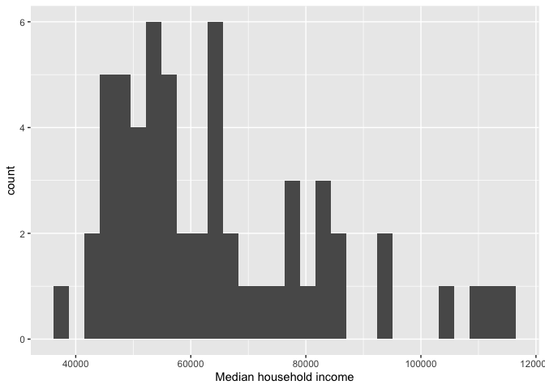
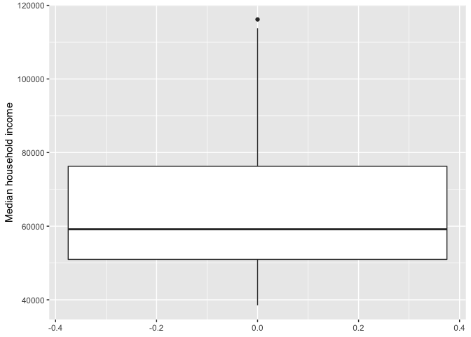
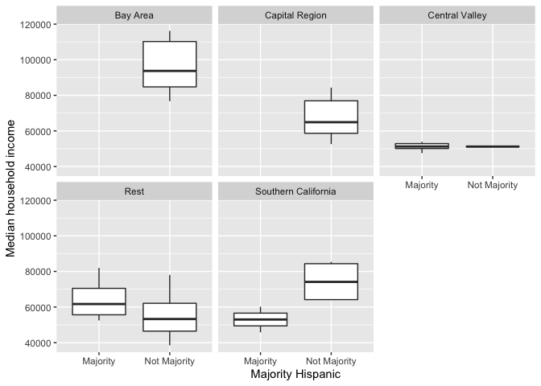

<style>
p.comment {
background-color: #bdced6;
padding: 10px;
border: 0px solid black;
margin-left: 25px;
border-radius: 5px;
font-style: normal;
}

h1.title {
  font-weight: bold;
  font-family: Arial;  
}

h2.title {
  font-family: Arial;  
}

</style>


<style type="text/css">
#TOC {
  font-size: 13px;
  font-family: Arial;
}
</style>


\


In this guide you will learn how to work with data from the United States Census, the leading source for timely and relevant information about communities.  You will also learn how to download, clean, manage and summarize non-spatial data using R. The objectives of the guide are as follows

1. Learn how to download Census data using the Census API
2. Learn how to read data into R
3. Learn data wrangling functions
4. Learn how to summarize data using descriptive statistics and graphs

This lab guide follows closely and supplements the material presented in Chapters 1, 3, 5, 8-10, 14 and 22 in the textbook [R for Data Science](http://r4ds.had.co.nz/index.html) (RDS).


<div style="margin-bottom:25px;">
</div>
## **Open up a R Markdown file**
\

Rather than working directly from the R console, I recommended typing in lab code into an R Markdown and working from there.  This will give you more practice and experience working in the R Markdown environment, which you will need to do for all of your assignments.  Plus you can add your own comments to the code to ensure that you're understanding what is being done. To open up an R Markdown file, select File, New File and R Markdown. Give a title (e.g. Lab 2) and your name and then click OK. For a rundown on the use of R Markdown, see the [assignment guidelines](https://crd230.github.io/hw_guidelines.html).


<div style="margin-bottom:25px;">
</div>
## **Installing packages**
\

You'll need to install the following packages in R.  You only need to do this once, so if you've already installed this package, skip the code.  Also, don't put the `install.packages()` in your R Markdown document. You only need to install once and never more. Copy and paste the code in your R Console.


```r
install.packages("tidycensus")
install.packages("ipumsr")
```


<div style="margin-bottom:25px;">
</div>
## **Loading packages**
\

We will be using the **tidyverse** package in this lab. We already installed the package in [Lab 1](https://crd230.github.io/lab1.html), so we don't need to install it again.  We need to load it and the packages we installed above using the function `library()`. Remember, install once, load every time.


```r
library(tidyverse)
library(tidycensus)
library(ipumsr)
```


<div style="margin-bottom:25px;">
</div>
## **Downloading Census Data**
\

The primary source of data that we'll be using in this class is the United States Census. There are two ways to bring Census data into R. 


<div style="margin-bottom:25px;">
</div>
### **Downloading from an online source**
\

The first way to obtain Census data is to download them directly from the web onto your hard drive.  There are several websites where you can download Census data including [Social Explorer](https://www.socialexplorer.com/) and [PolicyMap](https://ucdavis.policymap.com/maps), which as UC Davis affiliates we have free access to, and the [National Historical Geographic Information System (NHGIS)](https://www.nhgis.org/), which are free for everyone.  To save us time, I've uploaded PolicyMap csv and NHGIS zip files on Canvas (Files -> Week 2 -> Lab) for you to use in this lab. Save these files in the same folder where your Lab 2 R Markdown file resides.  The PolicyMap file contains percent of residents with a college degree for California counties. The NHGIS file contains residents by nativity status for California counties.  Both data are from the 2014-18 American Community Survey. We will read these data into R a little later. To find out how to download data from PolicyMap and NHGIS, check out my brief tutorials [here](https://crd230.github.io/policymap.html) and [here](https://crd230.github.io/nhgis.html).


<div style="margin-bottom:25px;">
</div>
### **Using the Census API**
\

The other way to bring Census data into R is to use the [Census Application Program Interface  (API)](https://www.census.gov/data/developers/guidance/api-user-guide.What_is_the_API.html).  An API allows for direct requests for data in machine-readable form.  That is, rather than you having to navigate to some website, scroll around to find a dataset, download that dataset once you find it, save that data onto your hard drive, and then bring the data into R, you just tell R to retrieve data directly from the source using one or two lines of code.  

In order to directly download data from the Census API, you need a key.  You can sign up for a free key [here](http://api.census.gov/data/key_signup.html), which you should have already done before the lab. Type your key in quotes using the `census_api_key()` command.


```r
census_api_key("YOUR API KEY GOES HERE", install = TRUE)
```

The option `install = TRUE` saves the API key in your R environment, which means you don't have to run `census_api_key()` every single time. The function for downloading American Community Survey (ACS) Census data is `get_acs()`. The command for downloading decennial Census data is `get_decennial()`.  Both functions come from the **tidycensus** package. Getting variables using the Census API requires knowing the variable ID - and there are thousands of variables (and thus thousands of IDs) across the different Census files. To rapidly search for variables, use the commands `load_variables()` and `View()`. Because we'll be using the ACS in this guide, let's check the variables in the most recent 5-year ACS (2014-2018) using the following commands.


```r
v18 <- load_variables(2018, "acs5", cache = TRUE)
View(v18)
```

A window should have popped up showing you a record layout of the 2014-18 ACS.  To search for specific data, select "Filter" located at the top left of this window and use the search boxes that pop up.  For example, type in "Hispanic" in the box under "Label".  You should see near the top of the list the first set of variables we'll want to download - race/ethnicity.  Another way of finding variable names is to search them using [Social Explorer](https://www.socialexplorer.com/data/metadata/).  Click on the appropriate survey data year and then "American Community Survey Tables", which will take you to a list of variables with their Census IDs.

Let's extract race/ethnicity data and total population for [California counties](https://en.wikipedia.org/wiki/List_of_counties_in_California) using the `get_acs()` command


```r
ca <- get_acs(geography = "county", 
              year = 2018,
              variables = c(tpopr = "B03002_001", 
                            nhwhite = "B03002_003", nhblk = "B03002_004", 
                            nhasn = "B03002_006", hisp = "B03002_012"), 
              state = "CA",
              survey = "acs5")
```

In the above code, we specified the following arguments


* `geography`: The level of geography we want the data in; in our case, the county. Other geographic options can be found [here](https://walkerke.github.io/tidycensus/articles/basic-usage.html#geography-in-tidycensus). 
* `year`: The end year of the data (because we want 2014-2018, we use 2018).
* `variables`: The variables we want to bring in as specified in a vector you create using the function `c()`. Note that we created variable names of our own (e.g. "nhwhite") and we put the ACS IDs in quotes ("B03002_003"). Had we not done this, the variable names will come in as they are named in the ACS, which are not very descriptive.
* `state`: We can filter the counties to those in a specific state.  Here it is "CA" for California.  If we don't specify this, we get all counties in the United States. 
* `survey`: The specific Census survey were extracting data from.  We want data from the 5-year American Community Survey, so we specify "acs5". The ACS comes in 1- and 5-year varieties.  

Type in `? get_acs()` to see the full list of options. 

Whenever you bring in a dataset, the first thing you should always do is view it just to make sure you got what you expected. One way of doing this is to use the `glimpse()` command


```r
glimpse(ca)
```

```
## Rows: 290
## Columns: 5
## $ GEOID    <chr> "06001", "06001", "06001", "06001", "06001", "06003", "06003…
## $ NAME     <chr> "Alameda County, California", "Alameda County, California", …
## $ variable <chr> "tpopr", "nhwhite", "nhblk", "nhasn", "hisp", "tpopr", "nhwh…
## $ estimate <dbl> 1643700, 523391, 172329, 483067, 369061, 1146, 678, 9, 8, 10…
## $ moe      <dbl> NA, 408, 1410, 1874, NA, 161, 152, 20, 16, 57, NA, 17, 128, …
```


You get a quick, compact summary of your tibble. The function takes one argument: the name of a data frame or tibble. It then tells us how many rows it has, how many variables there are, what these variables are called, and what kind of data are associated with each variable. This function is useful when we’re working with a data set containing many variables.


<p class="comment">**Question**: What is the Census variable ID for median household income?</p>


<div style="margin-bottom:25px;">
</div>
## **Reading in data**
\

Getting data directly into R through an API is super cool and convenient, but you'll have to download and read in most data without an API.  Most data files you will encounter are comma-delimited (or comma-separated) files, which have .csv extensions.  Comma-delimited means that columns are separated by commas.  The files from PolicyMap and NHGIS are .csv files.  

To read in a csv file, first make sure that R is pointed to the folder you saved your data into.  Type in `getwd()` to find out the current directory and `setwd("directory name")` to set the directory to the folder containing the data.  In my Mac OS computer, the file is located in the folder shown in the figure below.

<center>


</center>

From a Mac laptop, I type in the following command to set the directory to the folder containing my data.


```r
setwd("~/Documents/UCD/Winter/CRD230/Labs/Lab 2")
```

For a Windows system, you can find the pathway of a file by right clicking on it and selecting Properties. You will find that instead of a forward slash like in a Mac, a windows pathway will be indicated by a single back slash `\`.  R doesn't like this because it thinks of a single back slash as an [escape character](https://en.wikipedia.org/wiki/Escape_character).  Use instead two back slashes `\\` 


```r
setwd("C:\\Users\\noli\\UCD\\Winter\\CRD230\\Labs\\Lab 2")
```

or a forward slash `/`.  


```r
setwd("C:/Users/noli/UCD/Winter/CRD230/Labs/Lab 2")
```

You can also manually set the working directory by clicking on Session -> Set Working Directory -> Choose Directory from the menu.

<br>

Once you've set your directory, use the function `read_csv()`, which is a part of the **tidyverse** package, and plug in the name of the file in quotes inside the parentheses.  Make sure you include the *.csv* extension.  


```r
ca.pm <- read_csv("PolicyMap Data 2020-11-06 2149UTC.csv")
```


You should see a tibble *ca.pm* pop up in your Environment window (top right). What does our data set look like?


```r
glimpse(ca.pm)
```

```
## Rows: 58
## Columns: 4
## $ `FIPS Code`                                                  <dbl> 6071, 60…
## $ County                                                       <chr> "San Ber…
## $ `Formatted FIPS`                                             <chr> "06071",…
## $ `Estimated median income of a household, between 2014-2018.` <dbl> 60164, 5…
```


If you like viewing your data through an Excel style worksheet, type in `View(ca.pm)`, and *ca.pm* should pop up in the top left window of your R Studio interface. Scroll up and down, left and right.

By learning how to read in data the tidy way, you've earned another badge! Hooray!

<center>
{ width=25% }

</center>

<div style="margin-bottom:25px;">
</div>
### **NHGIS**
\

The other Census data file we downloaded are from the NHGIS, which is a very user friendly resource for downloading all sorts of community data.  I highlight NHGIS here because the package **ipumsr** offers a neat and efficient way of bringing NHGIS data into R.  

First, you want to save the name of the NHGIS zip file.


```r
nhgis_csv_file <- "nhgis0160_csv.zip"
```

All NHGIS downloads also contain metadata (i.e. a codebook).  This is a valuable file as it lets you know what each variable in your file represents, among many other importance pieces of information.  Read it in using the function `read_ipums_codebook()`.


```r
nhgis_ddi <- read_ipums_codebook(nhgis_csv_file)
```

Finally, read in the data using the function `read_nhgis()`


```r
nhgis <- read_nhgis(
  data_file = nhgis_csv_file,
)
```

View the tibble and you'll find not only the variable names, but also their descriptions!


```r
View(nhgis)
```

<div style="margin-bottom:25px;">
</div>
## **Data Wrangling** 
\

It is rare that the data you download are in exactly the right form for analysis.  For example, you might want to analyze just Bay Area counties. Or you might want to discard certain variables from the dataset to reduce clutter. Or you encounter missing data. The process of gathering data in its raw form and molding it into a form that is suitable for its end use is known as *data wrangling*.  

In this lab, we won't have time to go through all of the methods and functions in R that are associated with the data wrangling process. We will cover more in later labs and many methods you will have to learn on your own given the specific tasks you will need to accomplish.  In the rest of this guide, we'll go through some of the basic data wrangling techniques using the functions found in the package **dplyr**, which was automatically installed and loaded when you brought in the **tidyverse** package.  These functions can be used for tibbles and regular data frames.

<div style="margin-bottom:25px;">
</div>
### **Renaming variables**
\

You will likely encounter a variable with a name that is not descriptive. The more descriptive the names, the more efficient your analysis will be and the less likely you are going to make a mistake. To see the names of variables in your dataset, use the `names()` command.  


```r
names(ca.pm)
```

```
## [1] "FIPS Code"                                                 
## [2] "County"                                                    
## [3] "Formatted FIPS"                                            
## [4] "Estimated median income of a household, between 2014-2018."
```

The name *Estimated median income of a household, between 2014-2018.* is super duper long! Use the command `rename()` to - what else? - rename a variable!  Let's rename *Estimated median income of a household, between 2014-2018.* to *medinc*.  


```r
rename(ca.pm, medinc = "Estimated median income of a household, between 2014-2018.")
```

```
## # A tibble: 58 x 4
##    `FIPS Code` County         `Formatted FIPS` medinc
##          <dbl> <chr>          <chr>             <dbl>
##  1        6071 San Bernardino 06071             60164
##  2        6027 Inyo           06027             52874
##  3        6029 Kern           06029             52479
##  4        6093 Siskiyou       06093             44200
##  5        6065 Riverside      06065             63948
##  6        6019 Fresno         06019             51261
##  7        6035 Lassen         06035             56362
##  8        6049 Modoc          06049             45149
##  9        6107 Tulare         06107             47518
## 10        6023 Humboldt       06023             45528
## # … with 48 more rows
```

Note that you can rename multiple variables within the same `rename()` command.  For example, we can also rename  *Formatted FIPS* to *GEOID*. Make this permanent by assigning it back to *ca.pm* using the arrow operator `<-`


```r
ca.pm <- rename(ca.pm, medinc = "Estimated median income of a household, between 2014-2018.", 
                 GEOID = "Formatted FIPS")
names(ca.pm)
```

```
## [1] "FIPS Code" "County"    "GEOID"     "medinc"
```


<div style="margin-bottom:25px;">
</div>
### **Selecting variables**
\

In practice, most of the data files you will download will contain variables you don't need. It is easier to work with a smaller dataset as it reduces clutter and clears up memory space, which is important if you are executing complex tasks on a large number of observations.  Use the command `select()` to keep variables by name.  Visually, we are doing the following (taken from the RStudio [cheatsheet](http://www.rstudio.com/wp-content/uploads/2015/02/data-wrangling-cheatsheet.pdf))  

<center>


</center>


Let's keep *County*, *GEOID*, and *medinc* from the *ca.pm* dataset.


```r
select(ca.pm, County, GEOID, medinc)
```

```
## # A tibble: 58 x 3
##    County         GEOID medinc
##    <chr>          <chr>  <dbl>
##  1 San Bernardino 06071  60164
##  2 Inyo           06027  52874
##  3 Kern           06029  52479
##  4 Siskiyou       06093  44200
##  5 Riverside      06065  63948
##  6 Fresno         06019  51261
##  7 Lassen         06035  56362
##  8 Modoc          06049  45149
##  9 Tulare         06107  47518
## 10 Humboldt       06023  45528
## # … with 48 more rows
```

A shortcut way of doing this is to use the `:` operator.  


```r
select(ca.pm, County:medinc)
```

```
## # A tibble: 58 x 3
##    County         GEOID medinc
##    <chr>          <chr>  <dbl>
##  1 San Bernardino 06071  60164
##  2 Inyo           06027  52874
##  3 Kern           06029  52479
##  4 Siskiyou       06093  44200
##  5 Riverside      06065  63948
##  6 Fresno         06019  51261
##  7 Lassen         06035  56362
##  8 Modoc          06049  45149
##  9 Tulare         06107  47518
## 10 Humboldt       06023  45528
## # … with 48 more rows
```

The `:` operator tells R to select all the variables from *County* to *medinc*.  This operator is useful when you've got a lot of variables to keep and they all happen to be ordered sequentially.

You can use also use `select()` command to keep variables *except* for the ones you designate.  For example, to keep all variables in *ca.pm* except *FIPS Code* and save this back into *ca.pm*, type in


```r
ca.pm <- select(ca.pm, -"FIPS Code")
ca.pm
```

The negative sign tells R to exclude the variable. Notice we need to use quotes around *FIPS Code* because it contains a space.  You can delete multiple variables.  For example, if you wanted to keep all variables except *FIPS Code* and *County*, you would type in `select(ca.pm, -"FIPS Code", -County)`.


<div style="margin-bottom:25px;">
</div>                            
### **Reshaping**
\

The dataset *ca1* has rows containing county by variable combinations.  We just want counties as rows with variables as columns. We need to reshape the dataset from long to wide. Before doing this, select out the margin of error, an important value but something we don’t need for the purposes of this exercise.  Save this change into a new tibble named *ca1*


```r
ca1 <- select(ca, -moe)
ca1
```

Next, use the function `spread()` to convert from long to wide. 


```r
ca1 <- spread(ca1, key = variable, value = estimate)
ca1
```

The `key =` argument tells R which column contains the new variable names. The `value =` argument tells R which column contains the values of the new variables.

Carefully compare *ca1* and *ca* to see what was done.  *ca* is a county by variable dataset whereas *ca1* is a county dataset.  

Note that you can get a wide data frame directly from the `get_acs()` function using the argument `output = "wide"`. As an exercise on your own, add this argument to the `get_acs()` code way above that created *ca* and see what you get.

Your data are now in tidy format! Here's another **tidyverse** badge for you. High five o/ \\o

<center>
{ width=25% }

</center>

\

<div style="margin-bottom:25px;">
</div>
### **Creating new variables**
\

The `mutate()` function allows you to create new variables within your dataset.  This is important when you need to transform variables in some way - for example, calculating a ratio or adding two variables together.  Visually, you are doing this

<center>


</center>

You can use the `mutate()` command to generate as many new variables as you would like.  For example, let's construct four new variables in *ca1* - the percent of residents who are non-Hispanic white, non-Hispanic Asian, non-Hispanic black, and Hispanic.  Name these variables *pwhite*, *pasian*, *pblack*, and *phisp*, respectively.


```r
mutate(ca1, pwhite = nhwhite/tpopr, pasian = nhasn/tpopr, 
              pblack = nhblk/tpopr, phisp = hisp/tpopr)
```

Note that you can create new variables based on the variables you just created in the same line of code. For example, you can create a categorical variable yielding "Majority" if the tract is majority Hispanic and "Not Majority" otherwise after creating the percent Hispanic variable within the same `mutate()` command.  Let's save these changes back into *ca1*.


```r
ca1 <- mutate(ca1, pwhite = nhwhite/tpopr, pasian = nhasn/tpopr, 
              pblack = nhblk/tpopr, phisp = hisp/tpopr,
              mhisp = ifelse(phisp > 0.5, "Majority","Not Majority"))
ca1
```

We used the function `ifelse()` to create *mhisp* - the function tells R that if the condition `phisp > 0.5` is met, the tract's value for the variable *mhisp* will be "Majority", otherwise it will be "Not Majority".

We'll need to also create two new variables in the *nhgis* data set.  We need to concatenate the variables *STATEA* and *COUNTYA*, which are the state and county FIPS codes, to create a unique county *GEOID*.  To do this, use the function `str_c()`. We also need to calculate the percent foreign born.


```r
nhgis <- mutate(nhgis, GEOID = str_c(STATEA, COUNTYA),
                pfb = AJ7VE003/AJ7VE001)
```

We should also keep the necessary variables using the function `select()`


```r
nhgis <- select(nhgis, GEOID, pfb)
```


<div style="margin-bottom:25px;">
</div>
### **Joining tables**
\

We need to join the three datasets *ca.pm*, *ca1* and *nhgis* together. To do this, we need a unique ID that connects the tracts across the two files. The unique Census ID for a county combines the county and state IDs.  The Census ID is named *GEOID* in all files. The IDs should be the same data class, which is the case.


```r
class(ca.pm$GEOID)
```

```
## [1] "character"
```

```r
class(ca1$GEOID)
```

```
## [1] "character"
```

```r
class(nhgis$GEOID)
```

```
## [1] "character"
```


To merge the datasets together, use the function `left_join()`, which matches pairs of observations whenever their keys or IDs are equal. We match on the variable *GEOID* and save the merged data set into a new object called *cacounty*. First, merge *ca1* and *ca.pm*


```r
cacounty <- left_join(ca1, ca.pm, by = "GEOID")
```


We want to merge *ca.pm* into *ca1*, so that's why the sequence is `ca1, ca.pm`. The argument *by* tells R which variable(s) to match rows on, in this case *GEOID*. You can match on multiple variables and you can also match on a single variable with different variable names (see the `left_join()` help documentation for how to do this). The number of columns in *cacounty* equals the number of columns in *ca1* plus the number of columns in *ca.pm* minus the ID variable you merged on.

Next, join *cacounty* and *nhgis*


```r
cacounty <- left_join(cacounty, nhgis, by = "GEOID")
```

Note that if you have two variables with the same name in both files, R will attach a *.x* to the variable name in *ca1* and a *.y* to the variable name in *ca.pm*.  For example, if you have a variable named *Robert* in both files, *cacounty* will contain both variables and name it *Robert.x* (the variable in *ca1*) and *Robert.y* (the variable in *ca.pm*).  Try to avoid having variables with the same names in the two files you want to merge. 

Let's use `select()` to keep the necessary variables.


```r
cacounty <- select(cacounty, GEOID, County, pwhite, pasian, pblack, phisp, mhisp, medinc, pfb)
```


<p class="comment">**Exercise**: Look up the functions `arrange()` and `relocate()`. Input the variable *phisp* from *cacounty* in each function. What are the functions doing? </p>


<div style="margin-bottom:25px;">
</div>
### **Piping**
\

One of the important innovations from the tidy verse is the pipe operator `%>%`.  You use the pipe operator when you want to combine multiple operations into one line of continuous code.  For example, in creating the data set *cacounty*, we had to run several lines of code. A pipe allows us to do this in one line of code


```r
cacounty2 <- ca %>% 
      select(-(moe)) %>% 
      spread(key = variable, value = estimate) %>%
      mutate(pwhite = nhwhite/tpopr, pasian = nhasn/tpopr, 
              pblack = nhblk/tpopr, phisp = hisp/tpopr,
             mhisp = ifelse(phisp > 0.5, "Majority","Not Majority")) %>%
      left_join(ca.pm, by = "GEOID") %>%
      left_join(nhgis, by = "GEOID") %>%
      select(GEOID, County, pwhite, pasian, pblack, phisp, mhisp, medinc, pfb)
```

Let's break down what the pipe is doing here.  First, you start out with your dataset *ca*.  You "pipe" that into the command `select()`.  Notice that you didn't have to type in *ca* inside that command - `%>%` pipes that in for you.  `select()` deletes *moe* and then pipes this result into the command `spread()`, which converts the data from long to wide. The result is piped into `mutate()` which creates the percent race/ethnicity and majority Hispanic variables.  This result is piped into `left_join()` which joins *ca.pm* and then *nhgis*, which is then piped into `select()` to keep necessary variables. Finally, the code saves the result into *cacounty2* which we designated at the beginning with the arrow operator.  

Piping makes code clearer, and simultaneously gets rid of the need to define any intermediate objects that you would have needed to keep track of while reading the code. PIPE, Pipe, and pipe whenever you can. Badge it!

<center>
{ width=25% }

</center>

\

<div style="margin-bottom:25px;">
</div>
### **Filtering**
\

Filtering means selecting rows/observations based on their values.  To filter in R, use the command `filter()`.  Visually, filtering rows looks like.

<center>


</center>

The first argument in the parentheses of this command is the name of the data frame. The second and any subsequent arguments (separated by commas) are the expressions that filter the data frame. For example, we can select Sacramento county using its [FIPS code](https://www.nrcs.usda.gov/wps/portal/nrcs/detail/ca/home/?cid=nrcs143_013697)


```r
filter(cacounty2, GEOID == "06067")
```

The double equal operator `==` means equal to.  We can also explicitly exclude cases and keep everything else by using the not equal operator `!=`.  The following code *excludes* Sacramento county.


```r
filter(cacounty2, GEOID != "06067")
```


What about filtering if a county has a value greater than a specified value?  For example, counties with a percent white greater than 0.5 (50%). 


```r
filter(cacounty2, pwhite > 0.5)
```

What about less than 0.5 (50%)?


```r
filter(cacounty2, pwhite < 0.5)
```

Both lines of code do not include counties that have a percent white equal to 0.5.  We include it by using the less than or equal operator `<=` or greater than or equal operator `>=`.


```r
filter(cacounty2, pwhite <= 0.5)
```

In addition to comparison operators, filtering may also utilize logical operators that make multiple selections.  There are three basic logical operators: `&` (and), `|` is (or), and `!` is (not).  We can keep counties with *phisp* greater than 0.5 **and** *medinc* greater than 50000 percent using `&`.


```r
filter(cacounty2, phisp > 0.5 & medinc > 50000)
```

Use `|` to keep counties with a *GEOID* of 06067 (Sacramento) **or** 06113 (Yolo) **or** 06075 (San Francisco)


```r
filter(cacounty2, GEOID == "06067" | GEOID == "06113" | GEOID == "06075")
```


You've now earned another Tidy badge. Congratulations!

<center>
{ width=25% }

</center>

\


<div style="margin-bottom:25px;">
</div>
### **Saving data**
\

If you want to save your data frame or tibble as a csv file on your hard drive, use the command `write_csv()`.


```r
write_csv(cacounty2, "lab1_file.csv")
```

The first argument is the name of the R object you want to save. The second argument is the name of the csv file in quotes.  Make sure to add the .csv extension.  The file is saved in your current working directory.

<div style="margin-bottom:25px;">
</div>
## **Summarizing variables**
\

The functions above help us bring in and clean data.  The next set of functions help us summarize data.  We use the function `summarize()` to get descriptive statistics of our data.  For example, let's calculate mean household income in California counties. The first argument inside `summarize()` is the data object *cacounty2* and the second argument is the function calculating the specific summary statistic, in this case `mean()`.


```r
summarize(cacounty2, mean(medinc))
```

```
## # A tibble: 1 x 1
##   `mean(medinc)`
##            <dbl>
## 1         64379.
```

The average county median household income is $64,379. Does the average income differ by California region? First, let's create a new variable *region* designating each county as [Bay Area](https://mtc.ca.gov/about-mtc/what-mtc/nine-bay-area-counties), [Southern California](https://www.scag.ca.gov/about/Pages/Home.aspx), [Central Valley](https://www.lgc.org/wordpress/wp-content/uploads/2018/10/Central-Valley-Regional-Profile_FINAL.pdf), [Capital Region](https://www.norcalwtc.org/wp-content/uploads/2017/06/CCR-MEP-Market-Assessment.pdf) and the Rest of California using the `case_when()` function within the `mutate()` function.


```r
cacounty2 <- cacounty2 %>%
    mutate(region = case_when(County == "Sonoma" | County == "Napa" | 
                              County == "Solano" | County == "Marin" | 
                              County == "Contra Costa" | County == "San Francisco" |
                              County == "San Mateo" | County == "Alameda" | 
                              County == "Santa Clara" | 
                              County == "Santa Clara" ~ "Bay Area",
                              County == "Imperial" | County == "Los Angeles" | 
                              County == "Orange" | County == "Riverside" |
                              County == "Riverside" | County == "San Bernardino" |
                              County == "Ventura" ~ "Southern California",
                              County == "Fresno" | County == "Madera" | 
                              County == "Mariposa" | County == "Merced" | 
                              County == "Tulare" | 
                              County == "Kings" ~ "Central Valley",
                              County == "El Dorado" | County == "Placer" |
                              County == "Sacramento" | County == "Sutter" |
                              County == "Yolo" | County == "Yuba" ~ "Capital Region",
                              TRUE ~ "Rest"))
```


Next, we need to pair `summarize()` with the function `group_by()`. The function `group_by()` tells R to run subsequent functions on the data object by a group characteristic (such as gender, educational attainment, or in this case, region).  We'll need to use our new best friend `%>%` to accomplish this task


```r
cacounty2 %>%
  group_by(region) %>%
  summarize(mean(medinc))
```

```
## # A tibble: 5 x 2
##   region              `mean(medinc)`
##   <chr>                        <dbl>
## 1 Bay Area                    96680.
## 2 Capital Region              67390.
## 3 Central Valley              51143.
## 4 Rest                        56420.
## 5 Southern California         67269.
```

The first pipe sends *cacounty2* into the function `group_by()`, which tells R to group *cacounty2* by the variable *region*.

How do you know the tibble is grouped? Because it tells you


```r
cacounty2 %>%
  group_by(region) 
```


<center>


</center>


The second pipe takes this grouped dataset and sends it into the `summarize()` command, which calculates the mean income (by region, because the dataset is grouped by region).

We can calculate more than one summary statistic within `summarize()`. For example, to get the mean, median and standard deviation of median income, its correlation with percent Hispanic, and give column labels for the variables in the resulting summary table, we type in


```r
cacounty2 %>%
  group_by(region) %>%
  summarize(Mean = mean(medinc),
            Median = median(medinc),
            SD = sd(medinc),
            Correlation = cor(medinc, phisp))
```

```
## # A tibble: 5 x 5
##   region                Mean Median     SD Correlation
##   <chr>                <dbl>  <dbl>  <dbl>       <dbl>
## 1 Bay Area            96680. 93712  15192.      -0.490
## 2 Capital Region      67390. 64912. 12674.      -0.865
## 3 Central Valley      51143. 51230   2219.      -0.177
## 4 Rest                56420. 56362  11197.       0.463
## 5 Southern California 67269. 64100. 15095.      -0.895
```

The variable *medinc* is numeric.  How do we summarize categorical variables? We usually summarize categorical variables by examining a frequency table.  To get the percent of counties that have a majority Hispanic population, you’ll need to combine the functions `group_by()`, `summarize()` and `mutate()` using `%>%`.


```r
cacounty2 %>%
  group_by(mhisp) %>%
  summarize(n = n()) %>%
  mutate(freq = n / sum(n))
```

```
## # A tibble: 2 x 3
##   mhisp            n  freq
##   <chr>        <int> <dbl>
## 1 Majority        11 0.190
## 2 Not Majority    47 0.810
```

The code `group_by(mhisp)` separates the counties by the categories of *mhisp* (Majority, Not Majority).  We then used `summarize()` to count the number of counties that are Majority and Not Majority. The function to get a count is `n()`, and we saved this count in a variable named *n*.

Next, we used `mutate()` on this table to get the proportion of counties by Majority Hispanic designation. The code `sum(n)` adds the values of *n*. We then divide the value of each *n* by this sum. That yields the final frequency table.

<div style="margin-bottom:25px;">
</div>
## **Summarizing variables using graphs**
\


Another way of summarizing variables and their relationships is through graphs and charts.  The main package for R graphing is **ggplot2** which is a part of the **tidyverse** package.  The graphing function is `ggplot()` and it takes on the basic template

<br>

````
ggplot(data = <DATA>) +
      <GEOM_FUNCTION>(mapping = aes(x, y)) +
      <OPTIONS>()
````
<br>

1. `ggplot()` is the base function where you specify your dataset using the `data = <DATA>` argument.

2. You then need to build on this base by using the plus operator `+` and `<GEOM_FUNCTION>()` where `<GEOM_FUNCTION>()` is a unique function indicating the type of graph you want to plot. Each unique function has its unique set of mapping arguments which you specify using the `mapping = aes()` argument.  Charts and graphs have an x-axis, y-axis, or both.  Check [this](https://rstudio.com/wp-content/uploads/2016/11/ggplot2-cheatsheet-2.1.pdf) ggplot cheat sheet for all possible geoms. 

3. `<OPTIONS>()` are a set of functions you can specify to change the look of the graph, for example relabeling the axes or adding a title.

A typical visual for summarizing a numeric variable is a [histogram](https://en.wikipedia.org/wiki/Histogram). To create a histogram, use `geom_histogram()` for `<GEOM_FUNCTION()>`. Let’s create a histogram of median household income. The argument `xlab("Median household income")` labels the x-axis as "Median household income". Note that we don't need to specify the `y=` here because we are plotting only one variable.


```r
cacounty2 %>%
  ggplot() + 
  geom_histogram(mapping = aes(x=medinc)) +
  xlab("Median household income")
```

```
## `stat_bin()` using `bins = 30`. Pick better value with `binwidth`.
```

<!-- -->

The message tells us that we can use the `bins =` argument to change the number of bins used to produce the histogram.  You can increase the number of bins to make the bins narrower and thus get a finer grain of detail. Or you can decrease the number of bins to get a broader visual summary of the shape of the variable's distribution.  Compare `bins = 10` to `bins = 50`.

We can use a [boxplot](https://en.wikipedia.org/wiki/Box_plot) to visually summarize the distribution of a single numeric variable or the relationship between a categorical and numeric variable. Use `geom_boxplot()` for `<GEOM_FUNCTION()>` to create a boxplot. Let’s examine median household income. Note that a boxplot uses `y=` rather than `x=` to specify where *medinc* goes.


```r
cacounty2 %>%
  ggplot() +
    geom_boxplot(mapping = aes(y = medinc)) +
    ylab("Median household income")
```

<!-- -->
     

Let's check the distribution of median income by *mhisp*. Because we are examining the association between two variables, we need to specify x and y variables in `aes()` (we also specify both x- and y-axis labels).


```r
cacounty2 %>%
  ggplot() +
    geom_boxplot(mapping = aes(x = mhisp, y = medinc)) +
    xlab("Majority Hispanic") +
    ylab("Median household income")
```

<!-- -->

The top and bottom of a boxplot represent the 75th and 25th percentiles, respectively.  The line in the middle of the box is the 50th percentile.  Points outside the whiskers represent outliers. Outliers are defined as having values that are either larger than the 75th percentile plus 1.5 times the IQR or smaller than the 25th percentile minus 1.5 times the IQR.  

The boxplot is for all counties combined. Use the `facet_wrap()` function to separate by region.  Notice the tilde before the variable *region* inside `facet_wrap()`.


```r
cacounty2 %>%
  ggplot() +
    geom_boxplot(mapping = aes(x = mhisp, y = medinc)) +
    xlab("Majority Hispanic") +
    ylab("Median household income") +
    facet_wrap(~region) 
```

<!-- -->

`ggplot()` is a powerful function, and you can make a lot of visually captivating graphs. We have just scratched the surface of its functions and features.   You can also make your graphs really "pretty" and professional looking by altering graphing features, including colors, labels, titles and axes.  For a list of `ggplot()` functions that alter various features of a graph, check out [Chapter 22 in RDS](http://r4ds.had.co.nz/graphics-for-communication.html). 

<br>

<p class="comment">**Exercise**: Create a scatterplot of median household income and percent Hispanic.</p>


<p class="comment">**Exercise**: Add `geom_line()` to the plot you made in the exercise above. What does the result show you? Does it makes sense to connect the observations with `geom_line()` in this case? Do the lines help us understand the connections between the observations better?</p>


<br>


Here's your **ggplot2** badge. Wear it with pride, amigas y amigos!


<center>
{ width=25% }

</center>

***

<a rel="license" href="http://creativecommons.org/licenses/by-nc/4.0/"></a><br />This work is licensed under a <a rel="license" href="http://creativecommons.org/licenses/by-nc/4.0/">Creative Commons Attribution-NonCommercial 4.0 International License</a>.


Website created and maintained by [Noli Brazil](https://nbrazil.faculty.ucdavis.edu/)
