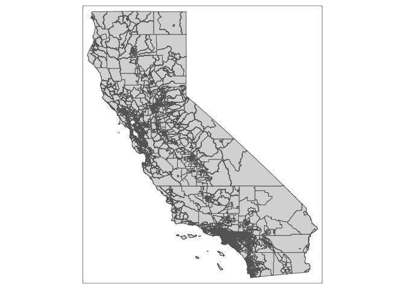
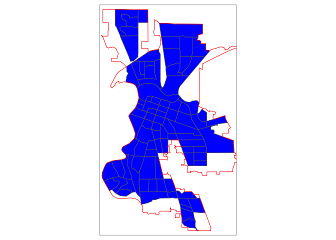
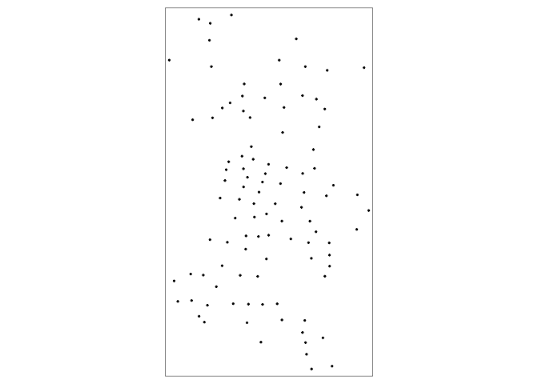
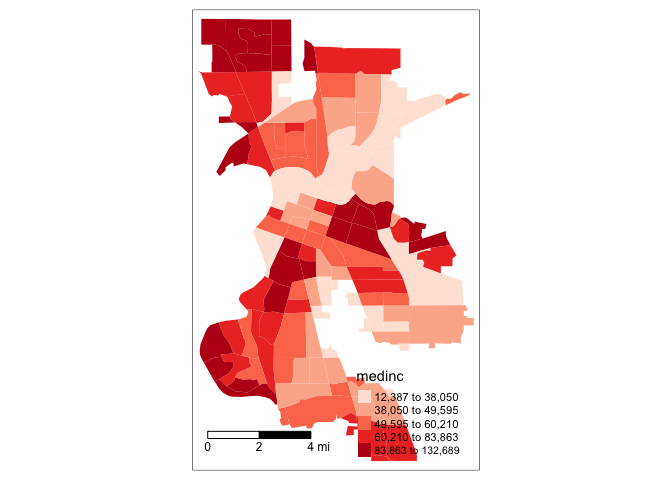

<style>
p.comment {
background-color: #bdced6;
padding: 10px;
border: 0px solid black;
margin-left: 25px;
border-radius: 5px;
font-style: normal;
}

h1.title {
  font-weight: bold;
  font-family: Arial;  
}

h2.title {
  font-family: Arial;  
}

</style>


<style type="text/css">
#TOC {
  font-size: 13px;
  font-family: Arial;
}
</style>


\


In this guide you will acquire the skills needed to process and present spatial data in R.  The objectives of the guide are as follows 


1. Understand how spatial vector data are processed in R.
2. Learn spatial operations on polygon shapefile data.
3. Learn how to use areal interpolation to attach census data to non census boundaries.
4. Learn how to make a map.


This lab guide follows closely and supplements the material presented in Chapters 2.1, 4.2, and 8 in the textbook [Geocomputation with R](https://geocompr.robinlovelace.net/) (GWR) and the Spatial Data class handout .  This guide focuses exclusively on polygon data.  You will have the opportunity to handle and examine point data in Lab 4.

<div style="margin-bottom:25px;">
</div>
## **Installing and loading packages**
\

You'll need to install the following packages in R.  You only need to do this once, so if you've already installed these packages, skip the code.  Also, don't put these `install.packages()` in your R Markdown document.  Copy and paste the code in the R Console.  We'll talk about what functions these packages provide as their relevant functions come up in the guide.


```r
install.packages("rmapshaper")
install.packages("tigris")
install.packages("sf")
install.packages("tmap")
install.packages("areal")
install.packages("leaflet")
```

You'll need to load the following packages.  Unlike installing, you will *always* need to load packages whenever you start a new R session. You'll always need to use `library()` in your R Markdown file. 


```r
library(tidyverse)
library(tidycensus)
library(sf)
library(tigris)
library(rmapshaper)
library(tmap)
library(areal)
library(leaflet)
```


<div style="margin-bottom:25px;">
</div>
## **Spatial data in R**
\

There are two main packages for dealing with spatial data in R: **sp** and **sf**.

* **sp** has been around since 2005, and thus has a rich ecosystem of tools built on top of it. However, it uses a rather complex data structure, which can make it challenging to use.
* **sf** is newer (first released in 2016!) so it doesn’t have such a rich ecosystem. However, it’s much easier to use and fits in very naturally with the tidyverse.  The trend is gradually shifting towards the use of **sf** as the primary spatial package.

Processing spatial data is very similar to nonspatial data thanks to the package **sf**, which is *tidy friendly*.  The non-tidy package **sp** is still used quite a bit, and you'll be relying on this package to do more complicated spatial analyses in future labs.  However, because R spatial is trending towards **sf**, we will use it over **sp** whenever possible.

**sf** stands for simple features.  The [Simple Features standard](https://en.wikipedia.org/wiki/Simple_Features) defines a simple feature as a representation of a real world object by a point or points that may or may not be connected by straight line segments to form lines or polygons. A feature is thought of as a thing, or an object in the real world, such as a building or a tree.  A county can be a feature. As can a city and a neighborhood.   Features have a geometry describing where on Earth the features are located, and they have attributes, which describe other properties. Think back to Lab 2 - we were working with counties.  The difference between what we were doing last week and what we will be doing in this lab is that counties in Lab 2 had attributes (e.g. percent Hispanic, total population), but they did not have geometries. This is what separates nonspatial and spatial data in R.  

<div style="margin-bottom:25px;">
</div>
## **Bringing in spatial data**
\

We'll be primarily working with object (or vector) data in shapefile format in this class.  [Shapefiles](https://en.wikipedia.org/wiki/Shapefile) are not the only type of spatial data, but they are the most commonly used. Let's be clear here: **sf** objects are R specific and shapefiles are a general format of spatial data.  This is like tibbles are R specific and csv files are a general format of non spatial data. 

There are two major packages for bringing in Census geographic boundary shapefiles into R: **tidycensus** and **tigris**.  These packages allow users to directly download and use [TIGER Line shapefiles](https://www.census.gov/geo/maps-data/data/tiger-line.html) from the Census Bureau. If you need a reminder of the major Census geographies, review Handout 1.

<div style="margin-bottom:25px;">
</div>
### **tidycensus**
\

In Week 2's lab, we worked with the **tidycensus** package and the Census API to bring in Census data into R.  We can use the same commands to bring in Census geography. If you haven't already, make sure to [sign up for and install your Census API key](https://crd230.github.io/lab2.html#Using_the_Census_API). If you could not install your API key, you'll need to use `census_api_key()` to activate it.


```r
census_api_key("YOUR API KEY GOES HERE")
```

Use the `get_acs()` command to bring in California tract-level race/ethnicity counts, total population, and total number of households. How did I find the variable IDs? Check [Lab 2](https://crd230.github.io/lab2.html#Using_the_Census_API). Since we want tracts, we'll use the `geography = "tract"` argument.


```r
ca.tracts <- get_acs(geography = "tract", 
              year = 2018,
              variables = c(tpopr = "B03002_001", 
                            nhwhite = "B03002_003", nhblk = "B03002_004", 
                            nhasn = "B03002_006", hisp = "B03002_012",
                            tothhs = "B11001_001"), 
              state = "CA",
              survey = "acs5",
              geometry = TRUE)
```

The only difference between the code above and what we used in Week 2 is we have one additional argument added to the `get_acs()` command: `geometry = TRUE`.  This tells R to bring in the spatial features associated with the geography you specified in the command, in the above case California tracts. Lets take a look at our data.


```r
ca.tracts
```

```
## Simple feature collection with 48342 features and 5 fields (with 96 geometries empty)
## geometry type:  MULTIPOLYGON
## dimension:      XY
## bbox:           xmin: -124.4096 ymin: 32.53416 xmax: -114.1312 ymax: 42.00948
## geographic CRS: NAD83
## First 10 features:
##          GEOID                                         NAME variable estimate
## 1  06009000300 Census Tract 3, Calaveras County, California    tpopr     6920
## 2  06009000300 Census Tract 3, Calaveras County, California  nhwhite     5467
## 3  06009000300 Census Tract 3, Calaveras County, California    nhblk       23
## 4  06009000300 Census Tract 3, Calaveras County, California    nhasn      121
## 5  06009000300 Census Tract 3, Calaveras County, California     hisp      791
## 6  06009000300 Census Tract 3, Calaveras County, California   tothhs     2484
## 7  06011000300    Census Tract 3, Colusa County, California    tpopr     6157
## 8  06011000300    Census Tract 3, Colusa County, California  nhwhite     1345
## 9  06011000300    Census Tract 3, Colusa County, California    nhblk      102
## 10 06011000300    Census Tract 3, Colusa County, California    nhasn      195
##    moe                       geometry
## 1  771 MULTIPOLYGON (((-120.764 38...
## 2  686 MULTIPOLYGON (((-120.764 38...
## 3   30 MULTIPOLYGON (((-120.764 38...
## 4  108 MULTIPOLYGON (((-120.764 38...
## 5  449 MULTIPOLYGON (((-120.764 38...
## 6  244 MULTIPOLYGON (((-120.764 38...
## 7  246 MULTIPOLYGON (((-122.5001 3...
## 8  256 MULTIPOLYGON (((-122.5001 3...
## 9   91 MULTIPOLYGON (((-122.5001 3...
## 10 113 MULTIPOLYGON (((-122.5001 3...
```

The object looks much like a basic tibble, but with a few differences.  

* You'll find that the description of the object now indicates that it is a simple feature collection with 48,342 features (tracts-by-variable) with 5 fields (attributes or columns of data).  
* The `geometry_type` indicates that the spatial data are in `MULTIPOLYGON` form (as opposed to points or lines, the other basic vector data forms).  
* `bbox` stands for bounding box, which indicates the spatial extent of the features (from left to right, for example, California tracts go from a longitude of -124.4096 to -114.1312).  
* `epsg` and `proj4string` are related to the coordinate reference system, which we'll touch on in next week's lab.  
* The final difference is that the data frame contains the column *geometry*.  This column (a [list-column](https://r4ds.had.co.nz/many-models.html#list-columns-1)) contains the geometry for each observation.  

At its most basic, an **sf** object is a collection of simple features that includes attributes and geometries in the form of a data frame. In other words, it is a data frame (or tibble) with rows of features, columns of attributes, and a special column always named *geometry* that contains the spatial aspects of the features. 

If you want to peek behind the curtain and learn more about the nitty gritty details about simple features, check out the official **sf** [vignette](https://r-spatial.github.io/sf/articles/sf1.html). 


<div style="margin-bottom:25px;">
</div> 
### **tigris package**
\

Another package that allows us to bring in census geographic boundaries is **tigris**.  [Here](https://github.com/walkerke/tigris/blob/master/README.md) is a list of all the boundaries you can download through this package.  Let's use the function `core_based_statistical_areas()` to bring in boundaries for all [metropolitan and micropolitan areas](https://www.census.gov/programs-surveys/metro-micro/about.html) in the United States.


```r
cb <- core_based_statistical_areas(year = 2018, cb = TRUE)
```

The `cb = TRUE`  argument tells R to download a [generalized cartographic boundary](https://www.census.gov/programs-surveys/geography/technical-documentation/naming-convention/cartographic-boundary-file.html) file, which drastically reduces the size of the data (compare the file size when you don't include `cb = TRUE`).  The argument `year=2018` tells R to bring in the boundaries for that year (census geographies can change from year to year). When using the multi-year ACS, best to use the end year of the period. In the `get_acs()` command above we used `year=2018`, so also use `year=2018` in the `core_based_statistical_areas()` command.

We then use `filter()` to keep the Sacramento metropolitan area.  In order to do this, we can use the function `grepl()` within the `filter()` function. 


```r
sac.metro <- filter(cb, grepl("Sacramento", NAME))
```

The function `grepl()` tells the command `filter()` to find features (rows) with the value "Sacramento" somewhere in their value for the variable *NAME*. This is useful when we don't know the exact name of an area (the full name of the Sacramento metro area is "Sacramento--Roseville--Arden-Arcade, CA").

Let's also bring in the boundaries for Sacramento city.  Use the `places()` function to get all [places](https://www2.census.gov/geo/pdfs/reference/GARM/Ch9GARM.pdf) in California.


```r
pl <- places(state = "CA", year = 2018, cb = TRUE)
```

Then use `filter()` to keep Sacramento.


```r
sac.city <- filter(pl, NAME == "Sacramento")
```

I use `NAME ==` here instead of `grepl()` because I already know the full name of Sacramento and I didn't want to include West Sacramento.  Note that unlike the **tidycensus** package, **tigris** does not allow you to attach attribute data (e.g. percent Hispanic, total population, etc.) to geometric features.  However, **tigris** has one important advantage: you get a badge for learning about it.  Hooray!

<center>
{ width=25% }

</center>

<div style="margin-bottom:25px;">
</div> 
### **Reading from your hard drive**
\

Directly reading spatial files using an API is great, but doesn't exist for many spatial data sources. You'll often have to download a spatial data set, save it onto your hard drive and read it into R.  The function for reading spatial files is `st_read()`.

I downloaded a [Sacramento Council Districts](https://www.cityofsacramento.org/-/media/Corporate/Files/GIS/Maps/Council_All_A.pdf?la=en) shapefile from Sacramento's [open data portal](http://data.cityofsacramento.org/).  I zipped up the file and uploaded it onto Github.  Set your working directory to an appropriate folder (type `getwd()` to see your current working directory and `setwd()` to set the working directory) and use the following code to download and unzip the file.


```r
setwd("insert your pathway here")
download.file(url = "https://raw.githubusercontent.com/crd230/data/master/Council_Districts.zip", destfile = "Council_Districts.zip")
unzip(zipfile = "Council_Districts.zip")
```


Don't worry if you don't understand these commands - they are more for you to simply copy and paste so that you can download files that I zipped up and uploaded onto GitHub.  You can look at the help documentation for each function if you are curious.

You should see the *Council_Districts* files in your working directory folder. Bring in the council district boundary file using `st_read()`.  You'll need to add the *.shp* extension so that the function knows it's reading in a shapefile.


```r
cdist <- st_read("Council_Districts.shp")
```

We'll be using *cdist* a little later in the lab guide.

<div style="margin-bottom:25px;">
</div>
## **Data Wrangling**
\

There is a lot of stuff [behind the curtain](https://www.jessesadler.com/post/simple-feature-objects/) of how R handles spatial data as simple features, but the main takeaway is that **sf** objects are data frames.  This means you can use many of the **tidyverse** functions we've learned in the past lab to manipulate **sf** objects, including the pipe `%>%` operator. For example, let's do the following data wrangling tasks on *ca.tracts*.

1. Drop the *moe* variable
2. Convert the dataset from long to wide
3. Break up the column *NAME* into separate tract, county and state variables

We do all of this in one line of continuous code using the pipe operator `%>%`


```r
ca.tracts <- ca.tracts %>%
              select(-(moe)) %>%
              spread(key = variable, value = estimate) %>%
              separate(NAME, c("Tract", "County", "State"), sep = ", ")
```

Another important data wrangling operation is to join attribute data to an **sf** object.  For example, let's say you wanted to add tract level median household income, which is located in a csv file I've uploaded on GitHub, to the file *ca.tracts *.  Read the file in using the following code.


```r
ca.inc <- read_csv("https://raw.githubusercontent.com/crd230/data/master/ca_med_inc_2018.csv")
```

Remember, an *sf* object is a data frame, so we can use `left_join()`, which we covered in [Lab 2](https://crd230.github.io/lab2.html#Joining_tables), to join the files *ca.inc* and *ca.tracts*


```r
ca.tracts <- ca.tracts %>%
  left_join(ca.inc, by = "GEOID")

glimpse(ca.tracts)
```

We use the function `tm_shape()` from the **tmap** package to map the data. We'll go into more detail on how to use `tm_shape()` for mapping later in this guide, so for now just type in


```r
tm_shape(ca.tracts) +
  tm_polygons()
```

<!-- -->

You've made your first map in R (at least in this class). Whoopee! 


<p class="comment">**Practice Exercise**: Map tracts just in Yolo County</p>


<div style="margin-bottom:25px;">
</div>
## **Spatial Data Wrangling**
\

There is Data Wrangling and then there is *Spatial Data Wrangling*. Cue [dangerous sounding music](https://www.youtube.com/watch?v=cphNpqKpKc4). Well, it's not that dangerous or scary. Spatial Data Wrangling involves cleaning or altering your data set based on the geographic location of features. The **sf** package offers a suite of functions unique to wrangling spatial data.  Most of these functions start out with the prefix `st_`.  To see all of the functions, type in


```r
methods(class = "sf")
```

We won't go through all of these functions as the list is quite extensive.  You can take a look at Chapters 4 and 5 of GWR to see some examples of these functions.  We'll also go through spatial wrangling specific to points in Lab 4. But, we'll go through a few relevant spatial operations for this class below.  The function we will be primarily using is `st_join()`.


<div style="margin-bottom:25px;">
</div>
### **Intersect**
\

A common spatial data wrangling issue is to subset a set of spatial objects based on their location relative to another spatial object.  In our case, we want to keep California tracts that are in the Sacramento metro area.  Think of what were doing here as something similar to taking a cookie cutter shaped like the Sacramento metro area (in our case, the **sf** object *sac.metro*) and cutting out the metro area from a cookie dough of census tracts (*ca.tracts*).   We can do this using the `st_join()` function and specify  `join = st_intersects` 


```r
sac.metro.tracts.int <- st_join(ca.tracts, sac.metro, 
                                join = st_intersects, left=FALSE)
```

The above code tells R to identify the polygons in *ca.tracts* that intersect with the polygon *sac.metro*.  We indicate we want a polygon intersection by specifying `join = st_intersects`.  The option `left=FALSE` tells R to eliminate the polygons from *ca.tracts* that do not intersect (make it `TRUE` and see what happens). Plotting our tracts, we get


```r
tm_shape(sac.metro.tracts.int) +
  tm_polygons(col = "blue") +
tm_shape(sac.metro) +  
  tm_borders(col = "red")
```

<!-- -->

<p class="comment">**Practice Exercise**: The opposite of `st_intersects is st_disjoint`. If two geometries are disjoint, they do not intersect, and vice-versa. Replace `join = st_intersects` with `join = st_disjoin` and see what you get.</p>


<div style="margin-bottom:25px;">
</div>
### **Within**
\


Do you see an issue with the tracts *sac.metro.tracts.int*?  Using `join = st_intersects` returns all tracts that **intersect** *sac.metro*, which include those that **touch** the metro's boundary. No bueno, dudes. We can instead use the argument  `join = st_within` to return tracts that are completely *within* the metro. 


```r
sac.metro.tracts.w <- st_join(ca.tracts, sac.metro, join = st_within, left=FALSE)

tm_shape(sac.metro.tracts.w) +
  tm_polygons(col = "blue") +
tm_shape(sac.metro) +
  tm_borders(col = "red")
```

<!-- -->

Now it works! Huzzah!


If you look at the at *sac.metro.tracts.w*'s attribute table, you'll see it includes all the variables from both *ca.tracts* and *sac.metro*. We don't need these variables, so use `select()` to eliminate them.  You'll also notice that if variables from two data sets share the same name, R will keep both and attach a *.x* and *.y*  to the end. For example, *GEOID* was found in both *ca.tracts* and *sac.metro*, so R named one *GEOID.x* and the other that was merged in was named *GEOID.y*.


```r
names(sac.metro.tracts.w)
```

```
##  [1] "GEOID.x"  "Tract"    "County"   "State"    "hisp"     "nhasn"   
##  [7] "nhblk"    "nhwhite"  "tothhs"   "tpopr"    "medinc"   "CSAFP"   
## [13] "CBSAFP"   "AFFGEOID" "GEOID.y"  "NAME"     "LSAD"     "ALAND"   
## [19] "AWATER"   "geometry"
```

Keep the necessary variables and rename *GEOID.x* back to *GEOID*.


```r
sac.metro.tracts.w <- sac.metro.tracts.w %>%
      select(GEOID.x:tpopr) %>%
      rename(GEOID = "GEOID.x")
```


<div style="margin-bottom:25px;">
</div>
### **Clipping**
\

Census tracts neatly fall within a metropolitan area's boundary, as it does for counties and states.  In other words, tracts don't spill over.  But, it does spill over for cities (remember the census geography hierarchy diagram from Handout 1).  The left diagram in the figure below is an example of a metro area in red and tracts in black - all the tracts fall neatly into the metro boundary.  In contrast, the right diagram is an example of a city - one tract falls neatly inside (top left), but the other three spill out.


<center>


</center>

If we use `st_join()` with `st_within` for Sacramento city, we'll produce the following plot


```r
sac.city.tracts.w = st_join(ca.tracts, sac.city, join = st_within, left=FALSE)

tm_shape(sac.city.tracts.w) +
  tm_polygons(col = "blue") +
tm_shape(sac.city) +
  tm_borders(col = "red")
```

<!-- -->

Can you guess what is going on here?

The blue polygons are the tracts we kept. You'll notice that the city is empty around some of the edges of its boundary.  In these cases, only portions of census tracts are within the boundary. `st_within` keeps tracts only if they are *completely within* the boundary.  

You can designate tracts as being a part of a city if it's only within the boundaries.  But, there are other ways.  One way is to clip the portion of the tract that is inside the boundary.  Clipping keeps just the portion of the tract inside the city boundary and discards the rest of the tract.  We use the function `ms_clip()` which is in the [**rmapshaper**](https://cran.r-project.org/web/packages/rmapshaper/rmapshaper.pdf) package.  In the code below, `target = ca.tracts` tells R to cut out *ca.tracts* using the *sac.city* boundaries, which we specify in the `clip =` argument.


```r
sac.city.tracts.c <- ms_clip(target = ca.tracts, clip = sac.city, remove_slivers = TRUE)

tm_shape(sac.city.tracts.c) +
  tm_polygons(col = "blue") +
tm_shape(sac.city) +
  tm_borders(col = "red")
```

<!-- -->

Now, the city is filled in with tracts. To be clear what a clip is doing, the figure below shows a clip of the city example shown in the conceptual figure above.  One tract is not clipped because it falls completely within the city (the top left tract). But, the other three are clipped - the portions that are within the boundary are kept (in blue), and the rest (with hash marks) are discarded from the map.  Basically, clipping keeps any tract that is either within or crosses the city boundary, clipping out the portion of the tract that is outside of the boundary.

Because spatial data are not always precise, when you clip you'll sometimes get unwanted [sliver polygons](https://en.wikipedia.org/wiki/Sliver_polygon). The argument `remove_slivers = TRUE` removes these slivers.

<center>


</center>


The function `st_overlaps` is the opposite of `st_within`.  Replace `join = st_within` with `join = st_overlaps` to see what this spatial operation produces.  Play around with the other `st_` options and see what you get (type in `? st_join` to find all the options).

<div style="margin-bottom:25px;">
</div>
### **Areal Interpolation**
\

The traditional measure of neighborhoods in the United States is the census tract.  However, other non-Census boundary definitions exist.  Examples include school attendance boundaries, electoral boundaries, and police districts. More often than not, these boundaries won't have demographic information attached to them.  Moreover, census tracts (or blocks) are not completely nested inside, so you can't just simply add them up. The problem is we want to attach resident characteristics derived from the census to these non-traditional boundaries. Areal interpolation is a common method for dealing with this issue.  

Let's use Sacramento Council Districts, the main local governing body in the city, as an example. There are [eight districts](https://www.cityofsacramento.org/-/media/Corporate/Images/GIS/PreviewImage/Council_All_large.jpg?la=en) in Sacramento and tracts do not neatly nest within these districts.  Some tracts overlap two or more districts.  The goal is to estimate the total population, the population by race/ethnicity, and median household income in each council district.  We already downloaded and brought into R a council district shapefile. Map it.


```r
tm_shape(cdist) +
  tm_polygons()
```

<!-- -->


In order to proceed, we need to have the *ca.tracts* and *cdist* data sets in the same Coordinate Reference System (CRS). Don't worry yet about what this means - we will cover it in the next lab.  If you are curious, I uploaded a pdf - Coordinate_Reference_Systems.pdf - in the Other Resources folder on Canvas in case you want to jump ahead and find out what a CRS is. Briefly, a CRS refers to the way in which spatial data that represent the earth’s surface (which is round and three dimensional) are flattened so that you can "Draw" them on a 2-dimensional surface (like a map). In other words, a CRS is a coordinate-based local, regional or global system used to locate geographical entities. We're going to use UTM Zone 10/NAD83 as the CRS for *ca.tracts* and *cdist*.  To change the CRS of spatial data (known as reprojecting), use the `st_transform()` function.


```r
ca.tracts <- st_transform(ca.tracts, crs = "+proj=utm +zone=10 +datum=NAD83 +ellps=GRS80")
cdist <- st_transform(cdist, crs = "+proj=utm +zone=10 +datum=NAD83 +ellps=GRS80")
```

Note that the only spaces allowed when specifying the `crs` is in between each argument.  For example, there should be no space in between `+` and `datum` or `datum` and `=` or `=` and `NAD83`.  They should be all together.  On the other hand, there should be a space between `NAD83` and `+ellps=GRS80`.

Areal interpolation matches census tract data to districts using the following general steps:

1.  All your demographic variables should be counts where possible.  That is, you will be interpolating the number of black residents not percent black.  For variables that you cannot get counts for like median household income, you'll have to convert it to an aggregate count. For median household income, this would involve multiplying median income by total households to get an estimated count of total income dollars.


```r
ca.tracts <- ca.tracts %>%
              mutate(incagg = medinc*tothhs)
```

2. Calculate the proportion of the tract that is within a district.  This is your areal interpolation weight.
    + If tract 1's area is 1,000 and half of the tract is in district 1 and the other half is in district 2, then tract 1-district 1 and tract 1-district 2 have weights of 0.5.
3. Multiply the count characteristics by the areal interpolation weight.  
    + If tract 1's total black population is 1,000, you would multiply 1,000 by 0.5.  You are allocating 500 of tract 1's black population to district 1 and the other 500 to district 2. 
4. Sum up each tract's contribution to the district to get the areal weighted estimated count for that district.
    + If district 1 also contains tract 2, and tract 2's total black population is 500 and its areal weight is 0.25, then the black population from tract 2 that is allocated to district 1 is 500 x 0.25 = 125.  District 1's total black population is then 500 + 125 = 625.

Rather than doing all of this manually, we can use the function `aw_interpolate()` which is a part of the **areal** package.


```r
cdist.aw <- aw_interpolate(cdist, tid = DISTNUM, source = ca.tracts, sid = GEOID, weight = "total", output = "sf", extensive = c("hisp", "nhasn", "nhblk", "nhwhite", "tpopr", "incagg", "tothhs"))
```

The first argument is the **sf** object you want to interpolate to, in our case *cdist*.  `tid` is the unique ID variable in *cdist*. `source =` is the **sf** object with that data to be interpolated to *cdist*, in our case *ca.tracts*.  `sid` is the unique ID variable in *ca.tracts*. The argument `weight =` characterizes the nature of the data, the relationship between the source and target features, and thus how the areal weight is calculated. The *total* approach to calculating weights assumes that, if a source feature is only covered by 99.88% of the target features, only 99.88% of the source target’s data should be allocated to target features in the interpolation. The other option is the *sum* approach, which assumes that 100% of the source data should be divided among the target features.  The argument `output = "sf"` tells R that we want the resulting interpolated object to be an **sf** object.  Finally, `extensive` identifies the count variables in *ca.tracts* we want to interpolate. If you would like to go deeper into interpolation methods, check out the `aw_interpolate()` [vignette](https://cran.r-project.org/web/packages/areal/vignettes/areal-weighted-interpolation.html).

Take a glimpse of the object


```r
glimpse(cdist.aw)
```

```
## Rows: 8
## Columns: 13
## $ OBJECTID   <dbl> 1, 2, 3, 4, 5, 6, 7, 8
## $ DISTNUM    <chr> "7", "4", "2", "3", "6", "5", "1", "8"
## $ NAME       <chr> "Rick Jennings II", "Steve Hansen", "Allen Warren", "Jeff …
## $ Shape__Are <dbl> 0.002850069, 0.002764893, 0.004130511, 0.004188627, 0.0042…
## $ Shape__Len <dbl> 0.4196103, 0.4277325, 0.3907921, 0.3715728, 0.4589053, 0.4…
## $ hisp       <dbl> 14085.567, 10727.895, 27938.571, 23853.073, 16296.643, 192…
## $ incagg     <dbl> 1576052441, 1856550003, 816656240, 1929119769, 1168635351,…
## $ nhasn      <dbl> 16529.594, 6912.172, 9162.793, 6231.109, 10884.482, 9753.0…
## $ nhblk      <dbl> 8772.835, 5285.649, 8984.684, 7566.567, 3654.738, 7829.618…
## $ nhwhite    <dbl> 15315.581, 30326.613, 17366.100, 28875.513, 21179.387, 205…
## $ tothhs     <dbl> 22301.83, 29146.76, 20950.92, 27663.16, 20777.28, 23671.10…
## $ tpopr      <dbl> 60014.15, 57021.94, 68062.31, 71069.26, 55917.51, 60492.77…
## $ geometry   <MULTIPOLYGON [m]> MULTIPOLYGON (((630603.9 42..., MULTIPOLYGON …
```

We've got counts at the council district level. To calculate the proportions of race/ethnicity and median income, use the `mutate()` function


```r
cdist.aw <- cdist.aw %>%
            mutate(phisp = hisp/tpopr, pasian = nhasn/tpopr, pblack = nhblk/tpopr,
                   pwhite = nhwhite/tpopr, medinc = incagg/tothhs)
```


We're done! Go ahead, click it.

<center>


</center>


<div style="margin-bottom:25px;">
</div>
## **Saving shapefiles**
\

To save an **sf** object, we use the function `st_write()` and specify at least two arguments, the object and a file name in quotes with the file extension. You'll also need to specify `delete_layer = TRUE` which overwrites the existing file if it already exists in your current working directory folder.  Make sure you've set your directory to the folder you want your file to be saved in.  


```r
st_write(sac.city.tracts.c, "saccitytracts.shp", delete_layer = TRUE)
```

You can save your **sf** object in a number of different data formats other than `shp`.  We won't be concerned too much with these other formats, but you can see a list of them [here](https://www.gdal.org/ogr_formats.html).

<div style="margin-bottom:25px;">
</div>
## **Mapping in R**
\

There are several functions in R that can be used for mapping.  We won't go through all of them, but GWR outlines the range of mapping packages available in Table 8.1.  We'll go through two of them: **tmap** and **leaflet** 


<div style="margin-bottom:25px;">
</div>
### **tmap**
\

**tmap** is a series of functions that build on one another. The foundation is `tm_shape()`.  You then build on `tm_shape()` by adding one or more elements such as `tm_polygons()` for polygons, `tm_borders()` for lines, and `tm_dots()` for points. All additional functions take on the form of `tm_`.  Check the full list of `tm_` elements [here](https://www.rdocumentation.org/packages/tmap/versions/2.0/topics/tmap-element).

Let's make a static choropleth map of median household income in Sacramento city.


```r
tm_shape(sac.city.tracts.c) +
  tm_polygons(col = "medinc", style = "quantile")
```

<!-- -->

You first put the dataset *sac.city.tracts.c* inside `tm_shape()`. Because you are plotting polygons, you use `tm_polygons()` next. The argument `col = "medinc"` tells R to shade (or color) the tracts by the variable *medinc*.  The argument `style = "quantile"` tells R to break up the shading into quantiles, or equal groups of 5.   **tmap** allows users to specify algorithms to automatically create breaks with the `style` argument.  Seven of the most useful break styles are described in GWR 8.2.4.


We can change the color scheme using arguments within `tm_polygons()`. The argument `palette =` defines the color ranges associated with the bins and determined by the `style` arguments.  Below we use the color scheme "Reds". 


```r
tm_shape(sac.city.tracts.c) +
  tm_polygons(col = "medinc", style = "quantile",palette = "Reds") 
```

<!-- -->

The current tract border color makes it difficult to see the changes in color from one tract to the next, especially in areas where there are a lot of smaller tracts.  We can make the borders transparent using the `border.alpha` argument.


```r
tm_shape(sac.city.tracts.c) +
  tm_polygons(col = "medinc", style = "quantile",palette = "Reds", 
              border.alpha = 0) 
```

<!-- -->

We set `border.alpha` to 0 to indicate totally transparent. This eliminates the border colors between tracts. 

See Ch. 8.2.4 in GWR for a fuller discussion on color and other schemes you can specify.

<div style="margin-bottom:25px;">
</div>
### **Scale bar and arrow**
\

We need to add other key elements to the map.  First, the scale bar, which you can add using the function `tm_scale_bar()`


```r
tm_shape(sac.city.tracts.c, unit = "mi") +
  tm_polygons(col = "medinc", style = "quantile",palette = "Reds", 
              border.alpha = 0) +
  tm_scale_bar(breaks = c(0, 2, 4), text.size = 0.75, position = c("left", "bottom")) 
```

<!-- -->

The argument `breaks` tells R the distances to break up and end the bar.  The argument `position` places the scale bar on the bottom left part of the map. Note that the scale is in miles (were in America!).  The default is in kilometers (the rest of the world!), but you can specify the units within `tm_shape()` using the argument `unit`. `text.size` scales the size of the bar smaller (below 1) or larger (above 1).
  
Next element is the north arrow, which we can add using the function `tm_compass()`.  You can control for the type, size and location of the arrow within this function.  I place a 4-star arrow on the top right of the map.


```r
tm_shape(sac.city.tracts.c, unit = "mi") +
  tm_polygons(col = "medinc", style = "quantile",palette = "Reds", 
              border.alpha = 0) +
  tm_scale_bar(breaks = c(0, 2, 4), text.size = 0.75, position = c("left", "bottom")) +
  tm_compass(type = "4star", position = c("right", "top")) 
```

<!-- -->

<div style="margin-bottom:25px;">
</div>
### **Map layout**
\

We can make the map *prettier* by changing a variety of layout settings using the function `tm_layout()`.  Let's change a few things to our map.


```r
sac.map <- tm_shape(sac.city.tracts.c, unit = "mi") +
  tm_polygons(col = "medinc", style = "quantile",palette = "Reds", 
              border.alpha = 0, title = "Median income") +
  tm_scale_bar(breaks = c(0, 2, 4), text.size = 0.75, position = c("left", "bottom")) +
  tm_compass(type = "4star", position = c("right", "bottom")) + 
  tm_layout(main.title = "Median income in Sacramento City Tracts",
            main.title.size = 0.95, frame = FALSE,
            legend.outside = TRUE, legend.outside.position = "right")
sac.map
```

<!-- -->

Let me summarize what I did:

* I added a title using the argument `main.title` in `tm_layout()`
* I made sure the title fits inside the map using `main.title.size` in `tm_layout()`
* I eliminated the frame around the map using the argument `frame = FALSE` in `tm_layout()`
* I put the legend outside of the frame of the map using `legend.outside = TRUE` and `legend.outside.position = "right"` in `tm_layout()`. 
* I moved the north arrow to the bottom right in `tm_compass()`
* I created a legend title using `title =` in `tm_polygons()`

Also notice that I saved the map into an object called *sac.map*.  R is an object-oriented program, so *everything* you *make* in R are objects that can be saved for future manipulation.  This includes maps.  And future manipulations of a saved map includes adding more `tm_*` functions to the saved object, such as `sac.map + tm_layout(your changes here)`. Check the help documentation for `tm_layout()` to see the complete list of settings.  Also see examples in Ch. 8.2.5 in GWR.

<p class="comment">**Practice Exercise**: Map median household income for council districts. </p>


<div style="margin-bottom:25px;">
</div>
### **Interactive maps**
\

So far we've created static maps. That is, maps that don't "move".  But, we're all likely used to Google or Bing maps - maps that we can move around, zoom in and out of, create pop ups and labels, and highlight/select regions. 

To make your tmap object interactive, use the function `tmap_mode()` and type in "view" as an argument. 


```r
tmap_mode("view")
```

Now that the interactive mode has been ‘turned on’, all maps produced with `tm_shape()` will launch.


```r
sac.map
```

<!--html_preserve--><div id="htmlwidget-b3d2fc20794ada00d1a1" style="width:672px;height:480px;" class="leaflet html-widget"></div>
<script type="application/json" data-for="htmlwidget-b3d2fc20794ada00d1a1">{"x":{"options":{"crs":{"crsClass":"L.CRS.EPSG3857","code":null,"proj4def":null,"projectedBounds":null,"options":{}}},"calls":[{"method":"createMapPane","args":["tmap401",401]},{"method":"addProviderTiles","args":["Esri.WorldGrayCanvas",null,"Esri.WorldGrayCanvas",{"minZoom":0,"maxZoom":18,"tileSize":256,"subdomains":"abc","errorTileUrl":"","tms":false,"noWrap":false,"zoomOffset":0,"zoomReverse":false,"opacity":1,"zIndex":1,"detectRetina":false,"pane":"tilePane"}]},{"method":"addProviderTiles","args":["OpenStreetMap",null,"OpenStreetMap",{"minZoom":0,"maxZoom":18,"tileSize":256,"subdomains":"abc","errorTileUrl":"","tms":false,"noWrap":false,"zoomOffset":0,"zoomReverse":false,"opacity":1,"zIndex":1,"detectRetina":false,"pane":"tilePane"}]},{"method":"addProviderTiles","args":["Esri.WorldTopoMap",null,"Esri.WorldTopoMap",{"minZoom":0,"maxZoom":18,"tileSize":256,"subdomains":"abc","errorTileUrl":"","tms":false,"noWrap":false,"zoomOffset":0,"zoomReverse":false,"opacity":1,"zIndex":1,"detectRetina":false,"pane":"tilePane"}]},{"method":"addPolygons","args":[[[[{"lng":[-121.453086,-121.450311,-121.454642,-121.457904,-121.46165,-121.462307,-121.464188,-121.466354,-121.464487,-121.46301,-121.45922,-121.453086],"lat":[38.482303,38.474295,38.474316,38.474656,38.474516,38.474471,38.474487,38.481526,38.481495,38.480937,38.481682,38.482303]}]],[[{"lng":[-121.40926,-121.408189,-121.399163,-121.393335,-121.382848,-121.382639,-121.382175,-121.379471,-121.39086,-121.393898,-121.409349,-121.409435,-121.40926],"lat":[38.560718,38.560681,38.562605,38.564065,38.566761,38.564114,38.562815,38.558852,38.557614,38.557248,38.55381,38.557678,38.560718]}]],[[{"lng":[-121.467588,-121.463687,-121.459016,-121.456943,-121.452146,-121.447352,-121.447462,-121.447766,-121.448915,-121.449926,-121.450939,-121.446173,-121.445025,-121.443882,-121.443877,-121.448495,-121.457538,-121.45936,-121.461208,-121.466355,-121.466966,-121.466832,-121.467737,-121.467588],"lat":[38.61974,38.62208,38.62402,38.623939,38.625524,38.625395,38.620041,38.618647,38.616579,38.615622,38.61478,38.614743,38.613837,38.612934,38.611121,38.611123,38.611136,38.611125,38.6111,38.611163,38.611176,38.611763,38.617387,38.61974]}]],[[{"lng":[-121.480001,-121.481435,-121.482384,-121.487703,-121.494629,-121.493672,-121.492716,-121.488474,-121.486653,-121.485321,-121.480001],"lat":[38.57301,38.5697,38.567506,38.568923,38.570769,38.572962,38.575156,38.574026,38.574785,38.57443,38.57301]}]],[[{"lng":[-121.475844,-121.474412,-121.472436,-121.470459,-121.466562,-121.46472,-121.464716,-121.464767,-121.467459,-121.471217,-121.473931,-121.475758,-121.475812,-121.475785,-121.475844],"lat":[38.557203,38.556821,38.556125,38.553856,38.549185,38.547184,38.546275,38.541193,38.541139,38.541213,38.541158,38.541064,38.549935,38.553605,38.557203]}]],[[{"lng":[-121.506064,-121.503261,-121.491264,-121.491876,-121.491963,-121.49239,-121.49335,-121.494648,-121.496695,-121.505073,-121.506189,-121.506064],"lat":[38.495632,38.495679,38.495727,38.493927,38.489044,38.483828,38.481412,38.481396,38.481371,38.481269,38.489593,38.495632]}]],[[{"lng":[-121.46476,-121.463748,-121.460094,-121.460086,-121.461365,-121.464713,-121.46476],"lat":[38.539527,38.539446,38.539446,38.534025,38.534006,38.533606,38.539527]}]],[[{"lng":[-121.409042,-121.409037,-121.408979,-121.415351,-121.416152,-121.41621,-121.416685,-121.416679,-121.412333,-121.409042],"lat":[38.503683,38.503334,38.499678,38.499648,38.501428,38.503243,38.503241,38.503744,38.50377,38.503683]}]],[[{"lng":[-121.435403,-121.42271,-121.419808,-121.41991,-121.416419,-121.415281,-121.415282,-121.419687,-121.419697,-121.419919,-121.420403,-121.419874,-121.41993,-121.420775,-121.426878,-121.432337,-121.435403],"lat":[38.610821,38.622536,38.62523,38.623023,38.624506,38.624541,38.618168,38.620097,38.618605,38.617849,38.617051,38.615506,38.610926,38.611079,38.611193,38.611115,38.610821]}]],[[{"lng":[-121.471691,-121.468121,-121.45692,-121.449837,-121.447756,-121.447787,-121.447311,-121.447364,-121.447346,-121.447352,-121.452146,-121.456943,-121.459016,-121.463687,-121.467588,-121.469519,-121.471523,-121.471691],"lat":[38.641512,38.641828,38.641524,38.641325,38.641433,38.64032,38.640309,38.636693,38.632864,38.625395,38.625524,38.623939,38.62402,38.62208,38.61974,38.629945,38.640632,38.641512]}]],[[{"lng":[-121.517356,-121.512483,-121.511117,-121.508451,-121.505744,-121.505722,-121.505434,-121.50363,-121.503986,-121.497854,-121.49788,-121.506254,-121.508085,-121.51256,-121.517356],"lat":[38.625027,38.627592,38.627435,38.627449,38.62744,38.621306,38.617175,38.613761,38.612789,38.61274,38.608065,38.606919,38.606233,38.614858,38.625027]}]],[[{"lng":[-121.532897,-121.525475,-121.521981,-121.507365,-121.507408,-121.507317,-121.507747,-121.514188,-121.518299,-121.518508,-121.520785,-121.526325,-121.529655,-121.533312,-121.532897],"lat":[38.655768,38.655851,38.655891,38.656041,38.64693,38.63955,38.632365,38.627773,38.627277,38.627774,38.632763,38.643031,38.64913,38.655763,38.655768]}]],[[{"lng":[-121.507582,-121.50751,-121.507423,-121.493603,-121.493401,-121.495643,-121.504235,-121.507514,-121.507543,-121.507582],"lat":[38.676903,38.68193,38.685217,38.685217,38.670807,38.670808,38.670816,38.670816,38.673418,38.676903]}]],[[{"lng":[-121.488236,-121.487856,-121.483623,-121.481608,-121.479826,-121.475812,-121.475758,-121.478938,-121.484323,-121.488267,-121.488236],"lat":[38.55264,38.551746,38.549966,38.549895,38.549911,38.549935,38.541064,38.54054,38.539613,38.552542,38.55264]}]],[[{"lng":[-121.44259,-121.438691,-121.433813,-121.432848,-121.427515,-121.427481,-121.427459,-121.427454,-121.427447,-121.435862,-121.438352,-121.439229,-121.439757,-121.440148,-121.44197,-121.44259],"lat":[38.524974,38.525001,38.525034,38.525041,38.525077,38.519732,38.515993,38.513894,38.510522,38.510507,38.515855,38.517704,38.518818,38.51967,38.523625,38.524974]}]],[[{"lng":[-121.493768,-121.493612,-121.492829,-121.487087,-121.484323,-121.481879,-121.480952,-121.48625,-121.49431,-121.495899,-121.49536,-121.493768],"lat":[38.535148,38.535636,38.538135,38.539138,38.539613,38.531701,38.528677,38.528304,38.528351,38.528629,38.530214,38.535148]}]],[[{"lng":[-121.54548,-121.540823,-121.531396,-121.531237,-121.530532,-121.530364,-121.527527,-121.52724,-121.52624,-121.525988,-121.527225,-121.528691,-121.530902,-121.533674,-121.534872,-121.535364,-121.537911,-121.541951,-121.542764,-121.54548],"lat":[38.515615,38.516504,38.51727,38.515831,38.513878,38.513908,38.506687,38.506756,38.505034,38.503413,38.501074,38.496955,38.497407,38.498005,38.498697,38.499284,38.504223,38.508499,38.510062,38.515615]}]],[[{"lng":[-121.461522,-121.458301,-121.454744,-121.451607,-121.450906,-121.450604,-121.450136,-121.444836,-121.447136,-121.446743,-121.44787,-121.450475,-121.454014,-121.455335,-121.464247,-121.462834,-121.461426,-121.461522],"lat":[38.58197,38.58134,38.581998,38.583857,38.585382,38.585437,38.58439,38.581846,38.57869,38.57842,38.576162,38.571276,38.572235,38.572593,38.574981,38.578234,38.581471,38.58197]}]],[[{"lng":[-121.498892,-121.49651,-121.489851,-121.484264,-121.477613,-121.480001,-121.485321,-121.486653,-121.488474,-121.492716,-121.493672,-121.494629,-121.501271,-121.498892],"lat":[38.578047,38.58356,38.581785,38.580295,38.57852,38.57301,38.57443,38.574785,38.574026,38.575156,38.572962,38.570769,38.572539,38.578047]}]],[[{"lng":[-121.430761,-121.427406,-121.422988,-121.427168,-121.436875,-121.446594,-121.450311,-121.453086,-121.451029,-121.448925,-121.44725,-121.44511,-121.44159,-121.440706,-121.430761],"lat":[38.481616,38.478442,38.474281,38.474217,38.474254,38.474276,38.474295,38.482303,38.482602,38.482128,38.481152,38.479209,38.481301,38.481563,38.481616]}]],[[{"lng":[-121.444649,-121.43979,-121.437826,-121.434118,-121.431675,-121.427937,-121.425872,-121.425223,-121.425795,-121.425617,-121.422777,-121.422177,-121.421029,-121.423741,-121.425127,-121.429857,-121.434696,-121.435436,-121.441507,-121.444652,-121.444649],"lat":[38.448801,38.448882,38.450595,38.451199,38.451293,38.449814,38.449722,38.448124,38.445202,38.442351,38.438677,38.438333,38.43803,38.438001,38.440486,38.441208,38.441258,38.441825,38.443855,38.447177,38.448801]}]],[[{"lng":[-121.505744,-121.497899,-121.497892,-121.497854,-121.503986,-121.50363,-121.505434,-121.505722,-121.505744],"lat":[38.62744,38.62742,38.621255,38.61274,38.612789,38.613761,38.617175,38.621306,38.62744]}]],[[{"lng":[-121.450475,-121.44787,-121.446743,-121.447136,-121.444836,-121.439215,-121.436682,-121.434867,-121.433537,-121.432869,-121.431961,-121.433328,-121.440678,-121.441705,-121.448571,-121.449873,-121.450475],"lat":[38.571276,38.576162,38.57842,38.57869,38.581846,38.579655,38.578432,38.576673,38.5736,38.570934,38.56731,38.567203,38.569133,38.569405,38.571211,38.571123,38.571276]}]],[[{"lng":[-121.427459,-121.419919,-121.414297,-121.409108,-121.409081,-121.415222,-121.415863,-121.422496,-121.427447,-121.427454,-121.427459],"lat":[38.515993,38.516061,38.51611,38.516156,38.510551,38.510542,38.510542,38.51053,38.510522,38.513894,38.515993]}]],[[{"lng":[-121.470798,-121.460444,-121.459275,-121.456899,-121.454981,-121.454097,-121.453086,-121.45922,-121.46301,-121.464487,-121.466354,-121.469127,-121.470798],"lat":[38.495868,38.496047,38.496013,38.491536,38.487543,38.485173,38.482303,38.481682,38.480937,38.481495,38.481526,38.490507,38.495868]}]],[[{"lng":[-121.49842,-121.497206,-121.495899,-121.49431,-121.48625,-121.480952,-121.47972,-121.478672,-121.483144,-121.487431,-121.498017,-121.49842],"lat":[38.520982,38.524723,38.528629,38.528351,38.528304,38.528677,38.524835,38.521312,38.521114,38.52097,38.520716,38.520982]}]],[[{"lng":[-121.439229,-121.438352,-121.435862,-121.436855,-121.445145,-121.445203,-121.441457,-121.441526,-121.441562,-121.439229],"lat":[38.517704,38.515855,38.510507,38.510495,38.510459,38.512087,38.512141,38.515795,38.517675,38.517704]}]],[[{"lng":[-121.447553,-121.445968,-121.442399,-121.436125,-121.435315,-121.433327,-121.431261,-121.429241,-121.428525,-121.446674,-121.446708,-121.446736,-121.446811,-121.447553],"lat":[38.467031,38.467142,38.466434,38.465082,38.464581,38.463588,38.463781,38.460007,38.458623,38.463235,38.463681,38.464065,38.464752,38.467031]}]],[[{"lng":[-121.494629,-121.487703,-121.482384,-121.485698,-121.48971,-121.491047,-121.498472,-121.498325,-121.497004,-121.496056,-121.494629],"lat":[38.570769,38.568923,38.567506,38.559828,38.560893,38.561249,38.563222,38.565672,38.56532,38.567493,38.570769]}]],[[{"lng":[-121.488236,-121.487469,-121.487232,-121.485698,-121.480354,-121.475844,-121.475785,-121.475812,-121.479826,-121.481608,-121.483623,-121.487856,-121.488236],"lat":[38.55264,38.555094,38.555859,38.559828,38.558404,38.557203,38.553605,38.549935,38.549911,38.549895,38.549966,38.551746,38.55264]}]],[[{"lng":[-121.491264,-121.482736,-121.48035,-121.480722,-121.480345,-121.480341,-121.480336,-121.486859,-121.49335,-121.49239,-121.491963,-121.491876,-121.491264],"lat":[38.495727,38.49576,38.49577,38.492209,38.490448,38.486942,38.481431,38.481422,38.481412,38.483828,38.489044,38.493927,38.495727]}]],[[{"lng":[-121.445746,-121.445559,-121.44259,-121.444403,-121.449409,-121.450325,-121.452774,-121.452801,-121.455717,-121.452819,-121.453622,-121.455255,-121.453327,-121.445746],"lat":[38.531788,38.531392,38.524974,38.524958,38.524923,38.524922,38.524919,38.528955,38.530594,38.53138,38.53138,38.533697,38.532294,38.531788]}]],[[{"lng":[-121.486996,-121.474761,-121.476192,-121.477613,-121.484264,-121.489851,-121.488659,-121.488423,-121.486996],"lat":[38.58835,38.585069,38.581802,38.57852,38.580295,38.581785,38.584524,38.585069,38.58835]}]],[[{"lng":[-121.506275,-121.501314,-121.498304,-121.49651,-121.498892,-121.501537,-121.508266,-121.506275],"lat":[38.586288,38.58362,38.582818,38.58356,38.578047,38.578749,38.580505,38.586288]}]],[[{"lng":[-121.454449,-121.44443,-121.436626,-121.423299,-121.421645,-121.416577,-121.427857,-121.42787,-121.432953,-121.434173,-121.438211,-121.439162,-121.444012,-121.45384,-121.456384,-121.459803,-121.460532,-121.465064,-121.460645,-121.454449],"lat":[38.559917,38.557161,38.555008,38.551357,38.55102,38.544644,38.544634,38.546858,38.546796,38.546781,38.546732,38.546722,38.546671,38.546757,38.553198,38.556701,38.557484,38.562835,38.561618,38.559917]}]],[[{"lng":[-121.518966,-121.517868,-121.507251,-121.505909,-121.498472,-121.499371,-121.500329,-121.502176,-121.502227,-121.503588,-121.507598,-121.50854,-121.508598,-121.509531,-121.509923,-121.510905,-121.512618,-121.51129,-121.514066,-121.516537,-121.518451,-121.520965,-121.518966],"lat":[38.568705,38.568503,38.565594,38.565232,38.563222,38.561142,38.559533,38.556434,38.556347,38.554032,38.547272,38.545748,38.544753,38.540989,38.540401,38.540784,38.541666,38.54629,38.553105,38.557895,38.561275,38.566205,38.568705]}]],[[{"lng":[-121.502176,-121.500395,-121.497139,-121.496039,-121.48867,-121.488267,-121.484323,-121.487087,-121.492829,-121.493612,-121.493768,-121.503146,-121.503631,-121.505036,-121.506206,-121.509923,-121.509531,-121.508598,-121.50854,-121.507598,-121.503588,-121.502227,-121.502176],"lat":[38.556434,38.554838,38.552801,38.5526,38.551278,38.552542,38.539613,38.539138,38.538135,38.535636,38.535148,38.537145,38.537467,38.538386,38.538912,38.540401,38.540989,38.544753,38.545748,38.547272,38.554032,38.556347,38.556434]}]],[[{"lng":[-121.446882,-121.440636,-121.435403,-121.432337,-121.426878,-121.420775,-121.41993,-121.419943,-121.419958,-121.419957,-121.419953,-121.419986,-121.430626,-121.435047,-121.43864,-121.441276,-121.446882],"lat":[38.600211,38.605988,38.610821,38.611115,38.611193,38.611079,38.610926,38.608628,38.603629,38.602349,38.596077,38.596079,38.601347,38.603622,38.60076,38.600252,38.600211]}]],[[{"lng":[-121.447352,-121.447346,-121.44666,-121.441658,-121.438394,-121.430594,-121.432226,-121.433619,-121.434092,-121.434292,-121.436117,-121.438209,-121.440396,-121.445025,-121.446173,-121.450939,-121.449926,-121.448915,-121.447766,-121.447462,-121.447352],"lat":[38.625395,38.632864,38.633052,38.633022,38.633002,38.632925,38.627438,38.624402,38.623796,38.623545,38.621237,38.619366,38.617456,38.613837,38.614743,38.61478,38.615622,38.616579,38.618647,38.620041,38.625395]}]],[[{"lng":[-121.524002,-121.52352,-121.517356,-121.51256,-121.508085,-121.505114,-121.506278,-121.508668,-121.511566,-121.515766,-121.51895,-121.524954,-121.524824,-121.524061,-121.524017,-121.521554,-121.523693,-121.524002],"lat":[38.6212,38.621766,38.625027,38.614858,38.606233,38.600503,38.59976,38.596803,38.600904,38.602704,38.603212,38.604171,38.605599,38.608103,38.610204,38.613995,38.616104,38.6212]}]],[[{"lng":[-121.533312,-121.529655,-121.526325,-121.532128,-121.535904,-121.539684,-121.539685,-121.539689,-121.544738,-121.546151,-121.548961,-121.54998,-121.552471,-121.558074,-121.56012,-121.557342,-121.550488,-121.539859,-121.533312],"lat":[38.655763,38.64913,38.643031,38.643043,38.642788,38.64303,38.642319,38.642114,38.643525,38.642574,38.643041,38.642076,38.643357,38.654971,38.656339,38.655554,38.655623,38.655716,38.655763]}]],[[{"lng":[-121.459275,-121.460444,-121.470798,-121.472346,-121.46702,-121.464996,-121.464485,-121.461422,-121.459275],"lat":[38.496013,38.496047,38.495868,38.500947,38.500979,38.503169,38.500439,38.500045,38.496013]}]],[[{"lng":[-121.440706,-121.44159,-121.44511,-121.44725,-121.448925,-121.451029,-121.453086,-121.454097,-121.447233,-121.447213,-121.444435,-121.441188,-121.440706],"lat":[38.481563,38.481301,38.479209,38.481152,38.482128,38.482602,38.482303,38.485173,38.485167,38.483761,38.484253,38.48483,38.481563]}]],[[{"lng":[-121.421645,-121.409349,-121.393898,-121.393634,-121.396468,-121.402412,-121.403315,-121.403344,-121.400017,-121.399414,-121.39821,-121.398988,-121.398728,-121.390885,-121.386309,-121.370952,-121.371,-121.370354,-121.370294,-121.390694,-121.409124,-121.409149,-121.410133,-121.413173,-121.414636,-121.416577,-121.421645],"lat":[38.55102,38.55381,38.557248,38.555656,38.555903,38.554556,38.55358,38.550712,38.550726,38.550863,38.549008,38.54707,38.546637,38.544396,38.543097,38.538759,38.535138,38.52966,38.525245,38.525179,38.525063,38.52927,38.532081,38.539564,38.542009,38.544644,38.55102]}]],[[{"lng":[-121.545357,-121.53736,-121.53686,-121.533694,-121.54535,-121.545357],"lat":[38.630908,38.630927,38.629585,38.62756,38.627258,38.630908]}],[{"lng":[-121.533694,-121.532706,-121.518508,-121.518299,-121.517356,-121.52352,-121.524002,-121.524117,-121.52425,-121.52892,-121.533694],"lat":[38.62756,38.627754,38.627774,38.627277,38.625027,38.621766,38.6212,38.621449,38.621379,38.625021,38.62756]}]],[[{"lng":[-121.507423,-121.50751,-121.507582,-121.510475,-121.512404,-121.51947,-121.519751,-121.519455,-121.524423,-121.527606,-121.529871,-121.531309,-121.531414,-121.531185,-121.529841,-121.525731,-121.524462,-121.52466,-121.525362,-121.531207,-121.533966,-121.532414,-121.526922,-121.52606,-121.525475,-121.532897,-121.538214,-121.540138,-121.540174,-121.540188,-121.54032,-121.531261,-121.51603,-121.507423],"lat":[38.685217,38.68193,38.676903,38.676892,38.677036,38.675594,38.676905,38.677921,38.679874,38.680004,38.680005,38.680081,38.677607,38.677031,38.674456,38.673443,38.671625,38.666446,38.666423,38.666171,38.664898,38.662067,38.659391,38.658395,38.655851,38.655768,38.665393,38.667639,38.670797,38.674392,38.685506,38.685505,38.685199,38.685217]}]],[[{"lng":[-121.445746,-121.442113,-121.435771,-121.435292,-121.434458,-121.432758,-121.427541,-121.427763,-121.427515,-121.432848,-121.433813,-121.438691,-121.44259,-121.445559,-121.445746],"lat":[38.531788,38.532146,38.532213,38.532262,38.532331,38.532347,38.532303,38.530768,38.525077,38.525041,38.525034,38.525001,38.524974,38.531392,38.531788]}]],[[{"lng":[-121.513413,-121.512474,-121.505773,-121.498601,-121.500932,-121.505239,-121.505883,-121.506339,-121.508407,-121.511781,-121.515557,-121.516569,-121.516269,-121.513413],"lat":[38.521419,38.521249,38.521612,38.520429,38.513314,38.504641,38.504593,38.502775,38.503308,38.506147,38.507768,38.50779,38.516723,38.521419]}]],[[{"lng":[-121.505239,-121.500932,-121.498601,-121.49842,-121.498017,-121.487431,-121.483144,-121.483036,-121.48291,-121.482839,-121.482759,-121.482736,-121.491264,-121.503261,-121.506064,-121.505964,-121.505864,-121.505239],"lat":[38.504641,38.513314,38.520429,38.520982,38.520716,38.52097,38.521114,38.510222,38.506599,38.504563,38.499405,38.49576,38.495727,38.495679,38.495632,38.499403,38.502747,38.504641]}]],[[{"lng":[-121.521849,-121.513413,-121.516269,-121.516569,-121.515557,-121.511781,-121.508407,-121.506339,-121.505883,-121.505239,-121.505864,-121.505964,-121.506064,-121.506189,-121.505073,-121.504467,-121.50423,-121.508848,-121.510714,-121.516668,-121.517292,-121.517767,-121.518264,-121.521998,-121.522311,-121.522148,-121.521849],"lat":[38.523163,38.521419,38.516723,38.50779,38.507768,38.506147,38.503308,38.502775,38.504593,38.504641,38.502747,38.499403,38.495632,38.489593,38.481269,38.476831,38.475109,38.478669,38.4812,38.495476,38.497641,38.501317,38.502795,38.509266,38.510844,38.51617,38.523163]}]],[[{"lng":[-121.544963,-121.538928,-121.537785,-121.535595,-121.53495,-121.534727,-121.53473,-121.540593,-121.542106,-121.543404,-121.544121,-121.534985,-121.534872,-121.533674,-121.530902,-121.528691,-121.52355,-121.523768,-121.522562,-121.521822,-121.52282,-121.525758,-121.53092,-121.532176,-121.533058,-121.533623,-121.534336,-121.535153,-121.537183,-121.540055,-121.544963],"lat":[38.483903,38.486741,38.487636,38.489932,38.490927,38.491532,38.493559,38.493342,38.494158,38.496322,38.497596,38.498198,38.498697,38.498005,38.497407,38.496955,38.495906,38.493322,38.492052,38.49172,38.490551,38.489356,38.487716,38.48695,38.485959,38.48465,38.483155,38.482466,38.481169,38.479973,38.483903]}]],[[{"lng":[-121.52355,-121.521602,-121.516668,-121.510714,-121.514438,-121.516198,-121.517543,-121.51766,-121.518501,-121.520055,-121.52155,-121.522905,-121.527868,-121.533623,-121.533058,-121.532176,-121.53092,-121.525758,-121.52282,-121.521822,-121.522562,-121.523768,-121.52355],"lat":[38.495906,38.49558,38.495476,38.4812,38.481119,38.48052,38.482763,38.483768,38.483723,38.483203,38.483341,38.483839,38.483515,38.48465,38.485959,38.48695,38.487716,38.489356,38.490551,38.49172,38.492052,38.493322,38.495906]}]],[[{"lng":[-121.533623,-121.527868,-121.522905,-121.52155,-121.520055,-121.518501,-121.51766,-121.517543,-121.516198,-121.517562,-121.517995,-121.51877,-121.519641,-121.524051,-121.524735,-121.533003,-121.540055,-121.537183,-121.535153,-121.534336,-121.533623],"lat":[38.48465,38.483515,38.483839,38.483341,38.483203,38.483723,38.483768,38.482763,38.48052,38.480046,38.479809,38.479267,38.478819,38.476609,38.476432,38.47693,38.479973,38.481169,38.482466,38.483155,38.48465]}]],[[{"lng":[-121.540138,-121.538214,-121.532897,-121.533312,-121.539859,-121.550488,-121.550512,-121.549967,-121.550085,-121.550091,-121.557897,-121.557886,-121.550099,-121.548885,-121.546811,-121.543754,-121.540138],"lat":[38.667639,38.665393,38.655768,38.655763,38.655716,38.655623,38.661139,38.662011,38.670508,38.671059,38.671057,38.671362,38.671348,38.671278,38.670943,38.669899,38.667639]}]],[[{"lng":[-121.428525,-121.418075,-121.411296,-121.41065,-121.408608,-121.404018,-121.403204,-121.403601,-121.403482,-121.404685,-121.41776,-121.421029,-121.422177,-121.422777,-121.425617,-121.425795,-121.425223,-121.425872,-121.427137,-121.42768,-121.428415,-121.428525],"lat":[38.458623,38.458015,38.458132,38.456781,38.452612,38.442659,38.440041,38.439707,38.437894,38.438018,38.438,38.43803,38.438333,38.438677,38.442351,38.445202,38.448124,38.449722,38.452378,38.454836,38.458311,38.458623]}]],[[{"lng":[-121.444652,-121.441507,-121.435436,-121.434696,-121.429857,-121.425127,-121.423741,-121.432836,-121.436154,-121.436194,-121.444991,-121.444652],"lat":[38.447177,38.443855,38.441825,38.441258,38.441208,38.440486,38.438001,38.437938,38.437935,38.441462,38.441479,38.447177]}]],[[{"lng":[-121.446674,-121.446481,-121.446238,-121.452064,-121.45255,-121.458177,-121.457212,-121.450894,-121.446674],"lat":[38.463235,38.46069,38.458975,38.459208,38.460345,38.462018,38.46227,38.465189,38.463235]}],[{"lng":[-121.445909,-121.445585,-121.448675,-121.448665,-121.454348,-121.453029,-121.445909],"lat":[38.457307,38.455679,38.45558,38.452573,38.452311,38.457611,38.457307]}]],[[{"lng":[-121.507514,-121.504235,-121.495643,-121.493401,-121.493267,-121.495108,-121.507365,-121.50743,-121.507514],"lat":[38.670816,38.670816,38.670808,38.670807,38.656229,38.656215,38.656041,38.659544,38.670816]}],[{"lng":[-121.477105,-121.474322,-121.47613,-121.476392,-121.484065,-121.485358,-121.48408,-121.484108,-121.484125,-121.479361,-121.478817,-121.478377,-121.477105],"lat":[38.669996,38.655347,38.655234,38.656552,38.656303,38.660541,38.663852,38.670924,38.674059,38.67194,38.671542,38.670926,38.669996]}]],[[{"lng":[-121.419808,-121.413082,-121.411775,-121.406244,-121.405313,-121.403146,-121.402459,-121.3887,-121.383262,-121.383201,-121.382941,-121.392169,-121.40138,-121.410655,-121.411074,-121.415281,-121.416419,-121.41991,-121.419808],"lat":[38.62523,38.631453,38.63264,38.637756,38.63862,38.64061,38.640608,38.643682,38.642191,38.63989,38.637155,38.6336,38.630075,38.626469,38.62616,38.624541,38.624506,38.623023,38.62523]}]],[[{"lng":[-121.506206,-121.505036,-121.503631,-121.503146,-121.493768,-121.49536,-121.495899,-121.497206,-121.49842,-121.498601,-121.505773,-121.512474,-121.513413,-121.512824,-121.513276,-121.511248,-121.506206],"lat":[38.538912,38.538386,38.537467,38.537145,38.535148,38.530214,38.528629,38.524723,38.520982,38.520429,38.521612,38.521249,38.521419,38.522729,38.528227,38.531392,38.538912]}]],[[{"lng":[-121.484323,-121.478938,-121.475758,-121.47396,-121.473437,-121.471747,-121.47972,-121.480952,-121.481879,-121.484323],"lat":[38.539613,38.54054,38.541064,38.533665,38.53159,38.52489,38.524835,38.528677,38.531701,38.539613]}]],[[{"lng":[-121.512618,-121.510905,-121.509923,-121.506206,-121.511248,-121.513276,-121.512824,-121.513413,-121.521849,-121.525177,-121.529922,-121.530767,-121.530976,-121.529774,-121.528467,-121.520366,-121.513199,-121.512618],"lat":[38.541666,38.540784,38.540401,38.538912,38.531392,38.528227,38.522729,38.521419,38.523163,38.522682,38.52678,38.527906,38.52897,38.53121,38.532106,38.535367,38.540743,38.541666]}]],[[{"lng":[-121.54548,-121.542764,-121.541951,-121.537911,-121.535364,-121.534872,-121.534985,-121.544121,-121.543404,-121.548803,-121.552482,-121.55467,-121.555932,-121.558271,-121.558799,-121.559036,-121.558701,-121.55855,-121.554985,-121.553569,-121.551782,-121.54548],"lat":[38.515615,38.510062,38.508499,38.504223,38.499284,38.498697,38.498198,38.497596,38.496322,38.495904,38.494536,38.493627,38.492849,38.496356,38.497479,38.499592,38.501939,38.503174,38.510164,38.512305,38.513861,38.515615]}]],[[{"lng":[-121.543404,-121.542106,-121.540593,-121.53473,-121.534727,-121.53495,-121.535595,-121.537785,-121.538928,-121.544963,-121.548406,-121.555932,-121.55467,-121.552482,-121.548803,-121.543404],"lat":[38.496322,38.494158,38.493342,38.493559,38.491532,38.490927,38.489932,38.487636,38.486741,38.483903,38.482515,38.492849,38.493627,38.494536,38.495904,38.496322]}]],[[{"lng":[-121.431961,-121.422592,-121.422665,-121.419995,-121.417224,-121.412425,-121.40926,-121.409435,-121.409349,-121.421645,-121.43056,-121.431228,-121.431961],"lat":[38.56731,38.568914,38.568388,38.562441,38.560357,38.560243,38.560718,38.557678,38.55381,38.55102,38.562125,38.564401,38.56731]}]],[[{"lng":[-121.502176,-121.500329,-121.499371,-121.498472,-121.491047,-121.48971,-121.485698,-121.487232,-121.487469,-121.488236,-121.488267,-121.48867,-121.496039,-121.497139,-121.500395,-121.502176],"lat":[38.556434,38.559533,38.561142,38.563222,38.561249,38.560893,38.559828,38.555859,38.555094,38.55264,38.552542,38.551278,38.5526,38.552801,38.554838,38.556434]}]],[[{"lng":[-121.54032,-121.540188,-121.540174,-121.540138,-121.543754,-121.546811,-121.548885,-121.550099,-121.557886,-121.557901,-121.557876,-121.54032],"lat":[38.685506,38.674392,38.670797,38.667639,38.669899,38.670943,38.671278,38.671348,38.671362,38.678057,38.685603,38.685506]}]],[[{"lng":[-121.464767,-121.464716,-121.46472,-121.461677,-121.460101,-121.4578,-121.45384,-121.451646,-121.449713,-121.45549,-121.459125,-121.460094,-121.463748,-121.46476,-121.464767],"lat":[38.541193,38.546275,38.547184,38.546801,38.546789,38.546748,38.546757,38.542843,38.539418,38.539444,38.539445,38.539446,38.539446,38.539527,38.541193]}]],[[{"lng":[-121.449713,-121.443942,-121.441969,-121.438575,-121.434483,-121.43293,-121.427673,-121.421167,-121.413173,-121.410133,-121.412811,-121.415146,-121.421153,-121.421147,-121.427541,-121.432758,-121.434458,-121.435292,-121.435771,-121.442113,-121.445746,-121.447398,-121.449713],"lat":[38.539418,38.539439,38.539447,38.539483,38.539526,38.539542,38.539597,38.539605,38.539564,38.532081,38.53207,38.53197,38.531984,38.532365,38.532303,38.532347,38.532331,38.532262,38.532213,38.532146,38.531788,38.535171,38.539418]}]],[[{"lng":[-121.427515,-121.420091,-121.419937,-121.414432,-121.411799,-121.409124,-121.409108,-121.414297,-121.419919,-121.427459,-121.427481,-121.427515],"lat":[38.525077,38.525071,38.525071,38.525066,38.525065,38.525063,38.516156,38.51611,38.516061,38.515993,38.519732,38.525077]}]],[[{"lng":[-121.445025,-121.440396,-121.438209,-121.436117,-121.434292,-121.434092,-121.433619,-121.432226,-121.430594,-121.419931,-121.412988,-121.411775,-121.413082,-121.419808,-121.42271,-121.435403,-121.438118,-121.443877,-121.443882,-121.445025],"lat":[38.613837,38.617456,38.619366,38.621237,38.623545,38.623796,38.624402,38.627438,38.632925,38.632739,38.632476,38.63264,38.631453,38.62523,38.622536,38.610821,38.611064,38.611121,38.612934,38.613837]}]],[[{"lng":[-121.447756,-121.447745,-121.447739,-121.447344,-121.443513,-121.440926,-121.438415,-121.429138,-121.429156,-121.429168,-121.429168,-121.429759,-121.430594,-121.438394,-121.441658,-121.44666,-121.447346,-121.447364,-121.447311,-121.447787,-121.447756],"lat":[38.641433,38.647577,38.654827,38.654957,38.656463,38.654735,38.654708,38.654607,38.642927,38.640116,38.638993,38.636479,38.632925,38.633002,38.633022,38.633052,38.632864,38.636693,38.640309,38.64032,38.641433]}]],[[{"lng":[-121.472905,-121.471668,-121.470249,-121.466821,-121.466355,-121.461208,-121.45936,-121.457538,-121.448495,-121.443877,-121.438118,-121.435403,-121.440636,-121.446882,-121.448161,-121.449431,-121.450046,-121.45019,-121.45028,-121.455336,-121.461248,-121.462489,-121.463762,-121.466335,-121.470373,-121.473469,-121.476403,-121.475558,-121.472905],"lat":[38.597893,38.598439,38.600312,38.608395,38.611163,38.6111,38.611125,38.611136,38.611123,38.611121,38.611064,38.610821,38.605988,38.600211,38.598732,38.596446,38.593839,38.590291,38.59032,38.590591,38.589159,38.58877,38.588618,38.588867,38.590683,38.592956,38.596121,38.596654,38.597893]}]],[[{"lng":[-121.512483,-121.500517,-121.493202,-121.489341,-121.48416,-121.47781,-121.477782,-121.475538,-121.475527,-121.479116,-121.484272,-121.48847,-121.492895,-121.493242,-121.497899,-121.505744,-121.508451,-121.511117,-121.512483],"lat":[38.627592,38.633878,38.637727,38.63918,38.640024,38.640786,38.638599,38.635261,38.629652,38.629573,38.627519,38.627488,38.627447,38.627445,38.62742,38.62744,38.627449,38.627435,38.627592]}]],[[{"lng":[-121.503123,-121.497895,-121.497631,-121.494642,-121.499691,-121.501149,-121.501777,-121.500622,-121.501412,-121.503123],"lat":[38.467189,38.468173,38.467597,38.458525,38.45772,38.459137,38.461522,38.461697,38.465777,38.467189]}]],[[{"lng":[-121.526325,-121.520785,-121.518508,-121.532706,-121.533694,-121.53686,-121.53736,-121.535752,-121.537509,-121.539068,-121.539689,-121.539685,-121.539684,-121.535904,-121.532128,-121.526325],"lat":[38.643031,38.632763,38.627774,38.627754,38.62756,38.629585,38.630927,38.636502,38.638743,38.641789,38.642114,38.642319,38.64303,38.642788,38.643043,38.643031]}]],[[{"lng":[-121.524002,-121.523693,-121.521554,-121.524017,-121.524061,-121.524824,-121.524954,-121.527667,-121.534797,-121.534809,-121.536446,-121.537543,-121.540529,-121.54055,-121.544567,-121.545282,-121.546661,-121.547215,-121.538122,-121.536991,-121.534003,-121.530093,-121.52425,-121.524117,-121.524002],"lat":[38.6212,38.616104,38.613995,38.610204,38.608103,38.605599,38.604171,38.604604,38.60295,38.605128,38.604713,38.604228,38.602386,38.600769,38.597704,38.597933,38.599529,38.599737,38.613018,38.614233,38.616274,38.618319,38.621379,38.621449,38.6212]}]],[[{"lng":[-121.49788,-121.491807,-121.490827,-121.48127,-121.483114,-121.484197,-121.484191,-121.484272,-121.479116,-121.475527,-121.475537,-121.475536,-121.475561,-121.47555,-121.47451,-121.472905,-121.475558,-121.476403,-121.476653,-121.478961,-121.481284,-121.48553,-121.488586,-121.49294,-121.496637,-121.500517,-121.505114,-121.508085,-121.506254,-121.49788],"lat":[38.608065,38.608542,38.608516,38.607288,38.612291,38.615341,38.622421,38.627519,38.629573,38.629652,38.617601,38.617264,38.611243,38.604366,38.59968,38.597893,38.596654,38.596121,38.59636,38.598938,38.600445,38.601977,38.602401,38.602618,38.602501,38.601902,38.600503,38.606233,38.606919,38.608065]}]],[[{"lng":[-121.497892,-121.4963,-121.495434,-121.493202,-121.491342,-121.489875,-121.488412,-121.487986,-121.487326,-121.484191,-121.484197,-121.483114,-121.48127,-121.490827,-121.491807,-121.49788,-121.497854,-121.497892],"lat":[38.621255,38.621411,38.621851,38.622711,38.622681,38.622886,38.622764,38.622717,38.622501,38.622421,38.615341,38.612291,38.607288,38.608516,38.608542,38.608065,38.61274,38.621255]}]],[[{"lng":[-121.450604,-121.450073,-121.447198,-121.443689,-121.440255,-121.438369,-121.434464,-121.432457,-121.430484,-121.425055,-121.422758,-121.420059,-121.419928,-121.421335,-121.42155,-121.422592,-121.431961,-121.432869,-121.433537,-121.434867,-121.436682,-121.439215,-121.444836,-121.450136,-121.450604],"lat":[38.585437,38.585678,38.58773,38.58455,38.58271,38.582161,38.58157,38.581844,38.582927,38.583576,38.583368,38.581383,38.580593,38.577284,38.575857,38.568914,38.56731,38.570934,38.5736,38.576673,38.578432,38.579655,38.581846,38.58439,38.585437]}]],[[{"lng":[-121.409124,-121.390694,-121.370294,-121.36842,-121.368395,-121.367415,-121.367361,-121.369864,-121.369894,-121.367904,-121.367905,-121.362772,-121.36274,-121.36994,-121.369944,-121.371806,-121.372196,-121.375954,-121.379054,-121.379024,-121.390551,-121.390557,-121.395159,-121.394523,-121.399497,-121.409042,-121.409081,-121.409108,-121.409124],"lat":[38.525063,38.525179,38.525245,38.525253,38.523935,38.523956,38.522097,38.522089,38.519235,38.519238,38.518137,38.518149,38.513947,38.513932,38.511372,38.507363,38.503696,38.50428,38.504302,38.503615,38.503863,38.501098,38.501104,38.503747,38.503698,38.503683,38.510551,38.516156,38.525063]}]],[[{"lng":[-121.474761,-121.468138,-121.465208,-121.461522,-121.461426,-121.462834,-121.464247,-121.470933,-121.473609,-121.477613,-121.476192,-121.474761],"lat":[38.585069,38.583443,38.583056,38.58197,38.581471,38.578234,38.574981,38.576737,38.577452,38.57852,38.581802,38.585069]}]],[[{"lng":[-121.486996,-121.488423,-121.488659,-121.489851,-121.49651,-121.495089,-121.494595,-121.489507,-121.486996],"lat":[38.58835,38.585069,38.584524,38.581785,38.58356,38.586846,38.587802,38.588587,38.58835]}]],[[{"lng":[-121.480001,-121.475993,-121.473326,-121.466652,-121.469039,-121.470369,-121.475715,-121.477033,-121.478373,-121.482384,-121.481435,-121.480001],"lat":[38.57301,38.571941,38.571229,38.569448,38.563946,38.564301,38.565727,38.566079,38.566436,38.567506,38.5697,38.57301]}]],[[{"lng":[-121.466652,-121.465934,-121.464247,-121.455335,-121.454014,-121.450475,-121.449873,-121.451759,-121.454449,-121.460645,-121.465064,-121.469039,-121.466652],"lat":[38.569448,38.571099,38.574981,38.572593,38.572235,38.571276,38.571123,38.566175,38.559917,38.561618,38.562835,38.563946,38.569448]}]],[[{"lng":[-121.449873,-121.448571,-121.441705,-121.440678,-121.433328,-121.431961,-121.431228,-121.43056,-121.421645,-121.423299,-121.436626,-121.44443,-121.454449,-121.451759,-121.449873],"lat":[38.571123,38.571211,38.569405,38.569133,38.567203,38.56731,38.564401,38.562125,38.55102,38.551357,38.555008,38.557161,38.559917,38.566175,38.571123]}]],[[{"lng":[-121.518966,-121.511566,-121.509138,-121.508266,-121.503924,-121.501271,-121.494629,-121.496056,-121.497004,-121.498325,-121.498472,-121.505909,-121.507251,-121.517868,-121.518966],"lat":[38.568705,38.575005,38.575563,38.574413,38.573246,38.572539,38.570769,38.567493,38.56532,38.565672,38.563222,38.565232,38.565594,38.568503,38.568705]}]],[[{"lng":[-121.415295,-121.413287,-121.411226,-121.405235,-121.405197,-121.401492,-121.396574,-121.397192,-121.397457,-121.399791,-121.400331,-121.399163,-121.408189,-121.40926,-121.40921,-121.409035,-121.40928,-121.410224,-121.414673,-121.415295],"lat":[38.574112,38.574342,38.574323,38.570699,38.572045,38.571479,38.570683,38.568878,38.568035,38.567838,38.563891,38.562605,38.560681,38.560718,38.562301,38.565364,38.56993,38.570824,38.572955,38.574112]}]],[[{"lng":[-121.508668,-121.506278,-121.505114,-121.500517,-121.496637,-121.49294,-121.488586,-121.48553,-121.481284,-121.478961,-121.476653,-121.476403,-121.473469,-121.470373,-121.466335,-121.463762,-121.462489,-121.461248,-121.455336,-121.45028,-121.45019,-121.449428,-121.447198,-121.450073,-121.450604,-121.450906,-121.451607,-121.454744,-121.458301,-121.461522,-121.465208,-121.468138,-121.474761,-121.486996,-121.489507,-121.494595,-121.495089,-121.49651,-121.498304,-121.501314,-121.506275,-121.507241,-121.508668],"lat":[38.596803,38.59976,38.600503,38.601902,38.602501,38.602618,38.602401,38.601977,38.600445,38.598938,38.59636,38.596121,38.592956,38.590683,38.588867,38.588618,38.58877,38.589159,38.590591,38.59032,38.590291,38.589771,38.58773,38.585678,38.585437,38.585382,38.583857,38.581998,38.58134,38.58197,38.583056,38.583443,38.585069,38.58835,38.588587,38.587802,38.586846,38.58356,38.582818,38.58362,38.586288,38.591151,38.596803]}]],[[{"lng":[-121.422592,-121.42012,-121.41874,-121.416662,-121.415295,-121.414673,-121.410224,-121.40928,-121.409035,-121.40921,-121.40926,-121.412425,-121.417224,-121.419995,-121.422665,-121.422592],"lat":[38.568914,38.569614,38.57096,38.573392,38.574112,38.572955,38.570824,38.56993,38.565364,38.562301,38.560718,38.560243,38.560357,38.562441,38.568388,38.568914]}]],[[{"lng":[-121.469039,-121.465064,-121.460532,-121.459803,-121.456384,-121.45384,-121.4578,-121.460101,-121.461677,-121.46472,-121.466562,-121.470459,-121.472436,-121.471151,-121.469039],"lat":[38.563946,38.562835,38.557484,38.556701,38.553198,38.546757,38.546748,38.546789,38.546801,38.547184,38.549185,38.553856,38.556125,38.559082,38.563946]}]],[[{"lng":[-121.436875,-121.427168,-121.422988,-121.419924,-121.418969,-121.415495,-121.414695,-121.411296,-121.418075,-121.428525,-121.429241,-121.431261,-121.434755,-121.435429,-121.436875],"lat":[38.474254,38.474217,38.474281,38.474347,38.474339,38.46723,38.465234,38.458132,38.458015,38.458623,38.460007,38.463781,38.470296,38.471555,38.474254]}]],[[{"lng":[-121.393898,-121.39086,-121.379471,-121.375124,-121.377956,-121.378054,-121.386347,-121.386309,-121.390885,-121.398728,-121.398988,-121.39821,-121.399414,-121.400017,-121.403344,-121.403315,-121.402412,-121.396468,-121.393634,-121.393898],"lat":[38.557248,38.557614,38.558852,38.553093,38.55146,38.547071,38.547038,38.543097,38.544396,38.546637,38.54707,38.549008,38.550863,38.550726,38.550712,38.55358,38.554556,38.555903,38.555656,38.557248]}]],[[{"lng":[-121.475758,-121.473931,-121.471217,-121.467459,-121.464767,-121.46476,-121.464713,-121.4647,-121.464626,-121.465853,-121.470148,-121.471747,-121.473437,-121.47396,-121.475758],"lat":[38.541064,38.541158,38.541213,38.541139,38.541193,38.539527,38.533606,38.532137,38.524951,38.524943,38.524903,38.52489,38.53159,38.533665,38.541064]}]],[[{"lng":[-121.418969,-121.419924,-121.422988,-121.427406,-121.42085,-121.418969],"lat":[38.474339,38.474347,38.474281,38.478442,38.478378,38.474339]}]],[[{"lng":[-121.52466,-121.523996,-121.521182,-121.516841,-121.512704,-121.509925,-121.507976,-121.507737,-121.507774,-121.507514,-121.50743,-121.507365,-121.521981,-121.525475,-121.52606,-121.526922,-121.532414,-121.533966,-121.531207,-121.525362,-121.52466],"lat":[38.666446,38.66645,38.665996,38.666305,38.665648,38.665646,38.665335,38.66654,38.670816,38.670816,38.659544,38.656041,38.655891,38.655851,38.658395,38.659391,38.662067,38.664898,38.666171,38.666423,38.666446]}]],[[{"lng":[-121.474322,-121.467087,-121.46615,-121.465178,-121.456912,-121.447739,-121.447745,-121.447756,-121.449837,-121.45692,-121.468121,-121.471691,-121.474322],"lat":[38.655347,38.655334,38.655169,38.655024,38.654932,38.654827,38.647577,38.641433,38.641325,38.641524,38.641828,38.641512,38.655347]}]],[[{"lng":[-121.497899,-121.493242,-121.492895,-121.48847,-121.484272,-121.484191,-121.487326,-121.487986,-121.488412,-121.489875,-121.491342,-121.493202,-121.495434,-121.4963,-121.497892,-121.497899],"lat":[38.62742,38.627445,38.627447,38.627488,38.627519,38.622421,38.622501,38.622717,38.622764,38.622886,38.622681,38.622711,38.621851,38.621411,38.621255,38.62742]}]],[[{"lng":[-121.365164,-121.366336,-121.367674,-121.369613,-121.375283,-121.382941,-121.383201,-121.382008,-121.379344,-121.376914,-121.372431,-121.370274,-121.365164],"lat":[38.64377,38.642852,38.642272,38.641689,38.639978,38.637155,38.63989,38.64102,38.640648,38.642592,38.64457,38.643607,38.64377]}]],[[{"lng":[-121.511566,-121.508266,-121.501537,-121.498892,-121.501271,-121.503924,-121.508266,-121.509138,-121.511566],"lat":[38.575005,38.580505,38.578749,38.578047,38.572539,38.573246,38.574413,38.575563,38.575005]}]],[[{"lng":[-121.427541,-121.421147,-121.421153,-121.415146,-121.412811,-121.410133,-121.409149,-121.409124,-121.411799,-121.414432,-121.419937,-121.420091,-121.427515,-121.427763,-121.427541],"lat":[38.532303,38.532365,38.531984,38.53197,38.53207,38.532081,38.52927,38.525063,38.525065,38.525066,38.525071,38.525071,38.525077,38.530768,38.532303]}]],[[{"lng":[-121.477613,-121.473609,-121.470933,-121.464247,-121.465934,-121.466652,-121.473326,-121.475993,-121.480001,-121.477613],"lat":[38.57852,38.577452,38.576737,38.574981,38.571099,38.569448,38.571229,38.571941,38.57301,38.57852]}]],[[{"lng":[-121.45384,-121.444012,-121.439162,-121.438211,-121.434173,-121.432953,-121.42787,-121.427857,-121.416577,-121.414636,-121.413173,-121.421167,-121.427673,-121.43293,-121.434483,-121.438575,-121.441969,-121.443942,-121.449713,-121.451646,-121.45384],"lat":[38.546757,38.546671,38.546722,38.546732,38.546781,38.546796,38.546858,38.544634,38.544644,38.542009,38.539564,38.539605,38.539597,38.539542,38.539526,38.539483,38.539447,38.539439,38.539418,38.542843,38.546757]}]],[[{"lng":[-121.548406,-121.544963,-121.540055,-121.533003,-121.524735,-121.524051,-121.519641,-121.51877,-121.517995,-121.517562,-121.516198,-121.514438,-121.510714,-121.508848,-121.50423,-121.503221,-121.504135,-121.50509,-121.506085,-121.508867,-121.511882,-121.517324,-121.521449,-121.529337,-121.535405,-121.538584,-121.542075,-121.544792,-121.547328,-121.548406],"lat":[38.482515,38.483903,38.479973,38.47693,38.476432,38.476609,38.478819,38.479267,38.479809,38.480046,38.48052,38.481119,38.4812,38.478669,38.475109,38.469744,38.469692,38.469563,38.470948,38.472809,38.473673,38.474501,38.474398,38.47387,38.473952,38.47457,38.47611,38.478193,38.481289,38.482515]}]],[[{"lng":[-121.505073,-121.496695,-121.494648,-121.49335,-121.486859,-121.480336,-121.466354,-121.464188,-121.475655,-121.479375,-121.482819,-121.487518,-121.487318,-121.494188,-121.497895,-121.503123,-121.503221,-121.50423,-121.504467,-121.505073],"lat":[38.481269,38.481371,38.481396,38.481412,38.481422,38.481431,38.481526,38.474487,38.474287,38.473379,38.472451,38.472514,38.470961,38.468872,38.468173,38.467189,38.469744,38.475109,38.476831,38.481269]}]],[[{"lng":[-121.435862,-121.427447,-121.422496,-121.415863,-121.415222,-121.409081,-121.409042,-121.412333,-121.416679,-121.416685,-121.422066,-121.422856,-121.422939,-121.427404,-121.429708,-121.433196,-121.434576,-121.435862],"lat":[38.510507,38.510522,38.51053,38.510542,38.510542,38.510551,38.503683,38.50377,38.503744,38.503241,38.503234,38.503668,38.504223,38.504692,38.503996,38.504782,38.507712,38.510507]}]],[[{"lng":[-121.429138,-121.421638,-121.421638,-121.423412,-121.419896,-121.417591,-121.417602,-121.410683,-121.410573,-121.405735,-121.405313,-121.406244,-121.411775,-121.412988,-121.419931,-121.430594,-121.429759,-121.429168,-121.429168,-121.429156,-121.429138],"lat":[38.654607,38.654524,38.653909,38.651008,38.650971,38.649954,38.647201,38.647132,38.639894,38.639816,38.63862,38.637756,38.63264,38.632476,38.632739,38.632925,38.636479,38.638993,38.640116,38.642927,38.654607]}]],[[{"lng":[-121.507582,-121.507543,-121.507514,-121.507774,-121.507737,-121.507976,-121.509925,-121.512704,-121.516841,-121.521182,-121.523996,-121.52466,-121.524462,-121.525731,-121.529841,-121.531185,-121.531414,-121.531309,-121.529871,-121.527606,-121.524423,-121.519455,-121.519751,-121.51947,-121.512404,-121.510475,-121.507582],"lat":[38.676903,38.673418,38.670816,38.670816,38.66654,38.665335,38.665646,38.665648,38.666305,38.665996,38.66645,38.666446,38.671625,38.673443,38.674456,38.677031,38.677607,38.680081,38.680005,38.680004,38.679874,38.677921,38.676905,38.675594,38.677036,38.676892,38.676903]}]],[[{"lng":[-121.531396,-121.5255,-121.524199,-121.525177,-121.521849,-121.522148,-121.522311,-121.521998,-121.518264,-121.517767,-121.517292,-121.516668,-121.521602,-121.52355,-121.528691,-121.527225,-121.525988,-121.52624,-121.52724,-121.527527,-121.530364,-121.530532,-121.531237,-121.531396],"lat":[38.51727,38.518777,38.52151,38.522682,38.523163,38.51617,38.510844,38.509266,38.502795,38.501317,38.497641,38.495476,38.49558,38.495906,38.496955,38.501074,38.503413,38.505034,38.506756,38.506687,38.513908,38.513878,38.515831,38.51727]}]],[[{"lng":[-121.48035,-121.470798,-121.469127,-121.466354,-121.480336,-121.480341,-121.480345,-121.480722,-121.48035],"lat":[38.49577,38.495868,38.490507,38.481526,38.481431,38.486942,38.490448,38.492209,38.49577]}]],[[{"lng":[-121.518299,-121.514188,-121.507747,-121.507317,-121.507408,-121.507365,-121.495108,-121.493267,-121.49323,-121.502702,-121.502559,-121.493233,-121.493202,-121.500517,-121.512483,-121.517356,-121.518299],"lat":[38.627277,38.627773,38.632365,38.63955,38.64693,38.656041,38.656215,38.656229,38.649433,38.649312,38.641997,38.641979,38.637727,38.633878,38.627592,38.625027,38.627277]}]],[[{"lng":[-121.497895,-121.494188,-121.487318,-121.487518,-121.482819,-121.479375,-121.475655,-121.464188,-121.462307,-121.46165,-121.457904,-121.454642,-121.450311,-121.449046,-121.447553,-121.446811,-121.446736,-121.446708,-121.446674,-121.450894,-121.457212,-121.458177,-121.460472,-121.461038,-121.461509,-121.46121,-121.461641,-121.462838,-121.463384,-121.463947,-121.464419,-121.468527,-121.474382,-121.475089,-121.476637,-121.477304,-121.477774,-121.477652,-121.477592,-121.478055,-121.478919,-121.479024,-121.482534,-121.482533,-121.482515,-121.49307,-121.494642,-121.497631,-121.497895],"lat":[38.468173,38.468872,38.470961,38.472514,38.472451,38.473379,38.474287,38.474487,38.474471,38.474516,38.474656,38.474316,38.474295,38.470966,38.467031,38.464752,38.464065,38.463681,38.463235,38.465189,38.46227,38.462018,38.461576,38.463443,38.463569,38.461445,38.461424,38.460507,38.460057,38.459799,38.459782,38.459778,38.459819,38.459734,38.459041,38.458698,38.458409,38.457871,38.457583,38.457379,38.456301,38.456298,38.456216,38.456278,38.457819,38.456427,38.458525,38.467597,38.468173]}]],[[{"lng":[-121.450311,-121.446594,-121.436875,-121.435429,-121.434755,-121.431261,-121.433327,-121.435315,-121.436125,-121.442399,-121.445968,-121.447553,-121.449046,-121.450311],"lat":[38.474295,38.474276,38.474254,38.471555,38.470296,38.463781,38.463588,38.464581,38.465082,38.466434,38.467142,38.467031,38.470966,38.474295]}]],[[{"lng":[-121.47613,-121.474322,-121.471691,-121.471523,-121.469519,-121.467588,-121.467737,-121.466832,-121.466966,-121.466355,-121.466821,-121.470249,-121.471668,-121.472905,-121.47451,-121.47555,-121.475561,-121.475536,-121.475537,-121.475527,-121.475538,-121.477782,-121.47781,-121.477773,-121.475488,-121.475885,-121.47516,-121.47613],"lat":[38.655234,38.655347,38.641512,38.640632,38.629945,38.61974,38.617387,38.611763,38.611176,38.611163,38.608395,38.600312,38.598439,38.597893,38.59968,38.604366,38.611243,38.617264,38.617601,38.629652,38.635261,38.638599,38.640786,38.641962,38.645825,38.65058,38.650614,38.655234]}]],[[{"lng":[-121.477105,-121.466103,-121.456865,-121.456346,-121.453114,-121.447302,-121.429142,-121.417619,-121.415264,-121.415224,-121.421624,-121.421638,-121.429138,-121.438415,-121.440926,-121.443513,-121.447344,-121.447739,-121.456912,-121.465178,-121.46615,-121.467087,-121.474322,-121.477105],"lat":[38.669996,38.669899,38.669433,38.669116,38.669205,38.669199,38.669109,38.668995,38.668976,38.658164,38.656908,38.654524,38.654607,38.654708,38.654735,38.656463,38.654957,38.654827,38.654932,38.655024,38.655169,38.655334,38.655347,38.669996]}]],[[{"lng":[-121.482384,-121.478373,-121.477033,-121.475715,-121.470369,-121.469039,-121.471151,-121.472436,-121.474412,-121.475844,-121.480354,-121.485698,-121.482384],"lat":[38.567506,38.566436,38.566079,38.565727,38.564301,38.563946,38.559082,38.556125,38.556821,38.557203,38.558404,38.559828,38.567506]}]],[[{"lng":[-121.483144,-121.478672,-121.477548,-121.475265,-121.473596,-121.472346,-121.470798,-121.48035,-121.482736,-121.482759,-121.482839,-121.48291,-121.483036,-121.483144],"lat":[38.521114,38.521312,38.517691,38.510328,38.504916,38.500947,38.495868,38.49577,38.49576,38.499405,38.504563,38.506599,38.510222,38.521114]}]],[[{"lng":[-121.47972,-121.471747,-121.47086,-121.465796,-121.466931,-121.465524,-121.465854,-121.467277,-121.469706,-121.477548,-121.478672,-121.47972],"lat":[38.524835,38.52489,38.521181,38.52119,38.520669,38.520454,38.516679,38.51776,38.51761,38.517691,38.521312,38.524835]}]],[[{"lng":[-121.446882,-121.441276,-121.43864,-121.435047,-121.430626,-121.419986,-121.420005,-121.419948,-121.420059,-121.422758,-121.425055,-121.430484,-121.432457,-121.434464,-121.438369,-121.440255,-121.443689,-121.447198,-121.449428,-121.45019,-121.450046,-121.449431,-121.448161,-121.446882],"lat":[38.600211,38.600252,38.60076,38.603622,38.601347,38.596079,38.588942,38.582004,38.581383,38.583368,38.583576,38.582927,38.581844,38.58157,38.582161,38.58271,38.58455,38.58773,38.589771,38.590291,38.593839,38.596446,38.598732,38.600211]}],[{"lng":[-121.415338,-121.41534,-121.415295,-121.416662,-121.41874,-121.42012,-121.422592,-121.42155,-121.421335,-121.415988,-121.415338],"lat":[38.575348,38.57487,38.574112,38.573392,38.57096,38.569614,38.568914,38.575857,38.577284,38.575333,38.575348]}]],[[{"lng":[-121.446674,-121.428525,-121.428415,-121.42768,-121.427137,-121.425872,-121.427937,-121.431675,-121.434118,-121.437826,-121.43979,-121.444649,-121.444863,-121.445585,-121.445909,-121.446238,-121.446481,-121.446674],"lat":[38.463235,38.458623,38.458311,38.454836,38.452378,38.449722,38.449814,38.451293,38.451199,38.450595,38.448882,38.448801,38.452108,38.455679,38.457307,38.458975,38.46069,38.463235]}]]],["X06067004906","X06067005202","X06067006800","X06067001200","X06067002700","X06067004201","X06067004402","X06067004802","X06067006202","X06067006702","X06067007011","X06067007018","X06067007105","X06067002500","X06067003202","X06067003501","X06067004005","X06067000300","X06067001101","X06067004905","X06067009609","X06067007012","X06067000200","X06067003203","X06067004903","X06067003502","X06067004601","X06067009633","X06067002000","X06067002600","X06067004202","X06067004401","X06067000500","X06067000700","X06067001700","X06067002200","X06067002400","X06067005502","X06067006600","X06067007010","X06067007015","X06067004502","X06067004904","X06067005205","X06067007017","X06067007102","X06067003102","X06067003400","X06067003800","X06067004001","X06067004009","X06067004010","X06067004011","X06067007107","X06067009608","X06067009614","X06067009618","X06067007106","X06067007413","X06067003300","X06067003600","X06067003900","X06067004004","X06067004008","X06067005201","X06067002300","X06067007101","X06067002800","X06067003000","X06067003204","X06067006300","X06067006500","X06067006900","X06067007004","X06067009900","X06067007016","X06067007020","X06067007007","X06067007014","X06067000100","X06067009201","X06067000400","X06067000600","X06067001300","X06067001500","X06067001600","X06067002100","X06067005404","X06067005301","X06067005403","X06067001800","X06067009606","X06067005204","X06067003700","X06067005002","X06067007103","X06067006701","X06067007013","X06067007504","X06067000800","X06067003101","X06067001400","X06067002900","X06067004012","X06067004300","X06067004801","X06067006400","X06067007104","X06067004006","X06067004203","X06067007019","X06067009601","X06067009634","X06067007001","X06067007204","X06067001900","X06067004100","X06067004501","X06067005402","X06067009610"],"sac.city.tracts.c",{"interactive":true,"className":"","pane":"tmap401","stroke":false,"color":"#666666","weight":1,"opacity":0,"fill":true,"fillColor":["#FB795A","#BB1419","#FEE4D8","#FCB499","#FCB499","#FB795A","#FEE4D8","#FEE4D8","#FEE4D8","#FCB499","#FB795A","#ED392B","#BB1419","#BB1419","#FEE4D8","#FB795A","#ED392B","#BB1419","#FCB499","#FCB499","#ED392B","#FB795A","#BB1419","#FEE4D8","#FCB499","#ED392B","#FEE4D8","#FCB499","#FB795A","#ED392B","#FCB499","#FEE4D8","#FCB499","#FEE4D8","#FB795A","#FEE4D8","#BB1419","#FEE4D8","#FCB499","#ED392B","#ED392B","#FEE4D8","#FB795A","#FEE4D8","#BB1419","#BB1419","#FB795A","#ED392B","#FB795A","#ED392B","#ED392B","#FB795A","#BB1419","#BB1419","#ED392B","#ED392B","#ED392B","#BB1419","#FEE4D8","#BB1419","#FCB499","#ED392B","#BB1419","#BB1419","#FEE4D8","#BB1419","#BB1419","#FCB499","#ED392B","#FCB499","#FEE4D8","#FCB499","#FEE4D8","#FCB499","#FB795A","#ED392B","#BB1419","#FB795A","#FB795A","#BB1419","#FCB499","#ED392B","#FEE4D8","#FB795A","#BB1419","#BB1419","#FB795A","#BB1419","#FEE4D8","#ED392B","#FB795A","#FCB499","#ED392B","#FEE4D8","#FEE4D8","#BB1419","#FB795A","#ED392B","#FB795A","#ED392B","#FB795A","#FCB499","#ED392B","#BB1419","#FCB499","#FCB499","#FEE4D8","#BB1419","#FB795A","#FCB499","#FEE4D8","#FB795A","#FCB499","#FB795A","#ED392B","#FB795A","#FCB499","#FEE4D8","#FCB499","#ED392B"],"fillOpacity":[1,1,1,1,1,1,1,1,1,1,1,1,1,1,1,1,1,1,1,1,1,1,1,1,1,1,1,1,1,1,1,1,1,1,1,1,1,1,1,1,1,1,1,1,1,1,1,1,1,1,1,1,1,1,1,1,1,1,1,1,1,1,1,1,1,1,1,1,1,1,1,1,1,1,1,1,1,1,1,1,1,1,1,1,1,1,1,1,1,1,1,1,1,1,1,1,1,1,1,1,1,1,1,1,1,1,1,1,1,1,1,1,1,1,1,1,1,1,1,1],"dashArray":"none","smoothFactor":1,"noClip":false},["<style> div.leaflet-popup-content {width:auto !important;overflow-y:auto; overflow-x:hidden;}<\/style><div style=\"max-height:25em;padding-right:0px;\"><table>\n\t\t\t   <thead><tr><th colspan=\"2\"><b>06067004906<\/b><\/th><\/thead><\/tr><tr><td style=\"color: #888888;\"><nobr>medinc<\/nobr><\/td><td align=\"right\"><nobr>54,263<\/nobr><\/td><\/tr><\/table><\/div>","<style> div.leaflet-popup-content {width:auto !important;overflow-y:auto; overflow-x:hidden;}<\/style><div style=\"max-height:25em;padding-right:0px;\"><table>\n\t\t\t   <thead><tr><th colspan=\"2\"><b>06067005202<\/b><\/th><\/thead><\/tr><tr><td style=\"color: #888888;\"><nobr>medinc<\/nobr><\/td><td align=\"right\"><nobr>86,422<\/nobr><\/td><\/tr><\/table><\/div>","<style> div.leaflet-popup-content {width:auto !important;overflow-y:auto; overflow-x:hidden;}<\/style><div style=\"max-height:25em;padding-right:0px;\"><table>\n\t\t\t   <thead><tr><th colspan=\"2\"><b>06067006800<\/b><\/th><\/thead><\/tr><tr><td style=\"color: #888888;\"><nobr>medinc<\/nobr><\/td><td align=\"right\"><nobr>26,260<\/nobr><\/td><\/tr><\/table><\/div>","<style> div.leaflet-popup-content {width:auto !important;overflow-y:auto; overflow-x:hidden;}<\/style><div style=\"max-height:25em;padding-right:0px;\"><table>\n\t\t\t   <thead><tr><th colspan=\"2\"><b>06067001200<\/b><\/th><\/thead><\/tr><tr><td style=\"color: #888888;\"><nobr>medinc<\/nobr><\/td><td align=\"right\"><nobr>45,184<\/nobr><\/td><\/tr><\/table><\/div>","<style> div.leaflet-popup-content {width:auto !important;overflow-y:auto; overflow-x:hidden;}<\/style><div style=\"max-height:25em;padding-right:0px;\"><table>\n\t\t\t   <thead><tr><th colspan=\"2\"><b>06067002700<\/b><\/th><\/thead><\/tr><tr><td style=\"color: #888888;\"><nobr>medinc<\/nobr><\/td><td align=\"right\"><nobr>41,522<\/nobr><\/td><\/tr><\/table><\/div>","<style> div.leaflet-popup-content {width:auto !important;overflow-y:auto; overflow-x:hidden;}<\/style><div style=\"max-height:25em;padding-right:0px;\"><table>\n\t\t\t   <thead><tr><th colspan=\"2\"><b>06067004201<\/b><\/th><\/thead><\/tr><tr><td style=\"color: #888888;\"><nobr>medinc<\/nobr><\/td><td align=\"right\"><nobr>55,187<\/nobr><\/td><\/tr><\/table><\/div>","<style> div.leaflet-popup-content {width:auto !important;overflow-y:auto; overflow-x:hidden;}<\/style><div style=\"max-height:25em;padding-right:0px;\"><table>\n\t\t\t   <thead><tr><th colspan=\"2\"><b>06067004402<\/b><\/th><\/thead><\/tr><tr><td style=\"color: #888888;\"><nobr>medinc<\/nobr><\/td><td align=\"right\"><nobr>33,380<\/nobr><\/td><\/tr><\/table><\/div>","<style> div.leaflet-popup-content {width:auto !important;overflow-y:auto; overflow-x:hidden;}<\/style><div style=\"max-height:25em;padding-right:0px;\"><table>\n\t\t\t   <thead><tr><th colspan=\"2\"><b>06067004802<\/b><\/th><\/thead><\/tr><tr><td style=\"color: #888888;\"><nobr>medinc<\/nobr><\/td><td align=\"right\"><nobr>33,690<\/nobr><\/td><\/tr><\/table><\/div>","<style> div.leaflet-popup-content {width:auto !important;overflow-y:auto; overflow-x:hidden;}<\/style><div style=\"max-height:25em;padding-right:0px;\"><table>\n\t\t\t   <thead><tr><th colspan=\"2\"><b>06067006202<\/b><\/th><\/thead><\/tr><tr><td style=\"color: #888888;\"><nobr>medinc<\/nobr><\/td><td align=\"right\"><nobr>34,101<\/nobr><\/td><\/tr><\/table><\/div>","<style> div.leaflet-popup-content {width:auto !important;overflow-y:auto; overflow-x:hidden;}<\/style><div style=\"max-height:25em;padding-right:0px;\"><table>\n\t\t\t   <thead><tr><th colspan=\"2\"><b>06067006702<\/b><\/th><\/thead><\/tr><tr><td style=\"color: #888888;\"><nobr>medinc<\/nobr><\/td><td align=\"right\"><nobr>39,675<\/nobr><\/td><\/tr><\/table><\/div>","<style> div.leaflet-popup-content {width:auto !important;overflow-y:auto; overflow-x:hidden;}<\/style><div style=\"max-height:25em;padding-right:0px;\"><table>\n\t\t\t   <thead><tr><th colspan=\"2\"><b>06067007011<\/b><\/th><\/thead><\/tr><tr><td style=\"color: #888888;\"><nobr>medinc<\/nobr><\/td><td align=\"right\"><nobr>55,747<\/nobr><\/td><\/tr><\/table><\/div>","<style> div.leaflet-popup-content {width:auto !important;overflow-y:auto; overflow-x:hidden;}<\/style><div style=\"max-height:25em;padding-right:0px;\"><table>\n\t\t\t   <thead><tr><th colspan=\"2\"><b>06067007018<\/b><\/th><\/thead><\/tr><tr><td style=\"color: #888888;\"><nobr>medinc<\/nobr><\/td><td align=\"right\"><nobr>68,017<\/nobr><\/td><\/tr><\/table><\/div>","<style> div.leaflet-popup-content {width:auto !important;overflow-y:auto; overflow-x:hidden;}<\/style><div style=\"max-height:25em;padding-right:0px;\"><table>\n\t\t\t   <thead><tr><th colspan=\"2\"><b>06067007105<\/b><\/th><\/thead><\/tr><tr><td style=\"color: #888888;\"><nobr>medinc<\/nobr><\/td><td align=\"right\"><nobr>85,375<\/nobr><\/td><\/tr><\/table><\/div>","<style> div.leaflet-popup-content {width:auto !important;overflow-y:auto; overflow-x:hidden;}<\/style><div style=\"max-height:25em;padding-right:0px;\"><table>\n\t\t\t   <thead><tr><th colspan=\"2\"><b>06067002500<\/b><\/th><\/thead><\/tr><tr><td style=\"color: #888888;\"><nobr>medinc<\/nobr><\/td><td align=\"right\"><nobr>118,977<\/nobr><\/td><\/tr><\/table><\/div>","<style> div.leaflet-popup-content {width:auto !important;overflow-y:auto; overflow-x:hidden;}<\/style><div style=\"max-height:25em;padding-right:0px;\"><table>\n\t\t\t   <thead><tr><th colspan=\"2\"><b>06067003202<\/b><\/th><\/thead><\/tr><tr><td style=\"color: #888888;\"><nobr>medinc<\/nobr><\/td><td align=\"right\"><nobr>33,947<\/nobr><\/td><\/tr><\/table><\/div>","<style> div.leaflet-popup-content {width:auto !important;overflow-y:auto; overflow-x:hidden;}<\/style><div style=\"max-height:25em;padding-right:0px;\"><table>\n\t\t\t   <thead><tr><th colspan=\"2\"><b>06067003501<\/b><\/th><\/thead><\/tr><tr><td style=\"color: #888888;\"><nobr>medinc<\/nobr><\/td><td align=\"right\"><nobr>60,014<\/nobr><\/td><\/tr><\/table><\/div>","<style> div.leaflet-popup-content {width:auto !important;overflow-y:auto; overflow-x:hidden;}<\/style><div style=\"max-height:25em;padding-right:0px;\"><table>\n\t\t\t   <thead><tr><th colspan=\"2\"><b>06067004005<\/b><\/th><\/thead><\/tr><tr><td style=\"color: #888888;\"><nobr>medinc<\/nobr><\/td><td align=\"right\"><nobr>71,623<\/nobr><\/td><\/tr><\/table><\/div>","<style> div.leaflet-popup-content {width:auto !important;overflow-y:auto; overflow-x:hidden;}<\/style><div style=\"max-height:25em;padding-right:0px;\"><table>\n\t\t\t   <thead><tr><th colspan=\"2\"><b>06067000300<\/b><\/th><\/thead><\/tr><tr><td style=\"color: #888888;\"><nobr>medinc<\/nobr><\/td><td align=\"right\"><nobr>115,104<\/nobr><\/td><\/tr><\/table><\/div>","<style> div.leaflet-popup-content {width:auto !important;overflow-y:auto; overflow-x:hidden;}<\/style><div style=\"max-height:25em;padding-right:0px;\"><table>\n\t\t\t   <thead><tr><th colspan=\"2\"><b>06067001101<\/b><\/th><\/thead><\/tr><tr><td style=\"color: #888888;\"><nobr>medinc<\/nobr><\/td><td align=\"right\"><nobr>38,109<\/nobr><\/td><\/tr><\/table><\/div>","<style> div.leaflet-popup-content {width:auto !important;overflow-y:auto; overflow-x:hidden;}<\/style><div style=\"max-height:25em;padding-right:0px;\"><table>\n\t\t\t   <thead><tr><th colspan=\"2\"><b>06067004905<\/b><\/th><\/thead><\/tr><tr><td style=\"color: #888888;\"><nobr>medinc<\/nobr><\/td><td align=\"right\"><nobr>44,009<\/nobr><\/td><\/tr><\/table><\/div>","<style> div.leaflet-popup-content {width:auto !important;overflow-y:auto; overflow-x:hidden;}<\/style><div style=\"max-height:25em;padding-right:0px;\"><table>\n\t\t\t   <thead><tr><th colspan=\"2\"><b>06067009609<\/b><\/th><\/thead><\/tr><tr><td style=\"color: #888888;\"><nobr>medinc<\/nobr><\/td><td align=\"right\"><nobr>62,170<\/nobr><\/td><\/tr><\/table><\/div>","<style> div.leaflet-popup-content {width:auto !important;overflow-y:auto; overflow-x:hidden;}<\/style><div style=\"max-height:25em;padding-right:0px;\"><table>\n\t\t\t   <thead><tr><th colspan=\"2\"><b>06067007012<\/b><\/th><\/thead><\/tr><tr><td style=\"color: #888888;\"><nobr>medinc<\/nobr><\/td><td align=\"right\"><nobr>56,922<\/nobr><\/td><\/tr><\/table><\/div>","<style> div.leaflet-popup-content {width:auto !important;overflow-y:auto; overflow-x:hidden;}<\/style><div style=\"max-height:25em;padding-right:0px;\"><table>\n\t\t\t   <thead><tr><th colspan=\"2\"><b>06067000200<\/b><\/th><\/thead><\/tr><tr><td style=\"color: #888888;\"><nobr>medinc<\/nobr><\/td><td align=\"right\"><nobr>107,134<\/nobr><\/td><\/tr><\/table><\/div>","<style> div.leaflet-popup-content {width:auto !important;overflow-y:auto; overflow-x:hidden;}<\/style><div style=\"max-height:25em;padding-right:0px;\"><table>\n\t\t\t   <thead><tr><th colspan=\"2\"><b>06067003203<\/b><\/th><\/thead><\/tr><tr><td style=\"color: #888888;\"><nobr>medinc<\/nobr><\/td><td align=\"right\"><nobr>37,552<\/nobr><\/td><\/tr><\/table><\/div>","<style> div.leaflet-popup-content {width:auto !important;overflow-y:auto; overflow-x:hidden;}<\/style><div style=\"max-height:25em;padding-right:0px;\"><table>\n\t\t\t   <thead><tr><th colspan=\"2\"><b>06067004903<\/b><\/th><\/thead><\/tr><tr><td style=\"color: #888888;\"><nobr>medinc<\/nobr><\/td><td align=\"right\"><nobr>40,612<\/nobr><\/td><\/tr><\/table><\/div>","<style> div.leaflet-popup-content {width:auto !important;overflow-y:auto; overflow-x:hidden;}<\/style><div style=\"max-height:25em;padding-right:0px;\"><table>\n\t\t\t   <thead><tr><th colspan=\"2\"><b>06067003502<\/b><\/th><\/thead><\/tr><tr><td style=\"color: #888888;\"><nobr>medinc<\/nobr><\/td><td align=\"right\"><nobr>61,000<\/nobr><\/td><\/tr><\/table><\/div>","<style> div.leaflet-popup-content {width:auto !important;overflow-y:auto; overflow-x:hidden;}<\/style><div style=\"max-height:25em;padding-right:0px;\"><table>\n\t\t\t   <thead><tr><th colspan=\"2\"><b>06067004601<\/b><\/th><\/thead><\/tr><tr><td style=\"color: #888888;\"><nobr>medinc<\/nobr><\/td><td align=\"right\"><nobr>33,083<\/nobr><\/td><\/tr><\/table><\/div>","<style> div.leaflet-popup-content {width:auto !important;overflow-y:auto; overflow-x:hidden;}<\/style><div style=\"max-height:25em;padding-right:0px;\"><table>\n\t\t\t   <thead><tr><th colspan=\"2\"><b>06067009633<\/b><\/th><\/thead><\/tr><tr><td style=\"color: #888888;\"><nobr>medinc<\/nobr><\/td><td align=\"right\"><nobr>49,324<\/nobr><\/td><\/tr><\/table><\/div>","<style> div.leaflet-popup-content {width:auto !important;overflow-y:auto; overflow-x:hidden;}<\/style><div style=\"max-height:25em;padding-right:0px;\"><table>\n\t\t\t   <thead><tr><th colspan=\"2\"><b>06067002000<\/b><\/th><\/thead><\/tr><tr><td style=\"color: #888888;\"><nobr>medinc<\/nobr><\/td><td align=\"right\"><nobr>55,698<\/nobr><\/td><\/tr><\/table><\/div>","<style> div.leaflet-popup-content {width:auto !important;overflow-y:auto; overflow-x:hidden;}<\/style><div style=\"max-height:25em;padding-right:0px;\"><table>\n\t\t\t   <thead><tr><th colspan=\"2\"><b>06067002600<\/b><\/th><\/thead><\/tr><tr><td style=\"color: #888888;\"><nobr>medinc<\/nobr><\/td><td align=\"right\"><nobr>83,721<\/nobr><\/td><\/tr><\/table><\/div>","<style> div.leaflet-popup-content {width:auto !important;overflow-y:auto; overflow-x:hidden;}<\/style><div style=\"max-height:25em;padding-right:0px;\"><table>\n\t\t\t   <thead><tr><th colspan=\"2\"><b>06067004202<\/b><\/th><\/thead><\/tr><tr><td style=\"color: #888888;\"><nobr>medinc<\/nobr><\/td><td align=\"right\"><nobr>45,402<\/nobr><\/td><\/tr><\/table><\/div>","<style> div.leaflet-popup-content {width:auto !important;overflow-y:auto; overflow-x:hidden;}<\/style><div style=\"max-height:25em;padding-right:0px;\"><table>\n\t\t\t   <thead><tr><th colspan=\"2\"><b>06067004401<\/b><\/th><\/thead><\/tr><tr><td style=\"color: #888888;\"><nobr>medinc<\/nobr><\/td><td align=\"right\"><nobr>33,068<\/nobr><\/td><\/tr><\/table><\/div>","<style> div.leaflet-popup-content {width:auto !important;overflow-y:auto; overflow-x:hidden;}<\/style><div style=\"max-height:25em;padding-right:0px;\"><table>\n\t\t\t   <thead><tr><th colspan=\"2\"><b>06067000500<\/b><\/th><\/thead><\/tr><tr><td style=\"color: #888888;\"><nobr>medinc<\/nobr><\/td><td align=\"right\"><nobr>48,906<\/nobr><\/td><\/tr><\/table><\/div>","<style> div.leaflet-popup-content {width:auto !important;overflow-y:auto; overflow-x:hidden;}<\/style><div style=\"max-height:25em;padding-right:0px;\"><table>\n\t\t\t   <thead><tr><th colspan=\"2\"><b>06067000700<\/b><\/th><\/thead><\/tr><tr><td style=\"color: #888888;\"><nobr>medinc<\/nobr><\/td><td align=\"right\"><nobr>12,387<\/nobr><\/td><\/tr><\/table><\/div>","<style> div.leaflet-popup-content {width:auto !important;overflow-y:auto; overflow-x:hidden;}<\/style><div style=\"max-height:25em;padding-right:0px;\"><table>\n\t\t\t   <thead><tr><th colspan=\"2\"><b>06067001700<\/b><\/th><\/thead><\/tr><tr><td style=\"color: #888888;\"><nobr>medinc<\/nobr><\/td><td align=\"right\"><nobr>59,120<\/nobr><\/td><\/tr><\/table><\/div>","<style> div.leaflet-popup-content {width:auto !important;overflow-y:auto; overflow-x:hidden;}<\/style><div style=\"max-height:25em;padding-right:0px;\"><table>\n\t\t\t   <thead><tr><th colspan=\"2\"><b>06067002200<\/b><\/th><\/thead><\/tr><tr><td style=\"color: #888888;\"><nobr>medinc<\/nobr><\/td><td align=\"right\"><nobr>36,458<\/nobr><\/td><\/tr><\/table><\/div>","<style> div.leaflet-popup-content {width:auto !important;overflow-y:auto; overflow-x:hidden;}<\/style><div style=\"max-height:25em;padding-right:0px;\"><table>\n\t\t\t   <thead><tr><th colspan=\"2\"><b>06067002400<\/b><\/th><\/thead><\/tr><tr><td style=\"color: #888888;\"><nobr>medinc<\/nobr><\/td><td align=\"right\"><nobr>132,689<\/nobr><\/td><\/tr><\/table><\/div>","<style> div.leaflet-popup-content {width:auto !important;overflow-y:auto; overflow-x:hidden;}<\/style><div style=\"max-height:25em;padding-right:0px;\"><table>\n\t\t\t   <thead><tr><th colspan=\"2\"><b>06067005502<\/b><\/th><\/thead><\/tr><tr><td style=\"color: #888888;\"><nobr>medinc<\/nobr><\/td><td align=\"right\"><nobr>30,233<\/nobr><\/td><\/tr><\/table><\/div>","<style> div.leaflet-popup-content {width:auto !important;overflow-y:auto; overflow-x:hidden;}<\/style><div style=\"max-height:25em;padding-right:0px;\"><table>\n\t\t\t   <thead><tr><th colspan=\"2\"><b>06067006600<\/b><\/th><\/thead><\/tr><tr><td style=\"color: #888888;\"><nobr>medinc<\/nobr><\/td><td align=\"right\"><nobr>40,326<\/nobr><\/td><\/tr><\/table><\/div>","<style> div.leaflet-popup-content {width:auto !important;overflow-y:auto; overflow-x:hidden;}<\/style><div style=\"max-height:25em;padding-right:0px;\"><table>\n\t\t\t   <thead><tr><th colspan=\"2\"><b>06067007010<\/b><\/th><\/thead><\/tr><tr><td style=\"color: #888888;\"><nobr>medinc<\/nobr><\/td><td align=\"right\"><nobr>62,798<\/nobr><\/td><\/tr><\/table><\/div>","<style> div.leaflet-popup-content {width:auto !important;overflow-y:auto; overflow-x:hidden;}<\/style><div style=\"max-height:25em;padding-right:0px;\"><table>\n\t\t\t   <thead><tr><th colspan=\"2\"><b>06067007015<\/b><\/th><\/thead><\/tr><tr><td style=\"color: #888888;\"><nobr>medinc<\/nobr><\/td><td align=\"right\"><nobr>75,120<\/nobr><\/td><\/tr><\/table><\/div>","<style> div.leaflet-popup-content {width:auto !important;overflow-y:auto; overflow-x:hidden;}<\/style><div style=\"max-height:25em;padding-right:0px;\"><table>\n\t\t\t   <thead><tr><th colspan=\"2\"><b>06067004502<\/b><\/th><\/thead><\/tr><tr><td style=\"color: #888888;\"><nobr>medinc<\/nobr><\/td><td align=\"right\"><nobr>33,333<\/nobr><\/td><\/tr><\/table><\/div>","<style> div.leaflet-popup-content {width:auto !important;overflow-y:auto; overflow-x:hidden;}<\/style><div style=\"max-height:25em;padding-right:0px;\"><table>\n\t\t\t   <thead><tr><th colspan=\"2\"><b>06067004904<\/b><\/th><\/thead><\/tr><tr><td style=\"color: #888888;\"><nobr>medinc<\/nobr><\/td><td align=\"right\"><nobr>55,821<\/nobr><\/td><\/tr><\/table><\/div>","<style> div.leaflet-popup-content {width:auto !important;overflow-y:auto; overflow-x:hidden;}<\/style><div style=\"max-height:25em;padding-right:0px;\"><table>\n\t\t\t   <thead><tr><th colspan=\"2\"><b>06067005205<\/b><\/th><\/thead><\/tr><tr><td style=\"color: #888888;\"><nobr>medinc<\/nobr><\/td><td align=\"right\"><nobr>31,782<\/nobr><\/td><\/tr><\/table><\/div>","<style> div.leaflet-popup-content {width:auto !important;overflow-y:auto; overflow-x:hidden;}<\/style><div style=\"max-height:25em;padding-right:0px;\"><table>\n\t\t\t   <thead><tr><th colspan=\"2\"><b>06067007017<\/b><\/th><\/thead><\/tr><tr><td style=\"color: #888888;\"><nobr>medinc<\/nobr><\/td><td align=\"right\"><nobr>89,097<\/nobr><\/td><\/tr><\/table><\/div>","<style> div.leaflet-popup-content {width:auto !important;overflow-y:auto; overflow-x:hidden;}<\/style><div style=\"max-height:25em;padding-right:0px;\"><table>\n\t\t\t   <thead><tr><th colspan=\"2\"><b>06067007102<\/b><\/th><\/thead><\/tr><tr><td style=\"color: #888888;\"><nobr>medinc<\/nobr><\/td><td align=\"right\"><nobr>83,972<\/nobr><\/td><\/tr><\/table><\/div>","<style> div.leaflet-popup-content {width:auto !important;overflow-y:auto; overflow-x:hidden;}<\/style><div style=\"max-height:25em;padding-right:0px;\"><table>\n\t\t\t   <thead><tr><th colspan=\"2\"><b>06067003102<\/b><\/th><\/thead><\/tr><tr><td style=\"color: #888888;\"><nobr>medinc<\/nobr><\/td><td align=\"right\"><nobr>53,850<\/nobr><\/td><\/tr><\/table><\/div>","<style> div.leaflet-popup-content {width:auto !important;overflow-y:auto; overflow-x:hidden;}<\/style><div style=\"max-height:25em;padding-right:0px;\"><table>\n\t\t\t   <thead><tr><th colspan=\"2\"><b>06067003400<\/b><\/th><\/thead><\/tr><tr><td style=\"color: #888888;\"><nobr>medinc<\/nobr><\/td><td align=\"right\"><nobr>64,545<\/nobr><\/td><\/tr><\/table><\/div>","<style> div.leaflet-popup-content {width:auto !important;overflow-y:auto; overflow-x:hidden;}<\/style><div style=\"max-height:25em;padding-right:0px;\"><table>\n\t\t\t   <thead><tr><th colspan=\"2\"><b>06067003800<\/b><\/th><\/thead><\/tr><tr><td style=\"color: #888888;\"><nobr>medinc<\/nobr><\/td><td align=\"right\"><nobr>50,564<\/nobr><\/td><\/tr><\/table><\/div>","<style> div.leaflet-popup-content {width:auto !important;overflow-y:auto; overflow-x:hidden;}<\/style><div style=\"max-height:25em;padding-right:0px;\"><table>\n\t\t\t   <thead><tr><th colspan=\"2\"><b>06067004001<\/b><\/th><\/thead><\/tr><tr><td style=\"color: #888888;\"><nobr>medinc<\/nobr><\/td><td align=\"right\"><nobr>60,533<\/nobr><\/td><\/tr><\/table><\/div>","<style> div.leaflet-popup-content {width:auto !important;overflow-y:auto; overflow-x:hidden;}<\/style><div style=\"max-height:25em;padding-right:0px;\"><table>\n\t\t\t   <thead><tr><th colspan=\"2\"><b>06067004009<\/b><\/th><\/thead><\/tr><tr><td style=\"color: #888888;\"><nobr>medinc<\/nobr><\/td><td align=\"right\"><nobr>69,868<\/nobr><\/td><\/tr><\/table><\/div>","<style> div.leaflet-popup-content {width:auto !important;overflow-y:auto; overflow-x:hidden;}<\/style><div style=\"max-height:25em;padding-right:0px;\"><table>\n\t\t\t   <thead><tr><th colspan=\"2\"><b>06067004010<\/b><\/th><\/thead><\/tr><tr><td style=\"color: #888888;\"><nobr>medinc<\/nobr><\/td><td align=\"right\"><nobr>56,723<\/nobr><\/td><\/tr><\/table><\/div>","<style> div.leaflet-popup-content {width:auto !important;overflow-y:auto; overflow-x:hidden;}<\/style><div style=\"max-height:25em;padding-right:0px;\"><table>\n\t\t\t   <thead><tr><th colspan=\"2\"><b>06067004011<\/b><\/th><\/thead><\/tr><tr><td style=\"color: #888888;\"><nobr>medinc<\/nobr><\/td><td align=\"right\"><nobr>124,145<\/nobr><\/td><\/tr><\/table><\/div>","<style> div.leaflet-popup-content {width:auto !important;overflow-y:auto; overflow-x:hidden;}<\/style><div style=\"max-height:25em;padding-right:0px;\"><table>\n\t\t\t   <thead><tr><th colspan=\"2\"><b>06067007107<\/b><\/th><\/thead><\/tr><tr><td style=\"color: #888888;\"><nobr>medinc<\/nobr><\/td><td align=\"right\"><nobr>124,708<\/nobr><\/td><\/tr><\/table><\/div>","<style> div.leaflet-popup-content {width:auto !important;overflow-y:auto; overflow-x:hidden;}<\/style><div style=\"max-height:25em;padding-right:0px;\"><table>\n\t\t\t   <thead><tr><th colspan=\"2\"><b>06067009608<\/b><\/th><\/thead><\/tr><tr><td style=\"color: #888888;\"><nobr>medinc<\/nobr><\/td><td align=\"right\"><nobr>62,319<\/nobr><\/td><\/tr><\/table><\/div>","<style> div.leaflet-popup-content {width:auto !important;overflow-y:auto; overflow-x:hidden;}<\/style><div style=\"max-height:25em;padding-right:0px;\"><table>\n\t\t\t   <thead><tr><th colspan=\"2\"><b>06067009614<\/b><\/th><\/thead><\/tr><tr><td style=\"color: #888888;\"><nobr>medinc<\/nobr><\/td><td align=\"right\"><nobr>83,836<\/nobr><\/td><\/tr><\/table><\/div>","<style> div.leaflet-popup-content {width:auto !important;overflow-y:auto; overflow-x:hidden;}<\/style><div style=\"max-height:25em;padding-right:0px;\"><table>\n\t\t\t   <thead><tr><th colspan=\"2\"><b>06067009618<\/b><\/th><\/thead><\/tr><tr><td style=\"color: #888888;\"><nobr>medinc<\/nobr><\/td><td align=\"right\"><nobr>71,750<\/nobr><\/td><\/tr><\/table><\/div>","<style> div.leaflet-popup-content {width:auto !important;overflow-y:auto; overflow-x:hidden;}<\/style><div style=\"max-height:25em;padding-right:0px;\"><table>\n\t\t\t   <thead><tr><th colspan=\"2\"><b>06067007106<\/b><\/th><\/thead><\/tr><tr><td style=\"color: #888888;\"><nobr>medinc<\/nobr><\/td><td align=\"right\"><nobr>107,298<\/nobr><\/td><\/tr><\/table><\/div>","<style> div.leaflet-popup-content {width:auto !important;overflow-y:auto; overflow-x:hidden;}<\/style><div style=\"max-height:25em;padding-right:0px;\"><table>\n\t\t\t   <thead><tr><th colspan=\"2\"><b>06067007413<\/b><\/th><\/thead><\/tr><tr><td style=\"color: #888888;\"><nobr>medinc<\/nobr><\/td><td align=\"right\"><nobr>37,813<\/nobr><\/td><\/tr><\/table><\/div>","<style> div.leaflet-popup-content {width:auto !important;overflow-y:auto; overflow-x:hidden;}<\/style><div style=\"max-height:25em;padding-right:0px;\"><table>\n\t\t\t   <thead><tr><th colspan=\"2\"><b>06067003300<\/b><\/th><\/thead><\/tr><tr><td style=\"color: #888888;\"><nobr>medinc<\/nobr><\/td><td align=\"right\"><nobr>87,563<\/nobr><\/td><\/tr><\/table><\/div>","<style> div.leaflet-popup-content {width:auto !important;overflow-y:auto; overflow-x:hidden;}<\/style><div style=\"max-height:25em;padding-right:0px;\"><table>\n\t\t\t   <thead><tr><th colspan=\"2\"><b>06067003600<\/b><\/th><\/thead><\/tr><tr><td style=\"color: #888888;\"><nobr>medinc<\/nobr><\/td><td align=\"right\"><nobr>45,486<\/nobr><\/td><\/tr><\/table><\/div>","<style> div.leaflet-popup-content {width:auto !important;overflow-y:auto; overflow-x:hidden;}<\/style><div style=\"max-height:25em;padding-right:0px;\"><table>\n\t\t\t   <thead><tr><th colspan=\"2\"><b>06067003900<\/b><\/th><\/thead><\/tr><tr><td style=\"color: #888888;\"><nobr>medinc<\/nobr><\/td><td align=\"right\"><nobr>74,464<\/nobr><\/td><\/tr><\/table><\/div>","<style> div.leaflet-popup-content {width:auto !important;overflow-y:auto; overflow-x:hidden;}<\/style><div style=\"max-height:25em;padding-right:0px;\"><table>\n\t\t\t   <thead><tr><th colspan=\"2\"><b>06067004004<\/b><\/th><\/thead><\/tr><tr><td style=\"color: #888888;\"><nobr>medinc<\/nobr><\/td><td align=\"right\"><nobr>89,952<\/nobr><\/td><\/tr><\/table><\/div>","<style> div.leaflet-popup-content {width:auto !important;overflow-y:auto; overflow-x:hidden;}<\/style><div style=\"max-height:25em;padding-right:0px;\"><table>\n\t\t\t   <thead><tr><th colspan=\"2\"><b>06067004008<\/b><\/th><\/thead><\/tr><tr><td style=\"color: #888888;\"><nobr>medinc<\/nobr><\/td><td align=\"right\"><nobr>88,199<\/nobr><\/td><\/tr><\/table><\/div>","<style> div.leaflet-popup-content {width:auto !important;overflow-y:auto; overflow-x:hidden;}<\/style><div style=\"max-height:25em;padding-right:0px;\"><table>\n\t\t\t   <thead><tr><th colspan=\"2\"><b>06067005201<\/b><\/th><\/thead><\/tr><tr><td style=\"color: #888888;\"><nobr>medinc<\/nobr><\/td><td align=\"right\"><nobr>21,650<\/nobr><\/td><\/tr><\/table><\/div>","<style> div.leaflet-popup-content {width:auto !important;overflow-y:auto; overflow-x:hidden;}<\/style><div style=\"max-height:25em;padding-right:0px;\"><table>\n\t\t\t   <thead><tr><th colspan=\"2\"><b>06067002300<\/b><\/th><\/thead><\/tr><tr><td style=\"color: #888888;\"><nobr>medinc<\/nobr><\/td><td align=\"right\"><nobr>115,071<\/nobr><\/td><\/tr><\/table><\/div>","<style> div.leaflet-popup-content {width:auto !important;overflow-y:auto; overflow-x:hidden;}<\/style><div style=\"max-height:25em;padding-right:0px;\"><table>\n\t\t\t   <thead><tr><th colspan=\"2\"><b>06067007101<\/b><\/th><\/thead><\/tr><tr><td style=\"color: #888888;\"><nobr>medinc<\/nobr><\/td><td align=\"right\"><nobr>108,594<\/nobr><\/td><\/tr><\/table><\/div>","<style> div.leaflet-popup-content {width:auto !important;overflow-y:auto; overflow-x:hidden;}<\/style><div style=\"max-height:25em;padding-right:0px;\"><table>\n\t\t\t   <thead><tr><th colspan=\"2\"><b>06067002800<\/b><\/th><\/thead><\/tr><tr><td style=\"color: #888888;\"><nobr>medinc<\/nobr><\/td><td align=\"right\"><nobr>42,386<\/nobr><\/td><\/tr><\/table><\/div>","<style> div.leaflet-popup-content {width:auto !important;overflow-y:auto; overflow-x:hidden;}<\/style><div style=\"max-height:25em;padding-right:0px;\"><table>\n\t\t\t   <thead><tr><th colspan=\"2\"><b>06067003000<\/b><\/th><\/thead><\/tr><tr><td style=\"color: #888888;\"><nobr>medinc<\/nobr><\/td><td align=\"right\"><nobr>62,971<\/nobr><\/td><\/tr><\/table><\/div>","<style> div.leaflet-popup-content {width:auto !important;overflow-y:auto; overflow-x:hidden;}<\/style><div style=\"max-height:25em;padding-right:0px;\"><table>\n\t\t\t   <thead><tr><th colspan=\"2\"><b>06067003204<\/b><\/th><\/thead><\/tr><tr><td style=\"color: #888888;\"><nobr>medinc<\/nobr><\/td><td align=\"right\"><nobr>38,344<\/nobr><\/td><\/tr><\/table><\/div>","<style> div.leaflet-popup-content {width:auto !important;overflow-y:auto; overflow-x:hidden;}<\/style><div style=\"max-height:25em;padding-right:0px;\"><table>\n\t\t\t   <thead><tr><th colspan=\"2\"><b>06067006300<\/b><\/th><\/thead><\/tr><tr><td style=\"color: #888888;\"><nobr>medinc<\/nobr><\/td><td align=\"right\"><nobr>33,902<\/nobr><\/td><\/tr><\/table><\/div>","<style> div.leaflet-popup-content {width:auto !important;overflow-y:auto; overflow-x:hidden;}<\/style><div style=\"max-height:25em;padding-right:0px;\"><table>\n\t\t\t   <thead><tr><th colspan=\"2\"><b>06067006500<\/b><\/th><\/thead><\/tr><tr><td style=\"color: #888888;\"><nobr>medinc<\/nobr><\/td><td align=\"right\"><nobr>41,903<\/nobr><\/td><\/tr><\/table><\/div>","<style> div.leaflet-popup-content {width:auto !important;overflow-y:auto; overflow-x:hidden;}<\/style><div style=\"max-height:25em;padding-right:0px;\"><table>\n\t\t\t   <thead><tr><th colspan=\"2\"><b>06067006900<\/b><\/th><\/thead><\/tr><tr><td style=\"color: #888888;\"><nobr>medinc<\/nobr><\/td><td align=\"right\"><nobr>27,663<\/nobr><\/td><\/tr><\/table><\/div>","<style> div.leaflet-popup-content {width:auto !important;overflow-y:auto; overflow-x:hidden;}<\/style><div style=\"max-height:25em;padding-right:0px;\"><table>\n\t\t\t   <thead><tr><th colspan=\"2\"><b>06067007004<\/b><\/th><\/thead><\/tr><tr><td style=\"color: #888888;\"><nobr>medinc<\/nobr><\/td><td align=\"right\"><nobr>47,729<\/nobr><\/td><\/tr><\/table><\/div>","<style> div.leaflet-popup-content {width:auto !important;overflow-y:auto; overflow-x:hidden;}<\/style><div style=\"max-height:25em;padding-right:0px;\"><table>\n\t\t\t   <thead><tr><th colspan=\"2\"><b>06067009900<\/b><\/th><\/thead><\/tr><tr><td style=\"color: #888888;\"><nobr>medinc<\/nobr><\/td><td align=\"right\"><nobr>56,837<\/nobr><\/td><\/tr><\/table><\/div>","<style> div.leaflet-popup-content {width:auto !important;overflow-y:auto; overflow-x:hidden;}<\/style><div style=\"max-height:25em;padding-right:0px;\"><table>\n\t\t\t   <thead><tr><th colspan=\"2\"><b>06067007016<\/b><\/th><\/thead><\/tr><tr><td style=\"color: #888888;\"><nobr>medinc<\/nobr><\/td><td align=\"right\"><nobr>79,911<\/nobr><\/td><\/tr><\/table><\/div>","<style> div.leaflet-popup-content {width:auto !important;overflow-y:auto; overflow-x:hidden;}<\/style><div style=\"max-height:25em;padding-right:0px;\"><table>\n\t\t\t   <thead><tr><th colspan=\"2\"><b>06067007020<\/b><\/th><\/thead><\/tr><tr><td style=\"color: #888888;\"><nobr>medinc<\/nobr><\/td><td align=\"right\"><nobr>87,007<\/nobr><\/td><\/tr><\/table><\/div>","<style> div.leaflet-popup-content {width:auto !important;overflow-y:auto; overflow-x:hidden;}<\/style><div style=\"max-height:25em;padding-right:0px;\"><table>\n\t\t\t   <thead><tr><th colspan=\"2\"><b>06067007007<\/b><\/th><\/thead><\/tr><tr><td style=\"color: #888888;\"><nobr>medinc<\/nobr><\/td><td align=\"right\"><nobr>57,019<\/nobr><\/td><\/tr><\/table><\/div>","<style> div.leaflet-popup-content {width:auto !important;overflow-y:auto; overflow-x:hidden;}<\/style><div style=\"max-height:25em;padding-right:0px;\"><table>\n\t\t\t   <thead><tr><th colspan=\"2\"><b>06067007014<\/b><\/th><\/thead><\/tr><tr><td style=\"color: #888888;\"><nobr>medinc<\/nobr><\/td><td align=\"right\"><nobr>54,583<\/nobr><\/td><\/tr><\/table><\/div>","<style> div.leaflet-popup-content {width:auto !important;overflow-y:auto; overflow-x:hidden;}<\/style><div style=\"max-height:25em;padding-right:0px;\"><table>\n\t\t\t   <thead><tr><th colspan=\"2\"><b>06067000100<\/b><\/th><\/thead><\/tr><tr><td style=\"color: #888888;\"><nobr>medinc<\/nobr><\/td><td align=\"right\"><nobr>100,787<\/nobr><\/td><\/tr><\/table><\/div>","<style> div.leaflet-popup-content {width:auto !important;overflow-y:auto; overflow-x:hidden;}<\/style><div style=\"max-height:25em;padding-right:0px;\"><table>\n\t\t\t   <thead><tr><th colspan=\"2\"><b>06067009201<\/b><\/th><\/thead><\/tr><tr><td style=\"color: #888888;\"><nobr>medinc<\/nobr><\/td><td align=\"right\"><nobr>41,406<\/nobr><\/td><\/tr><\/table><\/div>","<style> div.leaflet-popup-content {width:auto !important;overflow-y:auto; overflow-x:hidden;}<\/style><div style=\"max-height:25em;padding-right:0px;\"><table>\n\t\t\t   <thead><tr><th colspan=\"2\"><b>06067000400<\/b><\/th><\/thead><\/tr><tr><td style=\"color: #888888;\"><nobr>medinc<\/nobr><\/td><td align=\"right\"><nobr>67,924<\/nobr><\/td><\/tr><\/table><\/div>","<style> div.leaflet-popup-content {width:auto !important;overflow-y:auto; overflow-x:hidden;}<\/style><div style=\"max-height:25em;padding-right:0px;\"><table>\n\t\t\t   <thead><tr><th colspan=\"2\"><b>06067000600<\/b><\/th><\/thead><\/tr><tr><td style=\"color: #888888;\"><nobr>medinc<\/nobr><\/td><td align=\"right\"><nobr>30,050<\/nobr><\/td><\/tr><\/table><\/div>","<style> div.leaflet-popup-content {width:auto !important;overflow-y:auto; overflow-x:hidden;}<\/style><div style=\"max-height:25em;padding-right:0px;\"><table>\n\t\t\t   <thead><tr><th colspan=\"2\"><b>06067001300<\/b><\/th><\/thead><\/tr><tr><td style=\"color: #888888;\"><nobr>medinc<\/nobr><\/td><td align=\"right\"><nobr>53,913<\/nobr><\/td><\/tr><\/table><\/div>","<style> div.leaflet-popup-content {width:auto !important;overflow-y:auto; overflow-x:hidden;}<\/style><div style=\"max-height:25em;padding-right:0px;\"><table>\n\t\t\t   <thead><tr><th colspan=\"2\"><b>06067001500<\/b><\/th><\/thead><\/tr><tr><td style=\"color: #888888;\"><nobr>medinc<\/nobr><\/td><td align=\"right\"><nobr>101,060<\/nobr><\/td><\/tr><\/table><\/div>","<style> div.leaflet-popup-content {width:auto !important;overflow-y:auto; overflow-x:hidden;}<\/style><div style=\"max-height:25em;padding-right:0px;\"><table>\n\t\t\t   <thead><tr><th colspan=\"2\"><b>06067001600<\/b><\/th><\/thead><\/tr><tr><td style=\"color: #888888;\"><nobr>medinc<\/nobr><\/td><td align=\"right\"><nobr>101,105<\/nobr><\/td><\/tr><\/table><\/div>","<style> div.leaflet-popup-content {width:auto !important;overflow-y:auto; overflow-x:hidden;}<\/style><div style=\"max-height:25em;padding-right:0px;\"><table>\n\t\t\t   <thead><tr><th colspan=\"2\"><b>06067002100<\/b><\/th><\/thead><\/tr><tr><td style=\"color: #888888;\"><nobr>medinc<\/nobr><\/td><td align=\"right\"><nobr>57,031<\/nobr><\/td><\/tr><\/table><\/div>","<style> div.leaflet-popup-content {width:auto !important;overflow-y:auto; overflow-x:hidden;}<\/style><div style=\"max-height:25em;padding-right:0px;\"><table>\n\t\t\t   <thead><tr><th colspan=\"2\"><b>06067005404<\/b><\/th><\/thead><\/tr><tr><td style=\"color: #888888;\"><nobr>medinc<\/nobr><\/td><td align=\"right\"><nobr>90,739<\/nobr><\/td><\/tr><\/table><\/div>","<style> div.leaflet-popup-content {width:auto !important;overflow-y:auto; overflow-x:hidden;}<\/style><div style=\"max-height:25em;padding-right:0px;\"><table>\n\t\t\t   <thead><tr><th colspan=\"2\"><b>06067005301<\/b><\/th><\/thead><\/tr><tr><td style=\"color: #888888;\"><nobr>medinc<\/nobr><\/td><td align=\"right\"><nobr>20,795<\/nobr><\/td><\/tr><\/table><\/div>","<style> div.leaflet-popup-content {width:auto !important;overflow-y:auto; overflow-x:hidden;}<\/style><div style=\"max-height:25em;padding-right:0px;\"><table>\n\t\t\t   <thead><tr><th colspan=\"2\"><b>06067005403<\/b><\/th><\/thead><\/tr><tr><td style=\"color: #888888;\"><nobr>medinc<\/nobr><\/td><td align=\"right\"><nobr>74,732<\/nobr><\/td><\/tr><\/table><\/div>","<style> div.leaflet-popup-content {width:auto !important;overflow-y:auto; overflow-x:hidden;}<\/style><div style=\"max-height:25em;padding-right:0px;\"><table>\n\t\t\t   <thead><tr><th colspan=\"2\"><b>06067001800<\/b><\/th><\/thead><\/tr><tr><td style=\"color: #888888;\"><nobr>medinc<\/nobr><\/td><td align=\"right\"><nobr>54,702<\/nobr><\/td><\/tr><\/table><\/div>","<style> div.leaflet-popup-content {width:auto !important;overflow-y:auto; overflow-x:hidden;}<\/style><div style=\"max-height:25em;padding-right:0px;\"><table>\n\t\t\t   <thead><tr><th colspan=\"2\"><b>06067009606<\/b><\/th><\/thead><\/tr><tr><td style=\"color: #888888;\"><nobr>medinc<\/nobr><\/td><td align=\"right\"><nobr>42,045<\/nobr><\/td><\/tr><\/table><\/div>","<style> div.leaflet-popup-content {width:auto !important;overflow-y:auto; overflow-x:hidden;}<\/style><div style=\"max-height:25em;padding-right:0px;\"><table>\n\t\t\t   <thead><tr><th colspan=\"2\"><b>06067005204<\/b><\/th><\/thead><\/tr><tr><td style=\"color: #888888;\"><nobr>medinc<\/nobr><\/td><td align=\"right\"><nobr>74,408<\/nobr><\/td><\/tr><\/table><\/div>","<style> div.leaflet-popup-content {width:auto !important;overflow-y:auto; overflow-x:hidden;}<\/style><div style=\"max-height:25em;padding-right:0px;\"><table>\n\t\t\t   <thead><tr><th colspan=\"2\"><b>06067003700<\/b><\/th><\/thead><\/tr><tr><td style=\"color: #888888;\"><nobr>medinc<\/nobr><\/td><td align=\"right\"><nobr>32,232<\/nobr><\/td><\/tr><\/table><\/div>","<style> div.leaflet-popup-content {width:auto !important;overflow-y:auto; overflow-x:hidden;}<\/style><div style=\"max-height:25em;padding-right:0px;\"><table>\n\t\t\t   <thead><tr><th colspan=\"2\"><b>06067005002<\/b><\/th><\/thead><\/tr><tr><td style=\"color: #888888;\"><nobr>medinc<\/nobr><\/td><td align=\"right\"><nobr>35,810<\/nobr><\/td><\/tr><\/table><\/div>","<style> div.leaflet-popup-content {width:auto !important;overflow-y:auto; overflow-x:hidden;}<\/style><div style=\"max-height:25em;padding-right:0px;\"><table>\n\t\t\t   <thead><tr><th colspan=\"2\"><b>06067007103<\/b><\/th><\/thead><\/tr><tr><td style=\"color: #888888;\"><nobr>medinc<\/nobr><\/td><td align=\"right\"><nobr>84,697<\/nobr><\/td><\/tr><\/table><\/div>","<style> div.leaflet-popup-content {width:auto !important;overflow-y:auto; overflow-x:hidden;}<\/style><div style=\"max-height:25em;padding-right:0px;\"><table>\n\t\t\t   <thead><tr><th colspan=\"2\"><b>06067006701<\/b><\/th><\/thead><\/tr><tr><td style=\"color: #888888;\"><nobr>medinc<\/nobr><\/td><td align=\"right\"><nobr>50,496<\/nobr><\/td><\/tr><\/table><\/div>","<style> div.leaflet-popup-content {width:auto !important;overflow-y:auto; overflow-x:hidden;}<\/style><div style=\"max-height:25em;padding-right:0px;\"><table>\n\t\t\t   <thead><tr><th colspan=\"2\"><b>06067007013<\/b><\/th><\/thead><\/tr><tr><td style=\"color: #888888;\"><nobr>medinc<\/nobr><\/td><td align=\"right\"><nobr>62,019<\/nobr><\/td><\/tr><\/table><\/div>","<style> div.leaflet-popup-content {width:auto !important;overflow-y:auto; overflow-x:hidden;}<\/style><div style=\"max-height:25em;padding-right:0px;\"><table>\n\t\t\t   <thead><tr><th colspan=\"2\"><b>06067007504<\/b><\/th><\/thead><\/tr><tr><td style=\"color: #888888;\"><nobr>medinc<\/nobr><\/td><td align=\"right\"><nobr>55,577<\/nobr><\/td><\/tr><\/table><\/div>","<style> div.leaflet-popup-content {width:auto !important;overflow-y:auto; overflow-x:hidden;}<\/style><div style=\"max-height:25em;padding-right:0px;\"><table>\n\t\t\t   <thead><tr><th colspan=\"2\"><b>06067000800<\/b><\/th><\/thead><\/tr><tr><td style=\"color: #888888;\"><nobr>medinc<\/nobr><\/td><td align=\"right\"><nobr>70,029<\/nobr><\/td><\/tr><\/table><\/div>","<style> div.leaflet-popup-content {width:auto !important;overflow-y:auto; overflow-x:hidden;}<\/style><div style=\"max-height:25em;padding-right:0px;\"><table>\n\t\t\t   <thead><tr><th colspan=\"2\"><b>06067003101<\/b><\/th><\/thead><\/tr><tr><td style=\"color: #888888;\"><nobr>medinc<\/nobr><\/td><td align=\"right\"><nobr>57,256<\/nobr><\/td><\/tr><\/table><\/div>","<style> div.leaflet-popup-content {width:auto !important;overflow-y:auto; overflow-x:hidden;}<\/style><div style=\"max-height:25em;padding-right:0px;\"><table>\n\t\t\t   <thead><tr><th colspan=\"2\"><b>06067001400<\/b><\/th><\/thead><\/tr><tr><td style=\"color: #888888;\"><nobr>medinc<\/nobr><\/td><td align=\"right\"><nobr>42,292<\/nobr><\/td><\/tr><\/table><\/div>","<style> div.leaflet-popup-content {width:auto !important;overflow-y:auto; overflow-x:hidden;}<\/style><div style=\"max-height:25em;padding-right:0px;\"><table>\n\t\t\t   <thead><tr><th colspan=\"2\"><b>06067002900<\/b><\/th><\/thead><\/tr><tr><td style=\"color: #888888;\"><nobr>medinc<\/nobr><\/td><td align=\"right\"><nobr>62,609<\/nobr><\/td><\/tr><\/table><\/div>","<style> div.leaflet-popup-content {width:auto !important;overflow-y:auto; overflow-x:hidden;}<\/style><div style=\"max-height:25em;padding-right:0px;\"><table>\n\t\t\t   <thead><tr><th colspan=\"2\"><b>06067004012<\/b><\/th><\/thead><\/tr><tr><td style=\"color: #888888;\"><nobr>medinc<\/nobr><\/td><td align=\"right\"><nobr>102,083<\/nobr><\/td><\/tr><\/table><\/div>","<style> div.leaflet-popup-content {width:auto !important;overflow-y:auto; overflow-x:hidden;}<\/style><div style=\"max-height:25em;padding-right:0px;\"><table>\n\t\t\t   <thead><tr><th colspan=\"2\"><b>06067004300<\/b><\/th><\/thead><\/tr><tr><td style=\"color: #888888;\"><nobr>medinc<\/nobr><\/td><td align=\"right\"><nobr>46,190<\/nobr><\/td><\/tr><\/table><\/div>","<style> div.leaflet-popup-content {width:auto !important;overflow-y:auto; overflow-x:hidden;}<\/style><div style=\"max-height:25em;padding-right:0px;\"><table>\n\t\t\t   <thead><tr><th colspan=\"2\"><b>06067004801<\/b><\/th><\/thead><\/tr><tr><td style=\"color: #888888;\"><nobr>medinc<\/nobr><\/td><td align=\"right\"><nobr>45,404<\/nobr><\/td><\/tr><\/table><\/div>","<style> div.leaflet-popup-content {width:auto !important;overflow-y:auto; overflow-x:hidden;}<\/style><div style=\"max-height:25em;padding-right:0px;\"><table>\n\t\t\t   <thead><tr><th colspan=\"2\"><b>06067006400<\/b><\/th><\/thead><\/tr><tr><td style=\"color: #888888;\"><nobr>medinc<\/nobr><\/td><td align=\"right\"><nobr>35,769<\/nobr><\/td><\/tr><\/table><\/div>","<style> div.leaflet-popup-content {width:auto !important;overflow-y:auto; overflow-x:hidden;}<\/style><div style=\"max-height:25em;padding-right:0px;\"><table>\n\t\t\t   <thead><tr><th colspan=\"2\"><b>06067007104<\/b><\/th><\/thead><\/tr><tr><td style=\"color: #888888;\"><nobr>medinc<\/nobr><\/td><td align=\"right\"><nobr>110,686<\/nobr><\/td><\/tr><\/table><\/div>","<style> div.leaflet-popup-content {width:auto !important;overflow-y:auto; overflow-x:hidden;}<\/style><div style=\"max-height:25em;padding-right:0px;\"><table>\n\t\t\t   <thead><tr><th colspan=\"2\"><b>06067004006<\/b><\/th><\/thead><\/tr><tr><td style=\"color: #888888;\"><nobr>medinc<\/nobr><\/td><td align=\"right\"><nobr>59,003<\/nobr><\/td><\/tr><\/table><\/div>","<style> div.leaflet-popup-content {width:auto !important;overflow-y:auto; overflow-x:hidden;}<\/style><div style=\"max-height:25em;padding-right:0px;\"><table>\n\t\t\t   <thead><tr><th colspan=\"2\"><b>06067004203<\/b><\/th><\/thead><\/tr><tr><td style=\"color: #888888;\"><nobr>medinc<\/nobr><\/td><td align=\"right\"><nobr>38,295<\/nobr><\/td><\/tr><\/table><\/div>","<style> div.leaflet-popup-content {width:auto !important;overflow-y:auto; overflow-x:hidden;}<\/style><div style=\"max-height:25em;padding-right:0px;\"><table>\n\t\t\t   <thead><tr><th colspan=\"2\"><b>06067007019<\/b><\/th><\/thead><\/tr><tr><td style=\"color: #888888;\"><nobr>medinc<\/nobr><\/td><td align=\"right\"><nobr>24,659<\/nobr><\/td><\/tr><\/table><\/div>","<style> div.leaflet-popup-content {width:auto !important;overflow-y:auto; overflow-x:hidden;}<\/style><div style=\"max-height:25em;padding-right:0px;\"><table>\n\t\t\t   <thead><tr><th colspan=\"2\"><b>06067009601<\/b><\/th><\/thead><\/tr><tr><td style=\"color: #888888;\"><nobr>medinc<\/nobr><\/td><td align=\"right\"><nobr>49,775<\/nobr><\/td><\/tr><\/table><\/div>","<style> div.leaflet-popup-content {width:auto !important;overflow-y:auto; overflow-x:hidden;}<\/style><div style=\"max-height:25em;padding-right:0px;\"><table>\n\t\t\t   <thead><tr><th colspan=\"2\"><b>06067009634<\/b><\/th><\/thead><\/tr><tr><td style=\"color: #888888;\"><nobr>medinc<\/nobr><\/td><td align=\"right\"><nobr>39,695<\/nobr><\/td><\/tr><\/table><\/div>","<style> div.leaflet-popup-content {width:auto !important;overflow-y:auto; overflow-x:hidden;}<\/style><div style=\"max-height:25em;padding-right:0px;\"><table>\n\t\t\t   <thead><tr><th colspan=\"2\"><b>06067007001<\/b><\/th><\/thead><\/tr><tr><td style=\"color: #888888;\"><nobr>medinc<\/nobr><\/td><td align=\"right\"><nobr>50,047<\/nobr><\/td><\/tr><\/table><\/div>","<style> div.leaflet-popup-content {width:auto !important;overflow-y:auto; overflow-x:hidden;}<\/style><div style=\"max-height:25em;padding-right:0px;\"><table>\n\t\t\t   <thead><tr><th colspan=\"2\"><b>06067007204<\/b><\/th><\/thead><\/tr><tr><td style=\"color: #888888;\"><nobr>medinc<\/nobr><\/td><td align=\"right\"><nobr>60,505<\/nobr><\/td><\/tr><\/table><\/div>","<style> div.leaflet-popup-content {width:auto !important;overflow-y:auto; overflow-x:hidden;}<\/style><div style=\"max-height:25em;padding-right:0px;\"><table>\n\t\t\t   <thead><tr><th colspan=\"2\"><b>06067001900<\/b><\/th><\/thead><\/tr><tr><td style=\"color: #888888;\"><nobr>medinc<\/nobr><\/td><td align=\"right\"><nobr>55,650<\/nobr><\/td><\/tr><\/table><\/div>","<style> div.leaflet-popup-content {width:auto !important;overflow-y:auto; overflow-x:hidden;}<\/style><div style=\"max-height:25em;padding-right:0px;\"><table>\n\t\t\t   <thead><tr><th colspan=\"2\"><b>06067004100<\/b><\/th><\/thead><\/tr><tr><td style=\"color: #888888;\"><nobr>medinc<\/nobr><\/td><td align=\"right\"><nobr>40,872<\/nobr><\/td><\/tr><\/table><\/div>","<style> div.leaflet-popup-content {width:auto !important;overflow-y:auto; overflow-x:hidden;}<\/style><div style=\"max-height:25em;padding-right:0px;\"><table>\n\t\t\t   <thead><tr><th colspan=\"2\"><b>06067004501<\/b><\/th><\/thead><\/tr><tr><td style=\"color: #888888;\"><nobr>medinc<\/nobr><\/td><td align=\"right\"><nobr>28,775<\/nobr><\/td><\/tr><\/table><\/div>","<style> div.leaflet-popup-content {width:auto !important;overflow-y:auto; overflow-x:hidden;}<\/style><div style=\"max-height:25em;padding-right:0px;\"><table>\n\t\t\t   <thead><tr><th colspan=\"2\"><b>06067005402<\/b><\/th><\/thead><\/tr><tr><td style=\"color: #888888;\"><nobr>medinc<\/nobr><\/td><td align=\"right\"><nobr>42,846<\/nobr><\/td><\/tr><\/table><\/div>","<style> div.leaflet-popup-content {width:auto !important;overflow-y:auto; overflow-x:hidden;}<\/style><div style=\"max-height:25em;padding-right:0px;\"><table>\n\t\t\t   <thead><tr><th colspan=\"2\"><b>06067009610<\/b><\/th><\/thead><\/tr><tr><td style=\"color: #888888;\"><nobr>medinc<\/nobr><\/td><td align=\"right\"><nobr>63,344<\/nobr><\/td><\/tr><\/table><\/div>"],null,["06067004906","06067005202","06067006800","06067001200","06067002700","06067004201","06067004402","06067004802","06067006202","06067006702","06067007011","06067007018","06067007105","06067002500","06067003202","06067003501","06067004005","06067000300","06067001101","06067004905","06067009609","06067007012","06067000200","06067003203","06067004903","06067003502","06067004601","06067009633","06067002000","06067002600","06067004202","06067004401","06067000500","06067000700","06067001700","06067002200","06067002400","06067005502","06067006600","06067007010","06067007015","06067004502","06067004904","06067005205","06067007017","06067007102","06067003102","06067003400","06067003800","06067004001","06067004009","06067004010","06067004011","06067007107","06067009608","06067009614","06067009618","06067007106","06067007413","06067003300","06067003600","06067003900","06067004004","06067004008","06067005201","06067002300","06067007101","06067002800","06067003000","06067003204","06067006300","06067006500","06067006900","06067007004","06067009900","06067007016","06067007020","06067007007","06067007014","06067000100","06067009201","06067000400","06067000600","06067001300","06067001500","06067001600","06067002100","06067005404","06067005301","06067005403","06067001800","06067009606","06067005204","06067003700","06067005002","06067007103","06067006701","06067007013","06067007504","06067000800","06067003101","06067001400","06067002900","06067004012","06067004300","06067004801","06067006400","06067007104","06067004006","06067004203","06067007019","06067009601","06067009634","06067007001","06067007204","06067001900","06067004100","06067004501","06067005402","06067009610"],{"interactive":false,"permanent":false,"direction":"auto","opacity":1,"offset":[0,0],"textsize":"10px","textOnly":false,"className":"","sticky":true},null]},{"method":"addLegend","args":[{"colors":["#FEE4D8","#FCB499","#FB795A","#ED392B","#BB1419"],"labels":["12,387 to 38,050","38,050 to 49,595","49,595 to 60,210","60,210 to 83,863","83,863 to 132,689"],"na_color":null,"na_label":"NA","opacity":1,"position":"topright","type":"unknown","title":"Median income","extra":null,"layerId":"legend401","className":"info legend","group":"sac.city.tracts.c"}]},{"method":"addLayersControl","args":[["Esri.WorldGrayCanvas","OpenStreetMap","Esri.WorldTopoMap"],"sac.city.tracts.c",{"collapsed":true,"autoZIndex":true,"position":"topleft"}]},{"method":"addScaleBar","args":[{"maxWidth":100,"metric":false,"imperial":true,"updateWhenIdle":true,"position":"bottomleft"}]}],"limits":{"lat":[38.437894,38.685603],"lng":[-121.56012,-121.36274]},"fitBounds":[38.437894,-121.56012,38.685603,-121.36274,[]]},"evals":[],"jsHooks":[]}</script><!--/html_preserve-->

You can zoom in and out and pan left, right, up and down. Besides interactivity, another important benefit of `tmap_mode()` is that it provides a basemap.  The function of a basemap is to provide background detail necessary to orient the location of the map.  In the static maps we produced above, Sacramento was sort of floating in white space.  As you can see in the interactive map above we've added geographic context to the surrounding area. 

The default basemap in `tmap_mode()` is CartoDB.Positron.  You can change the basemap through the `tm_basemap()` function.  For example, let's change the basemap to an [OpenStreetMap](https://www.openstreetmap.org/).


```r
sac.map + tm_basemap("OpenStreetMap")
```

<!--html_preserve--><div id="htmlwidget-47a46c3084baedc3ddf9" style="width:672px;height:480px;" class="leaflet html-widget"></div>
<script type="application/json" data-for="htmlwidget-47a46c3084baedc3ddf9">{"x":{"options":{"crs":{"crsClass":"L.CRS.EPSG3857","code":null,"proj4def":null,"projectedBounds":null,"options":{}}},"calls":[{"method":"createMapPane","args":["tmap401",401]},{"method":"addProviderTiles","args":["OpenStreetMap",null,"OpenStreetMap",{"minZoom":0,"maxZoom":18,"tileSize":256,"subdomains":"abc","errorTileUrl":"","tms":false,"noWrap":false,"zoomOffset":0,"zoomReverse":false,"opacity":1,"zIndex":1,"detectRetina":false,"pane":"tilePane"}]},{"method":"addPolygons","args":[[[[{"lng":[-121.453086,-121.450311,-121.454642,-121.457904,-121.46165,-121.462307,-121.464188,-121.466354,-121.464487,-121.46301,-121.45922,-121.453086],"lat":[38.482303,38.474295,38.474316,38.474656,38.474516,38.474471,38.474487,38.481526,38.481495,38.480937,38.481682,38.482303]}]],[[{"lng":[-121.40926,-121.408189,-121.399163,-121.393335,-121.382848,-121.382639,-121.382175,-121.379471,-121.39086,-121.393898,-121.409349,-121.409435,-121.40926],"lat":[38.560718,38.560681,38.562605,38.564065,38.566761,38.564114,38.562815,38.558852,38.557614,38.557248,38.55381,38.557678,38.560718]}]],[[{"lng":[-121.467588,-121.463687,-121.459016,-121.456943,-121.452146,-121.447352,-121.447462,-121.447766,-121.448915,-121.449926,-121.450939,-121.446173,-121.445025,-121.443882,-121.443877,-121.448495,-121.457538,-121.45936,-121.461208,-121.466355,-121.466966,-121.466832,-121.467737,-121.467588],"lat":[38.61974,38.62208,38.62402,38.623939,38.625524,38.625395,38.620041,38.618647,38.616579,38.615622,38.61478,38.614743,38.613837,38.612934,38.611121,38.611123,38.611136,38.611125,38.6111,38.611163,38.611176,38.611763,38.617387,38.61974]}]],[[{"lng":[-121.480001,-121.481435,-121.482384,-121.487703,-121.494629,-121.493672,-121.492716,-121.488474,-121.486653,-121.485321,-121.480001],"lat":[38.57301,38.5697,38.567506,38.568923,38.570769,38.572962,38.575156,38.574026,38.574785,38.57443,38.57301]}]],[[{"lng":[-121.475844,-121.474412,-121.472436,-121.470459,-121.466562,-121.46472,-121.464716,-121.464767,-121.467459,-121.471217,-121.473931,-121.475758,-121.475812,-121.475785,-121.475844],"lat":[38.557203,38.556821,38.556125,38.553856,38.549185,38.547184,38.546275,38.541193,38.541139,38.541213,38.541158,38.541064,38.549935,38.553605,38.557203]}]],[[{"lng":[-121.506064,-121.503261,-121.491264,-121.491876,-121.491963,-121.49239,-121.49335,-121.494648,-121.496695,-121.505073,-121.506189,-121.506064],"lat":[38.495632,38.495679,38.495727,38.493927,38.489044,38.483828,38.481412,38.481396,38.481371,38.481269,38.489593,38.495632]}]],[[{"lng":[-121.46476,-121.463748,-121.460094,-121.460086,-121.461365,-121.464713,-121.46476],"lat":[38.539527,38.539446,38.539446,38.534025,38.534006,38.533606,38.539527]}]],[[{"lng":[-121.409042,-121.409037,-121.408979,-121.415351,-121.416152,-121.41621,-121.416685,-121.416679,-121.412333,-121.409042],"lat":[38.503683,38.503334,38.499678,38.499648,38.501428,38.503243,38.503241,38.503744,38.50377,38.503683]}]],[[{"lng":[-121.435403,-121.42271,-121.419808,-121.41991,-121.416419,-121.415281,-121.415282,-121.419687,-121.419697,-121.419919,-121.420403,-121.419874,-121.41993,-121.420775,-121.426878,-121.432337,-121.435403],"lat":[38.610821,38.622536,38.62523,38.623023,38.624506,38.624541,38.618168,38.620097,38.618605,38.617849,38.617051,38.615506,38.610926,38.611079,38.611193,38.611115,38.610821]}]],[[{"lng":[-121.471691,-121.468121,-121.45692,-121.449837,-121.447756,-121.447787,-121.447311,-121.447364,-121.447346,-121.447352,-121.452146,-121.456943,-121.459016,-121.463687,-121.467588,-121.469519,-121.471523,-121.471691],"lat":[38.641512,38.641828,38.641524,38.641325,38.641433,38.64032,38.640309,38.636693,38.632864,38.625395,38.625524,38.623939,38.62402,38.62208,38.61974,38.629945,38.640632,38.641512]}]],[[{"lng":[-121.517356,-121.512483,-121.511117,-121.508451,-121.505744,-121.505722,-121.505434,-121.50363,-121.503986,-121.497854,-121.49788,-121.506254,-121.508085,-121.51256,-121.517356],"lat":[38.625027,38.627592,38.627435,38.627449,38.62744,38.621306,38.617175,38.613761,38.612789,38.61274,38.608065,38.606919,38.606233,38.614858,38.625027]}]],[[{"lng":[-121.532897,-121.525475,-121.521981,-121.507365,-121.507408,-121.507317,-121.507747,-121.514188,-121.518299,-121.518508,-121.520785,-121.526325,-121.529655,-121.533312,-121.532897],"lat":[38.655768,38.655851,38.655891,38.656041,38.64693,38.63955,38.632365,38.627773,38.627277,38.627774,38.632763,38.643031,38.64913,38.655763,38.655768]}]],[[{"lng":[-121.507582,-121.50751,-121.507423,-121.493603,-121.493401,-121.495643,-121.504235,-121.507514,-121.507543,-121.507582],"lat":[38.676903,38.68193,38.685217,38.685217,38.670807,38.670808,38.670816,38.670816,38.673418,38.676903]}]],[[{"lng":[-121.488236,-121.487856,-121.483623,-121.481608,-121.479826,-121.475812,-121.475758,-121.478938,-121.484323,-121.488267,-121.488236],"lat":[38.55264,38.551746,38.549966,38.549895,38.549911,38.549935,38.541064,38.54054,38.539613,38.552542,38.55264]}]],[[{"lng":[-121.44259,-121.438691,-121.433813,-121.432848,-121.427515,-121.427481,-121.427459,-121.427454,-121.427447,-121.435862,-121.438352,-121.439229,-121.439757,-121.440148,-121.44197,-121.44259],"lat":[38.524974,38.525001,38.525034,38.525041,38.525077,38.519732,38.515993,38.513894,38.510522,38.510507,38.515855,38.517704,38.518818,38.51967,38.523625,38.524974]}]],[[{"lng":[-121.493768,-121.493612,-121.492829,-121.487087,-121.484323,-121.481879,-121.480952,-121.48625,-121.49431,-121.495899,-121.49536,-121.493768],"lat":[38.535148,38.535636,38.538135,38.539138,38.539613,38.531701,38.528677,38.528304,38.528351,38.528629,38.530214,38.535148]}]],[[{"lng":[-121.54548,-121.540823,-121.531396,-121.531237,-121.530532,-121.530364,-121.527527,-121.52724,-121.52624,-121.525988,-121.527225,-121.528691,-121.530902,-121.533674,-121.534872,-121.535364,-121.537911,-121.541951,-121.542764,-121.54548],"lat":[38.515615,38.516504,38.51727,38.515831,38.513878,38.513908,38.506687,38.506756,38.505034,38.503413,38.501074,38.496955,38.497407,38.498005,38.498697,38.499284,38.504223,38.508499,38.510062,38.515615]}]],[[{"lng":[-121.461522,-121.458301,-121.454744,-121.451607,-121.450906,-121.450604,-121.450136,-121.444836,-121.447136,-121.446743,-121.44787,-121.450475,-121.454014,-121.455335,-121.464247,-121.462834,-121.461426,-121.461522],"lat":[38.58197,38.58134,38.581998,38.583857,38.585382,38.585437,38.58439,38.581846,38.57869,38.57842,38.576162,38.571276,38.572235,38.572593,38.574981,38.578234,38.581471,38.58197]}]],[[{"lng":[-121.498892,-121.49651,-121.489851,-121.484264,-121.477613,-121.480001,-121.485321,-121.486653,-121.488474,-121.492716,-121.493672,-121.494629,-121.501271,-121.498892],"lat":[38.578047,38.58356,38.581785,38.580295,38.57852,38.57301,38.57443,38.574785,38.574026,38.575156,38.572962,38.570769,38.572539,38.578047]}]],[[{"lng":[-121.430761,-121.427406,-121.422988,-121.427168,-121.436875,-121.446594,-121.450311,-121.453086,-121.451029,-121.448925,-121.44725,-121.44511,-121.44159,-121.440706,-121.430761],"lat":[38.481616,38.478442,38.474281,38.474217,38.474254,38.474276,38.474295,38.482303,38.482602,38.482128,38.481152,38.479209,38.481301,38.481563,38.481616]}]],[[{"lng":[-121.444649,-121.43979,-121.437826,-121.434118,-121.431675,-121.427937,-121.425872,-121.425223,-121.425795,-121.425617,-121.422777,-121.422177,-121.421029,-121.423741,-121.425127,-121.429857,-121.434696,-121.435436,-121.441507,-121.444652,-121.444649],"lat":[38.448801,38.448882,38.450595,38.451199,38.451293,38.449814,38.449722,38.448124,38.445202,38.442351,38.438677,38.438333,38.43803,38.438001,38.440486,38.441208,38.441258,38.441825,38.443855,38.447177,38.448801]}]],[[{"lng":[-121.505744,-121.497899,-121.497892,-121.497854,-121.503986,-121.50363,-121.505434,-121.505722,-121.505744],"lat":[38.62744,38.62742,38.621255,38.61274,38.612789,38.613761,38.617175,38.621306,38.62744]}]],[[{"lng":[-121.450475,-121.44787,-121.446743,-121.447136,-121.444836,-121.439215,-121.436682,-121.434867,-121.433537,-121.432869,-121.431961,-121.433328,-121.440678,-121.441705,-121.448571,-121.449873,-121.450475],"lat":[38.571276,38.576162,38.57842,38.57869,38.581846,38.579655,38.578432,38.576673,38.5736,38.570934,38.56731,38.567203,38.569133,38.569405,38.571211,38.571123,38.571276]}]],[[{"lng":[-121.427459,-121.419919,-121.414297,-121.409108,-121.409081,-121.415222,-121.415863,-121.422496,-121.427447,-121.427454,-121.427459],"lat":[38.515993,38.516061,38.51611,38.516156,38.510551,38.510542,38.510542,38.51053,38.510522,38.513894,38.515993]}]],[[{"lng":[-121.470798,-121.460444,-121.459275,-121.456899,-121.454981,-121.454097,-121.453086,-121.45922,-121.46301,-121.464487,-121.466354,-121.469127,-121.470798],"lat":[38.495868,38.496047,38.496013,38.491536,38.487543,38.485173,38.482303,38.481682,38.480937,38.481495,38.481526,38.490507,38.495868]}]],[[{"lng":[-121.49842,-121.497206,-121.495899,-121.49431,-121.48625,-121.480952,-121.47972,-121.478672,-121.483144,-121.487431,-121.498017,-121.49842],"lat":[38.520982,38.524723,38.528629,38.528351,38.528304,38.528677,38.524835,38.521312,38.521114,38.52097,38.520716,38.520982]}]],[[{"lng":[-121.439229,-121.438352,-121.435862,-121.436855,-121.445145,-121.445203,-121.441457,-121.441526,-121.441562,-121.439229],"lat":[38.517704,38.515855,38.510507,38.510495,38.510459,38.512087,38.512141,38.515795,38.517675,38.517704]}]],[[{"lng":[-121.447553,-121.445968,-121.442399,-121.436125,-121.435315,-121.433327,-121.431261,-121.429241,-121.428525,-121.446674,-121.446708,-121.446736,-121.446811,-121.447553],"lat":[38.467031,38.467142,38.466434,38.465082,38.464581,38.463588,38.463781,38.460007,38.458623,38.463235,38.463681,38.464065,38.464752,38.467031]}]],[[{"lng":[-121.494629,-121.487703,-121.482384,-121.485698,-121.48971,-121.491047,-121.498472,-121.498325,-121.497004,-121.496056,-121.494629],"lat":[38.570769,38.568923,38.567506,38.559828,38.560893,38.561249,38.563222,38.565672,38.56532,38.567493,38.570769]}]],[[{"lng":[-121.488236,-121.487469,-121.487232,-121.485698,-121.480354,-121.475844,-121.475785,-121.475812,-121.479826,-121.481608,-121.483623,-121.487856,-121.488236],"lat":[38.55264,38.555094,38.555859,38.559828,38.558404,38.557203,38.553605,38.549935,38.549911,38.549895,38.549966,38.551746,38.55264]}]],[[{"lng":[-121.491264,-121.482736,-121.48035,-121.480722,-121.480345,-121.480341,-121.480336,-121.486859,-121.49335,-121.49239,-121.491963,-121.491876,-121.491264],"lat":[38.495727,38.49576,38.49577,38.492209,38.490448,38.486942,38.481431,38.481422,38.481412,38.483828,38.489044,38.493927,38.495727]}]],[[{"lng":[-121.445746,-121.445559,-121.44259,-121.444403,-121.449409,-121.450325,-121.452774,-121.452801,-121.455717,-121.452819,-121.453622,-121.455255,-121.453327,-121.445746],"lat":[38.531788,38.531392,38.524974,38.524958,38.524923,38.524922,38.524919,38.528955,38.530594,38.53138,38.53138,38.533697,38.532294,38.531788]}]],[[{"lng":[-121.486996,-121.474761,-121.476192,-121.477613,-121.484264,-121.489851,-121.488659,-121.488423,-121.486996],"lat":[38.58835,38.585069,38.581802,38.57852,38.580295,38.581785,38.584524,38.585069,38.58835]}]],[[{"lng":[-121.506275,-121.501314,-121.498304,-121.49651,-121.498892,-121.501537,-121.508266,-121.506275],"lat":[38.586288,38.58362,38.582818,38.58356,38.578047,38.578749,38.580505,38.586288]}]],[[{"lng":[-121.454449,-121.44443,-121.436626,-121.423299,-121.421645,-121.416577,-121.427857,-121.42787,-121.432953,-121.434173,-121.438211,-121.439162,-121.444012,-121.45384,-121.456384,-121.459803,-121.460532,-121.465064,-121.460645,-121.454449],"lat":[38.559917,38.557161,38.555008,38.551357,38.55102,38.544644,38.544634,38.546858,38.546796,38.546781,38.546732,38.546722,38.546671,38.546757,38.553198,38.556701,38.557484,38.562835,38.561618,38.559917]}]],[[{"lng":[-121.518966,-121.517868,-121.507251,-121.505909,-121.498472,-121.499371,-121.500329,-121.502176,-121.502227,-121.503588,-121.507598,-121.50854,-121.508598,-121.509531,-121.509923,-121.510905,-121.512618,-121.51129,-121.514066,-121.516537,-121.518451,-121.520965,-121.518966],"lat":[38.568705,38.568503,38.565594,38.565232,38.563222,38.561142,38.559533,38.556434,38.556347,38.554032,38.547272,38.545748,38.544753,38.540989,38.540401,38.540784,38.541666,38.54629,38.553105,38.557895,38.561275,38.566205,38.568705]}]],[[{"lng":[-121.502176,-121.500395,-121.497139,-121.496039,-121.48867,-121.488267,-121.484323,-121.487087,-121.492829,-121.493612,-121.493768,-121.503146,-121.503631,-121.505036,-121.506206,-121.509923,-121.509531,-121.508598,-121.50854,-121.507598,-121.503588,-121.502227,-121.502176],"lat":[38.556434,38.554838,38.552801,38.5526,38.551278,38.552542,38.539613,38.539138,38.538135,38.535636,38.535148,38.537145,38.537467,38.538386,38.538912,38.540401,38.540989,38.544753,38.545748,38.547272,38.554032,38.556347,38.556434]}]],[[{"lng":[-121.446882,-121.440636,-121.435403,-121.432337,-121.426878,-121.420775,-121.41993,-121.419943,-121.419958,-121.419957,-121.419953,-121.419986,-121.430626,-121.435047,-121.43864,-121.441276,-121.446882],"lat":[38.600211,38.605988,38.610821,38.611115,38.611193,38.611079,38.610926,38.608628,38.603629,38.602349,38.596077,38.596079,38.601347,38.603622,38.60076,38.600252,38.600211]}]],[[{"lng":[-121.447352,-121.447346,-121.44666,-121.441658,-121.438394,-121.430594,-121.432226,-121.433619,-121.434092,-121.434292,-121.436117,-121.438209,-121.440396,-121.445025,-121.446173,-121.450939,-121.449926,-121.448915,-121.447766,-121.447462,-121.447352],"lat":[38.625395,38.632864,38.633052,38.633022,38.633002,38.632925,38.627438,38.624402,38.623796,38.623545,38.621237,38.619366,38.617456,38.613837,38.614743,38.61478,38.615622,38.616579,38.618647,38.620041,38.625395]}]],[[{"lng":[-121.524002,-121.52352,-121.517356,-121.51256,-121.508085,-121.505114,-121.506278,-121.508668,-121.511566,-121.515766,-121.51895,-121.524954,-121.524824,-121.524061,-121.524017,-121.521554,-121.523693,-121.524002],"lat":[38.6212,38.621766,38.625027,38.614858,38.606233,38.600503,38.59976,38.596803,38.600904,38.602704,38.603212,38.604171,38.605599,38.608103,38.610204,38.613995,38.616104,38.6212]}]],[[{"lng":[-121.533312,-121.529655,-121.526325,-121.532128,-121.535904,-121.539684,-121.539685,-121.539689,-121.544738,-121.546151,-121.548961,-121.54998,-121.552471,-121.558074,-121.56012,-121.557342,-121.550488,-121.539859,-121.533312],"lat":[38.655763,38.64913,38.643031,38.643043,38.642788,38.64303,38.642319,38.642114,38.643525,38.642574,38.643041,38.642076,38.643357,38.654971,38.656339,38.655554,38.655623,38.655716,38.655763]}]],[[{"lng":[-121.459275,-121.460444,-121.470798,-121.472346,-121.46702,-121.464996,-121.464485,-121.461422,-121.459275],"lat":[38.496013,38.496047,38.495868,38.500947,38.500979,38.503169,38.500439,38.500045,38.496013]}]],[[{"lng":[-121.440706,-121.44159,-121.44511,-121.44725,-121.448925,-121.451029,-121.453086,-121.454097,-121.447233,-121.447213,-121.444435,-121.441188,-121.440706],"lat":[38.481563,38.481301,38.479209,38.481152,38.482128,38.482602,38.482303,38.485173,38.485167,38.483761,38.484253,38.48483,38.481563]}]],[[{"lng":[-121.421645,-121.409349,-121.393898,-121.393634,-121.396468,-121.402412,-121.403315,-121.403344,-121.400017,-121.399414,-121.39821,-121.398988,-121.398728,-121.390885,-121.386309,-121.370952,-121.371,-121.370354,-121.370294,-121.390694,-121.409124,-121.409149,-121.410133,-121.413173,-121.414636,-121.416577,-121.421645],"lat":[38.55102,38.55381,38.557248,38.555656,38.555903,38.554556,38.55358,38.550712,38.550726,38.550863,38.549008,38.54707,38.546637,38.544396,38.543097,38.538759,38.535138,38.52966,38.525245,38.525179,38.525063,38.52927,38.532081,38.539564,38.542009,38.544644,38.55102]}]],[[{"lng":[-121.545357,-121.53736,-121.53686,-121.533694,-121.54535,-121.545357],"lat":[38.630908,38.630927,38.629585,38.62756,38.627258,38.630908]}],[{"lng":[-121.533694,-121.532706,-121.518508,-121.518299,-121.517356,-121.52352,-121.524002,-121.524117,-121.52425,-121.52892,-121.533694],"lat":[38.62756,38.627754,38.627774,38.627277,38.625027,38.621766,38.6212,38.621449,38.621379,38.625021,38.62756]}]],[[{"lng":[-121.507423,-121.50751,-121.507582,-121.510475,-121.512404,-121.51947,-121.519751,-121.519455,-121.524423,-121.527606,-121.529871,-121.531309,-121.531414,-121.531185,-121.529841,-121.525731,-121.524462,-121.52466,-121.525362,-121.531207,-121.533966,-121.532414,-121.526922,-121.52606,-121.525475,-121.532897,-121.538214,-121.540138,-121.540174,-121.540188,-121.54032,-121.531261,-121.51603,-121.507423],"lat":[38.685217,38.68193,38.676903,38.676892,38.677036,38.675594,38.676905,38.677921,38.679874,38.680004,38.680005,38.680081,38.677607,38.677031,38.674456,38.673443,38.671625,38.666446,38.666423,38.666171,38.664898,38.662067,38.659391,38.658395,38.655851,38.655768,38.665393,38.667639,38.670797,38.674392,38.685506,38.685505,38.685199,38.685217]}]],[[{"lng":[-121.445746,-121.442113,-121.435771,-121.435292,-121.434458,-121.432758,-121.427541,-121.427763,-121.427515,-121.432848,-121.433813,-121.438691,-121.44259,-121.445559,-121.445746],"lat":[38.531788,38.532146,38.532213,38.532262,38.532331,38.532347,38.532303,38.530768,38.525077,38.525041,38.525034,38.525001,38.524974,38.531392,38.531788]}]],[[{"lng":[-121.513413,-121.512474,-121.505773,-121.498601,-121.500932,-121.505239,-121.505883,-121.506339,-121.508407,-121.511781,-121.515557,-121.516569,-121.516269,-121.513413],"lat":[38.521419,38.521249,38.521612,38.520429,38.513314,38.504641,38.504593,38.502775,38.503308,38.506147,38.507768,38.50779,38.516723,38.521419]}]],[[{"lng":[-121.505239,-121.500932,-121.498601,-121.49842,-121.498017,-121.487431,-121.483144,-121.483036,-121.48291,-121.482839,-121.482759,-121.482736,-121.491264,-121.503261,-121.506064,-121.505964,-121.505864,-121.505239],"lat":[38.504641,38.513314,38.520429,38.520982,38.520716,38.52097,38.521114,38.510222,38.506599,38.504563,38.499405,38.49576,38.495727,38.495679,38.495632,38.499403,38.502747,38.504641]}]],[[{"lng":[-121.521849,-121.513413,-121.516269,-121.516569,-121.515557,-121.511781,-121.508407,-121.506339,-121.505883,-121.505239,-121.505864,-121.505964,-121.506064,-121.506189,-121.505073,-121.504467,-121.50423,-121.508848,-121.510714,-121.516668,-121.517292,-121.517767,-121.518264,-121.521998,-121.522311,-121.522148,-121.521849],"lat":[38.523163,38.521419,38.516723,38.50779,38.507768,38.506147,38.503308,38.502775,38.504593,38.504641,38.502747,38.499403,38.495632,38.489593,38.481269,38.476831,38.475109,38.478669,38.4812,38.495476,38.497641,38.501317,38.502795,38.509266,38.510844,38.51617,38.523163]}]],[[{"lng":[-121.544963,-121.538928,-121.537785,-121.535595,-121.53495,-121.534727,-121.53473,-121.540593,-121.542106,-121.543404,-121.544121,-121.534985,-121.534872,-121.533674,-121.530902,-121.528691,-121.52355,-121.523768,-121.522562,-121.521822,-121.52282,-121.525758,-121.53092,-121.532176,-121.533058,-121.533623,-121.534336,-121.535153,-121.537183,-121.540055,-121.544963],"lat":[38.483903,38.486741,38.487636,38.489932,38.490927,38.491532,38.493559,38.493342,38.494158,38.496322,38.497596,38.498198,38.498697,38.498005,38.497407,38.496955,38.495906,38.493322,38.492052,38.49172,38.490551,38.489356,38.487716,38.48695,38.485959,38.48465,38.483155,38.482466,38.481169,38.479973,38.483903]}]],[[{"lng":[-121.52355,-121.521602,-121.516668,-121.510714,-121.514438,-121.516198,-121.517543,-121.51766,-121.518501,-121.520055,-121.52155,-121.522905,-121.527868,-121.533623,-121.533058,-121.532176,-121.53092,-121.525758,-121.52282,-121.521822,-121.522562,-121.523768,-121.52355],"lat":[38.495906,38.49558,38.495476,38.4812,38.481119,38.48052,38.482763,38.483768,38.483723,38.483203,38.483341,38.483839,38.483515,38.48465,38.485959,38.48695,38.487716,38.489356,38.490551,38.49172,38.492052,38.493322,38.495906]}]],[[{"lng":[-121.533623,-121.527868,-121.522905,-121.52155,-121.520055,-121.518501,-121.51766,-121.517543,-121.516198,-121.517562,-121.517995,-121.51877,-121.519641,-121.524051,-121.524735,-121.533003,-121.540055,-121.537183,-121.535153,-121.534336,-121.533623],"lat":[38.48465,38.483515,38.483839,38.483341,38.483203,38.483723,38.483768,38.482763,38.48052,38.480046,38.479809,38.479267,38.478819,38.476609,38.476432,38.47693,38.479973,38.481169,38.482466,38.483155,38.48465]}]],[[{"lng":[-121.540138,-121.538214,-121.532897,-121.533312,-121.539859,-121.550488,-121.550512,-121.549967,-121.550085,-121.550091,-121.557897,-121.557886,-121.550099,-121.548885,-121.546811,-121.543754,-121.540138],"lat":[38.667639,38.665393,38.655768,38.655763,38.655716,38.655623,38.661139,38.662011,38.670508,38.671059,38.671057,38.671362,38.671348,38.671278,38.670943,38.669899,38.667639]}]],[[{"lng":[-121.428525,-121.418075,-121.411296,-121.41065,-121.408608,-121.404018,-121.403204,-121.403601,-121.403482,-121.404685,-121.41776,-121.421029,-121.422177,-121.422777,-121.425617,-121.425795,-121.425223,-121.425872,-121.427137,-121.42768,-121.428415,-121.428525],"lat":[38.458623,38.458015,38.458132,38.456781,38.452612,38.442659,38.440041,38.439707,38.437894,38.438018,38.438,38.43803,38.438333,38.438677,38.442351,38.445202,38.448124,38.449722,38.452378,38.454836,38.458311,38.458623]}]],[[{"lng":[-121.444652,-121.441507,-121.435436,-121.434696,-121.429857,-121.425127,-121.423741,-121.432836,-121.436154,-121.436194,-121.444991,-121.444652],"lat":[38.447177,38.443855,38.441825,38.441258,38.441208,38.440486,38.438001,38.437938,38.437935,38.441462,38.441479,38.447177]}]],[[{"lng":[-121.446674,-121.446481,-121.446238,-121.452064,-121.45255,-121.458177,-121.457212,-121.450894,-121.446674],"lat":[38.463235,38.46069,38.458975,38.459208,38.460345,38.462018,38.46227,38.465189,38.463235]}],[{"lng":[-121.445909,-121.445585,-121.448675,-121.448665,-121.454348,-121.453029,-121.445909],"lat":[38.457307,38.455679,38.45558,38.452573,38.452311,38.457611,38.457307]}]],[[{"lng":[-121.507514,-121.504235,-121.495643,-121.493401,-121.493267,-121.495108,-121.507365,-121.50743,-121.507514],"lat":[38.670816,38.670816,38.670808,38.670807,38.656229,38.656215,38.656041,38.659544,38.670816]}],[{"lng":[-121.477105,-121.474322,-121.47613,-121.476392,-121.484065,-121.485358,-121.48408,-121.484108,-121.484125,-121.479361,-121.478817,-121.478377,-121.477105],"lat":[38.669996,38.655347,38.655234,38.656552,38.656303,38.660541,38.663852,38.670924,38.674059,38.67194,38.671542,38.670926,38.669996]}]],[[{"lng":[-121.419808,-121.413082,-121.411775,-121.406244,-121.405313,-121.403146,-121.402459,-121.3887,-121.383262,-121.383201,-121.382941,-121.392169,-121.40138,-121.410655,-121.411074,-121.415281,-121.416419,-121.41991,-121.419808],"lat":[38.62523,38.631453,38.63264,38.637756,38.63862,38.64061,38.640608,38.643682,38.642191,38.63989,38.637155,38.6336,38.630075,38.626469,38.62616,38.624541,38.624506,38.623023,38.62523]}]],[[{"lng":[-121.506206,-121.505036,-121.503631,-121.503146,-121.493768,-121.49536,-121.495899,-121.497206,-121.49842,-121.498601,-121.505773,-121.512474,-121.513413,-121.512824,-121.513276,-121.511248,-121.506206],"lat":[38.538912,38.538386,38.537467,38.537145,38.535148,38.530214,38.528629,38.524723,38.520982,38.520429,38.521612,38.521249,38.521419,38.522729,38.528227,38.531392,38.538912]}]],[[{"lng":[-121.484323,-121.478938,-121.475758,-121.47396,-121.473437,-121.471747,-121.47972,-121.480952,-121.481879,-121.484323],"lat":[38.539613,38.54054,38.541064,38.533665,38.53159,38.52489,38.524835,38.528677,38.531701,38.539613]}]],[[{"lng":[-121.512618,-121.510905,-121.509923,-121.506206,-121.511248,-121.513276,-121.512824,-121.513413,-121.521849,-121.525177,-121.529922,-121.530767,-121.530976,-121.529774,-121.528467,-121.520366,-121.513199,-121.512618],"lat":[38.541666,38.540784,38.540401,38.538912,38.531392,38.528227,38.522729,38.521419,38.523163,38.522682,38.52678,38.527906,38.52897,38.53121,38.532106,38.535367,38.540743,38.541666]}]],[[{"lng":[-121.54548,-121.542764,-121.541951,-121.537911,-121.535364,-121.534872,-121.534985,-121.544121,-121.543404,-121.548803,-121.552482,-121.55467,-121.555932,-121.558271,-121.558799,-121.559036,-121.558701,-121.55855,-121.554985,-121.553569,-121.551782,-121.54548],"lat":[38.515615,38.510062,38.508499,38.504223,38.499284,38.498697,38.498198,38.497596,38.496322,38.495904,38.494536,38.493627,38.492849,38.496356,38.497479,38.499592,38.501939,38.503174,38.510164,38.512305,38.513861,38.515615]}]],[[{"lng":[-121.543404,-121.542106,-121.540593,-121.53473,-121.534727,-121.53495,-121.535595,-121.537785,-121.538928,-121.544963,-121.548406,-121.555932,-121.55467,-121.552482,-121.548803,-121.543404],"lat":[38.496322,38.494158,38.493342,38.493559,38.491532,38.490927,38.489932,38.487636,38.486741,38.483903,38.482515,38.492849,38.493627,38.494536,38.495904,38.496322]}]],[[{"lng":[-121.431961,-121.422592,-121.422665,-121.419995,-121.417224,-121.412425,-121.40926,-121.409435,-121.409349,-121.421645,-121.43056,-121.431228,-121.431961],"lat":[38.56731,38.568914,38.568388,38.562441,38.560357,38.560243,38.560718,38.557678,38.55381,38.55102,38.562125,38.564401,38.56731]}]],[[{"lng":[-121.502176,-121.500329,-121.499371,-121.498472,-121.491047,-121.48971,-121.485698,-121.487232,-121.487469,-121.488236,-121.488267,-121.48867,-121.496039,-121.497139,-121.500395,-121.502176],"lat":[38.556434,38.559533,38.561142,38.563222,38.561249,38.560893,38.559828,38.555859,38.555094,38.55264,38.552542,38.551278,38.5526,38.552801,38.554838,38.556434]}]],[[{"lng":[-121.54032,-121.540188,-121.540174,-121.540138,-121.543754,-121.546811,-121.548885,-121.550099,-121.557886,-121.557901,-121.557876,-121.54032],"lat":[38.685506,38.674392,38.670797,38.667639,38.669899,38.670943,38.671278,38.671348,38.671362,38.678057,38.685603,38.685506]}]],[[{"lng":[-121.464767,-121.464716,-121.46472,-121.461677,-121.460101,-121.4578,-121.45384,-121.451646,-121.449713,-121.45549,-121.459125,-121.460094,-121.463748,-121.46476,-121.464767],"lat":[38.541193,38.546275,38.547184,38.546801,38.546789,38.546748,38.546757,38.542843,38.539418,38.539444,38.539445,38.539446,38.539446,38.539527,38.541193]}]],[[{"lng":[-121.449713,-121.443942,-121.441969,-121.438575,-121.434483,-121.43293,-121.427673,-121.421167,-121.413173,-121.410133,-121.412811,-121.415146,-121.421153,-121.421147,-121.427541,-121.432758,-121.434458,-121.435292,-121.435771,-121.442113,-121.445746,-121.447398,-121.449713],"lat":[38.539418,38.539439,38.539447,38.539483,38.539526,38.539542,38.539597,38.539605,38.539564,38.532081,38.53207,38.53197,38.531984,38.532365,38.532303,38.532347,38.532331,38.532262,38.532213,38.532146,38.531788,38.535171,38.539418]}]],[[{"lng":[-121.427515,-121.420091,-121.419937,-121.414432,-121.411799,-121.409124,-121.409108,-121.414297,-121.419919,-121.427459,-121.427481,-121.427515],"lat":[38.525077,38.525071,38.525071,38.525066,38.525065,38.525063,38.516156,38.51611,38.516061,38.515993,38.519732,38.525077]}]],[[{"lng":[-121.445025,-121.440396,-121.438209,-121.436117,-121.434292,-121.434092,-121.433619,-121.432226,-121.430594,-121.419931,-121.412988,-121.411775,-121.413082,-121.419808,-121.42271,-121.435403,-121.438118,-121.443877,-121.443882,-121.445025],"lat":[38.613837,38.617456,38.619366,38.621237,38.623545,38.623796,38.624402,38.627438,38.632925,38.632739,38.632476,38.63264,38.631453,38.62523,38.622536,38.610821,38.611064,38.611121,38.612934,38.613837]}]],[[{"lng":[-121.447756,-121.447745,-121.447739,-121.447344,-121.443513,-121.440926,-121.438415,-121.429138,-121.429156,-121.429168,-121.429168,-121.429759,-121.430594,-121.438394,-121.441658,-121.44666,-121.447346,-121.447364,-121.447311,-121.447787,-121.447756],"lat":[38.641433,38.647577,38.654827,38.654957,38.656463,38.654735,38.654708,38.654607,38.642927,38.640116,38.638993,38.636479,38.632925,38.633002,38.633022,38.633052,38.632864,38.636693,38.640309,38.64032,38.641433]}]],[[{"lng":[-121.472905,-121.471668,-121.470249,-121.466821,-121.466355,-121.461208,-121.45936,-121.457538,-121.448495,-121.443877,-121.438118,-121.435403,-121.440636,-121.446882,-121.448161,-121.449431,-121.450046,-121.45019,-121.45028,-121.455336,-121.461248,-121.462489,-121.463762,-121.466335,-121.470373,-121.473469,-121.476403,-121.475558,-121.472905],"lat":[38.597893,38.598439,38.600312,38.608395,38.611163,38.6111,38.611125,38.611136,38.611123,38.611121,38.611064,38.610821,38.605988,38.600211,38.598732,38.596446,38.593839,38.590291,38.59032,38.590591,38.589159,38.58877,38.588618,38.588867,38.590683,38.592956,38.596121,38.596654,38.597893]}]],[[{"lng":[-121.512483,-121.500517,-121.493202,-121.489341,-121.48416,-121.47781,-121.477782,-121.475538,-121.475527,-121.479116,-121.484272,-121.48847,-121.492895,-121.493242,-121.497899,-121.505744,-121.508451,-121.511117,-121.512483],"lat":[38.627592,38.633878,38.637727,38.63918,38.640024,38.640786,38.638599,38.635261,38.629652,38.629573,38.627519,38.627488,38.627447,38.627445,38.62742,38.62744,38.627449,38.627435,38.627592]}]],[[{"lng":[-121.503123,-121.497895,-121.497631,-121.494642,-121.499691,-121.501149,-121.501777,-121.500622,-121.501412,-121.503123],"lat":[38.467189,38.468173,38.467597,38.458525,38.45772,38.459137,38.461522,38.461697,38.465777,38.467189]}]],[[{"lng":[-121.526325,-121.520785,-121.518508,-121.532706,-121.533694,-121.53686,-121.53736,-121.535752,-121.537509,-121.539068,-121.539689,-121.539685,-121.539684,-121.535904,-121.532128,-121.526325],"lat":[38.643031,38.632763,38.627774,38.627754,38.62756,38.629585,38.630927,38.636502,38.638743,38.641789,38.642114,38.642319,38.64303,38.642788,38.643043,38.643031]}]],[[{"lng":[-121.524002,-121.523693,-121.521554,-121.524017,-121.524061,-121.524824,-121.524954,-121.527667,-121.534797,-121.534809,-121.536446,-121.537543,-121.540529,-121.54055,-121.544567,-121.545282,-121.546661,-121.547215,-121.538122,-121.536991,-121.534003,-121.530093,-121.52425,-121.524117,-121.524002],"lat":[38.6212,38.616104,38.613995,38.610204,38.608103,38.605599,38.604171,38.604604,38.60295,38.605128,38.604713,38.604228,38.602386,38.600769,38.597704,38.597933,38.599529,38.599737,38.613018,38.614233,38.616274,38.618319,38.621379,38.621449,38.6212]}]],[[{"lng":[-121.49788,-121.491807,-121.490827,-121.48127,-121.483114,-121.484197,-121.484191,-121.484272,-121.479116,-121.475527,-121.475537,-121.475536,-121.475561,-121.47555,-121.47451,-121.472905,-121.475558,-121.476403,-121.476653,-121.478961,-121.481284,-121.48553,-121.488586,-121.49294,-121.496637,-121.500517,-121.505114,-121.508085,-121.506254,-121.49788],"lat":[38.608065,38.608542,38.608516,38.607288,38.612291,38.615341,38.622421,38.627519,38.629573,38.629652,38.617601,38.617264,38.611243,38.604366,38.59968,38.597893,38.596654,38.596121,38.59636,38.598938,38.600445,38.601977,38.602401,38.602618,38.602501,38.601902,38.600503,38.606233,38.606919,38.608065]}]],[[{"lng":[-121.497892,-121.4963,-121.495434,-121.493202,-121.491342,-121.489875,-121.488412,-121.487986,-121.487326,-121.484191,-121.484197,-121.483114,-121.48127,-121.490827,-121.491807,-121.49788,-121.497854,-121.497892],"lat":[38.621255,38.621411,38.621851,38.622711,38.622681,38.622886,38.622764,38.622717,38.622501,38.622421,38.615341,38.612291,38.607288,38.608516,38.608542,38.608065,38.61274,38.621255]}]],[[{"lng":[-121.450604,-121.450073,-121.447198,-121.443689,-121.440255,-121.438369,-121.434464,-121.432457,-121.430484,-121.425055,-121.422758,-121.420059,-121.419928,-121.421335,-121.42155,-121.422592,-121.431961,-121.432869,-121.433537,-121.434867,-121.436682,-121.439215,-121.444836,-121.450136,-121.450604],"lat":[38.585437,38.585678,38.58773,38.58455,38.58271,38.582161,38.58157,38.581844,38.582927,38.583576,38.583368,38.581383,38.580593,38.577284,38.575857,38.568914,38.56731,38.570934,38.5736,38.576673,38.578432,38.579655,38.581846,38.58439,38.585437]}]],[[{"lng":[-121.409124,-121.390694,-121.370294,-121.36842,-121.368395,-121.367415,-121.367361,-121.369864,-121.369894,-121.367904,-121.367905,-121.362772,-121.36274,-121.36994,-121.369944,-121.371806,-121.372196,-121.375954,-121.379054,-121.379024,-121.390551,-121.390557,-121.395159,-121.394523,-121.399497,-121.409042,-121.409081,-121.409108,-121.409124],"lat":[38.525063,38.525179,38.525245,38.525253,38.523935,38.523956,38.522097,38.522089,38.519235,38.519238,38.518137,38.518149,38.513947,38.513932,38.511372,38.507363,38.503696,38.50428,38.504302,38.503615,38.503863,38.501098,38.501104,38.503747,38.503698,38.503683,38.510551,38.516156,38.525063]}]],[[{"lng":[-121.474761,-121.468138,-121.465208,-121.461522,-121.461426,-121.462834,-121.464247,-121.470933,-121.473609,-121.477613,-121.476192,-121.474761],"lat":[38.585069,38.583443,38.583056,38.58197,38.581471,38.578234,38.574981,38.576737,38.577452,38.57852,38.581802,38.585069]}]],[[{"lng":[-121.486996,-121.488423,-121.488659,-121.489851,-121.49651,-121.495089,-121.494595,-121.489507,-121.486996],"lat":[38.58835,38.585069,38.584524,38.581785,38.58356,38.586846,38.587802,38.588587,38.58835]}]],[[{"lng":[-121.480001,-121.475993,-121.473326,-121.466652,-121.469039,-121.470369,-121.475715,-121.477033,-121.478373,-121.482384,-121.481435,-121.480001],"lat":[38.57301,38.571941,38.571229,38.569448,38.563946,38.564301,38.565727,38.566079,38.566436,38.567506,38.5697,38.57301]}]],[[{"lng":[-121.466652,-121.465934,-121.464247,-121.455335,-121.454014,-121.450475,-121.449873,-121.451759,-121.454449,-121.460645,-121.465064,-121.469039,-121.466652],"lat":[38.569448,38.571099,38.574981,38.572593,38.572235,38.571276,38.571123,38.566175,38.559917,38.561618,38.562835,38.563946,38.569448]}]],[[{"lng":[-121.449873,-121.448571,-121.441705,-121.440678,-121.433328,-121.431961,-121.431228,-121.43056,-121.421645,-121.423299,-121.436626,-121.44443,-121.454449,-121.451759,-121.449873],"lat":[38.571123,38.571211,38.569405,38.569133,38.567203,38.56731,38.564401,38.562125,38.55102,38.551357,38.555008,38.557161,38.559917,38.566175,38.571123]}]],[[{"lng":[-121.518966,-121.511566,-121.509138,-121.508266,-121.503924,-121.501271,-121.494629,-121.496056,-121.497004,-121.498325,-121.498472,-121.505909,-121.507251,-121.517868,-121.518966],"lat":[38.568705,38.575005,38.575563,38.574413,38.573246,38.572539,38.570769,38.567493,38.56532,38.565672,38.563222,38.565232,38.565594,38.568503,38.568705]}]],[[{"lng":[-121.415295,-121.413287,-121.411226,-121.405235,-121.405197,-121.401492,-121.396574,-121.397192,-121.397457,-121.399791,-121.400331,-121.399163,-121.408189,-121.40926,-121.40921,-121.409035,-121.40928,-121.410224,-121.414673,-121.415295],"lat":[38.574112,38.574342,38.574323,38.570699,38.572045,38.571479,38.570683,38.568878,38.568035,38.567838,38.563891,38.562605,38.560681,38.560718,38.562301,38.565364,38.56993,38.570824,38.572955,38.574112]}]],[[{"lng":[-121.508668,-121.506278,-121.505114,-121.500517,-121.496637,-121.49294,-121.488586,-121.48553,-121.481284,-121.478961,-121.476653,-121.476403,-121.473469,-121.470373,-121.466335,-121.463762,-121.462489,-121.461248,-121.455336,-121.45028,-121.45019,-121.449428,-121.447198,-121.450073,-121.450604,-121.450906,-121.451607,-121.454744,-121.458301,-121.461522,-121.465208,-121.468138,-121.474761,-121.486996,-121.489507,-121.494595,-121.495089,-121.49651,-121.498304,-121.501314,-121.506275,-121.507241,-121.508668],"lat":[38.596803,38.59976,38.600503,38.601902,38.602501,38.602618,38.602401,38.601977,38.600445,38.598938,38.59636,38.596121,38.592956,38.590683,38.588867,38.588618,38.58877,38.589159,38.590591,38.59032,38.590291,38.589771,38.58773,38.585678,38.585437,38.585382,38.583857,38.581998,38.58134,38.58197,38.583056,38.583443,38.585069,38.58835,38.588587,38.587802,38.586846,38.58356,38.582818,38.58362,38.586288,38.591151,38.596803]}]],[[{"lng":[-121.422592,-121.42012,-121.41874,-121.416662,-121.415295,-121.414673,-121.410224,-121.40928,-121.409035,-121.40921,-121.40926,-121.412425,-121.417224,-121.419995,-121.422665,-121.422592],"lat":[38.568914,38.569614,38.57096,38.573392,38.574112,38.572955,38.570824,38.56993,38.565364,38.562301,38.560718,38.560243,38.560357,38.562441,38.568388,38.568914]}]],[[{"lng":[-121.469039,-121.465064,-121.460532,-121.459803,-121.456384,-121.45384,-121.4578,-121.460101,-121.461677,-121.46472,-121.466562,-121.470459,-121.472436,-121.471151,-121.469039],"lat":[38.563946,38.562835,38.557484,38.556701,38.553198,38.546757,38.546748,38.546789,38.546801,38.547184,38.549185,38.553856,38.556125,38.559082,38.563946]}]],[[{"lng":[-121.436875,-121.427168,-121.422988,-121.419924,-121.418969,-121.415495,-121.414695,-121.411296,-121.418075,-121.428525,-121.429241,-121.431261,-121.434755,-121.435429,-121.436875],"lat":[38.474254,38.474217,38.474281,38.474347,38.474339,38.46723,38.465234,38.458132,38.458015,38.458623,38.460007,38.463781,38.470296,38.471555,38.474254]}]],[[{"lng":[-121.393898,-121.39086,-121.379471,-121.375124,-121.377956,-121.378054,-121.386347,-121.386309,-121.390885,-121.398728,-121.398988,-121.39821,-121.399414,-121.400017,-121.403344,-121.403315,-121.402412,-121.396468,-121.393634,-121.393898],"lat":[38.557248,38.557614,38.558852,38.553093,38.55146,38.547071,38.547038,38.543097,38.544396,38.546637,38.54707,38.549008,38.550863,38.550726,38.550712,38.55358,38.554556,38.555903,38.555656,38.557248]}]],[[{"lng":[-121.475758,-121.473931,-121.471217,-121.467459,-121.464767,-121.46476,-121.464713,-121.4647,-121.464626,-121.465853,-121.470148,-121.471747,-121.473437,-121.47396,-121.475758],"lat":[38.541064,38.541158,38.541213,38.541139,38.541193,38.539527,38.533606,38.532137,38.524951,38.524943,38.524903,38.52489,38.53159,38.533665,38.541064]}]],[[{"lng":[-121.418969,-121.419924,-121.422988,-121.427406,-121.42085,-121.418969],"lat":[38.474339,38.474347,38.474281,38.478442,38.478378,38.474339]}]],[[{"lng":[-121.52466,-121.523996,-121.521182,-121.516841,-121.512704,-121.509925,-121.507976,-121.507737,-121.507774,-121.507514,-121.50743,-121.507365,-121.521981,-121.525475,-121.52606,-121.526922,-121.532414,-121.533966,-121.531207,-121.525362,-121.52466],"lat":[38.666446,38.66645,38.665996,38.666305,38.665648,38.665646,38.665335,38.66654,38.670816,38.670816,38.659544,38.656041,38.655891,38.655851,38.658395,38.659391,38.662067,38.664898,38.666171,38.666423,38.666446]}]],[[{"lng":[-121.474322,-121.467087,-121.46615,-121.465178,-121.456912,-121.447739,-121.447745,-121.447756,-121.449837,-121.45692,-121.468121,-121.471691,-121.474322],"lat":[38.655347,38.655334,38.655169,38.655024,38.654932,38.654827,38.647577,38.641433,38.641325,38.641524,38.641828,38.641512,38.655347]}]],[[{"lng":[-121.497899,-121.493242,-121.492895,-121.48847,-121.484272,-121.484191,-121.487326,-121.487986,-121.488412,-121.489875,-121.491342,-121.493202,-121.495434,-121.4963,-121.497892,-121.497899],"lat":[38.62742,38.627445,38.627447,38.627488,38.627519,38.622421,38.622501,38.622717,38.622764,38.622886,38.622681,38.622711,38.621851,38.621411,38.621255,38.62742]}]],[[{"lng":[-121.365164,-121.366336,-121.367674,-121.369613,-121.375283,-121.382941,-121.383201,-121.382008,-121.379344,-121.376914,-121.372431,-121.370274,-121.365164],"lat":[38.64377,38.642852,38.642272,38.641689,38.639978,38.637155,38.63989,38.64102,38.640648,38.642592,38.64457,38.643607,38.64377]}]],[[{"lng":[-121.511566,-121.508266,-121.501537,-121.498892,-121.501271,-121.503924,-121.508266,-121.509138,-121.511566],"lat":[38.575005,38.580505,38.578749,38.578047,38.572539,38.573246,38.574413,38.575563,38.575005]}]],[[{"lng":[-121.427541,-121.421147,-121.421153,-121.415146,-121.412811,-121.410133,-121.409149,-121.409124,-121.411799,-121.414432,-121.419937,-121.420091,-121.427515,-121.427763,-121.427541],"lat":[38.532303,38.532365,38.531984,38.53197,38.53207,38.532081,38.52927,38.525063,38.525065,38.525066,38.525071,38.525071,38.525077,38.530768,38.532303]}]],[[{"lng":[-121.477613,-121.473609,-121.470933,-121.464247,-121.465934,-121.466652,-121.473326,-121.475993,-121.480001,-121.477613],"lat":[38.57852,38.577452,38.576737,38.574981,38.571099,38.569448,38.571229,38.571941,38.57301,38.57852]}]],[[{"lng":[-121.45384,-121.444012,-121.439162,-121.438211,-121.434173,-121.432953,-121.42787,-121.427857,-121.416577,-121.414636,-121.413173,-121.421167,-121.427673,-121.43293,-121.434483,-121.438575,-121.441969,-121.443942,-121.449713,-121.451646,-121.45384],"lat":[38.546757,38.546671,38.546722,38.546732,38.546781,38.546796,38.546858,38.544634,38.544644,38.542009,38.539564,38.539605,38.539597,38.539542,38.539526,38.539483,38.539447,38.539439,38.539418,38.542843,38.546757]}]],[[{"lng":[-121.548406,-121.544963,-121.540055,-121.533003,-121.524735,-121.524051,-121.519641,-121.51877,-121.517995,-121.517562,-121.516198,-121.514438,-121.510714,-121.508848,-121.50423,-121.503221,-121.504135,-121.50509,-121.506085,-121.508867,-121.511882,-121.517324,-121.521449,-121.529337,-121.535405,-121.538584,-121.542075,-121.544792,-121.547328,-121.548406],"lat":[38.482515,38.483903,38.479973,38.47693,38.476432,38.476609,38.478819,38.479267,38.479809,38.480046,38.48052,38.481119,38.4812,38.478669,38.475109,38.469744,38.469692,38.469563,38.470948,38.472809,38.473673,38.474501,38.474398,38.47387,38.473952,38.47457,38.47611,38.478193,38.481289,38.482515]}]],[[{"lng":[-121.505073,-121.496695,-121.494648,-121.49335,-121.486859,-121.480336,-121.466354,-121.464188,-121.475655,-121.479375,-121.482819,-121.487518,-121.487318,-121.494188,-121.497895,-121.503123,-121.503221,-121.50423,-121.504467,-121.505073],"lat":[38.481269,38.481371,38.481396,38.481412,38.481422,38.481431,38.481526,38.474487,38.474287,38.473379,38.472451,38.472514,38.470961,38.468872,38.468173,38.467189,38.469744,38.475109,38.476831,38.481269]}]],[[{"lng":[-121.435862,-121.427447,-121.422496,-121.415863,-121.415222,-121.409081,-121.409042,-121.412333,-121.416679,-121.416685,-121.422066,-121.422856,-121.422939,-121.427404,-121.429708,-121.433196,-121.434576,-121.435862],"lat":[38.510507,38.510522,38.51053,38.510542,38.510542,38.510551,38.503683,38.50377,38.503744,38.503241,38.503234,38.503668,38.504223,38.504692,38.503996,38.504782,38.507712,38.510507]}]],[[{"lng":[-121.429138,-121.421638,-121.421638,-121.423412,-121.419896,-121.417591,-121.417602,-121.410683,-121.410573,-121.405735,-121.405313,-121.406244,-121.411775,-121.412988,-121.419931,-121.430594,-121.429759,-121.429168,-121.429168,-121.429156,-121.429138],"lat":[38.654607,38.654524,38.653909,38.651008,38.650971,38.649954,38.647201,38.647132,38.639894,38.639816,38.63862,38.637756,38.63264,38.632476,38.632739,38.632925,38.636479,38.638993,38.640116,38.642927,38.654607]}]],[[{"lng":[-121.507582,-121.507543,-121.507514,-121.507774,-121.507737,-121.507976,-121.509925,-121.512704,-121.516841,-121.521182,-121.523996,-121.52466,-121.524462,-121.525731,-121.529841,-121.531185,-121.531414,-121.531309,-121.529871,-121.527606,-121.524423,-121.519455,-121.519751,-121.51947,-121.512404,-121.510475,-121.507582],"lat":[38.676903,38.673418,38.670816,38.670816,38.66654,38.665335,38.665646,38.665648,38.666305,38.665996,38.66645,38.666446,38.671625,38.673443,38.674456,38.677031,38.677607,38.680081,38.680005,38.680004,38.679874,38.677921,38.676905,38.675594,38.677036,38.676892,38.676903]}]],[[{"lng":[-121.531396,-121.5255,-121.524199,-121.525177,-121.521849,-121.522148,-121.522311,-121.521998,-121.518264,-121.517767,-121.517292,-121.516668,-121.521602,-121.52355,-121.528691,-121.527225,-121.525988,-121.52624,-121.52724,-121.527527,-121.530364,-121.530532,-121.531237,-121.531396],"lat":[38.51727,38.518777,38.52151,38.522682,38.523163,38.51617,38.510844,38.509266,38.502795,38.501317,38.497641,38.495476,38.49558,38.495906,38.496955,38.501074,38.503413,38.505034,38.506756,38.506687,38.513908,38.513878,38.515831,38.51727]}]],[[{"lng":[-121.48035,-121.470798,-121.469127,-121.466354,-121.480336,-121.480341,-121.480345,-121.480722,-121.48035],"lat":[38.49577,38.495868,38.490507,38.481526,38.481431,38.486942,38.490448,38.492209,38.49577]}]],[[{"lng":[-121.518299,-121.514188,-121.507747,-121.507317,-121.507408,-121.507365,-121.495108,-121.493267,-121.49323,-121.502702,-121.502559,-121.493233,-121.493202,-121.500517,-121.512483,-121.517356,-121.518299],"lat":[38.627277,38.627773,38.632365,38.63955,38.64693,38.656041,38.656215,38.656229,38.649433,38.649312,38.641997,38.641979,38.637727,38.633878,38.627592,38.625027,38.627277]}]],[[{"lng":[-121.497895,-121.494188,-121.487318,-121.487518,-121.482819,-121.479375,-121.475655,-121.464188,-121.462307,-121.46165,-121.457904,-121.454642,-121.450311,-121.449046,-121.447553,-121.446811,-121.446736,-121.446708,-121.446674,-121.450894,-121.457212,-121.458177,-121.460472,-121.461038,-121.461509,-121.46121,-121.461641,-121.462838,-121.463384,-121.463947,-121.464419,-121.468527,-121.474382,-121.475089,-121.476637,-121.477304,-121.477774,-121.477652,-121.477592,-121.478055,-121.478919,-121.479024,-121.482534,-121.482533,-121.482515,-121.49307,-121.494642,-121.497631,-121.497895],"lat":[38.468173,38.468872,38.470961,38.472514,38.472451,38.473379,38.474287,38.474487,38.474471,38.474516,38.474656,38.474316,38.474295,38.470966,38.467031,38.464752,38.464065,38.463681,38.463235,38.465189,38.46227,38.462018,38.461576,38.463443,38.463569,38.461445,38.461424,38.460507,38.460057,38.459799,38.459782,38.459778,38.459819,38.459734,38.459041,38.458698,38.458409,38.457871,38.457583,38.457379,38.456301,38.456298,38.456216,38.456278,38.457819,38.456427,38.458525,38.467597,38.468173]}]],[[{"lng":[-121.450311,-121.446594,-121.436875,-121.435429,-121.434755,-121.431261,-121.433327,-121.435315,-121.436125,-121.442399,-121.445968,-121.447553,-121.449046,-121.450311],"lat":[38.474295,38.474276,38.474254,38.471555,38.470296,38.463781,38.463588,38.464581,38.465082,38.466434,38.467142,38.467031,38.470966,38.474295]}]],[[{"lng":[-121.47613,-121.474322,-121.471691,-121.471523,-121.469519,-121.467588,-121.467737,-121.466832,-121.466966,-121.466355,-121.466821,-121.470249,-121.471668,-121.472905,-121.47451,-121.47555,-121.475561,-121.475536,-121.475537,-121.475527,-121.475538,-121.477782,-121.47781,-121.477773,-121.475488,-121.475885,-121.47516,-121.47613],"lat":[38.655234,38.655347,38.641512,38.640632,38.629945,38.61974,38.617387,38.611763,38.611176,38.611163,38.608395,38.600312,38.598439,38.597893,38.59968,38.604366,38.611243,38.617264,38.617601,38.629652,38.635261,38.638599,38.640786,38.641962,38.645825,38.65058,38.650614,38.655234]}]],[[{"lng":[-121.477105,-121.466103,-121.456865,-121.456346,-121.453114,-121.447302,-121.429142,-121.417619,-121.415264,-121.415224,-121.421624,-121.421638,-121.429138,-121.438415,-121.440926,-121.443513,-121.447344,-121.447739,-121.456912,-121.465178,-121.46615,-121.467087,-121.474322,-121.477105],"lat":[38.669996,38.669899,38.669433,38.669116,38.669205,38.669199,38.669109,38.668995,38.668976,38.658164,38.656908,38.654524,38.654607,38.654708,38.654735,38.656463,38.654957,38.654827,38.654932,38.655024,38.655169,38.655334,38.655347,38.669996]}]],[[{"lng":[-121.482384,-121.478373,-121.477033,-121.475715,-121.470369,-121.469039,-121.471151,-121.472436,-121.474412,-121.475844,-121.480354,-121.485698,-121.482384],"lat":[38.567506,38.566436,38.566079,38.565727,38.564301,38.563946,38.559082,38.556125,38.556821,38.557203,38.558404,38.559828,38.567506]}]],[[{"lng":[-121.483144,-121.478672,-121.477548,-121.475265,-121.473596,-121.472346,-121.470798,-121.48035,-121.482736,-121.482759,-121.482839,-121.48291,-121.483036,-121.483144],"lat":[38.521114,38.521312,38.517691,38.510328,38.504916,38.500947,38.495868,38.49577,38.49576,38.499405,38.504563,38.506599,38.510222,38.521114]}]],[[{"lng":[-121.47972,-121.471747,-121.47086,-121.465796,-121.466931,-121.465524,-121.465854,-121.467277,-121.469706,-121.477548,-121.478672,-121.47972],"lat":[38.524835,38.52489,38.521181,38.52119,38.520669,38.520454,38.516679,38.51776,38.51761,38.517691,38.521312,38.524835]}]],[[{"lng":[-121.446882,-121.441276,-121.43864,-121.435047,-121.430626,-121.419986,-121.420005,-121.419948,-121.420059,-121.422758,-121.425055,-121.430484,-121.432457,-121.434464,-121.438369,-121.440255,-121.443689,-121.447198,-121.449428,-121.45019,-121.450046,-121.449431,-121.448161,-121.446882],"lat":[38.600211,38.600252,38.60076,38.603622,38.601347,38.596079,38.588942,38.582004,38.581383,38.583368,38.583576,38.582927,38.581844,38.58157,38.582161,38.58271,38.58455,38.58773,38.589771,38.590291,38.593839,38.596446,38.598732,38.600211]}],[{"lng":[-121.415338,-121.41534,-121.415295,-121.416662,-121.41874,-121.42012,-121.422592,-121.42155,-121.421335,-121.415988,-121.415338],"lat":[38.575348,38.57487,38.574112,38.573392,38.57096,38.569614,38.568914,38.575857,38.577284,38.575333,38.575348]}]],[[{"lng":[-121.446674,-121.428525,-121.428415,-121.42768,-121.427137,-121.425872,-121.427937,-121.431675,-121.434118,-121.437826,-121.43979,-121.444649,-121.444863,-121.445585,-121.445909,-121.446238,-121.446481,-121.446674],"lat":[38.463235,38.458623,38.458311,38.454836,38.452378,38.449722,38.449814,38.451293,38.451199,38.450595,38.448882,38.448801,38.452108,38.455679,38.457307,38.458975,38.46069,38.463235]}]]],["X06067004906","X06067005202","X06067006800","X06067001200","X06067002700","X06067004201","X06067004402","X06067004802","X06067006202","X06067006702","X06067007011","X06067007018","X06067007105","X06067002500","X06067003202","X06067003501","X06067004005","X06067000300","X06067001101","X06067004905","X06067009609","X06067007012","X06067000200","X06067003203","X06067004903","X06067003502","X06067004601","X06067009633","X06067002000","X06067002600","X06067004202","X06067004401","X06067000500","X06067000700","X06067001700","X06067002200","X06067002400","X06067005502","X06067006600","X06067007010","X06067007015","X06067004502","X06067004904","X06067005205","X06067007017","X06067007102","X06067003102","X06067003400","X06067003800","X06067004001","X06067004009","X06067004010","X06067004011","X06067007107","X06067009608","X06067009614","X06067009618","X06067007106","X06067007413","X06067003300","X06067003600","X06067003900","X06067004004","X06067004008","X06067005201","X06067002300","X06067007101","X06067002800","X06067003000","X06067003204","X06067006300","X06067006500","X06067006900","X06067007004","X06067009900","X06067007016","X06067007020","X06067007007","X06067007014","X06067000100","X06067009201","X06067000400","X06067000600","X06067001300","X06067001500","X06067001600","X06067002100","X06067005404","X06067005301","X06067005403","X06067001800","X06067009606","X06067005204","X06067003700","X06067005002","X06067007103","X06067006701","X06067007013","X06067007504","X06067000800","X06067003101","X06067001400","X06067002900","X06067004012","X06067004300","X06067004801","X06067006400","X06067007104","X06067004006","X06067004203","X06067007019","X06067009601","X06067009634","X06067007001","X06067007204","X06067001900","X06067004100","X06067004501","X06067005402","X06067009610"],"sac.city.tracts.c",{"interactive":true,"className":"","pane":"tmap401","stroke":false,"color":"#666666","weight":1,"opacity":0,"fill":true,"fillColor":["#FB795A","#BB1419","#FEE4D8","#FCB499","#FCB499","#FB795A","#FEE4D8","#FEE4D8","#FEE4D8","#FCB499","#FB795A","#ED392B","#BB1419","#BB1419","#FEE4D8","#FB795A","#ED392B","#BB1419","#FCB499","#FCB499","#ED392B","#FB795A","#BB1419","#FEE4D8","#FCB499","#ED392B","#FEE4D8","#FCB499","#FB795A","#ED392B","#FCB499","#FEE4D8","#FCB499","#FEE4D8","#FB795A","#FEE4D8","#BB1419","#FEE4D8","#FCB499","#ED392B","#ED392B","#FEE4D8","#FB795A","#FEE4D8","#BB1419","#BB1419","#FB795A","#ED392B","#FB795A","#ED392B","#ED392B","#FB795A","#BB1419","#BB1419","#ED392B","#ED392B","#ED392B","#BB1419","#FEE4D8","#BB1419","#FCB499","#ED392B","#BB1419","#BB1419","#FEE4D8","#BB1419","#BB1419","#FCB499","#ED392B","#FCB499","#FEE4D8","#FCB499","#FEE4D8","#FCB499","#FB795A","#ED392B","#BB1419","#FB795A","#FB795A","#BB1419","#FCB499","#ED392B","#FEE4D8","#FB795A","#BB1419","#BB1419","#FB795A","#BB1419","#FEE4D8","#ED392B","#FB795A","#FCB499","#ED392B","#FEE4D8","#FEE4D8","#BB1419","#FB795A","#ED392B","#FB795A","#ED392B","#FB795A","#FCB499","#ED392B","#BB1419","#FCB499","#FCB499","#FEE4D8","#BB1419","#FB795A","#FCB499","#FEE4D8","#FB795A","#FCB499","#FB795A","#ED392B","#FB795A","#FCB499","#FEE4D8","#FCB499","#ED392B"],"fillOpacity":[1,1,1,1,1,1,1,1,1,1,1,1,1,1,1,1,1,1,1,1,1,1,1,1,1,1,1,1,1,1,1,1,1,1,1,1,1,1,1,1,1,1,1,1,1,1,1,1,1,1,1,1,1,1,1,1,1,1,1,1,1,1,1,1,1,1,1,1,1,1,1,1,1,1,1,1,1,1,1,1,1,1,1,1,1,1,1,1,1,1,1,1,1,1,1,1,1,1,1,1,1,1,1,1,1,1,1,1,1,1,1,1,1,1,1,1,1,1,1,1],"dashArray":"none","smoothFactor":1,"noClip":false},["<style> div.leaflet-popup-content {width:auto !important;overflow-y:auto; overflow-x:hidden;}<\/style><div style=\"max-height:25em;padding-right:0px;\"><table>\n\t\t\t   <thead><tr><th colspan=\"2\"><b>06067004906<\/b><\/th><\/thead><\/tr><tr><td style=\"color: #888888;\"><nobr>medinc<\/nobr><\/td><td align=\"right\"><nobr>54,263<\/nobr><\/td><\/tr><\/table><\/div>","<style> div.leaflet-popup-content {width:auto !important;overflow-y:auto; overflow-x:hidden;}<\/style><div style=\"max-height:25em;padding-right:0px;\"><table>\n\t\t\t   <thead><tr><th colspan=\"2\"><b>06067005202<\/b><\/th><\/thead><\/tr><tr><td style=\"color: #888888;\"><nobr>medinc<\/nobr><\/td><td align=\"right\"><nobr>86,422<\/nobr><\/td><\/tr><\/table><\/div>","<style> div.leaflet-popup-content {width:auto !important;overflow-y:auto; overflow-x:hidden;}<\/style><div style=\"max-height:25em;padding-right:0px;\"><table>\n\t\t\t   <thead><tr><th colspan=\"2\"><b>06067006800<\/b><\/th><\/thead><\/tr><tr><td style=\"color: #888888;\"><nobr>medinc<\/nobr><\/td><td align=\"right\"><nobr>26,260<\/nobr><\/td><\/tr><\/table><\/div>","<style> div.leaflet-popup-content {width:auto !important;overflow-y:auto; overflow-x:hidden;}<\/style><div style=\"max-height:25em;padding-right:0px;\"><table>\n\t\t\t   <thead><tr><th colspan=\"2\"><b>06067001200<\/b><\/th><\/thead><\/tr><tr><td style=\"color: #888888;\"><nobr>medinc<\/nobr><\/td><td align=\"right\"><nobr>45,184<\/nobr><\/td><\/tr><\/table><\/div>","<style> div.leaflet-popup-content {width:auto !important;overflow-y:auto; overflow-x:hidden;}<\/style><div style=\"max-height:25em;padding-right:0px;\"><table>\n\t\t\t   <thead><tr><th colspan=\"2\"><b>06067002700<\/b><\/th><\/thead><\/tr><tr><td style=\"color: #888888;\"><nobr>medinc<\/nobr><\/td><td align=\"right\"><nobr>41,522<\/nobr><\/td><\/tr><\/table><\/div>","<style> div.leaflet-popup-content {width:auto !important;overflow-y:auto; overflow-x:hidden;}<\/style><div style=\"max-height:25em;padding-right:0px;\"><table>\n\t\t\t   <thead><tr><th colspan=\"2\"><b>06067004201<\/b><\/th><\/thead><\/tr><tr><td style=\"color: #888888;\"><nobr>medinc<\/nobr><\/td><td align=\"right\"><nobr>55,187<\/nobr><\/td><\/tr><\/table><\/div>","<style> div.leaflet-popup-content {width:auto !important;overflow-y:auto; overflow-x:hidden;}<\/style><div style=\"max-height:25em;padding-right:0px;\"><table>\n\t\t\t   <thead><tr><th colspan=\"2\"><b>06067004402<\/b><\/th><\/thead><\/tr><tr><td style=\"color: #888888;\"><nobr>medinc<\/nobr><\/td><td align=\"right\"><nobr>33,380<\/nobr><\/td><\/tr><\/table><\/div>","<style> div.leaflet-popup-content {width:auto !important;overflow-y:auto; overflow-x:hidden;}<\/style><div style=\"max-height:25em;padding-right:0px;\"><table>\n\t\t\t   <thead><tr><th colspan=\"2\"><b>06067004802<\/b><\/th><\/thead><\/tr><tr><td style=\"color: #888888;\"><nobr>medinc<\/nobr><\/td><td align=\"right\"><nobr>33,690<\/nobr><\/td><\/tr><\/table><\/div>","<style> div.leaflet-popup-content {width:auto !important;overflow-y:auto; overflow-x:hidden;}<\/style><div style=\"max-height:25em;padding-right:0px;\"><table>\n\t\t\t   <thead><tr><th colspan=\"2\"><b>06067006202<\/b><\/th><\/thead><\/tr><tr><td style=\"color: #888888;\"><nobr>medinc<\/nobr><\/td><td align=\"right\"><nobr>34,101<\/nobr><\/td><\/tr><\/table><\/div>","<style> div.leaflet-popup-content {width:auto !important;overflow-y:auto; overflow-x:hidden;}<\/style><div style=\"max-height:25em;padding-right:0px;\"><table>\n\t\t\t   <thead><tr><th colspan=\"2\"><b>06067006702<\/b><\/th><\/thead><\/tr><tr><td style=\"color: #888888;\"><nobr>medinc<\/nobr><\/td><td align=\"right\"><nobr>39,675<\/nobr><\/td><\/tr><\/table><\/div>","<style> div.leaflet-popup-content {width:auto !important;overflow-y:auto; overflow-x:hidden;}<\/style><div style=\"max-height:25em;padding-right:0px;\"><table>\n\t\t\t   <thead><tr><th colspan=\"2\"><b>06067007011<\/b><\/th><\/thead><\/tr><tr><td style=\"color: #888888;\"><nobr>medinc<\/nobr><\/td><td align=\"right\"><nobr>55,747<\/nobr><\/td><\/tr><\/table><\/div>","<style> div.leaflet-popup-content {width:auto !important;overflow-y:auto; overflow-x:hidden;}<\/style><div style=\"max-height:25em;padding-right:0px;\"><table>\n\t\t\t   <thead><tr><th colspan=\"2\"><b>06067007018<\/b><\/th><\/thead><\/tr><tr><td style=\"color: #888888;\"><nobr>medinc<\/nobr><\/td><td align=\"right\"><nobr>68,017<\/nobr><\/td><\/tr><\/table><\/div>","<style> div.leaflet-popup-content {width:auto !important;overflow-y:auto; overflow-x:hidden;}<\/style><div style=\"max-height:25em;padding-right:0px;\"><table>\n\t\t\t   <thead><tr><th colspan=\"2\"><b>06067007105<\/b><\/th><\/thead><\/tr><tr><td style=\"color: #888888;\"><nobr>medinc<\/nobr><\/td><td align=\"right\"><nobr>85,375<\/nobr><\/td><\/tr><\/table><\/div>","<style> div.leaflet-popup-content {width:auto !important;overflow-y:auto; overflow-x:hidden;}<\/style><div style=\"max-height:25em;padding-right:0px;\"><table>\n\t\t\t   <thead><tr><th colspan=\"2\"><b>06067002500<\/b><\/th><\/thead><\/tr><tr><td style=\"color: #888888;\"><nobr>medinc<\/nobr><\/td><td align=\"right\"><nobr>118,977<\/nobr><\/td><\/tr><\/table><\/div>","<style> div.leaflet-popup-content {width:auto !important;overflow-y:auto; overflow-x:hidden;}<\/style><div style=\"max-height:25em;padding-right:0px;\"><table>\n\t\t\t   <thead><tr><th colspan=\"2\"><b>06067003202<\/b><\/th><\/thead><\/tr><tr><td style=\"color: #888888;\"><nobr>medinc<\/nobr><\/td><td align=\"right\"><nobr>33,947<\/nobr><\/td><\/tr><\/table><\/div>","<style> div.leaflet-popup-content {width:auto !important;overflow-y:auto; overflow-x:hidden;}<\/style><div style=\"max-height:25em;padding-right:0px;\"><table>\n\t\t\t   <thead><tr><th colspan=\"2\"><b>06067003501<\/b><\/th><\/thead><\/tr><tr><td style=\"color: #888888;\"><nobr>medinc<\/nobr><\/td><td align=\"right\"><nobr>60,014<\/nobr><\/td><\/tr><\/table><\/div>","<style> div.leaflet-popup-content {width:auto !important;overflow-y:auto; overflow-x:hidden;}<\/style><div style=\"max-height:25em;padding-right:0px;\"><table>\n\t\t\t   <thead><tr><th colspan=\"2\"><b>06067004005<\/b><\/th><\/thead><\/tr><tr><td style=\"color: #888888;\"><nobr>medinc<\/nobr><\/td><td align=\"right\"><nobr>71,623<\/nobr><\/td><\/tr><\/table><\/div>","<style> div.leaflet-popup-content {width:auto !important;overflow-y:auto; overflow-x:hidden;}<\/style><div style=\"max-height:25em;padding-right:0px;\"><table>\n\t\t\t   <thead><tr><th colspan=\"2\"><b>06067000300<\/b><\/th><\/thead><\/tr><tr><td style=\"color: #888888;\"><nobr>medinc<\/nobr><\/td><td align=\"right\"><nobr>115,104<\/nobr><\/td><\/tr><\/table><\/div>","<style> div.leaflet-popup-content {width:auto !important;overflow-y:auto; overflow-x:hidden;}<\/style><div style=\"max-height:25em;padding-right:0px;\"><table>\n\t\t\t   <thead><tr><th colspan=\"2\"><b>06067001101<\/b><\/th><\/thead><\/tr><tr><td style=\"color: #888888;\"><nobr>medinc<\/nobr><\/td><td align=\"right\"><nobr>38,109<\/nobr><\/td><\/tr><\/table><\/div>","<style> div.leaflet-popup-content {width:auto !important;overflow-y:auto; overflow-x:hidden;}<\/style><div style=\"max-height:25em;padding-right:0px;\"><table>\n\t\t\t   <thead><tr><th colspan=\"2\"><b>06067004905<\/b><\/th><\/thead><\/tr><tr><td style=\"color: #888888;\"><nobr>medinc<\/nobr><\/td><td align=\"right\"><nobr>44,009<\/nobr><\/td><\/tr><\/table><\/div>","<style> div.leaflet-popup-content {width:auto !important;overflow-y:auto; overflow-x:hidden;}<\/style><div style=\"max-height:25em;padding-right:0px;\"><table>\n\t\t\t   <thead><tr><th colspan=\"2\"><b>06067009609<\/b><\/th><\/thead><\/tr><tr><td style=\"color: #888888;\"><nobr>medinc<\/nobr><\/td><td align=\"right\"><nobr>62,170<\/nobr><\/td><\/tr><\/table><\/div>","<style> div.leaflet-popup-content {width:auto !important;overflow-y:auto; overflow-x:hidden;}<\/style><div style=\"max-height:25em;padding-right:0px;\"><table>\n\t\t\t   <thead><tr><th colspan=\"2\"><b>06067007012<\/b><\/th><\/thead><\/tr><tr><td style=\"color: #888888;\"><nobr>medinc<\/nobr><\/td><td align=\"right\"><nobr>56,922<\/nobr><\/td><\/tr><\/table><\/div>","<style> div.leaflet-popup-content {width:auto !important;overflow-y:auto; overflow-x:hidden;}<\/style><div style=\"max-height:25em;padding-right:0px;\"><table>\n\t\t\t   <thead><tr><th colspan=\"2\"><b>06067000200<\/b><\/th><\/thead><\/tr><tr><td style=\"color: #888888;\"><nobr>medinc<\/nobr><\/td><td align=\"right\"><nobr>107,134<\/nobr><\/td><\/tr><\/table><\/div>","<style> div.leaflet-popup-content {width:auto !important;overflow-y:auto; overflow-x:hidden;}<\/style><div style=\"max-height:25em;padding-right:0px;\"><table>\n\t\t\t   <thead><tr><th colspan=\"2\"><b>06067003203<\/b><\/th><\/thead><\/tr><tr><td style=\"color: #888888;\"><nobr>medinc<\/nobr><\/td><td align=\"right\"><nobr>37,552<\/nobr><\/td><\/tr><\/table><\/div>","<style> div.leaflet-popup-content {width:auto !important;overflow-y:auto; overflow-x:hidden;}<\/style><div style=\"max-height:25em;padding-right:0px;\"><table>\n\t\t\t   <thead><tr><th colspan=\"2\"><b>06067004903<\/b><\/th><\/thead><\/tr><tr><td style=\"color: #888888;\"><nobr>medinc<\/nobr><\/td><td align=\"right\"><nobr>40,612<\/nobr><\/td><\/tr><\/table><\/div>","<style> div.leaflet-popup-content {width:auto !important;overflow-y:auto; overflow-x:hidden;}<\/style><div style=\"max-height:25em;padding-right:0px;\"><table>\n\t\t\t   <thead><tr><th colspan=\"2\"><b>06067003502<\/b><\/th><\/thead><\/tr><tr><td style=\"color: #888888;\"><nobr>medinc<\/nobr><\/td><td align=\"right\"><nobr>61,000<\/nobr><\/td><\/tr><\/table><\/div>","<style> div.leaflet-popup-content {width:auto !important;overflow-y:auto; overflow-x:hidden;}<\/style><div style=\"max-height:25em;padding-right:0px;\"><table>\n\t\t\t   <thead><tr><th colspan=\"2\"><b>06067004601<\/b><\/th><\/thead><\/tr><tr><td style=\"color: #888888;\"><nobr>medinc<\/nobr><\/td><td align=\"right\"><nobr>33,083<\/nobr><\/td><\/tr><\/table><\/div>","<style> div.leaflet-popup-content {width:auto !important;overflow-y:auto; overflow-x:hidden;}<\/style><div style=\"max-height:25em;padding-right:0px;\"><table>\n\t\t\t   <thead><tr><th colspan=\"2\"><b>06067009633<\/b><\/th><\/thead><\/tr><tr><td style=\"color: #888888;\"><nobr>medinc<\/nobr><\/td><td align=\"right\"><nobr>49,324<\/nobr><\/td><\/tr><\/table><\/div>","<style> div.leaflet-popup-content {width:auto !important;overflow-y:auto; overflow-x:hidden;}<\/style><div style=\"max-height:25em;padding-right:0px;\"><table>\n\t\t\t   <thead><tr><th colspan=\"2\"><b>06067002000<\/b><\/th><\/thead><\/tr><tr><td style=\"color: #888888;\"><nobr>medinc<\/nobr><\/td><td align=\"right\"><nobr>55,698<\/nobr><\/td><\/tr><\/table><\/div>","<style> div.leaflet-popup-content {width:auto !important;overflow-y:auto; overflow-x:hidden;}<\/style><div style=\"max-height:25em;padding-right:0px;\"><table>\n\t\t\t   <thead><tr><th colspan=\"2\"><b>06067002600<\/b><\/th><\/thead><\/tr><tr><td style=\"color: #888888;\"><nobr>medinc<\/nobr><\/td><td align=\"right\"><nobr>83,721<\/nobr><\/td><\/tr><\/table><\/div>","<style> div.leaflet-popup-content {width:auto !important;overflow-y:auto; overflow-x:hidden;}<\/style><div style=\"max-height:25em;padding-right:0px;\"><table>\n\t\t\t   <thead><tr><th colspan=\"2\"><b>06067004202<\/b><\/th><\/thead><\/tr><tr><td style=\"color: #888888;\"><nobr>medinc<\/nobr><\/td><td align=\"right\"><nobr>45,402<\/nobr><\/td><\/tr><\/table><\/div>","<style> div.leaflet-popup-content {width:auto !important;overflow-y:auto; overflow-x:hidden;}<\/style><div style=\"max-height:25em;padding-right:0px;\"><table>\n\t\t\t   <thead><tr><th colspan=\"2\"><b>06067004401<\/b><\/th><\/thead><\/tr><tr><td style=\"color: #888888;\"><nobr>medinc<\/nobr><\/td><td align=\"right\"><nobr>33,068<\/nobr><\/td><\/tr><\/table><\/div>","<style> div.leaflet-popup-content {width:auto !important;overflow-y:auto; overflow-x:hidden;}<\/style><div style=\"max-height:25em;padding-right:0px;\"><table>\n\t\t\t   <thead><tr><th colspan=\"2\"><b>06067000500<\/b><\/th><\/thead><\/tr><tr><td style=\"color: #888888;\"><nobr>medinc<\/nobr><\/td><td align=\"right\"><nobr>48,906<\/nobr><\/td><\/tr><\/table><\/div>","<style> div.leaflet-popup-content {width:auto !important;overflow-y:auto; overflow-x:hidden;}<\/style><div style=\"max-height:25em;padding-right:0px;\"><table>\n\t\t\t   <thead><tr><th colspan=\"2\"><b>06067000700<\/b><\/th><\/thead><\/tr><tr><td style=\"color: #888888;\"><nobr>medinc<\/nobr><\/td><td align=\"right\"><nobr>12,387<\/nobr><\/td><\/tr><\/table><\/div>","<style> div.leaflet-popup-content {width:auto !important;overflow-y:auto; overflow-x:hidden;}<\/style><div style=\"max-height:25em;padding-right:0px;\"><table>\n\t\t\t   <thead><tr><th colspan=\"2\"><b>06067001700<\/b><\/th><\/thead><\/tr><tr><td style=\"color: #888888;\"><nobr>medinc<\/nobr><\/td><td align=\"right\"><nobr>59,120<\/nobr><\/td><\/tr><\/table><\/div>","<style> div.leaflet-popup-content {width:auto !important;overflow-y:auto; overflow-x:hidden;}<\/style><div style=\"max-height:25em;padding-right:0px;\"><table>\n\t\t\t   <thead><tr><th colspan=\"2\"><b>06067002200<\/b><\/th><\/thead><\/tr><tr><td style=\"color: #888888;\"><nobr>medinc<\/nobr><\/td><td align=\"right\"><nobr>36,458<\/nobr><\/td><\/tr><\/table><\/div>","<style> div.leaflet-popup-content {width:auto !important;overflow-y:auto; overflow-x:hidden;}<\/style><div style=\"max-height:25em;padding-right:0px;\"><table>\n\t\t\t   <thead><tr><th colspan=\"2\"><b>06067002400<\/b><\/th><\/thead><\/tr><tr><td style=\"color: #888888;\"><nobr>medinc<\/nobr><\/td><td align=\"right\"><nobr>132,689<\/nobr><\/td><\/tr><\/table><\/div>","<style> div.leaflet-popup-content {width:auto !important;overflow-y:auto; overflow-x:hidden;}<\/style><div style=\"max-height:25em;padding-right:0px;\"><table>\n\t\t\t   <thead><tr><th colspan=\"2\"><b>06067005502<\/b><\/th><\/thead><\/tr><tr><td style=\"color: #888888;\"><nobr>medinc<\/nobr><\/td><td align=\"right\"><nobr>30,233<\/nobr><\/td><\/tr><\/table><\/div>","<style> div.leaflet-popup-content {width:auto !important;overflow-y:auto; overflow-x:hidden;}<\/style><div style=\"max-height:25em;padding-right:0px;\"><table>\n\t\t\t   <thead><tr><th colspan=\"2\"><b>06067006600<\/b><\/th><\/thead><\/tr><tr><td style=\"color: #888888;\"><nobr>medinc<\/nobr><\/td><td align=\"right\"><nobr>40,326<\/nobr><\/td><\/tr><\/table><\/div>","<style> div.leaflet-popup-content {width:auto !important;overflow-y:auto; overflow-x:hidden;}<\/style><div style=\"max-height:25em;padding-right:0px;\"><table>\n\t\t\t   <thead><tr><th colspan=\"2\"><b>06067007010<\/b><\/th><\/thead><\/tr><tr><td style=\"color: #888888;\"><nobr>medinc<\/nobr><\/td><td align=\"right\"><nobr>62,798<\/nobr><\/td><\/tr><\/table><\/div>","<style> div.leaflet-popup-content {width:auto !important;overflow-y:auto; overflow-x:hidden;}<\/style><div style=\"max-height:25em;padding-right:0px;\"><table>\n\t\t\t   <thead><tr><th colspan=\"2\"><b>06067007015<\/b><\/th><\/thead><\/tr><tr><td style=\"color: #888888;\"><nobr>medinc<\/nobr><\/td><td align=\"right\"><nobr>75,120<\/nobr><\/td><\/tr><\/table><\/div>","<style> div.leaflet-popup-content {width:auto !important;overflow-y:auto; overflow-x:hidden;}<\/style><div style=\"max-height:25em;padding-right:0px;\"><table>\n\t\t\t   <thead><tr><th colspan=\"2\"><b>06067004502<\/b><\/th><\/thead><\/tr><tr><td style=\"color: #888888;\"><nobr>medinc<\/nobr><\/td><td align=\"right\"><nobr>33,333<\/nobr><\/td><\/tr><\/table><\/div>","<style> div.leaflet-popup-content {width:auto !important;overflow-y:auto; overflow-x:hidden;}<\/style><div style=\"max-height:25em;padding-right:0px;\"><table>\n\t\t\t   <thead><tr><th colspan=\"2\"><b>06067004904<\/b><\/th><\/thead><\/tr><tr><td style=\"color: #888888;\"><nobr>medinc<\/nobr><\/td><td align=\"right\"><nobr>55,821<\/nobr><\/td><\/tr><\/table><\/div>","<style> div.leaflet-popup-content {width:auto !important;overflow-y:auto; overflow-x:hidden;}<\/style><div style=\"max-height:25em;padding-right:0px;\"><table>\n\t\t\t   <thead><tr><th colspan=\"2\"><b>06067005205<\/b><\/th><\/thead><\/tr><tr><td style=\"color: #888888;\"><nobr>medinc<\/nobr><\/td><td align=\"right\"><nobr>31,782<\/nobr><\/td><\/tr><\/table><\/div>","<style> div.leaflet-popup-content {width:auto !important;overflow-y:auto; overflow-x:hidden;}<\/style><div style=\"max-height:25em;padding-right:0px;\"><table>\n\t\t\t   <thead><tr><th colspan=\"2\"><b>06067007017<\/b><\/th><\/thead><\/tr><tr><td style=\"color: #888888;\"><nobr>medinc<\/nobr><\/td><td align=\"right\"><nobr>89,097<\/nobr><\/td><\/tr><\/table><\/div>","<style> div.leaflet-popup-content {width:auto !important;overflow-y:auto; overflow-x:hidden;}<\/style><div style=\"max-height:25em;padding-right:0px;\"><table>\n\t\t\t   <thead><tr><th colspan=\"2\"><b>06067007102<\/b><\/th><\/thead><\/tr><tr><td style=\"color: #888888;\"><nobr>medinc<\/nobr><\/td><td align=\"right\"><nobr>83,972<\/nobr><\/td><\/tr><\/table><\/div>","<style> div.leaflet-popup-content {width:auto !important;overflow-y:auto; overflow-x:hidden;}<\/style><div style=\"max-height:25em;padding-right:0px;\"><table>\n\t\t\t   <thead><tr><th colspan=\"2\"><b>06067003102<\/b><\/th><\/thead><\/tr><tr><td style=\"color: #888888;\"><nobr>medinc<\/nobr><\/td><td align=\"right\"><nobr>53,850<\/nobr><\/td><\/tr><\/table><\/div>","<style> div.leaflet-popup-content {width:auto !important;overflow-y:auto; overflow-x:hidden;}<\/style><div style=\"max-height:25em;padding-right:0px;\"><table>\n\t\t\t   <thead><tr><th colspan=\"2\"><b>06067003400<\/b><\/th><\/thead><\/tr><tr><td style=\"color: #888888;\"><nobr>medinc<\/nobr><\/td><td align=\"right\"><nobr>64,545<\/nobr><\/td><\/tr><\/table><\/div>","<style> div.leaflet-popup-content {width:auto !important;overflow-y:auto; overflow-x:hidden;}<\/style><div style=\"max-height:25em;padding-right:0px;\"><table>\n\t\t\t   <thead><tr><th colspan=\"2\"><b>06067003800<\/b><\/th><\/thead><\/tr><tr><td style=\"color: #888888;\"><nobr>medinc<\/nobr><\/td><td align=\"right\"><nobr>50,564<\/nobr><\/td><\/tr><\/table><\/div>","<style> div.leaflet-popup-content {width:auto !important;overflow-y:auto; overflow-x:hidden;}<\/style><div style=\"max-height:25em;padding-right:0px;\"><table>\n\t\t\t   <thead><tr><th colspan=\"2\"><b>06067004001<\/b><\/th><\/thead><\/tr><tr><td style=\"color: #888888;\"><nobr>medinc<\/nobr><\/td><td align=\"right\"><nobr>60,533<\/nobr><\/td><\/tr><\/table><\/div>","<style> div.leaflet-popup-content {width:auto !important;overflow-y:auto; overflow-x:hidden;}<\/style><div style=\"max-height:25em;padding-right:0px;\"><table>\n\t\t\t   <thead><tr><th colspan=\"2\"><b>06067004009<\/b><\/th><\/thead><\/tr><tr><td style=\"color: #888888;\"><nobr>medinc<\/nobr><\/td><td align=\"right\"><nobr>69,868<\/nobr><\/td><\/tr><\/table><\/div>","<style> div.leaflet-popup-content {width:auto !important;overflow-y:auto; overflow-x:hidden;}<\/style><div style=\"max-height:25em;padding-right:0px;\"><table>\n\t\t\t   <thead><tr><th colspan=\"2\"><b>06067004010<\/b><\/th><\/thead><\/tr><tr><td style=\"color: #888888;\"><nobr>medinc<\/nobr><\/td><td align=\"right\"><nobr>56,723<\/nobr><\/td><\/tr><\/table><\/div>","<style> div.leaflet-popup-content {width:auto !important;overflow-y:auto; overflow-x:hidden;}<\/style><div style=\"max-height:25em;padding-right:0px;\"><table>\n\t\t\t   <thead><tr><th colspan=\"2\"><b>06067004011<\/b><\/th><\/thead><\/tr><tr><td style=\"color: #888888;\"><nobr>medinc<\/nobr><\/td><td align=\"right\"><nobr>124,145<\/nobr><\/td><\/tr><\/table><\/div>","<style> div.leaflet-popup-content {width:auto !important;overflow-y:auto; overflow-x:hidden;}<\/style><div style=\"max-height:25em;padding-right:0px;\"><table>\n\t\t\t   <thead><tr><th colspan=\"2\"><b>06067007107<\/b><\/th><\/thead><\/tr><tr><td style=\"color: #888888;\"><nobr>medinc<\/nobr><\/td><td align=\"right\"><nobr>124,708<\/nobr><\/td><\/tr><\/table><\/div>","<style> div.leaflet-popup-content {width:auto !important;overflow-y:auto; overflow-x:hidden;}<\/style><div style=\"max-height:25em;padding-right:0px;\"><table>\n\t\t\t   <thead><tr><th colspan=\"2\"><b>06067009608<\/b><\/th><\/thead><\/tr><tr><td style=\"color: #888888;\"><nobr>medinc<\/nobr><\/td><td align=\"right\"><nobr>62,319<\/nobr><\/td><\/tr><\/table><\/div>","<style> div.leaflet-popup-content {width:auto !important;overflow-y:auto; overflow-x:hidden;}<\/style><div style=\"max-height:25em;padding-right:0px;\"><table>\n\t\t\t   <thead><tr><th colspan=\"2\"><b>06067009614<\/b><\/th><\/thead><\/tr><tr><td style=\"color: #888888;\"><nobr>medinc<\/nobr><\/td><td align=\"right\"><nobr>83,836<\/nobr><\/td><\/tr><\/table><\/div>","<style> div.leaflet-popup-content {width:auto !important;overflow-y:auto; overflow-x:hidden;}<\/style><div style=\"max-height:25em;padding-right:0px;\"><table>\n\t\t\t   <thead><tr><th colspan=\"2\"><b>06067009618<\/b><\/th><\/thead><\/tr><tr><td style=\"color: #888888;\"><nobr>medinc<\/nobr><\/td><td align=\"right\"><nobr>71,750<\/nobr><\/td><\/tr><\/table><\/div>","<style> div.leaflet-popup-content {width:auto !important;overflow-y:auto; overflow-x:hidden;}<\/style><div style=\"max-height:25em;padding-right:0px;\"><table>\n\t\t\t   <thead><tr><th colspan=\"2\"><b>06067007106<\/b><\/th><\/thead><\/tr><tr><td style=\"color: #888888;\"><nobr>medinc<\/nobr><\/td><td align=\"right\"><nobr>107,298<\/nobr><\/td><\/tr><\/table><\/div>","<style> div.leaflet-popup-content {width:auto !important;overflow-y:auto; overflow-x:hidden;}<\/style><div style=\"max-height:25em;padding-right:0px;\"><table>\n\t\t\t   <thead><tr><th colspan=\"2\"><b>06067007413<\/b><\/th><\/thead><\/tr><tr><td style=\"color: #888888;\"><nobr>medinc<\/nobr><\/td><td align=\"right\"><nobr>37,813<\/nobr><\/td><\/tr><\/table><\/div>","<style> div.leaflet-popup-content {width:auto !important;overflow-y:auto; overflow-x:hidden;}<\/style><div style=\"max-height:25em;padding-right:0px;\"><table>\n\t\t\t   <thead><tr><th colspan=\"2\"><b>06067003300<\/b><\/th><\/thead><\/tr><tr><td style=\"color: #888888;\"><nobr>medinc<\/nobr><\/td><td align=\"right\"><nobr>87,563<\/nobr><\/td><\/tr><\/table><\/div>","<style> div.leaflet-popup-content {width:auto !important;overflow-y:auto; overflow-x:hidden;}<\/style><div style=\"max-height:25em;padding-right:0px;\"><table>\n\t\t\t   <thead><tr><th colspan=\"2\"><b>06067003600<\/b><\/th><\/thead><\/tr><tr><td style=\"color: #888888;\"><nobr>medinc<\/nobr><\/td><td align=\"right\"><nobr>45,486<\/nobr><\/td><\/tr><\/table><\/div>","<style> div.leaflet-popup-content {width:auto !important;overflow-y:auto; overflow-x:hidden;}<\/style><div style=\"max-height:25em;padding-right:0px;\"><table>\n\t\t\t   <thead><tr><th colspan=\"2\"><b>06067003900<\/b><\/th><\/thead><\/tr><tr><td style=\"color: #888888;\"><nobr>medinc<\/nobr><\/td><td align=\"right\"><nobr>74,464<\/nobr><\/td><\/tr><\/table><\/div>","<style> div.leaflet-popup-content {width:auto !important;overflow-y:auto; overflow-x:hidden;}<\/style><div style=\"max-height:25em;padding-right:0px;\"><table>\n\t\t\t   <thead><tr><th colspan=\"2\"><b>06067004004<\/b><\/th><\/thead><\/tr><tr><td style=\"color: #888888;\"><nobr>medinc<\/nobr><\/td><td align=\"right\"><nobr>89,952<\/nobr><\/td><\/tr><\/table><\/div>","<style> div.leaflet-popup-content {width:auto !important;overflow-y:auto; overflow-x:hidden;}<\/style><div style=\"max-height:25em;padding-right:0px;\"><table>\n\t\t\t   <thead><tr><th colspan=\"2\"><b>06067004008<\/b><\/th><\/thead><\/tr><tr><td style=\"color: #888888;\"><nobr>medinc<\/nobr><\/td><td align=\"right\"><nobr>88,199<\/nobr><\/td><\/tr><\/table><\/div>","<style> div.leaflet-popup-content {width:auto !important;overflow-y:auto; overflow-x:hidden;}<\/style><div style=\"max-height:25em;padding-right:0px;\"><table>\n\t\t\t   <thead><tr><th colspan=\"2\"><b>06067005201<\/b><\/th><\/thead><\/tr><tr><td style=\"color: #888888;\"><nobr>medinc<\/nobr><\/td><td align=\"right\"><nobr>21,650<\/nobr><\/td><\/tr><\/table><\/div>","<style> div.leaflet-popup-content {width:auto !important;overflow-y:auto; overflow-x:hidden;}<\/style><div style=\"max-height:25em;padding-right:0px;\"><table>\n\t\t\t   <thead><tr><th colspan=\"2\"><b>06067002300<\/b><\/th><\/thead><\/tr><tr><td style=\"color: #888888;\"><nobr>medinc<\/nobr><\/td><td align=\"right\"><nobr>115,071<\/nobr><\/td><\/tr><\/table><\/div>","<style> div.leaflet-popup-content {width:auto !important;overflow-y:auto; overflow-x:hidden;}<\/style><div style=\"max-height:25em;padding-right:0px;\"><table>\n\t\t\t   <thead><tr><th colspan=\"2\"><b>06067007101<\/b><\/th><\/thead><\/tr><tr><td style=\"color: #888888;\"><nobr>medinc<\/nobr><\/td><td align=\"right\"><nobr>108,594<\/nobr><\/td><\/tr><\/table><\/div>","<style> div.leaflet-popup-content {width:auto !important;overflow-y:auto; overflow-x:hidden;}<\/style><div style=\"max-height:25em;padding-right:0px;\"><table>\n\t\t\t   <thead><tr><th colspan=\"2\"><b>06067002800<\/b><\/th><\/thead><\/tr><tr><td style=\"color: #888888;\"><nobr>medinc<\/nobr><\/td><td align=\"right\"><nobr>42,386<\/nobr><\/td><\/tr><\/table><\/div>","<style> div.leaflet-popup-content {width:auto !important;overflow-y:auto; overflow-x:hidden;}<\/style><div style=\"max-height:25em;padding-right:0px;\"><table>\n\t\t\t   <thead><tr><th colspan=\"2\"><b>06067003000<\/b><\/th><\/thead><\/tr><tr><td style=\"color: #888888;\"><nobr>medinc<\/nobr><\/td><td align=\"right\"><nobr>62,971<\/nobr><\/td><\/tr><\/table><\/div>","<style> div.leaflet-popup-content {width:auto !important;overflow-y:auto; overflow-x:hidden;}<\/style><div style=\"max-height:25em;padding-right:0px;\"><table>\n\t\t\t   <thead><tr><th colspan=\"2\"><b>06067003204<\/b><\/th><\/thead><\/tr><tr><td style=\"color: #888888;\"><nobr>medinc<\/nobr><\/td><td align=\"right\"><nobr>38,344<\/nobr><\/td><\/tr><\/table><\/div>","<style> div.leaflet-popup-content {width:auto !important;overflow-y:auto; overflow-x:hidden;}<\/style><div style=\"max-height:25em;padding-right:0px;\"><table>\n\t\t\t   <thead><tr><th colspan=\"2\"><b>06067006300<\/b><\/th><\/thead><\/tr><tr><td style=\"color: #888888;\"><nobr>medinc<\/nobr><\/td><td align=\"right\"><nobr>33,902<\/nobr><\/td><\/tr><\/table><\/div>","<style> div.leaflet-popup-content {width:auto !important;overflow-y:auto; overflow-x:hidden;}<\/style><div style=\"max-height:25em;padding-right:0px;\"><table>\n\t\t\t   <thead><tr><th colspan=\"2\"><b>06067006500<\/b><\/th><\/thead><\/tr><tr><td style=\"color: #888888;\"><nobr>medinc<\/nobr><\/td><td align=\"right\"><nobr>41,903<\/nobr><\/td><\/tr><\/table><\/div>","<style> div.leaflet-popup-content {width:auto !important;overflow-y:auto; overflow-x:hidden;}<\/style><div style=\"max-height:25em;padding-right:0px;\"><table>\n\t\t\t   <thead><tr><th colspan=\"2\"><b>06067006900<\/b><\/th><\/thead><\/tr><tr><td style=\"color: #888888;\"><nobr>medinc<\/nobr><\/td><td align=\"right\"><nobr>27,663<\/nobr><\/td><\/tr><\/table><\/div>","<style> div.leaflet-popup-content {width:auto !important;overflow-y:auto; overflow-x:hidden;}<\/style><div style=\"max-height:25em;padding-right:0px;\"><table>\n\t\t\t   <thead><tr><th colspan=\"2\"><b>06067007004<\/b><\/th><\/thead><\/tr><tr><td style=\"color: #888888;\"><nobr>medinc<\/nobr><\/td><td align=\"right\"><nobr>47,729<\/nobr><\/td><\/tr><\/table><\/div>","<style> div.leaflet-popup-content {width:auto !important;overflow-y:auto; overflow-x:hidden;}<\/style><div style=\"max-height:25em;padding-right:0px;\"><table>\n\t\t\t   <thead><tr><th colspan=\"2\"><b>06067009900<\/b><\/th><\/thead><\/tr><tr><td style=\"color: #888888;\"><nobr>medinc<\/nobr><\/td><td align=\"right\"><nobr>56,837<\/nobr><\/td><\/tr><\/table><\/div>","<style> div.leaflet-popup-content {width:auto !important;overflow-y:auto; overflow-x:hidden;}<\/style><div style=\"max-height:25em;padding-right:0px;\"><table>\n\t\t\t   <thead><tr><th colspan=\"2\"><b>06067007016<\/b><\/th><\/thead><\/tr><tr><td style=\"color: #888888;\"><nobr>medinc<\/nobr><\/td><td align=\"right\"><nobr>79,911<\/nobr><\/td><\/tr><\/table><\/div>","<style> div.leaflet-popup-content {width:auto !important;overflow-y:auto; overflow-x:hidden;}<\/style><div style=\"max-height:25em;padding-right:0px;\"><table>\n\t\t\t   <thead><tr><th colspan=\"2\"><b>06067007020<\/b><\/th><\/thead><\/tr><tr><td style=\"color: #888888;\"><nobr>medinc<\/nobr><\/td><td align=\"right\"><nobr>87,007<\/nobr><\/td><\/tr><\/table><\/div>","<style> div.leaflet-popup-content {width:auto !important;overflow-y:auto; overflow-x:hidden;}<\/style><div style=\"max-height:25em;padding-right:0px;\"><table>\n\t\t\t   <thead><tr><th colspan=\"2\"><b>06067007007<\/b><\/th><\/thead><\/tr><tr><td style=\"color: #888888;\"><nobr>medinc<\/nobr><\/td><td align=\"right\"><nobr>57,019<\/nobr><\/td><\/tr><\/table><\/div>","<style> div.leaflet-popup-content {width:auto !important;overflow-y:auto; overflow-x:hidden;}<\/style><div style=\"max-height:25em;padding-right:0px;\"><table>\n\t\t\t   <thead><tr><th colspan=\"2\"><b>06067007014<\/b><\/th><\/thead><\/tr><tr><td style=\"color: #888888;\"><nobr>medinc<\/nobr><\/td><td align=\"right\"><nobr>54,583<\/nobr><\/td><\/tr><\/table><\/div>","<style> div.leaflet-popup-content {width:auto !important;overflow-y:auto; overflow-x:hidden;}<\/style><div style=\"max-height:25em;padding-right:0px;\"><table>\n\t\t\t   <thead><tr><th colspan=\"2\"><b>06067000100<\/b><\/th><\/thead><\/tr><tr><td style=\"color: #888888;\"><nobr>medinc<\/nobr><\/td><td align=\"right\"><nobr>100,787<\/nobr><\/td><\/tr><\/table><\/div>","<style> div.leaflet-popup-content {width:auto !important;overflow-y:auto; overflow-x:hidden;}<\/style><div style=\"max-height:25em;padding-right:0px;\"><table>\n\t\t\t   <thead><tr><th colspan=\"2\"><b>06067009201<\/b><\/th><\/thead><\/tr><tr><td style=\"color: #888888;\"><nobr>medinc<\/nobr><\/td><td align=\"right\"><nobr>41,406<\/nobr><\/td><\/tr><\/table><\/div>","<style> div.leaflet-popup-content {width:auto !important;overflow-y:auto; overflow-x:hidden;}<\/style><div style=\"max-height:25em;padding-right:0px;\"><table>\n\t\t\t   <thead><tr><th colspan=\"2\"><b>06067000400<\/b><\/th><\/thead><\/tr><tr><td style=\"color: #888888;\"><nobr>medinc<\/nobr><\/td><td align=\"right\"><nobr>67,924<\/nobr><\/td><\/tr><\/table><\/div>","<style> div.leaflet-popup-content {width:auto !important;overflow-y:auto; overflow-x:hidden;}<\/style><div style=\"max-height:25em;padding-right:0px;\"><table>\n\t\t\t   <thead><tr><th colspan=\"2\"><b>06067000600<\/b><\/th><\/thead><\/tr><tr><td style=\"color: #888888;\"><nobr>medinc<\/nobr><\/td><td align=\"right\"><nobr>30,050<\/nobr><\/td><\/tr><\/table><\/div>","<style> div.leaflet-popup-content {width:auto !important;overflow-y:auto; overflow-x:hidden;}<\/style><div style=\"max-height:25em;padding-right:0px;\"><table>\n\t\t\t   <thead><tr><th colspan=\"2\"><b>06067001300<\/b><\/th><\/thead><\/tr><tr><td style=\"color: #888888;\"><nobr>medinc<\/nobr><\/td><td align=\"right\"><nobr>53,913<\/nobr><\/td><\/tr><\/table><\/div>","<style> div.leaflet-popup-content {width:auto !important;overflow-y:auto; overflow-x:hidden;}<\/style><div style=\"max-height:25em;padding-right:0px;\"><table>\n\t\t\t   <thead><tr><th colspan=\"2\"><b>06067001500<\/b><\/th><\/thead><\/tr><tr><td style=\"color: #888888;\"><nobr>medinc<\/nobr><\/td><td align=\"right\"><nobr>101,060<\/nobr><\/td><\/tr><\/table><\/div>","<style> div.leaflet-popup-content {width:auto !important;overflow-y:auto; overflow-x:hidden;}<\/style><div style=\"max-height:25em;padding-right:0px;\"><table>\n\t\t\t   <thead><tr><th colspan=\"2\"><b>06067001600<\/b><\/th><\/thead><\/tr><tr><td style=\"color: #888888;\"><nobr>medinc<\/nobr><\/td><td align=\"right\"><nobr>101,105<\/nobr><\/td><\/tr><\/table><\/div>","<style> div.leaflet-popup-content {width:auto !important;overflow-y:auto; overflow-x:hidden;}<\/style><div style=\"max-height:25em;padding-right:0px;\"><table>\n\t\t\t   <thead><tr><th colspan=\"2\"><b>06067002100<\/b><\/th><\/thead><\/tr><tr><td style=\"color: #888888;\"><nobr>medinc<\/nobr><\/td><td align=\"right\"><nobr>57,031<\/nobr><\/td><\/tr><\/table><\/div>","<style> div.leaflet-popup-content {width:auto !important;overflow-y:auto; overflow-x:hidden;}<\/style><div style=\"max-height:25em;padding-right:0px;\"><table>\n\t\t\t   <thead><tr><th colspan=\"2\"><b>06067005404<\/b><\/th><\/thead><\/tr><tr><td style=\"color: #888888;\"><nobr>medinc<\/nobr><\/td><td align=\"right\"><nobr>90,739<\/nobr><\/td><\/tr><\/table><\/div>","<style> div.leaflet-popup-content {width:auto !important;overflow-y:auto; overflow-x:hidden;}<\/style><div style=\"max-height:25em;padding-right:0px;\"><table>\n\t\t\t   <thead><tr><th colspan=\"2\"><b>06067005301<\/b><\/th><\/thead><\/tr><tr><td style=\"color: #888888;\"><nobr>medinc<\/nobr><\/td><td align=\"right\"><nobr>20,795<\/nobr><\/td><\/tr><\/table><\/div>","<style> div.leaflet-popup-content {width:auto !important;overflow-y:auto; overflow-x:hidden;}<\/style><div style=\"max-height:25em;padding-right:0px;\"><table>\n\t\t\t   <thead><tr><th colspan=\"2\"><b>06067005403<\/b><\/th><\/thead><\/tr><tr><td style=\"color: #888888;\"><nobr>medinc<\/nobr><\/td><td align=\"right\"><nobr>74,732<\/nobr><\/td><\/tr><\/table><\/div>","<style> div.leaflet-popup-content {width:auto !important;overflow-y:auto; overflow-x:hidden;}<\/style><div style=\"max-height:25em;padding-right:0px;\"><table>\n\t\t\t   <thead><tr><th colspan=\"2\"><b>06067001800<\/b><\/th><\/thead><\/tr><tr><td style=\"color: #888888;\"><nobr>medinc<\/nobr><\/td><td align=\"right\"><nobr>54,702<\/nobr><\/td><\/tr><\/table><\/div>","<style> div.leaflet-popup-content {width:auto !important;overflow-y:auto; overflow-x:hidden;}<\/style><div style=\"max-height:25em;padding-right:0px;\"><table>\n\t\t\t   <thead><tr><th colspan=\"2\"><b>06067009606<\/b><\/th><\/thead><\/tr><tr><td style=\"color: #888888;\"><nobr>medinc<\/nobr><\/td><td align=\"right\"><nobr>42,045<\/nobr><\/td><\/tr><\/table><\/div>","<style> div.leaflet-popup-content {width:auto !important;overflow-y:auto; overflow-x:hidden;}<\/style><div style=\"max-height:25em;padding-right:0px;\"><table>\n\t\t\t   <thead><tr><th colspan=\"2\"><b>06067005204<\/b><\/th><\/thead><\/tr><tr><td style=\"color: #888888;\"><nobr>medinc<\/nobr><\/td><td align=\"right\"><nobr>74,408<\/nobr><\/td><\/tr><\/table><\/div>","<style> div.leaflet-popup-content {width:auto !important;overflow-y:auto; overflow-x:hidden;}<\/style><div style=\"max-height:25em;padding-right:0px;\"><table>\n\t\t\t   <thead><tr><th colspan=\"2\"><b>06067003700<\/b><\/th><\/thead><\/tr><tr><td style=\"color: #888888;\"><nobr>medinc<\/nobr><\/td><td align=\"right\"><nobr>32,232<\/nobr><\/td><\/tr><\/table><\/div>","<style> div.leaflet-popup-content {width:auto !important;overflow-y:auto; overflow-x:hidden;}<\/style><div style=\"max-height:25em;padding-right:0px;\"><table>\n\t\t\t   <thead><tr><th colspan=\"2\"><b>06067005002<\/b><\/th><\/thead><\/tr><tr><td style=\"color: #888888;\"><nobr>medinc<\/nobr><\/td><td align=\"right\"><nobr>35,810<\/nobr><\/td><\/tr><\/table><\/div>","<style> div.leaflet-popup-content {width:auto !important;overflow-y:auto; overflow-x:hidden;}<\/style><div style=\"max-height:25em;padding-right:0px;\"><table>\n\t\t\t   <thead><tr><th colspan=\"2\"><b>06067007103<\/b><\/th><\/thead><\/tr><tr><td style=\"color: #888888;\"><nobr>medinc<\/nobr><\/td><td align=\"right\"><nobr>84,697<\/nobr><\/td><\/tr><\/table><\/div>","<style> div.leaflet-popup-content {width:auto !important;overflow-y:auto; overflow-x:hidden;}<\/style><div style=\"max-height:25em;padding-right:0px;\"><table>\n\t\t\t   <thead><tr><th colspan=\"2\"><b>06067006701<\/b><\/th><\/thead><\/tr><tr><td style=\"color: #888888;\"><nobr>medinc<\/nobr><\/td><td align=\"right\"><nobr>50,496<\/nobr><\/td><\/tr><\/table><\/div>","<style> div.leaflet-popup-content {width:auto !important;overflow-y:auto; overflow-x:hidden;}<\/style><div style=\"max-height:25em;padding-right:0px;\"><table>\n\t\t\t   <thead><tr><th colspan=\"2\"><b>06067007013<\/b><\/th><\/thead><\/tr><tr><td style=\"color: #888888;\"><nobr>medinc<\/nobr><\/td><td align=\"right\"><nobr>62,019<\/nobr><\/td><\/tr><\/table><\/div>","<style> div.leaflet-popup-content {width:auto !important;overflow-y:auto; overflow-x:hidden;}<\/style><div style=\"max-height:25em;padding-right:0px;\"><table>\n\t\t\t   <thead><tr><th colspan=\"2\"><b>06067007504<\/b><\/th><\/thead><\/tr><tr><td style=\"color: #888888;\"><nobr>medinc<\/nobr><\/td><td align=\"right\"><nobr>55,577<\/nobr><\/td><\/tr><\/table><\/div>","<style> div.leaflet-popup-content {width:auto !important;overflow-y:auto; overflow-x:hidden;}<\/style><div style=\"max-height:25em;padding-right:0px;\"><table>\n\t\t\t   <thead><tr><th colspan=\"2\"><b>06067000800<\/b><\/th><\/thead><\/tr><tr><td style=\"color: #888888;\"><nobr>medinc<\/nobr><\/td><td align=\"right\"><nobr>70,029<\/nobr><\/td><\/tr><\/table><\/div>","<style> div.leaflet-popup-content {width:auto !important;overflow-y:auto; overflow-x:hidden;}<\/style><div style=\"max-height:25em;padding-right:0px;\"><table>\n\t\t\t   <thead><tr><th colspan=\"2\"><b>06067003101<\/b><\/th><\/thead><\/tr><tr><td style=\"color: #888888;\"><nobr>medinc<\/nobr><\/td><td align=\"right\"><nobr>57,256<\/nobr><\/td><\/tr><\/table><\/div>","<style> div.leaflet-popup-content {width:auto !important;overflow-y:auto; overflow-x:hidden;}<\/style><div style=\"max-height:25em;padding-right:0px;\"><table>\n\t\t\t   <thead><tr><th colspan=\"2\"><b>06067001400<\/b><\/th><\/thead><\/tr><tr><td style=\"color: #888888;\"><nobr>medinc<\/nobr><\/td><td align=\"right\"><nobr>42,292<\/nobr><\/td><\/tr><\/table><\/div>","<style> div.leaflet-popup-content {width:auto !important;overflow-y:auto; overflow-x:hidden;}<\/style><div style=\"max-height:25em;padding-right:0px;\"><table>\n\t\t\t   <thead><tr><th colspan=\"2\"><b>06067002900<\/b><\/th><\/thead><\/tr><tr><td style=\"color: #888888;\"><nobr>medinc<\/nobr><\/td><td align=\"right\"><nobr>62,609<\/nobr><\/td><\/tr><\/table><\/div>","<style> div.leaflet-popup-content {width:auto !important;overflow-y:auto; overflow-x:hidden;}<\/style><div style=\"max-height:25em;padding-right:0px;\"><table>\n\t\t\t   <thead><tr><th colspan=\"2\"><b>06067004012<\/b><\/th><\/thead><\/tr><tr><td style=\"color: #888888;\"><nobr>medinc<\/nobr><\/td><td align=\"right\"><nobr>102,083<\/nobr><\/td><\/tr><\/table><\/div>","<style> div.leaflet-popup-content {width:auto !important;overflow-y:auto; overflow-x:hidden;}<\/style><div style=\"max-height:25em;padding-right:0px;\"><table>\n\t\t\t   <thead><tr><th colspan=\"2\"><b>06067004300<\/b><\/th><\/thead><\/tr><tr><td style=\"color: #888888;\"><nobr>medinc<\/nobr><\/td><td align=\"right\"><nobr>46,190<\/nobr><\/td><\/tr><\/table><\/div>","<style> div.leaflet-popup-content {width:auto !important;overflow-y:auto; overflow-x:hidden;}<\/style><div style=\"max-height:25em;padding-right:0px;\"><table>\n\t\t\t   <thead><tr><th colspan=\"2\"><b>06067004801<\/b><\/th><\/thead><\/tr><tr><td style=\"color: #888888;\"><nobr>medinc<\/nobr><\/td><td align=\"right\"><nobr>45,404<\/nobr><\/td><\/tr><\/table><\/div>","<style> div.leaflet-popup-content {width:auto !important;overflow-y:auto; overflow-x:hidden;}<\/style><div style=\"max-height:25em;padding-right:0px;\"><table>\n\t\t\t   <thead><tr><th colspan=\"2\"><b>06067006400<\/b><\/th><\/thead><\/tr><tr><td style=\"color: #888888;\"><nobr>medinc<\/nobr><\/td><td align=\"right\"><nobr>35,769<\/nobr><\/td><\/tr><\/table><\/div>","<style> div.leaflet-popup-content {width:auto !important;overflow-y:auto; overflow-x:hidden;}<\/style><div style=\"max-height:25em;padding-right:0px;\"><table>\n\t\t\t   <thead><tr><th colspan=\"2\"><b>06067007104<\/b><\/th><\/thead><\/tr><tr><td style=\"color: #888888;\"><nobr>medinc<\/nobr><\/td><td align=\"right\"><nobr>110,686<\/nobr><\/td><\/tr><\/table><\/div>","<style> div.leaflet-popup-content {width:auto !important;overflow-y:auto; overflow-x:hidden;}<\/style><div style=\"max-height:25em;padding-right:0px;\"><table>\n\t\t\t   <thead><tr><th colspan=\"2\"><b>06067004006<\/b><\/th><\/thead><\/tr><tr><td style=\"color: #888888;\"><nobr>medinc<\/nobr><\/td><td align=\"right\"><nobr>59,003<\/nobr><\/td><\/tr><\/table><\/div>","<style> div.leaflet-popup-content {width:auto !important;overflow-y:auto; overflow-x:hidden;}<\/style><div style=\"max-height:25em;padding-right:0px;\"><table>\n\t\t\t   <thead><tr><th colspan=\"2\"><b>06067004203<\/b><\/th><\/thead><\/tr><tr><td style=\"color: #888888;\"><nobr>medinc<\/nobr><\/td><td align=\"right\"><nobr>38,295<\/nobr><\/td><\/tr><\/table><\/div>","<style> div.leaflet-popup-content {width:auto !important;overflow-y:auto; overflow-x:hidden;}<\/style><div style=\"max-height:25em;padding-right:0px;\"><table>\n\t\t\t   <thead><tr><th colspan=\"2\"><b>06067007019<\/b><\/th><\/thead><\/tr><tr><td style=\"color: #888888;\"><nobr>medinc<\/nobr><\/td><td align=\"right\"><nobr>24,659<\/nobr><\/td><\/tr><\/table><\/div>","<style> div.leaflet-popup-content {width:auto !important;overflow-y:auto; overflow-x:hidden;}<\/style><div style=\"max-height:25em;padding-right:0px;\"><table>\n\t\t\t   <thead><tr><th colspan=\"2\"><b>06067009601<\/b><\/th><\/thead><\/tr><tr><td style=\"color: #888888;\"><nobr>medinc<\/nobr><\/td><td align=\"right\"><nobr>49,775<\/nobr><\/td><\/tr><\/table><\/div>","<style> div.leaflet-popup-content {width:auto !important;overflow-y:auto; overflow-x:hidden;}<\/style><div style=\"max-height:25em;padding-right:0px;\"><table>\n\t\t\t   <thead><tr><th colspan=\"2\"><b>06067009634<\/b><\/th><\/thead><\/tr><tr><td style=\"color: #888888;\"><nobr>medinc<\/nobr><\/td><td align=\"right\"><nobr>39,695<\/nobr><\/td><\/tr><\/table><\/div>","<style> div.leaflet-popup-content {width:auto !important;overflow-y:auto; overflow-x:hidden;}<\/style><div style=\"max-height:25em;padding-right:0px;\"><table>\n\t\t\t   <thead><tr><th colspan=\"2\"><b>06067007001<\/b><\/th><\/thead><\/tr><tr><td style=\"color: #888888;\"><nobr>medinc<\/nobr><\/td><td align=\"right\"><nobr>50,047<\/nobr><\/td><\/tr><\/table><\/div>","<style> div.leaflet-popup-content {width:auto !important;overflow-y:auto; overflow-x:hidden;}<\/style><div style=\"max-height:25em;padding-right:0px;\"><table>\n\t\t\t   <thead><tr><th colspan=\"2\"><b>06067007204<\/b><\/th><\/thead><\/tr><tr><td style=\"color: #888888;\"><nobr>medinc<\/nobr><\/td><td align=\"right\"><nobr>60,505<\/nobr><\/td><\/tr><\/table><\/div>","<style> div.leaflet-popup-content {width:auto !important;overflow-y:auto; overflow-x:hidden;}<\/style><div style=\"max-height:25em;padding-right:0px;\"><table>\n\t\t\t   <thead><tr><th colspan=\"2\"><b>06067001900<\/b><\/th><\/thead><\/tr><tr><td style=\"color: #888888;\"><nobr>medinc<\/nobr><\/td><td align=\"right\"><nobr>55,650<\/nobr><\/td><\/tr><\/table><\/div>","<style> div.leaflet-popup-content {width:auto !important;overflow-y:auto; overflow-x:hidden;}<\/style><div style=\"max-height:25em;padding-right:0px;\"><table>\n\t\t\t   <thead><tr><th colspan=\"2\"><b>06067004100<\/b><\/th><\/thead><\/tr><tr><td style=\"color: #888888;\"><nobr>medinc<\/nobr><\/td><td align=\"right\"><nobr>40,872<\/nobr><\/td><\/tr><\/table><\/div>","<style> div.leaflet-popup-content {width:auto !important;overflow-y:auto; overflow-x:hidden;}<\/style><div style=\"max-height:25em;padding-right:0px;\"><table>\n\t\t\t   <thead><tr><th colspan=\"2\"><b>06067004501<\/b><\/th><\/thead><\/tr><tr><td style=\"color: #888888;\"><nobr>medinc<\/nobr><\/td><td align=\"right\"><nobr>28,775<\/nobr><\/td><\/tr><\/table><\/div>","<style> div.leaflet-popup-content {width:auto !important;overflow-y:auto; overflow-x:hidden;}<\/style><div style=\"max-height:25em;padding-right:0px;\"><table>\n\t\t\t   <thead><tr><th colspan=\"2\"><b>06067005402<\/b><\/th><\/thead><\/tr><tr><td style=\"color: #888888;\"><nobr>medinc<\/nobr><\/td><td align=\"right\"><nobr>42,846<\/nobr><\/td><\/tr><\/table><\/div>","<style> div.leaflet-popup-content {width:auto !important;overflow-y:auto; overflow-x:hidden;}<\/style><div style=\"max-height:25em;padding-right:0px;\"><table>\n\t\t\t   <thead><tr><th colspan=\"2\"><b>06067009610<\/b><\/th><\/thead><\/tr><tr><td style=\"color: #888888;\"><nobr>medinc<\/nobr><\/td><td align=\"right\"><nobr>63,344<\/nobr><\/td><\/tr><\/table><\/div>"],null,["06067004906","06067005202","06067006800","06067001200","06067002700","06067004201","06067004402","06067004802","06067006202","06067006702","06067007011","06067007018","06067007105","06067002500","06067003202","06067003501","06067004005","06067000300","06067001101","06067004905","06067009609","06067007012","06067000200","06067003203","06067004903","06067003502","06067004601","06067009633","06067002000","06067002600","06067004202","06067004401","06067000500","06067000700","06067001700","06067002200","06067002400","06067005502","06067006600","06067007010","06067007015","06067004502","06067004904","06067005205","06067007017","06067007102","06067003102","06067003400","06067003800","06067004001","06067004009","06067004010","06067004011","06067007107","06067009608","06067009614","06067009618","06067007106","06067007413","06067003300","06067003600","06067003900","06067004004","06067004008","06067005201","06067002300","06067007101","06067002800","06067003000","06067003204","06067006300","06067006500","06067006900","06067007004","06067009900","06067007016","06067007020","06067007007","06067007014","06067000100","06067009201","06067000400","06067000600","06067001300","06067001500","06067001600","06067002100","06067005404","06067005301","06067005403","06067001800","06067009606","06067005204","06067003700","06067005002","06067007103","06067006701","06067007013","06067007504","06067000800","06067003101","06067001400","06067002900","06067004012","06067004300","06067004801","06067006400","06067007104","06067004006","06067004203","06067007019","06067009601","06067009634","06067007001","06067007204","06067001900","06067004100","06067004501","06067005402","06067009610"],{"interactive":false,"permanent":false,"direction":"auto","opacity":1,"offset":[0,0],"textsize":"10px","textOnly":false,"className":"","sticky":true},null]},{"method":"addLegend","args":[{"colors":["#FEE4D8","#FCB499","#FB795A","#ED392B","#BB1419"],"labels":["12,387 to 38,050","38,050 to 49,595","49,595 to 60,210","60,210 to 83,863","83,863 to 132,689"],"na_color":null,"na_label":"NA","opacity":1,"position":"topright","type":"unknown","title":"Median income","extra":null,"layerId":"legend401","className":"info legend","group":"sac.city.tracts.c"}]},{"method":"addLayersControl","args":[[],"sac.city.tracts.c",{"collapsed":true,"autoZIndex":true,"position":"topleft"}]},{"method":"addScaleBar","args":[{"maxWidth":100,"metric":false,"imperial":true,"updateWhenIdle":true,"position":"bottomleft"}]}],"limits":{"lat":[38.437894,38.685603],"lng":[-121.56012,-121.36274]},"fitBounds":[38.437894,-121.56012,38.685603,-121.36274,[]]},"evals":[],"jsHooks":[]}</script><!--/html_preserve-->

For a complete list of basemaps with previews, see [here](http://leaflet-extras.github.io/leaflet-providers/preview/).  There are a lot of cool ones, so please test them out.

To switch back to plotting mode (noninteractive), type


```r
tmap_mode("plot")
```


<div style="margin-bottom:25px;">
</div>
### **leaflet**
\

You can also make interactive maps in R using the package **leaflet**.  It is used by many news organizations and tech websites to visualize geographic data (like [this one](https://www.nytimes.com/projects/elections/2013/nyc-primary/mayor/map.html)).  Similar to **tmap**, leaflet maps are built using layers. The first argument you need to include is `leaflet()`, which initializes a map widget.  You then add layers to the map.  To add census tracts, which are polygons, you use the `addPolygons()` function. Let's map Sacramento city tracts.


```r
leaflet() %>%
  addPolygons(data = sac.city.tracts.c, 
              color = "gray", 
              weight = 1,
              smoothFactor = 0.5,
              opacity = 1.0,
              fillOpacity = 0.5,
              highlightOptions = highlightOptions(color = "white",
                                                  weight = 2,
                                                  bringToFront = TRUE))
```

<!--html_preserve--><div id="htmlwidget-16a7477d763e019c0b9d" style="width:672px;height:480px;" class="leaflet html-widget"></div>
<script type="application/json" data-for="htmlwidget-16a7477d763e019c0b9d">{"x":{"options":{"crs":{"crsClass":"L.CRS.EPSG3857","code":null,"proj4def":null,"projectedBounds":null,"options":{}}},"calls":[{"method":"addPolygons","args":[[[[{"lng":[-121.453086,-121.450311,-121.454642,-121.457904,-121.46165,-121.462307,-121.464188,-121.466354,-121.464487,-121.46301,-121.45922,-121.453086],"lat":[38.482303,38.474295,38.474316,38.474656,38.474516,38.474471,38.474487,38.481526,38.481495,38.480937,38.481682,38.482303]}]],[[{"lng":[-121.40926,-121.408189,-121.399163,-121.393335,-121.382848,-121.382639,-121.382175,-121.379471,-121.39086,-121.393898,-121.409349,-121.409435,-121.40926],"lat":[38.560718,38.560681,38.562605,38.564065,38.566761,38.564114,38.562815,38.558852,38.557614,38.557248,38.55381,38.557678,38.560718]}]],[[{"lng":[-121.467588,-121.463687,-121.459016,-121.456943,-121.452146,-121.447352,-121.447462,-121.447766,-121.448915,-121.449926,-121.450939,-121.446173,-121.445025,-121.443882,-121.443877,-121.448495,-121.457538,-121.45936,-121.461208,-121.466355,-121.466966,-121.466832,-121.467737,-121.467588],"lat":[38.61974,38.62208,38.62402,38.623939,38.625524,38.625395,38.620041,38.618647,38.616579,38.615622,38.61478,38.614743,38.613837,38.612934,38.611121,38.611123,38.611136,38.611125,38.6111,38.611163,38.611176,38.611763,38.617387,38.61974]}]],[[{"lng":[-121.480001,-121.481435,-121.482384,-121.487703,-121.494629,-121.493672,-121.492716,-121.488474,-121.486653,-121.485321,-121.480001],"lat":[38.57301,38.5697,38.567506,38.568923,38.570769,38.572962,38.575156,38.574026,38.574785,38.57443,38.57301]}]],[[{"lng":[-121.475844,-121.474412,-121.472436,-121.470459,-121.466562,-121.46472,-121.464716,-121.464767,-121.467459,-121.471217,-121.473931,-121.475758,-121.475812,-121.475785,-121.475844],"lat":[38.557203,38.556821,38.556125,38.553856,38.549185,38.547184,38.546275,38.541193,38.541139,38.541213,38.541158,38.541064,38.549935,38.553605,38.557203]}]],[[{"lng":[-121.506064,-121.503261,-121.491264,-121.491876,-121.491963,-121.49239,-121.49335,-121.494648,-121.496695,-121.505073,-121.506189,-121.506064],"lat":[38.495632,38.495679,38.495727,38.493927,38.489044,38.483828,38.481412,38.481396,38.481371,38.481269,38.489593,38.495632]}]],[[{"lng":[-121.46476,-121.463748,-121.460094,-121.460086,-121.461365,-121.464713,-121.46476],"lat":[38.539527,38.539446,38.539446,38.534025,38.534006,38.533606,38.539527]}]],[[{"lng":[-121.409042,-121.409037,-121.408979,-121.415351,-121.416152,-121.41621,-121.416685,-121.416679,-121.412333,-121.409042],"lat":[38.503683,38.503334,38.499678,38.499648,38.501428,38.503243,38.503241,38.503744,38.50377,38.503683]}]],[[{"lng":[-121.435403,-121.42271,-121.419808,-121.41991,-121.416419,-121.415281,-121.415282,-121.419687,-121.419697,-121.419919,-121.420403,-121.419874,-121.41993,-121.420775,-121.426878,-121.432337,-121.435403],"lat":[38.610821,38.622536,38.62523,38.623023,38.624506,38.624541,38.618168,38.620097,38.618605,38.617849,38.617051,38.615506,38.610926,38.611079,38.611193,38.611115,38.610821]}]],[[{"lng":[-121.471691,-121.468121,-121.45692,-121.449837,-121.447756,-121.447787,-121.447311,-121.447364,-121.447346,-121.447352,-121.452146,-121.456943,-121.459016,-121.463687,-121.467588,-121.469519,-121.471523,-121.471691],"lat":[38.641512,38.641828,38.641524,38.641325,38.641433,38.64032,38.640309,38.636693,38.632864,38.625395,38.625524,38.623939,38.62402,38.62208,38.61974,38.629945,38.640632,38.641512]}]],[[{"lng":[-121.517356,-121.512483,-121.511117,-121.508451,-121.505744,-121.505722,-121.505434,-121.50363,-121.503986,-121.497854,-121.49788,-121.506254,-121.508085,-121.51256,-121.517356],"lat":[38.625027,38.627592,38.627435,38.627449,38.62744,38.621306,38.617175,38.613761,38.612789,38.61274,38.608065,38.606919,38.606233,38.614858,38.625027]}]],[[{"lng":[-121.532897,-121.525475,-121.521981,-121.507365,-121.507408,-121.507317,-121.507747,-121.514188,-121.518299,-121.518508,-121.520785,-121.526325,-121.529655,-121.533312,-121.532897],"lat":[38.655768,38.655851,38.655891,38.656041,38.64693,38.63955,38.632365,38.627773,38.627277,38.627774,38.632763,38.643031,38.64913,38.655763,38.655768]}]],[[{"lng":[-121.507582,-121.50751,-121.507423,-121.493603,-121.493401,-121.495643,-121.504235,-121.507514,-121.507543,-121.507582],"lat":[38.676903,38.68193,38.685217,38.685217,38.670807,38.670808,38.670816,38.670816,38.673418,38.676903]}]],[[{"lng":[-121.488236,-121.487856,-121.483623,-121.481608,-121.479826,-121.475812,-121.475758,-121.478938,-121.484323,-121.488267,-121.488236],"lat":[38.55264,38.551746,38.549966,38.549895,38.549911,38.549935,38.541064,38.54054,38.539613,38.552542,38.55264]}]],[[{"lng":[-121.44259,-121.438691,-121.433813,-121.432848,-121.427515,-121.427481,-121.427459,-121.427454,-121.427447,-121.435862,-121.438352,-121.439229,-121.439757,-121.440148,-121.44197,-121.44259],"lat":[38.524974,38.525001,38.525034,38.525041,38.525077,38.519732,38.515993,38.513894,38.510522,38.510507,38.515855,38.517704,38.518818,38.51967,38.523625,38.524974]}]],[[{"lng":[-121.493768,-121.493612,-121.492829,-121.487087,-121.484323,-121.481879,-121.480952,-121.48625,-121.49431,-121.495899,-121.49536,-121.493768],"lat":[38.535148,38.535636,38.538135,38.539138,38.539613,38.531701,38.528677,38.528304,38.528351,38.528629,38.530214,38.535148]}]],[[{"lng":[-121.54548,-121.540823,-121.531396,-121.531237,-121.530532,-121.530364,-121.527527,-121.52724,-121.52624,-121.525988,-121.527225,-121.528691,-121.530902,-121.533674,-121.534872,-121.535364,-121.537911,-121.541951,-121.542764,-121.54548],"lat":[38.515615,38.516504,38.51727,38.515831,38.513878,38.513908,38.506687,38.506756,38.505034,38.503413,38.501074,38.496955,38.497407,38.498005,38.498697,38.499284,38.504223,38.508499,38.510062,38.515615]}]],[[{"lng":[-121.461522,-121.458301,-121.454744,-121.451607,-121.450906,-121.450604,-121.450136,-121.444836,-121.447136,-121.446743,-121.44787,-121.450475,-121.454014,-121.455335,-121.464247,-121.462834,-121.461426,-121.461522],"lat":[38.58197,38.58134,38.581998,38.583857,38.585382,38.585437,38.58439,38.581846,38.57869,38.57842,38.576162,38.571276,38.572235,38.572593,38.574981,38.578234,38.581471,38.58197]}]],[[{"lng":[-121.498892,-121.49651,-121.489851,-121.484264,-121.477613,-121.480001,-121.485321,-121.486653,-121.488474,-121.492716,-121.493672,-121.494629,-121.501271,-121.498892],"lat":[38.578047,38.58356,38.581785,38.580295,38.57852,38.57301,38.57443,38.574785,38.574026,38.575156,38.572962,38.570769,38.572539,38.578047]}]],[[{"lng":[-121.430761,-121.427406,-121.422988,-121.427168,-121.436875,-121.446594,-121.450311,-121.453086,-121.451029,-121.448925,-121.44725,-121.44511,-121.44159,-121.440706,-121.430761],"lat":[38.481616,38.478442,38.474281,38.474217,38.474254,38.474276,38.474295,38.482303,38.482602,38.482128,38.481152,38.479209,38.481301,38.481563,38.481616]}]],[[{"lng":[-121.444649,-121.43979,-121.437826,-121.434118,-121.431675,-121.427937,-121.425872,-121.425223,-121.425795,-121.425617,-121.422777,-121.422177,-121.421029,-121.423741,-121.425127,-121.429857,-121.434696,-121.435436,-121.441507,-121.444652,-121.444649],"lat":[38.448801,38.448882,38.450595,38.451199,38.451293,38.449814,38.449722,38.448124,38.445202,38.442351,38.438677,38.438333,38.43803,38.438001,38.440486,38.441208,38.441258,38.441825,38.443855,38.447177,38.448801]}]],[[{"lng":[-121.505744,-121.497899,-121.497892,-121.497854,-121.503986,-121.50363,-121.505434,-121.505722,-121.505744],"lat":[38.62744,38.62742,38.621255,38.61274,38.612789,38.613761,38.617175,38.621306,38.62744]}]],[[{"lng":[-121.450475,-121.44787,-121.446743,-121.447136,-121.444836,-121.439215,-121.436682,-121.434867,-121.433537,-121.432869,-121.431961,-121.433328,-121.440678,-121.441705,-121.448571,-121.449873,-121.450475],"lat":[38.571276,38.576162,38.57842,38.57869,38.581846,38.579655,38.578432,38.576673,38.5736,38.570934,38.56731,38.567203,38.569133,38.569405,38.571211,38.571123,38.571276]}]],[[{"lng":[-121.427459,-121.419919,-121.414297,-121.409108,-121.409081,-121.415222,-121.415863,-121.422496,-121.427447,-121.427454,-121.427459],"lat":[38.515993,38.516061,38.51611,38.516156,38.510551,38.510542,38.510542,38.51053,38.510522,38.513894,38.515993]}]],[[{"lng":[-121.470798,-121.460444,-121.459275,-121.456899,-121.454981,-121.454097,-121.453086,-121.45922,-121.46301,-121.464487,-121.466354,-121.469127,-121.470798],"lat":[38.495868,38.496047,38.496013,38.491536,38.487543,38.485173,38.482303,38.481682,38.480937,38.481495,38.481526,38.490507,38.495868]}]],[[{"lng":[-121.49842,-121.497206,-121.495899,-121.49431,-121.48625,-121.480952,-121.47972,-121.478672,-121.483144,-121.487431,-121.498017,-121.49842],"lat":[38.520982,38.524723,38.528629,38.528351,38.528304,38.528677,38.524835,38.521312,38.521114,38.52097,38.520716,38.520982]}]],[[{"lng":[-121.439229,-121.438352,-121.435862,-121.436855,-121.445145,-121.445203,-121.441457,-121.441526,-121.441562,-121.439229],"lat":[38.517704,38.515855,38.510507,38.510495,38.510459,38.512087,38.512141,38.515795,38.517675,38.517704]}]],[[{"lng":[-121.447553,-121.445968,-121.442399,-121.436125,-121.435315,-121.433327,-121.431261,-121.429241,-121.428525,-121.446674,-121.446708,-121.446736,-121.446811,-121.447553],"lat":[38.467031,38.467142,38.466434,38.465082,38.464581,38.463588,38.463781,38.460007,38.458623,38.463235,38.463681,38.464065,38.464752,38.467031]}]],[[{"lng":[-121.494629,-121.487703,-121.482384,-121.485698,-121.48971,-121.491047,-121.498472,-121.498325,-121.497004,-121.496056,-121.494629],"lat":[38.570769,38.568923,38.567506,38.559828,38.560893,38.561249,38.563222,38.565672,38.56532,38.567493,38.570769]}]],[[{"lng":[-121.488236,-121.487469,-121.487232,-121.485698,-121.480354,-121.475844,-121.475785,-121.475812,-121.479826,-121.481608,-121.483623,-121.487856,-121.488236],"lat":[38.55264,38.555094,38.555859,38.559828,38.558404,38.557203,38.553605,38.549935,38.549911,38.549895,38.549966,38.551746,38.55264]}]],[[{"lng":[-121.491264,-121.482736,-121.48035,-121.480722,-121.480345,-121.480341,-121.480336,-121.486859,-121.49335,-121.49239,-121.491963,-121.491876,-121.491264],"lat":[38.495727,38.49576,38.49577,38.492209,38.490448,38.486942,38.481431,38.481422,38.481412,38.483828,38.489044,38.493927,38.495727]}]],[[{"lng":[-121.445746,-121.445559,-121.44259,-121.444403,-121.449409,-121.450325,-121.452774,-121.452801,-121.455717,-121.452819,-121.453622,-121.455255,-121.453327,-121.445746],"lat":[38.531788,38.531392,38.524974,38.524958,38.524923,38.524922,38.524919,38.528955,38.530594,38.53138,38.53138,38.533697,38.532294,38.531788]}]],[[{"lng":[-121.486996,-121.474761,-121.476192,-121.477613,-121.484264,-121.489851,-121.488659,-121.488423,-121.486996],"lat":[38.58835,38.585069,38.581802,38.57852,38.580295,38.581785,38.584524,38.585069,38.58835]}]],[[{"lng":[-121.506275,-121.501314,-121.498304,-121.49651,-121.498892,-121.501537,-121.508266,-121.506275],"lat":[38.586288,38.58362,38.582818,38.58356,38.578047,38.578749,38.580505,38.586288]}]],[[{"lng":[-121.454449,-121.44443,-121.436626,-121.423299,-121.421645,-121.416577,-121.427857,-121.42787,-121.432953,-121.434173,-121.438211,-121.439162,-121.444012,-121.45384,-121.456384,-121.459803,-121.460532,-121.465064,-121.460645,-121.454449],"lat":[38.559917,38.557161,38.555008,38.551357,38.55102,38.544644,38.544634,38.546858,38.546796,38.546781,38.546732,38.546722,38.546671,38.546757,38.553198,38.556701,38.557484,38.562835,38.561618,38.559917]}]],[[{"lng":[-121.518966,-121.517868,-121.507251,-121.505909,-121.498472,-121.499371,-121.500329,-121.502176,-121.502227,-121.503588,-121.507598,-121.50854,-121.508598,-121.509531,-121.509923,-121.510905,-121.512618,-121.51129,-121.514066,-121.516537,-121.518451,-121.520965,-121.518966],"lat":[38.568705,38.568503,38.565594,38.565232,38.563222,38.561142,38.559533,38.556434,38.556347,38.554032,38.547272,38.545748,38.544753,38.540989,38.540401,38.540784,38.541666,38.54629,38.553105,38.557895,38.561275,38.566205,38.568705]}]],[[{"lng":[-121.502176,-121.500395,-121.497139,-121.496039,-121.48867,-121.488267,-121.484323,-121.487087,-121.492829,-121.493612,-121.493768,-121.503146,-121.503631,-121.505036,-121.506206,-121.509923,-121.509531,-121.508598,-121.50854,-121.507598,-121.503588,-121.502227,-121.502176],"lat":[38.556434,38.554838,38.552801,38.5526,38.551278,38.552542,38.539613,38.539138,38.538135,38.535636,38.535148,38.537145,38.537467,38.538386,38.538912,38.540401,38.540989,38.544753,38.545748,38.547272,38.554032,38.556347,38.556434]}]],[[{"lng":[-121.446882,-121.440636,-121.435403,-121.432337,-121.426878,-121.420775,-121.41993,-121.419943,-121.419958,-121.419957,-121.419953,-121.419986,-121.430626,-121.435047,-121.43864,-121.441276,-121.446882],"lat":[38.600211,38.605988,38.610821,38.611115,38.611193,38.611079,38.610926,38.608628,38.603629,38.602349,38.596077,38.596079,38.601347,38.603622,38.60076,38.600252,38.600211]}]],[[{"lng":[-121.447352,-121.447346,-121.44666,-121.441658,-121.438394,-121.430594,-121.432226,-121.433619,-121.434092,-121.434292,-121.436117,-121.438209,-121.440396,-121.445025,-121.446173,-121.450939,-121.449926,-121.448915,-121.447766,-121.447462,-121.447352],"lat":[38.625395,38.632864,38.633052,38.633022,38.633002,38.632925,38.627438,38.624402,38.623796,38.623545,38.621237,38.619366,38.617456,38.613837,38.614743,38.61478,38.615622,38.616579,38.618647,38.620041,38.625395]}]],[[{"lng":[-121.524002,-121.52352,-121.517356,-121.51256,-121.508085,-121.505114,-121.506278,-121.508668,-121.511566,-121.515766,-121.51895,-121.524954,-121.524824,-121.524061,-121.524017,-121.521554,-121.523693,-121.524002],"lat":[38.6212,38.621766,38.625027,38.614858,38.606233,38.600503,38.59976,38.596803,38.600904,38.602704,38.603212,38.604171,38.605599,38.608103,38.610204,38.613995,38.616104,38.6212]}]],[[{"lng":[-121.533312,-121.529655,-121.526325,-121.532128,-121.535904,-121.539684,-121.539685,-121.539689,-121.544738,-121.546151,-121.548961,-121.54998,-121.552471,-121.558074,-121.56012,-121.557342,-121.550488,-121.539859,-121.533312],"lat":[38.655763,38.64913,38.643031,38.643043,38.642788,38.64303,38.642319,38.642114,38.643525,38.642574,38.643041,38.642076,38.643357,38.654971,38.656339,38.655554,38.655623,38.655716,38.655763]}]],[[{"lng":[-121.459275,-121.460444,-121.470798,-121.472346,-121.46702,-121.464996,-121.464485,-121.461422,-121.459275],"lat":[38.496013,38.496047,38.495868,38.500947,38.500979,38.503169,38.500439,38.500045,38.496013]}]],[[{"lng":[-121.440706,-121.44159,-121.44511,-121.44725,-121.448925,-121.451029,-121.453086,-121.454097,-121.447233,-121.447213,-121.444435,-121.441188,-121.440706],"lat":[38.481563,38.481301,38.479209,38.481152,38.482128,38.482602,38.482303,38.485173,38.485167,38.483761,38.484253,38.48483,38.481563]}]],[[{"lng":[-121.421645,-121.409349,-121.393898,-121.393634,-121.396468,-121.402412,-121.403315,-121.403344,-121.400017,-121.399414,-121.39821,-121.398988,-121.398728,-121.390885,-121.386309,-121.370952,-121.371,-121.370354,-121.370294,-121.390694,-121.409124,-121.409149,-121.410133,-121.413173,-121.414636,-121.416577,-121.421645],"lat":[38.55102,38.55381,38.557248,38.555656,38.555903,38.554556,38.55358,38.550712,38.550726,38.550863,38.549008,38.54707,38.546637,38.544396,38.543097,38.538759,38.535138,38.52966,38.525245,38.525179,38.525063,38.52927,38.532081,38.539564,38.542009,38.544644,38.55102]}]],[[{"lng":[-121.545357,-121.53736,-121.53686,-121.533694,-121.54535,-121.545357],"lat":[38.630908,38.630927,38.629585,38.62756,38.627258,38.630908]}],[{"lng":[-121.533694,-121.532706,-121.518508,-121.518299,-121.517356,-121.52352,-121.524002,-121.524117,-121.52425,-121.52892,-121.533694],"lat":[38.62756,38.627754,38.627774,38.627277,38.625027,38.621766,38.6212,38.621449,38.621379,38.625021,38.62756]}]],[[{"lng":[-121.507423,-121.50751,-121.507582,-121.510475,-121.512404,-121.51947,-121.519751,-121.519455,-121.524423,-121.527606,-121.529871,-121.531309,-121.531414,-121.531185,-121.529841,-121.525731,-121.524462,-121.52466,-121.525362,-121.531207,-121.533966,-121.532414,-121.526922,-121.52606,-121.525475,-121.532897,-121.538214,-121.540138,-121.540174,-121.540188,-121.54032,-121.531261,-121.51603,-121.507423],"lat":[38.685217,38.68193,38.676903,38.676892,38.677036,38.675594,38.676905,38.677921,38.679874,38.680004,38.680005,38.680081,38.677607,38.677031,38.674456,38.673443,38.671625,38.666446,38.666423,38.666171,38.664898,38.662067,38.659391,38.658395,38.655851,38.655768,38.665393,38.667639,38.670797,38.674392,38.685506,38.685505,38.685199,38.685217]}]],[[{"lng":[-121.445746,-121.442113,-121.435771,-121.435292,-121.434458,-121.432758,-121.427541,-121.427763,-121.427515,-121.432848,-121.433813,-121.438691,-121.44259,-121.445559,-121.445746],"lat":[38.531788,38.532146,38.532213,38.532262,38.532331,38.532347,38.532303,38.530768,38.525077,38.525041,38.525034,38.525001,38.524974,38.531392,38.531788]}]],[[{"lng":[-121.513413,-121.512474,-121.505773,-121.498601,-121.500932,-121.505239,-121.505883,-121.506339,-121.508407,-121.511781,-121.515557,-121.516569,-121.516269,-121.513413],"lat":[38.521419,38.521249,38.521612,38.520429,38.513314,38.504641,38.504593,38.502775,38.503308,38.506147,38.507768,38.50779,38.516723,38.521419]}]],[[{"lng":[-121.505239,-121.500932,-121.498601,-121.49842,-121.498017,-121.487431,-121.483144,-121.483036,-121.48291,-121.482839,-121.482759,-121.482736,-121.491264,-121.503261,-121.506064,-121.505964,-121.505864,-121.505239],"lat":[38.504641,38.513314,38.520429,38.520982,38.520716,38.52097,38.521114,38.510222,38.506599,38.504563,38.499405,38.49576,38.495727,38.495679,38.495632,38.499403,38.502747,38.504641]}]],[[{"lng":[-121.521849,-121.513413,-121.516269,-121.516569,-121.515557,-121.511781,-121.508407,-121.506339,-121.505883,-121.505239,-121.505864,-121.505964,-121.506064,-121.506189,-121.505073,-121.504467,-121.50423,-121.508848,-121.510714,-121.516668,-121.517292,-121.517767,-121.518264,-121.521998,-121.522311,-121.522148,-121.521849],"lat":[38.523163,38.521419,38.516723,38.50779,38.507768,38.506147,38.503308,38.502775,38.504593,38.504641,38.502747,38.499403,38.495632,38.489593,38.481269,38.476831,38.475109,38.478669,38.4812,38.495476,38.497641,38.501317,38.502795,38.509266,38.510844,38.51617,38.523163]}]],[[{"lng":[-121.544963,-121.538928,-121.537785,-121.535595,-121.53495,-121.534727,-121.53473,-121.540593,-121.542106,-121.543404,-121.544121,-121.534985,-121.534872,-121.533674,-121.530902,-121.528691,-121.52355,-121.523768,-121.522562,-121.521822,-121.52282,-121.525758,-121.53092,-121.532176,-121.533058,-121.533623,-121.534336,-121.535153,-121.537183,-121.540055,-121.544963],"lat":[38.483903,38.486741,38.487636,38.489932,38.490927,38.491532,38.493559,38.493342,38.494158,38.496322,38.497596,38.498198,38.498697,38.498005,38.497407,38.496955,38.495906,38.493322,38.492052,38.49172,38.490551,38.489356,38.487716,38.48695,38.485959,38.48465,38.483155,38.482466,38.481169,38.479973,38.483903]}]],[[{"lng":[-121.52355,-121.521602,-121.516668,-121.510714,-121.514438,-121.516198,-121.517543,-121.51766,-121.518501,-121.520055,-121.52155,-121.522905,-121.527868,-121.533623,-121.533058,-121.532176,-121.53092,-121.525758,-121.52282,-121.521822,-121.522562,-121.523768,-121.52355],"lat":[38.495906,38.49558,38.495476,38.4812,38.481119,38.48052,38.482763,38.483768,38.483723,38.483203,38.483341,38.483839,38.483515,38.48465,38.485959,38.48695,38.487716,38.489356,38.490551,38.49172,38.492052,38.493322,38.495906]}]],[[{"lng":[-121.533623,-121.527868,-121.522905,-121.52155,-121.520055,-121.518501,-121.51766,-121.517543,-121.516198,-121.517562,-121.517995,-121.51877,-121.519641,-121.524051,-121.524735,-121.533003,-121.540055,-121.537183,-121.535153,-121.534336,-121.533623],"lat":[38.48465,38.483515,38.483839,38.483341,38.483203,38.483723,38.483768,38.482763,38.48052,38.480046,38.479809,38.479267,38.478819,38.476609,38.476432,38.47693,38.479973,38.481169,38.482466,38.483155,38.48465]}]],[[{"lng":[-121.540138,-121.538214,-121.532897,-121.533312,-121.539859,-121.550488,-121.550512,-121.549967,-121.550085,-121.550091,-121.557897,-121.557886,-121.550099,-121.548885,-121.546811,-121.543754,-121.540138],"lat":[38.667639,38.665393,38.655768,38.655763,38.655716,38.655623,38.661139,38.662011,38.670508,38.671059,38.671057,38.671362,38.671348,38.671278,38.670943,38.669899,38.667639]}]],[[{"lng":[-121.428525,-121.418075,-121.411296,-121.41065,-121.408608,-121.404018,-121.403204,-121.403601,-121.403482,-121.404685,-121.41776,-121.421029,-121.422177,-121.422777,-121.425617,-121.425795,-121.425223,-121.425872,-121.427137,-121.42768,-121.428415,-121.428525],"lat":[38.458623,38.458015,38.458132,38.456781,38.452612,38.442659,38.440041,38.439707,38.437894,38.438018,38.438,38.43803,38.438333,38.438677,38.442351,38.445202,38.448124,38.449722,38.452378,38.454836,38.458311,38.458623]}]],[[{"lng":[-121.444652,-121.441507,-121.435436,-121.434696,-121.429857,-121.425127,-121.423741,-121.432836,-121.436154,-121.436194,-121.444991,-121.444652],"lat":[38.447177,38.443855,38.441825,38.441258,38.441208,38.440486,38.438001,38.437938,38.437935,38.441462,38.441479,38.447177]}]],[[{"lng":[-121.446674,-121.446481,-121.446238,-121.452064,-121.45255,-121.458177,-121.457212,-121.450894,-121.446674],"lat":[38.463235,38.46069,38.458975,38.459208,38.460345,38.462018,38.46227,38.465189,38.463235]}],[{"lng":[-121.445909,-121.445585,-121.448675,-121.448665,-121.454348,-121.453029,-121.445909],"lat":[38.457307,38.455679,38.45558,38.452573,38.452311,38.457611,38.457307]}]],[[{"lng":[-121.507514,-121.504235,-121.495643,-121.493401,-121.493267,-121.495108,-121.507365,-121.50743,-121.507514],"lat":[38.670816,38.670816,38.670808,38.670807,38.656229,38.656215,38.656041,38.659544,38.670816]}],[{"lng":[-121.477105,-121.474322,-121.47613,-121.476392,-121.484065,-121.485358,-121.48408,-121.484108,-121.484125,-121.479361,-121.478817,-121.478377,-121.477105],"lat":[38.669996,38.655347,38.655234,38.656552,38.656303,38.660541,38.663852,38.670924,38.674059,38.67194,38.671542,38.670926,38.669996]}]],[[{"lng":[-121.419808,-121.413082,-121.411775,-121.406244,-121.405313,-121.403146,-121.402459,-121.3887,-121.383262,-121.383201,-121.382941,-121.392169,-121.40138,-121.410655,-121.411074,-121.415281,-121.416419,-121.41991,-121.419808],"lat":[38.62523,38.631453,38.63264,38.637756,38.63862,38.64061,38.640608,38.643682,38.642191,38.63989,38.637155,38.6336,38.630075,38.626469,38.62616,38.624541,38.624506,38.623023,38.62523]}]],[[{"lng":[-121.506206,-121.505036,-121.503631,-121.503146,-121.493768,-121.49536,-121.495899,-121.497206,-121.49842,-121.498601,-121.505773,-121.512474,-121.513413,-121.512824,-121.513276,-121.511248,-121.506206],"lat":[38.538912,38.538386,38.537467,38.537145,38.535148,38.530214,38.528629,38.524723,38.520982,38.520429,38.521612,38.521249,38.521419,38.522729,38.528227,38.531392,38.538912]}]],[[{"lng":[-121.484323,-121.478938,-121.475758,-121.47396,-121.473437,-121.471747,-121.47972,-121.480952,-121.481879,-121.484323],"lat":[38.539613,38.54054,38.541064,38.533665,38.53159,38.52489,38.524835,38.528677,38.531701,38.539613]}]],[[{"lng":[-121.512618,-121.510905,-121.509923,-121.506206,-121.511248,-121.513276,-121.512824,-121.513413,-121.521849,-121.525177,-121.529922,-121.530767,-121.530976,-121.529774,-121.528467,-121.520366,-121.513199,-121.512618],"lat":[38.541666,38.540784,38.540401,38.538912,38.531392,38.528227,38.522729,38.521419,38.523163,38.522682,38.52678,38.527906,38.52897,38.53121,38.532106,38.535367,38.540743,38.541666]}]],[[{"lng":[-121.54548,-121.542764,-121.541951,-121.537911,-121.535364,-121.534872,-121.534985,-121.544121,-121.543404,-121.548803,-121.552482,-121.55467,-121.555932,-121.558271,-121.558799,-121.559036,-121.558701,-121.55855,-121.554985,-121.553569,-121.551782,-121.54548],"lat":[38.515615,38.510062,38.508499,38.504223,38.499284,38.498697,38.498198,38.497596,38.496322,38.495904,38.494536,38.493627,38.492849,38.496356,38.497479,38.499592,38.501939,38.503174,38.510164,38.512305,38.513861,38.515615]}]],[[{"lng":[-121.543404,-121.542106,-121.540593,-121.53473,-121.534727,-121.53495,-121.535595,-121.537785,-121.538928,-121.544963,-121.548406,-121.555932,-121.55467,-121.552482,-121.548803,-121.543404],"lat":[38.496322,38.494158,38.493342,38.493559,38.491532,38.490927,38.489932,38.487636,38.486741,38.483903,38.482515,38.492849,38.493627,38.494536,38.495904,38.496322]}]],[[{"lng":[-121.431961,-121.422592,-121.422665,-121.419995,-121.417224,-121.412425,-121.40926,-121.409435,-121.409349,-121.421645,-121.43056,-121.431228,-121.431961],"lat":[38.56731,38.568914,38.568388,38.562441,38.560357,38.560243,38.560718,38.557678,38.55381,38.55102,38.562125,38.564401,38.56731]}]],[[{"lng":[-121.502176,-121.500329,-121.499371,-121.498472,-121.491047,-121.48971,-121.485698,-121.487232,-121.487469,-121.488236,-121.488267,-121.48867,-121.496039,-121.497139,-121.500395,-121.502176],"lat":[38.556434,38.559533,38.561142,38.563222,38.561249,38.560893,38.559828,38.555859,38.555094,38.55264,38.552542,38.551278,38.5526,38.552801,38.554838,38.556434]}]],[[{"lng":[-121.54032,-121.540188,-121.540174,-121.540138,-121.543754,-121.546811,-121.548885,-121.550099,-121.557886,-121.557901,-121.557876,-121.54032],"lat":[38.685506,38.674392,38.670797,38.667639,38.669899,38.670943,38.671278,38.671348,38.671362,38.678057,38.685603,38.685506]}]],[[{"lng":[-121.464767,-121.464716,-121.46472,-121.461677,-121.460101,-121.4578,-121.45384,-121.451646,-121.449713,-121.45549,-121.459125,-121.460094,-121.463748,-121.46476,-121.464767],"lat":[38.541193,38.546275,38.547184,38.546801,38.546789,38.546748,38.546757,38.542843,38.539418,38.539444,38.539445,38.539446,38.539446,38.539527,38.541193]}]],[[{"lng":[-121.449713,-121.443942,-121.441969,-121.438575,-121.434483,-121.43293,-121.427673,-121.421167,-121.413173,-121.410133,-121.412811,-121.415146,-121.421153,-121.421147,-121.427541,-121.432758,-121.434458,-121.435292,-121.435771,-121.442113,-121.445746,-121.447398,-121.449713],"lat":[38.539418,38.539439,38.539447,38.539483,38.539526,38.539542,38.539597,38.539605,38.539564,38.532081,38.53207,38.53197,38.531984,38.532365,38.532303,38.532347,38.532331,38.532262,38.532213,38.532146,38.531788,38.535171,38.539418]}]],[[{"lng":[-121.427515,-121.420091,-121.419937,-121.414432,-121.411799,-121.409124,-121.409108,-121.414297,-121.419919,-121.427459,-121.427481,-121.427515],"lat":[38.525077,38.525071,38.525071,38.525066,38.525065,38.525063,38.516156,38.51611,38.516061,38.515993,38.519732,38.525077]}]],[[{"lng":[-121.445025,-121.440396,-121.438209,-121.436117,-121.434292,-121.434092,-121.433619,-121.432226,-121.430594,-121.419931,-121.412988,-121.411775,-121.413082,-121.419808,-121.42271,-121.435403,-121.438118,-121.443877,-121.443882,-121.445025],"lat":[38.613837,38.617456,38.619366,38.621237,38.623545,38.623796,38.624402,38.627438,38.632925,38.632739,38.632476,38.63264,38.631453,38.62523,38.622536,38.610821,38.611064,38.611121,38.612934,38.613837]}]],[[{"lng":[-121.447756,-121.447745,-121.447739,-121.447344,-121.443513,-121.440926,-121.438415,-121.429138,-121.429156,-121.429168,-121.429168,-121.429759,-121.430594,-121.438394,-121.441658,-121.44666,-121.447346,-121.447364,-121.447311,-121.447787,-121.447756],"lat":[38.641433,38.647577,38.654827,38.654957,38.656463,38.654735,38.654708,38.654607,38.642927,38.640116,38.638993,38.636479,38.632925,38.633002,38.633022,38.633052,38.632864,38.636693,38.640309,38.64032,38.641433]}]],[[{"lng":[-121.472905,-121.471668,-121.470249,-121.466821,-121.466355,-121.461208,-121.45936,-121.457538,-121.448495,-121.443877,-121.438118,-121.435403,-121.440636,-121.446882,-121.448161,-121.449431,-121.450046,-121.45019,-121.45028,-121.455336,-121.461248,-121.462489,-121.463762,-121.466335,-121.470373,-121.473469,-121.476403,-121.475558,-121.472905],"lat":[38.597893,38.598439,38.600312,38.608395,38.611163,38.6111,38.611125,38.611136,38.611123,38.611121,38.611064,38.610821,38.605988,38.600211,38.598732,38.596446,38.593839,38.590291,38.59032,38.590591,38.589159,38.58877,38.588618,38.588867,38.590683,38.592956,38.596121,38.596654,38.597893]}]],[[{"lng":[-121.512483,-121.500517,-121.493202,-121.489341,-121.48416,-121.47781,-121.477782,-121.475538,-121.475527,-121.479116,-121.484272,-121.48847,-121.492895,-121.493242,-121.497899,-121.505744,-121.508451,-121.511117,-121.512483],"lat":[38.627592,38.633878,38.637727,38.63918,38.640024,38.640786,38.638599,38.635261,38.629652,38.629573,38.627519,38.627488,38.627447,38.627445,38.62742,38.62744,38.627449,38.627435,38.627592]}]],[[{"lng":[-121.503123,-121.497895,-121.497631,-121.494642,-121.499691,-121.501149,-121.501777,-121.500622,-121.501412,-121.503123],"lat":[38.467189,38.468173,38.467597,38.458525,38.45772,38.459137,38.461522,38.461697,38.465777,38.467189]}]],[[{"lng":[-121.526325,-121.520785,-121.518508,-121.532706,-121.533694,-121.53686,-121.53736,-121.535752,-121.537509,-121.539068,-121.539689,-121.539685,-121.539684,-121.535904,-121.532128,-121.526325],"lat":[38.643031,38.632763,38.627774,38.627754,38.62756,38.629585,38.630927,38.636502,38.638743,38.641789,38.642114,38.642319,38.64303,38.642788,38.643043,38.643031]}]],[[{"lng":[-121.524002,-121.523693,-121.521554,-121.524017,-121.524061,-121.524824,-121.524954,-121.527667,-121.534797,-121.534809,-121.536446,-121.537543,-121.540529,-121.54055,-121.544567,-121.545282,-121.546661,-121.547215,-121.538122,-121.536991,-121.534003,-121.530093,-121.52425,-121.524117,-121.524002],"lat":[38.6212,38.616104,38.613995,38.610204,38.608103,38.605599,38.604171,38.604604,38.60295,38.605128,38.604713,38.604228,38.602386,38.600769,38.597704,38.597933,38.599529,38.599737,38.613018,38.614233,38.616274,38.618319,38.621379,38.621449,38.6212]}]],[[{"lng":[-121.49788,-121.491807,-121.490827,-121.48127,-121.483114,-121.484197,-121.484191,-121.484272,-121.479116,-121.475527,-121.475537,-121.475536,-121.475561,-121.47555,-121.47451,-121.472905,-121.475558,-121.476403,-121.476653,-121.478961,-121.481284,-121.48553,-121.488586,-121.49294,-121.496637,-121.500517,-121.505114,-121.508085,-121.506254,-121.49788],"lat":[38.608065,38.608542,38.608516,38.607288,38.612291,38.615341,38.622421,38.627519,38.629573,38.629652,38.617601,38.617264,38.611243,38.604366,38.59968,38.597893,38.596654,38.596121,38.59636,38.598938,38.600445,38.601977,38.602401,38.602618,38.602501,38.601902,38.600503,38.606233,38.606919,38.608065]}]],[[{"lng":[-121.497892,-121.4963,-121.495434,-121.493202,-121.491342,-121.489875,-121.488412,-121.487986,-121.487326,-121.484191,-121.484197,-121.483114,-121.48127,-121.490827,-121.491807,-121.49788,-121.497854,-121.497892],"lat":[38.621255,38.621411,38.621851,38.622711,38.622681,38.622886,38.622764,38.622717,38.622501,38.622421,38.615341,38.612291,38.607288,38.608516,38.608542,38.608065,38.61274,38.621255]}]],[[{"lng":[-121.450604,-121.450073,-121.447198,-121.443689,-121.440255,-121.438369,-121.434464,-121.432457,-121.430484,-121.425055,-121.422758,-121.420059,-121.419928,-121.421335,-121.42155,-121.422592,-121.431961,-121.432869,-121.433537,-121.434867,-121.436682,-121.439215,-121.444836,-121.450136,-121.450604],"lat":[38.585437,38.585678,38.58773,38.58455,38.58271,38.582161,38.58157,38.581844,38.582927,38.583576,38.583368,38.581383,38.580593,38.577284,38.575857,38.568914,38.56731,38.570934,38.5736,38.576673,38.578432,38.579655,38.581846,38.58439,38.585437]}]],[[{"lng":[-121.409124,-121.390694,-121.370294,-121.36842,-121.368395,-121.367415,-121.367361,-121.369864,-121.369894,-121.367904,-121.367905,-121.362772,-121.36274,-121.36994,-121.369944,-121.371806,-121.372196,-121.375954,-121.379054,-121.379024,-121.390551,-121.390557,-121.395159,-121.394523,-121.399497,-121.409042,-121.409081,-121.409108,-121.409124],"lat":[38.525063,38.525179,38.525245,38.525253,38.523935,38.523956,38.522097,38.522089,38.519235,38.519238,38.518137,38.518149,38.513947,38.513932,38.511372,38.507363,38.503696,38.50428,38.504302,38.503615,38.503863,38.501098,38.501104,38.503747,38.503698,38.503683,38.510551,38.516156,38.525063]}]],[[{"lng":[-121.474761,-121.468138,-121.465208,-121.461522,-121.461426,-121.462834,-121.464247,-121.470933,-121.473609,-121.477613,-121.476192,-121.474761],"lat":[38.585069,38.583443,38.583056,38.58197,38.581471,38.578234,38.574981,38.576737,38.577452,38.57852,38.581802,38.585069]}]],[[{"lng":[-121.486996,-121.488423,-121.488659,-121.489851,-121.49651,-121.495089,-121.494595,-121.489507,-121.486996],"lat":[38.58835,38.585069,38.584524,38.581785,38.58356,38.586846,38.587802,38.588587,38.58835]}]],[[{"lng":[-121.480001,-121.475993,-121.473326,-121.466652,-121.469039,-121.470369,-121.475715,-121.477033,-121.478373,-121.482384,-121.481435,-121.480001],"lat":[38.57301,38.571941,38.571229,38.569448,38.563946,38.564301,38.565727,38.566079,38.566436,38.567506,38.5697,38.57301]}]],[[{"lng":[-121.466652,-121.465934,-121.464247,-121.455335,-121.454014,-121.450475,-121.449873,-121.451759,-121.454449,-121.460645,-121.465064,-121.469039,-121.466652],"lat":[38.569448,38.571099,38.574981,38.572593,38.572235,38.571276,38.571123,38.566175,38.559917,38.561618,38.562835,38.563946,38.569448]}]],[[{"lng":[-121.449873,-121.448571,-121.441705,-121.440678,-121.433328,-121.431961,-121.431228,-121.43056,-121.421645,-121.423299,-121.436626,-121.44443,-121.454449,-121.451759,-121.449873],"lat":[38.571123,38.571211,38.569405,38.569133,38.567203,38.56731,38.564401,38.562125,38.55102,38.551357,38.555008,38.557161,38.559917,38.566175,38.571123]}]],[[{"lng":[-121.518966,-121.511566,-121.509138,-121.508266,-121.503924,-121.501271,-121.494629,-121.496056,-121.497004,-121.498325,-121.498472,-121.505909,-121.507251,-121.517868,-121.518966],"lat":[38.568705,38.575005,38.575563,38.574413,38.573246,38.572539,38.570769,38.567493,38.56532,38.565672,38.563222,38.565232,38.565594,38.568503,38.568705]}]],[[{"lng":[-121.415295,-121.413287,-121.411226,-121.405235,-121.405197,-121.401492,-121.396574,-121.397192,-121.397457,-121.399791,-121.400331,-121.399163,-121.408189,-121.40926,-121.40921,-121.409035,-121.40928,-121.410224,-121.414673,-121.415295],"lat":[38.574112,38.574342,38.574323,38.570699,38.572045,38.571479,38.570683,38.568878,38.568035,38.567838,38.563891,38.562605,38.560681,38.560718,38.562301,38.565364,38.56993,38.570824,38.572955,38.574112]}]],[[{"lng":[-121.508668,-121.506278,-121.505114,-121.500517,-121.496637,-121.49294,-121.488586,-121.48553,-121.481284,-121.478961,-121.476653,-121.476403,-121.473469,-121.470373,-121.466335,-121.463762,-121.462489,-121.461248,-121.455336,-121.45028,-121.45019,-121.449428,-121.447198,-121.450073,-121.450604,-121.450906,-121.451607,-121.454744,-121.458301,-121.461522,-121.465208,-121.468138,-121.474761,-121.486996,-121.489507,-121.494595,-121.495089,-121.49651,-121.498304,-121.501314,-121.506275,-121.507241,-121.508668],"lat":[38.596803,38.59976,38.600503,38.601902,38.602501,38.602618,38.602401,38.601977,38.600445,38.598938,38.59636,38.596121,38.592956,38.590683,38.588867,38.588618,38.58877,38.589159,38.590591,38.59032,38.590291,38.589771,38.58773,38.585678,38.585437,38.585382,38.583857,38.581998,38.58134,38.58197,38.583056,38.583443,38.585069,38.58835,38.588587,38.587802,38.586846,38.58356,38.582818,38.58362,38.586288,38.591151,38.596803]}]],[[{"lng":[-121.422592,-121.42012,-121.41874,-121.416662,-121.415295,-121.414673,-121.410224,-121.40928,-121.409035,-121.40921,-121.40926,-121.412425,-121.417224,-121.419995,-121.422665,-121.422592],"lat":[38.568914,38.569614,38.57096,38.573392,38.574112,38.572955,38.570824,38.56993,38.565364,38.562301,38.560718,38.560243,38.560357,38.562441,38.568388,38.568914]}]],[[{"lng":[-121.469039,-121.465064,-121.460532,-121.459803,-121.456384,-121.45384,-121.4578,-121.460101,-121.461677,-121.46472,-121.466562,-121.470459,-121.472436,-121.471151,-121.469039],"lat":[38.563946,38.562835,38.557484,38.556701,38.553198,38.546757,38.546748,38.546789,38.546801,38.547184,38.549185,38.553856,38.556125,38.559082,38.563946]}]],[[{"lng":[-121.436875,-121.427168,-121.422988,-121.419924,-121.418969,-121.415495,-121.414695,-121.411296,-121.418075,-121.428525,-121.429241,-121.431261,-121.434755,-121.435429,-121.436875],"lat":[38.474254,38.474217,38.474281,38.474347,38.474339,38.46723,38.465234,38.458132,38.458015,38.458623,38.460007,38.463781,38.470296,38.471555,38.474254]}]],[[{"lng":[-121.393898,-121.39086,-121.379471,-121.375124,-121.377956,-121.378054,-121.386347,-121.386309,-121.390885,-121.398728,-121.398988,-121.39821,-121.399414,-121.400017,-121.403344,-121.403315,-121.402412,-121.396468,-121.393634,-121.393898],"lat":[38.557248,38.557614,38.558852,38.553093,38.55146,38.547071,38.547038,38.543097,38.544396,38.546637,38.54707,38.549008,38.550863,38.550726,38.550712,38.55358,38.554556,38.555903,38.555656,38.557248]}]],[[{"lng":[-121.475758,-121.473931,-121.471217,-121.467459,-121.464767,-121.46476,-121.464713,-121.4647,-121.464626,-121.465853,-121.470148,-121.471747,-121.473437,-121.47396,-121.475758],"lat":[38.541064,38.541158,38.541213,38.541139,38.541193,38.539527,38.533606,38.532137,38.524951,38.524943,38.524903,38.52489,38.53159,38.533665,38.541064]}]],[[{"lng":[-121.418969,-121.419924,-121.422988,-121.427406,-121.42085,-121.418969],"lat":[38.474339,38.474347,38.474281,38.478442,38.478378,38.474339]}]],[[{"lng":[-121.52466,-121.523996,-121.521182,-121.516841,-121.512704,-121.509925,-121.507976,-121.507737,-121.507774,-121.507514,-121.50743,-121.507365,-121.521981,-121.525475,-121.52606,-121.526922,-121.532414,-121.533966,-121.531207,-121.525362,-121.52466],"lat":[38.666446,38.66645,38.665996,38.666305,38.665648,38.665646,38.665335,38.66654,38.670816,38.670816,38.659544,38.656041,38.655891,38.655851,38.658395,38.659391,38.662067,38.664898,38.666171,38.666423,38.666446]}]],[[{"lng":[-121.474322,-121.467087,-121.46615,-121.465178,-121.456912,-121.447739,-121.447745,-121.447756,-121.449837,-121.45692,-121.468121,-121.471691,-121.474322],"lat":[38.655347,38.655334,38.655169,38.655024,38.654932,38.654827,38.647577,38.641433,38.641325,38.641524,38.641828,38.641512,38.655347]}]],[[{"lng":[-121.497899,-121.493242,-121.492895,-121.48847,-121.484272,-121.484191,-121.487326,-121.487986,-121.488412,-121.489875,-121.491342,-121.493202,-121.495434,-121.4963,-121.497892,-121.497899],"lat":[38.62742,38.627445,38.627447,38.627488,38.627519,38.622421,38.622501,38.622717,38.622764,38.622886,38.622681,38.622711,38.621851,38.621411,38.621255,38.62742]}]],[[{"lng":[-121.365164,-121.366336,-121.367674,-121.369613,-121.375283,-121.382941,-121.383201,-121.382008,-121.379344,-121.376914,-121.372431,-121.370274,-121.365164],"lat":[38.64377,38.642852,38.642272,38.641689,38.639978,38.637155,38.63989,38.64102,38.640648,38.642592,38.64457,38.643607,38.64377]}]],[[{"lng":[-121.511566,-121.508266,-121.501537,-121.498892,-121.501271,-121.503924,-121.508266,-121.509138,-121.511566],"lat":[38.575005,38.580505,38.578749,38.578047,38.572539,38.573246,38.574413,38.575563,38.575005]}]],[[{"lng":[-121.427541,-121.421147,-121.421153,-121.415146,-121.412811,-121.410133,-121.409149,-121.409124,-121.411799,-121.414432,-121.419937,-121.420091,-121.427515,-121.427763,-121.427541],"lat":[38.532303,38.532365,38.531984,38.53197,38.53207,38.532081,38.52927,38.525063,38.525065,38.525066,38.525071,38.525071,38.525077,38.530768,38.532303]}]],[[{"lng":[-121.477613,-121.473609,-121.470933,-121.464247,-121.465934,-121.466652,-121.473326,-121.475993,-121.480001,-121.477613],"lat":[38.57852,38.577452,38.576737,38.574981,38.571099,38.569448,38.571229,38.571941,38.57301,38.57852]}]],[[{"lng":[-121.45384,-121.444012,-121.439162,-121.438211,-121.434173,-121.432953,-121.42787,-121.427857,-121.416577,-121.414636,-121.413173,-121.421167,-121.427673,-121.43293,-121.434483,-121.438575,-121.441969,-121.443942,-121.449713,-121.451646,-121.45384],"lat":[38.546757,38.546671,38.546722,38.546732,38.546781,38.546796,38.546858,38.544634,38.544644,38.542009,38.539564,38.539605,38.539597,38.539542,38.539526,38.539483,38.539447,38.539439,38.539418,38.542843,38.546757]}]],[[{"lng":[-121.548406,-121.544963,-121.540055,-121.533003,-121.524735,-121.524051,-121.519641,-121.51877,-121.517995,-121.517562,-121.516198,-121.514438,-121.510714,-121.508848,-121.50423,-121.503221,-121.504135,-121.50509,-121.506085,-121.508867,-121.511882,-121.517324,-121.521449,-121.529337,-121.535405,-121.538584,-121.542075,-121.544792,-121.547328,-121.548406],"lat":[38.482515,38.483903,38.479973,38.47693,38.476432,38.476609,38.478819,38.479267,38.479809,38.480046,38.48052,38.481119,38.4812,38.478669,38.475109,38.469744,38.469692,38.469563,38.470948,38.472809,38.473673,38.474501,38.474398,38.47387,38.473952,38.47457,38.47611,38.478193,38.481289,38.482515]}]],[[{"lng":[-121.505073,-121.496695,-121.494648,-121.49335,-121.486859,-121.480336,-121.466354,-121.464188,-121.475655,-121.479375,-121.482819,-121.487518,-121.487318,-121.494188,-121.497895,-121.503123,-121.503221,-121.50423,-121.504467,-121.505073],"lat":[38.481269,38.481371,38.481396,38.481412,38.481422,38.481431,38.481526,38.474487,38.474287,38.473379,38.472451,38.472514,38.470961,38.468872,38.468173,38.467189,38.469744,38.475109,38.476831,38.481269]}]],[[{"lng":[-121.435862,-121.427447,-121.422496,-121.415863,-121.415222,-121.409081,-121.409042,-121.412333,-121.416679,-121.416685,-121.422066,-121.422856,-121.422939,-121.427404,-121.429708,-121.433196,-121.434576,-121.435862],"lat":[38.510507,38.510522,38.51053,38.510542,38.510542,38.510551,38.503683,38.50377,38.503744,38.503241,38.503234,38.503668,38.504223,38.504692,38.503996,38.504782,38.507712,38.510507]}]],[[{"lng":[-121.429138,-121.421638,-121.421638,-121.423412,-121.419896,-121.417591,-121.417602,-121.410683,-121.410573,-121.405735,-121.405313,-121.406244,-121.411775,-121.412988,-121.419931,-121.430594,-121.429759,-121.429168,-121.429168,-121.429156,-121.429138],"lat":[38.654607,38.654524,38.653909,38.651008,38.650971,38.649954,38.647201,38.647132,38.639894,38.639816,38.63862,38.637756,38.63264,38.632476,38.632739,38.632925,38.636479,38.638993,38.640116,38.642927,38.654607]}]],[[{"lng":[-121.507582,-121.507543,-121.507514,-121.507774,-121.507737,-121.507976,-121.509925,-121.512704,-121.516841,-121.521182,-121.523996,-121.52466,-121.524462,-121.525731,-121.529841,-121.531185,-121.531414,-121.531309,-121.529871,-121.527606,-121.524423,-121.519455,-121.519751,-121.51947,-121.512404,-121.510475,-121.507582],"lat":[38.676903,38.673418,38.670816,38.670816,38.66654,38.665335,38.665646,38.665648,38.666305,38.665996,38.66645,38.666446,38.671625,38.673443,38.674456,38.677031,38.677607,38.680081,38.680005,38.680004,38.679874,38.677921,38.676905,38.675594,38.677036,38.676892,38.676903]}]],[[{"lng":[-121.531396,-121.5255,-121.524199,-121.525177,-121.521849,-121.522148,-121.522311,-121.521998,-121.518264,-121.517767,-121.517292,-121.516668,-121.521602,-121.52355,-121.528691,-121.527225,-121.525988,-121.52624,-121.52724,-121.527527,-121.530364,-121.530532,-121.531237,-121.531396],"lat":[38.51727,38.518777,38.52151,38.522682,38.523163,38.51617,38.510844,38.509266,38.502795,38.501317,38.497641,38.495476,38.49558,38.495906,38.496955,38.501074,38.503413,38.505034,38.506756,38.506687,38.513908,38.513878,38.515831,38.51727]}]],[[{"lng":[-121.48035,-121.470798,-121.469127,-121.466354,-121.480336,-121.480341,-121.480345,-121.480722,-121.48035],"lat":[38.49577,38.495868,38.490507,38.481526,38.481431,38.486942,38.490448,38.492209,38.49577]}]],[[{"lng":[-121.518299,-121.514188,-121.507747,-121.507317,-121.507408,-121.507365,-121.495108,-121.493267,-121.49323,-121.502702,-121.502559,-121.493233,-121.493202,-121.500517,-121.512483,-121.517356,-121.518299],"lat":[38.627277,38.627773,38.632365,38.63955,38.64693,38.656041,38.656215,38.656229,38.649433,38.649312,38.641997,38.641979,38.637727,38.633878,38.627592,38.625027,38.627277]}]],[[{"lng":[-121.497895,-121.494188,-121.487318,-121.487518,-121.482819,-121.479375,-121.475655,-121.464188,-121.462307,-121.46165,-121.457904,-121.454642,-121.450311,-121.449046,-121.447553,-121.446811,-121.446736,-121.446708,-121.446674,-121.450894,-121.457212,-121.458177,-121.460472,-121.461038,-121.461509,-121.46121,-121.461641,-121.462838,-121.463384,-121.463947,-121.464419,-121.468527,-121.474382,-121.475089,-121.476637,-121.477304,-121.477774,-121.477652,-121.477592,-121.478055,-121.478919,-121.479024,-121.482534,-121.482533,-121.482515,-121.49307,-121.494642,-121.497631,-121.497895],"lat":[38.468173,38.468872,38.470961,38.472514,38.472451,38.473379,38.474287,38.474487,38.474471,38.474516,38.474656,38.474316,38.474295,38.470966,38.467031,38.464752,38.464065,38.463681,38.463235,38.465189,38.46227,38.462018,38.461576,38.463443,38.463569,38.461445,38.461424,38.460507,38.460057,38.459799,38.459782,38.459778,38.459819,38.459734,38.459041,38.458698,38.458409,38.457871,38.457583,38.457379,38.456301,38.456298,38.456216,38.456278,38.457819,38.456427,38.458525,38.467597,38.468173]}]],[[{"lng":[-121.450311,-121.446594,-121.436875,-121.435429,-121.434755,-121.431261,-121.433327,-121.435315,-121.436125,-121.442399,-121.445968,-121.447553,-121.449046,-121.450311],"lat":[38.474295,38.474276,38.474254,38.471555,38.470296,38.463781,38.463588,38.464581,38.465082,38.466434,38.467142,38.467031,38.470966,38.474295]}]],[[{"lng":[-121.47613,-121.474322,-121.471691,-121.471523,-121.469519,-121.467588,-121.467737,-121.466832,-121.466966,-121.466355,-121.466821,-121.470249,-121.471668,-121.472905,-121.47451,-121.47555,-121.475561,-121.475536,-121.475537,-121.475527,-121.475538,-121.477782,-121.47781,-121.477773,-121.475488,-121.475885,-121.47516,-121.47613],"lat":[38.655234,38.655347,38.641512,38.640632,38.629945,38.61974,38.617387,38.611763,38.611176,38.611163,38.608395,38.600312,38.598439,38.597893,38.59968,38.604366,38.611243,38.617264,38.617601,38.629652,38.635261,38.638599,38.640786,38.641962,38.645825,38.65058,38.650614,38.655234]}]],[[{"lng":[-121.477105,-121.466103,-121.456865,-121.456346,-121.453114,-121.447302,-121.429142,-121.417619,-121.415264,-121.415224,-121.421624,-121.421638,-121.429138,-121.438415,-121.440926,-121.443513,-121.447344,-121.447739,-121.456912,-121.465178,-121.46615,-121.467087,-121.474322,-121.477105],"lat":[38.669996,38.669899,38.669433,38.669116,38.669205,38.669199,38.669109,38.668995,38.668976,38.658164,38.656908,38.654524,38.654607,38.654708,38.654735,38.656463,38.654957,38.654827,38.654932,38.655024,38.655169,38.655334,38.655347,38.669996]}]],[[{"lng":[-121.482384,-121.478373,-121.477033,-121.475715,-121.470369,-121.469039,-121.471151,-121.472436,-121.474412,-121.475844,-121.480354,-121.485698,-121.482384],"lat":[38.567506,38.566436,38.566079,38.565727,38.564301,38.563946,38.559082,38.556125,38.556821,38.557203,38.558404,38.559828,38.567506]}]],[[{"lng":[-121.483144,-121.478672,-121.477548,-121.475265,-121.473596,-121.472346,-121.470798,-121.48035,-121.482736,-121.482759,-121.482839,-121.48291,-121.483036,-121.483144],"lat":[38.521114,38.521312,38.517691,38.510328,38.504916,38.500947,38.495868,38.49577,38.49576,38.499405,38.504563,38.506599,38.510222,38.521114]}]],[[{"lng":[-121.47972,-121.471747,-121.47086,-121.465796,-121.466931,-121.465524,-121.465854,-121.467277,-121.469706,-121.477548,-121.478672,-121.47972],"lat":[38.524835,38.52489,38.521181,38.52119,38.520669,38.520454,38.516679,38.51776,38.51761,38.517691,38.521312,38.524835]}]],[[{"lng":[-121.446882,-121.441276,-121.43864,-121.435047,-121.430626,-121.419986,-121.420005,-121.419948,-121.420059,-121.422758,-121.425055,-121.430484,-121.432457,-121.434464,-121.438369,-121.440255,-121.443689,-121.447198,-121.449428,-121.45019,-121.450046,-121.449431,-121.448161,-121.446882],"lat":[38.600211,38.600252,38.60076,38.603622,38.601347,38.596079,38.588942,38.582004,38.581383,38.583368,38.583576,38.582927,38.581844,38.58157,38.582161,38.58271,38.58455,38.58773,38.589771,38.590291,38.593839,38.596446,38.598732,38.600211]}],[{"lng":[-121.415338,-121.41534,-121.415295,-121.416662,-121.41874,-121.42012,-121.422592,-121.42155,-121.421335,-121.415988,-121.415338],"lat":[38.575348,38.57487,38.574112,38.573392,38.57096,38.569614,38.568914,38.575857,38.577284,38.575333,38.575348]}]],[[{"lng":[-121.446674,-121.428525,-121.428415,-121.42768,-121.427137,-121.425872,-121.427937,-121.431675,-121.434118,-121.437826,-121.43979,-121.444649,-121.444863,-121.445585,-121.445909,-121.446238,-121.446481,-121.446674],"lat":[38.463235,38.458623,38.458311,38.454836,38.452378,38.449722,38.449814,38.451293,38.451199,38.450595,38.448882,38.448801,38.452108,38.455679,38.457307,38.458975,38.46069,38.463235]}]]],null,null,{"interactive":true,"className":"","stroke":true,"color":"gray","weight":1,"opacity":1,"fill":true,"fillColor":"gray","fillOpacity":0.5,"smoothFactor":0.5,"noClip":false},null,null,null,{"interactive":false,"permanent":false,"direction":"auto","opacity":1,"offset":[0,0],"textsize":"10px","textOnly":false,"className":"","sticky":true},{"color":"white","weight":2,"bringToFront":true}]}],"limits":{"lat":[38.437894,38.685603],"lng":[-121.56012,-121.36274]}},"evals":[],"jsHooks":[]}</script><!--/html_preserve-->

The first several arguments adjust the appearance of each polygon region (e.g. color, opacity, border thickness). `highlightOptions` emphasizes the currently moused-over polygon.

Unlike interactive **tmap**, there is no default basemap. To add a basemap, include the function `addTiles()` after `leaflet()`


```r
leaflet() %>%
  addTiles() %>%
  addPolygons(data = sac.city.tracts.c, 
              color = "gray", 
              weight = 1,
              smoothFactor = 0.5,
              opacity = 1.0,
              fillOpacity = 0.5,
              highlightOptions = highlightOptions(color = "white",
                                                  weight = 2,
                                                  bringToFront = TRUE))
```

<!--html_preserve--><div id="htmlwidget-015510a19dd928aa2530" style="width:672px;height:480px;" class="leaflet html-widget"></div>
<script type="application/json" data-for="htmlwidget-015510a19dd928aa2530">{"x":{"options":{"crs":{"crsClass":"L.CRS.EPSG3857","code":null,"proj4def":null,"projectedBounds":null,"options":{}}},"calls":[{"method":"addTiles","args":["//{s}.tile.openstreetmap.org/{z}/{x}/{y}.png",null,null,{"minZoom":0,"maxZoom":18,"tileSize":256,"subdomains":"abc","errorTileUrl":"","tms":false,"noWrap":false,"zoomOffset":0,"zoomReverse":false,"opacity":1,"zIndex":1,"detectRetina":false,"attribution":"&copy; <a href=\"http://openstreetmap.org\">OpenStreetMap<\/a> contributors, <a href=\"http://creativecommons.org/licenses/by-sa/2.0/\">CC-BY-SA<\/a>"}]},{"method":"addPolygons","args":[[[[{"lng":[-121.453086,-121.450311,-121.454642,-121.457904,-121.46165,-121.462307,-121.464188,-121.466354,-121.464487,-121.46301,-121.45922,-121.453086],"lat":[38.482303,38.474295,38.474316,38.474656,38.474516,38.474471,38.474487,38.481526,38.481495,38.480937,38.481682,38.482303]}]],[[{"lng":[-121.40926,-121.408189,-121.399163,-121.393335,-121.382848,-121.382639,-121.382175,-121.379471,-121.39086,-121.393898,-121.409349,-121.409435,-121.40926],"lat":[38.560718,38.560681,38.562605,38.564065,38.566761,38.564114,38.562815,38.558852,38.557614,38.557248,38.55381,38.557678,38.560718]}]],[[{"lng":[-121.467588,-121.463687,-121.459016,-121.456943,-121.452146,-121.447352,-121.447462,-121.447766,-121.448915,-121.449926,-121.450939,-121.446173,-121.445025,-121.443882,-121.443877,-121.448495,-121.457538,-121.45936,-121.461208,-121.466355,-121.466966,-121.466832,-121.467737,-121.467588],"lat":[38.61974,38.62208,38.62402,38.623939,38.625524,38.625395,38.620041,38.618647,38.616579,38.615622,38.61478,38.614743,38.613837,38.612934,38.611121,38.611123,38.611136,38.611125,38.6111,38.611163,38.611176,38.611763,38.617387,38.61974]}]],[[{"lng":[-121.480001,-121.481435,-121.482384,-121.487703,-121.494629,-121.493672,-121.492716,-121.488474,-121.486653,-121.485321,-121.480001],"lat":[38.57301,38.5697,38.567506,38.568923,38.570769,38.572962,38.575156,38.574026,38.574785,38.57443,38.57301]}]],[[{"lng":[-121.475844,-121.474412,-121.472436,-121.470459,-121.466562,-121.46472,-121.464716,-121.464767,-121.467459,-121.471217,-121.473931,-121.475758,-121.475812,-121.475785,-121.475844],"lat":[38.557203,38.556821,38.556125,38.553856,38.549185,38.547184,38.546275,38.541193,38.541139,38.541213,38.541158,38.541064,38.549935,38.553605,38.557203]}]],[[{"lng":[-121.506064,-121.503261,-121.491264,-121.491876,-121.491963,-121.49239,-121.49335,-121.494648,-121.496695,-121.505073,-121.506189,-121.506064],"lat":[38.495632,38.495679,38.495727,38.493927,38.489044,38.483828,38.481412,38.481396,38.481371,38.481269,38.489593,38.495632]}]],[[{"lng":[-121.46476,-121.463748,-121.460094,-121.460086,-121.461365,-121.464713,-121.46476],"lat":[38.539527,38.539446,38.539446,38.534025,38.534006,38.533606,38.539527]}]],[[{"lng":[-121.409042,-121.409037,-121.408979,-121.415351,-121.416152,-121.41621,-121.416685,-121.416679,-121.412333,-121.409042],"lat":[38.503683,38.503334,38.499678,38.499648,38.501428,38.503243,38.503241,38.503744,38.50377,38.503683]}]],[[{"lng":[-121.435403,-121.42271,-121.419808,-121.41991,-121.416419,-121.415281,-121.415282,-121.419687,-121.419697,-121.419919,-121.420403,-121.419874,-121.41993,-121.420775,-121.426878,-121.432337,-121.435403],"lat":[38.610821,38.622536,38.62523,38.623023,38.624506,38.624541,38.618168,38.620097,38.618605,38.617849,38.617051,38.615506,38.610926,38.611079,38.611193,38.611115,38.610821]}]],[[{"lng":[-121.471691,-121.468121,-121.45692,-121.449837,-121.447756,-121.447787,-121.447311,-121.447364,-121.447346,-121.447352,-121.452146,-121.456943,-121.459016,-121.463687,-121.467588,-121.469519,-121.471523,-121.471691],"lat":[38.641512,38.641828,38.641524,38.641325,38.641433,38.64032,38.640309,38.636693,38.632864,38.625395,38.625524,38.623939,38.62402,38.62208,38.61974,38.629945,38.640632,38.641512]}]],[[{"lng":[-121.517356,-121.512483,-121.511117,-121.508451,-121.505744,-121.505722,-121.505434,-121.50363,-121.503986,-121.497854,-121.49788,-121.506254,-121.508085,-121.51256,-121.517356],"lat":[38.625027,38.627592,38.627435,38.627449,38.62744,38.621306,38.617175,38.613761,38.612789,38.61274,38.608065,38.606919,38.606233,38.614858,38.625027]}]],[[{"lng":[-121.532897,-121.525475,-121.521981,-121.507365,-121.507408,-121.507317,-121.507747,-121.514188,-121.518299,-121.518508,-121.520785,-121.526325,-121.529655,-121.533312,-121.532897],"lat":[38.655768,38.655851,38.655891,38.656041,38.64693,38.63955,38.632365,38.627773,38.627277,38.627774,38.632763,38.643031,38.64913,38.655763,38.655768]}]],[[{"lng":[-121.507582,-121.50751,-121.507423,-121.493603,-121.493401,-121.495643,-121.504235,-121.507514,-121.507543,-121.507582],"lat":[38.676903,38.68193,38.685217,38.685217,38.670807,38.670808,38.670816,38.670816,38.673418,38.676903]}]],[[{"lng":[-121.488236,-121.487856,-121.483623,-121.481608,-121.479826,-121.475812,-121.475758,-121.478938,-121.484323,-121.488267,-121.488236],"lat":[38.55264,38.551746,38.549966,38.549895,38.549911,38.549935,38.541064,38.54054,38.539613,38.552542,38.55264]}]],[[{"lng":[-121.44259,-121.438691,-121.433813,-121.432848,-121.427515,-121.427481,-121.427459,-121.427454,-121.427447,-121.435862,-121.438352,-121.439229,-121.439757,-121.440148,-121.44197,-121.44259],"lat":[38.524974,38.525001,38.525034,38.525041,38.525077,38.519732,38.515993,38.513894,38.510522,38.510507,38.515855,38.517704,38.518818,38.51967,38.523625,38.524974]}]],[[{"lng":[-121.493768,-121.493612,-121.492829,-121.487087,-121.484323,-121.481879,-121.480952,-121.48625,-121.49431,-121.495899,-121.49536,-121.493768],"lat":[38.535148,38.535636,38.538135,38.539138,38.539613,38.531701,38.528677,38.528304,38.528351,38.528629,38.530214,38.535148]}]],[[{"lng":[-121.54548,-121.540823,-121.531396,-121.531237,-121.530532,-121.530364,-121.527527,-121.52724,-121.52624,-121.525988,-121.527225,-121.528691,-121.530902,-121.533674,-121.534872,-121.535364,-121.537911,-121.541951,-121.542764,-121.54548],"lat":[38.515615,38.516504,38.51727,38.515831,38.513878,38.513908,38.506687,38.506756,38.505034,38.503413,38.501074,38.496955,38.497407,38.498005,38.498697,38.499284,38.504223,38.508499,38.510062,38.515615]}]],[[{"lng":[-121.461522,-121.458301,-121.454744,-121.451607,-121.450906,-121.450604,-121.450136,-121.444836,-121.447136,-121.446743,-121.44787,-121.450475,-121.454014,-121.455335,-121.464247,-121.462834,-121.461426,-121.461522],"lat":[38.58197,38.58134,38.581998,38.583857,38.585382,38.585437,38.58439,38.581846,38.57869,38.57842,38.576162,38.571276,38.572235,38.572593,38.574981,38.578234,38.581471,38.58197]}]],[[{"lng":[-121.498892,-121.49651,-121.489851,-121.484264,-121.477613,-121.480001,-121.485321,-121.486653,-121.488474,-121.492716,-121.493672,-121.494629,-121.501271,-121.498892],"lat":[38.578047,38.58356,38.581785,38.580295,38.57852,38.57301,38.57443,38.574785,38.574026,38.575156,38.572962,38.570769,38.572539,38.578047]}]],[[{"lng":[-121.430761,-121.427406,-121.422988,-121.427168,-121.436875,-121.446594,-121.450311,-121.453086,-121.451029,-121.448925,-121.44725,-121.44511,-121.44159,-121.440706,-121.430761],"lat":[38.481616,38.478442,38.474281,38.474217,38.474254,38.474276,38.474295,38.482303,38.482602,38.482128,38.481152,38.479209,38.481301,38.481563,38.481616]}]],[[{"lng":[-121.444649,-121.43979,-121.437826,-121.434118,-121.431675,-121.427937,-121.425872,-121.425223,-121.425795,-121.425617,-121.422777,-121.422177,-121.421029,-121.423741,-121.425127,-121.429857,-121.434696,-121.435436,-121.441507,-121.444652,-121.444649],"lat":[38.448801,38.448882,38.450595,38.451199,38.451293,38.449814,38.449722,38.448124,38.445202,38.442351,38.438677,38.438333,38.43803,38.438001,38.440486,38.441208,38.441258,38.441825,38.443855,38.447177,38.448801]}]],[[{"lng":[-121.505744,-121.497899,-121.497892,-121.497854,-121.503986,-121.50363,-121.505434,-121.505722,-121.505744],"lat":[38.62744,38.62742,38.621255,38.61274,38.612789,38.613761,38.617175,38.621306,38.62744]}]],[[{"lng":[-121.450475,-121.44787,-121.446743,-121.447136,-121.444836,-121.439215,-121.436682,-121.434867,-121.433537,-121.432869,-121.431961,-121.433328,-121.440678,-121.441705,-121.448571,-121.449873,-121.450475],"lat":[38.571276,38.576162,38.57842,38.57869,38.581846,38.579655,38.578432,38.576673,38.5736,38.570934,38.56731,38.567203,38.569133,38.569405,38.571211,38.571123,38.571276]}]],[[{"lng":[-121.427459,-121.419919,-121.414297,-121.409108,-121.409081,-121.415222,-121.415863,-121.422496,-121.427447,-121.427454,-121.427459],"lat":[38.515993,38.516061,38.51611,38.516156,38.510551,38.510542,38.510542,38.51053,38.510522,38.513894,38.515993]}]],[[{"lng":[-121.470798,-121.460444,-121.459275,-121.456899,-121.454981,-121.454097,-121.453086,-121.45922,-121.46301,-121.464487,-121.466354,-121.469127,-121.470798],"lat":[38.495868,38.496047,38.496013,38.491536,38.487543,38.485173,38.482303,38.481682,38.480937,38.481495,38.481526,38.490507,38.495868]}]],[[{"lng":[-121.49842,-121.497206,-121.495899,-121.49431,-121.48625,-121.480952,-121.47972,-121.478672,-121.483144,-121.487431,-121.498017,-121.49842],"lat":[38.520982,38.524723,38.528629,38.528351,38.528304,38.528677,38.524835,38.521312,38.521114,38.52097,38.520716,38.520982]}]],[[{"lng":[-121.439229,-121.438352,-121.435862,-121.436855,-121.445145,-121.445203,-121.441457,-121.441526,-121.441562,-121.439229],"lat":[38.517704,38.515855,38.510507,38.510495,38.510459,38.512087,38.512141,38.515795,38.517675,38.517704]}]],[[{"lng":[-121.447553,-121.445968,-121.442399,-121.436125,-121.435315,-121.433327,-121.431261,-121.429241,-121.428525,-121.446674,-121.446708,-121.446736,-121.446811,-121.447553],"lat":[38.467031,38.467142,38.466434,38.465082,38.464581,38.463588,38.463781,38.460007,38.458623,38.463235,38.463681,38.464065,38.464752,38.467031]}]],[[{"lng":[-121.494629,-121.487703,-121.482384,-121.485698,-121.48971,-121.491047,-121.498472,-121.498325,-121.497004,-121.496056,-121.494629],"lat":[38.570769,38.568923,38.567506,38.559828,38.560893,38.561249,38.563222,38.565672,38.56532,38.567493,38.570769]}]],[[{"lng":[-121.488236,-121.487469,-121.487232,-121.485698,-121.480354,-121.475844,-121.475785,-121.475812,-121.479826,-121.481608,-121.483623,-121.487856,-121.488236],"lat":[38.55264,38.555094,38.555859,38.559828,38.558404,38.557203,38.553605,38.549935,38.549911,38.549895,38.549966,38.551746,38.55264]}]],[[{"lng":[-121.491264,-121.482736,-121.48035,-121.480722,-121.480345,-121.480341,-121.480336,-121.486859,-121.49335,-121.49239,-121.491963,-121.491876,-121.491264],"lat":[38.495727,38.49576,38.49577,38.492209,38.490448,38.486942,38.481431,38.481422,38.481412,38.483828,38.489044,38.493927,38.495727]}]],[[{"lng":[-121.445746,-121.445559,-121.44259,-121.444403,-121.449409,-121.450325,-121.452774,-121.452801,-121.455717,-121.452819,-121.453622,-121.455255,-121.453327,-121.445746],"lat":[38.531788,38.531392,38.524974,38.524958,38.524923,38.524922,38.524919,38.528955,38.530594,38.53138,38.53138,38.533697,38.532294,38.531788]}]],[[{"lng":[-121.486996,-121.474761,-121.476192,-121.477613,-121.484264,-121.489851,-121.488659,-121.488423,-121.486996],"lat":[38.58835,38.585069,38.581802,38.57852,38.580295,38.581785,38.584524,38.585069,38.58835]}]],[[{"lng":[-121.506275,-121.501314,-121.498304,-121.49651,-121.498892,-121.501537,-121.508266,-121.506275],"lat":[38.586288,38.58362,38.582818,38.58356,38.578047,38.578749,38.580505,38.586288]}]],[[{"lng":[-121.454449,-121.44443,-121.436626,-121.423299,-121.421645,-121.416577,-121.427857,-121.42787,-121.432953,-121.434173,-121.438211,-121.439162,-121.444012,-121.45384,-121.456384,-121.459803,-121.460532,-121.465064,-121.460645,-121.454449],"lat":[38.559917,38.557161,38.555008,38.551357,38.55102,38.544644,38.544634,38.546858,38.546796,38.546781,38.546732,38.546722,38.546671,38.546757,38.553198,38.556701,38.557484,38.562835,38.561618,38.559917]}]],[[{"lng":[-121.518966,-121.517868,-121.507251,-121.505909,-121.498472,-121.499371,-121.500329,-121.502176,-121.502227,-121.503588,-121.507598,-121.50854,-121.508598,-121.509531,-121.509923,-121.510905,-121.512618,-121.51129,-121.514066,-121.516537,-121.518451,-121.520965,-121.518966],"lat":[38.568705,38.568503,38.565594,38.565232,38.563222,38.561142,38.559533,38.556434,38.556347,38.554032,38.547272,38.545748,38.544753,38.540989,38.540401,38.540784,38.541666,38.54629,38.553105,38.557895,38.561275,38.566205,38.568705]}]],[[{"lng":[-121.502176,-121.500395,-121.497139,-121.496039,-121.48867,-121.488267,-121.484323,-121.487087,-121.492829,-121.493612,-121.493768,-121.503146,-121.503631,-121.505036,-121.506206,-121.509923,-121.509531,-121.508598,-121.50854,-121.507598,-121.503588,-121.502227,-121.502176],"lat":[38.556434,38.554838,38.552801,38.5526,38.551278,38.552542,38.539613,38.539138,38.538135,38.535636,38.535148,38.537145,38.537467,38.538386,38.538912,38.540401,38.540989,38.544753,38.545748,38.547272,38.554032,38.556347,38.556434]}]],[[{"lng":[-121.446882,-121.440636,-121.435403,-121.432337,-121.426878,-121.420775,-121.41993,-121.419943,-121.419958,-121.419957,-121.419953,-121.419986,-121.430626,-121.435047,-121.43864,-121.441276,-121.446882],"lat":[38.600211,38.605988,38.610821,38.611115,38.611193,38.611079,38.610926,38.608628,38.603629,38.602349,38.596077,38.596079,38.601347,38.603622,38.60076,38.600252,38.600211]}]],[[{"lng":[-121.447352,-121.447346,-121.44666,-121.441658,-121.438394,-121.430594,-121.432226,-121.433619,-121.434092,-121.434292,-121.436117,-121.438209,-121.440396,-121.445025,-121.446173,-121.450939,-121.449926,-121.448915,-121.447766,-121.447462,-121.447352],"lat":[38.625395,38.632864,38.633052,38.633022,38.633002,38.632925,38.627438,38.624402,38.623796,38.623545,38.621237,38.619366,38.617456,38.613837,38.614743,38.61478,38.615622,38.616579,38.618647,38.620041,38.625395]}]],[[{"lng":[-121.524002,-121.52352,-121.517356,-121.51256,-121.508085,-121.505114,-121.506278,-121.508668,-121.511566,-121.515766,-121.51895,-121.524954,-121.524824,-121.524061,-121.524017,-121.521554,-121.523693,-121.524002],"lat":[38.6212,38.621766,38.625027,38.614858,38.606233,38.600503,38.59976,38.596803,38.600904,38.602704,38.603212,38.604171,38.605599,38.608103,38.610204,38.613995,38.616104,38.6212]}]],[[{"lng":[-121.533312,-121.529655,-121.526325,-121.532128,-121.535904,-121.539684,-121.539685,-121.539689,-121.544738,-121.546151,-121.548961,-121.54998,-121.552471,-121.558074,-121.56012,-121.557342,-121.550488,-121.539859,-121.533312],"lat":[38.655763,38.64913,38.643031,38.643043,38.642788,38.64303,38.642319,38.642114,38.643525,38.642574,38.643041,38.642076,38.643357,38.654971,38.656339,38.655554,38.655623,38.655716,38.655763]}]],[[{"lng":[-121.459275,-121.460444,-121.470798,-121.472346,-121.46702,-121.464996,-121.464485,-121.461422,-121.459275],"lat":[38.496013,38.496047,38.495868,38.500947,38.500979,38.503169,38.500439,38.500045,38.496013]}]],[[{"lng":[-121.440706,-121.44159,-121.44511,-121.44725,-121.448925,-121.451029,-121.453086,-121.454097,-121.447233,-121.447213,-121.444435,-121.441188,-121.440706],"lat":[38.481563,38.481301,38.479209,38.481152,38.482128,38.482602,38.482303,38.485173,38.485167,38.483761,38.484253,38.48483,38.481563]}]],[[{"lng":[-121.421645,-121.409349,-121.393898,-121.393634,-121.396468,-121.402412,-121.403315,-121.403344,-121.400017,-121.399414,-121.39821,-121.398988,-121.398728,-121.390885,-121.386309,-121.370952,-121.371,-121.370354,-121.370294,-121.390694,-121.409124,-121.409149,-121.410133,-121.413173,-121.414636,-121.416577,-121.421645],"lat":[38.55102,38.55381,38.557248,38.555656,38.555903,38.554556,38.55358,38.550712,38.550726,38.550863,38.549008,38.54707,38.546637,38.544396,38.543097,38.538759,38.535138,38.52966,38.525245,38.525179,38.525063,38.52927,38.532081,38.539564,38.542009,38.544644,38.55102]}]],[[{"lng":[-121.545357,-121.53736,-121.53686,-121.533694,-121.54535,-121.545357],"lat":[38.630908,38.630927,38.629585,38.62756,38.627258,38.630908]}],[{"lng":[-121.533694,-121.532706,-121.518508,-121.518299,-121.517356,-121.52352,-121.524002,-121.524117,-121.52425,-121.52892,-121.533694],"lat":[38.62756,38.627754,38.627774,38.627277,38.625027,38.621766,38.6212,38.621449,38.621379,38.625021,38.62756]}]],[[{"lng":[-121.507423,-121.50751,-121.507582,-121.510475,-121.512404,-121.51947,-121.519751,-121.519455,-121.524423,-121.527606,-121.529871,-121.531309,-121.531414,-121.531185,-121.529841,-121.525731,-121.524462,-121.52466,-121.525362,-121.531207,-121.533966,-121.532414,-121.526922,-121.52606,-121.525475,-121.532897,-121.538214,-121.540138,-121.540174,-121.540188,-121.54032,-121.531261,-121.51603,-121.507423],"lat":[38.685217,38.68193,38.676903,38.676892,38.677036,38.675594,38.676905,38.677921,38.679874,38.680004,38.680005,38.680081,38.677607,38.677031,38.674456,38.673443,38.671625,38.666446,38.666423,38.666171,38.664898,38.662067,38.659391,38.658395,38.655851,38.655768,38.665393,38.667639,38.670797,38.674392,38.685506,38.685505,38.685199,38.685217]}]],[[{"lng":[-121.445746,-121.442113,-121.435771,-121.435292,-121.434458,-121.432758,-121.427541,-121.427763,-121.427515,-121.432848,-121.433813,-121.438691,-121.44259,-121.445559,-121.445746],"lat":[38.531788,38.532146,38.532213,38.532262,38.532331,38.532347,38.532303,38.530768,38.525077,38.525041,38.525034,38.525001,38.524974,38.531392,38.531788]}]],[[{"lng":[-121.513413,-121.512474,-121.505773,-121.498601,-121.500932,-121.505239,-121.505883,-121.506339,-121.508407,-121.511781,-121.515557,-121.516569,-121.516269,-121.513413],"lat":[38.521419,38.521249,38.521612,38.520429,38.513314,38.504641,38.504593,38.502775,38.503308,38.506147,38.507768,38.50779,38.516723,38.521419]}]],[[{"lng":[-121.505239,-121.500932,-121.498601,-121.49842,-121.498017,-121.487431,-121.483144,-121.483036,-121.48291,-121.482839,-121.482759,-121.482736,-121.491264,-121.503261,-121.506064,-121.505964,-121.505864,-121.505239],"lat":[38.504641,38.513314,38.520429,38.520982,38.520716,38.52097,38.521114,38.510222,38.506599,38.504563,38.499405,38.49576,38.495727,38.495679,38.495632,38.499403,38.502747,38.504641]}]],[[{"lng":[-121.521849,-121.513413,-121.516269,-121.516569,-121.515557,-121.511781,-121.508407,-121.506339,-121.505883,-121.505239,-121.505864,-121.505964,-121.506064,-121.506189,-121.505073,-121.504467,-121.50423,-121.508848,-121.510714,-121.516668,-121.517292,-121.517767,-121.518264,-121.521998,-121.522311,-121.522148,-121.521849],"lat":[38.523163,38.521419,38.516723,38.50779,38.507768,38.506147,38.503308,38.502775,38.504593,38.504641,38.502747,38.499403,38.495632,38.489593,38.481269,38.476831,38.475109,38.478669,38.4812,38.495476,38.497641,38.501317,38.502795,38.509266,38.510844,38.51617,38.523163]}]],[[{"lng":[-121.544963,-121.538928,-121.537785,-121.535595,-121.53495,-121.534727,-121.53473,-121.540593,-121.542106,-121.543404,-121.544121,-121.534985,-121.534872,-121.533674,-121.530902,-121.528691,-121.52355,-121.523768,-121.522562,-121.521822,-121.52282,-121.525758,-121.53092,-121.532176,-121.533058,-121.533623,-121.534336,-121.535153,-121.537183,-121.540055,-121.544963],"lat":[38.483903,38.486741,38.487636,38.489932,38.490927,38.491532,38.493559,38.493342,38.494158,38.496322,38.497596,38.498198,38.498697,38.498005,38.497407,38.496955,38.495906,38.493322,38.492052,38.49172,38.490551,38.489356,38.487716,38.48695,38.485959,38.48465,38.483155,38.482466,38.481169,38.479973,38.483903]}]],[[{"lng":[-121.52355,-121.521602,-121.516668,-121.510714,-121.514438,-121.516198,-121.517543,-121.51766,-121.518501,-121.520055,-121.52155,-121.522905,-121.527868,-121.533623,-121.533058,-121.532176,-121.53092,-121.525758,-121.52282,-121.521822,-121.522562,-121.523768,-121.52355],"lat":[38.495906,38.49558,38.495476,38.4812,38.481119,38.48052,38.482763,38.483768,38.483723,38.483203,38.483341,38.483839,38.483515,38.48465,38.485959,38.48695,38.487716,38.489356,38.490551,38.49172,38.492052,38.493322,38.495906]}]],[[{"lng":[-121.533623,-121.527868,-121.522905,-121.52155,-121.520055,-121.518501,-121.51766,-121.517543,-121.516198,-121.517562,-121.517995,-121.51877,-121.519641,-121.524051,-121.524735,-121.533003,-121.540055,-121.537183,-121.535153,-121.534336,-121.533623],"lat":[38.48465,38.483515,38.483839,38.483341,38.483203,38.483723,38.483768,38.482763,38.48052,38.480046,38.479809,38.479267,38.478819,38.476609,38.476432,38.47693,38.479973,38.481169,38.482466,38.483155,38.48465]}]],[[{"lng":[-121.540138,-121.538214,-121.532897,-121.533312,-121.539859,-121.550488,-121.550512,-121.549967,-121.550085,-121.550091,-121.557897,-121.557886,-121.550099,-121.548885,-121.546811,-121.543754,-121.540138],"lat":[38.667639,38.665393,38.655768,38.655763,38.655716,38.655623,38.661139,38.662011,38.670508,38.671059,38.671057,38.671362,38.671348,38.671278,38.670943,38.669899,38.667639]}]],[[{"lng":[-121.428525,-121.418075,-121.411296,-121.41065,-121.408608,-121.404018,-121.403204,-121.403601,-121.403482,-121.404685,-121.41776,-121.421029,-121.422177,-121.422777,-121.425617,-121.425795,-121.425223,-121.425872,-121.427137,-121.42768,-121.428415,-121.428525],"lat":[38.458623,38.458015,38.458132,38.456781,38.452612,38.442659,38.440041,38.439707,38.437894,38.438018,38.438,38.43803,38.438333,38.438677,38.442351,38.445202,38.448124,38.449722,38.452378,38.454836,38.458311,38.458623]}]],[[{"lng":[-121.444652,-121.441507,-121.435436,-121.434696,-121.429857,-121.425127,-121.423741,-121.432836,-121.436154,-121.436194,-121.444991,-121.444652],"lat":[38.447177,38.443855,38.441825,38.441258,38.441208,38.440486,38.438001,38.437938,38.437935,38.441462,38.441479,38.447177]}]],[[{"lng":[-121.446674,-121.446481,-121.446238,-121.452064,-121.45255,-121.458177,-121.457212,-121.450894,-121.446674],"lat":[38.463235,38.46069,38.458975,38.459208,38.460345,38.462018,38.46227,38.465189,38.463235]}],[{"lng":[-121.445909,-121.445585,-121.448675,-121.448665,-121.454348,-121.453029,-121.445909],"lat":[38.457307,38.455679,38.45558,38.452573,38.452311,38.457611,38.457307]}]],[[{"lng":[-121.507514,-121.504235,-121.495643,-121.493401,-121.493267,-121.495108,-121.507365,-121.50743,-121.507514],"lat":[38.670816,38.670816,38.670808,38.670807,38.656229,38.656215,38.656041,38.659544,38.670816]}],[{"lng":[-121.477105,-121.474322,-121.47613,-121.476392,-121.484065,-121.485358,-121.48408,-121.484108,-121.484125,-121.479361,-121.478817,-121.478377,-121.477105],"lat":[38.669996,38.655347,38.655234,38.656552,38.656303,38.660541,38.663852,38.670924,38.674059,38.67194,38.671542,38.670926,38.669996]}]],[[{"lng":[-121.419808,-121.413082,-121.411775,-121.406244,-121.405313,-121.403146,-121.402459,-121.3887,-121.383262,-121.383201,-121.382941,-121.392169,-121.40138,-121.410655,-121.411074,-121.415281,-121.416419,-121.41991,-121.419808],"lat":[38.62523,38.631453,38.63264,38.637756,38.63862,38.64061,38.640608,38.643682,38.642191,38.63989,38.637155,38.6336,38.630075,38.626469,38.62616,38.624541,38.624506,38.623023,38.62523]}]],[[{"lng":[-121.506206,-121.505036,-121.503631,-121.503146,-121.493768,-121.49536,-121.495899,-121.497206,-121.49842,-121.498601,-121.505773,-121.512474,-121.513413,-121.512824,-121.513276,-121.511248,-121.506206],"lat":[38.538912,38.538386,38.537467,38.537145,38.535148,38.530214,38.528629,38.524723,38.520982,38.520429,38.521612,38.521249,38.521419,38.522729,38.528227,38.531392,38.538912]}]],[[{"lng":[-121.484323,-121.478938,-121.475758,-121.47396,-121.473437,-121.471747,-121.47972,-121.480952,-121.481879,-121.484323],"lat":[38.539613,38.54054,38.541064,38.533665,38.53159,38.52489,38.524835,38.528677,38.531701,38.539613]}]],[[{"lng":[-121.512618,-121.510905,-121.509923,-121.506206,-121.511248,-121.513276,-121.512824,-121.513413,-121.521849,-121.525177,-121.529922,-121.530767,-121.530976,-121.529774,-121.528467,-121.520366,-121.513199,-121.512618],"lat":[38.541666,38.540784,38.540401,38.538912,38.531392,38.528227,38.522729,38.521419,38.523163,38.522682,38.52678,38.527906,38.52897,38.53121,38.532106,38.535367,38.540743,38.541666]}]],[[{"lng":[-121.54548,-121.542764,-121.541951,-121.537911,-121.535364,-121.534872,-121.534985,-121.544121,-121.543404,-121.548803,-121.552482,-121.55467,-121.555932,-121.558271,-121.558799,-121.559036,-121.558701,-121.55855,-121.554985,-121.553569,-121.551782,-121.54548],"lat":[38.515615,38.510062,38.508499,38.504223,38.499284,38.498697,38.498198,38.497596,38.496322,38.495904,38.494536,38.493627,38.492849,38.496356,38.497479,38.499592,38.501939,38.503174,38.510164,38.512305,38.513861,38.515615]}]],[[{"lng":[-121.543404,-121.542106,-121.540593,-121.53473,-121.534727,-121.53495,-121.535595,-121.537785,-121.538928,-121.544963,-121.548406,-121.555932,-121.55467,-121.552482,-121.548803,-121.543404],"lat":[38.496322,38.494158,38.493342,38.493559,38.491532,38.490927,38.489932,38.487636,38.486741,38.483903,38.482515,38.492849,38.493627,38.494536,38.495904,38.496322]}]],[[{"lng":[-121.431961,-121.422592,-121.422665,-121.419995,-121.417224,-121.412425,-121.40926,-121.409435,-121.409349,-121.421645,-121.43056,-121.431228,-121.431961],"lat":[38.56731,38.568914,38.568388,38.562441,38.560357,38.560243,38.560718,38.557678,38.55381,38.55102,38.562125,38.564401,38.56731]}]],[[{"lng":[-121.502176,-121.500329,-121.499371,-121.498472,-121.491047,-121.48971,-121.485698,-121.487232,-121.487469,-121.488236,-121.488267,-121.48867,-121.496039,-121.497139,-121.500395,-121.502176],"lat":[38.556434,38.559533,38.561142,38.563222,38.561249,38.560893,38.559828,38.555859,38.555094,38.55264,38.552542,38.551278,38.5526,38.552801,38.554838,38.556434]}]],[[{"lng":[-121.54032,-121.540188,-121.540174,-121.540138,-121.543754,-121.546811,-121.548885,-121.550099,-121.557886,-121.557901,-121.557876,-121.54032],"lat":[38.685506,38.674392,38.670797,38.667639,38.669899,38.670943,38.671278,38.671348,38.671362,38.678057,38.685603,38.685506]}]],[[{"lng":[-121.464767,-121.464716,-121.46472,-121.461677,-121.460101,-121.4578,-121.45384,-121.451646,-121.449713,-121.45549,-121.459125,-121.460094,-121.463748,-121.46476,-121.464767],"lat":[38.541193,38.546275,38.547184,38.546801,38.546789,38.546748,38.546757,38.542843,38.539418,38.539444,38.539445,38.539446,38.539446,38.539527,38.541193]}]],[[{"lng":[-121.449713,-121.443942,-121.441969,-121.438575,-121.434483,-121.43293,-121.427673,-121.421167,-121.413173,-121.410133,-121.412811,-121.415146,-121.421153,-121.421147,-121.427541,-121.432758,-121.434458,-121.435292,-121.435771,-121.442113,-121.445746,-121.447398,-121.449713],"lat":[38.539418,38.539439,38.539447,38.539483,38.539526,38.539542,38.539597,38.539605,38.539564,38.532081,38.53207,38.53197,38.531984,38.532365,38.532303,38.532347,38.532331,38.532262,38.532213,38.532146,38.531788,38.535171,38.539418]}]],[[{"lng":[-121.427515,-121.420091,-121.419937,-121.414432,-121.411799,-121.409124,-121.409108,-121.414297,-121.419919,-121.427459,-121.427481,-121.427515],"lat":[38.525077,38.525071,38.525071,38.525066,38.525065,38.525063,38.516156,38.51611,38.516061,38.515993,38.519732,38.525077]}]],[[{"lng":[-121.445025,-121.440396,-121.438209,-121.436117,-121.434292,-121.434092,-121.433619,-121.432226,-121.430594,-121.419931,-121.412988,-121.411775,-121.413082,-121.419808,-121.42271,-121.435403,-121.438118,-121.443877,-121.443882,-121.445025],"lat":[38.613837,38.617456,38.619366,38.621237,38.623545,38.623796,38.624402,38.627438,38.632925,38.632739,38.632476,38.63264,38.631453,38.62523,38.622536,38.610821,38.611064,38.611121,38.612934,38.613837]}]],[[{"lng":[-121.447756,-121.447745,-121.447739,-121.447344,-121.443513,-121.440926,-121.438415,-121.429138,-121.429156,-121.429168,-121.429168,-121.429759,-121.430594,-121.438394,-121.441658,-121.44666,-121.447346,-121.447364,-121.447311,-121.447787,-121.447756],"lat":[38.641433,38.647577,38.654827,38.654957,38.656463,38.654735,38.654708,38.654607,38.642927,38.640116,38.638993,38.636479,38.632925,38.633002,38.633022,38.633052,38.632864,38.636693,38.640309,38.64032,38.641433]}]],[[{"lng":[-121.472905,-121.471668,-121.470249,-121.466821,-121.466355,-121.461208,-121.45936,-121.457538,-121.448495,-121.443877,-121.438118,-121.435403,-121.440636,-121.446882,-121.448161,-121.449431,-121.450046,-121.45019,-121.45028,-121.455336,-121.461248,-121.462489,-121.463762,-121.466335,-121.470373,-121.473469,-121.476403,-121.475558,-121.472905],"lat":[38.597893,38.598439,38.600312,38.608395,38.611163,38.6111,38.611125,38.611136,38.611123,38.611121,38.611064,38.610821,38.605988,38.600211,38.598732,38.596446,38.593839,38.590291,38.59032,38.590591,38.589159,38.58877,38.588618,38.588867,38.590683,38.592956,38.596121,38.596654,38.597893]}]],[[{"lng":[-121.512483,-121.500517,-121.493202,-121.489341,-121.48416,-121.47781,-121.477782,-121.475538,-121.475527,-121.479116,-121.484272,-121.48847,-121.492895,-121.493242,-121.497899,-121.505744,-121.508451,-121.511117,-121.512483],"lat":[38.627592,38.633878,38.637727,38.63918,38.640024,38.640786,38.638599,38.635261,38.629652,38.629573,38.627519,38.627488,38.627447,38.627445,38.62742,38.62744,38.627449,38.627435,38.627592]}]],[[{"lng":[-121.503123,-121.497895,-121.497631,-121.494642,-121.499691,-121.501149,-121.501777,-121.500622,-121.501412,-121.503123],"lat":[38.467189,38.468173,38.467597,38.458525,38.45772,38.459137,38.461522,38.461697,38.465777,38.467189]}]],[[{"lng":[-121.526325,-121.520785,-121.518508,-121.532706,-121.533694,-121.53686,-121.53736,-121.535752,-121.537509,-121.539068,-121.539689,-121.539685,-121.539684,-121.535904,-121.532128,-121.526325],"lat":[38.643031,38.632763,38.627774,38.627754,38.62756,38.629585,38.630927,38.636502,38.638743,38.641789,38.642114,38.642319,38.64303,38.642788,38.643043,38.643031]}]],[[{"lng":[-121.524002,-121.523693,-121.521554,-121.524017,-121.524061,-121.524824,-121.524954,-121.527667,-121.534797,-121.534809,-121.536446,-121.537543,-121.540529,-121.54055,-121.544567,-121.545282,-121.546661,-121.547215,-121.538122,-121.536991,-121.534003,-121.530093,-121.52425,-121.524117,-121.524002],"lat":[38.6212,38.616104,38.613995,38.610204,38.608103,38.605599,38.604171,38.604604,38.60295,38.605128,38.604713,38.604228,38.602386,38.600769,38.597704,38.597933,38.599529,38.599737,38.613018,38.614233,38.616274,38.618319,38.621379,38.621449,38.6212]}]],[[{"lng":[-121.49788,-121.491807,-121.490827,-121.48127,-121.483114,-121.484197,-121.484191,-121.484272,-121.479116,-121.475527,-121.475537,-121.475536,-121.475561,-121.47555,-121.47451,-121.472905,-121.475558,-121.476403,-121.476653,-121.478961,-121.481284,-121.48553,-121.488586,-121.49294,-121.496637,-121.500517,-121.505114,-121.508085,-121.506254,-121.49788],"lat":[38.608065,38.608542,38.608516,38.607288,38.612291,38.615341,38.622421,38.627519,38.629573,38.629652,38.617601,38.617264,38.611243,38.604366,38.59968,38.597893,38.596654,38.596121,38.59636,38.598938,38.600445,38.601977,38.602401,38.602618,38.602501,38.601902,38.600503,38.606233,38.606919,38.608065]}]],[[{"lng":[-121.497892,-121.4963,-121.495434,-121.493202,-121.491342,-121.489875,-121.488412,-121.487986,-121.487326,-121.484191,-121.484197,-121.483114,-121.48127,-121.490827,-121.491807,-121.49788,-121.497854,-121.497892],"lat":[38.621255,38.621411,38.621851,38.622711,38.622681,38.622886,38.622764,38.622717,38.622501,38.622421,38.615341,38.612291,38.607288,38.608516,38.608542,38.608065,38.61274,38.621255]}]],[[{"lng":[-121.450604,-121.450073,-121.447198,-121.443689,-121.440255,-121.438369,-121.434464,-121.432457,-121.430484,-121.425055,-121.422758,-121.420059,-121.419928,-121.421335,-121.42155,-121.422592,-121.431961,-121.432869,-121.433537,-121.434867,-121.436682,-121.439215,-121.444836,-121.450136,-121.450604],"lat":[38.585437,38.585678,38.58773,38.58455,38.58271,38.582161,38.58157,38.581844,38.582927,38.583576,38.583368,38.581383,38.580593,38.577284,38.575857,38.568914,38.56731,38.570934,38.5736,38.576673,38.578432,38.579655,38.581846,38.58439,38.585437]}]],[[{"lng":[-121.409124,-121.390694,-121.370294,-121.36842,-121.368395,-121.367415,-121.367361,-121.369864,-121.369894,-121.367904,-121.367905,-121.362772,-121.36274,-121.36994,-121.369944,-121.371806,-121.372196,-121.375954,-121.379054,-121.379024,-121.390551,-121.390557,-121.395159,-121.394523,-121.399497,-121.409042,-121.409081,-121.409108,-121.409124],"lat":[38.525063,38.525179,38.525245,38.525253,38.523935,38.523956,38.522097,38.522089,38.519235,38.519238,38.518137,38.518149,38.513947,38.513932,38.511372,38.507363,38.503696,38.50428,38.504302,38.503615,38.503863,38.501098,38.501104,38.503747,38.503698,38.503683,38.510551,38.516156,38.525063]}]],[[{"lng":[-121.474761,-121.468138,-121.465208,-121.461522,-121.461426,-121.462834,-121.464247,-121.470933,-121.473609,-121.477613,-121.476192,-121.474761],"lat":[38.585069,38.583443,38.583056,38.58197,38.581471,38.578234,38.574981,38.576737,38.577452,38.57852,38.581802,38.585069]}]],[[{"lng":[-121.486996,-121.488423,-121.488659,-121.489851,-121.49651,-121.495089,-121.494595,-121.489507,-121.486996],"lat":[38.58835,38.585069,38.584524,38.581785,38.58356,38.586846,38.587802,38.588587,38.58835]}]],[[{"lng":[-121.480001,-121.475993,-121.473326,-121.466652,-121.469039,-121.470369,-121.475715,-121.477033,-121.478373,-121.482384,-121.481435,-121.480001],"lat":[38.57301,38.571941,38.571229,38.569448,38.563946,38.564301,38.565727,38.566079,38.566436,38.567506,38.5697,38.57301]}]],[[{"lng":[-121.466652,-121.465934,-121.464247,-121.455335,-121.454014,-121.450475,-121.449873,-121.451759,-121.454449,-121.460645,-121.465064,-121.469039,-121.466652],"lat":[38.569448,38.571099,38.574981,38.572593,38.572235,38.571276,38.571123,38.566175,38.559917,38.561618,38.562835,38.563946,38.569448]}]],[[{"lng":[-121.449873,-121.448571,-121.441705,-121.440678,-121.433328,-121.431961,-121.431228,-121.43056,-121.421645,-121.423299,-121.436626,-121.44443,-121.454449,-121.451759,-121.449873],"lat":[38.571123,38.571211,38.569405,38.569133,38.567203,38.56731,38.564401,38.562125,38.55102,38.551357,38.555008,38.557161,38.559917,38.566175,38.571123]}]],[[{"lng":[-121.518966,-121.511566,-121.509138,-121.508266,-121.503924,-121.501271,-121.494629,-121.496056,-121.497004,-121.498325,-121.498472,-121.505909,-121.507251,-121.517868,-121.518966],"lat":[38.568705,38.575005,38.575563,38.574413,38.573246,38.572539,38.570769,38.567493,38.56532,38.565672,38.563222,38.565232,38.565594,38.568503,38.568705]}]],[[{"lng":[-121.415295,-121.413287,-121.411226,-121.405235,-121.405197,-121.401492,-121.396574,-121.397192,-121.397457,-121.399791,-121.400331,-121.399163,-121.408189,-121.40926,-121.40921,-121.409035,-121.40928,-121.410224,-121.414673,-121.415295],"lat":[38.574112,38.574342,38.574323,38.570699,38.572045,38.571479,38.570683,38.568878,38.568035,38.567838,38.563891,38.562605,38.560681,38.560718,38.562301,38.565364,38.56993,38.570824,38.572955,38.574112]}]],[[{"lng":[-121.508668,-121.506278,-121.505114,-121.500517,-121.496637,-121.49294,-121.488586,-121.48553,-121.481284,-121.478961,-121.476653,-121.476403,-121.473469,-121.470373,-121.466335,-121.463762,-121.462489,-121.461248,-121.455336,-121.45028,-121.45019,-121.449428,-121.447198,-121.450073,-121.450604,-121.450906,-121.451607,-121.454744,-121.458301,-121.461522,-121.465208,-121.468138,-121.474761,-121.486996,-121.489507,-121.494595,-121.495089,-121.49651,-121.498304,-121.501314,-121.506275,-121.507241,-121.508668],"lat":[38.596803,38.59976,38.600503,38.601902,38.602501,38.602618,38.602401,38.601977,38.600445,38.598938,38.59636,38.596121,38.592956,38.590683,38.588867,38.588618,38.58877,38.589159,38.590591,38.59032,38.590291,38.589771,38.58773,38.585678,38.585437,38.585382,38.583857,38.581998,38.58134,38.58197,38.583056,38.583443,38.585069,38.58835,38.588587,38.587802,38.586846,38.58356,38.582818,38.58362,38.586288,38.591151,38.596803]}]],[[{"lng":[-121.422592,-121.42012,-121.41874,-121.416662,-121.415295,-121.414673,-121.410224,-121.40928,-121.409035,-121.40921,-121.40926,-121.412425,-121.417224,-121.419995,-121.422665,-121.422592],"lat":[38.568914,38.569614,38.57096,38.573392,38.574112,38.572955,38.570824,38.56993,38.565364,38.562301,38.560718,38.560243,38.560357,38.562441,38.568388,38.568914]}]],[[{"lng":[-121.469039,-121.465064,-121.460532,-121.459803,-121.456384,-121.45384,-121.4578,-121.460101,-121.461677,-121.46472,-121.466562,-121.470459,-121.472436,-121.471151,-121.469039],"lat":[38.563946,38.562835,38.557484,38.556701,38.553198,38.546757,38.546748,38.546789,38.546801,38.547184,38.549185,38.553856,38.556125,38.559082,38.563946]}]],[[{"lng":[-121.436875,-121.427168,-121.422988,-121.419924,-121.418969,-121.415495,-121.414695,-121.411296,-121.418075,-121.428525,-121.429241,-121.431261,-121.434755,-121.435429,-121.436875],"lat":[38.474254,38.474217,38.474281,38.474347,38.474339,38.46723,38.465234,38.458132,38.458015,38.458623,38.460007,38.463781,38.470296,38.471555,38.474254]}]],[[{"lng":[-121.393898,-121.39086,-121.379471,-121.375124,-121.377956,-121.378054,-121.386347,-121.386309,-121.390885,-121.398728,-121.398988,-121.39821,-121.399414,-121.400017,-121.403344,-121.403315,-121.402412,-121.396468,-121.393634,-121.393898],"lat":[38.557248,38.557614,38.558852,38.553093,38.55146,38.547071,38.547038,38.543097,38.544396,38.546637,38.54707,38.549008,38.550863,38.550726,38.550712,38.55358,38.554556,38.555903,38.555656,38.557248]}]],[[{"lng":[-121.475758,-121.473931,-121.471217,-121.467459,-121.464767,-121.46476,-121.464713,-121.4647,-121.464626,-121.465853,-121.470148,-121.471747,-121.473437,-121.47396,-121.475758],"lat":[38.541064,38.541158,38.541213,38.541139,38.541193,38.539527,38.533606,38.532137,38.524951,38.524943,38.524903,38.52489,38.53159,38.533665,38.541064]}]],[[{"lng":[-121.418969,-121.419924,-121.422988,-121.427406,-121.42085,-121.418969],"lat":[38.474339,38.474347,38.474281,38.478442,38.478378,38.474339]}]],[[{"lng":[-121.52466,-121.523996,-121.521182,-121.516841,-121.512704,-121.509925,-121.507976,-121.507737,-121.507774,-121.507514,-121.50743,-121.507365,-121.521981,-121.525475,-121.52606,-121.526922,-121.532414,-121.533966,-121.531207,-121.525362,-121.52466],"lat":[38.666446,38.66645,38.665996,38.666305,38.665648,38.665646,38.665335,38.66654,38.670816,38.670816,38.659544,38.656041,38.655891,38.655851,38.658395,38.659391,38.662067,38.664898,38.666171,38.666423,38.666446]}]],[[{"lng":[-121.474322,-121.467087,-121.46615,-121.465178,-121.456912,-121.447739,-121.447745,-121.447756,-121.449837,-121.45692,-121.468121,-121.471691,-121.474322],"lat":[38.655347,38.655334,38.655169,38.655024,38.654932,38.654827,38.647577,38.641433,38.641325,38.641524,38.641828,38.641512,38.655347]}]],[[{"lng":[-121.497899,-121.493242,-121.492895,-121.48847,-121.484272,-121.484191,-121.487326,-121.487986,-121.488412,-121.489875,-121.491342,-121.493202,-121.495434,-121.4963,-121.497892,-121.497899],"lat":[38.62742,38.627445,38.627447,38.627488,38.627519,38.622421,38.622501,38.622717,38.622764,38.622886,38.622681,38.622711,38.621851,38.621411,38.621255,38.62742]}]],[[{"lng":[-121.365164,-121.366336,-121.367674,-121.369613,-121.375283,-121.382941,-121.383201,-121.382008,-121.379344,-121.376914,-121.372431,-121.370274,-121.365164],"lat":[38.64377,38.642852,38.642272,38.641689,38.639978,38.637155,38.63989,38.64102,38.640648,38.642592,38.64457,38.643607,38.64377]}]],[[{"lng":[-121.511566,-121.508266,-121.501537,-121.498892,-121.501271,-121.503924,-121.508266,-121.509138,-121.511566],"lat":[38.575005,38.580505,38.578749,38.578047,38.572539,38.573246,38.574413,38.575563,38.575005]}]],[[{"lng":[-121.427541,-121.421147,-121.421153,-121.415146,-121.412811,-121.410133,-121.409149,-121.409124,-121.411799,-121.414432,-121.419937,-121.420091,-121.427515,-121.427763,-121.427541],"lat":[38.532303,38.532365,38.531984,38.53197,38.53207,38.532081,38.52927,38.525063,38.525065,38.525066,38.525071,38.525071,38.525077,38.530768,38.532303]}]],[[{"lng":[-121.477613,-121.473609,-121.470933,-121.464247,-121.465934,-121.466652,-121.473326,-121.475993,-121.480001,-121.477613],"lat":[38.57852,38.577452,38.576737,38.574981,38.571099,38.569448,38.571229,38.571941,38.57301,38.57852]}]],[[{"lng":[-121.45384,-121.444012,-121.439162,-121.438211,-121.434173,-121.432953,-121.42787,-121.427857,-121.416577,-121.414636,-121.413173,-121.421167,-121.427673,-121.43293,-121.434483,-121.438575,-121.441969,-121.443942,-121.449713,-121.451646,-121.45384],"lat":[38.546757,38.546671,38.546722,38.546732,38.546781,38.546796,38.546858,38.544634,38.544644,38.542009,38.539564,38.539605,38.539597,38.539542,38.539526,38.539483,38.539447,38.539439,38.539418,38.542843,38.546757]}]],[[{"lng":[-121.548406,-121.544963,-121.540055,-121.533003,-121.524735,-121.524051,-121.519641,-121.51877,-121.517995,-121.517562,-121.516198,-121.514438,-121.510714,-121.508848,-121.50423,-121.503221,-121.504135,-121.50509,-121.506085,-121.508867,-121.511882,-121.517324,-121.521449,-121.529337,-121.535405,-121.538584,-121.542075,-121.544792,-121.547328,-121.548406],"lat":[38.482515,38.483903,38.479973,38.47693,38.476432,38.476609,38.478819,38.479267,38.479809,38.480046,38.48052,38.481119,38.4812,38.478669,38.475109,38.469744,38.469692,38.469563,38.470948,38.472809,38.473673,38.474501,38.474398,38.47387,38.473952,38.47457,38.47611,38.478193,38.481289,38.482515]}]],[[{"lng":[-121.505073,-121.496695,-121.494648,-121.49335,-121.486859,-121.480336,-121.466354,-121.464188,-121.475655,-121.479375,-121.482819,-121.487518,-121.487318,-121.494188,-121.497895,-121.503123,-121.503221,-121.50423,-121.504467,-121.505073],"lat":[38.481269,38.481371,38.481396,38.481412,38.481422,38.481431,38.481526,38.474487,38.474287,38.473379,38.472451,38.472514,38.470961,38.468872,38.468173,38.467189,38.469744,38.475109,38.476831,38.481269]}]],[[{"lng":[-121.435862,-121.427447,-121.422496,-121.415863,-121.415222,-121.409081,-121.409042,-121.412333,-121.416679,-121.416685,-121.422066,-121.422856,-121.422939,-121.427404,-121.429708,-121.433196,-121.434576,-121.435862],"lat":[38.510507,38.510522,38.51053,38.510542,38.510542,38.510551,38.503683,38.50377,38.503744,38.503241,38.503234,38.503668,38.504223,38.504692,38.503996,38.504782,38.507712,38.510507]}]],[[{"lng":[-121.429138,-121.421638,-121.421638,-121.423412,-121.419896,-121.417591,-121.417602,-121.410683,-121.410573,-121.405735,-121.405313,-121.406244,-121.411775,-121.412988,-121.419931,-121.430594,-121.429759,-121.429168,-121.429168,-121.429156,-121.429138],"lat":[38.654607,38.654524,38.653909,38.651008,38.650971,38.649954,38.647201,38.647132,38.639894,38.639816,38.63862,38.637756,38.63264,38.632476,38.632739,38.632925,38.636479,38.638993,38.640116,38.642927,38.654607]}]],[[{"lng":[-121.507582,-121.507543,-121.507514,-121.507774,-121.507737,-121.507976,-121.509925,-121.512704,-121.516841,-121.521182,-121.523996,-121.52466,-121.524462,-121.525731,-121.529841,-121.531185,-121.531414,-121.531309,-121.529871,-121.527606,-121.524423,-121.519455,-121.519751,-121.51947,-121.512404,-121.510475,-121.507582],"lat":[38.676903,38.673418,38.670816,38.670816,38.66654,38.665335,38.665646,38.665648,38.666305,38.665996,38.66645,38.666446,38.671625,38.673443,38.674456,38.677031,38.677607,38.680081,38.680005,38.680004,38.679874,38.677921,38.676905,38.675594,38.677036,38.676892,38.676903]}]],[[{"lng":[-121.531396,-121.5255,-121.524199,-121.525177,-121.521849,-121.522148,-121.522311,-121.521998,-121.518264,-121.517767,-121.517292,-121.516668,-121.521602,-121.52355,-121.528691,-121.527225,-121.525988,-121.52624,-121.52724,-121.527527,-121.530364,-121.530532,-121.531237,-121.531396],"lat":[38.51727,38.518777,38.52151,38.522682,38.523163,38.51617,38.510844,38.509266,38.502795,38.501317,38.497641,38.495476,38.49558,38.495906,38.496955,38.501074,38.503413,38.505034,38.506756,38.506687,38.513908,38.513878,38.515831,38.51727]}]],[[{"lng":[-121.48035,-121.470798,-121.469127,-121.466354,-121.480336,-121.480341,-121.480345,-121.480722,-121.48035],"lat":[38.49577,38.495868,38.490507,38.481526,38.481431,38.486942,38.490448,38.492209,38.49577]}]],[[{"lng":[-121.518299,-121.514188,-121.507747,-121.507317,-121.507408,-121.507365,-121.495108,-121.493267,-121.49323,-121.502702,-121.502559,-121.493233,-121.493202,-121.500517,-121.512483,-121.517356,-121.518299],"lat":[38.627277,38.627773,38.632365,38.63955,38.64693,38.656041,38.656215,38.656229,38.649433,38.649312,38.641997,38.641979,38.637727,38.633878,38.627592,38.625027,38.627277]}]],[[{"lng":[-121.497895,-121.494188,-121.487318,-121.487518,-121.482819,-121.479375,-121.475655,-121.464188,-121.462307,-121.46165,-121.457904,-121.454642,-121.450311,-121.449046,-121.447553,-121.446811,-121.446736,-121.446708,-121.446674,-121.450894,-121.457212,-121.458177,-121.460472,-121.461038,-121.461509,-121.46121,-121.461641,-121.462838,-121.463384,-121.463947,-121.464419,-121.468527,-121.474382,-121.475089,-121.476637,-121.477304,-121.477774,-121.477652,-121.477592,-121.478055,-121.478919,-121.479024,-121.482534,-121.482533,-121.482515,-121.49307,-121.494642,-121.497631,-121.497895],"lat":[38.468173,38.468872,38.470961,38.472514,38.472451,38.473379,38.474287,38.474487,38.474471,38.474516,38.474656,38.474316,38.474295,38.470966,38.467031,38.464752,38.464065,38.463681,38.463235,38.465189,38.46227,38.462018,38.461576,38.463443,38.463569,38.461445,38.461424,38.460507,38.460057,38.459799,38.459782,38.459778,38.459819,38.459734,38.459041,38.458698,38.458409,38.457871,38.457583,38.457379,38.456301,38.456298,38.456216,38.456278,38.457819,38.456427,38.458525,38.467597,38.468173]}]],[[{"lng":[-121.450311,-121.446594,-121.436875,-121.435429,-121.434755,-121.431261,-121.433327,-121.435315,-121.436125,-121.442399,-121.445968,-121.447553,-121.449046,-121.450311],"lat":[38.474295,38.474276,38.474254,38.471555,38.470296,38.463781,38.463588,38.464581,38.465082,38.466434,38.467142,38.467031,38.470966,38.474295]}]],[[{"lng":[-121.47613,-121.474322,-121.471691,-121.471523,-121.469519,-121.467588,-121.467737,-121.466832,-121.466966,-121.466355,-121.466821,-121.470249,-121.471668,-121.472905,-121.47451,-121.47555,-121.475561,-121.475536,-121.475537,-121.475527,-121.475538,-121.477782,-121.47781,-121.477773,-121.475488,-121.475885,-121.47516,-121.47613],"lat":[38.655234,38.655347,38.641512,38.640632,38.629945,38.61974,38.617387,38.611763,38.611176,38.611163,38.608395,38.600312,38.598439,38.597893,38.59968,38.604366,38.611243,38.617264,38.617601,38.629652,38.635261,38.638599,38.640786,38.641962,38.645825,38.65058,38.650614,38.655234]}]],[[{"lng":[-121.477105,-121.466103,-121.456865,-121.456346,-121.453114,-121.447302,-121.429142,-121.417619,-121.415264,-121.415224,-121.421624,-121.421638,-121.429138,-121.438415,-121.440926,-121.443513,-121.447344,-121.447739,-121.456912,-121.465178,-121.46615,-121.467087,-121.474322,-121.477105],"lat":[38.669996,38.669899,38.669433,38.669116,38.669205,38.669199,38.669109,38.668995,38.668976,38.658164,38.656908,38.654524,38.654607,38.654708,38.654735,38.656463,38.654957,38.654827,38.654932,38.655024,38.655169,38.655334,38.655347,38.669996]}]],[[{"lng":[-121.482384,-121.478373,-121.477033,-121.475715,-121.470369,-121.469039,-121.471151,-121.472436,-121.474412,-121.475844,-121.480354,-121.485698,-121.482384],"lat":[38.567506,38.566436,38.566079,38.565727,38.564301,38.563946,38.559082,38.556125,38.556821,38.557203,38.558404,38.559828,38.567506]}]],[[{"lng":[-121.483144,-121.478672,-121.477548,-121.475265,-121.473596,-121.472346,-121.470798,-121.48035,-121.482736,-121.482759,-121.482839,-121.48291,-121.483036,-121.483144],"lat":[38.521114,38.521312,38.517691,38.510328,38.504916,38.500947,38.495868,38.49577,38.49576,38.499405,38.504563,38.506599,38.510222,38.521114]}]],[[{"lng":[-121.47972,-121.471747,-121.47086,-121.465796,-121.466931,-121.465524,-121.465854,-121.467277,-121.469706,-121.477548,-121.478672,-121.47972],"lat":[38.524835,38.52489,38.521181,38.52119,38.520669,38.520454,38.516679,38.51776,38.51761,38.517691,38.521312,38.524835]}]],[[{"lng":[-121.446882,-121.441276,-121.43864,-121.435047,-121.430626,-121.419986,-121.420005,-121.419948,-121.420059,-121.422758,-121.425055,-121.430484,-121.432457,-121.434464,-121.438369,-121.440255,-121.443689,-121.447198,-121.449428,-121.45019,-121.450046,-121.449431,-121.448161,-121.446882],"lat":[38.600211,38.600252,38.60076,38.603622,38.601347,38.596079,38.588942,38.582004,38.581383,38.583368,38.583576,38.582927,38.581844,38.58157,38.582161,38.58271,38.58455,38.58773,38.589771,38.590291,38.593839,38.596446,38.598732,38.600211]}],[{"lng":[-121.415338,-121.41534,-121.415295,-121.416662,-121.41874,-121.42012,-121.422592,-121.42155,-121.421335,-121.415988,-121.415338],"lat":[38.575348,38.57487,38.574112,38.573392,38.57096,38.569614,38.568914,38.575857,38.577284,38.575333,38.575348]}]],[[{"lng":[-121.446674,-121.428525,-121.428415,-121.42768,-121.427137,-121.425872,-121.427937,-121.431675,-121.434118,-121.437826,-121.43979,-121.444649,-121.444863,-121.445585,-121.445909,-121.446238,-121.446481,-121.446674],"lat":[38.463235,38.458623,38.458311,38.454836,38.452378,38.449722,38.449814,38.451293,38.451199,38.450595,38.448882,38.448801,38.452108,38.455679,38.457307,38.458975,38.46069,38.463235]}]]],null,null,{"interactive":true,"className":"","stroke":true,"color":"gray","weight":1,"opacity":1,"fill":true,"fillColor":"gray","fillOpacity":0.5,"smoothFactor":0.5,"noClip":false},null,null,null,{"interactive":false,"permanent":false,"direction":"auto","opacity":1,"offset":[0,0],"textsize":"10px","textOnly":false,"className":"","sticky":true},{"color":"white","weight":2,"bringToFront":true}]}],"limits":{"lat":[38.437894,38.685603],"lng":[-121.56012,-121.36274]}},"evals":[],"jsHooks":[]}</script><!--/html_preserve-->

To create a choropleth map, adjust the `color =` argument within `addPolygons()`.  Let's map quintiles of median household income using the `colorQuantile()` function.  


```r
leaflet() %>%
  addTiles() %>%
  addPolygons(data = sac.city.tracts.c, 
              color = ~colorQuantile("Reds", medinc, n = 5)(medinc),
              weight = 1,
              smoothFactor = 0.5,
              opacity = 1.0,
              fillOpacity = 0.5,
              highlightOptions = highlightOptions(color = "white",
                                                  weight = 2,
                                                  bringToFront = TRUE))
```

<!--html_preserve--><div id="htmlwidget-908e9ce12be30b40a132" style="width:672px;height:480px;" class="leaflet html-widget"></div>
<script type="application/json" data-for="htmlwidget-908e9ce12be30b40a132">{"x":{"options":{"crs":{"crsClass":"L.CRS.EPSG3857","code":null,"proj4def":null,"projectedBounds":null,"options":{}}},"calls":[{"method":"addTiles","args":["//{s}.tile.openstreetmap.org/{z}/{x}/{y}.png",null,null,{"minZoom":0,"maxZoom":18,"tileSize":256,"subdomains":"abc","errorTileUrl":"","tms":false,"noWrap":false,"zoomOffset":0,"zoomReverse":false,"opacity":1,"zIndex":1,"detectRetina":false,"attribution":"&copy; <a href=\"http://openstreetmap.org\">OpenStreetMap<\/a> contributors, <a href=\"http://creativecommons.org/licenses/by-sa/2.0/\">CC-BY-SA<\/a>"}]},{"method":"addPolygons","args":[[[[{"lng":[-121.453086,-121.450311,-121.454642,-121.457904,-121.46165,-121.462307,-121.464188,-121.466354,-121.464487,-121.46301,-121.45922,-121.453086],"lat":[38.482303,38.474295,38.474316,38.474656,38.474516,38.474471,38.474487,38.481526,38.481495,38.480937,38.481682,38.482303]}]],[[{"lng":[-121.40926,-121.408189,-121.399163,-121.393335,-121.382848,-121.382639,-121.382175,-121.379471,-121.39086,-121.393898,-121.409349,-121.409435,-121.40926],"lat":[38.560718,38.560681,38.562605,38.564065,38.566761,38.564114,38.562815,38.558852,38.557614,38.557248,38.55381,38.557678,38.560718]}]],[[{"lng":[-121.467588,-121.463687,-121.459016,-121.456943,-121.452146,-121.447352,-121.447462,-121.447766,-121.448915,-121.449926,-121.450939,-121.446173,-121.445025,-121.443882,-121.443877,-121.448495,-121.457538,-121.45936,-121.461208,-121.466355,-121.466966,-121.466832,-121.467737,-121.467588],"lat":[38.61974,38.62208,38.62402,38.623939,38.625524,38.625395,38.620041,38.618647,38.616579,38.615622,38.61478,38.614743,38.613837,38.612934,38.611121,38.611123,38.611136,38.611125,38.6111,38.611163,38.611176,38.611763,38.617387,38.61974]}]],[[{"lng":[-121.480001,-121.481435,-121.482384,-121.487703,-121.494629,-121.493672,-121.492716,-121.488474,-121.486653,-121.485321,-121.480001],"lat":[38.57301,38.5697,38.567506,38.568923,38.570769,38.572962,38.575156,38.574026,38.574785,38.57443,38.57301]}]],[[{"lng":[-121.475844,-121.474412,-121.472436,-121.470459,-121.466562,-121.46472,-121.464716,-121.464767,-121.467459,-121.471217,-121.473931,-121.475758,-121.475812,-121.475785,-121.475844],"lat":[38.557203,38.556821,38.556125,38.553856,38.549185,38.547184,38.546275,38.541193,38.541139,38.541213,38.541158,38.541064,38.549935,38.553605,38.557203]}]],[[{"lng":[-121.506064,-121.503261,-121.491264,-121.491876,-121.491963,-121.49239,-121.49335,-121.494648,-121.496695,-121.505073,-121.506189,-121.506064],"lat":[38.495632,38.495679,38.495727,38.493927,38.489044,38.483828,38.481412,38.481396,38.481371,38.481269,38.489593,38.495632]}]],[[{"lng":[-121.46476,-121.463748,-121.460094,-121.460086,-121.461365,-121.464713,-121.46476],"lat":[38.539527,38.539446,38.539446,38.534025,38.534006,38.533606,38.539527]}]],[[{"lng":[-121.409042,-121.409037,-121.408979,-121.415351,-121.416152,-121.41621,-121.416685,-121.416679,-121.412333,-121.409042],"lat":[38.503683,38.503334,38.499678,38.499648,38.501428,38.503243,38.503241,38.503744,38.50377,38.503683]}]],[[{"lng":[-121.435403,-121.42271,-121.419808,-121.41991,-121.416419,-121.415281,-121.415282,-121.419687,-121.419697,-121.419919,-121.420403,-121.419874,-121.41993,-121.420775,-121.426878,-121.432337,-121.435403],"lat":[38.610821,38.622536,38.62523,38.623023,38.624506,38.624541,38.618168,38.620097,38.618605,38.617849,38.617051,38.615506,38.610926,38.611079,38.611193,38.611115,38.610821]}]],[[{"lng":[-121.471691,-121.468121,-121.45692,-121.449837,-121.447756,-121.447787,-121.447311,-121.447364,-121.447346,-121.447352,-121.452146,-121.456943,-121.459016,-121.463687,-121.467588,-121.469519,-121.471523,-121.471691],"lat":[38.641512,38.641828,38.641524,38.641325,38.641433,38.64032,38.640309,38.636693,38.632864,38.625395,38.625524,38.623939,38.62402,38.62208,38.61974,38.629945,38.640632,38.641512]}]],[[{"lng":[-121.517356,-121.512483,-121.511117,-121.508451,-121.505744,-121.505722,-121.505434,-121.50363,-121.503986,-121.497854,-121.49788,-121.506254,-121.508085,-121.51256,-121.517356],"lat":[38.625027,38.627592,38.627435,38.627449,38.62744,38.621306,38.617175,38.613761,38.612789,38.61274,38.608065,38.606919,38.606233,38.614858,38.625027]}]],[[{"lng":[-121.532897,-121.525475,-121.521981,-121.507365,-121.507408,-121.507317,-121.507747,-121.514188,-121.518299,-121.518508,-121.520785,-121.526325,-121.529655,-121.533312,-121.532897],"lat":[38.655768,38.655851,38.655891,38.656041,38.64693,38.63955,38.632365,38.627773,38.627277,38.627774,38.632763,38.643031,38.64913,38.655763,38.655768]}]],[[{"lng":[-121.507582,-121.50751,-121.507423,-121.493603,-121.493401,-121.495643,-121.504235,-121.507514,-121.507543,-121.507582],"lat":[38.676903,38.68193,38.685217,38.685217,38.670807,38.670808,38.670816,38.670816,38.673418,38.676903]}]],[[{"lng":[-121.488236,-121.487856,-121.483623,-121.481608,-121.479826,-121.475812,-121.475758,-121.478938,-121.484323,-121.488267,-121.488236],"lat":[38.55264,38.551746,38.549966,38.549895,38.549911,38.549935,38.541064,38.54054,38.539613,38.552542,38.55264]}]],[[{"lng":[-121.44259,-121.438691,-121.433813,-121.432848,-121.427515,-121.427481,-121.427459,-121.427454,-121.427447,-121.435862,-121.438352,-121.439229,-121.439757,-121.440148,-121.44197,-121.44259],"lat":[38.524974,38.525001,38.525034,38.525041,38.525077,38.519732,38.515993,38.513894,38.510522,38.510507,38.515855,38.517704,38.518818,38.51967,38.523625,38.524974]}]],[[{"lng":[-121.493768,-121.493612,-121.492829,-121.487087,-121.484323,-121.481879,-121.480952,-121.48625,-121.49431,-121.495899,-121.49536,-121.493768],"lat":[38.535148,38.535636,38.538135,38.539138,38.539613,38.531701,38.528677,38.528304,38.528351,38.528629,38.530214,38.535148]}]],[[{"lng":[-121.54548,-121.540823,-121.531396,-121.531237,-121.530532,-121.530364,-121.527527,-121.52724,-121.52624,-121.525988,-121.527225,-121.528691,-121.530902,-121.533674,-121.534872,-121.535364,-121.537911,-121.541951,-121.542764,-121.54548],"lat":[38.515615,38.516504,38.51727,38.515831,38.513878,38.513908,38.506687,38.506756,38.505034,38.503413,38.501074,38.496955,38.497407,38.498005,38.498697,38.499284,38.504223,38.508499,38.510062,38.515615]}]],[[{"lng":[-121.461522,-121.458301,-121.454744,-121.451607,-121.450906,-121.450604,-121.450136,-121.444836,-121.447136,-121.446743,-121.44787,-121.450475,-121.454014,-121.455335,-121.464247,-121.462834,-121.461426,-121.461522],"lat":[38.58197,38.58134,38.581998,38.583857,38.585382,38.585437,38.58439,38.581846,38.57869,38.57842,38.576162,38.571276,38.572235,38.572593,38.574981,38.578234,38.581471,38.58197]}]],[[{"lng":[-121.498892,-121.49651,-121.489851,-121.484264,-121.477613,-121.480001,-121.485321,-121.486653,-121.488474,-121.492716,-121.493672,-121.494629,-121.501271,-121.498892],"lat":[38.578047,38.58356,38.581785,38.580295,38.57852,38.57301,38.57443,38.574785,38.574026,38.575156,38.572962,38.570769,38.572539,38.578047]}]],[[{"lng":[-121.430761,-121.427406,-121.422988,-121.427168,-121.436875,-121.446594,-121.450311,-121.453086,-121.451029,-121.448925,-121.44725,-121.44511,-121.44159,-121.440706,-121.430761],"lat":[38.481616,38.478442,38.474281,38.474217,38.474254,38.474276,38.474295,38.482303,38.482602,38.482128,38.481152,38.479209,38.481301,38.481563,38.481616]}]],[[{"lng":[-121.444649,-121.43979,-121.437826,-121.434118,-121.431675,-121.427937,-121.425872,-121.425223,-121.425795,-121.425617,-121.422777,-121.422177,-121.421029,-121.423741,-121.425127,-121.429857,-121.434696,-121.435436,-121.441507,-121.444652,-121.444649],"lat":[38.448801,38.448882,38.450595,38.451199,38.451293,38.449814,38.449722,38.448124,38.445202,38.442351,38.438677,38.438333,38.43803,38.438001,38.440486,38.441208,38.441258,38.441825,38.443855,38.447177,38.448801]}]],[[{"lng":[-121.505744,-121.497899,-121.497892,-121.497854,-121.503986,-121.50363,-121.505434,-121.505722,-121.505744],"lat":[38.62744,38.62742,38.621255,38.61274,38.612789,38.613761,38.617175,38.621306,38.62744]}]],[[{"lng":[-121.450475,-121.44787,-121.446743,-121.447136,-121.444836,-121.439215,-121.436682,-121.434867,-121.433537,-121.432869,-121.431961,-121.433328,-121.440678,-121.441705,-121.448571,-121.449873,-121.450475],"lat":[38.571276,38.576162,38.57842,38.57869,38.581846,38.579655,38.578432,38.576673,38.5736,38.570934,38.56731,38.567203,38.569133,38.569405,38.571211,38.571123,38.571276]}]],[[{"lng":[-121.427459,-121.419919,-121.414297,-121.409108,-121.409081,-121.415222,-121.415863,-121.422496,-121.427447,-121.427454,-121.427459],"lat":[38.515993,38.516061,38.51611,38.516156,38.510551,38.510542,38.510542,38.51053,38.510522,38.513894,38.515993]}]],[[{"lng":[-121.470798,-121.460444,-121.459275,-121.456899,-121.454981,-121.454097,-121.453086,-121.45922,-121.46301,-121.464487,-121.466354,-121.469127,-121.470798],"lat":[38.495868,38.496047,38.496013,38.491536,38.487543,38.485173,38.482303,38.481682,38.480937,38.481495,38.481526,38.490507,38.495868]}]],[[{"lng":[-121.49842,-121.497206,-121.495899,-121.49431,-121.48625,-121.480952,-121.47972,-121.478672,-121.483144,-121.487431,-121.498017,-121.49842],"lat":[38.520982,38.524723,38.528629,38.528351,38.528304,38.528677,38.524835,38.521312,38.521114,38.52097,38.520716,38.520982]}]],[[{"lng":[-121.439229,-121.438352,-121.435862,-121.436855,-121.445145,-121.445203,-121.441457,-121.441526,-121.441562,-121.439229],"lat":[38.517704,38.515855,38.510507,38.510495,38.510459,38.512087,38.512141,38.515795,38.517675,38.517704]}]],[[{"lng":[-121.447553,-121.445968,-121.442399,-121.436125,-121.435315,-121.433327,-121.431261,-121.429241,-121.428525,-121.446674,-121.446708,-121.446736,-121.446811,-121.447553],"lat":[38.467031,38.467142,38.466434,38.465082,38.464581,38.463588,38.463781,38.460007,38.458623,38.463235,38.463681,38.464065,38.464752,38.467031]}]],[[{"lng":[-121.494629,-121.487703,-121.482384,-121.485698,-121.48971,-121.491047,-121.498472,-121.498325,-121.497004,-121.496056,-121.494629],"lat":[38.570769,38.568923,38.567506,38.559828,38.560893,38.561249,38.563222,38.565672,38.56532,38.567493,38.570769]}]],[[{"lng":[-121.488236,-121.487469,-121.487232,-121.485698,-121.480354,-121.475844,-121.475785,-121.475812,-121.479826,-121.481608,-121.483623,-121.487856,-121.488236],"lat":[38.55264,38.555094,38.555859,38.559828,38.558404,38.557203,38.553605,38.549935,38.549911,38.549895,38.549966,38.551746,38.55264]}]],[[{"lng":[-121.491264,-121.482736,-121.48035,-121.480722,-121.480345,-121.480341,-121.480336,-121.486859,-121.49335,-121.49239,-121.491963,-121.491876,-121.491264],"lat":[38.495727,38.49576,38.49577,38.492209,38.490448,38.486942,38.481431,38.481422,38.481412,38.483828,38.489044,38.493927,38.495727]}]],[[{"lng":[-121.445746,-121.445559,-121.44259,-121.444403,-121.449409,-121.450325,-121.452774,-121.452801,-121.455717,-121.452819,-121.453622,-121.455255,-121.453327,-121.445746],"lat":[38.531788,38.531392,38.524974,38.524958,38.524923,38.524922,38.524919,38.528955,38.530594,38.53138,38.53138,38.533697,38.532294,38.531788]}]],[[{"lng":[-121.486996,-121.474761,-121.476192,-121.477613,-121.484264,-121.489851,-121.488659,-121.488423,-121.486996],"lat":[38.58835,38.585069,38.581802,38.57852,38.580295,38.581785,38.584524,38.585069,38.58835]}]],[[{"lng":[-121.506275,-121.501314,-121.498304,-121.49651,-121.498892,-121.501537,-121.508266,-121.506275],"lat":[38.586288,38.58362,38.582818,38.58356,38.578047,38.578749,38.580505,38.586288]}]],[[{"lng":[-121.454449,-121.44443,-121.436626,-121.423299,-121.421645,-121.416577,-121.427857,-121.42787,-121.432953,-121.434173,-121.438211,-121.439162,-121.444012,-121.45384,-121.456384,-121.459803,-121.460532,-121.465064,-121.460645,-121.454449],"lat":[38.559917,38.557161,38.555008,38.551357,38.55102,38.544644,38.544634,38.546858,38.546796,38.546781,38.546732,38.546722,38.546671,38.546757,38.553198,38.556701,38.557484,38.562835,38.561618,38.559917]}]],[[{"lng":[-121.518966,-121.517868,-121.507251,-121.505909,-121.498472,-121.499371,-121.500329,-121.502176,-121.502227,-121.503588,-121.507598,-121.50854,-121.508598,-121.509531,-121.509923,-121.510905,-121.512618,-121.51129,-121.514066,-121.516537,-121.518451,-121.520965,-121.518966],"lat":[38.568705,38.568503,38.565594,38.565232,38.563222,38.561142,38.559533,38.556434,38.556347,38.554032,38.547272,38.545748,38.544753,38.540989,38.540401,38.540784,38.541666,38.54629,38.553105,38.557895,38.561275,38.566205,38.568705]}]],[[{"lng":[-121.502176,-121.500395,-121.497139,-121.496039,-121.48867,-121.488267,-121.484323,-121.487087,-121.492829,-121.493612,-121.493768,-121.503146,-121.503631,-121.505036,-121.506206,-121.509923,-121.509531,-121.508598,-121.50854,-121.507598,-121.503588,-121.502227,-121.502176],"lat":[38.556434,38.554838,38.552801,38.5526,38.551278,38.552542,38.539613,38.539138,38.538135,38.535636,38.535148,38.537145,38.537467,38.538386,38.538912,38.540401,38.540989,38.544753,38.545748,38.547272,38.554032,38.556347,38.556434]}]],[[{"lng":[-121.446882,-121.440636,-121.435403,-121.432337,-121.426878,-121.420775,-121.41993,-121.419943,-121.419958,-121.419957,-121.419953,-121.419986,-121.430626,-121.435047,-121.43864,-121.441276,-121.446882],"lat":[38.600211,38.605988,38.610821,38.611115,38.611193,38.611079,38.610926,38.608628,38.603629,38.602349,38.596077,38.596079,38.601347,38.603622,38.60076,38.600252,38.600211]}]],[[{"lng":[-121.447352,-121.447346,-121.44666,-121.441658,-121.438394,-121.430594,-121.432226,-121.433619,-121.434092,-121.434292,-121.436117,-121.438209,-121.440396,-121.445025,-121.446173,-121.450939,-121.449926,-121.448915,-121.447766,-121.447462,-121.447352],"lat":[38.625395,38.632864,38.633052,38.633022,38.633002,38.632925,38.627438,38.624402,38.623796,38.623545,38.621237,38.619366,38.617456,38.613837,38.614743,38.61478,38.615622,38.616579,38.618647,38.620041,38.625395]}]],[[{"lng":[-121.524002,-121.52352,-121.517356,-121.51256,-121.508085,-121.505114,-121.506278,-121.508668,-121.511566,-121.515766,-121.51895,-121.524954,-121.524824,-121.524061,-121.524017,-121.521554,-121.523693,-121.524002],"lat":[38.6212,38.621766,38.625027,38.614858,38.606233,38.600503,38.59976,38.596803,38.600904,38.602704,38.603212,38.604171,38.605599,38.608103,38.610204,38.613995,38.616104,38.6212]}]],[[{"lng":[-121.533312,-121.529655,-121.526325,-121.532128,-121.535904,-121.539684,-121.539685,-121.539689,-121.544738,-121.546151,-121.548961,-121.54998,-121.552471,-121.558074,-121.56012,-121.557342,-121.550488,-121.539859,-121.533312],"lat":[38.655763,38.64913,38.643031,38.643043,38.642788,38.64303,38.642319,38.642114,38.643525,38.642574,38.643041,38.642076,38.643357,38.654971,38.656339,38.655554,38.655623,38.655716,38.655763]}]],[[{"lng":[-121.459275,-121.460444,-121.470798,-121.472346,-121.46702,-121.464996,-121.464485,-121.461422,-121.459275],"lat":[38.496013,38.496047,38.495868,38.500947,38.500979,38.503169,38.500439,38.500045,38.496013]}]],[[{"lng":[-121.440706,-121.44159,-121.44511,-121.44725,-121.448925,-121.451029,-121.453086,-121.454097,-121.447233,-121.447213,-121.444435,-121.441188,-121.440706],"lat":[38.481563,38.481301,38.479209,38.481152,38.482128,38.482602,38.482303,38.485173,38.485167,38.483761,38.484253,38.48483,38.481563]}]],[[{"lng":[-121.421645,-121.409349,-121.393898,-121.393634,-121.396468,-121.402412,-121.403315,-121.403344,-121.400017,-121.399414,-121.39821,-121.398988,-121.398728,-121.390885,-121.386309,-121.370952,-121.371,-121.370354,-121.370294,-121.390694,-121.409124,-121.409149,-121.410133,-121.413173,-121.414636,-121.416577,-121.421645],"lat":[38.55102,38.55381,38.557248,38.555656,38.555903,38.554556,38.55358,38.550712,38.550726,38.550863,38.549008,38.54707,38.546637,38.544396,38.543097,38.538759,38.535138,38.52966,38.525245,38.525179,38.525063,38.52927,38.532081,38.539564,38.542009,38.544644,38.55102]}]],[[{"lng":[-121.545357,-121.53736,-121.53686,-121.533694,-121.54535,-121.545357],"lat":[38.630908,38.630927,38.629585,38.62756,38.627258,38.630908]}],[{"lng":[-121.533694,-121.532706,-121.518508,-121.518299,-121.517356,-121.52352,-121.524002,-121.524117,-121.52425,-121.52892,-121.533694],"lat":[38.62756,38.627754,38.627774,38.627277,38.625027,38.621766,38.6212,38.621449,38.621379,38.625021,38.62756]}]],[[{"lng":[-121.507423,-121.50751,-121.507582,-121.510475,-121.512404,-121.51947,-121.519751,-121.519455,-121.524423,-121.527606,-121.529871,-121.531309,-121.531414,-121.531185,-121.529841,-121.525731,-121.524462,-121.52466,-121.525362,-121.531207,-121.533966,-121.532414,-121.526922,-121.52606,-121.525475,-121.532897,-121.538214,-121.540138,-121.540174,-121.540188,-121.54032,-121.531261,-121.51603,-121.507423],"lat":[38.685217,38.68193,38.676903,38.676892,38.677036,38.675594,38.676905,38.677921,38.679874,38.680004,38.680005,38.680081,38.677607,38.677031,38.674456,38.673443,38.671625,38.666446,38.666423,38.666171,38.664898,38.662067,38.659391,38.658395,38.655851,38.655768,38.665393,38.667639,38.670797,38.674392,38.685506,38.685505,38.685199,38.685217]}]],[[{"lng":[-121.445746,-121.442113,-121.435771,-121.435292,-121.434458,-121.432758,-121.427541,-121.427763,-121.427515,-121.432848,-121.433813,-121.438691,-121.44259,-121.445559,-121.445746],"lat":[38.531788,38.532146,38.532213,38.532262,38.532331,38.532347,38.532303,38.530768,38.525077,38.525041,38.525034,38.525001,38.524974,38.531392,38.531788]}]],[[{"lng":[-121.513413,-121.512474,-121.505773,-121.498601,-121.500932,-121.505239,-121.505883,-121.506339,-121.508407,-121.511781,-121.515557,-121.516569,-121.516269,-121.513413],"lat":[38.521419,38.521249,38.521612,38.520429,38.513314,38.504641,38.504593,38.502775,38.503308,38.506147,38.507768,38.50779,38.516723,38.521419]}]],[[{"lng":[-121.505239,-121.500932,-121.498601,-121.49842,-121.498017,-121.487431,-121.483144,-121.483036,-121.48291,-121.482839,-121.482759,-121.482736,-121.491264,-121.503261,-121.506064,-121.505964,-121.505864,-121.505239],"lat":[38.504641,38.513314,38.520429,38.520982,38.520716,38.52097,38.521114,38.510222,38.506599,38.504563,38.499405,38.49576,38.495727,38.495679,38.495632,38.499403,38.502747,38.504641]}]],[[{"lng":[-121.521849,-121.513413,-121.516269,-121.516569,-121.515557,-121.511781,-121.508407,-121.506339,-121.505883,-121.505239,-121.505864,-121.505964,-121.506064,-121.506189,-121.505073,-121.504467,-121.50423,-121.508848,-121.510714,-121.516668,-121.517292,-121.517767,-121.518264,-121.521998,-121.522311,-121.522148,-121.521849],"lat":[38.523163,38.521419,38.516723,38.50779,38.507768,38.506147,38.503308,38.502775,38.504593,38.504641,38.502747,38.499403,38.495632,38.489593,38.481269,38.476831,38.475109,38.478669,38.4812,38.495476,38.497641,38.501317,38.502795,38.509266,38.510844,38.51617,38.523163]}]],[[{"lng":[-121.544963,-121.538928,-121.537785,-121.535595,-121.53495,-121.534727,-121.53473,-121.540593,-121.542106,-121.543404,-121.544121,-121.534985,-121.534872,-121.533674,-121.530902,-121.528691,-121.52355,-121.523768,-121.522562,-121.521822,-121.52282,-121.525758,-121.53092,-121.532176,-121.533058,-121.533623,-121.534336,-121.535153,-121.537183,-121.540055,-121.544963],"lat":[38.483903,38.486741,38.487636,38.489932,38.490927,38.491532,38.493559,38.493342,38.494158,38.496322,38.497596,38.498198,38.498697,38.498005,38.497407,38.496955,38.495906,38.493322,38.492052,38.49172,38.490551,38.489356,38.487716,38.48695,38.485959,38.48465,38.483155,38.482466,38.481169,38.479973,38.483903]}]],[[{"lng":[-121.52355,-121.521602,-121.516668,-121.510714,-121.514438,-121.516198,-121.517543,-121.51766,-121.518501,-121.520055,-121.52155,-121.522905,-121.527868,-121.533623,-121.533058,-121.532176,-121.53092,-121.525758,-121.52282,-121.521822,-121.522562,-121.523768,-121.52355],"lat":[38.495906,38.49558,38.495476,38.4812,38.481119,38.48052,38.482763,38.483768,38.483723,38.483203,38.483341,38.483839,38.483515,38.48465,38.485959,38.48695,38.487716,38.489356,38.490551,38.49172,38.492052,38.493322,38.495906]}]],[[{"lng":[-121.533623,-121.527868,-121.522905,-121.52155,-121.520055,-121.518501,-121.51766,-121.517543,-121.516198,-121.517562,-121.517995,-121.51877,-121.519641,-121.524051,-121.524735,-121.533003,-121.540055,-121.537183,-121.535153,-121.534336,-121.533623],"lat":[38.48465,38.483515,38.483839,38.483341,38.483203,38.483723,38.483768,38.482763,38.48052,38.480046,38.479809,38.479267,38.478819,38.476609,38.476432,38.47693,38.479973,38.481169,38.482466,38.483155,38.48465]}]],[[{"lng":[-121.540138,-121.538214,-121.532897,-121.533312,-121.539859,-121.550488,-121.550512,-121.549967,-121.550085,-121.550091,-121.557897,-121.557886,-121.550099,-121.548885,-121.546811,-121.543754,-121.540138],"lat":[38.667639,38.665393,38.655768,38.655763,38.655716,38.655623,38.661139,38.662011,38.670508,38.671059,38.671057,38.671362,38.671348,38.671278,38.670943,38.669899,38.667639]}]],[[{"lng":[-121.428525,-121.418075,-121.411296,-121.41065,-121.408608,-121.404018,-121.403204,-121.403601,-121.403482,-121.404685,-121.41776,-121.421029,-121.422177,-121.422777,-121.425617,-121.425795,-121.425223,-121.425872,-121.427137,-121.42768,-121.428415,-121.428525],"lat":[38.458623,38.458015,38.458132,38.456781,38.452612,38.442659,38.440041,38.439707,38.437894,38.438018,38.438,38.43803,38.438333,38.438677,38.442351,38.445202,38.448124,38.449722,38.452378,38.454836,38.458311,38.458623]}]],[[{"lng":[-121.444652,-121.441507,-121.435436,-121.434696,-121.429857,-121.425127,-121.423741,-121.432836,-121.436154,-121.436194,-121.444991,-121.444652],"lat":[38.447177,38.443855,38.441825,38.441258,38.441208,38.440486,38.438001,38.437938,38.437935,38.441462,38.441479,38.447177]}]],[[{"lng":[-121.446674,-121.446481,-121.446238,-121.452064,-121.45255,-121.458177,-121.457212,-121.450894,-121.446674],"lat":[38.463235,38.46069,38.458975,38.459208,38.460345,38.462018,38.46227,38.465189,38.463235]}],[{"lng":[-121.445909,-121.445585,-121.448675,-121.448665,-121.454348,-121.453029,-121.445909],"lat":[38.457307,38.455679,38.45558,38.452573,38.452311,38.457611,38.457307]}]],[[{"lng":[-121.507514,-121.504235,-121.495643,-121.493401,-121.493267,-121.495108,-121.507365,-121.50743,-121.507514],"lat":[38.670816,38.670816,38.670808,38.670807,38.656229,38.656215,38.656041,38.659544,38.670816]}],[{"lng":[-121.477105,-121.474322,-121.47613,-121.476392,-121.484065,-121.485358,-121.48408,-121.484108,-121.484125,-121.479361,-121.478817,-121.478377,-121.477105],"lat":[38.669996,38.655347,38.655234,38.656552,38.656303,38.660541,38.663852,38.670924,38.674059,38.67194,38.671542,38.670926,38.669996]}]],[[{"lng":[-121.419808,-121.413082,-121.411775,-121.406244,-121.405313,-121.403146,-121.402459,-121.3887,-121.383262,-121.383201,-121.382941,-121.392169,-121.40138,-121.410655,-121.411074,-121.415281,-121.416419,-121.41991,-121.419808],"lat":[38.62523,38.631453,38.63264,38.637756,38.63862,38.64061,38.640608,38.643682,38.642191,38.63989,38.637155,38.6336,38.630075,38.626469,38.62616,38.624541,38.624506,38.623023,38.62523]}]],[[{"lng":[-121.506206,-121.505036,-121.503631,-121.503146,-121.493768,-121.49536,-121.495899,-121.497206,-121.49842,-121.498601,-121.505773,-121.512474,-121.513413,-121.512824,-121.513276,-121.511248,-121.506206],"lat":[38.538912,38.538386,38.537467,38.537145,38.535148,38.530214,38.528629,38.524723,38.520982,38.520429,38.521612,38.521249,38.521419,38.522729,38.528227,38.531392,38.538912]}]],[[{"lng":[-121.484323,-121.478938,-121.475758,-121.47396,-121.473437,-121.471747,-121.47972,-121.480952,-121.481879,-121.484323],"lat":[38.539613,38.54054,38.541064,38.533665,38.53159,38.52489,38.524835,38.528677,38.531701,38.539613]}]],[[{"lng":[-121.512618,-121.510905,-121.509923,-121.506206,-121.511248,-121.513276,-121.512824,-121.513413,-121.521849,-121.525177,-121.529922,-121.530767,-121.530976,-121.529774,-121.528467,-121.520366,-121.513199,-121.512618],"lat":[38.541666,38.540784,38.540401,38.538912,38.531392,38.528227,38.522729,38.521419,38.523163,38.522682,38.52678,38.527906,38.52897,38.53121,38.532106,38.535367,38.540743,38.541666]}]],[[{"lng":[-121.54548,-121.542764,-121.541951,-121.537911,-121.535364,-121.534872,-121.534985,-121.544121,-121.543404,-121.548803,-121.552482,-121.55467,-121.555932,-121.558271,-121.558799,-121.559036,-121.558701,-121.55855,-121.554985,-121.553569,-121.551782,-121.54548],"lat":[38.515615,38.510062,38.508499,38.504223,38.499284,38.498697,38.498198,38.497596,38.496322,38.495904,38.494536,38.493627,38.492849,38.496356,38.497479,38.499592,38.501939,38.503174,38.510164,38.512305,38.513861,38.515615]}]],[[{"lng":[-121.543404,-121.542106,-121.540593,-121.53473,-121.534727,-121.53495,-121.535595,-121.537785,-121.538928,-121.544963,-121.548406,-121.555932,-121.55467,-121.552482,-121.548803,-121.543404],"lat":[38.496322,38.494158,38.493342,38.493559,38.491532,38.490927,38.489932,38.487636,38.486741,38.483903,38.482515,38.492849,38.493627,38.494536,38.495904,38.496322]}]],[[{"lng":[-121.431961,-121.422592,-121.422665,-121.419995,-121.417224,-121.412425,-121.40926,-121.409435,-121.409349,-121.421645,-121.43056,-121.431228,-121.431961],"lat":[38.56731,38.568914,38.568388,38.562441,38.560357,38.560243,38.560718,38.557678,38.55381,38.55102,38.562125,38.564401,38.56731]}]],[[{"lng":[-121.502176,-121.500329,-121.499371,-121.498472,-121.491047,-121.48971,-121.485698,-121.487232,-121.487469,-121.488236,-121.488267,-121.48867,-121.496039,-121.497139,-121.500395,-121.502176],"lat":[38.556434,38.559533,38.561142,38.563222,38.561249,38.560893,38.559828,38.555859,38.555094,38.55264,38.552542,38.551278,38.5526,38.552801,38.554838,38.556434]}]],[[{"lng":[-121.54032,-121.540188,-121.540174,-121.540138,-121.543754,-121.546811,-121.548885,-121.550099,-121.557886,-121.557901,-121.557876,-121.54032],"lat":[38.685506,38.674392,38.670797,38.667639,38.669899,38.670943,38.671278,38.671348,38.671362,38.678057,38.685603,38.685506]}]],[[{"lng":[-121.464767,-121.464716,-121.46472,-121.461677,-121.460101,-121.4578,-121.45384,-121.451646,-121.449713,-121.45549,-121.459125,-121.460094,-121.463748,-121.46476,-121.464767],"lat":[38.541193,38.546275,38.547184,38.546801,38.546789,38.546748,38.546757,38.542843,38.539418,38.539444,38.539445,38.539446,38.539446,38.539527,38.541193]}]],[[{"lng":[-121.449713,-121.443942,-121.441969,-121.438575,-121.434483,-121.43293,-121.427673,-121.421167,-121.413173,-121.410133,-121.412811,-121.415146,-121.421153,-121.421147,-121.427541,-121.432758,-121.434458,-121.435292,-121.435771,-121.442113,-121.445746,-121.447398,-121.449713],"lat":[38.539418,38.539439,38.539447,38.539483,38.539526,38.539542,38.539597,38.539605,38.539564,38.532081,38.53207,38.53197,38.531984,38.532365,38.532303,38.532347,38.532331,38.532262,38.532213,38.532146,38.531788,38.535171,38.539418]}]],[[{"lng":[-121.427515,-121.420091,-121.419937,-121.414432,-121.411799,-121.409124,-121.409108,-121.414297,-121.419919,-121.427459,-121.427481,-121.427515],"lat":[38.525077,38.525071,38.525071,38.525066,38.525065,38.525063,38.516156,38.51611,38.516061,38.515993,38.519732,38.525077]}]],[[{"lng":[-121.445025,-121.440396,-121.438209,-121.436117,-121.434292,-121.434092,-121.433619,-121.432226,-121.430594,-121.419931,-121.412988,-121.411775,-121.413082,-121.419808,-121.42271,-121.435403,-121.438118,-121.443877,-121.443882,-121.445025],"lat":[38.613837,38.617456,38.619366,38.621237,38.623545,38.623796,38.624402,38.627438,38.632925,38.632739,38.632476,38.63264,38.631453,38.62523,38.622536,38.610821,38.611064,38.611121,38.612934,38.613837]}]],[[{"lng":[-121.447756,-121.447745,-121.447739,-121.447344,-121.443513,-121.440926,-121.438415,-121.429138,-121.429156,-121.429168,-121.429168,-121.429759,-121.430594,-121.438394,-121.441658,-121.44666,-121.447346,-121.447364,-121.447311,-121.447787,-121.447756],"lat":[38.641433,38.647577,38.654827,38.654957,38.656463,38.654735,38.654708,38.654607,38.642927,38.640116,38.638993,38.636479,38.632925,38.633002,38.633022,38.633052,38.632864,38.636693,38.640309,38.64032,38.641433]}]],[[{"lng":[-121.472905,-121.471668,-121.470249,-121.466821,-121.466355,-121.461208,-121.45936,-121.457538,-121.448495,-121.443877,-121.438118,-121.435403,-121.440636,-121.446882,-121.448161,-121.449431,-121.450046,-121.45019,-121.45028,-121.455336,-121.461248,-121.462489,-121.463762,-121.466335,-121.470373,-121.473469,-121.476403,-121.475558,-121.472905],"lat":[38.597893,38.598439,38.600312,38.608395,38.611163,38.6111,38.611125,38.611136,38.611123,38.611121,38.611064,38.610821,38.605988,38.600211,38.598732,38.596446,38.593839,38.590291,38.59032,38.590591,38.589159,38.58877,38.588618,38.588867,38.590683,38.592956,38.596121,38.596654,38.597893]}]],[[{"lng":[-121.512483,-121.500517,-121.493202,-121.489341,-121.48416,-121.47781,-121.477782,-121.475538,-121.475527,-121.479116,-121.484272,-121.48847,-121.492895,-121.493242,-121.497899,-121.505744,-121.508451,-121.511117,-121.512483],"lat":[38.627592,38.633878,38.637727,38.63918,38.640024,38.640786,38.638599,38.635261,38.629652,38.629573,38.627519,38.627488,38.627447,38.627445,38.62742,38.62744,38.627449,38.627435,38.627592]}]],[[{"lng":[-121.503123,-121.497895,-121.497631,-121.494642,-121.499691,-121.501149,-121.501777,-121.500622,-121.501412,-121.503123],"lat":[38.467189,38.468173,38.467597,38.458525,38.45772,38.459137,38.461522,38.461697,38.465777,38.467189]}]],[[{"lng":[-121.526325,-121.520785,-121.518508,-121.532706,-121.533694,-121.53686,-121.53736,-121.535752,-121.537509,-121.539068,-121.539689,-121.539685,-121.539684,-121.535904,-121.532128,-121.526325],"lat":[38.643031,38.632763,38.627774,38.627754,38.62756,38.629585,38.630927,38.636502,38.638743,38.641789,38.642114,38.642319,38.64303,38.642788,38.643043,38.643031]}]],[[{"lng":[-121.524002,-121.523693,-121.521554,-121.524017,-121.524061,-121.524824,-121.524954,-121.527667,-121.534797,-121.534809,-121.536446,-121.537543,-121.540529,-121.54055,-121.544567,-121.545282,-121.546661,-121.547215,-121.538122,-121.536991,-121.534003,-121.530093,-121.52425,-121.524117,-121.524002],"lat":[38.6212,38.616104,38.613995,38.610204,38.608103,38.605599,38.604171,38.604604,38.60295,38.605128,38.604713,38.604228,38.602386,38.600769,38.597704,38.597933,38.599529,38.599737,38.613018,38.614233,38.616274,38.618319,38.621379,38.621449,38.6212]}]],[[{"lng":[-121.49788,-121.491807,-121.490827,-121.48127,-121.483114,-121.484197,-121.484191,-121.484272,-121.479116,-121.475527,-121.475537,-121.475536,-121.475561,-121.47555,-121.47451,-121.472905,-121.475558,-121.476403,-121.476653,-121.478961,-121.481284,-121.48553,-121.488586,-121.49294,-121.496637,-121.500517,-121.505114,-121.508085,-121.506254,-121.49788],"lat":[38.608065,38.608542,38.608516,38.607288,38.612291,38.615341,38.622421,38.627519,38.629573,38.629652,38.617601,38.617264,38.611243,38.604366,38.59968,38.597893,38.596654,38.596121,38.59636,38.598938,38.600445,38.601977,38.602401,38.602618,38.602501,38.601902,38.600503,38.606233,38.606919,38.608065]}]],[[{"lng":[-121.497892,-121.4963,-121.495434,-121.493202,-121.491342,-121.489875,-121.488412,-121.487986,-121.487326,-121.484191,-121.484197,-121.483114,-121.48127,-121.490827,-121.491807,-121.49788,-121.497854,-121.497892],"lat":[38.621255,38.621411,38.621851,38.622711,38.622681,38.622886,38.622764,38.622717,38.622501,38.622421,38.615341,38.612291,38.607288,38.608516,38.608542,38.608065,38.61274,38.621255]}]],[[{"lng":[-121.450604,-121.450073,-121.447198,-121.443689,-121.440255,-121.438369,-121.434464,-121.432457,-121.430484,-121.425055,-121.422758,-121.420059,-121.419928,-121.421335,-121.42155,-121.422592,-121.431961,-121.432869,-121.433537,-121.434867,-121.436682,-121.439215,-121.444836,-121.450136,-121.450604],"lat":[38.585437,38.585678,38.58773,38.58455,38.58271,38.582161,38.58157,38.581844,38.582927,38.583576,38.583368,38.581383,38.580593,38.577284,38.575857,38.568914,38.56731,38.570934,38.5736,38.576673,38.578432,38.579655,38.581846,38.58439,38.585437]}]],[[{"lng":[-121.409124,-121.390694,-121.370294,-121.36842,-121.368395,-121.367415,-121.367361,-121.369864,-121.369894,-121.367904,-121.367905,-121.362772,-121.36274,-121.36994,-121.369944,-121.371806,-121.372196,-121.375954,-121.379054,-121.379024,-121.390551,-121.390557,-121.395159,-121.394523,-121.399497,-121.409042,-121.409081,-121.409108,-121.409124],"lat":[38.525063,38.525179,38.525245,38.525253,38.523935,38.523956,38.522097,38.522089,38.519235,38.519238,38.518137,38.518149,38.513947,38.513932,38.511372,38.507363,38.503696,38.50428,38.504302,38.503615,38.503863,38.501098,38.501104,38.503747,38.503698,38.503683,38.510551,38.516156,38.525063]}]],[[{"lng":[-121.474761,-121.468138,-121.465208,-121.461522,-121.461426,-121.462834,-121.464247,-121.470933,-121.473609,-121.477613,-121.476192,-121.474761],"lat":[38.585069,38.583443,38.583056,38.58197,38.581471,38.578234,38.574981,38.576737,38.577452,38.57852,38.581802,38.585069]}]],[[{"lng":[-121.486996,-121.488423,-121.488659,-121.489851,-121.49651,-121.495089,-121.494595,-121.489507,-121.486996],"lat":[38.58835,38.585069,38.584524,38.581785,38.58356,38.586846,38.587802,38.588587,38.58835]}]],[[{"lng":[-121.480001,-121.475993,-121.473326,-121.466652,-121.469039,-121.470369,-121.475715,-121.477033,-121.478373,-121.482384,-121.481435,-121.480001],"lat":[38.57301,38.571941,38.571229,38.569448,38.563946,38.564301,38.565727,38.566079,38.566436,38.567506,38.5697,38.57301]}]],[[{"lng":[-121.466652,-121.465934,-121.464247,-121.455335,-121.454014,-121.450475,-121.449873,-121.451759,-121.454449,-121.460645,-121.465064,-121.469039,-121.466652],"lat":[38.569448,38.571099,38.574981,38.572593,38.572235,38.571276,38.571123,38.566175,38.559917,38.561618,38.562835,38.563946,38.569448]}]],[[{"lng":[-121.449873,-121.448571,-121.441705,-121.440678,-121.433328,-121.431961,-121.431228,-121.43056,-121.421645,-121.423299,-121.436626,-121.44443,-121.454449,-121.451759,-121.449873],"lat":[38.571123,38.571211,38.569405,38.569133,38.567203,38.56731,38.564401,38.562125,38.55102,38.551357,38.555008,38.557161,38.559917,38.566175,38.571123]}]],[[{"lng":[-121.518966,-121.511566,-121.509138,-121.508266,-121.503924,-121.501271,-121.494629,-121.496056,-121.497004,-121.498325,-121.498472,-121.505909,-121.507251,-121.517868,-121.518966],"lat":[38.568705,38.575005,38.575563,38.574413,38.573246,38.572539,38.570769,38.567493,38.56532,38.565672,38.563222,38.565232,38.565594,38.568503,38.568705]}]],[[{"lng":[-121.415295,-121.413287,-121.411226,-121.405235,-121.405197,-121.401492,-121.396574,-121.397192,-121.397457,-121.399791,-121.400331,-121.399163,-121.408189,-121.40926,-121.40921,-121.409035,-121.40928,-121.410224,-121.414673,-121.415295],"lat":[38.574112,38.574342,38.574323,38.570699,38.572045,38.571479,38.570683,38.568878,38.568035,38.567838,38.563891,38.562605,38.560681,38.560718,38.562301,38.565364,38.56993,38.570824,38.572955,38.574112]}]],[[{"lng":[-121.508668,-121.506278,-121.505114,-121.500517,-121.496637,-121.49294,-121.488586,-121.48553,-121.481284,-121.478961,-121.476653,-121.476403,-121.473469,-121.470373,-121.466335,-121.463762,-121.462489,-121.461248,-121.455336,-121.45028,-121.45019,-121.449428,-121.447198,-121.450073,-121.450604,-121.450906,-121.451607,-121.454744,-121.458301,-121.461522,-121.465208,-121.468138,-121.474761,-121.486996,-121.489507,-121.494595,-121.495089,-121.49651,-121.498304,-121.501314,-121.506275,-121.507241,-121.508668],"lat":[38.596803,38.59976,38.600503,38.601902,38.602501,38.602618,38.602401,38.601977,38.600445,38.598938,38.59636,38.596121,38.592956,38.590683,38.588867,38.588618,38.58877,38.589159,38.590591,38.59032,38.590291,38.589771,38.58773,38.585678,38.585437,38.585382,38.583857,38.581998,38.58134,38.58197,38.583056,38.583443,38.585069,38.58835,38.588587,38.587802,38.586846,38.58356,38.582818,38.58362,38.586288,38.591151,38.596803]}]],[[{"lng":[-121.422592,-121.42012,-121.41874,-121.416662,-121.415295,-121.414673,-121.410224,-121.40928,-121.409035,-121.40921,-121.40926,-121.412425,-121.417224,-121.419995,-121.422665,-121.422592],"lat":[38.568914,38.569614,38.57096,38.573392,38.574112,38.572955,38.570824,38.56993,38.565364,38.562301,38.560718,38.560243,38.560357,38.562441,38.568388,38.568914]}]],[[{"lng":[-121.469039,-121.465064,-121.460532,-121.459803,-121.456384,-121.45384,-121.4578,-121.460101,-121.461677,-121.46472,-121.466562,-121.470459,-121.472436,-121.471151,-121.469039],"lat":[38.563946,38.562835,38.557484,38.556701,38.553198,38.546757,38.546748,38.546789,38.546801,38.547184,38.549185,38.553856,38.556125,38.559082,38.563946]}]],[[{"lng":[-121.436875,-121.427168,-121.422988,-121.419924,-121.418969,-121.415495,-121.414695,-121.411296,-121.418075,-121.428525,-121.429241,-121.431261,-121.434755,-121.435429,-121.436875],"lat":[38.474254,38.474217,38.474281,38.474347,38.474339,38.46723,38.465234,38.458132,38.458015,38.458623,38.460007,38.463781,38.470296,38.471555,38.474254]}]],[[{"lng":[-121.393898,-121.39086,-121.379471,-121.375124,-121.377956,-121.378054,-121.386347,-121.386309,-121.390885,-121.398728,-121.398988,-121.39821,-121.399414,-121.400017,-121.403344,-121.403315,-121.402412,-121.396468,-121.393634,-121.393898],"lat":[38.557248,38.557614,38.558852,38.553093,38.55146,38.547071,38.547038,38.543097,38.544396,38.546637,38.54707,38.549008,38.550863,38.550726,38.550712,38.55358,38.554556,38.555903,38.555656,38.557248]}]],[[{"lng":[-121.475758,-121.473931,-121.471217,-121.467459,-121.464767,-121.46476,-121.464713,-121.4647,-121.464626,-121.465853,-121.470148,-121.471747,-121.473437,-121.47396,-121.475758],"lat":[38.541064,38.541158,38.541213,38.541139,38.541193,38.539527,38.533606,38.532137,38.524951,38.524943,38.524903,38.52489,38.53159,38.533665,38.541064]}]],[[{"lng":[-121.418969,-121.419924,-121.422988,-121.427406,-121.42085,-121.418969],"lat":[38.474339,38.474347,38.474281,38.478442,38.478378,38.474339]}]],[[{"lng":[-121.52466,-121.523996,-121.521182,-121.516841,-121.512704,-121.509925,-121.507976,-121.507737,-121.507774,-121.507514,-121.50743,-121.507365,-121.521981,-121.525475,-121.52606,-121.526922,-121.532414,-121.533966,-121.531207,-121.525362,-121.52466],"lat":[38.666446,38.66645,38.665996,38.666305,38.665648,38.665646,38.665335,38.66654,38.670816,38.670816,38.659544,38.656041,38.655891,38.655851,38.658395,38.659391,38.662067,38.664898,38.666171,38.666423,38.666446]}]],[[{"lng":[-121.474322,-121.467087,-121.46615,-121.465178,-121.456912,-121.447739,-121.447745,-121.447756,-121.449837,-121.45692,-121.468121,-121.471691,-121.474322],"lat":[38.655347,38.655334,38.655169,38.655024,38.654932,38.654827,38.647577,38.641433,38.641325,38.641524,38.641828,38.641512,38.655347]}]],[[{"lng":[-121.497899,-121.493242,-121.492895,-121.48847,-121.484272,-121.484191,-121.487326,-121.487986,-121.488412,-121.489875,-121.491342,-121.493202,-121.495434,-121.4963,-121.497892,-121.497899],"lat":[38.62742,38.627445,38.627447,38.627488,38.627519,38.622421,38.622501,38.622717,38.622764,38.622886,38.622681,38.622711,38.621851,38.621411,38.621255,38.62742]}]],[[{"lng":[-121.365164,-121.366336,-121.367674,-121.369613,-121.375283,-121.382941,-121.383201,-121.382008,-121.379344,-121.376914,-121.372431,-121.370274,-121.365164],"lat":[38.64377,38.642852,38.642272,38.641689,38.639978,38.637155,38.63989,38.64102,38.640648,38.642592,38.64457,38.643607,38.64377]}]],[[{"lng":[-121.511566,-121.508266,-121.501537,-121.498892,-121.501271,-121.503924,-121.508266,-121.509138,-121.511566],"lat":[38.575005,38.580505,38.578749,38.578047,38.572539,38.573246,38.574413,38.575563,38.575005]}]],[[{"lng":[-121.427541,-121.421147,-121.421153,-121.415146,-121.412811,-121.410133,-121.409149,-121.409124,-121.411799,-121.414432,-121.419937,-121.420091,-121.427515,-121.427763,-121.427541],"lat":[38.532303,38.532365,38.531984,38.53197,38.53207,38.532081,38.52927,38.525063,38.525065,38.525066,38.525071,38.525071,38.525077,38.530768,38.532303]}]],[[{"lng":[-121.477613,-121.473609,-121.470933,-121.464247,-121.465934,-121.466652,-121.473326,-121.475993,-121.480001,-121.477613],"lat":[38.57852,38.577452,38.576737,38.574981,38.571099,38.569448,38.571229,38.571941,38.57301,38.57852]}]],[[{"lng":[-121.45384,-121.444012,-121.439162,-121.438211,-121.434173,-121.432953,-121.42787,-121.427857,-121.416577,-121.414636,-121.413173,-121.421167,-121.427673,-121.43293,-121.434483,-121.438575,-121.441969,-121.443942,-121.449713,-121.451646,-121.45384],"lat":[38.546757,38.546671,38.546722,38.546732,38.546781,38.546796,38.546858,38.544634,38.544644,38.542009,38.539564,38.539605,38.539597,38.539542,38.539526,38.539483,38.539447,38.539439,38.539418,38.542843,38.546757]}]],[[{"lng":[-121.548406,-121.544963,-121.540055,-121.533003,-121.524735,-121.524051,-121.519641,-121.51877,-121.517995,-121.517562,-121.516198,-121.514438,-121.510714,-121.508848,-121.50423,-121.503221,-121.504135,-121.50509,-121.506085,-121.508867,-121.511882,-121.517324,-121.521449,-121.529337,-121.535405,-121.538584,-121.542075,-121.544792,-121.547328,-121.548406],"lat":[38.482515,38.483903,38.479973,38.47693,38.476432,38.476609,38.478819,38.479267,38.479809,38.480046,38.48052,38.481119,38.4812,38.478669,38.475109,38.469744,38.469692,38.469563,38.470948,38.472809,38.473673,38.474501,38.474398,38.47387,38.473952,38.47457,38.47611,38.478193,38.481289,38.482515]}]],[[{"lng":[-121.505073,-121.496695,-121.494648,-121.49335,-121.486859,-121.480336,-121.466354,-121.464188,-121.475655,-121.479375,-121.482819,-121.487518,-121.487318,-121.494188,-121.497895,-121.503123,-121.503221,-121.50423,-121.504467,-121.505073],"lat":[38.481269,38.481371,38.481396,38.481412,38.481422,38.481431,38.481526,38.474487,38.474287,38.473379,38.472451,38.472514,38.470961,38.468872,38.468173,38.467189,38.469744,38.475109,38.476831,38.481269]}]],[[{"lng":[-121.435862,-121.427447,-121.422496,-121.415863,-121.415222,-121.409081,-121.409042,-121.412333,-121.416679,-121.416685,-121.422066,-121.422856,-121.422939,-121.427404,-121.429708,-121.433196,-121.434576,-121.435862],"lat":[38.510507,38.510522,38.51053,38.510542,38.510542,38.510551,38.503683,38.50377,38.503744,38.503241,38.503234,38.503668,38.504223,38.504692,38.503996,38.504782,38.507712,38.510507]}]],[[{"lng":[-121.429138,-121.421638,-121.421638,-121.423412,-121.419896,-121.417591,-121.417602,-121.410683,-121.410573,-121.405735,-121.405313,-121.406244,-121.411775,-121.412988,-121.419931,-121.430594,-121.429759,-121.429168,-121.429168,-121.429156,-121.429138],"lat":[38.654607,38.654524,38.653909,38.651008,38.650971,38.649954,38.647201,38.647132,38.639894,38.639816,38.63862,38.637756,38.63264,38.632476,38.632739,38.632925,38.636479,38.638993,38.640116,38.642927,38.654607]}]],[[{"lng":[-121.507582,-121.507543,-121.507514,-121.507774,-121.507737,-121.507976,-121.509925,-121.512704,-121.516841,-121.521182,-121.523996,-121.52466,-121.524462,-121.525731,-121.529841,-121.531185,-121.531414,-121.531309,-121.529871,-121.527606,-121.524423,-121.519455,-121.519751,-121.51947,-121.512404,-121.510475,-121.507582],"lat":[38.676903,38.673418,38.670816,38.670816,38.66654,38.665335,38.665646,38.665648,38.666305,38.665996,38.66645,38.666446,38.671625,38.673443,38.674456,38.677031,38.677607,38.680081,38.680005,38.680004,38.679874,38.677921,38.676905,38.675594,38.677036,38.676892,38.676903]}]],[[{"lng":[-121.531396,-121.5255,-121.524199,-121.525177,-121.521849,-121.522148,-121.522311,-121.521998,-121.518264,-121.517767,-121.517292,-121.516668,-121.521602,-121.52355,-121.528691,-121.527225,-121.525988,-121.52624,-121.52724,-121.527527,-121.530364,-121.530532,-121.531237,-121.531396],"lat":[38.51727,38.518777,38.52151,38.522682,38.523163,38.51617,38.510844,38.509266,38.502795,38.501317,38.497641,38.495476,38.49558,38.495906,38.496955,38.501074,38.503413,38.505034,38.506756,38.506687,38.513908,38.513878,38.515831,38.51727]}]],[[{"lng":[-121.48035,-121.470798,-121.469127,-121.466354,-121.480336,-121.480341,-121.480345,-121.480722,-121.48035],"lat":[38.49577,38.495868,38.490507,38.481526,38.481431,38.486942,38.490448,38.492209,38.49577]}]],[[{"lng":[-121.518299,-121.514188,-121.507747,-121.507317,-121.507408,-121.507365,-121.495108,-121.493267,-121.49323,-121.502702,-121.502559,-121.493233,-121.493202,-121.500517,-121.512483,-121.517356,-121.518299],"lat":[38.627277,38.627773,38.632365,38.63955,38.64693,38.656041,38.656215,38.656229,38.649433,38.649312,38.641997,38.641979,38.637727,38.633878,38.627592,38.625027,38.627277]}]],[[{"lng":[-121.497895,-121.494188,-121.487318,-121.487518,-121.482819,-121.479375,-121.475655,-121.464188,-121.462307,-121.46165,-121.457904,-121.454642,-121.450311,-121.449046,-121.447553,-121.446811,-121.446736,-121.446708,-121.446674,-121.450894,-121.457212,-121.458177,-121.460472,-121.461038,-121.461509,-121.46121,-121.461641,-121.462838,-121.463384,-121.463947,-121.464419,-121.468527,-121.474382,-121.475089,-121.476637,-121.477304,-121.477774,-121.477652,-121.477592,-121.478055,-121.478919,-121.479024,-121.482534,-121.482533,-121.482515,-121.49307,-121.494642,-121.497631,-121.497895],"lat":[38.468173,38.468872,38.470961,38.472514,38.472451,38.473379,38.474287,38.474487,38.474471,38.474516,38.474656,38.474316,38.474295,38.470966,38.467031,38.464752,38.464065,38.463681,38.463235,38.465189,38.46227,38.462018,38.461576,38.463443,38.463569,38.461445,38.461424,38.460507,38.460057,38.459799,38.459782,38.459778,38.459819,38.459734,38.459041,38.458698,38.458409,38.457871,38.457583,38.457379,38.456301,38.456298,38.456216,38.456278,38.457819,38.456427,38.458525,38.467597,38.468173]}]],[[{"lng":[-121.450311,-121.446594,-121.436875,-121.435429,-121.434755,-121.431261,-121.433327,-121.435315,-121.436125,-121.442399,-121.445968,-121.447553,-121.449046,-121.450311],"lat":[38.474295,38.474276,38.474254,38.471555,38.470296,38.463781,38.463588,38.464581,38.465082,38.466434,38.467142,38.467031,38.470966,38.474295]}]],[[{"lng":[-121.47613,-121.474322,-121.471691,-121.471523,-121.469519,-121.467588,-121.467737,-121.466832,-121.466966,-121.466355,-121.466821,-121.470249,-121.471668,-121.472905,-121.47451,-121.47555,-121.475561,-121.475536,-121.475537,-121.475527,-121.475538,-121.477782,-121.47781,-121.477773,-121.475488,-121.475885,-121.47516,-121.47613],"lat":[38.655234,38.655347,38.641512,38.640632,38.629945,38.61974,38.617387,38.611763,38.611176,38.611163,38.608395,38.600312,38.598439,38.597893,38.59968,38.604366,38.611243,38.617264,38.617601,38.629652,38.635261,38.638599,38.640786,38.641962,38.645825,38.65058,38.650614,38.655234]}]],[[{"lng":[-121.477105,-121.466103,-121.456865,-121.456346,-121.453114,-121.447302,-121.429142,-121.417619,-121.415264,-121.415224,-121.421624,-121.421638,-121.429138,-121.438415,-121.440926,-121.443513,-121.447344,-121.447739,-121.456912,-121.465178,-121.46615,-121.467087,-121.474322,-121.477105],"lat":[38.669996,38.669899,38.669433,38.669116,38.669205,38.669199,38.669109,38.668995,38.668976,38.658164,38.656908,38.654524,38.654607,38.654708,38.654735,38.656463,38.654957,38.654827,38.654932,38.655024,38.655169,38.655334,38.655347,38.669996]}]],[[{"lng":[-121.482384,-121.478373,-121.477033,-121.475715,-121.470369,-121.469039,-121.471151,-121.472436,-121.474412,-121.475844,-121.480354,-121.485698,-121.482384],"lat":[38.567506,38.566436,38.566079,38.565727,38.564301,38.563946,38.559082,38.556125,38.556821,38.557203,38.558404,38.559828,38.567506]}]],[[{"lng":[-121.483144,-121.478672,-121.477548,-121.475265,-121.473596,-121.472346,-121.470798,-121.48035,-121.482736,-121.482759,-121.482839,-121.48291,-121.483036,-121.483144],"lat":[38.521114,38.521312,38.517691,38.510328,38.504916,38.500947,38.495868,38.49577,38.49576,38.499405,38.504563,38.506599,38.510222,38.521114]}]],[[{"lng":[-121.47972,-121.471747,-121.47086,-121.465796,-121.466931,-121.465524,-121.465854,-121.467277,-121.469706,-121.477548,-121.478672,-121.47972],"lat":[38.524835,38.52489,38.521181,38.52119,38.520669,38.520454,38.516679,38.51776,38.51761,38.517691,38.521312,38.524835]}]],[[{"lng":[-121.446882,-121.441276,-121.43864,-121.435047,-121.430626,-121.419986,-121.420005,-121.419948,-121.420059,-121.422758,-121.425055,-121.430484,-121.432457,-121.434464,-121.438369,-121.440255,-121.443689,-121.447198,-121.449428,-121.45019,-121.450046,-121.449431,-121.448161,-121.446882],"lat":[38.600211,38.600252,38.60076,38.603622,38.601347,38.596079,38.588942,38.582004,38.581383,38.583368,38.583576,38.582927,38.581844,38.58157,38.582161,38.58271,38.58455,38.58773,38.589771,38.590291,38.593839,38.596446,38.598732,38.600211]}],[{"lng":[-121.415338,-121.41534,-121.415295,-121.416662,-121.41874,-121.42012,-121.422592,-121.42155,-121.421335,-121.415988,-121.415338],"lat":[38.575348,38.57487,38.574112,38.573392,38.57096,38.569614,38.568914,38.575857,38.577284,38.575333,38.575348]}]],[[{"lng":[-121.446674,-121.428525,-121.428415,-121.42768,-121.427137,-121.425872,-121.427937,-121.431675,-121.434118,-121.437826,-121.43979,-121.444649,-121.444863,-121.445585,-121.445909,-121.446238,-121.446481,-121.446674],"lat":[38.463235,38.458623,38.458311,38.454836,38.452378,38.449722,38.449814,38.451293,38.451199,38.450595,38.448882,38.448801,38.452108,38.455679,38.457307,38.458975,38.46069,38.463235]}]]],null,null,{"interactive":true,"className":"","stroke":true,"color":["#FB6A4A","#A50F15","#FEE5D9","#FCAE91","#FCAE91","#FB6A4A","#FEE5D9","#FEE5D9","#FEE5D9","#FCAE91","#FB6A4A","#DE2D26","#A50F15","#A50F15","#FEE5D9","#FB6A4A","#DE2D26","#A50F15","#FCAE91","#FCAE91","#DE2D26","#FB6A4A","#A50F15","#FEE5D9","#FCAE91","#DE2D26","#FEE5D9","#FCAE91","#FB6A4A","#DE2D26","#FCAE91","#FEE5D9","#FCAE91","#FEE5D9","#FB6A4A","#FEE5D9","#A50F15","#FEE5D9","#FCAE91","#DE2D26","#DE2D26","#FEE5D9","#FB6A4A","#FEE5D9","#A50F15","#A50F15","#FB6A4A","#DE2D26","#FB6A4A","#DE2D26","#DE2D26","#FB6A4A","#A50F15","#A50F15","#DE2D26","#DE2D26","#DE2D26","#A50F15","#FEE5D9","#A50F15","#FCAE91","#DE2D26","#A50F15","#A50F15","#FEE5D9","#A50F15","#A50F15","#FCAE91","#DE2D26","#FCAE91","#FEE5D9","#FCAE91","#FEE5D9","#FCAE91","#FB6A4A","#DE2D26","#A50F15","#FB6A4A","#FB6A4A","#A50F15","#FCAE91","#DE2D26","#FEE5D9","#FB6A4A","#A50F15","#A50F15","#FB6A4A","#A50F15","#FEE5D9","#DE2D26","#FB6A4A","#FCAE91","#DE2D26","#FEE5D9","#FEE5D9","#A50F15","#FB6A4A","#DE2D26","#FB6A4A","#DE2D26","#FB6A4A","#FCAE91","#DE2D26","#A50F15","#FCAE91","#FCAE91","#FEE5D9","#A50F15","#FB6A4A","#FCAE91","#FEE5D9","#FB6A4A","#FCAE91","#FB6A4A","#DE2D26","#FB6A4A","#FCAE91","#FEE5D9","#FCAE91","#DE2D26"],"weight":1,"opacity":1,"fill":true,"fillColor":["#FB6A4A","#A50F15","#FEE5D9","#FCAE91","#FCAE91","#FB6A4A","#FEE5D9","#FEE5D9","#FEE5D9","#FCAE91","#FB6A4A","#DE2D26","#A50F15","#A50F15","#FEE5D9","#FB6A4A","#DE2D26","#A50F15","#FCAE91","#FCAE91","#DE2D26","#FB6A4A","#A50F15","#FEE5D9","#FCAE91","#DE2D26","#FEE5D9","#FCAE91","#FB6A4A","#DE2D26","#FCAE91","#FEE5D9","#FCAE91","#FEE5D9","#FB6A4A","#FEE5D9","#A50F15","#FEE5D9","#FCAE91","#DE2D26","#DE2D26","#FEE5D9","#FB6A4A","#FEE5D9","#A50F15","#A50F15","#FB6A4A","#DE2D26","#FB6A4A","#DE2D26","#DE2D26","#FB6A4A","#A50F15","#A50F15","#DE2D26","#DE2D26","#DE2D26","#A50F15","#FEE5D9","#A50F15","#FCAE91","#DE2D26","#A50F15","#A50F15","#FEE5D9","#A50F15","#A50F15","#FCAE91","#DE2D26","#FCAE91","#FEE5D9","#FCAE91","#FEE5D9","#FCAE91","#FB6A4A","#DE2D26","#A50F15","#FB6A4A","#FB6A4A","#A50F15","#FCAE91","#DE2D26","#FEE5D9","#FB6A4A","#A50F15","#A50F15","#FB6A4A","#A50F15","#FEE5D9","#DE2D26","#FB6A4A","#FCAE91","#DE2D26","#FEE5D9","#FEE5D9","#A50F15","#FB6A4A","#DE2D26","#FB6A4A","#DE2D26","#FB6A4A","#FCAE91","#DE2D26","#A50F15","#FCAE91","#FCAE91","#FEE5D9","#A50F15","#FB6A4A","#FCAE91","#FEE5D9","#FB6A4A","#FCAE91","#FB6A4A","#DE2D26","#FB6A4A","#FCAE91","#FEE5D9","#FCAE91","#DE2D26"],"fillOpacity":0.5,"smoothFactor":0.5,"noClip":false},null,null,null,{"interactive":false,"permanent":false,"direction":"auto","opacity":1,"offset":[0,0],"textsize":"10px","textOnly":false,"className":"","sticky":true},{"color":"white","weight":2,"bringToFront":true}]}],"limits":{"lat":[38.437894,38.685603],"lng":[-121.56012,-121.36274]}},"evals":[],"jsHooks":[]}</script><!--/html_preserve-->

We specify a red color scheme using the argument "Reds", breaking up the variable *medinc* into quintiles `n = 5`.

We'll circle back to **leaflet** in Week 5 when we will use the package to map spatial access.  If you want to dive deeper before then, the official **leaflet** [documentation](https://rstudio.github.io/leaflet/) provides handy walkthroughs for creating leaflet maps.


<div style="margin-bottom:25px;">
</div>    
### **Saving maps**
\

You can save your maps a couple of ways.

1. On the plotting screen where the map is shown, click on *Export* and save it as either an image or pdf file.
2. Use the function `tmap_save()`

For option 2, we can save the map object *sac.map* as such


```r
tmap_save(sac.map, "saccityinc.jpg")
```

Specify the **tmap** object and a filename with an extension. It supports `pdf`, `eps`, `svg`, `wmf`, `png`, `jpg`, `bmp` and `tiff`.  The default is `png`.  Also make sure you've set your directory to the folder that you want your map to be saved in.  

You've completed your introduction to **sf**. Whew! Badge? Yes, please, you earned it!  Time to [celebrate](https://www.youtube.com/watch?v=3GwjfUFyY6M)!

<center>
{ width=25% }

</center>


***


<a rel="license" href="http://creativecommons.org/licenses/by-nc/4.0/"></a><br />This work is licensed under a <a rel="license" href="http://creativecommons.org/licenses/by-nc/4.0/">Creative Commons Attribution-NonCommercial 4.0 International License</a>.


Website created and maintained by [Noli Brazil](https://nbrazil.faculty.ucdavis.edu/)
