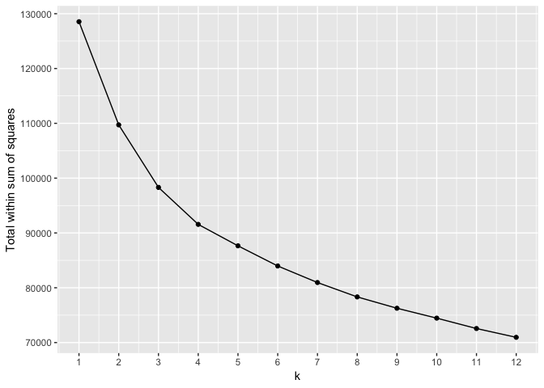
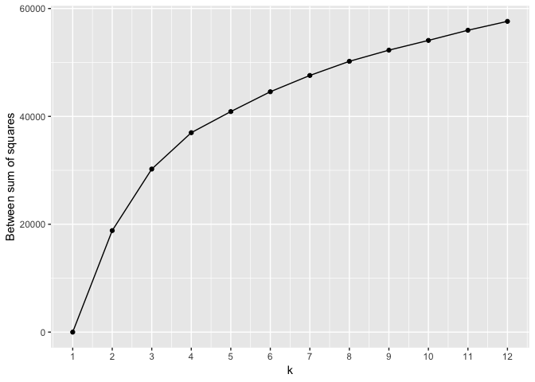
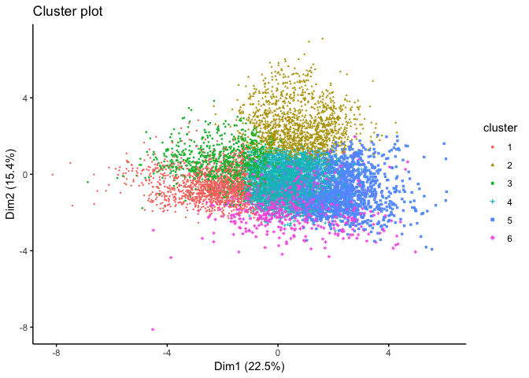
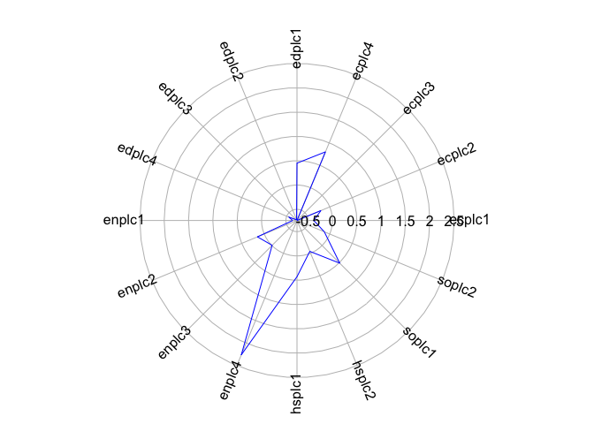
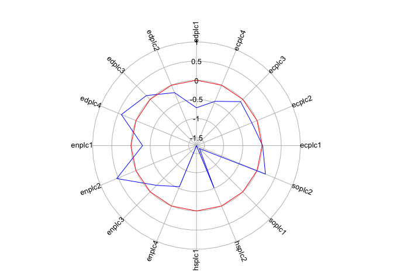
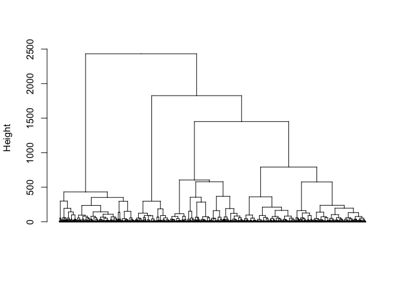

<style>
p.comment {
background-color: #DBDBDB;
padding: 10px;
border: 1px solid black;
margin-left: 25px;
border-radius: 5px;
font-style: italic;
}

h1.title {
  font-weight: bold;
}

</style>
\


In this guide you will learn how to condense a suite of neighborhood variables into a single numerical index and a categorical classification using R.  Both methods are often used within the context of opportunity mapping. The objectives of the guide are as follows

1. Understand the data workflow for computing indices and classifications
2. Learn about standardization
3. Create a numeric index of opportunity
4. Create a classification of neighborhood context

<div style="margin-bottom:25px;">
</div>
## **Load necessary packages**
\

We'll be introducing four new packages in this lab: **factoextra**,  **plotrix**, **NbClust** and **dendextend**.


```r
install.packages("factoextra")
install.packages("plotrix")
install.packages("NbClust")
install.packages("dendextend")
```

We'll also be using the **tidyimpute** and **VIM** packages to impute for missingness.  If you have not gone through the missing data [mini lab](https://crd230.github.io/missingdata.html), you'll need to install those packages.

Load in the following packages


```r
library(tidyverse)
library(sf)
library(tigris)
options(tigris_class = "sf")
library(VIM)
library(tidyimpute)
library(tmap)
```


<div style="margin-bottom:25px;">
</div>
## **Workflow**
\

As we discussed in lecture, the basic workflow for creating a neighborhood index or typology is as follows

1. Establish the theoretical framework for the model
2. Collect data on variables that capture important contextual features of a neighborhood
3. Clean, process, and transform input variables
4. Select modelling approach: numeric or categorical
5. Run, refine, alter and expand model
6. Map your index/typology

Keeping this workflow in mind let's start out with opportunity indices.

<div style="margin-bottom:25px;">
</div>
## **Opportunity Indices**
\

We're going to use the underlying 2014 tract-level data that make up the the [Regional Opportunity Index (ROI)](https://interact.regionalchange.ucdavis.edu/roi/data.html), which is a numeric index of opportunity for California neighborhoods created by the [Center for Regional Change (CRC)](https://regionalchange.ucdavis.edu/) at the University of California, Davis.  The CRC provides the underlying data for the ROI on their website.  Bring in these data, which I've made available on Github, into R


```r
roi.tract.data <- read_csv("https://raw.githubusercontent.com/crd230/data/master/roi_data_2014.csv")
```

The data are largely cleaned. This includes converting variable counts to percentages, ratios, and rates where appropriate.  The variables correspond to different place dimensions: Education, Economic, Housing, Health/Environment, and Civic Life.  Detailed information on these domains and their variables can be found on the [ROI website](https://interact.regionalchange.ucdavis.edu/roi/Download_Data/ROI%20Metadata.pdf). You can view the record layout for the variables in *roi.tract.data* [here](https://raw.githubusercontent.com/crd230/data/master/record_layout.xlsx).  Note that the ROI has two indices: one for people and another for place.  We will be working on data for the place index.

I said that the data are *largely* cleaned.  We still have some missingness to deal with.


```r
summary(aggr(roi.tract.data))
```

The CRC does not impute for missigness, but let's do so here to get a complete data set.  Use the `impute_mean()` function to impute the mean for missing values. The mean percent Hispanic is likely very different in Butte county than in Los Angeles county. Rather than imputing the California state mean, let's use `group_by()` to impute the county means.  The variable *cntyfips* provides the unique county ID.


```r
roi.tract.data <- roi.tract.data %>%
    group_by(cntyfips) %>%
    impute_mean(edplc1:soplc2) %>%
    ungroup()
summary(aggr(roi.tract.data))
```

The one variable still missing values is *placenm* which provides the name of the place/city, which we don't need to worry about in this guide. 

<div style="margin-bottom:25px;">
</div>
### **Standardizing variables** 
\

In order to combine variables into either an index or typology, we need to transform and standardize them.  First, [transforming](https://en.wikipedia.org/wiki/The_Transformers_(TV_series)). Higher values on an opportunity index should mean more opportunity. This means the variables used in the index should also be scaled that way. However, not all variables follow this format.  For example, the variable *edplc4* is the percentage of high school students in the school district who were suspended or expelled.  Higher values here indicate lower opportunity.  These indicators need to be inverted before including them in the index.  For percentages, subtract them from 100 (or 1 if you've kept them in proportional form).  Variables on other scales are inverted by the reciprocal of the variable (1 divided by the value). The other variable in the data set that needs inversion is *enplc4*, the annual mean concentration of PM2.5 (exposure to pollution).


```r
roi.tract.data <-roi.tract.data %>%
  mutate(edplc4 = 100-edplc4, enplc4 = 1/enplc4) 
```

Next, we need to standardize the variables. We do this to get the variables onto the same scale.  That is, variables are measured across multiple measurement scales, from percentages such as percent non-Hispanic black to ratios such as population density, and we want to transform these variables to make apple to apple comparisons.  The CRC uses min-max scaling to standardize variables. Min-max scaling expresses variables as a percentage of the range between the minimum and maximum values of that variable. Here, we'll instead use the more common approach to standardizing variables - creating z-scores.  The z-score is a measure of distance from the mean, in this case the mean of all tracts in California.  


Let's calculate the z-score for the variable *hsplc1*.  Create a variable named *hsplc1z* that subtracts from each tract's value on *hsplc1* the total mean of *hsplc1* and then divide by the standard deviation of *hsplc1*.  The mean and standard deviation of *hsplc1* should be 0 and 1 respectively.


```r
roi.tract.data %>%
  mutate(hsplc1z = (hsplc1-mean(hsplc1))/sd(hsplc1)) %>%
  summarize(hsplc1zm = mean(hsplc1z), hsplc1zs = sd(hsplc1z))
```

We need to do this for all variables in the data set. The complete ROI incorporates 31 variables.  Yes, you can repeat the above code 31 times, but is there a more efficient way? Why yes!  Instead of writing out the above code for every variable, we can *gather* the data as described on page 152-154 in RDS using the function `gather()` 


```r
roi.std <-roi.tract.data %>%
  gather(variable, value, -c(cntyfips, cntyname, tract, placenm)) %>%
  group_by(variable) %>%
  mutate(mean = mean(value), sd = sd(value), z = (value-mean)/sd) %>%
  select(-(c(value, mean, sd))) %>%
  spread(variable, z)
```

Let's explain the above code line by line.  The `gather()` function transforms *roi.tract.data* into a tract by variable data set.  The `group_by()` function groups the data set by *variable*.  In the `mutate()` command, we calculate the mean, standard deviation, and the z-score for each variable.  We discard unnecessary variables in the `select()` command, and then spread the data back to a tract-level data set using the `spread()` function. Instead of 30+ lines of code, we were able to complete the task of standardizing all variables in 6 lines of code.  Efficiency is next to godliness. Or something like that. 

<div style="margin-bottom:25px;">
</div>
### **Combining into domains**
\

The next step is to take the average of the variables within each of the ROI domains.  The CRC takes the [geometric mean](https://en.wikipedia.org/wiki/Geometric_mean), but let's once again go with the simple route, the basic mean.  The crosswalk between variables and domains is provided in the [record layout](https://raw.githubusercontent.com/crd230/data/master/record_layout.xlsx).  


```r
roi.std <- mutate(roi.std, Education = (edplc1+edplc2+edplc3+edplc4)/4, 
                  Economic = (ecplc1+ecplc2+ecplc3+ecplc4)/4, Housing = (hsplc1+hsplc2)/2, 
                  Health = (enplc1+enplc2+enplc3+enplc4)/4, Civic = (soplc1+soplc2)/2)
```

We then average the domain specific averages to get an overall index.


```r
roi.std <- mutate(roi.std, Overall =(Education+Economic+Housing+Health+Civic)/5)
```

<div style="margin-bottom:25px;">
</div>
### **Mapping the indices**
\

We've got our indices, now it's time to map them!  The object *roi.std* is a regular data frame of Census tracts in California.  Let's bring in a shapefile of California census tracts using the `tracts()` function from the **tigris** package.  Note that the Census ID in *roi.std* is in numeric form, so we'll need to make the Census ID in the **tigris** tract file also a numeric.


```r
ca.tracts <- tracts("CA") %>%
#Converts GEOID from character to numeric to match roi.std
              mutate(tract = as.numeric(GEOID))
```

You may notice that *ca.tracts* has more rows than *roi.std*.  It looks like CRC took some tracts out, potentially because these tracts have no populations. Next, we merge the indices from *roi.std* into the **sf** object *ca.tracts* using `left_join()`


```r
ca.tracts.z <- left_join(ca.tracts, roi.std, by = "tract")
```

Finally, we use **tmap** functions to map the indices.  Let's put the map into view mode so we can zoom in and out of different areas of California. Following how the ROI is presented by the CRC on their website, we break the categories into quintiles where darker green indicates higher opportunity and darker brown represents lower opportunity. First, here's the overall index. 


```r
ca.map.ind.ov <- tm_shape(ca.tracts.z) +
  tm_polygons(col = "Overall", style = "quantile", palette = "BrBG",
              border.alpha = 0, alpha = 0.75, title = "Overall Opportunity")
tmap_mode("view")
ca.map.ind.ov + tm_view(basemaps="Hydda.Full")
```

What is the Opportunity landscape like in the City of Davis? Zoom in and find out.

The legend is not very illustrative. We can add labels to the legend to indicate lowest to highest opportunity (similar to the ROI [online mapping tool](https://interact.regionalchange.ucdavis.edu/roi/webmap/webmap.html)).  We'll first cut the *Overall* variable into quintiles (five equal groups) using the `cut()` and `quantile()` commands together and then attach labels to the groups. 


```r
ca.tracts.z <- mutate(ca.tracts.z, OverallQ = cut(Overall, breaks=quantile(Overall, c(0,0.2,0.4,0.6,0.8,1), na.rm=TRUE), labels = c("Lowest Opportunity", "Low", "Moderate", "High", "Highest Opportunity")))
```

To be clear, `quantile()` extracts the 0, 20th, ... 80th, and 100th percentile values of the variable *Overall*.  The function `cut()` codes the values of *Overall* into the groupings designated by the `breaks` argument, in this case the percentile groupings (0 to 20th is one grouping, above 20th to 40th is the next, and so on).  This coding is saved in the variable *OverallQ*.  We add the labels "Lowest Opportunity", "Low" and so on to the groupings.

Now let's map the overall opportunity index with the labels.  Note that if you're comparing your map with the CRC's map, it won't match because we made some different decisions with the data (imputing for missing data, calculating the z-score, etc.).


```r
ca.map.ind.ec <- tm_shape(ca.tracts.z) +
  tm_polygons(col = "OverallQ",  palette = "BrBG",
              border.alpha = 0, title = "Overall Opportunity", midpoint = NA)
ca.map.ind.ec + tm_view(basemaps="Hydda.Full")
```

<div style="margin-bottom:25px;">
</div>
## **Geodemographic classification**
\

Rather than numeric indices, geodemographic classification combines variables into neighborhood typologies.  There is no single or correct method for building a geodemographic classification.  Geodemographic classification is part science, part art. As such, some of the decisions you will make may be subjective.  The key is that you as the modeler can defend your choices.  Some of these choices can be defended via statistical algorithms.  Others by drawing on your own understanding of the communities under study.  

Let's create a typology using the ROI data.  What are the steps?

1. Just like with indices, you need to standardize all your input variables, which we've already done. Note that unlike an index, you don't need to transform them because we're not creating a linear or continuous measure of opportunity.

2. Determine how many types (or categories or clusters) are appropriate.  

3. Use a statistical algorithm to classify neighborhoods based on the input variables

<div style="margin-bottom:25px;">
</div>
### **K-means clustering**
\

K-means clustering is the most commonly used algorithm for partitioning a given data set into a set of k clusters (i.e. k types), where k represents the number of groups pre-specified by the analyst. We're going to be using the function `kmeans()` which is preloaded in R.  In order to use `kmeans()`, you'll need to input a data frame containing just your numeric variables.  This means we need to take out all the ID variables (county, tract, etc.) from *roi.std*.  We'll also need to drop the domain indices we calculated above


```r
subset.data <-  select(roi.std, -(c(cntyfips:placenm, Education:Overall)))
```

Let's run the `kmeans()` function using k = 3.


```r
kmeans(subset.data, centers=3,nstart=25,iter.max = 1000000)
```

The `kmeans()` function accepts a data set input - in this case *subset.data*. 

* `centers` specifies the number of clusters k =3. 
* `iter.max` indicates the number of iterations you run the kmeans algorithm, which should be set to a large number to allow it to complete.  This is the "Iterate" part of Step 2 in the James et al. chapter (page 388).
* `nstart` tells `kmeans()` to try that many random starts and keep the best. If a value of `nstart` greater than one is used, then K-means clustering will be performed using multiple random assignments in Step 1 of Algorithm 10.1 in the James et al. chapter (page 388). With 25 to 50 random starts, you’ll generally find the overall best solution.

The results provide information about the 3 clusters, including their size, their means of the input variables (which make up their centroids), the within and between sum of squares, and the most important result, the cluster assignment.  

<div style="margin-bottom:25px;">
</div>
### **Choosing the best k**
\

You might be wondering why we chose 3 in the example above.  Well, there was no reason, we just used 3 to illustrate the usage of `kmeans()`. It is up to the modeler to select k.  How does one choose the appropriate k? In choosing k, keep these major aims of cluster analysis in mind.

1. Each cluster should be homogeneous as possible
2. Each cluster group should be distinct from the other groups
3. The groups should be as evenly sized as possible

In addition, to each of these, we must also consider the compositions of the cluster groups. In other words, can we succinctly describe each cluster type?

One method for selecting the best k is to run k-means with different cluster frequency (k), and for each result, examine a statistic called the [total within cluster sum of squares](https://en.wikipedia.org/wiki/K-means_clustering) (wss). This is a measure of how well the cluster frequency fits the data.  The total wss measures the compactness of the clustering by calculating the distance between the values of each tract in a cluster and the cluster's centroid.  We we want this value to be as small as possible. In other words, it helps us capture criteria 1 above. Another statistic that is often examined is the total between cluster sum of squares (bss). Here, you are calculating the distance between cluster centroids from the overall mean. To capture criteria 2, we would want the bss to be as large as possible. 

These values are typically plotted across each k, with the purpose to identify an "elbow criterion" which is a visual indication of where an appropriate cluster frequency might be set. The elbow or kink indicates where the decrease in the wss (or increase in the bss) might be leveling off.  This elbow criterion is trying to strike a balance of minimizing wss (or maximizing bss) but choosing a value of k that is reasonable.

We can use the following algorithm to define the optimal clusters:

1. Compute the clustering algorithm for different values of k, varying k from 1 to *n* clusters
2.  For each k, calculate wss and bss.
3.  Plot the curve of wss and  bss according to the number of clusters k.
4.  The location of a bend (knee) in the plot is generally considered as an indicator of the appropriate number of clusters.


Starting with step 1, let's test k clusters from 1 to 12 (you can also test k's greater than 12, but it isn't necessary in most situations)

The following code calculates the wss and bss.


```r
# Create a new empty numeric object to store the wss and bss results
wss <- numeric()
bss <- numeric()

# Run k means for 1-12 clusters and store the wss and bss results
for (k in 1:12) {
  km <- kmeans(subset.data, centers=k,nstart=25,iter.max = 1000)
  wss[k] <- km$tot.withinss
  bss[k] <- km$betweenss
}
# Create a data frame with the results, adding a further column for the cluster number
wss <- data.frame(1:12,wss)
bss <- data.frame(1:12,bss)
```

I introduced the `for()` function or loop above.  The `for()` function tells R to run the code between the brackets `{` and `}` for `k` from 1 to 12.  That is, when you execute the three lines of code in between the brackets, R will choose k to equal to 1 and insert the number 1 anywhere k is found in the code.  Once that is done, R will then set k to equal to 2 and run the code again.  R will do (or loop through) this until it reaches 12.  The for loop is running the `kmeans()` function for k = 1 to 12 - storing the wss and bss for each k in the vector *wss* and *bss*, respectively.  

The following lines of code plots wss.  


```r
# Plot the results
names(wss) <- c("k","Twss")
ggplot(data=wss, aes(x= k, y=Twss)) + geom_path() + geom_point() + scale_x_continuous(breaks=1:12) + labs(y = "Total within sum of squares")
```

<!-- -->

We're looking for the portion of the plot where a kink or elbow appears or when the drop off from one k to the next is not as significant.  It looks like it is around 4 to 7. Let's look at the bss.


```r
names(bss) <- c("k","bss")
ggplot(data=bss, aes(x= k, y=bss)) + geom_path() + geom_point() + scale_x_continuous(breaks=1:12) + labs(y = "Between sum of squares")
```

<!-- -->

Here, were also looking for a kink or when the increase in k starts to level off.  Similar to the wss, there is not a clear elbow, but the leveling off starts around 4 to 7.

If you're not satisfied with the above exploratory method, you can employ the `NbClust()` command found in the **NbClust** package.  The command tests 30 indices for determining the number of clusters.  All of these indices are similar to the wss or bss in that it is examining best fit across different values of k.  As the package's creators describe in their [documentation](https://cran.r-project.org/web/packages/NbClust/NbClust.pdf), the function "enables the user to simultaneously evaluate several clustering schemes while varying the number of clusters, to help determining the most appropriate number of clusters for the data set of interest."  


The function `NbClust()` will take a *long* time to run because it's computing 30 indices on a data set of over 8,000 observations for a range of k values.  Run the code on your own time when you have the patience and time.  For now, I present the code  


```r
library(NbClust)
nb <- NbClust(subset.data, min.nc=2, max.nc=12, method = "kmeans")
```

The arguments `min.nc=1` and `max.nc=12` tells the function to calculate the indices for k =1 to k=12.  The argument `method = "kmeans"` gives the kind of clustering method you want to test, in our case kmeans.  

The results of running the `NbClust()` function will tell you the number of indices that show the best fit by k.  
              
Based on the wss and bss plots, let's run the k-means algorithm for k = 6.  As the James et al. chapter states, testing the robustness of your findings is very important, so we choose k = 6 with the understanding that we'll select other k values later to see how results change.


```r
cluster_6 <- kmeans(x=subset.data, centers=6, nstart=25,iter.max = 1000000)
```


<div style="margin-bottom:25px;">
</div>
### **Evaluating a classification**
\

Having selected the number of clusters for the k-means model, we want to examine or visualize the fit.  If we see a poor fit, we may adjust the the number of clusters.  One way of doing this is by examining a principal component or cluster plot. It plots each of the cases in our data against the first 2 principal components and colors them by their cluster group from our K-means model. You could also try rerunning the K-means again with different number of groups to see how well the models discriminate based on two principal components. 

We will be using the function `fviz_cluster()` to create a cluster plot, which is located in the **factoextra** package.  Load this package in.


```r
library(factoextra) 
```

Then use `fviz_cluster()` as follows


```r
fviz_cluster(cluster_6, data = subset.data, geom = "point", ellipse = F, pointsize = 0.5,
ggtheme = theme_classic())
```

<!-- -->

When examining a cluster plot, see if you can find k identifiable groups.  In other words,  you should see a separation of color. We find in the above plot that this is mostly the case - can you identify 6 distinct color/shapes?  You might notice that although there are obvious clusters in the graphs, there are some points that may overlap with other clusters. This is because the data we used is complex and includes several variables which may be exerting unique patterns. 

The cluster type is stored in the variable *cluster* within *cluster_6*. We can see the distribution of tracts by cluster


```r
table(cluster_6$cluster)
```

```
## 
##    1    2    3    4    5    6 
##  614 1332 1442 2328 1324  995
```

Remember one of the major aims of cluster analysis:  the groups should be as evenly sized as possible. You might consider dropping the number of clusters down to 5 given the presence of the cluster with 614 tracts.  Set k = 5 in `kmeans()`. Or examine the characteristics of that cluster and see if it can be combined with another cluster. 

<div style="margin-bottom:25px;">
</div>
### **Mapping the cluster types**
\

Save `cluster_6$cluster` as a new variable in *roi.std*.  We have to make the cluster variable a character using the function `as.character()` because we are constructing a categorical (not numeric) classification of neighborhoods.


```r
roi.std <- roi.std %>%
  mutate(KCluster = as.character(cluster_6$cluster) )
```

Join *roi.std* to *ca.tracts* and then map the cluster variable *Cluster*.


```r
ca.tracts.cl <- left_join(ca.tracts, roi.std, by = "tract")
ca.map.k <- tm_shape(ca.tracts.cl, unit = "mi") +
  tm_polygons(col = "KCluster", style = "cat",
              border.alpha = 0, alpha = 0.75, title = "Cluster")
ca.map.k + tm_view(basemaps="Hydda.Full")
```

<div style="margin-bottom:25px;">
</div>
### **Labelling the clusters**
\

You should examine the means of the input variables by cluster.  This will give you a sense of what these clusters look like.  These means actually represent the centroids of each cluster. In other words, the cluster centers indicate the coordinates of the centroid for each cluster group once the k-means had reached its optimum solution. It, therefore, is a good indicator of the average characteristics of each group based on the variables that were included in the original model.

We inputted Z-score standardized data into the model, therefore the cluster centers are still represented as Z-scores. Zero represents the mean for each variable and values above or below indicate the number of standard deviations away from the average. The values can, therefore, be used to very easily understand how unique each group is relative to the whole sample.

The centers are saved as the object *centers* within *cluster_6*.  Let's extract it and save it as a data frame.


```r
KmCenters <- as.data.frame(cluster_6$centers)
KmCenters
```

The rows represent the 6 clusters and the columns represent the variables used in the k-means model.  Is it immediately clear what your groups represent? Probably not. It might be easier to create charts to visualize the characteristics of each cluster group. We can create radial plots to do this.  The main idea behind a radial plot is to project the data as a distance from the center in a circular form. We create radial plots in R using the function `radial.plot()` which is a part of the **plotrix** package.  


```r
library(plotrix)
```

Let's create a radial plot for cluster 1.


```r
radial.plot(KmCenters[1,], labels = colnames(KmCenters), boxed.radial = FALSE, show.radial.grid = TRUE, line.col = "blue", radlab = TRUE, rp.type = "p")
```

<!-- -->

The closer the polygon vertex is to the edge of the circle, the higher the cluster mean for that variable.  Now let's plot a zero line to indicate the average for the whole data.


```r
# creates a object of six zeros (remember we have 6 groups)
KmCenters[6,]<- c(0)
# this reduces the size of grid and axis labels in upcoming plots
par(cex.axis = 0.8, cex.lab = 0.8)

radial.plot(KmCenters[c(1,6),], labels = colnames(KmCenters), boxed.radial = FALSE, show.radial.grid = TRUE, line.col = c("blue", "red"), radlab = TRUE, rp.type = "p", show.grid.labels = 3)
```

<!-- -->

Remember that our variables are standardized - anything above 0 (the red circle) is above the mean and below 0 is below the mean.  If, for example, a cluster is well below 0 in percent Hispanic (well below the red circle) but well above 0 in percent non-Hispanic white, the neighborhoods making up this cluster can be characterized as predominantly white.  Create radial plots for the other clusters by replacing the 1 in `KmCenters[c(1,6),]` with 2, 3, 4 and so on. You should also present the means or medians of variables in their non-transformed format such as Table 5 in the Knaap (2017) reading. 

A couple of geographers created a geodemographic classification of U.S. neighborhoods using 136 variables from the American Community Survey. They mapped their results and posted it publicly on [Carto](https://observatory.carto.com/viz/6391d2a6-fc12-11e5-b612-0e3ff518bd15/public_map).  


<div style="margin-bottom:25px;">
</div>
## **Hierarchical Clustering**
\

Hierarchical clustering, as is denoted by the name, involves organizing your data into a kind of hierarchy. The common approach is what’s called an agglomerative approach. This is a kind of bottom up approach, where you start by thinking of the data as individual data points. Then you start lumping them together into clusters little by little until eventually your entire data set is just one big cluster.

Just like for K-means, we need to keep just the model input variables.  Let's save them into a new object called *roi.std2*


```r
roi.std2<- roi.std %>%
          select(ecplc1:soplc2)
```


Looking at Algorithm 10.2 in the James et. al chapter, our first step is to measure pairwise dissimilarity.  We do this using the function `dist()`, which is a part of the **stats** package, which is already preinstalled.  Let's use Euclidean distance to measure dissimilarity.


```r
#calculate distance/dissimilarity
dist_mat <- dist(roi.std2, method = 'euclidean')
```

The object *dist_mat* yields a distance matrix.

Next step is to run the hierarchical clustering method.  There are a number of canned functions in R that run the method, but let's use `hclust()`, which is also a part of the **stats** package.  We plug in the distance matrix we computed above and specify the linkage.  James et al. list four common approaches on page 395, and all are available in `hclust()`, but let's use the [Ward's D](https://en.wikipedia.org/wiki/Ward%27s_method).  


```r
hfit <- hclust(dist_mat, method="ward.D") 
```

We can then evaluate the dendrogram.  We need to create a dendrogram object from *hfit*, which we do using the `as.dendrogram()` function in the **dendextend** package.  


```r
library(dendextend)
hcd <- as.dendrogram(hfit)
```

We then plot the dendrogram using the basic `plot()` function


```r
plot(hcd, ylab = "Height",  leaflab = "none")
```

<!-- -->

By default, `plot()` will provide the tract IDs on the x-axis.  That's fine if you've got a small number of observations, but we've got 8,000+.  The argument `leaflab = "none"` drops the labels on the x-axis.

As the James et a. chapter mentions, there is no standardized way for determining where to cut the dendrogram.  They state "people often look at the dendrogram and select by eye a sensible number of clusters, based on the heights of the fusion and the number of clusters desired."  What does your eyes tell you?

Let's say we cut the dendrogram such that we get 6 clusters.  We can use the following code to color the branches based on the 6 clusters


```r
hcd %>% set("branches_k_color",  k = 6) %>% 
   plot(main = "Six clusters",  leaflab = "none")
```

<!-- -->

where `k= 6` indicates the number of clusters.

Once we've decided where to cut and thus how many clusters, we use the `cutree()` function on *hfit* to get the cluster labels.  We'll need to save this back into *roi.std*.  


```r
roi.std2 <- roi.std %>%
  mutate(HCluster = as.character(cutree(hfit, k=6) ) ) %>%
  select(tract, HCluster)
```

Join the cluster labels to the california tract spatial object.


```r
ca.tracts.cl <- left_join(ca.tracts.cl, roi.std2, by = "tract")
```

And map


```r
ca.map.hcl <- tm_shape(ca.tracts.cl, unit = "mi") +
  tm_polygons(col = "HCluster", style = "cat",
              border.alpha = 0, alpha = 0.75, title = "Cluster")
ca.map.hcl + tm_view(basemaps="Hydda.Full")
```

Hierarchical clustering results are fairly sensitive to the distance dissimiarlity chosen, the type of linkage specified, and where you cut the dendrogram.  Play around with these parameters and see how much the results change.  


***


Website created and maintained by [Noli Brazil](https://nbrazil.faculty.ucdavis.edu/)


