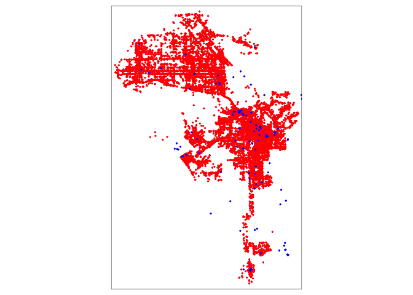
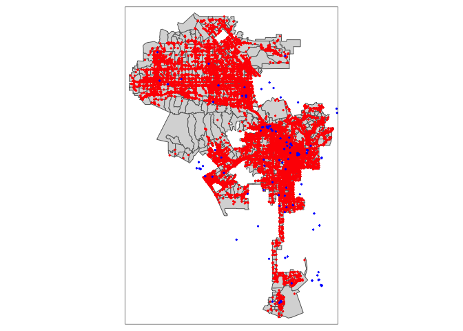

<style>
p.comment {
background-color: #bdced6;
padding: 10px;
border: 0px solid black;
margin-left: 25px;
border-radius: 5px;
font-style: normal;
}

h1.title {
  font-weight: bold;
  font-family: Arial;  
}

h2.title {
  font-family: Arial;  
}

</style>


<style type="text/css">
#TOC {
  font-size: 13px;
  font-family: Arial;
}
</style>


\


In [Lab 3](https://crd230.github.io/lab3.html), you learned how to process spatial data in R, focusing primarily on reading in, wrangling and mapping *areal* or *polygon* data.  In this lab, we will cover *point* data in R. More broadly, we will cover how to access and clean data from Open Data portals. In Lab 4b, we will learn how to process Big Data using Twitter Tweets as a case example. The objectives of this guide are

1. Learn how to read in point data
2. Understand Coordinate Reference Systems
3. Learn how to reproject spatial data
5. Learn how to bring in data from OpenStreetMap
6. Learn how to map point data

To achieve these objectives, we will first examine the spatial distribution of homeless encampments in the City of Los Angeles using 311 data downloaded from the city's [open data portal](https://data.lacity.org/).  This lab guide follows closely and supplements the material presented in Chapters 2.4, 4.2, 6 and 8 in the textbook [Geocomputation with R](https://geocompr.robinlovelace.net/) (GWR) and class Handout 3.  

<div style="margin-bottom:25px;">
</div>
## **Installing and loading packages**
\

You'll need to install the following packages in R.  You only need to do this once, so if you've already installed these packages, skip the code.  Also, don't put these `install.packages()` in your R Markdown document.  Copy and paste the code in the R Console.


```r
install.packages("tidygeocoder")
install.packages("osmdata")
```

You'll need to load the following packages.  Unlike installing, you will *always* need to load packages whenever you start a new R session. You'll also always need to use `library()` in your R Markdown file.


```r
library(sf)
library(tidyverse)
library(units)
library(tmap)
library(tidycensus)
library(tigris)
library(rmapshaper)
library(tidygeocoder)
library(leaflet)
library(osmdata)
```


<div style="margin-bottom:25px;">
</div>
## **Read in census tract data**
\

We will need to bring in census tract polygon features and racial composition data from the 2015-2019 American Community Survey using the Census API and keep tracts within Los Angeles city boundaries using a clip.  The code for accomplishing these tasks is below.  We won't go through each line of code in detail because we've covered all of these operations and functions in prior labs.  I've embedded comments within the code that briefly explain what each chunk is doing, but go back to prior guides (or RDS/GWR) if you need further help.  The only new code I bring in is the use of `output = "wide"` in the  `get_acs()` command.  I use the code `rename_with(~ sub("E$", "", .x), everything())` to eliminate the *E* at the end of the variable names for the estimates.  Prior to this lab, we brought in a long dataset and used `spread()` to go from long to wide.


```r
# Bring in census tract data. 
ca.tracts <- get_acs(geography = "tract", 
              year = 2017,
              variables = c(tpop = "B01003_001", tpopr = "B03002_001", 
                            nhwhite = "B03002_003", nhblk = "B03002_004",
                             nhasn = "B03002_006", hisp = "B03002_012"),
              state = "CA",
              survey = "acs5",
              output = "wide",
              geometry = TRUE)
# Make the data tidy, calculate percent race/ethnicity, and keep essential vars.
ca.tracts <- ca.tracts %>% 
  rename_with(~ sub("E$", "", .x), everything()) %>%
  mutate(pnhwhite = nhwhite/tpopr, pnhasn = nhasn/tpopr, 
              pnhblk = nhblk/tpopr, phisp = hisp/tpopr) %>%
  dplyr::select(c(GEOID,tpop, pnhwhite, pnhasn, pnhblk, phisp))  

# Bring in city boundary data
pl <- places(state = "CA", cb = TRUE)

# Keep LA city
la.city <- filter(pl, NAME == "Los Angeles")

#Clip tracts using LA boundary
la.city.tracts <- ms_clip(target = ca.tracts, clip = la.city, remove_slivers = TRUE)
```


<div style="margin-bottom:25px;">
</div>
## **Read in point data**
\

Point data give us the locations of objects or events within an area. Events can be things like crimes and car accidents. Objects can be things like trees, houses, jump bikes or even people, such as the locations of where people were standing during a protest. 

Often you will receive point data in tabular (non-spatial) form. These data can be in one of two formats

1. Point longitudes and latitudes (or X and Y coordinates) 
2. Street addresses

If you have longitudes and latitudes, you have all the information you need to make the data spatial. This process involves using geographic coordinates (longitude and latitude) to place points on a map. In some cases, you won’t have coordinates but street addresses. Here, you’ll need to geocode your data, which involves converting street addresses to geographic coordinates. These tasks are intimately related to the concept of projection and reprojection, and underlying all of these concepts is the Coordinate Reference System. 


<div style="margin-bottom:25px;">
</div>
### **Longitude/Latitude**
\

Best case scenario is that you have a point data set with geographic coordinates. Geographic coordinates are in the form of a longitude and latitude, where longitude is your X coordinate and spans East/West and latitude is your Y coordinate and spans North/South.

Let’s bring in a csv data set of homeless encampments in Los Angeles City, which was downloaded from the [Los Angeles City Open Data portal](https://data.lacity.org/A-Well-Run-City/MyLA311-Service-Request-Data-2019/pvft-t768). I uploaded the data set on GitHub so you can directly read it in using `read_csv()`


```r
homeless311.df <- read_csv("https://raw.githubusercontent.com/crd230/data/master/homeless311_la_2019.csv")
```

The data represent homeless encampment locations in 2019 as reported through the City's [311 system](https://www.lacity.org/311-services).  To download the data from LA's open data portal linked above, I did the following

1. Click on *View Data*.   This will bring up the  data in an excel style worksheet.
2. You'll find that there are over one million 311 requests in 2019.  Rather than bringing all of these requests into R, let's just filter for homeless encampments.  To do this, click on *Filter*,  *Add a New Filter Condition*, select *Request Type* from the first pull down menu, then type in *Homeless Encampment* in the first text box.
3. Click on *Export* and select *CSV*.  Download the file into an appropriate folder on your hard drive.

Viewing the file and checking its class you'll find that *homeless311.df* is a regular tibble, not a spatial **sf** points object.

We will use the function `st_as_sf()` to create a point **sf** object of *homeless311.df*.  The function requires you to specify the longitude and latitude of each point using the `coords =` argument, which are conveniently stored in the variables *Longitude* and *Latitude*. 


```r
homeless311.sf <- st_as_sf(homeless311.df, coords = c("Longitude", "Latitude"))
```


<div style="margin-bottom:25px;">
</div>
### **Street Addresses**
\

Often you will get point data that won’t have longitude/X and latitude/Y coordinates but instead have street addresses. The process of going from address to X/Y coordinates is known as geocoding. 

To demonstrate geocoding, type in your street address, city and state inside the quotes below.  


```r
myaddress.df  <- tibble(street = "", city = "", state = "")
```

This creates a tibble with your street, city and state saved in three variables. To geocode addresses to longitude and latitude, use the function `geocode()` which is a part of the **tidygeocoder** package.  Use `geocode()` as follows


```r
myaddress.df <- geocode(myaddress.df, street = street, city = city, state = state, method = "osm")
```

Here, we specify street, city and state variables.  The argument `method = 'osm'` specifies the geocoder used to map addresses to longitude/latitude locations, in the above case `'osm'` stands for [OpenStreetMaps](https://www.openstreetmap.org/#map=4/38.01/-95.84).  Think of R going to the OpenStreetMaps website, searching for each address,  plucking the latitude and longitude of your address, and saving it in a tibble named *myaddress.df*

If you view this object, you'll find the latitude *lat* and longitude *long* attached as columns. Convert this point to an **sf** object using the function `st_as_sf()`.


```r
myaddress.sf <- st_as_sf(myaddress.df, coords = c("long", "lat"))
```

Type in `tmap_mode("view")` and then [map](https://crd230.github.io/lab3.html#Mapping_in_R) *myaddress.sf*.  Zoom into the point.  Did it get your home address correct?

<br>

Let's bring in a csv file containing the street addresses of [homeless shelters and services in Los Angeles County](https://data-lahub.opendata.arcgis.com/datasets/b0f7b2ebce0146069c74abf4b25a6688_158) , which I also downloaded from Los Angeles' open data portal.


```r
shelters.df <- read_csv("https://raw.githubusercontent.com/crd230/data/master/Homeless_Shelters_and_Services.csv")

glimpse(shelters.df)
```

```
## Rows: 182
## Columns: 23
## $ source       <chr> "211", "211", "211", "211", "211", "211", "211", "211", …
## $ ext_id       <lgl> NA, NA, NA, NA, NA, NA, NA, NA, NA, NA, NA, NA, NA, NA, …
## $ cat1         <chr> "Social Services", "Social Services", "Social Services",…
## $ cat2         <chr> "Homeless Shelters and Services", "Homeless Shelters and…
## $ cat3         <lgl> NA, NA, NA, NA, NA, NA, NA, NA, NA, NA, NA, NA, NA, NA, …
## $ org_name     <chr> NA, NA, NA, NA, NA, NA, NA, NA, NA, "www.catalystfdn.org…
## $ Name         <chr> "Special Service For Groups -  Project 180", "1736 Famil…
## $ addrln1      <chr> "420 S. San Pedro", "2116 Arlington Ave", "1736 Monterey…
## $ addrln2      <chr> NA, "Suite 200", NA, NA, NA, NA, "4th Fl.", NA, NA, NA, …
## $ city         <chr> "Los Angeles", "Los Angeles", "Hermosa Beach", "Monrovia…
## $ state        <chr> "CA", "CA", "CA", "CA", "CA", "CA", "CA", "CA", "CA", "C…
## $ hours        <chr> "SITE HOURS:  Monday through Friday, 8:30am to 4:30pm.",…
## $ email        <lgl> NA, NA, NA, NA, NA, NA, NA, NA, NA, NA, NA, NA, NA, NA, …
## $ url          <chr> "ssgmain.org/", "www.1736fcc.org", "www.1736fcc.org", "w…
## $ info1        <lgl> NA, NA, NA, NA, NA, NA, NA, NA, NA, NA, NA, NA, NA, NA, …
## $ info2        <lgl> NA, NA, NA, NA, NA, NA, NA, NA, NA, NA, NA, NA, NA, NA, …
## $ post_id      <dbl> 772, 786, 788, 794, 795, 946, 947, 1073, 1133, 1283, 135…
## $ description  <chr> "The agency provides advocacy, child care, HIV/AIDS serv…
## $ zip          <dbl> 90013, 90018, 90254, 91016, 91776, 90028, 90027, 90019, …
## $ link         <chr> "http://egis3.lacounty.gov/lms/?p=772", "http://egis3.la…
## $ use_type     <chr> "publish", "publish", "publish", "publish", "publish", "…
## $ date_updated <chr> "2017/10/30 14:43:13+00", "2017/10/06 16:28:29+00", "201…
## $ dis_status   <chr> NA, NA, NA, NA, NA, NA, NA, NA, NA, NA, NA, NA, NA, NA, …
```

The file contains no latitude and longitude data, so we need to convert the street addresses contained in the variables *addrln1*, *city* and *state*.  Use the function `geocode()`.  The process will take a few minutes so be patient.


```r
shelters.geo <- geocode(shelters.df, street = addrln1, city = city, state = state, method = 'osm')
```

Look at the column names.


```r
names(shelters.geo)
```

```
##  [1] "source"       "ext_id"       "cat1"         "cat2"         "cat3"        
##  [6] "org_name"     "Name"         "addrln1"      "addrln2"      "city"        
## [11] "state"        "hours"        "email"        "url"          "info1"       
## [16] "info2"        "post_id"      "description"  "zip"          "link"        
## [21] "use_type"     "date_updated" "dis_status"   "lat"          "long"
```

We see the latitudes and longitudes are attached to the variables *lat* and *long*, respectively.  Notice that not all the addresses were successfully geocoded.


```r
summary(shelters.geo$lat)
```

```
##    Min. 1st Qu.  Median    Mean 3rd Qu.    Max.    NA's 
##   33.74   33.98   34.05   34.06   34.10   34.70       8
```

Eight shelters received an `NA`.  This is likely because the addresses are not correct, has errors, or are not fully specified.  For example, the address *11046 Vly Mall* should be written out as *11046 Valley Mall*.  You'll have to manually fix these issues, which becomes time consuming if you have a really large data set.  For the purposes of this lab, let's just discard these, but in practice, make sure to double check your address data (See the document Geocoding_Best_Practices.pdf in the Other Resources folder on Canvas for best practices for cleaning address data).


```r
shelters.geo <- shelters.geo %>%
                filter(is.na(lat) == FALSE & is.na(long) == FALSE)
```

Convert latitude and longitude data into spatial points using the function `st_as_sf()`.


```r
shelters.sf <- st_as_sf(shelters.geo, coords = c("long", "lat"))
```

<div style="margin-bottom:25px;">
</div>  
## **Coordinate Reference System**
\

Plot homeless encampments and shelters using functions from the **tmap** package, which we learned about in [Lab 3](https://crd230.github.io/lab2.html#tmap). This is an example of a basic pin or dot map. 


```r
tmap_mode("plot")

tm_shape(homeless311.sf) +  
  tm_dots(col="red") +
tm_shape(shelters.sf) +  
  tm_dots(col="blue")
```

```
## Warning: Currect projection of shape homeless311.sf unknown. Long-lat (WGS84) is
## assumed.
```

```
## Warning: Currect projection of shape shelters.sf unknown. Long-lat (WGS84) is
## assumed.
```

<!-- -->

We get a map that looks correct.  But, we did get two warnings.  These warnings are not something to sneeze at -  they tell us that we haven't set a projection, which is no problem if we're just mapping, but is no good if we want to do some spatial analyses on the point locations.  

What we need to do is set the Coordinate Reference System (CRS). The CRS is an important concept to understand when dealing with spatial data.  We won't go through the *real* nuts and bolts of CRS, which you can read in GWR Chapters 2.4 and 6, but we'll go through enough of it so that you can get through most of the CRS related spatial data wrangling tasks in this class. In addition to GWR, Esri also has a nice explanation [here](https://www.esri.com/arcgis-blog/products/arcgis-pro/mapping/gcs_vs_pcs/).  This [site](https://mgimond.github.io/Spatial/coordinate-systems-in-r.html) also does a thorough job of explaining how to work with CRS in R. You can also read the document Coordinate_Reference_Systems.pdf on Canvas in the Other Resources folder.

The CRS contains two major components: the Geographic Coordinate System (GCS) and the Projected Coordinate System (PCS).  A GCS uses a three-dimensional spherical surface to define locations on the earth. The GCS is composed of two parts: the ellipse and the datum.  The ellipse is a model of the Earth's shape - how the earth’s roundness is calculated.  The datum defines the coordinate system of this model - the origin point and the axes.  You need these two basic components to place points on Earth's three-dimensional surface.  Think of it as trying to create a globe (ellipse) and figuring out where to place points on that globe (datum).

The PCS then translates these points from a globe onto a two-dimensional space.  We need to do this because were creating flat-paper or on-the-screen maps, not globes (it's kind of hard carrying a globe around when you're finding your way around a city).  

You can find out the CRS of a spatial data set using the function `st_crs()`.


```r
st_crs(homeless311.sf)
```

```
## Coordinate Reference System: NA
```

<center>


</center>
\


When we used `st_as_sf()` above to create *homeless311*, we did not specify a CRS.  We should have.  Working with spatial data requires both a Geographic Coordinate System (so you know where your points are on Earth) and a Projection (a way of putting points in 2 dimensions). Both. Always. Like Peanut Butter and Jelly. Like Sonny and Cher. 

There are two common ways of specifying a coordinate system in R: via the EPSG numeric [code](http://spatialreference.org/ref/epsg/) or via the [PROJ4](https://proj4.org/apps/proj.html) formatted string. The PROJ4 syntax consists of a list of parameters, each separated by a space and prefixed with the `+` character.  To specify the PCS, you use the argument `+proj=`.  To specify the GCS, you use the arguments `+ellps=` to establish the ellipse and `+datum=` to specify the datum.  

How do we know which CRS to use? The most common datums in North America are NAD27, NAD83 and WGS84, which has the ellipsoids clrk66, GRS80, and WGS84, respectively. The datum always specifies the ellipsoid that is used, but the  ellipsoid does not specify the datum. This means you can specify `+datum=` and not specify `+ellps=` and R will know what to do, but not always the other way around.  For example, the ellipsoid GRS80 is also associated with the datum GRS87, so if you specify `ellps=GRS80` without the datum, R won't spit out an error, but will give you an unknown CRS. The most common datum and ellipsoid combinations are listed in Figure 1 in the Coordinate_Reference_Systems.pdf document on Canvas.

When you are bringing in point data with latitude and longitude, the projected coordinate system is already set for you. Latitudes and longitudes are X-Y coordinates, which is essentially a Plate Carree projection.  You specify a PCS using the argument (in quotes) `+proj=longlat`. Let's use `st_as_sf()` again on *homeless311.df*, but this time specify the CRS using the argument `crs`.


```r
homeless311.sf <- st_as_sf(homeless311.df, coords = c("Longitude", "Latitude"), crs = "+proj=longlat +datum=WGS84 +ellps=WGS84")
```

The CRS should have spaces only in between `+proj=longlat`, `+datum=WGS84` and `+ellps=WGS84`, and no other place.  Remember, you could have just specified `+datum=WGS84` and R would have known what to do with the ellipsoid. What is the CRS now?


```r
st_crs(homeless311.sf)
```

We can see the PROJ4 string using


```r
st_crs(homeless311.sf)$proj4string
```

```
## [1] "+proj=longlat +datum=WGS84 +no_defs"
```
Instead of a PROJ4, we can specify the CRS using the EPSG associated with a GCS and PCS combination. A EPSG is a four-five digit unique number representing a particular CRS definition. The EPSG for the particular GCS and PCS combination used to create *homeless311.sf* is 4326.  Had we looked this up [here](http://spatialreference.org/ref/epsg/4326/), we could have used `crs = 4326` instead of `"+proj=longlat +datum=WGS84"` in  `st_as_sf()` as we do below.


```r
homeless311.sf2 <- st_as_sf(homeless311.df, coords = c("Longitude", "Latitude"), crs = 4326)
```

we verify that the CRS are the same


```r
st_crs(homeless311.sf) == st_crs(homeless311.sf2)
```

```
## [1] TRUE
```

Let's set the CRS for the homeless shelter and services points


```r
shelters.sf <- st_as_sf(shelters.geo, coords = c("long", "lat"), crs = 4326)
```

Another important problem that you may encounter is that a shapefile or any spatial data set you downloaded from a source contains no CRS (unprojected or unknown).  In this case, use the function `st_set_crs()` to set the CRS.  See GWR 6.1 for more details.

<div style="margin-bottom:25px;">
</div>
### **Reprojection**
\

The above section deals with a situation where you are establishing the CRS for the first time.  However, you may want to change an already defined CRS.  This task is known as reprojection. Why would you want to do this? There are three main reasons: 

1. Two spatial objects that are compared or combined have a different CRS.
2. Many geometric functions require a certain CRS.
3. Aesthetic purposes and/or to correct distortions.

Reason 1: All spatial data in your current R session should have the same CRS if you want to overlay the objects on a map or conduct any of the multiple layer spatial operations we went through in [Lab 3](https://crd230.github.io/lab3.html#Spatial_Data_Wrangling).

Let's check to see if *homeless.sf* and *shelters.sf* have the same CRS 
 

```r
st_crs(homeless311.sf) == st_crs(shelters.sf)
```

```
## [1] TRUE
```

Great. Do they match with *la.city.tracts*


```r
st_crs(homeless311.sf) == st_crs(la.city.tracts)
```

```
## [1] FALSE
```

Oh no! If you map *homeless311.sf* and *la.city.tracts*, you'll find that they align.  But R is smart enough to reproject on the fly to get them on the same map. However, this does not always happen.  Furthermore, R doesn't actually change the CRS. This leads to the next reason why we may  need to reproject.

 Many of R's geometric functions that require calculating distances (e.g. distance from one point to another) or areas require a standard measure of distance/area. The spatial point data of homeless encampments are in longitude/latitude coordinates.  Distance in longitude/latitude is in decimal degrees, which is not a standard measure.  We can find out the units of a spatial data set by using the `st_crs()` function and calling up units as follows


```r
st_crs(homeless311.sf)$units
```

```
## NULL
```

```r
st_crs(la.city.tracts)$units
```

```
## NULL
```


Not good. Not only do we need to reproject *homeless311.sf*, *shelters.sf*, and *la.city.tracts* into the same CRS, we need to reproject them to a CRS that handles standard distance measures such as meters or kilometers.  The [Universal Transverse Mercator](https://desktop.arcgis.com/en/arcmap/10.3/guide-books/map-projections/universal-transverse-mercator.htm) (UTM) projected coordinate system works in meters.  UTM separates the United States in separate zones and Southern California is in zone 11, as shown in the figure below.  


<center>


</center>

Let's reproject *la.city.tracts*,  *homeless311.sf* and *shelters.sf* to a UTM Zone 11N projected coordinate system. Use `+proj=utm ` as the PCS, NAD83 as the datum and GRS80 as the ellipse (popular choices for the projection/datum/ellipse of the U.S.).  Whenever you use UTM, you also need to specify the zone, which we do by using `+zone=11N`. To reproject use the function `st_transform()` as follows.


```r
la.city.tracts.utm <-st_transform(la.city.tracts, 
                                 crs = "+proj=utm +zone=11N +datum=NAD83 +ellps=GRS80") 

homeless.sf.utm <- st_transform(homeless311.sf, 
                                 crs = "+proj=utm +zone=11N +datum=NAD83 +ellps=GRS80") 
shelters.sf.utm <- st_transform(shelters.sf, 
                                 crs = "+proj=utm +zone=11N +datum=NAD83 +ellps=GRS80")
```

Equal?


```r
st_crs(la.city.tracts.utm) == st_crs(homeless.sf.utm)
```

```
## [1] TRUE
```

Units?


```r
st_crs(la.city.tracts.utm)$units
```

```
## [1] "m"
```

```r
st_crs(homeless.sf.utm)$units
```

```
## [1] "m"
```

```r
st_crs(shelters.sf.utm)$units
```

```
## [1] "m"
```

"m" stands for meters. 

Note that you cannot change the CRS if one has not already been established. For example, you cannot use the function `st_transform()` on *homeless311.sf* if you did not establish the CRS when you used `st_as_sf()` on *homeless311.df*.

Now, let's map em all.


```r
tm_shape(la.city.tracts) +
  tm_polygons() +
tm_shape(homeless.sf.utm) +  
  tm_dots(col="red") +
tm_shape(shelters.sf.utm) +  
  tm_dots(col="blue")
```

<!-- -->

Main takeaway points:

1. The CRS for any spatial data set you create or bring into R should always be established.
2. If you are planning to work with multiple spatial data sets in the same project, make sure they have the same CRS.
3. Make sure the CRS is appropriate for the types of spatial analyses you are planning to conduct. 

If you stick with these principles, you should be able to get through most issues regarding CRSs. If you get stuck, read GWR Ch. 2.4 and 6.

<div style="margin-bottom:25px;">
</div>
## **OpenStreetMap**
\

Another way to bring point data into R is to draw from the wealth of spatial data offered by OpenStreetMap (OSM). OSM is  a free and open map of the world created largely by the voluntary contributions of millions of people around the world. Since the data are free and open, there are few restrictions to obtaining and using the data. The only condition of using OSM data is proper attribution to OSM contributors.

We can grab a lot of really cool data from OSM using their API. OSM serves two APIs, namely Main API for editing OSM, and Overpass API for providing OSM data. We will use Overpass API to gather data in this lab.  What kinds of things can you bring into R through their API? A lot. Check them out on their [Wiki](https://wiki.openstreetmap.org/wiki/Map_Features).

Data can be queried for download using a combination of search criteria like location and type of objects. It helps to understand how OSM data are structured. OSM data are stored as a list of attributes tagged in key - value pairs of geospatial objects (points, lines or polygons). 

Maybe were interested in the proximity of homeless encampments to restaurants. We can bring in restaurants listed by OSM using various functions from the package **osmdata**. Restaurants are tagged under amenities. Amenities are facilities used by visitors and residents. Here, ‘key’ is “amenity” and ‘value’ is “restaurant.” Other amenities include: “university”, “music school”, and “kindergarten” in education, “bus station”, “fuel”, “parking” and others in transportation, and much more.

Use the following line of code to get restaurants in Los Angeles


```r
data_from_osm_df <- opq(getbb ("Los Angeles, California")) %>% #gets bounding box
  add_osm_feature(key = "amenity", value = "restaurant") %>% #searches for restaurants within the bounding box
  osmdata_sf() #download OSM data as sf
```

What you get is a list with a lot of information about restaurants mapped in OSM.  Let's extract the geometry and name of the restaurant.  


```r
#select name and geometry from point data for restaurants
resto_osm <- data_from_osm_df$osm_points %>% #select point data from downloaded OSM data
  select(name, geometry) #selecting the name and geometry to plot
```

We get an **sf** object containing restaurants in Los Angeles.  

Finally, we can plot the restaurants using our comrade `leaflet()`, which we discovered in [Lab 3](https://crd230.github.io/lab3.html#leaflet).


```r
#create a plot in leaflet
leaflet() %>%
  addProviderTiles("CartoDB.Positron") %>%
  addCircles(data = resto_osm)
```

<!--html_preserve--><div id="htmlwidget-8166a46023ff76cbee44" style="width:672px;height:480px;" class="leaflet html-widget"></div>
<script type="application/json" data-for="htmlwidget-8166a46023ff76cbee44">{"x":{"options":{"crs":{"crsClass":"L.CRS.EPSG3857","code":null,"proj4def":null,"projectedBounds":null,"options":{}}},"calls":[{"method":"addProviderTiles","args":["CartoDB.Positron",null,null,{"errorTileUrl":"","noWrap":false,"detectRetina":false}]},{"method":"addCircles","args":[[34.190943,34.0114445,34.0169087,34.181585,34.1894766,33.8844407,34.0996138,34.0998981,34.0770679,34.0832711,34.2602353,34.2614244,34.2614882,34.2618287,34.2618429,34.2621834,34.2621338,34.2617862,34.2617578,34.1850817,34.1848598,34.1847972,34.1837842,34.1838985,34.1837887,34.1838171,34.1838248,34.183782,34.1835551,34.1835578,34.1836251,34.1837022,34.1838375,34.1838461,34.1837285,34.1837121,34.1836126,34.2601218,34.2599959,34.0619072,33.9871321,33.7610739,34.0307057,34.0127365,34.0309265,34.0341961,34.0335274,34.0324506,34.0326285,34.0256433,34.0290582,34.0292668,34.0291387,34.0276281,34.0162286,34.0226655,34.0831841,34.1560719,34.0662117,34.0596738,34.0448335,34.047039,34.0509972,34.0511299,34.0499025,34.0499714,34.0517217,34.0448419,34.0451265,34.0445895,34.0440313,34.0477282,34.0479704,34.051302,34.0481231,34.0525962,34.0486992,34.0492588,34.0511811,34.049965,34.0485569,34.1569375,34.1569372,34.1565555,34.1564716,34.1564724,34.1564427,34.1564455,34.1566388,34.1566599,34.1570025,34.1593294,34.1590223,34.1148945,34.1181925,33.9853271,34.0463719,34.0284357,34.0313726,34.0302467,34.0905269,34.0036789,34.0484928,34.0453657,34.1849611,34.0960683,34.0474525,34.116035,34.09835,34.101763,33.926044,34.0244137,34.0197502,34.0168222,34.1364939,34.1017987,34.2482947,34.2017628,34.2018789,34.2018792,34.2017617,34.2026421,34.2026424,34.2027486,34.2027483,34.2760675,34.2760795,34.2760814,34.2760726,34.2760829,34.2760925,34.276114,34.2761322,34.2761183,34.2761035,34.2761313,34.2317844,34.2318355,34.2318334,34.0622772,34.0655825,34.0666824,34.0291121,34.0275785,33.8379237,34.0076568,34.0302951,34.1645388,34.1650723,34.1652916,34.164819,34.1652569,34.165047,34.1644948,34.164839,34.046284,34.0395805,34.0394943,34.039979,34.039469,34.0394734,34.039914,34.0399023,34.039708,34.0398637,34.0363444,34.0390737,34.039808,33.8590812,33.8592052,33.8590831,33.8592034,34.1102782,34.1116128,34.1106298,34.1026007,34.1046906,34.1040977,34.1044069,34.1057345,34.1062474,34.1038999,34.1057366,34.1032292,34.1046247,34.1038134,34.1008994,34.1021959,34.1019509,34.1073013,34.1075639,34.1074505,34.1070398,34.108857,34.1048398,34.103174,34.1033686,34.1050787,34.0910473,34.0908562,34.0909118,34.0603749,34.0480971,34.1427409,34.1431027,34.1414667,34.1434801,33.8503747,33.8445012,33.8442695,34.0012561,34.0181495,34.0190477,34.015495,34.0043291,34.010119,34.0115909,34.0675759,34.0674902,34.0680618,34.0680931,34.0687419,34.0654535,34.065338,34.0692041,34.0982848,34.0977573,34.0984014,34.0976962,34.0978329,34.0984682,34.1175474,34.117511,34.1174179,34.1174994,34.1175047,34.1175723,34.027861,34.010464,34.0739346,34.0751708,34.0759119,34.0757609,34.0747992,34.0740391,34.1014426,34.0599531,34.0455378,34.0605439,34.0729383,34.0726539,34.0725117,34.0731693,34.0704841,33.8423773,33.8422674,33.8422699,33.8420701,33.8422524,33.8421648,34.1000867,34.1534562,34.1800138,34.0977995,34.0978006,34.1410185,34.140741,34.2494457,34.2494457,34.2494457,34.0174006,34.1020552,34.0907823,34.0397221,34.0252468,34.0250334,34.0500663,34.0497124,34.0495076,34.0496226,34.0500533,34.0498104,34.0502181,34.0507644,33.7727498,33.7728218,33.7729247,33.772947,33.7730424,33.7730576,33.7730623,33.7730876,33.7731002,33.7731024,33.7731234,33.7731795,34.1872673,34.1804565,34.1804601,34.180689,34.1806904,34.1807384,34.1871861,34.1871898,34.1872097,34.1872041,34.1872599,34.1873329,34.1873161,34.1873424,34.1873536,34.1873547,34.1873786,34.1873736,34.1873929,34.1873933,34.1874031,34.1874281,34.1874284,34.1917414,34.1918383,34.1920429,34.1920444,34.1923996,34.192662,34.1932764,34.1932721,34.1931644,34.1931667,34.1934052,34.1934075,34.193433,34.1934472,34.1807388,34.2008499,34.1844286,34.1854404,34.0684781,34.2078809,34.0473499,34.0470966,34.0478055,34.0450964,33.7484349,33.7486176,33.7481047,33.9971067,34.1089435,34.1098336,34.0196567,33.8541273,34.1143596,34.056349,34.0223086,34.098437,33.9893296,33.9796583,34.1816161,33.9929153,34.000357,34.0459981,34.049798,34.2828166,34.0246596,34.0252265,34.0311905,34.0242914,34.1143477,34.1264281,33.8126667,33.8125205,33.8127646,33.8124166,33.7620753,33.7682536,34.1727491,34.1905463,34.1907877,34.1816627,33.7709327,33.7692964,33.7743868,33.7795337,33.7701928,33.9893043,33.8079509,34.0626527,34.0645547,34.2581456,34.1915301,34.0702234,34.0235386,34.100717,34.1029827,34.1012983,33.969847,34.1043508,34.0479178,34.0470901,34.0514278,33.8365055,33.8364097,33.8364977,33.8364006,33.8364153,34.0156435,34.0169307,34.0277262,34.0165861,34.0310158,33.9411873,33.9850243,33.8456299,34.0473895,34.0477861,34.0609334,34.1013504,34.1013813,34.1013231,34.1013252,34.101138,34.0638419,34.0637835,34.0639835,34.0999992,34.1013936,34.1013925,34.1014187,34.1014218,34.0575821,34.1347434,34.1254384,34.04768,34.0324145,34.0666786,34.1019019,34.0688521,34.0668789,34.1093966,33.9576327,34.1108665,34.0480151,34.0479499,34.0482505,34.0483081,34.0483014,34.0479828,34.0479845,34.028033,34.0299088,34.0237868,34.06002,34.0582943,34.1405173,34.1401084,34.1401078,34.1405179,34.0614911,34.0609877,34.060202,34.0600264,34.0610306,34.0607578,34.0423497,34.1846255,34.1866921,34.1858224,34.0231394,34.0629463,33.9575236,33.9589348,33.9560131,34.0602095,34.169221,34.0680368,33.9919659,33.8799107,34.1790781,34.1093091,34.1019262,34.0515292,33.7757041,33.7758414,34.1524159,34.0531256,34.0517079,34.0843722,34.0842111,34.08411,34.0842689,33.9980213,34.0826957,33.9234902,34.0600645,33.9794379,34.0179803,34.1548954,34.0510743,34.1210901,34.1212914,34.1213637,34.1211603,34.0337161,34.2048453,33.8061185,33.8058825,33.8059116,33.8061064,33.80419,33.803985,33.8039857,33.8042186,33.8071644,33.8081661,33.8242982,33.8242975,33.8240634,33.8240642,33.8057881,33.8056596,33.8056267,33.8057552,33.7915171,33.7913017,33.7912992,33.7915147,34.0230593,34.0232338,33.8234783,34.0530242,34.0450642,34.0451029,34.0451973,34.045236,33.9801278,33.9801413,33.9803073,33.9803164,33.980337,33.980331,33.9803615,33.9803673,33.9803807,34.0796597,34.0631384,34.0797278,34.0734421,33.9817696,33.9818043,33.9819157,33.9416107,34.0526117,33.9305529,33.9307065,34.1417698,34.149965,34.1795712,34.0981945,34.0921096,33.8850486,34.0451389,34.0064034,33.7061874,33.7088847,33.7091949,33.7245165,34.1442026,33.9986706,33.8730087,34.038331,34.090029,34.0049813,34.0049191,34.0048412,34.0049102,34.0049235,34.0049146,33.9826779,33.9831887,33.9824986,33.9831803,33.9836717,34.0954372,33.9835187,33.834739,33.834474,33.834498,33.8348155,33.8352494,33.835104,33.8349779,33.8349689,33.8349004,33.8348992,33.8351825,33.8358337,33.8358699,33.8358248,33.8358294,33.8357035,33.8356913,33.8356533,33.8356523,33.8356945,33.835608,33.835782,33.8357854,33.8362224,33.8362709,33.8360851,33.83608,33.836071,33.8360376,33.8361295,33.8361321,33.8368143,33.8364957,33.8364919,33.8366735,33.8366736,33.8367566,33.8367565,33.8368175,33.8368546,33.8355617,33.8353722,33.8353719,33.8355354,33.8386438,33.8385731,33.8384757,33.8384053,33.8383963,33.8384741,33.8385733,33.8386434,34.0570606,33.8383825,33.8418873,33.8418881,33.8418127,33.8418119,33.8380427,33.8380239,33.8379219,33.8379407,33.8378712,33.8378701,33.8377421,33.8377433,33.8291308,33.8335045,33.8329772,33.8326138,33.8336196,34.0419509,33.8730962,33.873261,33.8732596,33.847356,33.8473025,33.8471421,33.8473515,33.8322108,33.8319489,33.8322104,33.8319489,34.0509394,34.1031212,34.1030302,34.1029747,34.1027814,34.1027215,34.102646,34.0459934,34.2601312,34.2601613,34.2601626,34.2601727,34.2599628,34.259963,34.2599713,34.2600064,34.2600167,34.2599538,34.2599545,34.2599551,34.2599554,34.2600588,34.260066,34.2600809,34.260081,34.2600914,34.2599641,34.2599697,34.2599495,34.2599526,34.2599611,34.2599615,34.2600127,34.2600136,34.2600587,34.2600066,34.2600099,34.2600099,34.2600167,34.2600124,34.2600129,34.2600913,34.2601313,34.2601692,34.2601726,34.2601728,34.2601841,33.8024042,33.8020933,33.8020891,33.8024696,33.8024705,33.8024008,33.8191848,33.8191848,33.8320336,33.8319155,33.8319122,33.8320325,33.8343073,33.8339008,33.8343095,33.8326162,33.8326151,33.8326073,33.832594,33.832585,33.8324622,33.8324655,33.8324772,33.8327579,33.832611,33.8326099,33.832756,33.8331029,33.832979,33.8329782,33.8331021,34.0083157,34.0084729,34.0082753,34.008174,34.008109,34.0082308,33.8188158,33.8188158,33.8187616,33.8187615,33.8186644,33.818663,33.8187851,33.818785,33.8188071,33.8188237,33.801846,34.0957208,33.8042772,33.8040591,33.8040589,33.804277,34.1363994,34.1365701,34.136219,34.1361702,34.1360071,34.1358378,34.1359567,34.1360978,34.136428,34.10191,34.1018923,34.1021111,34.0836654,34.1019752,33.9962559,34.0297018,34.0527687,34.053301,34.2208425,34.2208396,34.2208425,34.2208393,34.22091,34.2209101,34.2209888,34.220989,34.2210428,34.2210431,33.8122045,34.0717871,34.1050755,34.0777342,34.1815091,34.1814529,34.1814792,34.1814183,34.1814942,34.1814951,34.1816203,34.18151,34.1817266,34.181903,34.1815896,34.1815796,34.1816959,34.1846239,34.1847279,34.1845496,34.1844457,33.8933727,33.8730378,33.873038,33.8732286,33.8732287,33.8732013,33.8941996,33.8730318,33.892695,33.8729944,33.8729942,33.8731318,33.8731631,33.9014936,33.9014935,33.9016507,33.9016269,34.0476428,33.9464091,33.856244,33.8563486,33.8562696,33.8847477,33.8846515,33.883587,33.8853681,33.8849096,34.0289916,34.0291046,34.0290502,34.0579573,34.1830245,34.1830836,34.1832185,34.1833194,34.183419,34.1834299,34.1833976,34.1833223,34.1832879,34.1832027,34.1831244,34.1831609,34.1874576,34.1053761,34.105592,34.1055921,34.1055919,34.1506902,34.1508513,34.150522,34.1504881,34.2215876,34.2215889,34.2218217,34.2218229,34.0623944,34.1723224,33.810141,34.0518002,34.1506584,34.1863793,34.1865294,34.1865299,34.186381,34.1863797,34.1792562,34.1791538,34.1791548,34.2141947,34.2141948,34.2140563,34.2140561,34.2139364,34.2139356,34.2140143,34.2140141,34.2141734,34.2141735,34.2142487,34.2142495,34.1724294,33.9435332,33.9747204,33.945861,34.193987,34.1874021,34.0471358,33.9962815,34.000961,33.9945411,34.0165959,33.9783743,34.1020553,33.9797675,33.979143,33.9793921,33.9725937,33.9728696,33.9811,33.9809428,33.9808215,33.9809787,34.1368914,34.1368314,34.0076808,34.0103947,34.0447338,34.0393346,34.0419337,34.0461064,34.0482755,34.1517069,34.1516833,34.1520032,34.151982,34.1517177,34.1513179,34.1514569,34.1513031,34.1515097,34.1515097,34.1515273,34.1515288,34.1514848,34.1514226,34.1512589,34.1514739,34.1514856,34.1512432,34.151399,34.1514002,34.1520974,34.1517275,34.1515867,34.1516265,34.15177,34.1515052,34.1517341,34.1514896,34.1512742,34.1511273,34.1511284,34.1509388,34.1508912,34.1510572,34.150986,34.1510533,34.1509854,34.1512054,34.1512132,34.151227,34.1512411,34.1512553,34.151321,34.1512715,34.1509643,34.1512564,34.1512418,34.1513066,34.1510148,34.1513224,34.1510291,34.1511808,34.1512229,34.1509784,34.1512588,34.1512764,34.1505343,34.1505009,34.1508202,33.8961863,34.0578676,34.0622136,34.0083222,34.1523007,34.1522992,34.152383,34.1523844,34.1525529,34.1525517,34.1526086,34.1526085,34.1527024,34.1527025,34.1527173,34.1527186,34.152553,34.152718,33.7727014,33.9667865,34.0456614,34.045721,34.1018649,34.1018611,34.0400933,34.1450493,33.7673674,33.7679876,33.7678997,33.769542,33.7695043,33.7694734,33.769462,33.7694519,33.7694465,33.7694153,33.7686322,33.7684914,33.7684637,33.7685925,33.7686021,33.7686099,33.7668018,33.7666893,33.766626,33.7667534,33.878314,33.8780944,33.8781133,33.8783351,33.9885084,33.99853,33.7757688,33.7752422,33.7751149,33.7751104,33.77524,33.775103,33.7748255,33.7748261,33.7751035,34.2574425,34.2573915,34.2573741,34.2575513,34.2575592,34.2575571,34.2575635,33.905383,33.9056594,33.905637,33.9053606,34.2068032,34.2067965,34.2068393,34.2068248,34.2067193,34.2066203,34.2065289,34.2065052,34.2065084,34.2064471,34.2066095,34.2065256,34.2065084,34.2064589,34.2064729,34.2064794,34.2064977,34.2065009,34.2067419,34.2067462,34.206716,34.1764807,34.164612,34.0822184,34.0821931,34.0820868,34.0821936,34.0822071,34.2355666,34.2355225,34.2354458,34.235479,34.2299067,34.2298481,34.2296964,34.1542852,34.2374106,34.016459,34.2161887,34.218966,34.2188517,34.2285529,34.2057745,34.2052497,34.2046997,34.2048671,34.2050716,34.2050805,34.2065873,34.2081104,34.2599748,34.2224258,34.1524022,34.1535085,34.092912,34.0928482,34.0930645,34.0931482,34.0931784,34.0931327,34.0931033,34.093063,34.0930558,34.0930287,34.0930359,33.9799099,34.230189,34.2391195,34.2264037,34.0200382,34.0200791,34.0202893,34.0200454,34.0833257,34.0833371,34.0833228,34.0836567,34.0833228,34.0836758,34.0833198,34.0833062,34.083693,34.0836877,34.0833988,34.0834053,34.1503871,34.1454953,34.2360778,34.2360043,34.1838649,34.1834549,34.1849814,34.1858689,34.1857212,34.1860896,34.1799615,34.1830883,34.1832312,34.183065,34.0529911,34.0529163,34.0527707,34.0527697,34.0529905,34.052824,34.0527908,34.0527874,34.052889,34.0523496,34.0523501,34.0523137,34.052315,34.052241,34.0522391,34.0528617,34.0527653,34.0526961,34.0526836,34.0527763,34.0560148,34.0615724,34.0615497,34.0564768,34.0564776,34.0563554,34.0563546,34.0618896,34.052965,34.0528397,34.0170473,34.2220654,34.1848023,34.1845947,34.1858848,34.1861454,34.1838501,34.1863748,34.1865678,34.1911874,34.1892769,34.1900333,34.1905457,34.1800033,34.1852501,34.1744961,34.1789336,34.178832,34.1836642,34.0418343,34.1844961,33.738649,34.0236798,34.1842322,34.1779739,34.1880294,34.1880307,34.1880281,34.1880281,34.1874472,34.1873255,34.187058,34.1832396,34.0837561,34.0837807,34.083791,34.0834763,33.9166897,33.9017055,34.1686527,34.1686614,34.1695523,34.1695553,34.1695498,34.1682247,34.2012233,34.2012082,34.2429071,34.1673803,34.1670942,34.1628351,34.1531809,34.1532344,34.1577392,34.1575628,34.1578602,34.157044,34.157074,34.1681493,34.1689902,34.1690916,34.1692519,34.1665153,34.1668074,34.1656372,34.1681933,34.1681835,34.1665049,34.1664671,34.1668498,34.1667797,34.1667366,34.1668989,34.1674588,34.1571995,34.1686019,34.1687283,34.168129,34.1680481,34.1680744,34.16807,34.1678648,34.167044,34.1669631,34.167927,34.1565944,34.1533656,34.2012132,34.2012038,34.2018579,34.2022179,34.2022368,34.2007446,34.1571443,34.157263,34.1571158,34.1573549,34.1636592,34.1637998,34.1642074,34.1641673,34.1652164,34.1638377,34.1643818,34.1648146,33.884278,34.1784706,34.1676478,34.2025269,34.2023697,34.2021938,34.202281,34.1721137,34.1720734,34.1839073,34.0835661,34.0834993,34.0833329,34.0835645,34.1013737,34.1013019,33.9905045,34.10172,34.101764,34.1017368,34.1839341,34.1784502,33.9778289,33.9778475,34.0985106,33.9614866,34.18719,34.1871759,34.1656853,34.1651856,34.1649256,34.1654012,34.165805,34.165943,34.1644704,34.1646051,34.1670099,34.1685842,34.1749465,34.1747403,34.1748457,34.1793623,34.1888193,34.187587,33.8266032,33.8265235,33.8265239,33.8266035,34.1875005,34.1877468,34.1861646,34.2015211,34.1554222,34.2177826,34.1590008,34.159299,34.1593076,34.1590187,34.1590114,34.1869926,34.1869344,34.1867959,34.1868375,34.1024897,34.1596456,34.1594995,34.159941,34.1630439,34.1634772,34.0800722,34.0798769,34.07988,34.0799691,34.0799694,34.0800756,34.1887166,34.05002,34.1783891,34.1781651,34.1779654,34.1782245,34.1944212,34.1942765,34.1942405,34.1944171,34.0420122,34.1577727,34.157808,34.1578853,34.1578499,34.2010835,33.9254266,33.9252411,33.9252416,33.9254267,34.0728064,34.0994564,34.0364396,34.1831587,34.1834561,34.1832364,34.1833513,34.1688191,34.2008364,34.2008419,34.2011941,34.2012157,34.2032697,34.2032669,34.2006517,34.0216578,34.0216959,34.0217023,34.0217473,34.0218007,34.0218059,34.0219052,34.0219675,34.0843002,34.0843341,34.0847051,34.0847813,34.0848092,34.0848198,34.0849087,34.0849743,34.0272404,34.0272456,34.0273031,34.027417,34.0268619,34.0389394,34.0390023,34.0389773,34.0391515,34.0391434,34.0393229,34.0393134,34.0198871,34.0199247,34.0204293,34.0203161,34.0210438,34.0206214,34.0202981,34.0202826,34.0201997,34.0202182,34.0203355,34.1787677,34.1787716,34.1877205,34.1957931,33.9763748,33.9761832,34.1919955,34.1919861,34.1919847,34.1919866,34.1919914,34.1920024,34.1920216,34.1920297,34.1921784,34.1860657,34.1931279,34.1931264,34.193278,34.193315,34.1933219,34.0205273,34.0262127,34.0288853,34.0287037,34.0285924,34.2014125,34.2014084,34.2008269,34.0260299,34.0255645,34.0215093,34.0242111,34.1924016,34.1926297,34.1691566,34.169224,34.1689768,34.1689321,34.1883641,34.1883623,34.1882829,34.1882667,34.1882157,34.1882168,34.1878237,34.1878625,34.1878631,34.1877795,34.1877801,34.1877021,34.1877002,33.8193408,33.8193408,33.81945,33.81945,34.1435493,34.1435464,33.9778781,33.9017119,34.0538784,34.0909323,33.839765,33.8395937,33.8395948,33.8395634,33.8395734,33.839752,33.8368094,33.8367938,33.836695,33.8366111,33.8365866,33.8366089,33.8366891,33.836722,33.8356223,33.835623,33.8357485,33.8322945,33.8322935,33.8323714,33.8323703,33.8167386,33.8165015,33.8165013,33.8167755,34.134774,34.1360802,34.1709494,34.1708742,34.1706415,34.1707168,34.1591859,34.1597539,34.1597668,34.1594767,34.159495,34.1600028,34.1599529,34.1596316,34.1596741,33.9024194,34.0356095,33.9430209,33.9866831,33.9245119,33.8747473,33.8870783,34.04158,34.084022,34.0840231,34.1046139,34.104526,34.1044052,34.1043211,34.1044106,34.1045195,34.0564301,34.059355,34.0593565,34.0591395,34.059138,33.8811976,33.8817871,33.8814935,33.8809637,34.0587662,34.2570847,34.2579402,34.2570167,34.2242243,34.238593,34.2323423,34.2328785,34.2327412,34.2309627,34.2570062,34.2570356,34.2568716,34.2568716,34.256875,34.256875,34.2568716,34.2575172,34.2570384,34.2490621,34.2486589,34.2494016,34.2502131,34.2507389,34.2503231,34.2501953,34.2496494,34.249718,34.250482,34.2504784,34.2495289,34.0085021,34.0095494,34.2155804,34.2155355,34.1943811,34.1943789,34.1942733,34.19424,34.1436804,34.1175078,34.1176005,34.1867646,34.1930637,34.1936313,34.193619,34.1934394,34.0956167,34.09052,34.1868938,33.7333887,33.7335009,33.733505,33.7335335,33.7335389,33.7335589,33.7336915,33.7336993,33.733713,33.7337702,33.7337805,33.7338333,33.7343905,33.7338898,33.7344157,33.7339183,33.7341464,33.7342357,33.732897,33.7328976,33.7329033,33.7329034,33.7329814,33.7329815,33.7329863,33.7329864,33.7330499,33.73305,33.7330559,33.733056,33.73308,33.7330802,33.7331168,33.7331168,33.733119,33.73312,33.73312,33.7373033,33.7373043,33.7373715,33.7373724,33.738327,33.7383329,33.7383334,33.7383471,33.7383471,33.7383868,33.7386693,33.7386698,33.7386748,33.7386754,33.7363513,33.7363518,33.7364073,33.7364074,33.7364372,33.7364372,33.7364605,33.7364631,33.7364667,33.7364717,33.7364768,33.7364803,33.7364805,33.7364811,33.7371953,33.7371964,33.7372777,33.7372788,33.7379935,33.7379941,33.7380088,33.738009,33.7380808,33.738081,33.7380972,33.7380973,33.7383796,33.7383824,33.7384258,33.738426,33.7384316,33.7384328,33.738432,34.1817019,34.1817238,33.7545214,33.7545419,33.7546269,33.7546294,33.7546416,33.7546474,33.7546524,33.7546769,33.7546787,33.7546787,33.7546883,33.7547057,33.7547116,33.7547189,33.7547205,33.7547214,33.7547231,33.7547348,33.7547375,33.754739,33.7547421,33.7547448,33.7547514,33.7547596,33.7547908,33.7547933,33.7548037,33.7548158,33.7548241,33.7548344,33.7548357,33.7548364,33.754839,33.7548486,33.7548553,33.7548608,33.7548669,33.7548759,33.7548769,33.7548802,33.7548813,33.75489,33.7548957,33.7549028,33.7550045,33.7550079,33.7550167,33.7550264,33.7550508,33.7550584,33.7550592,33.7550632,33.7550828,33.7550889,33.7551024,33.7551028,33.755111,33.7551116,33.7551228,33.7551307,33.7552368,34.1815971,34.1817043,34.1816641,34.1816778,33.9596971,33.9596973,33.9597707,33.9597708,33.9597833,33.9597833,33.9598023,33.9598028,33.9598228,33.9598235,33.9598251,33.9598251,33.9598476,33.959848,33.9598512,33.9598514,33.9598601,33.9598602,33.9599463,33.9599465,33.9599476,33.9599509,33.9599513,33.9599538,33.9599537,33.9599548,33.959955,33.9599619,33.959962,33.9599625,33.9599624,33.9599638,33.9599638,34.0660435,34.041763,34.0415783,34.0426273,34.0418828,34.0428052,34.0428852,34.0429796,34.0424851,34.0421229,33.8422775,33.8422999,33.8423097,33.8423139,33.8423569,33.8423606,33.8424308,33.8424318,33.8424546,33.8424633,33.8424853,33.8424878,33.8424911,33.8425117,33.8425183,33.8425272,34.1703979,34.1703668,34.1701525,34.1702056,34.1700549,34.169963,34.1698783,34.1698249,34.1701741,34.1701189,34.1703235,34.1703548,33.7632653,33.7632876,33.7632948,33.763307,33.7634323,33.7634336,33.763492,33.7634965,33.7635043,33.7635108,33.763512,33.7635494,33.8693755,33.7903807,33.7903942,33.7904147,33.7904147,33.790419,33.7904338,33.7904827,33.7904843,33.7905238,33.7905323,33.7905353,33.7905362,33.7905854,33.7906164,34.0776039,34.0777947,34.042597,34.0821115,34.0829122,34.083574,34.085018,34.0441948,34.0439187,34.0441495,34.0441972,34.0442312,34.0441861,34.2379984,34.1604597,34.1606835,34.0427344,34.0427433,34.0425944,34.0264471,34.026558,34.0265637,34.0265667,34.0265667,34.0265835,34.0266793,34.0266964,34.2376457,33.7894856,33.7894864,33.7895516,33.7895517,33.7895807,33.7895815,33.7896033,33.7896034,33.7896083,33.7896085,33.7896353,33.7896354,33.7896483,33.7896487,33.789661,33.7896612,33.7896813,33.7896816,33.7897166,33.7897174,34.201597,34.2015922,33.8627123,34.1659248,33.7743813,34.0081043,34.0081593,33.7752119,34.0447909,33.9020693,33.9020669,33.9021076,33.9021812,33.9021815,33.9614695,33.9614695,33.9614692,33.9615229,33.961523,33.9615583,33.9615583,33.9616081,33.9616083,33.9616084,34.1843588,33.9886538,33.9886559,33.9887112,33.9887132,34.0759836,34.0761008,34.0761588,34.0765656,34.0767342,33.9027191,33.9024341,34.1810401,34.1796596,34.1795713,34.1792681,34.1811831,34.1809384,34.1812587,34.1864567,34.1870373,34.1870436,34.0391331,34.0320695,34.0626681,34.0635673,34.0617673,34.0628483,34.0180915,34.0186917,34.1898096,34.191838,34.1917425,34.191852,34.1918518,34.1925146,34.1926651,34.1925135,34.1926316,34.1925183,34.1925161,34.0909933,34.0837833,34.0860395,34.0927533,34.08683,34.0857533,34.0920011,34.0911755,34.0901445,34.0907299,34.0906967,34.0880591,34.0859738,34.0908909,34.0911809,34.0911088,34.0892799,34.0925956,34.0834356,34.0910399,34.0834578,34.0902376,34.0918872,34.0839455,34.0838988,34.1233842,34.1233977,34.1233187,34.1233721,34.1233018,34.1232409,34.1233145,34.1233009,34.1233641,34.1233968,34.1233918,34.1233871,34.1232563,34.1258249,34.125826,34.1256744,34.1256757,34.1253093,33.9887438,33.9887443,33.9887558,33.9887567,33.9887735,33.9887735,33.9887911,33.9887911,33.9888015,33.9888016,33.9888047,33.9888048,33.9888125,33.9888126,33.9888134,33.9888135,33.9888149,33.9888152,33.9888168,33.9888169,33.9888268,33.9888269,33.9889339,33.9889342,33.9889372,33.9889372,33.9889381,33.9889387,33.9889388,33.9889389,33.9889401,33.9889407,33.9889647,33.9889651,33.9885385,33.9885498,33.988559,33.9885695,33.9885743,33.9887404,33.9887662,33.8323141,33.8323171,33.8315249,33.8315244,33.8317244,33.8317784,33.8317748,33.8321836,33.8321826,33.8321941,33.8321941,33.8322262,33.8322264,33.8325606,33.8325608,33.8325637,33.8326445,33.8326466,34.1183895,34.1186598,34.1259878,34.1254538,34.1265782,34.1261104,34.126256,34.1261167,34.1260202,34.126044,34.1259678,34.1260789,34.1284173,34.1239783,34.1234809,34.1235434,34.1236497,33.9818108,33.9818799,33.9818841,33.9819032,33.9819057,33.9819237,33.9819621,34.1647771,34.1639652,34.0228165,33.9587418,33.9587684,33.9587703,33.9588312,33.9588312,33.9588704,33.9588844,33.9589029,33.9589056,33.9353189,33.9353202,33.9353296,33.9353297,33.9353297,33.9353299,33.9353415,33.9353442,33.9353527,33.9353528,33.935441,33.9354412,33.9354644,33.9354646,33.9354729,33.9354729,33.9355118,33.935512,33.9355371,33.9355375,33.9355378,33.9355379,33.9356544,33.9356546,33.9357224,33.9357244,33.9358212,33.9358231,33.935827,33.9358274,33.9358433,33.9358433,33.9359309,33.9359358,33.9585459,33.9585624,33.9585747,33.9585874,33.9585882,33.9585964,33.9585982,33.958601,33.9586134,33.958633,33.9586532,33.9586558,33.9587186,33.9587299,33.9587363,33.9587476,33.7383275,34.1617308,34.162407,34.1617946,34.1619225,34.1615474,34.1615674,34.1613055,34.1618293,34.1614421,34.1614449,34.1609136,34.1607299,34.1608091,34.1602005,34.160185,34.1601792,34.160834,34.1615543,34.1607929,34.1600022,34.1600373,34.1600696,34.1599261,34.1601574,33.9930957,33.9931038,33.9931089,33.9931291,33.9931304,33.993155,33.9931607,33.993162,33.993172,33.9931728,33.9931809,33.9931837,33.9931875,33.9931916,33.993212,33.9932154,33.9932191,33.9932493,33.9884295,33.9884545,33.9884754,33.9884819,33.988588,33.9886106,33.9886121,33.9886222,33.9886241,33.9886306,33.9886328,33.9886649,33.9886668,33.988706,33.9887187,33.9887202,33.9887229,33.9887227,34.1009234,34.1686495,34.169606,34.1682572,34.0901992,34.0902006,34.0902228,34.0902241,34.0902247,34.0902441,34.0902719,34.0902806,34.0903172,34.0903293,34.0903342,34.0903388,34.090343,34.0903627,34.0903724,34.0903797,34.0903879,34.0904103,33.9828119,33.9828751,33.9828898,33.9828998,33.9829417,33.982951,33.9829931,33.9830134,33.9830287,33.9830351,33.9830381,33.9830533,33.9831324,33.9831411,33.9831427,33.9831653,33.8314436,33.8313432,33.8313426,33.8314431,33.8320314,33.8319518,33.8318089,33.8318885,34.0503593,34.0823364,34.085345,34.0870426,34.0825852,34.0826175,34.0058974,34.0058163,34.005823,34.0058141,34.0058118,34.0057974,34.0058207,34.0059564,34.077831,34.0778315,34.0778401,34.0778401,34.0778589,34.0778589,34.0779395,34.0779396,34.0779582,34.0779582,34.0779641,34.0779641,34.0779666,34.0779666,34.0779903,34.0779904,34.0780234,34.0780239,34.0764305,34.0764311,34.0764377,34.0764388,34.0764401,34.0764404,34.0764487,34.0764492,34.0764526,34.0764535,34.076502,34.0765022,34.0765096,34.0765097,34.076513,34.0765138,34.0765227,34.076524,34.0765268,34.0765276,34.0765456,34.0765457,34.0765547,34.0765548,34.076556,34.0765561,34.0765747,34.0765756,34.0765779,34.0765783,34.0765796,34.0765799,34.0765843,34.0765853,34.1069091,34.1069144,34.1069145,34.1069148,34.1069162,34.1069186,34.1069234,34.1069253,34.106926,34.1069263,34.1069296,34.106932,34.106933,34.1069616,34.1069711,34.1069722,34.1069802,34.1069964,34.1070195,34.1070203,34.1070703,34.1070759,34.1070846,34.0283188,34.0283468,34.0283506,34.0283555,34.0283559,34.0283608,34.028362,34.0283649,34.0283651,34.0283663,34.0283721,34.0283776,34.0283839,34.0283898,34.0283922,34.0283942,34.0283961,34.0283981,34.0284038,34.0284101,34.0284178,34.0284199,34.028435,34.0284434,34.0284486,34.0284533,34.0284569,34.0284601,34.0284629,34.0284662,34.0284679,34.0284689,34.02847,34.032776,34.0328131,34.0329655,34.0330045,34.0840362,34.0840569,34.0841265,34.0841266,34.0841298,34.0841311,34.0908162,34.0908252,34.0908312,34.0908523,34.090859,34.090869,34.090877,34.0908887,34.0909361,34.0909448,34.0909496,34.0909743,34.0910733,34.0910755,34.0910896,34.0911286,34.0911428,34.0911438,34.0911462,34.0911752,34.0911797,34.0911817,34.091182,34.0911886,34.0911947,34.0912132,34.0918429,34.0918613,34.0918836,34.0918852,34.091899,34.0919211,34.0919478,34.0982721,34.0982724,34.0982801,34.0982801,34.0983629,34.098363,34.0983875,34.0983883,34.0985558,34.0985562,34.098568,34.098568,34.0985967,34.0985967,34.0985976,34.0985978,34.0986147,34.0986147,34.0986249,34.0986557,34.0986558,34.0986562,34.0986564,34.0986694,34.0986694,34.0284151,34.028431,34.0284395,34.0284636,34.0284888,34.0284984,34.0285568,34.0285858,34.0285891,34.0285903,34.0286057,34.0286078,34.0286083,34.028621,33.9457061,33.9457208,33.9457322,33.9457331,33.9457444,33.9457491,33.9457502,33.9457608,33.945761,33.9459211,33.9459529,33.9459983,33.9459987,33.9459987,33.9460002,33.9460051,33.9460056,33.9528866,33.9528875,33.9530727,33.9530727,33.9530745,33.9530745,33.953079,33.953079,33.9530792,33.9530794,33.9531121,33.9531124,33.9780248,33.9780362,33.9780417,33.9780449,33.9781092,33.9781223,33.9781551,33.9781669,33.9781802,33.9781908,33.9782516,33.978261,33.9782734,34.0918605,34.0918605,34.0918694,34.0918696,34.0918729,34.0918729,34.0919323,34.0919324,34.0919896,34.0919896,34.0920442,34.0920445,34.0920445,34.0920445,34.0426934,34.0415628,33.9960141,33.9961098,33.9961232,33.9962155,33.9962189,34.1022727,34.1022744,34.1023189,34.1023191,34.1023189,34.1023191,34.1024475,34.1024489,34.1024477,34.1024488,33.9868038,33.9868116,33.9868394,33.9868408,33.9868497,33.9868589,33.986953,33.9869557,33.9870557,33.987057,33.9870703,33.9870719,33.9870753,33.9870812,33.9898999,33.9899004,33.9899018,33.9899023,33.9899027,33.9899054,33.9899093,33.9899093,33.9899112,33.9899145,33.9899167,33.9899222,33.9899257,33.989926,33.9899291,33.9899349,33.9900074,33.9900131,33.9900147,33.9900152,33.9900174,33.9900253,33.9900589,33.9900642,33.9900694,33.99007,33.9900929,33.990123,33.9901268,33.9901282,33.9901351,33.9901367,33.9901412,33.9801312,33.98014,33.9801605,33.9801606,33.9801667,33.9801671,33.9801846,33.9801862,33.9802144,33.980218,33.9802407,33.980241,33.9802473,33.9802505,33.9802729,33.980273,33.9802807,33.9802836,33.9803167,33.9803174,33.9803175,33.9803219,33.9803235,33.9803237,33.9803245,33.9803257,33.9803304,33.9803375,33.9803388,33.9803396,33.9803531,33.9803598,33.9803716,33.9803747,33.9803778,33.9803782,34.0982334,34.0982345,34.0982639,34.0982648,34.0982652,34.0982658,34.098453,34.0984533,34.0984799,34.0984809,34.0984908,34.098492,34.1016317,34.1016334,34.1016432,34.1016432,34.1016543,34.1017011,34.1017015,34.1017023,34.0042731,34.0043511,34.0043553,34.0043569,34.0043577,34.0043614,34.0043672,34.0044221,34.0044414,34.004445,34.0044749,34.0044832,34.004519,34.004524,34.0045255,34.0410491,34.0410508,34.041053,34.0410678,34.0410746,34.0410783,34.0410835,34.0410888,34.0411057,34.0411228,34.0411358,34.041152,34.0411988,34.0412007,34.0412222,34.0412343,34.0412402,34.0412427,34.0412564,34.0412737,34.0971569,34.097157,34.0971611,34.0971611,34.0971624,34.0971624,34.0971768,34.0971768,34.0971772,34.0971773,34.0972958,34.0972959,34.0973274,34.0973276,34.0973341,34.0973341,34.0973397,34.0973516,34.0973516,34.0977321,34.0977321,34.0977659,34.0977659,34.0978152,34.0978152,34.0978161,34.0978655,34.0978655,34.0978739,34.0978739,34.0978763,34.0978764,34.1002095,34.1004947,34.100497,34.1005045,34.1005051,34.1005055,34.1005062,34.1005129,34.1005362,34.1005363,34.1005375,34.1005451,34.1005451,34.1005468,34.1011016,34.1011017,34.1011098,34.1011098,34.1011557,34.1011557,34.1011746,34.1011746,34.1011972,34.1011972,34.1012122,34.1012122,34.1012172,34.1012175,34.1008127,34.1008148,34.1008151,34.1008158,34.1008237,34.1008239,34.100824,34.1008242,34.1008254,34.1008265,34.1008362,34.1008363,34.1008622,34.1008624,34.1009603,34.1009637,34.1009645,34.1024583,34.102459,34.1026201,34.1026202,34.1026202,34.1026204,34.1026209,34.1026336,34.1026337,34.0730259,34.07304,34.0730414,34.0730463,34.0730472,34.0730514,34.0730494,34.0730553,34.0730619,34.0730687,34.0730703,34.0730795,34.0730812,34.073088,34.0730888,34.073094,34.0730964,34.0730947,34.0730977,34.0730951,34.0731012,34.0731065,34.073131,34.0731537,34.0731588,34.0731625,34.0731658,34.0731712,34.0731716,34.0732176,34.0732208,34.0732286,34.0732347,34.0732478,34.0732478,34.0732556,34.0732559,34.0732826,34.0732835,34.0733015,34.0733017,34.0733017,34.0733531,34.0733534,34.0733612,34.0733616,34.0733665,34.0733666,34.073407,34.073407,34.0734093,34.0734168,34.0734438,34.0734936,34.073515,34.0735511,34.0735758,34.0736115,34.0736252,34.0736252,34.0736252,34.0736254,34.0736282,34.0736777,34.0736778,34.0736824,34.0736824,34.0737529,34.073753,34.0737532,34.0737533,34.0737543,34.0737545,34.0719374,34.0736128,34.0742966,34.0742967,34.0742973,34.0743006,34.0743006,34.0744065,34.0744066,34.0744067,34.0744072,33.863401,34.0976356,34.0976369,34.0976562,34.0976567,34.0976633,34.0976639,34.0976765,34.0976769,34.0977544,34.0977545,34.0977821,34.0977822,34.0977905,34.0977958,34.0978001,34.0978012,34.0978012,34.097803,34.0978048,34.0978048,34.0978103,34.0978107,34.0978213,34.0978216,34.0978245,34.0978304,34.097831,34.0978341,34.0978344,34.0978346,34.097836,34.0978365,34.0978379,33.9040439,33.8730072,33.8733077,33.9994239,33.8625896,34.0392877,34.0389762,34.0390699,34.0390737,34.0391009,34.0391073,34.0391111,34.0391124,34.039116,34.0391562,34.0391583,34.0391591,34.0391796,34.0393144,34.0397005,34.039709,34.0397224,34.0397311,34.0397355,34.0397806,34.0398724,34.039923,34.0399239,34.0399355,34.0399459,34.0399726,34.0400757,34.040137,34.040155,34.0401615,34.040178,34.0401846,34.0401894,34.0401973,34.0402076,34.0402401,33.8169274,33.8173191,33.8191732,33.819819,34.0457837,34.0457878,34.0458167,34.0458495,34.0458725,34.0459163,34.0459591,34.0459601,34.0460242,34.0460383,34.0460476,34.0460611,34.0460731,34.0460811,34.0460863,34.0461003,34.0461251,34.0457556,34.0457573,34.045763,34.0457657,34.0457692,34.0457705,34.0457731,34.0457795,34.0457943,34.0458033,34.0458073,34.0458157,34.0458395,34.0458479,34.0458499,34.0458542,34.0459152,34.0460825,34.0254045,34.0254686,34.025496,34.025518,34.025537,34.0255409,34.0255559,34.0255598,34.0256153,34.0256253,34.025627,34.0257033,34.044507,34.0445579,34.0446232,34.0446329,34.0446832,34.0537825,34.0538004,34.053806,34.0539972,34.0540185,34.0540279,34.0540294,34.1572909,34.1565176,34.1564732,34.0381117,34.038166,34.0382523,34.0382633,34.0382654,34.0382823,34.0382965,34.0383084,34.0383213,34.156228,34.1567476,34.1572569,34.0608949,34.0608972,34.0608985,34.0609295,34.0609298,34.060969,34.0609703,34.0609849,34.0609853,34.0609854,34.0609971,34.0609982,34.0610018,34.0610073,34.0610086,34.0610095,34.0610129,34.0610164,34.0610284,34.0610642,34.0611109,34.0616313,34.0616352,34.061741,34.061745,34.061745,34.0834356,34.0290554,34.0291171,34.0291462,34.0292101,34.0292645,34.0903079,34.0903081,34.0903298,34.0903313,34.0903416,34.0903417,34.090387,34.0903872,34.0903998,34.0903998,34.0904146,34.0904146,34.0904524,34.0904526,34.090466,34.0904661,34.090475,34.0904814,34.0904815,34.0905125,34.0905129,34.0833065,34.0782028,34.0782212,34.0780661,34.0781448,34.0781631,34.0782758,34.078279,34.0783058,34.0783087,34.0783285,34.0783313,34.0784575,34.0784692,34.0784737,34.0784797,34.0784841,34.0784965,34.078501,34.0785128,34.0785194,34.0785206,34.0785242,34.0911365,34.0911975,34.091218,34.0912243,34.0912533,34.0912596,34.0912702,34.0912718,34.0912806,34.0912887,34.0912889,34.0912915,34.0912921,33.8177494,34.1089076,34.1090284,34.0631935,34.0631929,34.0634313,34.0634316,34.0634696,34.0634699,33.858849,33.8988282,33.9818064,33.9819211,34.0902124,34.0902732,34.0902769,34.0902781,34.0902788,34.0902894,34.0901325,34.090337,34.0903403,34.0903444,34.0903462,34.0903488,34.0903506,34.0903546,34.090375,34.0903113,34.101377,34.0984987,34.0141203,33.9881268,34.098219,34.0986041,34.1014037,34.0982558,33.9992944,34.0976717,34.0940427,34.1054617,34.0842475,34.0870833,34.102531,33.9853684,34.082163,34.0908121,34.1014202,34.0977828,34.0133887,34.0562589,33.8345567,34.1326689,34.1326832,34.1327179,34.1327651,34.1327681,34.1327776,34.132825,34.1064685,34.1064747,34.1064925,34.1064984,34.1064992,34.1065005,34.1065021,34.1065057,34.1065071,34.1065127,34.1065897,34.1066105,34.10662,34.1066309,34.1066391,34.1066591,34.1066597,34.1066631,34.1066632,34.1066677,34.1083735,34.1084292,34.1085835,34.1085992,34.1086057,34.1086321,34.0626595,34.0626598,34.0627258,34.0627258,34.0628353,34.0628353,34.0628923,34.0628924,34.0629034,34.0629036,34.0629177,34.062918,34.0619146,34.0619158,34.061987,34.061987,34.0620098,34.0620098,34.062124,34.062124,34.0621954,34.0621954,34.0622584,34.0622584,34.0622923,34.0622924,34.0642694,34.0642703,34.064325,34.0643255,34.0644075,34.0644079,34.0266782,34.0266802,34.026716,34.0267163,34.0267197,34.0267271,34.0268577,34.0268674,34.1056067,34.1121932,34.1122151,34.1122556,34.1122577,34.1122692,34.1122717,34.112349,34.1123869,34.028128,34.0281308,34.0281562,34.0281572,34.0282016,34.0282018,34.0282718,34.0282722,34.0283093,34.0283095,34.0283106,34.0283246,34.0283255,33.8219066,33.8316651,34.0452872,34.0453581,34.0455605,34.045606,34.045612,34.045635,34.0514186,34.2856506,34.2876098,34.2869967,34.2853099,34.2854096,34.2835537,34.1053578,34.1053582,34.105384,34.1055921,34.0422304,34.0422391,34.0422537,34.0422671,34.0422717,34.0422752,34.0422884,34.0423005,34.0423597,34.0423638,34.0423672,34.0424221,34.0424246,34.0424265,34.0424462,34.0424896,34.0425082,34.0425204,34.0525434,34.0525436,34.0525472,34.052548,34.0525525,34.0525544,34.0525544,34.0525553,34.0525553,34.0525554,34.0525559,34.0525562,34.0526074,34.0526075,34.05264,34.0526401,34.0526703,34.0526704,34.0526902,34.0526913,34.0527168,34.0527173,34.0538538,34.0533539,34.053354,34.0533564,34.0533565,34.0533565,34.0533569,34.0534855,34.0534855,34.0535377,34.0535377,34.0536146,34.0536146,34.0536178,34.0536179,34.0603157,34.0603187,34.0603575,34.0603575,34.0604548,34.060457,34.0604593,34.0604594,34.0604604,34.0604605,34.0604643,34.0604647,34.0605015,34.0605018,34.040798,34.0408126,34.0408772,34.0408798,34.0408872,34.0408876,34.0409221,34.0409846,34.0409879,34.0505199,34.0499456,34.0499473,34.0499483,34.0499541,34.0499544,34.0499619,34.0499627,34.0499647,34.0499687,34.0499704,34.0499711,34.0499725,34.0499769,34.0499823,34.049988,34.0499893,34.0499912,34.0499962,34.0499992,34.0500002,34.0500111,34.0500144,34.0500195,34.0500223,34.0500359,34.0500381,34.0500436,34.0500462,34.0500593,34.0500629,34.0500674,34.0500684,34.0500694,34.0501195,34.0501228,34.0501243,34.0503134,34.0503149,34.0503181,34.0503184,34.0503214,34.0503238,34.050326,34.0503279,34.0503343,34.0503362,34.0503416,34.0503422,34.0503424,34.0503437,34.0503534,34.0503563,34.0503607,34.0503622,34.0503798,34.0503858,34.0503887,34.0503942,34.050412,34.0504155,34.0504169,34.050418,34.0504213,34.0504268,34.0504455,34.0504516,34.0504596,34.0504667,34.0504749,34.0504896,34.0504917,34.0504961,34.0504979,34.0505109,34.0505181,34.0505194,34.0452878,34.0453317,34.0453681,34.0454119,34.0457808,34.0470391,34.0470987,34.0471937,34.0472227,34.0472712,34.047332,34.051037,34.05104,34.0510555,34.0512215,34.0512381,34.0512586,34.0512,34.0514169,34.040316,34.0403516,34.0403952,34.0404307,34.0416936,34.0417334,34.0427233,34.0428278,34.0429688,34.0430751,34.0351623,34.0352426,34.0353019,34.0353829,34.0408165,34.0408223,34.0408271,34.0408325,34.0408514,34.0408573,34.040859,34.0408649,34.0408778,34.0408788,34.0408818,34.0408971,34.0408986,34.0409243,34.1479421,34.1480115,34.1480218,34.1480264,34.1480383,34.1480462,34.1480547,34.1480553,34.148061,34.1481224,34.1481335,34.1481378,34.1482575,34.148286,34.1482903,34.1483531,34.1483606,34.1483957,34.1233083,34.1233772,34.1233792,34.1233797,34.1233808,34.1233855,34.1259898,34.1259941,34.12601,34.1260339,34.1260369,34.1260391,34.1260451,34.126065,34.1260689,34.1259618,34.1260937,34.1261374,34.126149,34.1261559,34.1261614,34.1261615,34.1261632,34.1261634,34.126166,34.1261833,34.1261858,34.1261975,34.1262016,34.1262107,34.1262163,34.1262199,34.1262229,34.1262243,34.1262261,34.1262282,34.12623,34.1262317,34.1262351,34.1262389,34.1262416,34.1262416,34.1262451,34.1175091,34.1175473,34.1175484,34.1175625,34.1175833,34.1175975,34.1176076,34.1176385,34.117648,34.1176822,34.1175242,34.1175257,34.117584,34.1175906,34.1175925,34.1176734,34.1176794,34.1176809,34.1176821,34.1176859,34.1176893,34.1176974,34.1176989,34.1177029,34.1177066,34.1177088,34.0397923,34.1256735,34.1256757,34.1258253,34.125826,34.1258561,34.1258565,34.052991,34.0530124,34.0530125,34.1391783,34.1391785,34.1392048,34.1392048,34.1392156,34.1392156,34.1392163,34.1392163,34.1393436,34.139346,34.1393502,34.0527938,34.0527948,34.0527952,34.0528299,34.0528356,34.0528382,34.0528555,34.0528625,34.0529413,34.0529662,34.0529671,34.053046,34.0530462,34.0530467,34.0530484,33.9913847,33.9916038,34.0593107,34.0593112,34.0593621,34.0593623,34.0612972,34.0612972,34.0615641,34.0615724,34.0615797,34.0615797,34.0543448,34.0544338,34.0544599,34.0544628,34.054464,34.0545035,34.0545434,34.0546113,34.0546166,34.0546718,34.0931755,34.0958296,34.0958368,34.0958396,34.0958462,34.0958639,34.0958673,34.0958728,34.0958746,34.0955046,34.0955673,34.0955726,34.0955738,34.0955825,34.0956391,34.0956402,34.0957334,34.0957404,34.0957547,34.095761,34.0957854,34.0957873,34.0957949,34.0958079,34.0958195,34.097351,34.0973922,34.0974058,34.0974266,34.0974421,34.0974453,34.0975216,34.0975256,34.0975477,34.0975742,34.0975907,34.0976001,34.0978476,34.0978187,34.0978885,34.0978901,34.0979043,34.097921,34.0979492,34.0979512,34.09797,34.0979714,34.0979735,34.0979754,34.097989,34.0979746,34.000179,34.0606892,34.0607933,34.0608816,34.0609854,34.0544145,34.0524845,34.1046071,33.9917446,34.1566382,34.156659,34.1567013,34.1567017,34.1567671,34.1567675,34.1567768,34.1567769,34.1568139,34.1568141,34.1568428,34.1568431,34.1568669,34.1568673,34.1569883,34.1569907,34.1570005,34.0976537,34.0976818,34.0976863,34.0977649,34.0978048,34.0979255,34.1207469,34.1207746,34.1207911,34.1207951,34.1209212,34.1209458,34.105057,34.1050659,34.1051029,34.1051131,34.1051341,34.1051502,34.1051571,34.1051593,34.1052038,34.1206915,34.1207096,34.1207794,34.1207975,34.1211713,34.0661213,34.0661232,34.0661322,34.0662424,34.0662443,34.1103187,34.1103392,34.1103496,34.1103556,34.1103616,34.1103889,34.1104815,34.1105511,34.0456845,34.0457113,34.0457115,34.0457172,34.0458214,34.045823,34.0458435,34.0458458,34.0458503,34.0458611,34.0458669,34.0458683,34.0458761,34.0458764,34.0458828,34.0458839,34.0480502,34.0482465,34.0361302,34.0402386,34.0402388,34.0402493,34.0402494,34.0402502,34.0402503,34.0402579,34.0402581,34.040263,34.0402633,34.040279,34.0403491,34.0403492,34.04035,34.04035,34.0404001,34.0404094,34.0404116,34.0404175,34.0958415,34.0958545,34.0958819,34.0958868,34.0958908,34.0959789,34.0959943,34.0960296,34.096042,34.0965799,34.09662,34.0966593,34.0967117,34.096726,34.0967293,34.0967303,34.0967373,34.0967438,34.0967439,34.0967641,34.0967752,34.0967797,34.0967823,34.0967838,34.096809,34.0968234,34.0968315,34.0978285,34.0978481,34.097856,34.0978569,34.0979515,34.0979675,34.0979684,34.0979736,34.0979799,34.0979814,34.0902283,34.0902295,34.0902953,34.0902956,34.0903987,34.090399,34.0905068,34.0905086,34.0313674,34.031404,34.031423,34.0314269,34.0314395,34.0314827,34.0315009,34.031508,34.0315081,34.0315179,34.0948365,34.0948371,34.094842,34.094842,34.0948435,34.0948435,34.0948612,34.0948613,34.0948623,34.0948626,34.094879,34.0948793,34.0949116,34.0949118,34.0949245,34.0949246,34.094952,34.0949525,34.0949642,34.0949653,34.0504509,34.0290898,34.1676466,34.1676545,34.1676622,34.1676838,34.1677215,34.1677478,34.1677518,34.1677606,34.1677693,34.1677736,34.1677776,34.1678026,34.1678504,34.0836402,34.0836422,34.0837575,34.0836699,34.0836699,34.0836714,34.0836718,34.0836742,34.0836743,34.0836803,34.0836845,34.0836879,34.0836899,34.083693,34.0838101,34.0837412,34.0837516,34.083818,34.0530663,34.053074,34.0530773,34.0530793,34.0531856,34.0532666,34.0533541,34.0533623,34.0533757,34.0305817,34.0305861,34.0305884,34.0305889,34.0306018,34.0306155,34.0306339,34.030724,34.0307279,34.030771,34.0813987,34.174737,34.2043748,34.049142,34.1675596,34.1676028,34.1676099,34.1676208,34.1676321,34.1676452,34.1676604,34.1677653,34.1677736,34.1677906,34.1677932,34.167796,34.1677988,34.1678082,34.1678165,34.16783,34.1678474,34.1678574,34.1678745,34.2213698,34.2213698,34.2213912,34.2213913,34.2213918,34.2213918,34.2212904,34.2212904,34.2213223,34.2213224,34.2212282,34.2212284,34.2214295,34.2214296,34.2214545,34.2214546,34.2214584,34.2214585,34.0914698,34.0131393,34.1591838,34.1592186,34.1592222,34.1593199,34.1593218,34.1593754,34.2039034,34.2039103,34.203951,34.2039559,34.2038182,34.2038571,34.2038601,34.2041473,34.2041704,34.2041801,34.204215,34.2042158,34.2042248,34.2042426,34.2042456,34.204016,34.2040849,34.2040894,34.2040919,34.2040979,34.2041102,34.2041316,34.2042539,34.2042739,34.2042996,34.2043554,34.2043698,34.2043912,34.2044449,34.2045581,34.2045601,34.2045608,34.2045672,34.2045746,34.2045761,34.2045833,34.2046278,34.2046347,34.2046464,34.204695,34.204794,34.2048983,34.2049014,34.2049171,34.1705479,34.1705491,34.1705507,34.1705527,34.1705539,34.1705571,34.1705581,34.170559,34.1705599,34.1706045,34.1706076,34.1706094,34.0658846,34.1570408,34.1571237,34.1571489,34.1572668,34.1573006,34.1573683,34.1573929,34.1571036,34.1571226,34.1697773,34.1697817,34.169783,34.1697866,34.1697885,34.1698139,34.1698219,34.1698242,34.1698292,34.1698735,34.1699827,34.1699835,34.1699881,34.170023,34.1701128,34.1701245,34.1701301,34.1701506,34.1705522,34.1705663,34.183249,34.1832557,34.1832675,34.1832741,34.1832933,34.183298,34.1833177,34.1833336,34.24691,34.2760479,34.2760715,34.2760753,34.2760796,34.2760826,34.2760838,34.2760872,34.276089,34.2761254,34.276126,34.2761762,34.2761764,34.2761769,34.276177,34.2762098,34.2762111,34.276216,34.2762172,34.2762429,34.2762446,34.2762675,34.2762724,34.2762741,34.2762754,34.2762946,34.2763025,34.2763084,34.2763095,34.2763132,34.2763249,34.0921148,34.0917808,34.0918162,34.2276275,34.2344399,34.2355098,34.2355111,34.2351827,34.2351837,34.2350568,34.2350578,34.2392232,34.2392236,34.239257,34.239257,34.2393671,34.2393677,34.2393542,34.2393542,34.2394829,34.239483,34.2393955,34.2393959,34.2396482,34.2396497,34.2397574,34.2397575,34.2397572,34.2403317,34.2403321,34.2404562,34.2404562,34.2404807,34.2404811,34.2597866,34.2597872,34.2598404,34.2598405,34.2598714,34.2598715,34.2599078,34.2599079,34.259938,34.259938,34.2599385,34.2025946,34.2025911,34.2025947,34.2025959,34.202596,34.2025974,34.2025976,34.202622,34.2026253,34.2026833,34.2026834,34.2026836,34.2026842,34.2026851,34.2026869,34.2026911,34.2026911,34.2026922,34.2026962,34.2026963,34.2026301,34.2026315,34.2026317,34.2026363,34.2026422,34.2026425,34.202644,34.2026508,34.2026551,34.2026571,34.2026763,34.2026764,34.2027845,34.2027849,34.2027294,34.2027294,34.2027525,34.2027525,34.202766,34.202766,34.2027715,34.2027718,34.2028244,34.2028316,34.2028384,34.2028519,34.2028525,34.2028572,34.202858,34.2028614,34.2028637,34.2028644,34.2028649,34.2668354,34.2668397,34.2668458,34.2668545,34.2668645,34.26687,34.2668863,34.2668902,34.2669469,34.2669508,34.2669653,34.2669959,34.2208026,34.2208027,34.2208225,34.2208226,34.2208977,34.2208978,34.2209157,34.2209157,34.2210114,34.2210114,34.2210243,34.2210243,34.2315228,34.2315233,34.2317845,34.3029141,34.3029851,34.3030034,34.3030042,34.3030223,34.3030345,34.3030414,34.3030493,34.3030807,34.3031637,34.3031728,34.3032182,34.2056455,34.2056545,34.2056706,34.2057057,34.2057444,34.2057521,34.2058105,34.2058158,34.2058191,34.2058221,34.205828,34.2058327,34.205862,34.2058687,34.2058734,34.2058792,34.2058832,34.205912,34.2059188,34.2059318,34.2429082,34.2429242,34.2577084,34.2577243,34.2577273,34.2577877,34.2577888,34.2578478,34.2579094,34.2579095,34.2579727,34.2579733,34.2579838,34.1867863,34.1868004,34.1868318,34.1869612,34.1869693,34.1869703,34.1869765,34.1869787,34.1869893,34.1869922,34.1870067,34.2009179,34.2009719,34.2010303,34.2008584,34.2008585,34.2010313,34.2010315,34.2010484,34.2010491,34.2010547,34.1689029,34.1689192,34.1689427,34.1689673,34.1690857,34.1690987,34.1691104,34.1692171,34.1692276,34.2638745,34.2638745,34.2637813,34.2637816,34.2637842,34.2637843,34.2638392,34.2638392,34.2638516,34.2638516,34.2638909,34.2638909,34.2639146,34.2639146,34.2639301,34.2639301,34.2639448,34.2639461,34.2021149,34.202115,34.2021157,34.2021157,34.2021267,34.2021267,34.2022031,34.2022032,34.2022121,34.2022121,34.2022229,34.2022229,34.2345621,34.2345669,34.2345705,34.2345713,34.234574,34.2345767,34.2345943,34.2345997,34.2346052,34.2346262,34.2346375,34.2346397,34.2346966,34.2347026,34.2347027,34.2347036,34.2347062,34.2347079,34.2347132,34.2347149,34.2347263,34.2347278,34.2347321,34.2347324,34.2347434,34.234744,34.2347443,34.2347448,34.2347497,34.2347503,34.2347509,34.234751,34.2347577,34.234758,34.2347663,34.2347674,34.2347806,34.2347837,34.2347841,34.2347841,34.2347889,34.2347897,34.2347964,34.234812,34.2348193,34.2348273,34.2348323,34.2348365,34.2348425,34.234844,34.2348465,34.2348469,34.2348476,34.2348481,34.2348494,34.2348544,34.234857,34.234857,34.2348571,34.234862,34.2348645,34.2348646,34.2349002,34.2349012,34.2349517,34.2349527,34.2349531,34.2349534,34.2349561,34.2349562,34.2349624,34.2349625,34.2349629,34.2349629,34.2349849,34.2349859,34.2414052,34.2414058,34.2414249,34.241425,34.2414321,34.2414358,34.2414359,34.2414498,34.2414498,34.2414876,34.2414877,34.2414962,34.2414962,34.2415742,34.2415743,34.2415815,34.2415815,34.2416037,34.2416037,34.2417073,34.2417075,34.2417103,34.2417104,34.2417188,34.2417191,34.2417276,34.2417277,34.2417334,34.2417335,34.2417857,34.2417862,34.2421047,34.242105,34.2423279,34.2423282,34.1574229,34.1574967,34.1575132,34.1575334,34.1575432,34.1575506,34.1575579,34.1575692,34.157571,34.1575783,34.1575914,34.1576736,34.1576906,34.1576929,34.1576963,34.1577042,34.1577049,34.1577087,34.157709,34.1577259,34.1577397,34.15776,34.1577689,34.1577962,34.1578167,34.1578178,34.1578249,34.157829,34.1578585,34.2251016,34.225104,34.2251111,34.2251195,34.2251227,34.1729068,34.172907,34.1729127,34.1729129,34.1729166,34.1729168,34.1729328,34.1729331,34.1729653,34.1729655,34.173069,34.1730692,34.1730759,34.1730759,34.1730897,34.1730898,34.17309,34.1730903,34.1730933,34.1730933,34.1712409,34.1712485,34.1712557,34.1712612,34.1712754,34.1712765,34.1712863,34.1712946,34.1713021,34.1713046,34.1713055,34.1713071,34.1713098,34.1713199,34.1714094,34.1714144,34.1714294,34.1714377,34.1714516,34.1714527,34.1714699,34.1714858,34.171509,34.1715216,34.1715227,34.1715301,34.1715322,34.1715381,34.1715438,34.1715589,34.1715611,34.1715691,34.171586,34.1715884,34.1715955,34.1596127,34.1596189,34.1596189,34.1596164,34.1596454,34.1596573,34.1596591,34.1596746,34.1596933,34.1596933,34.1597035,34.1597039,34.1597193,34.1597197,34.1597475,34.1597479,34.1597564,34.1597565,34.1597627,34.1597663,34.159763,34.1597634,34.1597733,34.1597737,34.1597909,34.1597913,34.1598041,34.1598045,34.1598207,34.159832,34.1598325,34.1598451,34.1598455,34.159873,34.1598734,34.1598848,34.1598852,34.1599138,34.1599141,34.159987,34.1599874,34.1640043,34.1640106,34.1640167,34.1640265,34.1640537,34.1640677,34.1640868,34.1640894,34.1640987,34.1641104,34.1641197,34.1641294,34.1641471,34.1642135,34.1642353,34.1642548,34.1642983,34.1643074,34.1863117,34.1863119,34.1864571,34.3090084,34.3090247,34.3090396,34.3090526,34.3090584,34.3090632,34.3090661,34.3090698,34.3090758,34.3090829,34.3088792,34.3091339,34.3091438,34.3091557,34.249683,34.2496832,34.2496871,34.2496872,34.2496887,34.2496887,34.2498228,34.2498231,34.221823,34.221823,34.2218411,34.2218412,34.221842,34.2218421,34.2218949,34.221895,34.2219343,34.2219343,34.2219392,34.2219392,34.2220313,34.2220313,34.2220581,34.2220583,33.9952713,34.221879,34.2218059,34.2218059,34.2219028,34.221949,34.2219802,34.2221478,34.2221477,34.2261447,34.2261447,34.2263137,34.2263136,34.2263353,34.2263352,34.2260258,34.2260257,34.2260276,34.2260276,34.1509364,34.1509409,34.1509645,34.1509687,34.1509748,34.1509753,34.1509069,34.1509195,34.1514629,34.1515443,34.1516024,34.1516038,34.1516066,34.1516098,34.1517144,34.1517164,34.1517308,34.1505267,34.1504929,34.1504938,34.150497,34.150508,34.150541,34.1505547,34.1506012,34.146757,34.1467588,34.1467612,34.1467636,34.1467674,34.1467716,34.1467739,34.146777,34.1467965,34.1467911,34.1468169,34.1468229,34.1468397,34.1468867,34.1468971,34.1469016,34.1469045,34.1469202,34.1469185,34.1469281,34.1469255,34.1469288,34.146935,34.1469367,34.1469469,34.1469715,34.2325462,34.2325479,34.2325464,34.2325481,34.2326823,34.232683,34.2326835,34.2573744,34.2573747,34.2575512,34.2575571,34.2575634,34.2575638,34.2575644,34.2575646,34.2378661,34.2378663,34.2378917,34.2378917,34.2378918,34.2378919,34.2380401,34.2380402,34.2381556,34.2381557,34.2381652,34.2381653,34.2381693,34.2381693,34.2382045,34.2382047,34.2247281,34.2247283,34.224762,34.2248802,34.2248803,34.224941,34.2249414,33.833497,34.1669655,34.1670924,34.1667764,34.1667615,34.1667789,34.1667968,34.1668051,34.1668044,34.1674527,34.1723055,34.1723059,34.1723144,34.1723202,34.1723202,34.172326,34.1723354,34.1723466,34.1723487,34.172349,34.1723714,34.1723893,34.1723899,34.1724665,34.1724858,34.172486,34.1725006,34.1725013,34.172512,34.172515,34.1640461,34.1640462,34.16405,34.16405,34.1640599,34.1640599,34.1640628,34.1640628,34.1640733,34.1640734,34.1641734,34.1641736,34.1641736,34.1640888,34.1640936,34.1641258,34.1641317,34.1641349,34.1641351,34.1641351,34.1641351,34.1641449,34.1641449,34.1641526,34.1641526,34.1641609,34.1641609,34.1641644,34.1641644,34.1641666,34.1641666,34.2563228,34.2563238,34.2563873,34.256396,34.2564712,34.2597262,34.2597263,34.2597548,34.259755,34.2597729,34.2597729,34.2598539,34.2598539,34.2599291,34.2599295,34.2598795,34.2598795,34.1428041,34.1428063,34.14283,34.1428368,34.1428383,34.1428435,34.142845,34.142847,34.1429147,34.1430557,34.1430599,34.1430621,34.1430641,34.1430727,34.1430729,34.1430758,34.1430856,34.1881301,34.1881305,34.1881509,34.1881515,34.1881639,34.1881642,34.1881707,34.1881709,34.1882109,34.1882111,34.1882932,34.1882933,34.188097,34.1880974,34.1883554,34.1883555,34.1883559,34.188356,34.1883668,34.188367,34.1883687,34.188369,34.1883886,34.1883899,34.1921878,34.1921878,34.1920834,34.1920834,34.1919508,34.1919508,34.1919508,34.1919508,34.1919591,34.1919591,34.1919636,34.1919636,34.1922011,34.1922011,34.1720935,34.1720944,34.1721829,34.1721853,34.1722769,34.1722778,34.2210735,34.2210744,34.2211063,34.2211072,34.221127,34.2212474,34.2212474,34.2212703,34.2212717,34.1871237,34.1871241,34.1871448,34.1871449,34.1872358,34.1872359,34.1872974,34.1872977,34.1872977,34.2026797,34.2026797,34.2141494,34.2141494,34.2456182,34.1895898,34.1878589,34.187859,34.1875353,34.1875373,34.1876965,34.1876968,34.1877018,34.1877021,34.1877333,34.1877338,34.1878241,34.1863582,34.1863583,34.1863718,34.1863718,34.1863794,34.1863808,34.1863809,34.186381,34.1864346,34.1864346,34.1864346,34.1864347,34.239445,34.2394408,34.2365744,34.2365766,34.2366438,34.2366266,34.2366398,34.2366383,34.2367465,34.2367475,34.2367358,34.2367365,34.2367651,34.2393976,34.2393974,34.2394136,34.2394127,34.2394154,34.2394151,34.2394419,34.2394447,34.2395237,34.239522,34.2395558,34.2396397,34.2396037,34.2396291,34.2396357,34.2396403,34.2396596,34.1518564,34.1518647,34.1518695,34.151871,34.1518855,34.1518909,34.1519143,34.1519081,34.1519101,34.1519242,34.1519375,34.1519812,34.1519419,34.1519448,34.1519469,34.151954,34.1519566,34.1519579,34.1519579,34.1519629,34.1519719,34.1519787,34.1519979,34.1520002,34.1520055,34.1520074,34.1521124,34.152115,34.152119,34.145308,34.1453092,34.1453092,34.1453144,34.1453145,34.1453174,34.1453193,34.1453243,34.1453578,34.1453285,34.1453316,34.1453316,34.1453323,34.1453323,34.1453467,34.1454104,34.1454361,34.1454361,34.1454396,34.1454396,34.1453711,34.1453719,34.145373,34.1453843,34.145399,34.1454889,34.1454889,34.1455039,34.1455068,34.1455068,34.1455261,34.1455438,34.179444,34.1794445,34.1794574,34.1794579,34.1794584,34.1794586,34.1794822,34.1794826,34.1796013,34.1796016,34.1796028,34.1796028,34.1796212,34.1796212,34.1796217,34.1796217,34.179642,34.179642,34.1796854,34.1796861,34.1796959,34.1796961,34.1796961,34.1796963,34.1796989,34.1796992,34.1810767,34.1811311,34.1813912,34.1815902,34.181313,34.14529,34.1453901,34.1457085,34.1457254,34.1457319,34.1457376,34.1457434,34.1457483,34.1453966,34.1454033,34.1454116,34.1454176,34.1454299,34.1454493,34.1454576,34.1454772,34.1454822,34.1454997,34.1455144,34.1455785,34.145582,34.1456217,34.1456514,34.1456602,34.1506824,34.1507096,34.1507251,34.1508207,34.1508226,34.1508339,34.1508401,34.1507367,34.1507386,34.2209322,34.2209589,34.2209597,34.2211641,34.2211733,34.2211852,34.2211853,34.2211911,34.1514964,34.1515051,34.1515058,34.1515423,34.1515508,34.1515509,34.151585,34.1515851,34.1516083,34.151613,34.1516258,34.1516431,34.1516999,34.1517443,34.1517445,34.1517691,34.1517691,34.1517994,34.1517994,34.1518107,34.1518616,34.1518886,34.151889,34.1518993,34.1519782,34.1519945,34.1527186,34.1506431,34.150659,34.1510754,34.1510859,34.1511704,34.1512194,34.1512406,34.1513767,34.1513771,34.1513847,34.1513864,34.1513865,34.1513911,34.1513932,34.1513948,34.151397,34.1513979,34.1507555,34.1507611,34.1507926,34.1508171,34.1508273,34.150918,34.1509391,34.1515584,34.1515372,34.1515489,34.2386768,34.23868,34.2388464,34.2387401,34.2387598,34.2387837,34.1806907,34.1806909,34.1806937,34.1806937,34.1806938,34.1806939,34.1806939,34.1806941,34.1806949,34.1806949,34.1806949,34.180695,34.1804571,34.1804601,34.1805388,34.1805388,34.1806294,34.1806294,34.1806888,34.1806891,34.1806893,34.1806895,34.1806897,34.1806905,34.1872553,34.1872716,34.1873414,34.1873638,34.1873668,34.1873705,34.187375,34.1871757,34.1871841,34.1871869,34.1871889,34.1871895,34.1871953,34.1872015,34.1872035,34.1872046,34.1872097,34.1872355,34.1873838,34.1873862,34.1873911,34.1873944,34.1874162,34.1874165,34.187425,34.1874264,34.1874278,34.1874279,34.1874279,34.1874288,34.201882,34.2004669,34.2002407,34.2007953,34.0248046,34.0262418,34.0999173,34.166909,34.1669663,34.2009332,34.2009729,34.2010314,34.2573907,34.2573957,34.2575278,34.1516495,34.0473363,33.8338994,34.0066325,33.8621502,33.8618333,33.8185075,34.1781224,34.0652695,33.9034921,33.9035275,33.9037008,33.9037016,33.9037234,33.9037552,34.2830944,34.2830988,34.2831555,34.2828835,34.2829735,34.2829967,34.2830338,34.2830483,34.283436,34.2834568,34.2834621,34.2835382,34.2835646,34.2835694,34.2836788,33.8192541,33.8192591,33.8192611,33.8192644,33.8192666,33.819267,33.8192772,33.8192834,33.8193188,33.8193208,33.8193762,33.8193881,33.8193982,33.8193995,33.8194404,33.8194411,33.8194676,33.8194681,33.8194935,33.819494,33.81951,33.8195204,33.8195212,33.8195236,33.8195239,33.8195484,33.8195491,33.8195843,33.819587,33.8195905,33.819591,33.8195911,33.8195932,33.8195994,33.8196029,33.8196063,33.8196067,33.8196087,33.8196144,34.0671877,33.8166467,33.8166653,33.8166709,33.8166819,33.8166851,33.8167231,33.8167304,33.8167558,33.8167666,33.8167672,33.8188961,33.8188964,33.8189034,33.8189042,33.8189338,33.8189359,33.8190617,33.8190635,33.8190863,33.8190879,33.8190964,33.8191006,33.8191018,33.8191027,33.8191078,33.8191096,33.8191112,33.8191616,33.8191627,33.8191665,33.8191726,33.819176,33.7901821,33.7901852,33.790222,33.7902475,33.7902483,33.8184386,33.8184465,33.8184544,33.8184933,33.8184985,33.8185058,33.818512,34.1447386,33.8996988,33.8997213,33.8997347,33.899735,33.8997379,33.8998108,33.8998283,33.8998291,33.8998372,33.9003949,33.9004415,33.9004466,33.9004506,33.9005333,33.900536,33.9005689,33.90057,33.900572,33.900574,33.900575,33.900611,33.9006167,33.900629,33.9006331,33.900638,33.9006519,33.9006552,33.9006583,33.9006782,33.9006832,33.9006991,33.9007544,33.9007556,33.9007556,33.9007574,33.9007653,33.9007712,33.900772,33.9007891,33.9007902,33.9007905,33.9007909,33.9007925,33.9007957,33.9008028,33.9008039,33.9008052,33.9008064,33.9008212,33.900823,33.9008237,33.9008337,33.9008403,33.9008458,33.9008463,33.9008493,33.9008608,33.9008755,33.9008783,33.9008966,33.9008966,33.9008994,33.9009054,33.900912,33.9009148,33.9009178,33.9009182,33.9009306,33.9009824,33.9010065,33.9010176,33.9010353,33.9010594,33.9012693,33.9013036,33.9015018,33.9015362,33.901603,33.9016391,33.9016496,33.9016527,33.9016791,33.9016812,33.9017154,33.9017177,33.9017203,33.9017211,33.9017585,33.90176,33.9017612,33.9017622,33.9018242,33.9018305,33.901833,33.9018643,33.8948352,33.8948356,33.8948642,33.8948642,33.8948647,33.8948657,33.8949289,33.894929,33.8949337,33.8950058,33.895011,33.8950115,33.8950836,33.8950844,33.895089,33.895089,33.8950896,33.8950901,33.8950901,33.8950904,33.89511,33.895111,33.8951306,33.8951317,33.8956056,33.8956059,33.8956066,33.8956067,33.8956144,33.8956145,33.8956292,33.8956292,33.8956319,33.8956319,33.8957793,33.8957805,33.898874,33.8988741,33.8988842,33.8988846,33.8989104,33.8989106,33.8989115,33.8989118,33.8989765,33.8989766,33.8990639,33.8990639,33.8990865,33.8991299,33.89913,33.8991327,33.8991328,33.8991331,33.8991476,33.8991563,33.8991577,33.8991581,33.8991626,33.9014113,33.9014119,33.9014135,33.901414,33.9014189,33.9014195,33.901503,33.9015031,33.9015157,33.9015157,33.901618,33.9016181,33.9016331,33.9016332,33.9016999,33.9017006,33.9017049,33.9017088,33.9017094,33.7902502,33.7900018,33.790002,33.7902743,33.7597777,33.7597788,33.75978,33.7597803,33.759784,33.759784,33.7597855,33.7597863,33.7598042,33.7598083,33.7598097,33.7598099,33.7598168,33.7598331,33.7598553,33.7598572,33.7598572,33.7598783,33.7598986,33.7599165,33.759921,33.7599257,33.7599497,33.75995,33.759952,33.7599521,33.7599651,33.7599654,33.7599666,33.7599925,33.7599928,33.7600169,33.7600177,33.7664909,33.766492,33.7665758,33.7665759,33.76658,33.7665905,33.7665946,33.7665985,33.7666045,33.7666099,33.7666137,33.766649,33.7666503,33.7666546,33.7666599,33.766667,33.7666706,33.7666806,33.7666807,33.766688,33.766688,33.7666976,33.7666976,33.7668518,33.7668522,33.7678427,33.7678431,33.7678489,33.7678494,33.7679782,33.7679792,33.7689623,33.7689623,33.7689693,33.7689695,33.7689705,33.7689705,33.7689889,33.7689892,33.7690192,33.7690192,33.7690255,33.7690255,33.7690402,33.7690403,33.7690442,33.7690442,33.769084,33.769084,33.7690981,33.7690982,33.7691038,33.7691038,33.7691307,33.7691307,33.7691324,33.7691324,33.769144,33.769144,33.7691555,33.7691556,33.7691626,33.7691626,33.7691739,33.769174,33.769177,33.7691773,33.7691891,33.7691893,33.7684796,33.7685779,33.7686165,33.7686172,33.7684149,33.7684195,33.7684205,33.768149,33.7681527,33.7681543,33.7681595,33.7681636,33.7681685,33.7682709,33.7682719,33.7682856,33.7682858,33.7682866,33.7682891,33.7682967,33.7682998,33.7683008,33.7683103,33.7683804,33.7685488,33.768584,33.7678532,33.7678609,33.7678667,33.767873,33.7678739,33.7677302,33.7677537,33.7681791,33.7683201,33.7674361,33.7674392,33.7674435,33.7674454,33.7674515,33.7674517,33.7674644,33.7674657,33.7675036,33.7675117,33.7675117,33.7675126,33.767519,33.7675235,33.7675291,33.7675302,33.7675509,33.7675843,33.8178386,33.8179006,33.8179207,33.8179249,33.817976,33.8179829,33.8181055,33.8181566,33.8188787,33.818908,33.8189224,33.8189248,33.8189392,33.8189792,33.8189841,33.8189862,33.8189887,33.818989,33.8190507,33.819051,33.8190621,33.8190694,33.8190709,33.8190722,33.8191359,33.8191436,33.8191518,33.8191529,33.8191591,33.819163,33.8191714,33.8191754,33.8191823,33.8192141,33.8192165,33.8192487,34.0153845,34.0153845,34.0153861,34.0153887,34.0153896,34.0153901,34.0153927,34.0153979,34.0153988,34.015399,34.0154001,34.0154011,34.0154011,34.015403,34.0154046,34.0154089,34.0154103,34.0154108,34.0154126,34.0154133,34.0154146,34.0154164,34.0154184,34.0154237,34.0154246,34.0154252,34.0154257,34.0154268,34.0154272,34.0154285,34.0154301,34.0154345,34.015436,34.0154361,34.0154378,34.0154393,34.0154406,34.0154431,34.0154446,34.0154478,34.0154492,34.0154504,34.0154513,34.0154521,34.0154524,34.0154545,34.0154559,34.0154594,34.0154609,34.0154624,34.0154641,34.0154687,34.0154704,34.0154728,34.0154769,34.0154784,34.0154804,34.015482,34.0154879,34.01549,34.0154943,34.0154964,34.0155031,34.0155043,34.0155065,34.0155081,34.0155139,34.0155159,34.01552,34.0155223,34.0155292,34.0155306,34.0155321,34.0155322,34.0155338,34.0155417,34.0155503,34.0155606,34.0155635,34.0155664,34.015569,34.0155763,34.0155947,34.0156715,34.0402113,34.0402067,34.0402764,34.0402759,34.0401964,34.0401939,34.0404941,34.0404381,34.0402881,34.0402878,34.0409255,34.040926,34.0409264,34.0409266,34.04093,34.0409301,34.0409475,34.0409475,34.0410481,34.0410488,34.0410497,34.0410497,34.1333939,34.1333167,34.1333145,34.1332926,34.1332812,34.1333805,33.7714859,34.0664452,34.0664455,34.0665572,34.0665574,34.0665616,34.0665621,34.0665655,34.0665656,34.0665668,34.0665674,34.0665695,34.0665699,34.066856,34.0668561,34.0668796,34.0668796,34.0669069,34.0669073,34.0669256,34.0669258,34.0669342,34.0669343,34.0669386,34.0669391,34.0669409,34.0669416,34.0815938,34.0816773,34.0816964,34.0817288,34.0817319,34.0817433,34.0817495,34.0817594,34.0817604,34.0817616,34.0817624,34.0817631,34.0817722,34.081777,34.0817962,34.0818003,34.0818084,34.081817,34.0818235,34.081829,34.081832,34.0818475,34.0818931,34.0819205,34.0820938,34.082106,34.0821194,34.0821406,34.0821471,34.0821561,34.0821948,34.0822078,34.0822185,34.0180642,34.0181152,34.0181216,34.0181764,34.0403465,34.0403479,34.0404928,33.7754496,33.7754496,33.7755426,33.7755426,33.7900661,33.7900661,33.7901689,33.7901689,33.7901813,33.7901813,33.7902502,33.7902725,33.7902725,33.7902743,33.7902862,33.7902863,33.7902978,33.7902978,33.790298,33.790298,33.8190325,33.8190328,33.8192775,33.8193096,33.8193074,33.8192937,33.8193069,33.811951,33.8119521,33.8122039,33.812205,33.7754492,33.7754496,33.7754506,33.7754507,33.7754556,33.7754556,33.7754559,33.7754559,33.7754564,33.7754564,33.7755801,33.7755802,33.7755922,33.7755922,33.7755938,33.7751021,33.7751039,33.7751399,33.7751399,33.7752317,33.7752443,33.7752443,33.7752489,33.7752489,33.7752541,33.7752541,33.8318091,33.8318206,33.8318271,33.8318321,33.8318327,33.8318375,33.8318392,33.8318411,33.8318941,33.8318946,33.8318951,33.8318956,33.8319849,33.8319852,33.8319913,33.8319967,33.8319974,33.8320017,33.8320147,33.8320167,33.8320637,33.8320641,33.7790927,33.779093,33.7791116,33.7791118,33.7791119,33.7791121,33.7791902,33.7791903,33.7792019,33.779202,33.7792068,33.7792069,33.7792332,33.7792335,33.779238,33.7792384,33.7754949,33.775495,33.7755136,33.7755136,33.7755594,33.7755595,33.7756504,33.7756504,33.775657,33.775657,33.7756607,33.7756608,33.7757029,33.7757029,33.775704,33.775704,33.7757178,33.7757178,33.8471255,33.847126,33.8471315,33.8471421,33.8471434,33.8471817,33.8471937,33.8472423,33.8472425,33.8472908,33.8472971,33.8473103,33.8473183,33.8473297,33.8473297,33.84733,33.8473518,33.847356,33.8473595,33.8473597,33.8327427,33.8327431,33.8327566,33.8327577,33.8395655,33.8395724,33.8395774,33.8395778,33.8396245,33.8396247,33.8397486,33.839766,33.7750311,33.7750317,33.7750359,33.7750367,33.7750559,33.775056,33.7750591,33.7750592,33.7751006,33.7751007,33.7751666,33.7751682,33.7751117,33.775112,33.7751124,33.7751144,33.77512,33.7751202,33.7751248,33.775125,33.7694,33.7694013,33.7694116,33.7694117,33.7694152,33.769479,33.7694792,33.7694817,33.7694818,33.7694888,33.7694916,33.769492,33.7695174,33.7695332,33.7695341,33.7695419,33.7695896,33.7695907,33.8313406,33.8313397,33.8314984,33.8314985,33.8314985,33.8314986,33.8315078,33.8315083,33.8041816,33.8041816,33.8041829,33.8041829,33.766701,33.7667077,33.7667969,33.7668051,33.83129,33.8312911,33.8313506,33.8313507,33.8313514,33.8313523,33.8314269,33.831427,33.8314277,33.8314562,33.8314568,33.8165017,33.8165017,33.8165196,33.8165196,33.8165197,33.8165197,33.8165626,33.8165626,33.816568,33.816568,33.8166216,33.8166216,33.8166306,33.8166306,33.8166313,33.8166313,33.8167349,33.8167349,33.8167386,33.8167754,33.8167754,33.8167755,33.8167756,33.8167758,33.8167758,33.8167804,33.8167804,33.8124531,33.8124717,33.8124851,33.8124874,33.8124964,33.8124986,33.8125098,33.8125225,33.8125389,33.8125433,33.8748246,33.8748247,33.8748346,33.8748346,33.8749262,33.8749262,33.8750229,33.875023,33.8319092,33.8319093,33.8319487,33.831949,33.8321369,33.832137,33.8318028,33.831805,33.8319888,33.8319894,33.8319915,33.831992,33.8320097,33.832014,33.7617994,33.7617999,33.7618041,33.7618085,33.7618244,33.7618363,33.7618397,33.7618458,33.7618517,33.7618554,33.7618805,33.7619318,33.7619331,33.7619354,33.7619879,33.7619954,33.7619985,33.7620591,33.7620681,33.7620933,33.762095,33.762125,33.7621269,33.762131,33.7621427,33.7621521,33.7621675,33.7621915,33.7677694,33.7677699,33.7677921,33.7677921,33.7678441,33.7678441,33.767982,33.7679875,33.7686354,33.7686356,33.7686389,33.7686407,33.7687758,33.7687778,33.7688036,33.7688836,33.7688876,33.7688876,33.7689045,33.7689046,33.7689132,33.7689139,33.7340952,33.734114,33.7342544,33.8047844,33.8047851,33.8048952,33.8048952,33.8049053,33.8049054,33.8049056,33.8049058,33.8049181,33.8049183,33.8049464,33.8049466,33.7681626,33.7681641,33.7683036,33.8988052,34.1461141,34.0321184,33.8324647,33.8324766,33.8366441,33.8367415,33.8367457,33.8367608,33.8367713,33.8943727,33.8943728,33.8945204,33.8945204,33.8945307,33.8945309,33.894531,33.8945306,33.8926006,33.8926009,33.8926453,33.8926454,33.8927075,33.8927075,33.8927276,33.8927279,33.8927319,33.892732,33.8874846,33.8874847,33.8874854,33.8874856,33.8874901,33.8874903,33.8874905,33.8874906,33.8874906,33.8875586,33.8875587,33.8877009,33.8877013,33.9025549,33.902555,33.9026981,33.9026981,33.9026987,33.9026987,33.9027219,33.902722,33.8652531,33.8652532,33.8653534,33.8653534,33.8653875,33.8653875,33.8654157,33.8654158,33.9016366,33.9016592,33.8876444,33.8876448,33.8876448,33.8876453,33.8876459,33.8876464,33.8876573,33.8876573,33.8876579,33.8876579,33.887663,33.8876706,33.8876707,33.8877127,33.8877129,33.8877274,33.8877289,33.8877326,33.8877328,33.8660797,33.8660804,33.8661005,33.8661008,33.8661207,33.8661208,33.8663259,33.8663264,33.8663436,33.8663442,33.9161626,33.9161628,33.9162257,33.9162257,33.9162276,33.9162277,33.9162835,33.9162838,33.8719811,33.8719825,33.8721661,33.8721675,33.8188071,33.8188242,33.8188246,33.8188246,33.8188317,33.8188319,33.8724792,33.8724802,33.8725598,33.87256,33.8725602,33.8725603,33.8725675,33.8725677,33.8729842,33.8729843,33.8731569,33.8731571,33.8729831,33.8729835,33.8729835,33.8729835,33.8729844,33.8729844,33.8729888,33.8729928,33.8729937,33.8729942,33.8729944,33.8729999,33.8730016,33.8730065,33.8730153,33.873021,33.873021,33.8731319,33.8731628,33.8039665,33.8039666,33.8039851,33.8039856,33.8040559,33.8040559,33.8040867,33.8040868,33.8040992,33.8040992,33.80419,33.8042184,33.8058751,33.8058752,33.8058823,33.8059117,33.8059264,33.8059469,33.8059794,33.805989,33.8060869,33.806087,33.8061062,33.8061194,33.9025889,33.9025895,33.9026019,33.902602,33.9026089,33.9026102,33.9026135,33.9026135,33.902629,33.902629,33.9026502,33.9026503,33.9026627,33.9026624,33.9026673,33.9026693,33.9026692,33.9026689,33.9004509,33.9004512,33.9004631,33.9004632,33.9004632,33.9004636,33.9004733,33.900479,33.9004791,33.9005247,33.9005248,33.9005621,33.9005621,33.9006388,33.9006406,33.8633831,33.8633901,33.8633905,33.8633932,33.8634008,33.8635015,33.8635086,33.8635154,33.8635189,33.8650755,33.865081,33.8650844,33.8651218,33.8651268,33.8651353,33.8651632,33.86517,33.8652034,33.8652096,33.8652102,33.8652521,33.8652576,33.9250732,33.9250733,33.9250733,33.9251398,33.9251398,33.9251823,33.9251824,33.9252411,33.9252416,33.9252601,33.9252809,33.9253035,33.9253225,33.9253437,33.9253627,33.8561279,33.8562203,33.9013303,33.9013305,33.9013316,33.9013326,33.9013329,33.901335,33.9013394,33.9013397,33.9013397,33.9013398,33.9013524,33.9013524,33.9014142,33.9014142,33.9014165,33.9014168,33.9017631,34.1413011,33.8948111,33.8948112,33.8948201,33.8948773,33.8948773,33.8949032,33.8949033,33.8949476,33.8949545,33.8949546,33.8949642,33.8949643,34.0550289,33.8494936,33.849505,33.8496003,33.849601,33.8496034,33.8496081,33.8496242,33.8496549,33.8496639,33.8496812,33.8512767,33.8513099,33.8515773,33.8516105,33.8531894,33.8532238,33.8532849,33.8532868,33.8533092,33.8533119,33.8533196,33.8533199,33.8533209,33.8533215,33.8533244,33.8533385,33.8533499,33.8344709,33.8344803,33.8344814,33.8344831,33.8344856,33.8344907,33.8345046,33.8345069,33.8345394,33.8345424,33.8345534,33.834556,33.8345766,33.8345783,33.8346103,33.8346118,33.8346142,33.8346155,33.8346436,33.8346452,33.834649,33.8346506,33.8346742,33.8346746,33.834684,33.8346846,33.8347096,33.8347102,33.8347356,33.8347694,33.8347702,33.8347878,33.8348884,33.8349147,33.8349334,33.8349415,33.8349881,33.8349895,33.8350064,33.8350083,33.8350994,33.8351216,33.8351538,33.835159,33.8351625,33.8351682,33.835208,33.8353402,33.8353403,33.8353719,33.8353721,33.8354271,33.8354271,33.8354965,33.8354965,33.8355354,33.8355614,33.8355618,33.835562,33.8355667,33.8355668,33.8355686,33.8355686,33.8355689,33.8355689,33.8355891,33.8355893,33.8356476,33.8356902,33.8356972,33.8356995,33.8358253,33.8358274,33.8360409,33.8360482,33.8361209,33.836125,33.8362501,33.8362613,33.8362761,33.8362861,33.8364915,33.8364968,33.8365621,33.8365621,33.8365799,33.83658,33.8366398,33.8366401,33.8368157,33.8368172,33.8383964,33.8384051,33.8384324,33.8384395,33.8378302,33.8378303,34.0561523,34.0561611,34.0562087,34.0562175,33.8652218,33.8652218,33.8652553,33.8652553,33.8653717,33.865396,33.8653961,33.901524,33.901524,33.9015728,33.9015728,33.9015778,33.9015778,33.9016269,33.9016381,33.9016381,33.9016506,33.9450267,33.9450269,33.945029,33.9450294,33.9450376,33.9450378,33.9450378,33.9450379,33.945047,33.9450471,33.9450563,33.9450564,33.9450645,33.9450647,33.9450652,33.9450652,33.945091,33.9450919,33.9451205,33.9451205,33.9451384,33.9451385,33.9451496,33.9451496,33.9451738,33.9451739,33.9451739,33.9451739,33.9451758,33.9451762,33.9451828,33.9451828,33.9451853,33.9451854,33.9451862,33.9451862,33.9452114,33.9452114,33.9452122,33.9452123,33.945215,33.9452162,33.945224,33.945224,33.9452245,33.9452246,33.9452273,33.94525,33.94525,33.9452503,33.9452503,33.945252,33.9452534,33.945254,33.9452553,33.9452572,33.945263,33.9452663,33.9452666,33.945267,33.9452671,33.9452696,33.9452696,33.9452703,33.9452703,33.9452704,33.9452705,33.9452706,33.9452707,33.9452732,33.9452744,33.9452753,33.945279,33.9452791,33.9452791,33.9452793,33.9452794,33.9452795,33.9452796,33.9452797,33.9452916,33.9452956,33.945301,33.9453012,33.9453019,33.8379662,33.8379721,33.8379846,33.8379957,33.8380108,33.83802,33.8380268,33.8181907,33.8182629,33.9161003,33.9161005,33.916176,33.916176,33.9162233,33.9162233,33.9162933,33.9162934,33.902058,33.9020584,33.902083,33.902083,33.902109,33.902109,33.9022016,33.9022019,33.8160754,33.816178,33.8161891,33.8162017,33.8162199,33.8162486,33.8162751,33.8162975,33.8162995,33.8163273,33.8163467,33.8163602,33.81641,33.8164208,33.8164221,33.9026682,33.9035671,33.9035699,33.9036049,33.9036073,33.9036391,33.9036415,33.9037043,33.9037067,33.9037379,33.9037403,34.0507844,34.0750734,33.9852907,34.0062941,34.1520571,34.1454066,33.9847462,34.0108779,33.9792539,34.1018407,34.0425995,33.8358329,34.0116704,33.862312,34.0049027,33.9302804,33.9301786,33.9301808,33.9300206,33.9300184,33.9299789,33.9299588,33.9299933,33.9299872,33.9301614,33.9301675,33.9302632,33.8452143,34.0511544,34.1792365,33.868952,33.868952,33.8689832,33.8689832,33.8689921,33.8689921,33.8690422,33.8690422,33.8690456,33.8690456,33.8691313,33.8691313,33.8691413,33.8691413,33.8691647,33.8691647,33.8691658,33.8691658,34.0909787,33.8888866,33.8889285,33.8889827,33.8890246,33.9291864,33.9292145,33.9293041,33.9293322,33.8961857,33.8962422,33.8962423,33.8962488,33.8962489,33.8962871,33.8962872,33.896355,33.8963551,33.8964074,33.8964081,33.8473616,33.943806,34.2429236,34.0574866,33.8500752,34.0727416,34.0143126,33.9493386,33.9509091,33.95119,33.9510541,33.9494698,33.9510382,33.9512301,33.950955,33.9493363,33.949421,33.9496323,33.9496031,33.949432,33.9509615,33.949429,33.94564,33.9493124,33.9493148,33.9493164,33.9493185,33.9493192,33.9493222,33.9493265,33.9493281,33.9493328,33.9493372,33.9493468,33.9493498,33.9493599,33.94937,33.9493712,33.9493756,33.9493757,33.9493787,33.9493855,33.9493858,33.9493865,33.9493868,33.9493909,33.9494004,33.949406,33.9494095,33.9494129,33.949424,33.9494279,33.9494288,33.9494487,33.9494497,33.9494631,33.9494631,33.9494639,33.9495347,33.9495355,33.9495493,33.9495505,33.9495626,33.9495628,33.949566,33.949567,33.9495756,33.9495766,33.9495868,33.9495878,33.9495962,33.9495973,33.9496068,33.9496077,33.9496165,33.9496174,33.9496294,33.9496309,33.9509179,33.9509252,33.9509256,33.9509327,33.9509417,33.9509465,33.9509478,33.9509678,33.9509904,33.950996,33.8781483,33.8781505,34.0198208,34.0197505,34.0195864,34.0577598,34.0397728,34.0397478,34.0397352,34.0397276,34.039682,34.0395705,34.0396482,34.0396658,34.039691,34.0397181,34.0397425,34.0397607,34.0397646,34.0397773,34.0397582,34.0397736,34.0397988,34.0398223,34.0397991,34.0398142,34.0397976,34.0398164,34.0398117,34.0398114,34.039827,34.0398269,34.039804,34.0398041,34.0397725,34.0775801,34.2396391,34.2395546,34.1413241,34.111298,34.1171463,34.0768197,33.8618567,33.8228583,34.2429783,34.2429783,34.2562642,34.256336,34.256335,34.2562659,34.0489443,34.0038438,34.1674137,34.206118,34.2360432,34.2360421,34.2358109,34.2358098,34.2359442,34.235993,34.2359919,34.2359432,34.2010591,34.2044011,34.2043541,34.2042507,34.2041154,34.2040814,34.2040681,34.2041591,34.2042605,34.2043377,34.2016544,34.2016663,34.2016637,34.201674,34.2016928,34.2017122,34.2017342,34.2017467,34.2017577,34.2017778,34.201809,34.2019002,34.2018732,34.2018875,34.2017966,34.2017588,34.2017456,34.2017311,34.2017153,34.2016991,34.2016627,34.201588,34.2016357,34.1804117,34.176552,34.176439,34.1765937,34.2220268,34.2220641,34.2220574,34.2220744,34.2220826,34.222101,34.2220938,34.2221328,34.2221361,34.2221529,34.2221513,34.2221614,34.2221269,34.2221335,34.2220684,34.2219624,34.2219524,34.2219187,34.2219504,34.2219448,34.1474947,34.1475666,34.1473761,34.1475369,34.1473843,34.1475404,34.147356,34.1474285,34.2158953,34.1550626,34.1551301,34.1551132,34.1550395,34.1549555,34.1550434,34.1551503,34.1552195,34.1549364,34.1551232,34.1550872,34.1550125,34.1551191,34.1550031,34.1550497,34.1550963,34.1549588,34.1550072,34.155115,34.1549953,34.1551369,34.1652043,34.165191,34.1651926,34.1651703,34.1651411,34.1651442,34.1650818,34.1651018,34.1651389,34.1651514,34.1847302,34.1849639,34.184369,34.1848272,34.1848379,34.1848829,34.1849169,34.1850104,34.184998,34.1850232,34.1850294,34.1849881,34.1838959,34.1838364,34.1837194,34.1838738,34.1837429,34.2263851,34.2264268,34.2262638,34.226222,34.1921803,34.1920054,34.1440131,34.1440748,34.1441057,34.144096,34.1441274,34.144089,34.1441402,34.1441336,34.1441991,34.1441776,34.1442378,34.1442846,34.1443942,34.1443922,34.1441157,34.1441026,34.1441109,34.1441145,34.1441308,34.1441185,34.1441568,34.1441041,34.1440434,34.1440198,34.1815334,34.1817067,34.1817203,34.1781162,34.1816419,34.1815172,34.1814826,34.1781513,34.1816519,34.1908552,34.1907009,34.190657,34.1906329,34.1905913,34.1907313,34.1907202,34.1906539,34.1907353,34.1906557,34.1907382,34.1907497,34.1905209,34.1905336,34.1905864,34.1907553,34.1906545,34.1907393,34.1907675,34.1905015,34.1906341,34.1907264,34.1906671,34.1907199,34.1907216,34.1905987,34.1906824,34.2354603,34.2354524,34.235432,34.2354408,34.229697,34.2297417,34.2298471,34.2298768,34.2298819,34.2299064,34.2298456,34.2299073,34.2297515,34.2297503,34.2297412,34.2296869,34.2296961,34.2296899,34.2058598,34.2056835,34.2056577,34.2056839,34.2058337,34.0600337,34.078926,34.1526884,34.1527214,34.152317,34.1671562,34.1657562,34.1656163,34.1775093,34.1646314,34.1645676,33.9311269,34.145731,33.8039665,33.8040866,33.8039851,33.7788433,34.1522505,34.2366245,34.2366426,34.1817274,34.1812515,34.1718099,34.1647609,34.1518707,34.1501219,34.1523937,34.1523647,34.1524002,34.1524036,34.1523725,34.1573318,34.1573263,34.157315,34.1570767,34.0527336,34.0449104,33.9879317,34.0688909,33.9677127,34.1660957,34.1389574,34.06269,34.0629584,34.0626897,34.0629375,34.0627143,34.0626623,34.0778277,34.0833471,34.2753399,34.1367989,34.0985309,34.149397,34.1492385,33.9004722,34.0836858,34.170014,33.7601876,33.9409389,33.9407075,33.9412304,33.9412749,33.9407164,33.9987048,33.8990864,34.0697231,34.1019439,34.1628831,34.0978161,34.2082655,33.8316109,34.2053873,34.052199,34.0524141,34.0461935,34.0461288,34.0142104,34.0681588,34.0701106,34.0652078,33.8732239,34.0600861,34.2220038,34.2251186,34.2252556,34.225228,34.0629804,33.9017651,33.9016073,33.9016088,33.9015504,33.9016583,33.9015509,33.8633198,33.8379606,33.8949765,33.9010069,33.8163364,33.8179446,33.8181058,33.8181825,33.8190489,33.8175962,33.8177236,33.8174956,33.8767072,34.1453512,34.1560215,33.894944,33.8732299,33.901221,33.9022621,33.8983331,33.8950808,33.8742302,33.8476767,33.8477494,34.0479408,33.9023151,34.0265479,34.0580422,34.0574602,34.0577723,34.0576247,34.0490998,34.0490031,34.048922,34.0952844,34.0270792,34.09736,34.0624902,34.1020873,34.2217072,34.2218046,34.2217074,34.2218048,34.2216412,34.221641,34.2218787,34.2276283,34.2274115,34.2275732,34.2275745,34.2274128,34.227574,33.7366467,33.7375254,33.7386473,34.0414152,34.0245857,34.0738948,34.0708486,34.2497476,34.1041262,33.9998107,33.9832068,34.01882,34.0606203,34.0722015,34.0601272,34.0609903,34.056751,34.0390371,34.0175838,34.0836255,34.0911752,34.0641583,34.0830928,34.0832557,34.1003594,34.052424,34.0572189,33.8486334,34.1841656,34.0719563,34.0812917,34.0638458,34.1598659,33.9434229,34.2359097,34.2360237,34.2360237,34.2359097,34.1681242,34.1648031,34.165081,34.1648257,34.1647974,34.164795,34.1647925,34.0774295,34.077396,34.0505683,34.049443,34.037499,34.1650568,34.0748399,34.0638399,34.0139822,34.0134291,34.0137067,34.0619246,34.0746514,34.0133494,34.0133906,34.0615155,34.0615508,34.0615691,34.0132973,34.0619243,34.0614766,34.0614699,34.0614755,34.0614548,34.0614455,34.0614449,34.0619429,34.0619685,34.0621518,34.0623265,34.0624771,34.0624706,34.0620368,34.0622518,34.062041,34.0616212,34.0907945,34.0906996,34.0906976,34.0907925,34.0899924,33.9897663,34.0908192,34.090461,34.0904621,34.0908299,34.0908068,34.0904721,33.9962903,33.9983408,34.002612,34.0908469,34.0912449,34.0919707,34.0921888,33.762698,34.0926508,34.0925253,34.1089825,34.1826945,34.177719,34.152486,34.152065,34.1522477,34.1521422,34.1839497,34.1869076,34.1837643,34.1835265,34.1805641,34.1836636,34.1836254,34.182318,34.0721141,34.0729178,34.093549,34.0938969,34.0937249,34.0939019,33.9897371,34.1861673,34.0943783,34.0950992,34.0965806,33.935931,34.0977752,34.0978063,34.2010498,34.143019,34.1431278,34.0610067,34.0613828,34.0623803,34.0629569,33.9890421,34.08413,34.0844627,34.0844187,34.0843938,33.7694555,34.0868261,34.0860966,34.0852452,34.0139725,33.9877599,34.0692376,34.1014166,34.2400917,34.2400559,34.0997816,34.2009779,34.2010005,34.2052719,34.021383,34.018882,34.0249095,34.0250185,34.1365099,34.0976352,34.0866326,34.0874274,34.0875192,34.0871521,34.0879354,34.0891011,34.0885738,34.088365,34.0879671,34.2010158,34.072151,34.0251948,34.0958549,34.0672502,34.0676099,34.0677531,34.0682823,34.0688014,34.0195149,33.885254,33.9970906,34.0619461,34.0734622,33.9923063,34.0835522,34.0845162,34.0209549,34.0430445,34.0904359,34.075718,34.0824873,33.9922122,34.1180123,34.0242037,34.089387,34.0168342,34.0861012,34.015693,34.0144044,34.0865453,34.0805591,34.0466095,34.0625512,34.0349774,33.9912843,33.9024449,34.0692845,34.0158304,33.8876211,33.8881447,33.8393004,34.0895317,34.0659484,34.0654095,34.064423,33.902127,33.8881916,34.2848526,34.1122774,34.0508455,33.9435402,33.9437234,33.9432982,33.8950062,34.0514794,34.0512974,34.0494205,33.8583372,33.8472712,34.0656626,33.8879717,33.8711572,33.9596869,33.9927397,33.9026372,33.961907,33.9596766,34.1466671,33.9596509,34.0596183,34.0597194,34.0595507,34.0595179,34.0592828,34.0592361,34.0592456,34.0590834,34.0590939,34.05905,34.059025,34.0589411,34.0589378,34.0588941,34.0588801,34.059391,34.0594033,34.0593674,34.0594321,34.0593711,34.0594359,34.0595684,34.0595805,34.0596036,34.0591223,34.0591858,34.0591668,34.0591926,34.0591064,34.0590175,34.0587211,34.0592023,34.0592335,34.0592596,34.0590689,34.0590896,34.0590194,34.0589216,34.0589924,34.0590394,34.1652517,34.1648547,34.164813,34.1648302,34.1648312,34.1648354,34.1652498,34.1652878,34.1651781,34.164899,34.1646148,34.1652972,34.1651869,34.1648727,34.1650815,34.1650191,34.1646326,34.1653631,34.1650734,34.164979,34.1649843,34.1653481,34.1648228,34.1649925,34.1650314,34.1650401,34.1652959,34.1213052,34.0640314,34.0513916,33.976519,33.9855903,34.1067855,34.1073656,34.1038687,34.1019836,34.09852,34.1002762,34.1008387,34.1087375,34.1081646,34.1062102,34.1048022,34.1059082,34.1055273,34.1053418,34.1049976,34.1040948,34.097559,34.0938986,34.0951291,34.0952224,34.0921527,34.0347584,34.0474282,34.0515607,34.0515385,34.0515507,34.0513396,34.0513563,34.0513796,34.0490847,34.0178715,34.0173244,34.0475718,34.0251269,34.0467907,34.0978614,34.0911813,34.0908561,34.0908721,34.090792,34.0905057,34.0889325,34.0888369,34.0869177,34.0854761,34.08377,34.0837967,34.0482305,33.988936,34.0886582,34.0125873,34.015386,34.0169375,33.9921762,34.0379304,34.0938581,34.0832141,34.0826521,34.0799835,34.0799702,34.0779418,34.0776375,34.1073962,34.0847319,34.0118819,34.0835979,34.0809551,33.9882886,33.9880529,34.0179731,33.9660944,34.1821876,34.1825271,34.1812646,34.1813982,34.1818312,34.1818206,34.181624,34.18209,34.1806289,34.1803926,34.1805335,33.9421671,33.9413227,33.9413483,33.9416042,33.9420259,33.9421482,34.0534623,34.0233884,34.0191245,34.0192078,34.0192783,34.019368,34.0194149,34.0248531,34.0247022,34.0250482,34.0246749,34.0452619,34.0552913,34.0562928,34.0571365,34.0436045,34.0475945,33.9610532,34.0166792,34.0483832,34.1015287,34.0173005,34.0096397,33.9528377,34.1815838,34.1987432,33.9273373,33.9273381,34.1412328,34.1413659,34.2012711,33.7651582,33.7655453,33.7827268,33.7824783,33.7828003,33.779083,33.7670414,34.0822166,34.152545,34.152045,33.9872639,34.0074277,34.006963,34.1886955,34.0190758,34.1096117,34.0662177,34.110471,33.941526,34.0660777,34.1194288,33.9770077,34.1506236,34.0460368,34.0982591,34.0404178,34.040281,34.0362558,34.0362565,34.0361306,34.2037479,34.2043601,34.2045165,34.0415958,34.0417268,34.0418633,33.9762452,33.9760091,33.976658,34.217823,34.06734,34.0982325,34.2429248,34.04848,34.0502622,34.0904061,34.0903556,34.0908505,34.0910022,34.0909289,34.0909278,34.0911191,34.0905841,34.0911488,34.0908823,34.0909197,34.0905317,34.0905491,34.1678812,34.1685617,34.1686446,34.1686618,34.0680708,34.1506263,33.9381213,34.0508063,34.0778588,34.2023502,34.0833344,34.0831863,34.0451038,33.9912744,34.0560267,34.0702544,34.1465143,34.0414422,34.03926,34.0390044,34.083369,33.8407057,34.2043221,34.2045176,33.8653774,34.0693244,34.0585572,34.2326825,34.236765,33.7718858,34.03977,34.0249095,34.0242254,34.0241109,34.0764952,34.0764022,34.0764418,34.076444,34.0764007,34.025848,34.0247161,34.0248962,34.0097154,34.0098191,34.0097415,34.0287708,34.028903,33.8312635,34.0615189,34.0615478,34.0176703,34.0175344,34.0181143,33.9645943,33.9786113,34.0702729,34.0646873,34.0650802,34.0702108,34.1813193,34.1811374,34.193451,34.193465,34.1934663,34.1934329,34.1932756,34.0346181,34.151602,34.1428132,34.1469153,34.1464493,33.9801616,34.1519844,34.0686685,34.0761201,34.2178224,33.8183517,33.8314725,33.831028,33.963414,33.8308339,33.8721208,33.8721615,34.0490464,33.8624667,33.835991,33.8314482,33.8311146,34.1506627,34.1505894,33.8192636,33.8192658,34.0424844,33.8314721,33.8319007,33.8318744,34.1912385,34.0113213,33.8320993,33.8434248,34.0091699,33.9909867,33.8270095,34.0526411,34.1008004,34.1667661,34.1687894,33.8279898,33.8410671,34.0230964,34.0974319,34.0974242,34.0974242,34.0974264,34.1467446,34.1471354,34.147272,34.1474384,34.1428677,34.1441304,34.1422916,33.9609902,34.1950678,34.200915,34.2009127,34.2014823,34.1429933,34.0982199,33.769159,33.7683206,33.7685792,33.7682582,33.8578831,34.0754211,34.1599678,34.2602447,34.198643,33.9357106,33.9427903,34.1389804,34.1392032,34.1391379,34.1441432,34.1436698,34.1014255,34.0750811,34.0684646,34.0731619,34.0583259,33.9464785,33.9461265,34.1482026,34.1496565,34.1482184,34.1583064,34.1586903,34.1575737,33.9493509,33.9519552,34.0637733,33.9866446,34.085122,34.0337058,34.0457691,34.0447645,34.0461168,34.0464102,34.0463802,34.0383024,34.0406406,34.0472147,34.0415763,34.0453945,34.0450878,34.0499127,34.0421552,34.0483437,34.0344426,34.0433098,34.0491382,34.0450412,34.0484337,34.0407572,34.046029,34.0344079,34.0388894,34.0467022,34.0499391,34.0499386,34.0457231,34.0344189,34.0347168,34.0402306,34.0470782,34.046902,34.0471231,34.0465999,34.042022,34.1571063,34.1573297,34.0417905,34.0427692,34.047635,34.0523299,34.0446502,34.04835,34.0508287,34.0469713,34.0523949,34.047082,34.0454561,34.0420434,34.0443038,34.045055,34.0383228,34.0439482,34.0467296,34.0481744,34.0464554,34.0359445,34.0499056,34.1507695,34.1019211,34.0758887,34.1092648,34.0956189,34.0956411,34.088335,34.0814549,34.0905835,34.0811973,34.0820326,34.1670194,33.9525145,33.8426543,34.1676931,33.8998547,33.8954439,33.8857018,33.8858803,33.885868,33.831777,33.8317774,33.8318174,33.8318174,33.8846873,33.8468695,33.8859979,33.8325637,34.03557,34.0339918,34.0343189,34.0613193,34.0275734,34.0255391,33.9228317,33.8313147,33.8192471,33.8193618,33.8194889,33.8160898,33.8162714,34.1482974,33.873025,33.8851578,34.0153524,34.013311,34.0157441,34.1492152,33.8327903,34.2637518,34.2636874,34.2205624,34.0700241,34.0122487,34.0760004,34.012999,34.013875,34.0131113,34.0110525,34.0118329,34.0102988,34.0102076,34.0497826,34.0601615,34.0166569,34.0306768,34.2395356,34.2367651,34.0396917,34.0300277,34.0985882,34.0462632,34.1421821,34.0475651,34.037687,34.0570377,34.0173172,33.8894503,33.8893435,33.8893435,33.8894503,33.8894481,33.8893435,33.8895439,33.8894682,33.8894058,34.1451394,34.063342,34.0631025,34.0632247,34.0630978,34.0631647,34.0633763,34.1440119,34.1441909,34.1440947,34.1018379,34.1474121,34.0138989,34.2589651,34.0178512,34.0728588,33.9792078,34.1525692,33.75459,33.7545697,34.1015264,33.9790825,34.101442,34.062999,34.0172173,33.9488866,34.1483122,34.1495832,34.1479793,34.1551894,33.7691881,34.0249482,34.0197837,33.839037,34.0536737,34.024104,34.0565354,34.0591042,34.0834515,34.0833077,34.0834636,34.0834642,34.0289773,34.0332635,34.0690965,34.0982463,34.0339481,34.0384342,33.9915195,34.0070481,34.0067202,34.0327256,33.9805205,34.1090152,34.1089842,34.10889,34.0774644,34.0730697,34.0728071,34.0902919,34.1039791,34.1163458,34.0096594,34.0097013,34.0097776,34.0096536,34.0097137,34.0097504,34.0096503,34.0096606,34.0097685,34.0145817,34.0142878,34.0477629,34.0187355,34.0053872,34.0714673,33.9904878,33.7678867,34.1646441,34.1647409,34.1648354,34.164823,34.0965161,33.8853332,34.0250023,34.0489033,34.1838052,34.0730924,33.9571913,33.8347135,34.1845163,34.1844719,34.1844408,34.1844109,34.1843327,33.7702016,34.0481187,34.1013578,33.9871068,34.0519382,34.0982237,34.0303934,34.0761661,33.9177306,34.0292547,34.0620669,33.9610274,33.7893191,34.0536895,34.0648626,34.0221722,34.0223296,34.0224266,34.0244282,34.0220345,34.0218426,34.0383773,34.0399221,34.0400644,34.0597522,34.206554,34.2062826,34.2052523,34.2052234,34.2064795,34.2054483,34.2051722,34.2052977,34.2052563,34.06347,34.0631934,34.0267302,34.0268174,34.0397353,34.0395813,34.0394772,34.0397397,34.0398047,34.0398613,34.000337,33.9967455,34.2128908,34.1039707,34.1428369,34.1441246,34.1441126,34.1478737,34.1000208,34.1434866,34.0511869,34.1577949,34.0439925,34.0526666,34.0725734,34.0763687,34.0808555,34.0417901,34.0411369,34.0764824,34.0527005,34.0484973,34.1040375,34.0438909,34.0438155,34.0790648,34.0472847,34.0951974,34.0758808,34.0994991,34.0772862,34.0904994,34.0983486,34.0508078,34.0822074,34.0723591,34.0462665,34.101575,34.1439132,34.0718691,34.0782394,34.0345173,34.0509558,34.0661278,34.0633832,34.0463345,34.0729818,34.1390287,34.1084534,34.0662458,34.0319512,34.0726038,34.0998866,34.0820316,34.0638923,34.0752695,34.1485782,34.138916,34.0490007,34.1025731,34.0984954,34.1604492,34.0402376,34.0402365,34.0401924,34.0402354,34.2042036,34.2017044,34.0551038,34.1471253,34.1025288,34.0312356,34.0561717,34.0991924,34.1028814,34.0547079,34.0634471,34.0450768,34.0397826,34.0981993,34.0861187,34.0397937,34.1163899,34.094006,34.187045,34.0821178,34.0790522,34.1191844,34.1490965,34.0772851,34.0679164,34.0707778,34.1021608,34.0733934,34.0639156,34.1458623,34.0976601,34.0736149,34.139703,34.0862536,34.0716838,34.0788691,34.0910174,34.1099947,34.0397048,34.0901363,34.0822592,34.1588413,34.0716751,34.0409598,34.139688,34.0837901,34.0725682,34.1371876,34.0819822,34.0499465,34.1008679,34.0777459,34.0984985,34.0618887,34.11049,34.1824356,34.1863064,34.1877974,34.1874704,34.1844526,34.1831494,34.1832825,34.1831568,34.1703574,33.9878615,34.101396,34.0550769,34.1094715,34.0977988,34.0910632,34.0397135,34.0437958,34.0681922,34.0834259,34.0844499,34.0838235,34.0999502,34.1012446,34.1014216,34.0357057,34.0666467,34.0978014,34.0615122,34.0664698,34.050315,34.0478893,34.1393693,34.0983247,34.0397021,34.084422,34.0861974,34.0684501,34.0532606,34.0630868,34.0508459,34.0528987,34.0438929,34.0396402,34.0978876,33.8389006,34.066064,34.1452822,34.2739196,34.2742042,34.2753664,34.2757169,34.2766916,34.145834,34.1455646,34.1455186,34.1457987,34.0583476,33.8357479,33.8357468,34.000801,34.0248141,34.028694,34.1328208,34.1327341,34.1327214,34.1326797,33.885086,34.046782,34.0399049,34.2346486,34.2344411,34.2346475,34.2353948,34.2353961,34.2353949,34.2351837,33.8651079,33.9171712,34.2210601,34.2211586,34.2357087,34.235781,34.2358573,34.2360387,34.2359997,34.2407537,34.2406447,34.2407097,34.2402167,34.2407196,34.2386408,34.2367818,34.2367782,34.2363668,34.2364282,34.2364923,34.2381673,34.2412787,34.2417328,34.2438007,34.234821,34.2347572,34.2347563,34.2345691,34.2345611,34.2342427,34.1911367,33.7757981,33.7756613,34.0231645,34.0084505,34.0081476,34.048352,33.748848,34.1010447,33.8144606,33.8143313,33.8142199,33.8143514,33.9439764,33.9437973,33.9439678,34.0781319,34.0783659,34.0429279,34.0183441,34.0245162,34.0432476,34.047727,34.0918981,34.0651927,34.0919003,34.2578547,33.9292586,34.0758312,34.0762717,34.0713172,34.00497,34.0049751,34.0050518,34.0046135,33.9888146,33.9968133,34.0562148,34.0552821,34.0562405,34.0566016,34.0577963,34.0545845,34.052845,34.0526316,34.0513522,34.0585859,34.0589871,34.0591586,34.0608131,34.0621169,34.0629327,34.0666014,34.0668606,34.0644976,34.0633745,33.7384131,33.7382701,33.7369084,33.7481494,33.7482142,33.7482833,34.1037491,34.1025089,34.0175327,34.0172859,34.0135864,34.0066578,34.0035482,34.0269149,34.0269666,34.0269915,34.0267896,34.0272691,34.027222,34.0273316,34.027578,34.0274062,34.0274379,34.1009282,34.1009261,34.1007805,34.1007817,34.0658529,34.01371,34.0130785,34.0197405,34.0266145,34.0657817,34.008479,34.0042615,34.0173045,34.0027377,34.0191917,34.0448185,34.0400402,34.0902222,34.091799,34.0203045,34.0854395,34.0439067,34.0458489,34.0462489,34.039578,34.0186563,34.0150299,34.0813007,34.0809503,34.0813984,34.0322357,34.0501688,34.0581995,34.0471931,34.0524418,34.0526196,34.0495508,34.0243081,34.0234656,34.0115376,34.0622715,34.0289322,34.0346811,34.0206479,34.2834939,34.2835921,34.2836412,34.2836141,34.2834444,34.28367,34.0437958,34.0438436,34.0438773,34.0438295,34.0458202,34.0457762,34.0457368,34.0527161,34.0444565,34.0396847,34.1014974,34.022947,33.8651722,33.8687159,34.026536,34.0110362,34.0169977,34.0171555,34.2824948,34.0555937],[-118.3305106,-118.4945477,-118.4066108,-118.6037632,-118.3197656,-118.4111276,-118.3289013,-118.3293304,-118.3806155,-118.3858713,-118.3147464,-118.3244362,-118.323595,-118.3236379,-118.3234749,-118.3235092,-118.3241615,-118.3241358,-118.3244705,-118.3147473,-118.3145116,-118.3144813,-118.3149918,-118.3148735,-118.3149981,-118.3150541,-118.3150462,-118.315005,-118.3148576,-118.3147495,-118.3146702,-118.3149507,-118.3148553,-118.3148679,-118.314949,-118.3149652,-118.3149412,-118.3239296,-118.3233849,-118.3096159,-118.4734125,-118.1901673,-118.4836931,-118.4667404,-118.4775052,-118.4924929,-118.4932833,-118.4950672,-118.4948527,-118.4905097,-118.4986661,-118.4985782,-118.4991961,-118.5005852,-118.4956594,-118.4006804,-118.3262786,-118.3351721,-118.2192511,-118.2369413,-118.2495584,-118.2565671,-118.2447419,-118.2448967,-118.2399704,-118.2400831,-118.2666829,-118.2644312,-118.2654812,-118.2651154,-118.2652323,-118.2588191,-118.2471827,-118.2570963,-118.2618342,-118.2571993,-118.2589503,-118.2563746,-118.2558175,-118.2573452,-118.258255,-118.3270979,-118.3271284,-118.3271292,-118.3270894,-118.3270301,-118.3270295,-118.3268243,-118.3267808,-118.3267152,-118.3267218,-118.4993161,-118.4994154,-118.1574877,-118.1898646,-118.425096,-118.2628977,-118.479966,-118.4828776,-118.4839609,-118.3457736,-118.432996,-118.247952,-118.2529074,-118.3388107,-118.3264426,-118.2257385,-118.1554577,-118.155677,-118.3350264,-118.396628,-118.4920773,-118.4801728,-118.4886552,-118.3518492,-118.3405192,-118.6063655,-118.6063137,-118.6063131,-118.6061466,-118.6061464,-118.6063647,-118.6061822,-118.6061824,-118.6064005,-118.5698185,-118.5698214,-118.5699545,-118.5699675,-118.5700027,-118.5700085,-118.5700045,-118.5700023,-118.5699993,-118.5700091,-118.5700105,-118.5618205,-118.5618208,-118.561992,-118.4471445,-118.2364274,-118.2372669,-118.4863511,-118.488142,-118.3855446,-118.1591677,-118.4615121,-118.1667675,-118.1671592,-118.1669207,-118.1672118,-118.1672074,-118.1672996,-118.1670115,-118.1671014,-118.249232,-118.5755993,-118.5757555,-118.5755744,-118.5758766,-118.5759281,-118.5755479,-118.5754269,-118.5758725,-118.5760658,-118.6358356,-118.5840525,-118.5816604,-118.3096241,-118.3093779,-118.3093766,-118.3096254,-118.287287,-118.287845,-118.28766,-118.2920843,-118.2872591,-118.2877982,-118.2916172,-118.287845,-118.2876131,-118.2872188,-118.287138,-118.2919463,-118.291645,-118.2916166,-118.2926464,-118.2914227,-118.2872293,-118.287281,-118.2872775,-118.287278,-118.2872909,-118.287279,-118.2916334,-118.2916325,-118.2875896,-118.2920313,-118.3366414,-118.3375641,-118.3418851,-118.3450179,-118.344857,-118.3945848,-118.3921226,-118.3874743,-118.393697,-118.3892538,-118.3935619,-118.395611,-118.4831072,-118.489507,-118.491143,-118.4901507,-118.4731401,-118.4805323,-118.4824045,-118.4090283,-118.4091621,-118.4083426,-118.407235,-118.4073638,-118.412063,-118.4122776,-118.4060978,-118.3058426,-118.3191866,-118.31057,-118.3029137,-118.3192429,-118.3074293,-118.2610154,-118.2610169,-118.2609083,-118.260797,-118.2608034,-118.2607456,-118.4775223,-118.4932511,-118.3239126,-118.3238626,-118.3233976,-118.3233949,-118.3238854,-118.3239099,-118.3280047,-118.1629939,-118.2360081,-118.161891,-118.4500968,-118.4507834,-118.452028,-118.4523069,-118.4502655,-118.2620645,-118.2623077,-118.2619932,-118.2621845,-118.26204,-118.2619808,-118.3293384,-118.6467026,-118.3336458,-118.3264072,-118.3262717,-118.3722425,-118.3719957,-118.6062692,-118.6063497,-118.6065213,-118.493744,-118.3309347,-118.3746609,-118.6607359,-118.3972169,-118.3964686,-118.2413912,-118.2396931,-118.239428,-118.2395849,-118.2401834,-118.2398257,-118.2404318,-118.240384,-118.2082731,-118.2080898,-118.2081484,-118.2080916,-118.208193,-118.2081545,-118.2084509,-118.2082187,-118.2083545,-118.2081812,-118.2083677,-118.2082251,-118.601289,-118.596704,-118.5971278,-118.5967149,-118.5969324,-118.5969327,-118.5970685,-118.5966271,-118.5965078,-118.5966272,-118.597119,-118.5971581,-118.5965085,-118.5964948,-118.596526,-118.5971585,-118.596513,-118.5969789,-118.5965525,-118.5971088,-118.5965472,-118.5966278,-118.5969781,-118.624065,-118.6237799,-118.6240985,-118.6237813,-118.6236376,-118.6236796,-118.6244579,-118.624181,-118.6240055,-118.6236719,-118.6240079,-118.6236744,-118.6243974,-118.6241855,-118.5971295,-118.5716685,-118.5971303,-118.5970963,-118.4008789,-118.5084986,-118.2569995,-118.2600049,-118.2611301,-118.2607358,-118.4069183,-118.4069477,-118.4069074,-118.4345177,-118.2872848,-118.2879687,-118.2860439,-118.3797122,-118.1825565,-118.2507636,-118.4100241,-118.3003289,-118.4504778,-118.4661298,-118.6038452,-118.4432696,-118.2192341,-118.248945,-118.2479742,-118.4732419,-118.3946529,-118.393805,-118.4007837,-118.3945123,-118.2456554,-118.2638183,-118.1668351,-118.1673915,-118.1673488,-118.1669035,-118.1928439,-118.1866078,-118.3166861,-118.3292102,-118.3293697,-118.6036779,-118.3689537,-118.3683937,-118.375078,-118.3085297,-118.370639,-118.4625972,-118.3075136,-118.3993436,-118.399349,-118.5976294,-118.329273,-118.2502772,-118.3951158,-118.2906785,-118.2872345,-118.3011984,-118.3796122,-118.2877879,-118.2107203,-118.1983825,-118.2456266,-118.3164749,-118.3164789,-118.3163488,-118.3163049,-118.3162617,-118.4963465,-118.4979317,-118.486804,-118.4969071,-118.483952,-118.4018091,-118.4702804,-118.2625545,-118.24769,-118.2473359,-118.4468825,-118.3364889,-118.3367096,-118.3411862,-118.3408423,-118.3416689,-118.3008469,-118.3008461,-118.3005773,-118.329335,-118.3283254,-118.3285174,-118.3269928,-118.3276578,-118.2959098,-118.2515891,-118.2316173,-118.3229229,-118.3408343,-118.2544194,-118.312693,-118.3007352,-118.4038797,-118.2872821,-118.3959809,-118.2872699,-118.211661,-118.2115146,-118.2113173,-118.2114491,-118.2114767,-118.2114891,-118.2114929,-118.518121,-118.4728125,-118.5129764,-118.4438575,-118.4235699,-118.3598843,-118.3602347,-118.3598853,-118.3602337,-118.446441,-118.4473518,-118.4462382,-118.4460993,-118.4473883,-118.44674,-118.2540921,-118.3141535,-118.3170859,-118.3150689,-118.3947214,-118.4468728,-118.4495595,-118.4485666,-118.4425735,-118.443093,-118.3435023,-118.442103,-118.4223393,-118.3094076,-118.3960665,-118.194556,-118.3073717,-118.438246,-118.3781774,-118.3782634,-118.346184,-118.3838157,-118.3760041,-118.3855785,-118.3854202,-118.3855692,-118.3856575,-118.4738769,-118.3240362,-118.3968312,-118.2846629,-118.4665108,-118.4891866,-118.4717449,-118.2448108,-118.2042617,-118.2042067,-118.2045884,-118.204633,-118.280961,-118.1998767,-118.3516675,-118.3517036,-118.3514393,-118.35144,-118.3481656,-118.3481996,-118.3479751,-118.3479667,-118.3276293,-118.3275245,-118.341538,-118.3413398,-118.3413411,-118.3415393,-118.3534895,-118.3535571,-118.3534665,-118.3533989,-118.2905526,-118.2905541,-118.2900596,-118.2900581,-118.3948474,-118.3945631,-118.3372,-118.2924797,-118.3284066,-118.3285246,-118.328343,-118.328461,-118.3947912,-118.3951837,-118.3947901,-118.3951883,-118.3948926,-118.3947795,-118.3948817,-118.3947956,-118.3948458,-118.3086829,-118.3093012,-118.3086797,-118.3087933,-118.4086745,-118.4086171,-118.408803,-118.3997824,-118.3764042,-118.4164757,-118.4166282,-118.3881562,-118.3791655,-118.366983,-118.3537822,-118.2797969,-118.4093593,-118.256586,-118.4883896,-118.291789,-118.2884402,-118.2881787,-118.2877791,-118.2572209,-118.4732734,-118.3651581,-118.5566108,-118.6037948,-118.3298008,-118.3298504,-118.329672,-118.3296251,-118.3296546,-118.3296627,-118.4605437,-118.4608707,-118.4573936,-118.4566914,-118.4477207,-118.1582519,-118.457438,-118.3560001,-118.3559283,-118.3557255,-118.355764,-118.3564147,-118.3561426,-118.3561172,-118.3561818,-118.356168,-118.3563958,-118.3564741,-118.3566884,-118.3563945,-118.3563865,-118.3563317,-118.3563094,-118.3563548,-118.356348,-118.3563563,-118.3563641,-118.3566769,-118.3567077,-118.3566799,-118.3567257,-118.3563471,-118.3563474,-118.356388,-118.3563863,-118.3567143,-118.3567308,-118.3567095,-118.3567562,-118.3566941,-118.3564389,-118.3564447,-118.3564343,-118.356435,-118.3564582,-118.3564588,-118.3549171,-118.3527293,-118.3527298,-118.3524377,-118.3524307,-118.3541809,-118.3542655,-118.3542665,-118.3541832,-118.3540596,-118.353982,-118.3539805,-118.3540647,-118.2385944,-118.3531718,-118.3541953,-118.3539812,-118.3539808,-118.3541949,-118.385052,-118.3848532,-118.3848671,-118.385066,-118.3658208,-118.3656851,-118.3656865,-118.3658348,-118.3526408,-118.3472491,-118.347249,-118.3472368,-118.3472841,-118.4612454,-118.3686869,-118.3697765,-118.3694148,-118.1680579,-118.1681276,-118.1679077,-118.1679184,-118.1603791,-118.1603539,-118.1601468,-118.1601475,-118.2423351,-118.2919377,-118.2919284,-118.291927,-118.2919297,-118.2919257,-118.2919619,-118.2523539,-118.3240931,-118.3241306,-118.3243754,-118.3278958,-118.3278783,-118.3277994,-118.327878,-118.3276713,-118.3279979,-118.3279447,-118.3276803,-118.3280082,-118.3277236,-118.3243915,-118.3240936,-118.3276792,-118.3276861,-118.3279878,-118.3279445,-118.3277992,-118.3240959,-118.3243889,-118.3276725,-118.3277234,-118.3276792,-118.3243989,-118.3243761,-118.3276793,-118.3279979,-118.328008,-118.327988,-118.3240849,-118.327688,-118.3279544,-118.3241308,-118.3276769,-118.3278624,-118.3279542,-118.3278621,-118.1682609,-118.1682655,-118.167844,-118.1678385,-118.1679277,-118.1679288,-118.1679831,-118.167849,-118.1854903,-118.1854917,-118.185249,-118.185249,-118.184852,-118.184847,-118.1845811,-118.1845274,-118.1848131,-118.1848332,-118.1848453,-118.1848506,-118.1848539,-118.1847282,-118.1845217,-118.1609137,-118.1609147,-118.1606717,-118.1606708,-118.1606183,-118.1606189,-118.160354,-118.1603535,-118.3365059,-118.3361109,-118.3365092,-118.3361144,-118.3362808,-118.3361131,-118.3506727,-118.3506674,-118.3506733,-118.3506675,-118.3506686,-118.3504812,-118.3504799,-118.3504699,-118.3504697,-118.3504817,-118.3286459,-118.2844832,-118.1854369,-118.1854302,-118.1851981,-118.1851894,-118.3512112,-118.3515572,-118.3526241,-118.3530147,-118.3533021,-118.3536742,-118.3540408,-118.3545455,-118.3538918,-118.3059254,-118.3055056,-118.3055095,-118.3446801,-118.3022717,-118.4564761,-118.410848,-118.2505341,-118.2513146,-118.5015074,-118.5012845,-118.5015408,-118.5014724,-118.5015593,-118.501541,-118.501341,-118.5012678,-118.5015584,-118.5013411,-118.1584919,-118.4498146,-118.291609,-118.2665697,-118.3102417,-118.3102089,-118.3101811,-118.3101615,-118.3101094,-118.3100725,-118.30994,-118.3100927,-118.3105134,-118.3103268,-118.3103277,-118.3103382,-118.3104974,-118.3079472,-118.3078369,-118.3075936,-118.3077038,-118.3949296,-118.3611291,-118.3610228,-118.3611296,-118.3610233,-118.3811316,-118.3609555,-118.364465,-118.3617946,-118.3665541,-118.3666408,-118.3665534,-118.3666462,-118.3617402,-118.3614475,-118.3617582,-118.3614401,-118.2478072,-118.3909851,-118.3904331,-118.3901771,-118.3904171,-118.4112165,-118.4104582,-118.4103025,-118.4097008,-118.4110374,-118.4118768,-118.4116446,-118.4117496,-118.2373966,-118.4920518,-118.4919515,-118.4920684,-118.4918964,-118.4920516,-118.4921249,-118.4921805,-118.4921846,-118.4921546,-118.4922988,-118.4922314,-118.4921694,-118.449041,-118.3184065,-118.3184086,-118.3182804,-118.3184017,-118.449165,-118.4491264,-118.4489346,-118.448942,-118.4701762,-118.4703866,-118.4701741,-118.4703845,-118.3412992,-118.405931,-118.3283093,-118.2518606,-118.4489793,-118.4153442,-118.4153573,-118.4152472,-118.4152623,-118.4139991,-118.4047012,-118.4050268,-118.4049652,-118.447752,-118.4477853,-118.447786,-118.4477498,-118.4477504,-118.4475196,-118.4475192,-118.4474641,-118.4474826,-118.4475214,-118.447521,-118.4477517,-118.4481745,-118.2399552,-118.3036054,-118.3775411,-118.3479005,-118.4133388,-118.2479565,-118.4277227,-118.4161639,-118.417649,-118.4055283,-118.3930939,-118.3385442,-118.4659416,-118.4663573,-118.4658651,-118.4234614,-118.4228137,-118.4630708,-118.462923,-118.4631106,-118.4632585,-118.1894809,-118.1895023,-118.499717,-118.4956976,-118.2494253,-118.2327027,-118.2352822,-118.242205,-118.2390615,-118.4525788,-118.4524709,-118.4525803,-118.4524638,-118.4513127,-118.450235,-118.4502363,-118.4501432,-118.4501421,-118.4501553,-118.4501721,-118.4502367,-118.4501419,-118.4499456,-118.449884,-118.449884,-118.4499456,-118.449789,-118.4497845,-118.4498847,-118.4567196,-118.4482433,-118.4482744,-118.448533,-118.4484981,-118.4514114,-118.4514124,-118.4513155,-118.4478056,-118.4476114,-118.4476171,-118.4478714,-118.4476585,-118.4476362,-118.4476333,-118.4476152,-118.4476303,-118.4475904,-118.4476334,-118.4476297,-118.4477066,-118.4477028,-118.4502349,-118.4499456,-118.451739,-118.4517505,-118.4516783,-118.4520649,-118.4521378,-118.4521568,-118.4522297,-118.4517696,-118.4517588,-118.4518202,-118.4520768,-118.4521687,-118.4490091,-118.4490174,-118.4489408,-118.2206824,-118.3089181,-118.4478594,-118.424502,-118.4488703,-118.4491327,-118.4491334,-118.448871,-118.4488724,-118.4490863,-118.4490868,-118.4491082,-118.4491089,-118.4490896,-118.4490897,-118.448865,-118.4488636,-118.4489777,-118.3743121,-118.1578286,-118.2049411,-118.2049042,-118.311884,-118.3121063,-118.4633122,-118.4145836,-118.1927359,-118.1875638,-118.1861679,-118.1848814,-118.1848949,-118.1848748,-118.1848596,-118.1848368,-118.1848136,-118.1847989,-118.1789661,-118.1790011,-118.1788111,-118.1787836,-118.1787891,-118.1788025,-118.1657015,-118.1657773,-118.1654539,-118.1654544,-118.2183362,-118.2183202,-118.2179429,-118.2179151,-118.3547204,-118.3311883,-118.158775,-118.1632146,-118.1632543,-118.1631569,-118.1629926,-118.1651625,-118.1651611,-118.1650084,-118.1650098,-118.6021417,-118.6031113,-118.6031114,-118.6031958,-118.6031196,-118.6031777,-118.6031957,-118.3957853,-118.3957586,-118.3954213,-118.395448,-118.3047206,-118.304655,-118.3046456,-118.3045247,-118.304545,-118.3045476,-118.3045125,-118.3048012,-118.3046035,-118.3046235,-118.3045008,-118.3045619,-118.3045658,-118.3047141,-118.3047102,-118.304744,-118.3047414,-118.3047765,-118.304731,-118.3047531,-118.3045242,-118.3216766,-118.4143202,-118.3883513,-118.3883433,-118.3885016,-118.3886159,-118.3885177,-118.2586808,-118.2586058,-118.2586845,-118.2587561,-118.2495641,-118.2494646,-118.2495951,-118.4668333,-118.2606176,-118.498637,-118.2241409,-118.2306106,-118.2304544,-118.2466497,-118.2284459,-118.2256515,-118.2243798,-118.2255819,-118.2263066,-118.2263498,-118.2315505,-118.2342633,-118.3140699,-118.2491363,-118.4480992,-118.4664419,-118.3788355,-118.3789733,-118.3791377,-118.3790082,-118.3789609,-118.3789247,-118.3789817,-118.3789509,-118.3789645,-118.3789438,-118.3789302,-118.4586309,-118.2491513,-118.2634772,-118.2438669,-118.4050166,-118.4049416,-118.4052378,-118.4050466,-118.3460391,-118.3472735,-118.3464174,-118.3469449,-118.3457585,-118.3472415,-118.3456128,-118.3476838,-118.3492411,-118.3485104,-118.3489252,-118.3483685,-118.254817,-118.2546569,-118.2594191,-118.2592998,-118.6053355,-118.6051837,-118.604986,-118.6053036,-118.6046725,-118.6048936,-118.606443,-118.6071949,-118.606917,-118.6063575,-118.3119222,-118.3120567,-118.3120573,-118.3117063,-118.3117053,-118.3059518,-118.2972509,-118.2956264,-118.3003762,-118.3105586,-118.3104697,-118.3104694,-118.3102325,-118.3102319,-118.3105577,-118.3161617,-118.3159736,-118.3159589,-118.3160447,-118.3162255,-118.3093977,-118.304449,-118.3042855,-118.2914764,-118.2911971,-118.2911966,-118.2914758,-118.3021183,-118.2939697,-118.2962374,-118.308744,-118.2369669,-118.6050206,-118.604971,-118.604485,-118.6052305,-118.604667,-118.6063827,-118.6063787,-118.6045049,-118.6045382,-118.6032544,-118.6026535,-118.5969749,-118.5966611,-118.5909071,-118.599677,-118.5990198,-118.6049926,-118.2550553,-118.6020085,-118.3962257,-118.4923317,-118.6046864,-118.5982905,-118.5923992,-118.5923145,-118.5922396,-118.5919775,-118.5964699,-118.5969209,-118.6011134,-118.575829,-118.3526388,-118.3535429,-118.3541617,-118.351824,-118.3748265,-118.3798598,-118.6035476,-118.603924,-118.6035016,-118.6033306,-118.6023876,-118.604351,-118.6004357,-118.5998902,-118.466705,-118.6209686,-118.6208366,-118.6296844,-118.6462274,-118.6450213,-118.6397308,-118.6390879,-118.6393781,-118.6388435,-118.6387021,-118.6151437,-118.6153929,-118.6147918,-118.6135897,-118.6226761,-118.6216783,-118.6252898,-118.6025765,-118.6029774,-118.591681,-118.5915052,-118.5905998,-118.5901569,-118.5890105,-118.5898902,-118.5890235,-118.6393362,-118.6020469,-118.602249,-118.6014178,-118.6006206,-118.6002703,-118.6004207,-118.6002,-118.5945022,-118.5940326,-118.606312,-118.6435658,-118.6465958,-118.6065469,-118.6075764,-118.6130172,-118.61301,-118.6123931,-118.6105549,-118.6388343,-118.6388511,-118.6386509,-118.6387188,-118.5229926,-118.5232509,-118.5243713,-118.5242381,-118.5258951,-118.5233408,-118.5248561,-118.5259418,-118.4106739,-118.6040452,-118.5929861,-118.5973396,-118.5973461,-118.5973534,-118.5973497,-118.547582,-118.5454516,-118.5702627,-118.343264,-118.3527982,-118.3458145,-118.3433317,-118.3428689,-118.3435808,-118.4649582,-118.3367106,-118.3359275,-118.3364228,-118.6048298,-118.6028249,-118.4377761,-118.4381948,-118.3438446,-118.4455849,-118.5970179,-118.5968243,-118.62298,-118.6266218,-118.6272935,-118.626004,-118.6247734,-118.6241093,-118.6266762,-118.6264356,-118.6191988,-118.616019,-118.5969773,-118.5969755,-118.5969773,-118.6238032,-118.5968258,-118.5979508,-118.1848602,-118.18486,-118.1847021,-118.1847023,-118.5979337,-118.5994341,-118.5965674,-118.6027373,-118.6433083,-118.2282228,-118.4992894,-118.4992048,-118.4991813,-118.4993673,-118.4993741,-118.485741,-118.4854665,-118.4854665,-118.4857477,-118.3405489,-118.5037106,-118.5013961,-118.5006679,-118.522276,-118.5210925,-118.3760695,-118.3760998,-118.3764012,-118.3760711,-118.3760984,-118.3763983,-118.593687,-118.2567865,-118.3087552,-118.3089916,-118.3087177,-118.3085293,-118.3494613,-118.3494792,-118.3491678,-118.3491628,-118.255916,-118.6396257,-118.6396419,-118.6393893,-118.6394116,-118.2097725,-118.3523249,-118.3523247,-118.3521226,-118.3521228,-118.3717805,-118.3293462,-118.4765875,-118.4917579,-118.4918154,-118.4916261,-118.4919932,-118.50169,-118.6026906,-118.6012593,-118.6073203,-118.6074144,-118.6054592,-118.6056802,-118.6001591,-118.3965886,-118.3966218,-118.3966111,-118.3964962,-118.3967099,-118.3967011,-118.3967974,-118.3966876,-118.3856033,-118.3856371,-118.3847086,-118.3845943,-118.3846476,-118.3846318,-118.3849063,-118.3848079,-118.3876726,-118.3876637,-118.3877268,-118.387535,-118.3884611,-118.4302099,-118.4300959,-118.4302401,-118.4302163,-118.4298269,-118.4298693,-118.429862,-118.4039813,-118.404046,-118.4032645,-118.4032299,-118.4035883,-118.4043935,-118.4051236,-118.4051519,-118.4050861,-118.4050521,-118.4051532,-118.6020703,-118.6008981,-118.5995903,-118.6061209,-118.417857,-118.4164767,-118.3381633,-118.3383109,-118.3381933,-118.3381831,-118.3381695,-118.3381565,-118.3381456,-118.3381439,-118.3381414,-118.6239056,-118.6244533,-118.6242313,-118.6242336,-118.6260177,-118.6262145,-118.4045624,-118.4086357,-118.4106285,-118.4113979,-118.41159,-118.610638,-118.6105761,-118.6088174,-118.3947211,-118.3955288,-118.4026877,-118.4918408,-118.6238387,-118.6238736,-118.5778194,-118.577446,-118.5773777,-118.5777479,-118.6060788,-118.6062599,-118.6062588,-118.6062824,-118.606282,-118.6060756,-118.6060736,-118.6061657,-118.6062782,-118.6062789,-118.6063824,-118.6060746,-118.6062763,-118.1679858,-118.1678517,-118.1679858,-118.1678517,-118.3973085,-118.3973921,-118.3715914,-118.4182952,-118.2507983,-118.356978,-118.1836606,-118.1836567,-118.1835852,-118.1835845,-118.1833621,-118.1833828,-118.1847379,-118.1847819,-118.1848429,-118.1848087,-118.1847873,-118.1847041,-118.1846451,-118.184631,-118.1848517,-118.1845867,-118.1845884,-118.1854191,-118.1852245,-118.1854182,-118.1852241,-118.1869192,-118.1868705,-118.1864847,-118.1864686,-118.257614,-118.2576432,-118.5723505,-118.5725585,-118.5724366,-118.5722286,-118.4993613,-118.5012718,-118.5013877,-118.5012999,-118.5012721,-118.5020931,-118.5018827,-118.5019642,-118.5020973,-118.3828236,-118.2337556,-118.2378404,-118.2298957,-118.2823161,-118.1837408,-118.2650037,-118.2360817,-118.2913807,-118.2915517,-118.2586814,-118.2585858,-118.2585481,-118.2587341,-118.2588411,-118.2588823,-118.2911969,-118.3089296,-118.308733,-118.3087276,-118.3089272,-118.3962277,-118.3957103,-118.3955516,-118.3956255,-118.3089236,-118.599981,-118.5991936,-118.6045906,-118.5357843,-118.5353183,-118.5358482,-118.5358402,-118.5364176,-118.5363622,-118.5948015,-118.5933015,-118.5921572,-118.5920475,-118.5918035,-118.5915962,-118.5913563,-118.5933119,-118.602307,-118.6051489,-118.6057709,-118.605157,-118.6067694,-118.6064279,-118.5881742,-118.5880284,-118.5880646,-118.5880686,-118.5888,-118.5889237,-118.5896482,-118.413993,-118.414124,-118.4457526,-118.4460414,-118.3494624,-118.3494766,-118.349221,-118.3492211,-118.3960767,-118.185855,-118.1879397,-118.556115,-118.5718421,-118.5704253,-118.5702427,-118.5705438,-118.2833184,-118.277145,-118.4830516,-118.277376,-118.2770963,-118.2770822,-118.2771152,-118.2771018,-118.276948,-118.2772138,-118.2771942,-118.2775641,-118.2774216,-118.2774276,-118.2772961,-118.2775953,-118.2772275,-118.2775326,-118.2771565,-118.2775113,-118.2775627,-118.2878171,-118.287604,-118.2878371,-118.2878171,-118.2878374,-118.2878166,-118.2878373,-118.2878166,-118.2878375,-118.2878163,-118.2878374,-118.2878163,-118.2876048,-118.2875545,-118.2878164,-118.2878377,-118.2875552,-118.2878099,-118.287817,-118.2875174,-118.2877872,-118.2875169,-118.2877868,-118.2836477,-118.2854912,-118.28562,-118.2854823,-118.2854911,-118.2837734,-118.2836459,-118.2837719,-118.2854804,-118.285618,-118.292111,-118.2922037,-118.2921926,-118.2922032,-118.2921851,-118.2921923,-118.292185,-118.2921914,-118.2921931,-118.2921933,-118.2921897,-118.2921845,-118.2921103,-118.2921812,-118.2880606,-118.2883903,-118.2880602,-118.2883898,-118.2920096,-118.2921356,-118.2919271,-118.2920096,-118.2919269,-118.2920091,-118.2921374,-118.2920091,-118.2880574,-118.2883827,-118.2883822,-118.2884158,-118.2880578,-118.2884157,-118.2882876,-118.6037208,-118.6036857,-118.196612,-118.1965315,-118.1966504,-118.1966406,-118.1965983,-118.1965699,-118.1967621,-118.196771,-118.1966586,-118.1967637,-118.1967329,-118.1968004,-118.1966187,-118.1965801,-118.1966752,-118.1967904,-118.1967282,-118.196764,-118.1968716,-118.1967185,-118.196781,-118.1967793,-118.1966563,-118.1968575,-118.1971461,-118.196933,-118.1970455,-118.1969187,-118.1972207,-118.1970258,-118.1971175,-118.197275,-118.1964422,-118.1970577,-118.1972008,-118.1964933,-118.1970461,-118.1970818,-118.1972491,-118.1970915,-118.1970784,-118.1970852,-118.197408,-118.1964032,-118.1973384,-118.1973459,-118.1966987,-118.1966928,-118.1967786,-118.1967857,-118.1967735,-118.1967828,-118.1969611,-118.1969753,-118.1972855,-118.1969668,-118.1973047,-118.1969874,-118.1969367,-118.1969757,-118.1972243,-118.6038875,-118.603738,-118.6037577,-118.6037702,-118.2744167,-118.27453,-118.2744166,-118.2744731,-118.2744207,-118.2744731,-118.2737262,-118.2736654,-118.2736656,-118.2735762,-118.2756053,-118.2757365,-118.2735588,-118.2735155,-118.2735765,-118.2735588,-118.2735157,-118.2735128,-118.2737278,-118.2736997,-118.2735617,-118.2735617,-118.2735138,-118.2757364,-118.2757067,-118.2744204,-118.2745294,-118.275676,-118.2757066,-118.2756365,-118.2756052,-118.2756365,-118.275676,-118.2331493,-118.2513203,-118.2511853,-118.2515434,-118.2551697,-118.2536811,-118.2536127,-118.2552247,-118.2556527,-118.2565001,-118.2632123,-118.2632733,-118.2632209,-118.2630164,-118.2630279,-118.2630076,-118.2633082,-118.263303,-118.2633091,-118.2632624,-118.2630408,-118.2630277,-118.2632698,-118.2630713,-118.2630358,-118.2630754,-118.4972419,-118.4971854,-118.4970289,-118.496866,-118.4968318,-118.4969825,-118.4969408,-118.4970991,-118.4972682,-118.4973603,-118.4974609,-118.4972207,-118.3110922,-118.3110475,-118.3110838,-118.3113015,-118.3112657,-118.3112722,-118.3109885,-118.3110104,-118.3110082,-118.3112435,-118.3112499,-118.3112324,-118.4039182,-118.2837358,-118.2838532,-118.2836925,-118.2838498,-118.2837295,-118.2840157,-118.2836675,-118.283681,-118.2836607,-118.2837337,-118.2839989,-118.2840062,-118.2837249,-118.2839929,-118.2596873,-118.2613715,-118.2528003,-118.2719097,-118.2729844,-118.2736786,-118.2744613,-118.25089,-118.2511085,-118.2508247,-118.2508858,-118.2508471,-118.2507872,-118.6360338,-118.5089535,-118.5102208,-118.250847,-118.2506164,-118.2506378,-118.2765506,-118.2764782,-118.2764907,-118.2764887,-118.2768123,-118.2764777,-118.2767386,-118.2767274,-118.535477,-118.2131045,-118.2133148,-118.2130884,-118.2131041,-118.2161684,-118.2162837,-118.2130881,-118.2131057,-118.2161371,-118.2161681,-118.2133019,-118.2133139,-118.2161758,-118.2162445,-118.2161366,-118.2161757,-118.2162442,-118.2162827,-118.213105,-118.2133014,-118.5930279,-118.5934832,-118.1688606,-118.3754762,-118.1897516,-118.3363296,-118.3363697,-118.1675291,-118.4527664,-118.2921572,-118.2922574,-118.2921084,-118.2921093,-118.2922589,-118.2559787,-118.2559282,-118.2562435,-118.2559844,-118.2559283,-118.2559269,-118.2559845,-118.2562437,-118.2560115,-118.255927,-118.3114202,-118.3538867,-118.3538183,-118.3538892,-118.3538207,-118.2952892,-118.2884833,-118.2881137,-118.2872303,-118.2872352,-118.3180986,-118.318096,-118.5362773,-118.5355656,-118.5355339,-118.5356698,-118.5357207,-118.5356143,-118.536265,-118.535348,-118.5364011,-118.5365054,-118.2405378,-118.2383297,-118.2383375,-118.2379116,-118.2397806,-118.238292,-118.4727252,-118.4713613,-118.4886638,-118.6238384,-118.6238377,-118.6240657,-118.6240972,-118.6238726,-118.6237995,-118.6238401,-118.6238006,-118.6236383,-118.6236772,-118.292083,-118.2912802,-118.2915201,-118.2804015,-118.2915257,-118.2866605,-118.2803881,-118.2912888,-118.2775728,-118.2777563,-118.2924131,-118.2915204,-118.2915055,-118.278242,-118.2903679,-118.2933966,-118.2769292,-118.2919427,-118.2951019,-118.2903732,-118.2956238,-118.2915176,-118.2800924,-118.2951253,-118.2870669,-118.2693385,-118.2693053,-118.2692322,-118.2692823,-118.2694069,-118.2693521,-118.2694034,-118.2694084,-118.2694499,-118.2693995,-118.2693568,-118.2693904,-118.255917,-118.2553131,-118.2551284,-118.2551283,-118.2553124,-118.2562198,-118.3104662,-118.3103973,-118.3103974,-118.3102887,-118.3102828,-118.3102889,-118.310283,-118.3102892,-118.3102768,-118.3102614,-118.3102893,-118.3102769,-118.3104992,-118.3104839,-118.3102656,-118.3102615,-118.3105298,-118.3104992,-118.3104839,-118.310467,-118.3102657,-118.3102595,-118.310531,-118.3105007,-118.310421,-118.3104283,-118.3105007,-118.3104284,-118.3102763,-118.3102607,-118.310363,-118.3102763,-118.3104213,-118.3103633,-118.3543844,-118.3547257,-118.3546239,-118.3543885,-118.3543346,-118.3546473,-118.3543593,-118.3148948,-118.3145583,-118.3155437,-118.3152091,-118.3152113,-118.3152801,-118.315547,-118.314794,-118.3145579,-118.314794,-118.3148127,-118.3148933,-118.3148128,-118.3148964,-118.314832,-118.3145607,-118.3148967,-118.3145625,-118.260849,-118.2596946,-118.2632708,-118.2641986,-118.2634447,-118.2640542,-118.2641675,-118.2645028,-118.2644147,-118.2643721,-118.2642993,-118.2640747,-118.2595384,-118.2671285,-118.2680916,-118.2680148,-118.2686988,-118.4086116,-118.408672,-118.4086651,-118.4086881,-118.408684,-118.4087963,-118.4087397,-118.5230088,-118.5235975,-118.2870715,-118.4488494,-118.4487814,-118.4488139,-118.4487785,-118.4487819,-118.4488684,-118.448939,-118.4487755,-118.4488906,-118.3776423,-118.3778425,-118.3776178,-118.3776422,-118.3778424,-118.3778719,-118.3771578,-118.3775791,-118.3776098,-118.3776175,-118.3778709,-118.3779074,-118.3779072,-118.3779393,-118.3775988,-118.3776087,-118.3779093,-118.3779388,-118.3778514,-118.377909,-118.3775982,-118.3776089,-118.3775762,-118.3776078,-118.3778496,-118.3781589,-118.3771534,-118.3774469,-118.378158,-118.3782201,-118.3774467,-118.3774514,-118.3774506,-118.3782194,-118.4484396,-118.4484034,-118.4483995,-118.4483791,-118.4483848,-118.4483901,-118.448386,-118.4483487,-118.4483566,-118.4483129,-118.448326,-118.4483203,-118.4484275,-118.4484009,-118.4484048,-118.4483796,-118.2837738,-118.5177785,-118.5169262,-118.516821,-118.5155847,-118.5157081,-118.5158341,-118.5144501,-118.51386,-118.5122165,-118.5121733,-118.5121418,-118.5112438,-118.5112275,-118.510478,-118.5103122,-118.5102164,-118.5084494,-118.5091786,-118.5080036,-118.5075824,-118.5078124,-118.5078903,-118.5072603,-118.5066976,-118.4747014,-118.4746739,-118.474678,-118.4747294,-118.4747274,-118.4746075,-118.4747518,-118.474568,-118.4745772,-118.4747293,-118.4747357,-118.4746404,-118.4746337,-118.4747165,-118.4746631,-118.474657,-118.4747385,-118.4746843,-118.4707653,-118.4707065,-118.4708553,-118.4708569,-118.4707319,-118.4707388,-118.4707532,-118.470772,-118.4707894,-118.4707503,-118.4707703,-118.470753,-118.4707827,-118.4708184,-118.4707626,-118.4707925,-118.4707917,-118.4708147,-118.3293358,-118.6034118,-118.6022383,-118.6048053,-118.6046128,-118.6046755,-118.6047585,-118.6045705,-118.6046344,-118.6045875,-118.6045401,-118.6047946,-118.60474,-118.6046003,-118.6047271,-118.6047125,-118.6045813,-118.6047107,-118.604612,-118.604602,-118.6046945,-118.604634,-118.4443193,-118.4446415,-118.4446373,-118.4446881,-118.4446762,-118.4447238,-118.4442681,-118.4443717,-118.4444651,-118.4443656,-118.4445129,-118.4444581,-118.4446167,-118.4444838,-118.4446697,-118.4446074,-118.2784631,-118.2784634,-118.2782154,-118.2782151,-118.2777818,-118.2778946,-118.2777498,-118.277637,-118.4379905,-118.2722269,-118.2745183,-118.2754286,-118.2731501,-118.2731939,-118.4302198,-118.4301635,-118.4301407,-118.4301045,-118.4300817,-118.4300763,-118.4300133,-118.4301139,-118.2914682,-118.2911343,-118.2914682,-118.2914749,-118.2914691,-118.291475,-118.2914693,-118.2914757,-118.2914705,-118.2914757,-118.2914584,-118.2914705,-118.2914584,-118.2914834,-118.2914834,-118.2914694,-118.2914695,-118.2911348,-118.2938549,-118.2937656,-118.2937584,-118.293855,-118.293855,-118.2938596,-118.2948085,-118.2946263,-118.2948085,-118.2948449,-118.2948469,-118.2948389,-118.2937689,-118.2937592,-118.2945271,-118.2946255,-118.2937691,-118.2935984,-118.294527,-118.2946257,-118.2946255,-118.2946396,-118.2938608,-118.2938585,-118.2936119,-118.2935987,-118.2948418,-118.2948082,-118.2938586,-118.2936121,-118.2946392,-118.2946666,-118.2946665,-118.2948086,-118.2636474,-118.2636859,-118.2636981,-118.2637682,-118.2637376,-118.2636955,-118.2636802,-118.2635311,-118.2637243,-118.2637609,-118.2637221,-118.2637276,-118.2638099,-118.2636143,-118.2637831,-118.2637852,-118.2634965,-118.263496,-118.2637526,-118.2637543,-118.2637071,-118.2637195,-118.2636981,-118.4517149,-118.4516642,-118.4516673,-118.4516585,-118.4517715,-118.451674,-118.4516827,-118.4516773,-118.4516662,-118.4517528,-118.4516908,-118.4516807,-118.4517938,-118.4517069,-118.4517789,-118.4517909,-118.4516955,-118.4517995,-118.451808,-118.4518138,-118.4517292,-118.4518183,-118.4518181,-118.4517315,-118.4518143,-118.4517346,-118.4518076,-118.4517439,-118.451798,-118.4517546,-118.4517841,-118.4517659,-118.4517702,-118.442663,-118.4425947,-118.4428128,-118.4427462,-118.2913808,-118.291338,-118.2915543,-118.291558,-118.2913369,-118.2915577,-118.2792314,-118.2792169,-118.2792246,-118.279278,-118.2791872,-118.2791529,-118.2791678,-118.2792294,-118.2791629,-118.2791793,-118.2790912,-118.2791334,-118.283119,-118.2830813,-118.2830951,-118.2830033,-118.2830168,-118.2831884,-118.2830116,-118.2831424,-118.2830519,-118.2831488,-118.2830485,-118.283121,-118.2831271,-118.2830848,-118.282046,-118.2820891,-118.2820209,-118.2820245,-118.2821234,-118.2820005,-118.2820544,-118.2971417,-118.296949,-118.2971627,-118.2971415,-118.2971631,-118.2971419,-118.2971421,-118.2969505,-118.2971295,-118.2967915,-118.2971296,-118.2971398,-118.2967914,-118.2968408,-118.2971398,-118.2971432,-118.2968408,-118.2969043,-118.2969168,-118.2969565,-118.2969168,-118.2971434,-118.2969725,-118.2969565,-118.2969725,-118.429187,-118.429136,-118.429143,-118.429226,-118.429031,-118.429039,-118.428933,-118.428993,-118.428987,-118.428996,-118.428972,-118.428968,-118.429002,-118.428979,-118.3777158,-118.3776691,-118.377565,-118.3776747,-118.3777331,-118.3774191,-118.3775648,-118.3777408,-118.3776868,-118.3774172,-118.3777417,-118.3776659,-118.3774804,-118.3777419,-118.3776658,-118.3774162,-118.3774803,-118.3731862,-118.37291,-118.3731795,-118.3731871,-118.3729109,-118.3729147,-118.373025,-118.3731795,-118.3731238,-118.3729148,-118.3731239,-118.3730251,-118.3707103,-118.3705908,-118.370591,-118.3704491,-118.3707053,-118.3707045,-118.3706516,-118.3706556,-118.3704535,-118.3704409,-118.3705599,-118.3705522,-118.3704374,-118.2919169,-118.2919309,-118.2919309,-118.2921168,-118.2919038,-118.2919169,-118.2919179,-118.2919037,-118.2919052,-118.2919178,-118.2921165,-118.2919056,-118.2919156,-118.2920613,-118.2507778,-118.2521722,-118.4277708,-118.4278923,-118.4276457,-118.4277711,-118.4277672,-118.3058242,-118.3055755,-118.3058247,-118.3055896,-118.3058107,-118.3055759,-118.305812,-118.3055909,-118.3057784,-118.3056006,-118.3958447,-118.3959428,-118.3958224,-118.3958404,-118.3959385,-118.3960542,-118.3960097,-118.3960431,-118.3957976,-118.3958146,-118.3959321,-118.3958129,-118.3959957,-118.3959309,-118.3948175,-118.3948869,-118.394811,-118.3948172,-118.3949152,-118.3948863,-118.3949145,-118.3949793,-118.3950028,-118.3949787,-118.3950022,-118.3950709,-118.3948082,-118.3948121,-118.3947386,-118.3948111,-118.3947296,-118.3948011,-118.3950539,-118.3950602,-118.3950536,-118.3950578,-118.3950544,-118.3950467,-118.3950461,-118.3950543,-118.3947919,-118.394814,-118.3948617,-118.3948828,-118.3948607,-118.3948818,-118.3950461,-118.3950195,-118.3950978,-118.3947905,-118.3948015,-118.3950972,-118.3951253,-118.3950184,-118.3951248,-118.3948004,-118.3947907,-118.3947895,-118.3948002,-118.3947998,-118.3947902,-118.3948007,-118.3947903,-118.3948007,-118.3947903,-118.3951731,-118.3951318,-118.3951269,-118.395127,-118.3951733,-118.3951319,-118.3949977,-118.3947809,-118.3949979,-118.394908,-118.3951737,-118.3951324,-118.3948872,-118.3947882,-118.3948686,-118.3948053,-118.3948572,-118.394816,-118.3155388,-118.3154088,-118.3156427,-118.3155392,-118.3154092,-118.3153454,-118.3153907,-118.3153478,-118.3156454,-118.3155279,-118.315528,-118.3153912,-118.2916097,-118.2915887,-118.2916099,-118.2916496,-118.2915657,-118.2916507,-118.2916168,-118.2915509,-118.4218101,-118.4216589,-118.4216624,-118.4216636,-118.4216379,-118.421641,-118.4218877,-118.4215252,-118.4217488,-118.4217517,-118.4216903,-118.4216971,-118.4216218,-118.4216258,-118.4216105,-118.4268991,-118.4269078,-118.4269023,-118.4268432,-118.4268478,-118.4268213,-118.4268253,-118.4268147,-118.4267915,-118.426785,-118.4267842,-118.4267887,-118.4268326,-118.4268298,-118.4269408,-118.4270582,-118.4269626,-118.4269583,-118.4268821,-118.4269912,-118.3259571,-118.3260171,-118.3259375,-118.3259571,-118.3260171,-118.3260423,-118.3259284,-118.3259375,-118.3260423,-118.3260555,-118.3260447,-118.3260538,-118.3260256,-118.3260442,-118.3259282,-118.3259498,-118.3260255,-118.3259498,-118.3260003,-118.3224735,-118.3227681,-118.3224545,-118.3224735,-118.3224546,-118.3224632,-118.3227837,-118.3224632,-118.3224794,-118.3227682,-118.3227837,-118.3227682,-118.3224794,-118.3293855,-118.3292789,-118.3294144,-118.329279,-118.3294151,-118.3291954,-118.3294281,-118.3291853,-118.3294282,-118.329418,-118.3291847,-118.3294149,-118.329418,-118.3291949,-118.3359451,-118.3360667,-118.3360666,-118.3360772,-118.3360655,-118.3360771,-118.3360654,-118.3360732,-118.3360732,-118.3360776,-118.3360657,-118.3360776,-118.3359449,-118.3360657,-118.3385262,-118.338361,-118.3383185,-118.3382639,-118.3383611,-118.3385325,-118.3385264,-118.3383186,-118.338264,-118.3381731,-118.3381733,-118.3381633,-118.3381754,-118.3381638,-118.3385308,-118.3382404,-118.3381773,-118.2876842,-118.2875546,-118.2876846,-118.2876509,-118.2876682,-118.2875561,-118.2876682,-118.2876683,-118.287651,-118.358488,-118.3584957,-118.3584891,-118.3584979,-118.3585255,-118.3584997,-118.3583784,-118.3583792,-118.3591774,-118.3583414,-118.3592973,-118.3595126,-118.3593074,-118.3592955,-118.3593066,-118.3582935,-118.3583416,-118.359559,-118.3585405,-118.3595128,-118.3595677,-118.3585135,-118.3585198,-118.3584245,-118.3595679,-118.3591189,-118.3591669,-118.3595593,-118.3595515,-118.3591133,-118.3591599,-118.3591591,-118.3592471,-118.3592471,-118.3592497,-118.3595109,-118.3595586,-118.3595107,-118.3592498,-118.3595516,-118.3596374,-118.3596437,-118.3593651,-118.3594018,-118.3594017,-118.3595514,-118.359365,-118.3593838,-118.3596433,-118.359647,-118.3593507,-118.3593832,-118.3593333,-118.3593139,-118.3593104,-118.3593149,-118.3593239,-118.3593437,-118.3596084,-118.3596387,-118.3596462,-118.3593846,-118.3593543,-118.3596024,-118.3596082,-118.3593849,-118.3594007,-118.3595359,-118.3595642,-118.3596022,-118.3594012,-118.3595642,-118.359536,-118.3609965,-118.360654,-118.3444255,-118.3444422,-118.3442127,-118.344199,-118.3442127,-118.3442131,-118.3441992,-118.3444422,-118.3442131,-118.3903419,-118.341971,-118.3416828,-118.343898,-118.3439664,-118.3438256,-118.343898,-118.343783,-118.3438254,-118.3437821,-118.3437723,-118.3437724,-118.3437619,-118.343965,-118.3439625,-118.3439583,-118.341684,-118.3417529,-118.3439528,-118.3439086,-118.3439386,-118.3439263,-118.3439015,-118.3419721,-118.341894,-118.3437621,-118.3439267,-118.3438969,-118.3437698,-118.3418944,-118.3417534,-118.3438967,-118.3437746,-118.3437823,-118.3937527,-118.3646349,-118.3654902,-118.4718713,-118.4018484,-118.4299366,-118.4302421,-118.4301484,-118.4301414,-118.4303406,-118.4301809,-118.4301838,-118.4301714,-118.4301748,-118.4302066,-118.4298382,-118.4302216,-118.4297575,-118.42986,-118.4423789,-118.4424404,-118.4423421,-118.4423496,-118.4423534,-118.4422775,-118.4425803,-118.4424961,-118.4424969,-118.4424102,-118.4423926,-118.4424155,-118.4427258,-118.4426246,-118.4426403,-118.4426296,-118.4426608,-118.4426497,-118.442825,-118.4427038,-118.4426867,-118.4427413,-118.387227,-118.3879082,-118.388718,-118.3884166,-118.449199,-118.4491923,-118.4491449,-118.4491738,-118.4491361,-118.4490641,-118.449101,-118.4490991,-118.4494066,-118.4494089,-118.4494086,-118.4494036,-118.4493984,-118.4493915,-118.449383,-118.4493327,-118.4492415,-118.451558,-118.4515933,-118.4515309,-118.451562,-118.4515334,-118.4515076,-118.4515349,-118.4515111,-118.4514196,-118.4514231,-118.4513743,-118.4513775,-118.4512552,-118.4512585,-118.4512509,-118.4512524,-118.4517305,-118.4514493,-118.4320471,-118.4319157,-118.4321723,-118.4321271,-118.4322119,-118.432204,-118.4322253,-118.4322173,-118.4322564,-118.4320261,-118.4320227,-118.4320765,-118.4547306,-118.4546132,-118.4548308,-118.4548365,-118.4547211,-118.3777648,-118.37776,-118.3778936,-118.3778829,-118.3778044,-118.3778534,-118.377881,-118.6060396,-118.6054547,-118.6054547,-118.4319878,-118.4318759,-118.4320948,-118.4319492,-118.4319463,-118.4320325,-118.4320426,-118.4319801,-118.4319902,-118.6060159,-118.6062922,-118.6056367,-118.4445981,-118.4446075,-118.4448577,-118.4445477,-118.4445494,-118.4446509,-118.4447479,-118.444761,-118.4447475,-118.4446233,-118.444762,-118.4447444,-118.4447356,-118.4447878,-118.4447232,-118.4446165,-118.4448414,-118.4447166,-118.4447133,-118.4445159,-118.4447726,-118.4455742,-118.4458576,-118.4455721,-118.4458554,-118.4458365,-118.2951019,-118.4117536,-118.411654,-118.4119935,-118.4118703,-118.4117653,-118.3883306,-118.3883851,-118.3882795,-118.3883305,-118.3882741,-118.3882793,-118.3882545,-118.3882732,-118.3882512,-118.3882542,-118.3883845,-118.388389,-118.3882502,-118.3882659,-118.3882501,-118.3883882,-118.3882602,-118.388363,-118.3883875,-118.38826,-118.3883628,-118.3500829,-118.2618078,-118.2617,-118.2616629,-118.2617935,-118.2616868,-118.2617135,-118.2616948,-118.2617191,-118.2617021,-118.2617247,-118.2617078,-118.261739,-118.2616705,-118.2616455,-118.2616104,-118.2616085,-118.2616772,-118.26168,-118.2616344,-118.2616686,-118.2616642,-118.2616624,-118.3656031,-118.3654961,-118.365539,-118.3655292,-118.365767,-118.365578,-118.365559,-118.3655405,-118.3655951,-118.3657104,-118.3655799,-118.3655418,-118.3656071,-118.3877284,-118.3695675,-118.3694849,-118.361737,-118.3615227,-118.3616343,-118.3617324,-118.3616348,-118.3615262,-118.3906684,-118.3941417,-118.4086189,-118.408794,-118.2676901,-118.2679526,-118.2677633,-118.2679465,-118.2677608,-118.2679511,-118.2677901,-118.2679526,-118.2678649,-118.2678596,-118.2678616,-118.2678541,-118.2678561,-118.2678468,-118.2679043,-118.2679233,-118.3183281,-118.345309,-118.4980192,-118.4723927,-118.333418,-118.3221158,-118.3329235,-118.35049,-118.4805792,-118.3360117,-118.3278325,-118.3186074,-118.326141,-118.3802696,-118.3400541,-118.4721993,-118.3443862,-118.3891588,-118.3456003,-118.350089,-118.4959319,-118.2767722,-118.3147827,-118.2162195,-118.2161938,-118.2164817,-118.2163981,-118.216414,-118.2161483,-118.2163983,-118.1983274,-118.1984467,-118.1983739,-118.1982664,-118.1983492,-118.1983575,-118.1983434,-118.1983833,-118.1983622,-118.1983508,-118.198528,-118.1984857,-118.1984864,-118.1984838,-118.1984796,-118.1984031,-118.1984019,-118.1984317,-118.1984203,-118.1983864,-118.1944107,-118.1942962,-118.1945595,-118.1945091,-118.1945137,-118.1944413,-118.2918496,-118.2920736,-118.2920613,-118.2920735,-118.2920611,-118.2920844,-118.2920018,-118.292025,-118.2918491,-118.2920017,-118.2920248,-118.2920842,-118.3026079,-118.3027302,-118.302604,-118.3026078,-118.302604,-118.3026077,-118.3026074,-118.3026261,-118.302626,-118.3026316,-118.3027059,-118.3027314,-118.3026314,-118.3027058,-118.3084994,-118.3086486,-118.3085668,-118.3086481,-118.3084993,-118.3085661,-118.2192779,-118.2193088,-118.2192696,-118.2192744,-118.2193053,-118.2194207,-118.2192566,-118.2194079,-118.3372188,-118.3385918,-118.3385244,-118.3384893,-118.3385429,-118.3384444,-118.3384963,-118.338621,-118.3384958,-118.2392734,-118.2393594,-118.2393582,-118.2393881,-118.239262,-118.2392699,-118.239371,-118.2393827,-118.2392569,-118.2393232,-118.2392966,-118.2392959,-118.2393225,-118.329522,-118.3084328,-118.2366689,-118.23661,-118.2364342,-118.2367342,-118.2366666,-118.2365161,-118.2444294,-118.4429051,-118.4454376,-118.4453437,-118.4439617,-118.4438213,-118.4443142,-118.3184064,-118.3182787,-118.3182783,-118.3183907,-118.2400961,-118.2400168,-118.2400047,-118.2400657,-118.2399709,-118.2400421,-118.2401891,-118.2400211,-118.2399668,-118.2399644,-118.2399671,-118.2399657,-118.2399696,-118.2399678,-118.239999,-118.2399594,-118.2399569,-118.2399816,-118.2875443,-118.2873717,-118.2867749,-118.2866743,-118.2875443,-118.2873634,-118.2873718,-118.286775,-118.2875901,-118.2875443,-118.2868061,-118.286775,-118.2875902,-118.2875069,-118.2868203,-118.2868071,-118.2868207,-118.2868057,-118.2868059,-118.2866761,-118.2875073,-118.2873639,-118.2913537,-118.2914483,-118.291387,-118.291387,-118.2912271,-118.2914483,-118.2914925,-118.2912272,-118.2912437,-118.2912283,-118.2912437,-118.2914505,-118.2914934,-118.2914505,-118.2912283,-118.2847772,-118.2843494,-118.2847758,-118.2847776,-118.2847148,-118.284405,-118.2843626,-118.2843509,-118.284405,-118.2843986,-118.2847769,-118.2847149,-118.2843991,-118.2843631,-118.2400609,-118.240361,-118.2400561,-118.2401246,-118.240288,-118.2402943,-118.240209,-118.2401188,-118.2402042,-118.2499494,-118.2484919,-118.2484566,-118.2484743,-118.2484833,-118.2484686,-118.2485187,-118.2484421,-118.2484401,-118.2485261,-118.2484536,-118.2485096,-118.2484517,-118.2485185,-118.2484245,-118.248556,-118.2484359,-118.2485608,-118.2485485,-118.2485532,-118.2484257,-118.2485926,-118.2485966,-118.2485847,-118.248589,-118.2486292,-118.2486339,-118.248622,-118.248626,-118.2486654,-118.2486658,-118.2486589,-118.2486604,-118.2486753,-118.2486204,-118.248626,-118.2486161,-118.2476339,-118.2476165,-118.2475994,-118.2476648,-118.2476262,-118.247608,-118.2476761,-118.2476557,-118.2475645,-118.2475473,-118.2476611,-118.2475763,-118.2475567,-118.2476642,-118.2475127,-118.2474951,-118.2475237,-118.2475042,-118.2474725,-118.2474815,-118.2474652,-118.2474735,-118.2474428,-118.2475951,-118.2475972,-118.2474518,-118.2474349,-118.2474433,-118.2474116,-118.2474208,-118.2474132,-118.2474239,-118.247416,-118.2474541,-118.2474573,-118.2474478,-118.2474513,-118.2474918,-118.2475029,-118.2474835,-118.2552524,-118.2552125,-118.255381,-118.2553411,-118.2561122,-118.2559867,-118.2560791,-118.2558448,-118.2559662,-118.2557737,-118.2558666,-118.2574991,-118.2574579,-118.2574817,-118.2577823,-118.2577666,-118.257798,-118.25732,-118.2576408,-118.2598839,-118.2598499,-118.2600059,-118.259972,-118.2588953,-118.2588594,-118.2576254,-118.2575249,-118.2580063,-118.2579069,-118.2530498,-118.2531951,-118.2529367,-118.2530832,-118.252512,-118.2525045,-118.2524845,-118.2524913,-118.2524526,-118.2524599,-118.2525589,-118.2525512,-118.2525317,-118.2525328,-118.2524274,-118.2525064,-118.2525081,-118.2524743,-118.2278958,-118.2280298,-118.2278238,-118.2278326,-118.2280097,-118.228025,-118.2277991,-118.2280182,-118.2278111,-118.2277651,-118.2277676,-118.2281773,-118.227676,-118.2277319,-118.2277287,-118.2279017,-118.2278666,-118.2279839,-118.269413,-118.2692744,-118.2693337,-118.2693455,-118.2692895,-118.2692822,-118.2643282,-118.2643205,-118.2641756,-118.2641677,-118.2641542,-118.2641718,-118.2641605,-118.264461,-118.2644541,-118.2642674,-118.2640859,-118.2640748,-118.2640708,-118.264073,-118.2640781,-118.2644059,-118.2640944,-118.2640857,-118.2644093,-118.2641165,-118.2641117,-118.2643376,-118.2643407,-118.2642516,-118.264241,-118.2642437,-118.2642296,-118.2642976,-118.264232,-118.2643006,-118.2641522,-118.264149,-118.2642066,-118.2642094,-118.2641948,-118.2642752,-118.2641975,-118.2610304,-118.2607391,-118.2610286,-118.2607573,-118.2607575,-118.260962,-118.2609756,-118.2609194,-118.2609326,-118.2608725,-118.2616925,-118.2616945,-118.2616289,-118.2616379,-118.2616358,-118.2618953,-118.2618247,-118.2618846,-118.2618863,-118.2618793,-118.2618838,-118.2618529,-118.2618512,-118.2617848,-118.2618654,-118.2617934,-118.2324348,-118.2553024,-118.2553024,-118.2552196,-118.2551618,-118.2552197,-118.2551619,-118.3118861,-118.311886,-118.3119221,-118.2005827,-118.2006964,-118.2006897,-118.2006964,-118.2006897,-118.2007095,-118.2005759,-118.2005826,-118.2005756,-118.2007092,-118.2005755,-118.2946123,-118.2942399,-118.2940742,-118.2945211,-118.2946617,-118.294322,-118.2945995,-118.2942427,-118.2940754,-118.2940458,-118.2938174,-118.2946012,-118.2946638,-118.2942371,-118.2938172,-118.4683494,-118.4692082,-118.3087295,-118.3086635,-118.3087332,-118.3086638,-118.3042841,-118.3044482,-118.3043034,-118.3043315,-118.3043034,-118.3043315,-118.2318302,-118.2319495,-118.2319213,-118.2317003,-118.2317019,-118.2319797,-118.2316134,-118.2318508,-118.2318578,-118.2317856,-118.3790105,-118.3724135,-118.3723998,-118.3724211,-118.3724069,-118.3723171,-118.3723477,-118.3723373,-118.3723532,-118.372372,-118.3722574,-118.3724383,-118.3722514,-118.3722512,-118.3722714,-118.3722653,-118.3722947,-118.3722533,-118.3722953,-118.3722584,-118.3724849,-118.3724683,-118.3724704,-118.3724519,-118.3724589,-118.3682219,-118.3681648,-118.368179,-118.3681502,-118.3683249,-118.3683204,-118.3682494,-118.3682438,-118.368434,-118.3683573,-118.3683745,-118.3683215,-118.3686346,-118.3689639,-118.3690208,-118.3690183,-118.369073,-118.369046,-118.3689191,-118.3688586,-118.3691319,-118.3689381,-118.3688781,-118.3688191,-118.3686141,-118.3687712,-118.4658651,-118.2056234,-118.205557,-118.2060622,-118.2059954,-118.251268,-118.2523718,-118.258674,-118.4693197,-118.326828,-118.3267812,-118.3271641,-118.3271316,-118.3271651,-118.3271327,-118.3271329,-118.3271258,-118.3271418,-118.3271264,-118.3271626,-118.3271422,-118.327163,-118.3271273,-118.3270987,-118.3268935,-118.3268937,-118.3688111,-118.3688469,-118.3688392,-118.3686313,-118.3689639,-118.3685583,-118.2046068,-118.2047515,-118.2045946,-118.2046156,-118.204581,-118.2047042,-118.2025939,-118.2025998,-118.202524,-118.2025311,-118.2026453,-118.2025846,-118.2024401,-118.2025906,-118.202474,-118.2021676,-118.2022616,-118.2021432,-118.2022372,-118.2046418,-118.2123485,-118.2122032,-118.2123487,-118.2123508,-118.2122055,-118.190564,-118.1904917,-118.1904715,-118.1905039,-118.1904805,-118.1904312,-118.1906849,-118.1905473,-118.2049948,-118.2048817,-118.2048649,-118.2048781,-118.2047968,-118.2048005,-118.2048336,-118.2048521,-118.2048493,-118.2048876,-118.2047733,-118.2047765,-118.2047937,-118.2047715,-118.2048093,-118.2047888,-118.2114447,-118.2113198,-118.1869067,-118.187563,-118.1875205,-118.1875693,-118.187563,-118.1875206,-118.1875121,-118.187605,-118.1875694,-118.1875054,-118.1874519,-118.1859489,-118.1876058,-118.1875992,-118.1875061,-118.1875128,-118.1859487,-118.1875997,-118.1874531,-118.1859708,-118.3719216,-118.3719521,-118.3719675,-118.3719644,-118.3719734,-118.3718738,-118.3719099,-118.371806,-118.371835,-118.3705243,-118.3704307,-118.3704266,-118.3706071,-118.3704949,-118.370484,-118.370472,-118.370543,-118.370433,-118.370608,-118.3705591,-118.3704347,-118.3705253,-118.3706309,-118.3705148,-118.3705228,-118.3705314,-118.3704683,-118.3686633,-118.3686781,-118.3686652,-118.368666,-118.3686753,-118.3687043,-118.368741,-118.3686948,-118.3687537,-118.3687199,-118.3753825,-118.3753019,-118.3753033,-118.3752846,-118.3752868,-118.3752671,-118.3753886,-118.3752695,-118.1984232,-118.1985057,-118.1984934,-118.1985017,-118.1983769,-118.1984661,-118.1984478,-118.1984496,-118.1984031,-118.1984069,-118.1554315,-118.1553839,-118.1554316,-118.1554376,-118.1553788,-118.155384,-118.1554425,-118.155438,-118.1553791,-118.1553591,-118.1554719,-118.1554429,-118.15536,-118.155342,-118.1554727,-118.1554628,-118.1553809,-118.1553428,-118.1554639,-118.1553812,-118.4377747,-118.38935,-118.2857922,-118.2857651,-118.2857757,-118.285734,-118.2858941,-118.2858046,-118.28581,-118.2858007,-118.2858327,-118.2858386,-118.2858239,-118.2856304,-118.2856955,-118.385395,-118.3852505,-118.3852556,-118.3853947,-118.3853956,-118.3852821,-118.3852511,-118.3854115,-118.3853947,-118.385282,-118.3852501,-118.3853232,-118.385268,-118.3853198,-118.385308,-118.3852255,-118.3854122,-118.3853152,-118.3771408,-118.3771147,-118.3771921,-118.3771368,-118.3770821,-118.3771408,-118.3770328,-118.3770304,-118.3771119,-118.3724426,-118.3724225,-118.3724279,-118.3724459,-118.3724864,-118.3723606,-118.3723541,-118.3724304,-118.3724435,-118.3724242,-118.3853894,-118.3489216,-118.3463182,-118.2605672,-118.3483291,-118.3482012,-118.3481869,-118.3481762,-118.3481695,-118.3481673,-118.3481687,-118.348344,-118.3483482,-118.3484449,-118.3482547,-118.3482561,-118.3482388,-118.3482462,-118.3483688,-118.3483754,-118.3483242,-118.3483291,-118.3482788,-118.5355335,-118.5355605,-118.5355605,-118.5355845,-118.535767,-118.5357815,-118.5355301,-118.5355336,-118.5357091,-118.5357791,-118.5355302,-118.5357092,-118.5355845,-118.5356702,-118.5356701,-118.5356964,-118.5356964,-118.5357669,-118.3811134,-118.4946914,-118.4993517,-118.4992198,-118.499232,-118.4993031,-118.4993109,-118.4992015,-118.3028632,-118.3028558,-118.3025818,-118.3025884,-118.3027302,-118.3026816,-118.3026857,-118.3032018,-118.3032222,-118.3028318,-118.3027948,-118.3031292,-118.3031415,-118.3028391,-118.3028365,-118.3025245,-118.3026499,-118.3031229,-118.3031203,-118.3026361,-118.3027364,-118.3027137,-118.3028583,-118.3028286,-118.3033483,-118.3032654,-118.3029223,-118.3028905,-118.3033528,-118.3025832,-118.3031818,-118.3026236,-118.3026297,-118.3026185,-118.3026004,-118.3032045,-118.3024779,-118.3031282,-118.3024957,-118.3024223,-118.3028288,-118.3026636,-118.3026665,-118.3026351,-118.3613647,-118.3613289,-118.3614293,-118.3612522,-118.3613288,-118.3611928,-118.361252,-118.3611382,-118.3611928,-118.3611372,-118.3613282,-118.3614279,-118.2382005,-118.6388611,-118.638647,-118.6388149,-118.6388323,-118.6387017,-118.6388379,-118.6387322,-118.638711,-118.638653,-118.4970608,-118.4970797,-118.4970993,-118.4970654,-118.4970831,-118.4971145,-118.4969295,-118.4970841,-118.4970865,-118.4969549,-118.4971767,-118.4971744,-118.4969087,-118.4969259,-118.4968603,-118.4968261,-118.4973273,-118.4973374,-118.4972766,-118.497235,-118.4922203,-118.4922261,-118.4921893,-118.492195,-118.4921714,-118.4921634,-118.4921924,-118.4921944,-118.4199332,-118.5699486,-118.5699814,-118.5699953,-118.5697919,-118.569774,-118.5697928,-118.5697753,-118.5697599,-118.5697666,-118.569761,-118.5697757,-118.5700199,-118.5700146,-118.5697701,-118.5697824,-118.5697725,-118.5700283,-118.5700202,-118.570034,-118.5700216,-118.5698221,-118.569784,-118.5698233,-118.5698133,-118.5700322,-118.569978,-118.5698576,-118.5699795,-118.5698204,-118.5698607,-118.3796068,-118.3802718,-118.3801931,-118.4855631,-118.4845889,-118.4843831,-118.4845781,-118.4847609,-118.4849119,-118.4847621,-118.4849132,-118.5358976,-118.5356205,-118.5358977,-118.5359218,-118.5365427,-118.536271,-118.5358976,-118.535922,-118.5365437,-118.5362714,-118.5358977,-118.5356208,-118.5359203,-118.5354388,-118.5354393,-118.5359208,-118.5356517,-118.5362801,-118.536435,-118.5364345,-118.5364622,-118.5362796,-118.5364621,-118.3071305,-118.3072274,-118.3072269,-118.307233,-118.3072268,-118.3072327,-118.3071294,-118.3071476,-118.3071473,-118.3071487,-118.3072262,-118.5364249,-118.5362246,-118.5364595,-118.5364691,-118.5364595,-118.5362265,-118.5362247,-118.5362264,-118.5362194,-118.5365266,-118.5365631,-118.5365932,-118.5366255,-118.5366279,-118.5366291,-118.5362116,-118.5362279,-118.5366299,-118.5366263,-118.5366096,-118.5362142,-118.5364688,-118.5364593,-118.5362101,-118.5364593,-118.5365268,-118.5362101,-118.5362135,-118.5362198,-118.5362279,-118.5365629,-118.5365932,-118.536223,-118.536229,-118.5362061,-118.5362116,-118.5362061,-118.5362123,-118.5362123,-118.536229,-118.5365254,-118.5366092,-118.53622,-118.5362217,-118.5362251,-118.5362366,-118.5362487,-118.5362429,-118.5362582,-118.5362667,-118.5362744,-118.5365262,-118.5362882,-118.467706,-118.467841,-118.4676134,-118.4677091,-118.4676164,-118.4675676,-118.4678833,-118.4678492,-118.4678932,-118.4678586,-118.467861,-118.4675881,-118.5015074,-118.5013766,-118.5014724,-118.5013766,-118.5012846,-118.5012676,-118.5015593,-118.5016241,-118.5016039,-118.5016243,-118.5015584,-118.5016039,-118.5619909,-118.5617547,-118.5617555,-118.4781954,-118.4780723,-118.4780961,-118.4780511,-118.4780747,-118.4780611,-118.4780702,-118.4780614,-118.478413,-118.4782109,-118.4782007,-118.4782601,-118.3402453,-118.3401947,-118.3402274,-118.3401582,-118.3404606,-118.3401165,-118.3400883,-118.3400972,-118.3400981,-118.3400963,-118.3404049,-118.340415,-118.340198,-118.3401933,-118.3402216,-118.3402176,-118.3403912,-118.3403049,-118.3403002,-118.3403463,-118.4668054,-118.4667056,-118.5015045,-118.5014441,-118.5015612,-118.5014285,-118.5014424,-118.5014219,-118.5014261,-118.5014418,-118.5015599,-118.5014421,-118.5014996,-118.4855017,-118.4854972,-118.4857091,-118.485593,-118.4856312,-118.4855901,-118.4856649,-118.4856282,-118.4856609,-118.4857389,-118.4857389,-118.4302208,-118.4302164,-118.4302236,-118.4305496,-118.4302363,-118.4303843,-118.4302594,-118.4303844,-118.4302586,-118.4303208,-118.5778296,-118.5777443,-118.5775568,-118.5775636,-118.577926,-118.5773898,-118.5778081,-118.5774823,-118.5774851,-118.5228852,-118.5228925,-118.5230662,-118.5231139,-118.5228931,-118.5230661,-118.5228865,-118.5228931,-118.5228865,-118.5228925,-118.5228852,-118.5228923,-118.5228854,-118.5228923,-118.5228854,-118.522892,-118.522892,-118.5231113,-118.6055134,-118.6055946,-118.6057245,-118.6057614,-118.6055947,-118.6057245,-118.6055134,-118.6055951,-118.6055951,-118.6056575,-118.6056575,-118.6057614,-118.5628025,-118.5628208,-118.5629155,-118.5628191,-118.5629286,-118.5629276,-118.5629064,-118.5630383,-118.5630361,-118.5631388,-118.5631345,-118.5631427,-118.5630914,-118.5632763,-118.563267,-118.5631181,-118.5634476,-118.5632764,-118.5627372,-118.5627436,-118.5627259,-118.5627316,-118.5635415,-118.5635101,-118.5635103,-118.5634481,-118.5632067,-118.5631531,-118.5632677,-118.5632068,-118.5631532,-118.5631354,-118.5635733,-118.5635419,-118.5627105,-118.5627145,-118.5627095,-118.5635737,-118.5627227,-118.5635398,-118.5630245,-118.5627206,-118.563053,-118.5628358,-118.562833,-118.5628939,-118.562892,-118.5629392,-118.5629616,-118.5629363,-118.5630024,-118.5629809,-118.5630065,-118.5629857,-118.562959,-118.562978,-118.5629823,-118.5631369,-118.5631277,-118.563001,-118.563137,-118.5631278,-118.5635415,-118.5634485,-118.5634396,-118.5631756,-118.5631384,-118.5632771,-118.5634493,-118.5634396,-118.5632773,-118.563271,-118.5631758,-118.5631799,-118.5632713,-118.5631803,-118.5540839,-118.554356,-118.5543731,-118.5544177,-118.5544177,-118.5543559,-118.554373,-118.5540804,-118.5540838,-118.5544833,-118.5545155,-118.5540705,-118.5540803,-118.5540702,-118.5541203,-118.5541203,-118.5541434,-118.5541163,-118.5541433,-118.5540675,-118.554116,-118.554473,-118.5545151,-118.5543359,-118.554473,-118.5542808,-118.5543019,-118.5543019,-118.5543358,-118.5540673,-118.5542807,-118.5573472,-118.557616,-118.5573469,-118.5576157,-118.6395851,-118.6392937,-118.6393013,-118.6393007,-118.6390955,-118.6391233,-118.6391235,-118.6391841,-118.6391185,-118.63918,-118.6391389,-118.6395425,-118.6395501,-118.63953,-118.6395316,-118.6394933,-118.6394406,-118.6394422,-118.6394954,-118.6393863,-118.6393953,-118.6394044,-118.6393755,-118.6395287,-118.6395682,-118.6394585,-118.6395415,-118.6395737,-118.6394766,-118.4486167,-118.4485358,-118.448537,-118.4486469,-118.4486203,-118.5602679,-118.5603185,-118.560268,-118.5602381,-118.5602381,-118.5602003,-118.5602005,-118.560153,-118.5601533,-118.5601263,-118.5601566,-118.5601271,-118.5603035,-118.5603185,-118.5602648,-118.5603036,-118.5602722,-118.5601567,-118.5602648,-118.5602722,-118.5434001,-118.5433731,-118.5433918,-118.5434524,-118.5434443,-118.5434778,-118.5434723,-118.5435242,-118.5433429,-118.5435186,-118.5433429,-118.5433557,-118.5433542,-118.5435578,-118.5432844,-118.5432973,-118.5432889,-118.543283,-118.5432799,-118.5432609,-118.5432623,-118.5432657,-118.5432755,-118.5433101,-118.5432841,-118.5433174,-118.5432923,-118.5433275,-118.5433371,-118.5433286,-118.5433342,-118.54333,-118.5434006,-118.5434068,-118.5433953,-118.5018818,-118.5013947,-118.5014026,-118.5019693,-118.5020953,-118.5020913,-118.5020991,-118.5021142,-118.5013963,-118.5014018,-118.5020986,-118.502113,-118.5020979,-118.502114,-118.5020984,-118.5021128,-118.5012795,-118.5012953,-118.5013951,-118.5013411,-118.5020978,-118.5021138,-118.5012951,-118.501341,-118.5020984,-118.5021126,-118.5020979,-118.5021141,-118.5018823,-118.502098,-118.5021129,-118.5020975,-118.5021137,-118.5020978,-118.5021126,-118.5020973,-118.5021135,-118.5021007,-118.5021123,-118.5020323,-118.5020285,-118.5243658,-118.5243125,-118.5243974,-118.5243532,-118.5242399,-118.5242801,-118.524358,-118.5244325,-118.5244564,-118.5244206,-118.5244445,-118.5241994,-118.5245145,-118.5241523,-118.524213,-118.5242636,-118.5244289,-118.5243995,-118.5353487,-118.5354399,-118.5354397,-118.4313976,-118.4317306,-118.4314376,-118.4314236,-118.4314656,-118.4314606,-118.4314646,-118.4314806,-118.4314536,-118.4314666,-118.4315416,-118.4315566,-118.4315456,-118.4315846,-118.4683378,-118.4684204,-118.4683318,-118.4683377,-118.4684203,-118.4684247,-118.4683312,-118.4684242,-118.4317062,-118.4317708,-118.4316251,-118.4317062,-118.4317708,-118.4318515,-118.4318514,-118.4318802,-118.431618,-118.431625,-118.431853,-118.4318801,-118.4318172,-118.4318529,-118.4316178,-118.4318172,-118.474592,-118.4842,-118.4491006,-118.4493506,-118.4493507,-118.4491007,-118.4493512,-118.4491007,-118.4493512,-118.4503699,-118.4503778,-118.4506346,-118.4505695,-118.4505695,-118.4503778,-118.4506347,-118.4503908,-118.4503699,-118.4503908,-118.4478581,-118.4478569,-118.4478645,-118.4478875,-118.4476331,-118.4476359,-118.4477438,-118.4477404,-118.4477873,-118.4482756,-118.4482614,-118.4482703,-118.4484136,-118.4484129,-118.4482337,-118.448246,-118.4482297,-118.3791307,-118.3791693,-118.3791795,-118.3791594,-118.3791427,-118.3791283,-118.3792578,-118.3792056,-118.4227025,-118.4227165,-118.4227599,-118.4227077,-118.4227819,-118.4228063,-118.42277,-118.4227311,-118.4228252,-118.4226582,-118.4228193,-118.4228128,-118.4229158,-118.4228384,-118.4229023,-118.4228496,-118.4226584,-118.4226655,-118.4227409,-118.4226566,-118.4227274,-118.4227298,-118.4227134,-118.4227147,-118.4227622,-118.422657,-118.5357138,-118.5359504,-118.5357008,-118.5359607,-118.5357017,-118.5359515,-118.5357357,-118.6031967,-118.6032677,-118.6031777,-118.6031526,-118.6031084,-118.6032668,-118.6031196,-118.6031526,-118.5356464,-118.5357674,-118.5355324,-118.5357674,-118.5358734,-118.5356464,-118.5358384,-118.5358734,-118.5355314,-118.5355944,-118.5355944,-118.5356504,-118.5358294,-118.5358384,-118.5356504,-118.5358294,-118.4679141,-118.4681285,-118.4678734,-118.4681094,-118.468128,-118.467873,-118.4681092,-118.3099901,-118.6217654,-118.6207481,-118.6217674,-118.6217143,-118.62165,-118.6215999,-118.6216063,-118.621648,-118.6207429,-118.3580328,-118.3581606,-118.3580069,-118.3581606,-118.358176,-118.3579864,-118.3579773,-118.358199,-118.3582063,-118.3579718,-118.3579701,-118.3579722,-118.3582156,-118.3582166,-118.3581083,-118.3580907,-118.3581616,-118.3581086,-118.3580851,-118.3579943,-118.4485397,-118.4483413,-118.4483336,-118.4483413,-118.4483336,-118.4483402,-118.4483322,-118.4483403,-118.4483419,-118.4483322,-118.4485379,-118.4483331,-118.4483415,-118.4483419,-118.4483222,-118.4483211,-118.448342,-118.4485457,-118.4483358,-118.448342,-118.4485398,-118.4483358,-118.4483429,-118.4483338,-118.4483429,-118.4483338,-118.4483432,-118.4483331,-118.4483432,-118.4485379,-118.4485458,-118.3001739,-118.3002007,-118.3000849,-118.300276,-118.3001722,-118.3024672,-118.3024195,-118.3025481,-118.3024674,-118.3024171,-118.3024197,-118.3025485,-118.3025658,-118.3025478,-118.3024178,-118.3025476,-118.3025659,-118.3995443,-118.3995147,-118.3995176,-118.399345,-118.3993261,-118.3993457,-118.3993269,-118.399301,-118.3993094,-118.3995769,-118.3994753,-118.3994496,-118.3994758,-118.3993323,-118.3993299,-118.3994513,-118.3993338,-118.6236996,-118.6236415,-118.6238654,-118.6237744,-118.6236418,-118.623588,-118.6238878,-118.6238656,-118.6235884,-118.6235571,-118.6235717,-118.6235579,-118.6237739,-118.6236993,-118.6238895,-118.6238727,-118.6235886,-118.6235723,-118.6238728,-118.6238313,-118.6236283,-118.6235887,-118.6238315,-118.6236285,-118.6269594,-118.6269664,-118.6269594,-118.6269717,-118.6269648,-118.626986,-118.6272973,-118.6273242,-118.626986,-118.6272973,-118.6269648,-118.6269717,-118.6269664,-118.6273242,-118.6067977,-118.6065665,-118.6068134,-118.6065523,-118.6067987,-118.6065654,-118.4680962,-118.4680313,-118.4680319,-118.467966,-118.4679417,-118.4679436,-118.4680996,-118.4679703,-118.4680712,-118.4143271,-118.413973,-118.413973,-118.413947,-118.4143273,-118.4142594,-118.4142602,-118.4139482,-118.4139636,-118.6063648,-118.6064003,-118.4474634,-118.4474827,-118.274977,-118.6062875,-118.6061657,-118.6061502,-118.606076,-118.6062789,-118.6062764,-118.606076,-118.606422,-118.606076,-118.6063828,-118.6064215,-118.6061501,-118.415284,-118.4152621,-118.4153133,-118.4153328,-118.4153329,-118.4153133,-118.4152841,-118.4152587,-118.415259,-118.4153446,-118.4153567,-118.4152466,-118.5264024,-118.5266022,-118.5249545,-118.5251297,-118.5251284,-118.5253495,-118.5249372,-118.5249532,-118.5249366,-118.5250095,-118.5251997,-118.5253504,-118.5251988,-118.5264359,-118.5265684,-118.526569,-118.5266022,-118.5264034,-118.5264353,-118.5266232,-118.5263699,-118.5266247,-118.5266674,-118.5263712,-118.5264037,-118.5266712,-118.5267047,-118.5266364,-118.5265657,-118.5266731,-118.4659283,-118.4658954,-118.4659253,-118.4660198,-118.4660165,-118.4660498,-118.4567772,-118.4660457,-118.4660576,-118.4568542,-118.4658786,-118.456759,-118.4659062,-118.4660361,-118.466049,-118.4568466,-118.4659028,-118.456869,-118.4660012,-118.4660319,-118.465998,-118.4567488,-118.4568589,-118.4568718,-118.4568705,-118.4568814,-118.4568395,-118.4568541,-118.4568378,-118.4139782,-118.413965,-118.4139926,-118.4139781,-118.4139908,-118.4140381,-118.4139415,-118.4139351,-118.4142871,-118.4141133,-118.4139277,-118.4139314,-118.414113,-118.4141164,-118.4139277,-118.4145084,-118.4140931,-118.4141164,-118.4139277,-118.4139439,-118.4142721,-118.4143709,-118.4142834,-118.4144441,-118.4144405,-118.4139978,-118.414093,-118.4142397,-118.4139439,-118.4139978,-118.414371,-118.4144759,-118.6036411,-118.6034731,-118.6036411,-118.6036661,-118.6033401,-118.6034731,-118.6036981,-118.6036661,-118.6036761,-118.6036991,-118.6033401,-118.6033451,-118.6036641,-118.6036761,-118.6033451,-118.6033631,-118.6033481,-118.6033631,-118.6035121,-118.6035691,-118.6035691,-118.6033481,-118.6036641,-118.6034461,-118.6035121,-118.6034461,-118.6029215,-118.6031556,-118.6029558,-118.6039136,-118.6036012,-118.3413443,-118.3411997,-118.3413945,-118.3412859,-118.341216,-118.3412886,-118.3411422,-118.3412197,-118.3412059,-118.3414579,-118.3411829,-118.3414372,-118.3411654,-118.3411548,-118.3416,-118.3411171,-118.3411498,-118.3415195,-118.3416431,-118.3415208,-118.3411059,-118.3415536,-118.3414735,-118.3414802,-118.340914,-118.3408381,-118.3408275,-118.3409792,-118.3409364,-118.3409422,-118.3408874,-118.3409421,-118.3409367,-118.471357,-118.4712576,-118.4714611,-118.4714593,-118.4712888,-118.4712513,-118.4712843,-118.4713566,-118.4513154,-118.4488656,-118.44887,-118.4490937,-118.4491427,-118.4490938,-118.4491528,-118.4491428,-118.451995,-118.451995,-118.4520923,-118.4521889,-118.451313,-118.4491535,-118.4490962,-118.4488511,-118.4488659,-118.4488511,-118.4488656,-118.4519951,-118.4488657,-118.4519951,-118.4520924,-118.4490969,-118.4520932,-118.4521922,-118.4488713,-118.4488819,-118.4489756,-118.4525214,-118.4525874,-118.452196,-118.45133,-118.4514542,-118.4533154,-118.4524512,-118.4533635,-118.4534047,-118.452449,-118.4533619,-118.4534453,-118.4533831,-118.4525151,-118.4534019,-118.4488542,-118.4488877,-118.4488799,-118.4488738,-118.4489339,-118.4514049,-118.4515291,-118.4534051,-118.4532774,-118.4533468,-118.2630597,-118.2630326,-118.2630583,-118.2631579,-118.2629574,-118.2629618,-118.5968817,-118.5968458,-118.5967052,-118.5967153,-118.5967478,-118.5967912,-118.5968036,-118.5967587,-118.5968365,-118.5968458,-118.5969079,-118.5968814,-118.5970664,-118.5970664,-118.5971278,-118.5971433,-118.5971292,-118.5971433,-118.5967482,-118.5967586,-118.5967912,-118.5968032,-118.5968361,-118.5969075,-118.5970856,-118.5971011,-118.5971597,-118.597155,-118.5970228,-118.5970812,-118.5971484,-118.5968684,-118.5968803,-118.5969003,-118.5968244,-118.5969462,-118.5968987,-118.5969439,-118.597042,-118.5965222,-118.5965223,-118.5971157,-118.5971376,-118.5970317,-118.5971229,-118.5970922,-118.5968743,-118.5969128,-118.5966279,-118.5967738,-118.5969127,-118.5966019,-118.5967738,-118.5968742,-118.6144141,-118.6138427,-118.6143738,-118.6144114,-118.4599493,-118.4570981,-118.290061,-118.6217679,-118.6216042,-118.4305819,-118.4305912,-118.4305843,-118.6032676,-118.6031093,-118.6032669,-118.4477419,-118.2614835,-118.1845732,-118.4886259,-118.4013421,-118.4012878,-118.3839719,-118.6001005,-118.237203,-118.4192498,-118.4191484,-118.4192477,-118.4192453,-118.4193662,-118.4192751,-118.4412605,-118.4412546,-118.4413147,-118.4414352,-118.4415307,-118.4415321,-118.4412315,-118.4412116,-118.4405638,-118.4405228,-118.4405278,-118.4406718,-118.4403698,-118.4403628,-118.4404774,-118.3872146,-118.3872777,-118.387283,-118.3873249,-118.3872768,-118.3872823,-118.3871345,-118.3872112,-118.3871039,-118.3871295,-118.3869472,-118.3870959,-118.3869283,-118.3869445,-118.3869156,-118.3869233,-118.3869061,-118.3869123,-118.386903,-118.3869093,-118.3872963,-118.3869063,-118.3869164,-118.3872902,-118.3872947,-118.3872786,-118.3872873,-118.3869859,-118.3869087,-118.3870642,-118.3872718,-118.3872736,-118.3869849,-118.3870632,-118.3871489,-118.3871485,-118.3871972,-118.387197,-118.387269,-118.4031274,-118.3877351,-118.3877466,-118.3877338,-118.3877407,-118.3877335,-118.3877217,-118.3875222,-118.3875713,-118.3876142,-118.3875451,-118.3884478,-118.3886219,-118.3887409,-118.3885847,-118.3885821,-118.3886186,-118.3884034,-118.3884336,-118.3884014,-118.3884286,-118.3884279,-118.3884884,-118.388517,-118.388535,-118.3884885,-118.3885105,-118.388496,-118.38853,-118.388549,-118.388606,-118.3885482,-118.3886052,-118.2144258,-118.2142289,-118.2142293,-118.2144269,-118.2142298,-118.3838006,-118.3838189,-118.3838139,-118.3839205,-118.3839172,-118.3839681,-118.3839643,-118.4092436,-118.4174682,-118.4173948,-118.4173921,-118.417495,-118.4174854,-118.4175284,-118.4174311,-118.4174388,-118.4174422,-118.4174699,-118.4173121,-118.4173143,-118.4173009,-118.4173468,-118.4173375,-118.4175444,-118.4175407,-118.417553,-118.4179589,-118.4175429,-118.4174017,-118.4173825,-118.4177741,-118.4177759,-118.4177595,-118.4175873,-118.4175763,-118.4175777,-118.4177954,-118.4177788,-118.4174394,-118.4176174,-118.4175776,-118.4176249,-118.4176188,-118.4175818,-118.4178383,-118.4178356,-118.417846,-118.4178426,-118.4176402,-118.4174621,-118.4176338,-118.4174947,-118.4180568,-118.4174679,-118.4174439,-118.4174994,-118.417451,-118.4178596,-118.4178569,-118.4179528,-118.4179556,-118.417311,-118.4179243,-118.4179256,-118.4178758,-118.4176807,-118.4176715,-118.4173333,-118.4174028,-118.4173239,-118.4174067,-118.4176968,-118.4176878,-118.4176892,-118.4173322,-118.4173244,-118.4172966,-118.4172161,-118.4173626,-118.4173196,-118.4172392,-118.4181723,-118.4180577,-118.4182726,-118.418158,-118.4183188,-118.4182085,-118.4183518,-118.4183422,-118.4182274,-118.4182208,-118.4182448,-118.4182379,-118.418388,-118.4183855,-118.4182703,-118.4182658,-118.4184073,-118.4184043,-118.4184335,-118.4184144,-118.4184156,-118.4183201,-118.3950372,-118.3953036,-118.3953036,-118.3953167,-118.3949699,-118.3950365,-118.3949623,-118.3949684,-118.3953206,-118.3952954,-118.3949604,-118.3949916,-118.3951882,-118.3952323,-118.3949899,-118.3952322,-118.395032,-118.3950983,-118.3952934,-118.3951211,-118.3950315,-118.3950979,-118.3951202,-118.3951871,-118.394428,-118.3942613,-118.3944997,-118.3944452,-118.3945425,-118.3944997,-118.3944281,-118.3944453,-118.3942614,-118.3942666,-118.394267,-118.3945429,-118.3948578,-118.3948112,-118.3948112,-118.3947061,-118.3949261,-118.394858,-118.3947062,-118.3946275,-118.3946279,-118.3945972,-118.3945921,-118.3945976,-118.394895,-118.3946291,-118.3945924,-118.3948953,-118.3947069,-118.3946291,-118.3948699,-118.3948487,-118.3948184,-118.394707,-118.3948238,-118.3801121,-118.3800263,-118.3799328,-118.3798585,-118.3800263,-118.3799329,-118.3801194,-118.3801131,-118.3798595,-118.3798634,-118.3801205,-118.3801123,-118.3798646,-118.3798591,-118.3800267,-118.3799338,-118.3799339,-118.3801132,-118.3800268,-118.1783118,-118.1783186,-118.1782378,-118.1782227,-118.1920442,-118.1921286,-118.1919535,-118.1919011,-118.1919535,-118.1919662,-118.1919011,-118.1917485,-118.1921588,-118.1922871,-118.1920068,-118.1919664,-118.1923149,-118.1923348,-118.1923449,-118.1917282,-118.191749,-118.1923454,-118.1923352,-118.192313,-118.1921665,-118.192283,-118.192039,-118.1919987,-118.1920415,-118.1921303,-118.1919791,-118.1919178,-118.192017,-118.191776,-118.1917292,-118.1919181,-118.1917762,-118.1847146,-118.1846105,-118.1846117,-118.1846058,-118.1847196,-118.184606,-118.1845995,-118.184596,-118.1845953,-118.1845982,-118.1846053,-118.1846068,-118.1846029,-118.1845984,-118.1845966,-118.1845981,-118.1846053,-118.1847191,-118.1847382,-118.1846053,-118.184611,-118.1847203,-118.1847381,-118.1846106,-118.1847194,-118.182805,-118.1826208,-118.1830318,-118.182805,-118.1830322,-118.1825796,-118.1829373,-118.1829526,-118.1829526,-118.183289,-118.1829065,-118.1829373,-118.1827196,-118.1825689,-118.1827197,-118.1827438,-118.1829031,-118.1829064,-118.1832889,-118.1833006,-118.1827438,-118.1827636,-118.1828986,-118.1829031,-118.1829034,-118.1828986,-118.1827637,-118.1827766,-118.1825614,-118.1825694,-118.182767,-118.1827767,-118.1829901,-118.1830591,-118.1829034,-118.1829901,-118.182614,-118.1826321,-118.182614,-118.1825615,-118.1827672,-118.1826322,-118.1830591,-118.1833004,-118.1789176,-118.1787838,-118.1789688,-118.1789768,-118.1785714,-118.1783094,-118.1783163,-118.1765067,-118.1765366,-118.1764628,-118.1765048,-118.1765347,-118.1765745,-118.1764342,-118.176442,-118.1765537,-118.1764316,-118.1765617,-118.1764576,-118.1765341,-118.1765593,-118.1764555,-118.1765317,-118.1783243,-118.1782857,-118.1785375,-118.1730028,-118.1731723,-118.1731686,-118.1731563,-118.1731424,-118.1730293,-118.1731918,-118.1736048,-118.1735791,-118.1682247,-118.1682507,-118.16825,-118.1681712,-118.168222,-118.1683185,-118.1683163,-118.1683271,-118.1680543,-118.1680458,-118.1681211,-118.1680528,-118.1681199,-118.1681577,-118.1680334,-118.1680426,-118.1680296,-118.1683066,-118.3816842,-118.3817828,-118.38161,-118.3816166,-118.3816976,-118.3817085,-118.3814535,-118.3815347,-118.3838383,-118.3839512,-118.3839831,-118.3839403,-118.3839723,-118.383577,-118.3836884,-118.3840763,-118.3836881,-118.3836953,-118.3836846,-118.3836914,-118.3837192,-118.3837354,-118.3835824,-118.3835712,-118.3835791,-118.3835986,-118.3836184,-118.3836238,-118.383929,-118.3836746,-118.3839561,-118.3835802,-118.3836007,-118.3837944,-118.3837929,-118.3838709,-118.496645,-118.4966658,-118.4966469,-118.4966399,-118.496641,-118.4966724,-118.4966692,-118.496629,-118.4966299,-118.4966817,-118.4966264,-118.4966276,-118.4966791,-118.4966864,-118.4966845,-118.4966148,-118.4966164,-118.4966963,-118.496694,-118.4966094,-118.496611,-118.4967029,-118.4967004,-118.4965977,-118.4965987,-118.4967132,-118.4965954,-118.4965967,-118.4967107,-118.4967171,-118.4967151,-118.4965838,-118.4965855,-118.4967262,-118.4967242,-118.4965779,-118.4965795,-118.4967343,-118.4967324,-118.4965672,-118.4965689,-118.4965639,-118.496743,-118.4965658,-118.4967416,-118.4967469,-118.4967452,-118.4965535,-118.4965551,-118.496757,-118.4967549,-118.4967645,-118.4967624,-118.496538,-118.4967736,-118.4967719,-118.4967776,-118.4967757,-118.4967877,-118.4967852,-118.4967953,-118.4967927,-118.4968036,-118.4968021,-118.4968076,-118.4968057,-118.4968174,-118.496815,-118.4968246,-118.4968218,-118.4968333,-118.4968316,-118.4968367,-118.4968554,-118.4968346,-118.4968438,-118.4968767,-118.4968642,-118.4966466,-118.4968774,-118.4968742,-118.4968891,-118.4966818,-118.4967702,-118.162548,-118.1627734,-118.1625499,-118.1625732,-118.1620191,-118.1621254,-118.1626503,-118.1627803,-118.1620206,-118.162454,-118.1660933,-118.1658769,-118.1658031,-118.1657323,-118.1658769,-118.1658031,-118.1660933,-118.1661257,-118.166126,-118.1658274,-118.1657327,-118.165741,-118.2622182,-118.2622315,-118.2622136,-118.2622175,-118.2621237,-118.2621062,-118.1897714,-118.4027715,-118.4026883,-118.4028568,-118.4027991,-118.4026889,-118.4025717,-118.4027991,-118.4027721,-118.4029952,-118.4028569,-118.4025717,-118.4024615,-118.4029968,-118.4029933,-118.4024632,-118.4024809,-118.4027795,-118.4026738,-118.4025303,-118.4024812,-118.4029937,-118.4029705,-118.4026739,-118.4025304,-118.4029706,-118.4027797,-118.3892192,-118.3890946,-118.3890726,-118.3892882,-118.389364,-118.3889892,-118.3889953,-118.3891442,-118.3889643,-118.3893206,-118.3892152,-118.3891388,-118.3892248,-118.389194,-118.3891807,-118.3891747,-118.3891827,-118.3891032,-118.3890938,-118.3891528,-118.3891559,-118.3891334,-118.3891629,-118.3891231,-118.3884878,-118.3884683,-118.3884578,-118.3884225,-118.3884648,-118.3884301,-118.3885114,-118.388447,-118.3884507,-118.4723986,-118.472301,-118.4724429,-118.4723785,-118.1626459,-118.1625754,-118.1627136,-118.163027,-118.1632087,-118.163027,-118.1632087,-118.1782187,-118.1782379,-118.178219,-118.1782377,-118.1782171,-118.1782377,-118.1783191,-118.1782676,-118.1782889,-118.1782173,-118.178241,-118.1782228,-118.178289,-118.1783119,-118.178241,-118.1782676,-118.1716778,-118.1715306,-118.1715313,-118.1715312,-118.1715616,-118.1716785,-118.1716651,-118.1816758,-118.1818756,-118.1816738,-118.1818736,-118.1576941,-118.1576012,-118.157753,-118.1576981,-118.157753,-118.1577606,-118.1575957,-118.1576012,-118.1576942,-118.1576982,-118.1577611,-118.1577333,-118.1575957,-118.1576095,-118.1577333,-118.1732645,-118.1734848,-118.173258,-118.1732641,-118.1734833,-118.1732567,-118.173261,-118.173261,-118.1732638,-118.1732638,-118.1734596,-118.2677225,-118.267762,-118.2677593,-118.2678113,-118.2679002,-118.2720941,-118.2719825,-118.2678076,-118.2719837,-118.2719492,-118.2721278,-118.2720954,-118.267648,-118.2676492,-118.2676454,-118.272001,-118.2719515,-118.2676811,-118.2721305,-118.2720014,-118.2679008,-118.2676813,-118.1715163,-118.1715596,-118.1714787,-118.1715594,-118.1715161,-118.1715961,-118.171478,-118.171502,-118.1715019,-118.1715041,-118.171585,-118.1715952,-118.1715038,-118.1715393,-118.1715393,-118.1715847,-118.1689741,-118.1689008,-118.1689741,-118.1690154,-118.1689008,-118.1688502,-118.1690155,-118.1690231,-118.1688502,-118.1689029,-118.1689239,-118.1689029,-118.1690139,-118.1690231,-118.168924,-118.1689757,-118.1689757,-118.1690139,-118.168052,-118.1679365,-118.1678926,-118.1679171,-118.1679066,-118.1678319,-118.168135,-118.1678333,-118.167826,-118.1681347,-118.1681273,-118.1678275,-118.1678862,-118.1678513,-118.1679004,-118.1678722,-118.1679279,-118.1680569,-118.1679375,-118.1680525,-118.1607916,-118.1608759,-118.1607915,-118.1608758,-118.1834483,-118.1834267,-118.1834486,-118.1834268,-118.1833799,-118.1833632,-118.1836,-118.1836004,-118.1714955,-118.1714568,-118.1715411,-118.1714956,-118.1715493,-118.1715416,-118.1714574,-118.1714498,-118.1715503,-118.1715486,-118.1715501,-118.1714522,-118.1630546,-118.1630275,-118.1629947,-118.1631993,-118.1631571,-118.1631834,-118.1631834,-118.1631991,-118.1826704,-118.1825244,-118.1847989,-118.184738,-118.1848135,-118.1825365,-118.1825255,-118.1847382,-118.1847225,-118.1848868,-118.1826716,-118.1826306,-118.1848972,-118.1826312,-118.1825372,-118.1848974,-118.1847221,-118.1848819,-118.2597202,-118.2594438,-118.2595165,-118.2597068,-118.2597209,-118.2594444,-118.2597069,-118.2595166,-118.1851895,-118.185198,-118.18543,-118.185437,-118.1654328,-118.1654672,-118.1657028,-118.1657448,-118.2730048,-118.2728935,-118.2730165,-118.2730057,-118.2728826,-118.2728944,-118.2730264,-118.2730129,-118.2728747,-118.2730131,-118.2728749,-118.1864622,-118.1864847,-118.1864017,-118.1864622,-118.1868705,-118.1868773,-118.1868773,-118.1869411,-118.1863807,-118.1864017,-118.1863807,-118.1864084,-118.1864502,-118.1864618,-118.1864084,-118.1864502,-118.1869192,-118.186941,-118.1868777,-118.1864617,-118.1864686,-118.1865078,-118.186612,-118.1867265,-118.1868777,-118.186612,-118.1867265,-118.1670954,-118.1671401,-118.1672102,-118.1670861,-118.1671334,-118.1672762,-118.1672034,-118.1672697,-118.1673864,-118.1674093,-118.1633678,-118.1632322,-118.1633596,-118.1633678,-118.1632249,-118.1632323,-118.1633597,-118.163225,-118.1601547,-118.1602257,-118.1602256,-118.1601545,-118.1603534,-118.1603793,-118.2868528,-118.2867569,-118.2868657,-118.2868521,-118.2867823,-118.2867735,-118.2868537,-118.2867838,-118.1931971,-118.1932599,-118.1933186,-118.1933362,-118.1933842,-118.1933069,-118.1934235,-118.1931548,-118.1934607,-118.1934567,-118.1931758,-118.1931243,-118.193569,-118.1931293,-118.1931309,-118.1931415,-118.1931383,-118.1931434,-118.1931739,-118.1931568,-118.1931626,-118.1931434,-118.1931496,-118.1931478,-118.1931862,-118.1932193,-118.1932556,-118.1932953,-118.1873912,-118.1875639,-118.1875638,-118.1875702,-118.187564,-118.1875701,-118.1873923,-118.1873923,-118.1922703,-118.1922126,-118.1922126,-118.1917749,-118.1917757,-118.1922711,-118.1922713,-118.1922681,-118.1922682,-118.1922838,-118.1922839,-118.1922687,-118.1917765,-118.1922678,-118.2774816,-118.2774348,-118.2775163,-118.1678333,-118.16811,-118.1678179,-118.1678329,-118.1678876,-118.1679285,-118.168017,-118.1681096,-118.1679284,-118.168017,-118.1678177,-118.1678875,-118.1734738,-118.1734859,-118.1734481,-118.4169945,-118.2470544,-118.4955492,-118.1847431,-118.184726,-118.1846672,-118.1846327,-118.1848178,-118.1846461,-118.1848037,-118.3442243,-118.3440377,-118.3440378,-118.3440476,-118.3440476,-118.3442225,-118.3442245,-118.3442225,-118.3958549,-118.3954599,-118.3954777,-118.39546,-118.3954747,-118.3954778,-118.3958154,-118.3954747,-118.3958551,-118.3958154,-118.3970791,-118.3970357,-118.3971616,-118.3971187,-118.3971187,-118.3970791,-118.3970357,-118.3970195,-118.3971689,-118.3971692,-118.3971506,-118.3971513,-118.3970204,-118.326358,-118.3261698,-118.3261699,-118.326241,-118.3263265,-118.3263581,-118.3263265,-118.326241,-118.3435859,-118.34342,-118.3434037,-118.3434201,-118.3434037,-118.3434208,-118.343586,-118.3434209,-118.3335595,-118.3335597,-118.3260918,-118.32615,-118.3261555,-118.3262139,-118.3262196,-118.3262778,-118.3261498,-118.3261554,-118.3262138,-118.3262195,-118.3262975,-118.3260714,-118.3260915,-118.3260709,-118.3260907,-118.3260905,-118.326272,-118.3262719,-118.3262966,-118.3521609,-118.3523133,-118.3520984,-118.3521607,-118.3520558,-118.3520983,-118.3520545,-118.3521683,-118.3521682,-118.3523117,-118.318066,-118.3179549,-118.317946,-118.3179551,-118.3180765,-118.3180662,-118.3180766,-118.3179462,-118.3811658,-118.3814053,-118.3811645,-118.3814037,-118.3504819,-118.3506256,-118.3505989,-118.3506673,-118.3505988,-118.3506255,-118.3681247,-118.3683298,-118.3681274,-118.3682629,-118.3682115,-118.3683292,-118.3682114,-118.3682629,-118.370867,-118.3707308,-118.3708675,-118.3707312,-118.3666293,-118.3665917,-118.3666023,-118.3666172,-118.3665647,-118.3665769,-118.3665578,-118.3666123,-118.3665832,-118.3666471,-118.3665578,-118.366554,-118.3665482,-118.3665424,-118.3665424,-118.3665451,-118.366553,-118.3665904,-118.3665902,-118.3481205,-118.3480558,-118.3481205,-118.3480558,-118.3481997,-118.3482287,-118.3479753,-118.3479665,-118.348199,-118.3482287,-118.3481991,-118.3481656,-118.3514759,-118.3515586,-118.3515585,-118.3514758,-118.3514349,-118.3514322,-118.3514351,-118.3514392,-118.351705,-118.3516673,-118.3514794,-118.3514795,-118.3440988,-118.3440316,-118.3440989,-118.3440921,-118.3442551,-118.3440922,-118.3442552,-118.3442591,-118.3442553,-118.3442592,-118.3442794,-118.3442556,-118.344043,-118.3440875,-118.3442796,-118.3440326,-118.344043,-118.3440875,-118.3522116,-118.3521565,-118.3522316,-118.3521566,-118.3522117,-118.3520846,-118.351886,-118.3522451,-118.3522317,-118.3522455,-118.3522311,-118.3522185,-118.3522315,-118.3522191,-118.3518873,-118.3904684,-118.3904738,-118.3904692,-118.3903434,-118.3903443,-118.3904433,-118.3903543,-118.3904883,-118.3904454,-118.3874248,-118.3874028,-118.387405,-118.3873118,-118.387315,-118.387296,-118.387314,-118.3872988,-118.3873399,-118.3875113,-118.3873248,-118.3873714,-118.3874044,-118.3523111,-118.3520487,-118.3521444,-118.3520487,-118.3521132,-118.3522072,-118.3521133,-118.3523112,-118.3522073,-118.3523247,-118.3523247,-118.3523248,-118.3523248,-118.3523248,-118.3523248,-118.3904015,-118.3901164,-118.3434709,-118.3434773,-118.3434655,-118.3434826,-118.3435144,-118.3434623,-118.3435143,-118.3434624,-118.3435397,-118.3433651,-118.3433539,-118.3433651,-118.3433541,-118.3433621,-118.3435387,-118.343362,-118.3541434,-118.3720848,-118.3619001,-118.3617585,-118.3617506,-118.3619002,-118.3619178,-118.3619178,-118.3618999,-118.3617508,-118.3617713,-118.3617601,-118.3619,-118.3617713,-118.3903434,-118.3888398,-118.3887872,-118.3888201,-118.388817,-118.388844,-118.3888225,-118.3889876,-118.3889486,-118.3889512,-118.3888682,-118.3895455,-118.3893889,-118.3896369,-118.3894802,-118.3901031,-118.3899465,-118.3901427,-118.3901338,-118.3901504,-118.3901383,-118.3901407,-118.3899768,-118.3899988,-118.3901322,-118.3899817,-118.3901123,-118.3900611,-118.3558644,-118.3557856,-118.3558661,-118.3559514,-118.3559303,-118.3557874,-118.3557266,-118.3557065,-118.355961,-118.3559358,-118.3559605,-118.3559381,-118.3559785,-118.3559648,-118.3557242,-118.3557112,-118.355985,-118.3559739,-118.3559787,-118.3559646,-118.355731,-118.3557179,-118.3557391,-118.3557354,-118.3559765,-118.3559713,-118.3559808,-118.3559762,-118.3559806,-118.3559872,-118.3559923,-118.3559905,-118.3562656,-118.3562702,-118.3564688,-118.3564033,-118.3564784,-118.3564673,-118.3564861,-118.3564707,-118.3561753,-118.3562111,-118.3565122,-118.35647,-118.3561748,-118.3562837,-118.3562483,-118.3525475,-118.3526202,-118.3526201,-118.3525475,-118.3524174,-118.3524376,-118.3524172,-118.3524233,-118.3524232,-118.352614,-118.3524562,-118.3525493,-118.3524926,-118.3525493,-118.3526105,-118.352614,-118.3524305,-118.3524562,-118.3524925,-118.3526104,-118.3563555,-118.3563633,-118.3563419,-118.3563422,-118.3563649,-118.3563653,-118.3566276,-118.3566289,-118.3563539,-118.3563209,-118.3565043,-118.3564242,-118.3565089,-118.3564287,-118.3565021,-118.3565021,-118.3564395,-118.3564438,-118.3567076,-118.3566948,-118.3567548,-118.3567082,-118.356517,-118.356517,-118.354111,-118.354111,-118.3540157,-118.354024,-118.3658213,-118.3658338,-118.236299,-118.2363598,-118.2362865,-118.2363472,-118.3536893,-118.3537919,-118.3537919,-118.3538071,-118.3536891,-118.3536891,-118.3538069,-118.3614307,-118.3614475,-118.3614307,-118.3614401,-118.3617401,-118.3617582,-118.3614537,-118.3614537,-118.3615212,-118.3615212,-118.332314,-118.3322652,-118.3324852,-118.3323563,-118.3322652,-118.3322206,-118.3323563,-118.3323141,-118.3310467,-118.3311606,-118.3311774,-118.3312497,-118.3312497,-118.3313369,-118.3311605,-118.3311774,-118.3309723,-118.331046,-118.3313367,-118.3313474,-118.3322211,-118.3322099,-118.3324858,-118.3325005,-118.3322194,-118.3322101,-118.3324875,-118.3325006,-118.3309709,-118.3310032,-118.331336,-118.3313473,-118.3325005,-118.3324876,-118.3322107,-118.3322195,-118.3322108,-118.3322191,-118.3325006,-118.3324869,-118.330895,-118.3310025,-118.332487,-118.3325009,-118.3322192,-118.3322104,-118.331336,-118.3322105,-118.3322203,-118.3324887,-118.332501,-118.3310038,-118.3311215,-118.3308943,-118.3310038,-118.3313725,-118.3313656,-118.3311213,-118.3312507,-118.3311761,-118.3312921,-118.3324743,-118.3324888,-118.3324297,-118.3324424,-118.3322382,-118.3322204,-118.3323995,-118.3323879,-118.331378,-118.331176,-118.3312506,-118.3324297,-118.3322976,-118.3323995,-118.3322382,-118.3323879,-118.3323453,-118.3324744,-118.3324424,-118.3313317,-118.331327,-118.3323454,-118.3322977,-118.3313443,-118.3850625,-118.3850734,-118.3850793,-118.3850806,-118.3850747,-118.3850667,-118.3850542,-118.3839539,-118.3841231,-118.3174386,-118.3173235,-118.3173131,-118.3173237,-118.3173132,-118.3173238,-118.3174389,-118.3173239,-118.3392767,-118.339414,-118.3394139,-118.3394225,-118.3394179,-118.3394224,-118.3392762,-118.3394175,-118.3867365,-118.386802,-118.3867891,-118.3867715,-118.3867566,-118.3867422,-118.3867373,-118.3867397,-118.3865065,-118.3867502,-118.3867631,-118.3867694,-118.386692,-118.3867072,-118.3866796,-118.3441668,-118.4191776,-118.4191697,-118.4191966,-118.4191899,-118.4192139,-118.4192071,-118.4192495,-118.4192426,-118.4192664,-118.4192595,-118.2417215,-118.3442456,-118.4698993,-118.4751568,-118.343483,-118.369808,-118.4703727,-118.162159,-118.438272,-118.3429539,-118.2640616,-118.3538647,-118.4948839,-118.4004595,-118.4864096,-118.2161482,-118.2161576,-118.2161885,-118.2162099,-118.2161804,-118.2161844,-118.2159598,-118.2159544,-118.2158874,-118.2158646,-118.215931,-118.2159243,-118.2639339,-118.2545533,-118.3079819,-118.3529981,-118.3531389,-118.3531389,-118.3532033,-118.352923,-118.3529981,-118.3531926,-118.3532033,-118.3528962,-118.352923,-118.3531389,-118.3531926,-118.3529606,-118.3529981,-118.3529981,-118.3531389,-118.3528962,-118.3529606,-118.3631716,-118.2075448,-118.2073392,-118.207573,-118.2073673,-118.1621026,-118.1621891,-118.1620475,-118.162134,-118.2208634,-118.220945,-118.2208934,-118.2208934,-118.2208637,-118.2209452,-118.220915,-118.2209154,-118.2208825,-118.2208828,-118.2206835,-118.3877816,-118.1992001,-118.4666066,-118.3068067,-118.3956361,-118.3724876,-118.4980051,-118.1647462,-118.1641316,-118.1640831,-118.1640933,-118.1645568,-118.1641325,-118.1642829,-118.1643654,-118.1645046,-118.1644737,-118.164792,-118.1645361,-118.1648134,-118.1640252,-118.1647855,-118.3647579,-118.1645433,-118.1645654,-118.164516,-118.1646052,-118.1645422,-118.1645643,-118.1646039,-118.1646939,-118.1646931,-118.1645127,-118.1647449,-118.1647734,-118.1647873,-118.1644994,-118.1645104,-118.1644808,-118.1647967,-118.1645092,-118.1644793,-118.1644704,-118.1647921,-118.164795,-118.1644663,-118.164465,-118.1644656,-118.1644688,-118.1644752,-118.164501,-118.1644914,-118.1645003,-118.1644882,-118.1644973,-118.1644952,-118.1648085,-118.1648159,-118.1647972,-118.1648047,-118.1647949,-118.1648058,-118.1648019,-118.1648039,-118.1648014,-118.1648106,-118.1647999,-118.1648091,-118.1647981,-118.1648076,-118.1647966,-118.1648061,-118.1647949,-118.1648036,-118.1647945,-118.164802,-118.1647796,-118.1647793,-118.1642076,-118.1642428,-118.1642054,-118.1642405,-118.1643265,-118.164353,-118.1643139,-118.164368,-118.1643615,-118.1643504,-118.2179455,-118.2179017,-118.2859453,-118.2857749,-118.2858736,-118.3052494,-118.5764333,-118.5763442,-118.5763493,-118.5763223,-118.5763407,-118.5759432,-118.5759118,-118.5759749,-118.5759647,-118.5760616,-118.5760517,-118.5761166,-118.576115,-118.5761602,-118.5761679,-118.5762229,-118.5762127,-118.5762966,-118.576306,-118.57636,-118.5763667,-118.5764338,-118.5764338,-118.5764787,-118.5764789,-118.5764895,-118.5764893,-118.5764783,-118.576478,-118.2646234,-118.526461,-118.5264034,-118.2218282,-118.2875992,-118.2622701,-118.2580207,-118.3093045,-118.3348989,-118.4666061,-118.4668046,-118.501411,-118.5016594,-118.5014103,-118.5016601,-118.2513974,-118.3178156,-118.3488995,-118.217356,-118.4665984,-118.4663348,-118.4665999,-118.4663527,-118.466599,-118.4665987,-118.466335,-118.466352,-118.2098095,-118.2004299,-118.2004632,-118.2005455,-118.2005862,-118.2004573,-118.2003698,-118.2002976,-118.2002778,-118.2002966,-118.1948575,-118.1948496,-118.1948243,-118.1947918,-118.194773,-118.194765,-118.1947654,-118.1947737,-118.1947861,-118.1948304,-118.1948099,-118.1950105,-118.1950283,-118.1950598,-118.1951197,-118.1950366,-118.1950453,-118.1950134,-118.1950238,-118.1949881,-118.1950121,-118.1948478,-118.1948164,-118.3202005,-118.3218582,-118.3218052,-118.3217297,-118.2368229,-118.236884,-118.23689,-118.2369178,-118.2369106,-118.2369407,-118.2369471,-118.237011,-118.237008,-118.2370354,-118.2370368,-118.2370533,-118.2370838,-118.2370945,-118.2371522,-118.2369789,-118.2369878,-118.2369326,-118.2369045,-118.2368955,-118.2461877,-118.2464648,-118.2463482,-118.2464766,-118.2463449,-118.2464898,-118.2462434,-118.2465351,-118.2258479,-118.2431872,-118.2429623,-118.2431556,-118.2429005,-118.2429714,-118.2431617,-118.2431596,-118.2431691,-118.2429144,-118.2429665,-118.2430953,-118.2429173,-118.2431791,-118.2430812,-118.2431577,-118.2429053,-118.2429664,-118.2430786,-118.2430779,-118.2428776,-118.2432208,-118.3458429,-118.3458843,-118.345885,-118.345954,-118.3459403,-118.3459307,-118.3459017,-118.3458396,-118.3458569,-118.3458182,-118.3145538,-118.3148723,-118.313979,-118.3145217,-118.3145102,-118.3145431,-118.3145071,-118.3146347,-118.3146479,-118.3146823,-118.3146758,-118.3148466,-118.3150006,-118.3150625,-118.3146149,-118.3148213,-118.3149701,-118.2438278,-118.2438963,-118.2440415,-118.2439729,-118.3383049,-118.3383106,-118.2487293,-118.2486828,-118.2487517,-118.2487006,-118.2486802,-118.2485944,-118.248561,-118.2485462,-118.2485028,-118.2484093,-118.2483892,-118.2485616,-118.2485459,-118.2487822,-118.2489793,-118.2489501,-118.2489442,-118.2489515,-118.2489402,-118.2489144,-118.2488879,-118.2487775,-118.2488189,-118.2487429,-118.310275,-118.3104861,-118.3100768,-118.3085586,-118.3104235,-118.3102331,-118.3100935,-118.3086066,-118.310413,-118.3297039,-118.328932,-118.3291865,-118.3294091,-118.3288535,-118.329059,-118.3288942,-118.3297628,-118.3289223,-118.3291796,-118.3293783,-118.3290539,-118.3290785,-118.3290747,-118.3294289,-118.3290258,-118.3288347,-118.3293838,-118.329146,-118.3289183,-118.3294149,-118.3290339,-118.3288959,-118.3291593,-118.3291685,-118.3288894,-118.3288661,-118.2587242,-118.258731,-118.2586964,-118.258676,-118.2495962,-118.2495561,-118.2494654,-118.2495133,-118.2495854,-118.2495635,-118.2494629,-118.2495626,-118.2497024,-118.2497004,-118.2497085,-118.2496208,-118.2496125,-118.2496026,-118.2294814,-118.2295751,-118.2295034,-118.2294884,-118.2294075,-118.2909312,-118.3617845,-118.4488952,-118.4580841,-118.45504,-118.3763428,-118.3754425,-118.3753879,-118.3406906,-118.3619372,-118.3605731,-118.3359034,-118.4152381,-118.3481097,-118.3482287,-118.3481372,-118.193512,-118.4577688,-118.5252025,-118.5252029,-118.310108,-118.309906,-118.373929,-118.3608911,-118.3633575,-118.3654963,-118.3526017,-118.3524351,-118.351556,-118.3513908,-118.351058,-118.6388264,-118.6388503,-118.6388468,-118.6388717,-118.2527685,-118.2586047,-118.4744328,-118.3994702,-118.2254605,-118.3706147,-118.2103385,-118.3542561,-118.3648494,-118.3541105,-118.3647479,-118.3544676,-118.3516796,-118.475428,-118.3467324,-118.5659229,-118.3512876,-118.3061849,-118.4407112,-118.4407351,-118.3520847,-118.3025975,-118.3411157,-118.1917517,-118.4042609,-118.4045854,-118.4043253,-118.4046471,-118.4042314,-118.4810008,-118.394927,-118.4014346,-118.3405287,-118.3132214,-118.3227682,-118.3788763,-118.3141328,-118.2199374,-118.4711835,-118.2922306,-118.2515346,-118.2509892,-118.4952103,-118.4082058,-118.4048503,-118.4124311,-118.3680106,-118.2381942,-118.4491006,-118.4484131,-118.4484343,-118.448666,-118.2974791,-118.3539322,-118.3539339,-118.3541451,-118.3337388,-118.333739,-118.333559,-118.3994723,-118.3785329,-118.351871,-118.3519003,-118.3764587,-118.3878281,-118.3878867,-118.3879138,-118.387977,-118.3880862,-118.3881456,-118.3880158,-118.343568,-118.363057,-118.3695003,-118.3433039,-118.343148,-118.3536027,-118.342124,-118.416544,-118.343471,-118.3511392,-118.3896033,-118.3896807,-118.2563218,-118.3096678,-118.2720108,-118.2375388,-118.2378652,-118.2375765,-118.2379097,-118.2404803,-118.2403421,-118.2405996,-118.3024919,-118.3875577,-118.2757844,-118.2976868,-118.303231,-118.4849707,-118.4849716,-118.4849239,-118.4849247,-118.4841989,-118.4842983,-118.484299,-118.48568,-118.4855651,-118.4855636,-118.4857507,-118.485752,-118.4856805,-118.2922118,-118.2877587,-118.2881127,-118.234104,-118.411018,-118.3979236,-118.4008226,-118.4684245,-118.3287221,-118.4650156,-118.4607651,-118.4977735,-118.4445389,-118.3650585,-118.4207935,-118.446916,-118.3647862,-118.2359501,-118.4999472,-118.330187,-118.2963527,-118.3437666,-118.3388741,-118.3388721,-118.3293936,-118.3007333,-118.4431506,-118.396289,-118.1594691,-118.3580546,-118.3826524,-118.3060005,-118.634463,-118.201518,-118.4723154,-118.4723154,-118.4723774,-118.4723775,-118.3701852,-118.3730341,-118.3722937,-118.372053,-118.3714465,-118.3729718,-118.3717414,-118.3616234,-118.3612247,-118.2440457,-118.2437328,-118.6185826,-118.3749569,-118.3616647,-118.237717,-118.4946672,-118.4936135,-118.4941046,-118.3085791,-118.3616456,-118.4937293,-118.4936776,-118.3080575,-118.3033791,-118.3031974,-118.4937911,-118.3057565,-118.3001321,-118.3001899,-118.2994501,-118.2993323,-118.299046,-118.2988897,-118.2987306,-118.2977502,-118.297767,-118.2977594,-118.2976308,-118.2977408,-118.2977664,-118.2977677,-118.2976588,-118.2934149,-118.392574,-118.3925726,-118.3927646,-118.392766,-118.3924988,-118.4486072,-118.3866963,-118.3851494,-118.3850791,-118.3854148,-118.384642,-118.3838948,-118.4771052,-118.4732469,-118.470105,-118.3826873,-118.3818599,-118.3798497,-118.3805367,-118.1939717,-118.3795543,-118.3788293,-118.3694881,-118.3256267,-118.3406264,-118.3375355,-118.341887,-118.3424338,-118.34386,-118.3149449,-118.3165544,-118.3220808,-118.3244861,-118.333283,-118.3146741,-118.322564,-118.3279142,-118.367358,-118.3739992,-118.3780217,-118.3777064,-118.3780682,-118.3774515,-118.4632267,-118.578027,-118.3743573,-118.374291,-118.3697766,-118.3774676,-118.3686402,-118.3685931,-118.2096747,-118.2473965,-118.2493733,-118.2409172,-118.2396085,-118.4475952,-118.4472366,-118.4509584,-118.3847574,-118.3842603,-118.3852343,-118.3852787,-118.1839085,-118.3817397,-118.3830806,-118.3840111,-118.4976284,-118.4588854,-118.3998204,-118.3314438,-118.5566973,-118.5568221,-118.292492,-118.2097313,-118.2096961,-118.2276147,-118.2821139,-118.2910885,-118.285111,-118.2844838,-118.3528117,-118.3285521,-118.381062,-118.3807504,-118.3805702,-118.3811808,-118.3786118,-118.3774756,-118.3786368,-118.3789896,-118.3796271,-118.4195697,-118.343742,-118.2843417,-118.2871332,-118.396854,-118.3976059,-118.3977086,-118.3982404,-118.3987932,-118.4935616,-118.4106422,-118.4315974,-118.2974409,-118.3818603,-118.4724528,-118.3701761,-118.2866953,-118.2128176,-118.2678206,-118.3139804,-118.3770471,-118.3758512,-118.4719138,-118.2604528,-118.3817724,-118.2769937,-118.4966829,-118.3762639,-118.4982558,-118.4978552,-118.361724,-118.2698014,-118.2569522,-118.2363802,-118.2536312,-118.4678723,-118.3947103,-118.3747719,-118.4460566,-118.3530375,-118.361548,-118.3916627,-118.375757,-118.236662,-118.2377452,-118.23747,-118.3719472,-118.352028,-118.4389504,-118.2356297,-118.249442,-118.4098893,-118.4098396,-118.4105423,-118.3953214,-118.2532872,-118.2544323,-118.253165,-118.390839,-118.3891999,-118.237381,-118.353726,-118.3521225,-118.384635,-118.422724,-118.3953221,-118.3673587,-118.380743,-118.262774,-118.3959277,-118.4199371,-118.4200369,-118.420286,-118.4202536,-118.420594,-118.4206638,-118.4206725,-118.4209166,-118.420926,-118.4209883,-118.4210728,-118.4210118,-118.4209749,-118.4209322,-118.4209532,-118.4201288,-118.4201106,-118.4200753,-118.4199795,-118.4199195,-118.4198236,-118.419954,-118.4199361,-118.4199588,-118.4205225,-118.4204281,-118.4204095,-118.4203712,-118.4202868,-118.420419,-118.4207981,-118.4205997,-118.4205489,-118.4205742,-118.4210058,-118.4204907,-118.4205953,-118.4204995,-118.4203942,-118.4205642,-118.166899,-118.1672967,-118.1668361,-118.1667405,-118.167215,-118.1672815,-118.1669098,-118.1669197,-118.1669305,-118.1673189,-118.1667873,-118.1669838,-118.1668821,-118.167308,-118.1668583,-118.1673164,-118.1666889,-118.1669143,-118.1669032,-118.1673249,-118.1668808,-118.1669971,-118.1672639,-118.1668351,-118.1673123,-118.1673069,-118.1668968,-118.2051566,-118.287979,-118.4099465,-118.4167464,-118.4382495,-118.2872994,-118.287266,-118.286982,-118.2869098,-118.2879572,-118.2906774,-118.2915822,-118.2717489,-118.2715951,-118.2722335,-118.2729,-118.2728709,-118.2729769,-118.2726644,-118.2728303,-118.2728441,-118.27512,-118.2823647,-118.2836575,-118.2830889,-118.2804496,-118.231622,-118.4435614,-118.2574751,-118.2574939,-118.2575153,-118.2571935,-118.2572203,-118.2571988,-118.2586304,-118.4936503,-118.4938323,-118.443196,-118.412212,-118.256122,-118.3511036,-118.2795118,-118.2780812,-118.2779512,-118.2779347,-118.2770046,-118.2769826,-118.2769316,-118.2758427,-118.2751533,-118.2737827,-118.2742897,-118.4432821,-118.446027,-118.3617553,-118.4959203,-118.4972129,-118.4955119,-118.4715291,-118.4407829,-118.3270502,-118.2731276,-118.2723108,-118.2701107,-118.2690003,-118.2664898,-118.264808,-118.2544237,-118.2747702,-118.4840822,-118.3311872,-118.3869488,-118.4514776,-118.4518451,-118.493019,-118.1654675,-118.3102414,-118.3112861,-118.3116502,-118.3114757,-118.3110783,-118.3114821,-118.3095239,-118.3106934,-118.3086562,-118.3077724,-118.3079293,-118.3998437,-118.3994615,-118.3993475,-118.3995165,-118.402236,-118.4022628,-118.4628605,-118.4933692,-118.4557473,-118.4556082,-118.4554639,-118.4553351,-118.4552294,-118.2844846,-118.2852365,-118.2853951,-118.2846867,-118.263946,-118.4420526,-118.2678539,-118.2698752,-118.2638492,-118.4346698,-118.3757916,-118.4951681,-118.435427,-118.3063054,-118.4983271,-118.4972089,-118.3726193,-118.6034285,-118.1885536,-118.3838159,-118.3838813,-118.2247962,-118.2248166,-118.1926064,-118.1926739,-118.1927643,-118.1554043,-118.1575871,-118.158463,-118.1766922,-118.1862557,-118.3767501,-118.3417064,-118.3433177,-118.473258,-118.412525,-118.4125968,-118.3179979,-118.4218104,-118.1933011,-118.238023,-118.1902065,-118.4067558,-118.2376689,-118.1959003,-118.4165686,-118.2553022,-118.5652132,-118.3507866,-118.1860359,-118.1860352,-118.1869075,-118.1868086,-118.1868026,-118.198107,-118.1993777,-118.1997572,-118.2589812,-118.2591826,-118.259056,-118.4179424,-118.4168298,-118.4164261,-118.2274429,-118.2356553,-118.3507938,-118.4668052,-118.3088534,-118.3093489,-118.3738431,-118.3736348,-118.3729964,-118.3665853,-118.3669555,-118.3670346,-118.3672148,-118.3671441,-118.3694511,-118.3698901,-118.3697744,-118.3700974,-118.369618,-118.3475716,-118.3455001,-118.3452154,-118.3451591,-118.3089579,-118.2547326,-118.2619391,-118.2485935,-118.2594188,-118.1941713,-118.328414,-118.3284679,-118.2565154,-118.4690731,-118.3098875,-118.2921322,-118.2542178,-118.2327188,-118.4426764,-118.4424163,-118.3210776,-118.3906811,-118.2228132,-118.2229681,-118.3271802,-118.3020466,-118.2388291,-118.535961,-118.5250095,-118.1825843,-118.5760291,-118.285111,-118.2846704,-118.2844736,-118.3014261,-118.3001712,-118.3001715,-118.3000615,-118.3000641,-118.2859485,-118.2856829,-118.2841144,-118.497297,-118.4971599,-118.4970722,-118.4112569,-118.4033682,-118.3172638,-118.2394727,-118.2397115,-118.49978,-118.5015515,-118.5011791,-118.2784716,-118.2304408,-118.3518525,-118.3436785,-118.3437619,-118.3516739,-118.6028096,-118.6029344,-118.6242612,-118.6242613,-118.6243964,-118.6244706,-118.6244692,-118.2152233,-118.2581014,-118.2553233,-118.2537491,-118.2552848,-118.4652568,-118.2546182,-118.3765973,-118.3554155,-118.2272946,-118.3869071,-118.2660461,-118.2753522,-118.3517491,-118.2780962,-118.2977003,-118.2966948,-118.2606628,-118.3097844,-118.3146166,-118.2634076,-118.2634076,-118.2547814,-118.2547773,-118.1679843,-118.1678502,-118.2355082,-118.2662652,-118.267428,-118.2687055,-118.329544,-118.3096483,-118.278779,-118.3923475,-118.497246,-118.4673218,-118.2633667,-118.2572234,-118.3448023,-118.6220155,-118.603247,-118.2630446,-118.262362,-118.3933542,-118.3231536,-118.3230382,-118.3228035,-118.3226332,-118.2547661,-118.2547905,-118.254788,-118.2547699,-118.255249,-118.2565274,-118.2552519,-118.3759017,-118.4461977,-118.4305475,-118.430236,-118.4478142,-118.2354413,-118.3225107,-118.1926595,-118.1922089,-118.1926488,-118.1926219,-118.3032263,-118.2537861,-118.5008074,-118.3149834,-118.229679,-118.2137204,-118.4103391,-118.1984773,-118.2028106,-118.2041762,-118.2552914,-118.2563555,-118.3029352,-118.3094071,-118.3095399,-118.3594386,-118.417437,-118.4042126,-118.4041415,-118.2568007,-118.2581826,-118.2569101,-118.2573644,-118.2576888,-118.2582039,-118.1637539,-118.1629144,-118.2959366,-118.4716283,-118.3611256,-118.2292076,-118.2325818,-118.2325765,-118.2342226,-118.2352472,-118.2351036,-118.234763,-118.2500462,-118.2569556,-118.25702,-118.2666759,-118.2571353,-118.2494803,-118.2353397,-118.254378,-118.2399316,-118.2635404,-118.2546328,-118.25686,-118.2479229,-118.2568198,-118.2615244,-118.2313932,-118.2325814,-118.2509988,-118.2424318,-118.2400274,-118.2514585,-118.2321198,-118.2316584,-118.2533181,-118.2502121,-118.2606777,-118.2560873,-118.2506512,-118.2630157,-118.6386978,-118.6388357,-118.2568638,-118.2575812,-118.2509211,-118.2471845,-118.2493012,-118.2485614,-118.2538557,-118.2607735,-118.2560953,-118.2503445,-118.2375016,-118.2595011,-118.2574116,-118.2494079,-118.2348247,-118.2324858,-118.2387113,-118.2394855,-118.2507355,-118.2327755,-118.2492355,-118.3882801,-118.3007686,-118.3698808,-118.1938631,-118.2952152,-118.2960011,-118.2764931,-118.3834815,-118.3644163,-118.3853153,-118.3853394,-118.5922849,-118.3850635,-118.3916986,-118.285746,-118.395481,-118.394289,-118.4086662,-118.4081112,-118.4087632,-118.3153834,-118.3153536,-118.3153833,-118.3153537,-118.4113513,-118.3951064,-118.4086622,-118.3145644,-118.2327238,-118.2297975,-118.2917871,-118.2385512,-118.4132319,-118.4127012,-118.4320467,-118.1644625,-118.385583,-118.3855602,-118.3857319,-118.387139,-118.3872583,-118.4314878,-118.367196,-118.4100315,-118.4979124,-118.4946161,-118.4982746,-118.2552742,-118.3146918,-118.502076,-118.5018636,-118.2349943,-118.3767934,-118.495445,-118.3526041,-118.4964307,-118.4961102,-118.4957991,-118.4950481,-118.4950722,-118.4939081,-118.4937874,-118.2582443,-118.4190238,-118.4969782,-118.4215341,-118.5263703,-118.5251483,-118.44278,-118.3838633,-118.3097957,-118.3459257,-118.3892075,-118.3172101,-118.4405951,-118.3455786,-118.2783659,-118.1597705,-118.1597705,-118.1596712,-118.1596686,-118.1595693,-118.1595693,-118.1598563,-118.1598617,-118.1598671,-118.254663,-118.2971529,-118.2969471,-118.2971571,-118.2968342,-118.2971563,-118.2971518,-118.2487475,-118.2485088,-118.2486072,-118.3245812,-118.2464766,-118.4961016,-118.5028016,-118.4984261,-118.2515641,-118.4662617,-118.2552571,-118.196549,-118.1966296,-118.3066312,-118.4382324,-118.3262435,-118.3837768,-118.3971584,-118.395457,-118.2552552,-118.2552695,-118.2540297,-118.2431879,-118.1865428,-118.2851489,-118.2859973,-118.390985,-118.2430291,-118.4860294,-118.4151683,-118.4147499,-118.3500604,-118.3499954,-118.350084,-118.349998,-118.4428603,-118.4935448,-118.2261527,-118.3684683,-118.4927951,-118.2629339,-118.4490041,-118.4919935,-118.4917789,-118.3574421,-118.3953559,-118.3694521,-118.3694533,-118.3695297,-118.2584652,-118.3582932,-118.3586392,-118.6046785,-118.5929331,-118.5919073,-118.4971839,-118.4970924,-118.497092,-118.4971762,-118.4971083,-118.4970605,-118.4971547,-118.4971671,-118.4971027,-118.4964446,-118.4965279,-118.2570434,-118.489359,-118.487378,-118.36239,-118.4646721,-118.1926156,-118.1670505,-118.1670758,-118.1671214,-118.1671897,-118.3095164,-118.3958422,-118.45961,-118.3358348,-118.6049108,-118.3749412,-118.3527647,-118.2647349,-118.3142697,-118.3139424,-118.3139754,-118.3139344,-118.3140176,-118.1909351,-118.2583026,-118.3419568,-118.4729396,-118.2778583,-118.3373914,-118.2365254,-118.3553299,-118.4172783,-118.3890607,-118.3464375,-118.3758555,-118.3175293,-118.3770282,-118.383806,-118.3998501,-118.3997509,-118.3998308,-118.3944875,-118.3965459,-118.3978588,-118.4317148,-118.4293381,-118.4290364,-118.3834109,-118.2314383,-118.2298139,-118.2274038,-118.2272415,-118.2278451,-118.2269742,-118.2269228,-118.2259608,-118.2257816,-118.3615403,-118.3617142,-118.4085791,-118.4086338,-118.5758871,-118.575906,-118.5758155,-118.5754881,-118.5754575,-118.5754347,-118.4653733,-118.477414,-118.2415909,-118.2737176,-118.2553618,-118.2563781,-118.2562309,-118.2553423,-118.259101,-118.3941577,-118.2458271,-118.3978165,-118.3085527,-118.283822,-118.3958566,-118.3492872,-118.376762,-118.2555221,-118.2542747,-118.3661068,-118.2573722,-118.3854069,-118.2913399,-118.308564,-118.3085733,-118.3613105,-118.2349684,-118.2837292,-118.3705108,-118.3290646,-118.2642374,-118.3138609,-118.3503983,-118.248817,-118.309347,-118.3650046,-118.2596525,-118.3133207,-118.2552902,-118.3649581,-118.2611923,-118.2835708,-118.2491182,-118.2122293,-118.3020632,-118.254834,-118.3756404,-118.2101205,-118.2681012,-118.3812064,-118.3763335,-118.3442592,-118.2589148,-118.3093232,-118.3008052,-118.3442416,-118.2552663,-118.2132712,-118.2587026,-118.3089882,-118.350216,-118.2644611,-118.1624546,-118.1621627,-118.1624536,-118.1622486,-118.2002857,-118.1949999,-118.3871131,-118.2553576,-118.339214,-118.239432,-118.2765723,-118.3293714,-118.2586138,-118.3843843,-118.3005259,-118.2561974,-118.2987972,-118.3536416,-118.3617598,-118.2986785,-118.2630035,-118.3276504,-118.5363172,-118.3094243,-118.2187017,-118.1972703,-118.2552685,-118.2638692,-118.4053212,-118.367781,-118.3321891,-118.3442594,-118.3989,-118.2563092,-118.326447,-118.3608944,-118.2058208,-118.3617125,-118.3576731,-118.3768401,-118.2977753,-118.1924936,-118.2987871,-118.349711,-118.3094706,-118.1667488,-118.2738345,-118.2570974,-118.2020155,-118.3525348,-118.3707611,-118.2572385,-118.309437,-118.2492047,-118.3293841,-118.2805799,-118.3451591,-118.3113313,-118.1903876,-118.4666922,-118.4652268,-118.4653531,-118.4668811,-118.4667156,-118.4921889,-118.4919591,-118.4920156,-118.4971263,-118.3644701,-118.3455397,-118.3947362,-118.1934369,-118.363273,-118.3824714,-118.2987077,-118.2526952,-118.4042457,-118.3760466,-118.3383408,-118.2738761,-118.2590292,-118.3392883,-118.329723,-118.2300473,-118.2608432,-118.3333933,-118.3005805,-118.407329,-118.240551,-118.2586201,-118.2128351,-118.3537507,-118.2989357,-118.3853517,-118.3618248,-118.3094025,-118.3768269,-118.2974928,-118.2608279,-118.2477085,-118.3085042,-118.2987309,-118.3182869,-118.3851508,-118.4465672,-118.2552682,-118.5547002,-118.5547735,-118.56274,-118.563233,-118.5731459,-118.4154799,-118.4154921,-118.4152237,-118.4152189,-118.4140261,-118.1847884,-118.1848327,-118.4826026,-118.411125,-118.4120198,-118.2163762,-118.2164772,-118.2164102,-118.2161752,-118.4111752,-118.2821246,-118.575866,-118.4847921,-118.4847938,-118.4845873,-118.4843842,-118.4845792,-118.4844042,-118.4849091,-118.3428141,-118.1687286,-118.536842,-118.5374573,-118.5347776,-118.5347736,-118.5347784,-118.534986,-118.535126,-118.5557036,-118.5555986,-118.5560198,-118.5553632,-118.5562761,-118.5358071,-118.5368503,-118.5365692,-118.5375707,-118.5375739,-118.5375685,-118.5363907,-118.5363505,-118.535607,-118.5363624,-118.5354979,-118.5351352,-118.5349979,-118.5349979,-118.5351352,-118.535176,-118.6024545,-118.3783639,-118.3782778,-118.3947953,-118.3361756,-118.3363808,-118.3338171,-118.3244247,-118.2872447,-118.3008786,-118.300943,-118.3006533,-118.3005836,-118.1991738,-118.1991186,-118.1990924,-118.2612779,-118.261336,-118.2083585,-118.407004,-118.411198,-118.4316795,-118.4352591,-118.2919518,-118.23817,-118.2820629,-118.5405687,-118.1621233,-118.3740402,-118.3703175,-118.3438079,-118.4333239,-118.4332404,-118.4332295,-118.434119,-118.3083616,-118.4286224,-118.2506962,-118.2494095,-118.2487297,-118.2484009,-118.2481092,-118.2465369,-118.2504979,-118.2505757,-118.2516995,-118.2619099,-118.2629024,-118.2641071,-118.2672829,-118.2711764,-118.2720292,-118.2709292,-118.271244,-118.264989,-118.2634234,-118.3972831,-118.3978772,-118.397763,-118.4064272,-118.4059815,-118.4060191,-118.2912822,-118.291624,-118.4096443,-118.4100278,-118.4168675,-118.4123365,-118.3933452,-118.3881669,-118.3882192,-118.3882432,-118.3883937,-118.3875601,-118.3876428,-118.3874609,-118.3869765,-118.387191,-118.3869316,-118.2920221,-118.2919606,-118.291958,-118.29202,-118.399279,-118.4958649,-118.4962942,-118.4216574,-118.431003,-118.3992811,-118.424129,-118.4099976,-118.405647,-118.393615,-118.4215931,-118.4193417,-118.4229982,-118.2913905,-118.2915353,-118.4049052,-118.2751223,-118.4459938,-118.4480676,-118.4480247,-118.4426898,-118.4076221,-118.4072845,-118.4140567,-118.4141947,-118.4141725,-118.3743584,-118.275959,-118.4193438,-118.2561835,-118.2557921,-118.2556901,-118.25402,-118.3932692,-118.3935025,-118.400742,-118.4479247,-118.4427316,-118.4393733,-118.4043541,-118.4406387,-118.4403866,-118.440434,-118.4405665,-118.4405521,-118.4404673,-118.2566287,-118.2567066,-118.2566764,-118.2565986,-118.2560755,-118.2560066,-118.2560433,-118.2473947,-118.4319825,-118.4381878,-118.3511826,-118.3956041,-118.3874,-118.383036,-118.4311777,-118.419612,-118.4105287,-118.4102309,-118.4413868,-118.4415231],10,null,null,{"interactive":true,"className":"","stroke":true,"color":"#03F","weight":5,"opacity":0.5,"fill":true,"fillColor":"#03F","fillOpacity":0.2},null,null,null,{"interactive":false,"permanent":false,"direction":"auto","opacity":1,"offset":[0,0],"textsize":"10px","textOnly":false,"className":"","sticky":true},null,null]}],"limits":{"lat":[33.7061874,34.3091557],"lng":[-118.6607359,-118.155342]}},"evals":[],"jsHooks":[]}</script><!--/html_preserve-->

  
<div style="margin-bottom:25px;">
</div>
## **Mapping point patterns**
\

Other than mapping their locations (e.g. dot map), what else can we do with point locations? One of the simplest analyses we can do with point data is to examine the distribution of points across an area (also known as point density). When working with neighborhoods, we can examine point distributions by summing up the number of points in each neighborhood. To get the count of homeless encampments by census tract, we can utilize the **tidyverse** and **sf** functions we learned in the last two labs. Note that most of these functions are not new, so I won't go into intricate detail on what each line of code is doing. We first use `st_join()` to perform a spatial join with the encampments and tracts using `st_intersects()`, which we learned about in [Lab 3](https://crd230.github.io/lab3.html#Intersect):
 

```r
la.city.tracts.homeless <- homeless.sf.utm  %>% 
  st_join(la.city.tracts.utm, join = st_intersects) 

glimpse(la.city.tracts.homeless)
```

```
## Rows: 55,536
## Columns: 39
## $ SRNumber                  <chr> "1-1523590871", "1-1523576655", "1-15235749…
## $ CreatedDate               <chr> "12/31/2019 11:26:00 PM", "12/31/2019 09:27…
## $ UpdatedDate               <chr> "01/14/2020 07:52:00 AM", "01/08/2020 01:42…
## $ ActionTaken               <chr> "SR Created", "SR Created", "SR Created", "…
## $ Owner                     <chr> "BOS", "BOS", "BOS", "BOS", "BOS", "LASAN",…
## $ RequestType               <chr> "Homeless Encampment", "Homeless Encampment…
## $ Status                    <chr> "Closed", "Closed", "Closed", "Closed", "Cl…
## $ RequestSource             <chr> "Mobile App", "Mobile App", "Mobile App", "…
## $ CreatedByUserOrganization <chr> "Self Service", "Self Service", "Self Servi…
## $ MobileOS                  <chr> "iOS", "Android", "iOS", "iOS", "iOS", NA, …
## $ Anonymous                 <chr> "N", "Y", "Y", "Y", "Y", "N", "N", "N", "N"…
## $ AssignTo                  <chr> "WV", "WV", "WV", "WV", "WV", "NC", "WV", "…
## $ ServiceDate               <chr> "01/14/2020 12:00:00 AM", "01/10/2020 12:00…
## $ ClosedDate                <chr> "01/14/2020 07:51:00 AM", "01/08/2020 01:42…
## $ AddressVerified           <chr> "Y", "Y", "Y", "Y", "Y", "Y", "Y", "Y", "Y"…
## $ ApproximateAddress        <chr> NA, NA, NA, NA, NA, "N", NA, NA, NA, NA, "N…
## $ Address                   <chr> "CANOGA AVE AT VANOWEN ST, 91303", "23001 W…
## $ HouseNumber               <dbl> NA, 23001, NA, 5550, 5550, NA, 5200, 5500, …
## $ Direction                 <chr> NA, "W", NA, "N", "N", NA, "N", "N", "S", "…
## $ StreetName                <chr> NA, "VANOWEN", NA, "WINNETKA", "WINNETKA", …
## $ Suffix                    <chr> NA, "ST", NA, "AVE", "AVE", NA, "AVE", "AVE…
## $ ZipCode                   <dbl> 91303, 91307, 91367, 91364, 91364, 90004, 9…
## $ Location                  <chr> "(34.1937512753, -118.597510305)", "(34.193…
## $ TBMPage                   <dbl> 530, 529, 560, 560, 560, 594, 559, 559, 634…
## $ TBMColumn                 <chr> "B", "G", "E", "E", "E", "A", "H", "J", "B"…
## $ TBMRow                    <dbl> 6, 6, 2, 2, 2, 7, 3, 2, 6, 3, 3, 2, 7, 3, 2…
## $ APC                       <chr> "South Valley APC", "South Valley APC", "So…
## $ CD                        <dbl> 3, 12, 3, 3, 3, 13, 3, 3, 1, 3, 7, 3, 3, 4,…
## $ CDMember                  <chr> "Bob Blumenfield", "John Lee", "Bob Blumenf…
## $ NC                        <dbl> 13, 11, 16, 16, 16, 55, 16, 16, 76, 16, 101…
## $ NCName                    <chr> "CANOGA PARK NC", "WEST HILLS NC", "WOODLAN…
## $ PolicePrecinct            <chr> "TOPANGA", "TOPANGA", "TOPANGA", "TOPANGA",…
## $ geometry                  <POINT [m]> POINT (352802.1 3784793), POINT (3499…
## $ GEOID                     <chr> "06037135114", "06037135201", "06037137104"…
## $ tpop                      <dbl> 4784, 2839, 2952, 4397, 4397, 3758, 6226, 6…
## $ pnhwhite                  <dbl> 0.5495401, 0.5544206, 0.7090108, 0.6195133,…
## $ pnhasn                    <dbl> 0.2928512, 0.1570976, 0.0619919, 0.0964294,…
## $ pnhblk                    <dbl> 0.0340719, 0.0933427, 0.0152439, 0.0532181,…
## $ phisp                     <dbl> 0.0923913, 0.1489961, 0.1121274, 0.1862634,…
```

Now we group by a variable using `group_by()` that uniquely identifies the census tracts, (we choose *GEOID*) and use `summarize()` to create a variable *hcamps* that counts the points for each tract using the function `n()`


```r
la.city.tracts.homeless <- la.city.tracts.homeless %>%
        group_by(GEOID) %>% 
        summarize(hcamps = n()) 
```

Note that tracts that do not have any homeless encampments will not appear in *la.city.tracts.homeless*.  We'll join *la.city.tracts.homeless* back to the original tract file and assign a 0 to tracts with no encampments using the `replace_na()` function. We have to first drop *la.city.tracts.homeless*'s geometry because you cannot join two **sf** objects together using `left_join()`.  You drop the geometry using the `st_drop_geometry()` function.


```r
la.city.tracts.homeless <- st_drop_geometry(la.city.tracts.homeless)
```

Then perform the left join and replace NAs with 0.


```r
la.city.tracts.utm <- la.city.tracts.utm %>%
                      left_join(la.city.tracts.homeless, by = "GEOID") %>%
                      mutate(hcamps = replace_na(hcamps, 0))
```

We can map the count of encampments by census tract, but counts do not take into consideration exposure (remember the discussion regarding counts vs rates in Handout 2).  In this case, tracts that are larger in size will likely have more encampments. Let's calculate the number of encampments per area.

To calculate the number of encampments per area, we'll need to get the area of each polygon, which we do by using the function `st_area()`.  The default area metric is kilometers squared, but we can use the function `set_units()` from the **units** package to set the unit of measurement to (the U.S. friendly) miles squared `value = mi2`. Use these functions within `mutate()` to create a new column *area* that contains each tract's area.


```r
la.city.tracts.utm<- la.city.tracts.utm %>%      
                  mutate(area=set_units(st_area(la.city.tracts.utm), value = mi2))
```

The class of variable *area* is *units*


```r
class(la.city.tracts.utm$area)
```

```
## [1] "units"
```

We don't want it in class units, but as class numeric. Convert it to numeric using `as.numeric()`


```r
la.city.tracts.utm <- la.city.tracts.utm %>%
                      mutate(area = as.numeric(area))
```

Then calculate the number of homeless encampments per area.


```r
la.city.tracts.utm<-mutate(la.city.tracts.utm,harea=hcamps/area)
```

Let's create a choropleth map of encampments per area.


```r
tm_shape(la.city.tracts.utm, unit = "mi") +
  tm_polygons(col = "harea", style = "quantile",palette = "Reds", 
              border.alpha = 0, title = expression("Encampments per " * mi^2)) +
  tm_scale_bar(position = c("left", "bottom")) +
    tm_layout(main.title = "Homeless encampments in Los Angeles Tracts 2019",
            main.title.size = 0.95, frame = FALSE,
            legend.outside = TRUE, legend.outside.position = "right")
```

<!-- -->

What is the correlation between neighborhood encampments per area and percent black? What about percent Hispanic? Use the function `cor()`.


```r
cor(la.city.tracts.utm$harea, la.city.tracts.utm$pnhblk, use = "complete.obs")
```

```
## [1] -0.03325983
```

```r
cor(la.city.tracts.utm$harea, la.city.tracts.utm$phisp, use = "complete.obs")
```

```
## [1] 0.01497071
```

<p class="comment">**Practice Exercise**: Instead of encampments per area, map encampments per population *tpop*.  What is the correlation between neighborhood encampments per population and percent black? What about percent Hispanic?</p> 

<br>
<div style="margin-bottom:25px;">
</div>
## **Kernel density map**
\


In Handout 2, I briefly describe the use of kernel density maps to show the spatial patterns of points. These are also commonly known as heat maps. They are cool looking and as long as you understand broadly how these maps are created and what they are showing, they are a good exploratory tool. Also, a benefit of using a kernel density map to visually present your point data is that it does away with predefined areas like census tracts.  Your point space becomes continuous.

To create a heat map, we turn to our new friend `ggplot()`, which we met in [Lab 2](https://crd230.github.io/lab2.html#Summarizing_variables_using_graphs).  We did not cover this in last lab, but you can actually use `ggplot()` (as opposed to **tmap** or **leaflet**) to create maps (if you would like a tutorial for mapping with **ggplot**, check [this site](https://www.r-spatial.org/r/2018/10/25/ggplot2-sf.html)). Remember that `ggplot()` is built on a series of `<GEOM_FUNCTION>()`, which is a unique function indicating the type of graph you want to plot.  In the case of a kernel density map, `stat_density2d()` is the `<GEOM_FUNCTION>()`.  `stat_density2d()`  uses the `kde2d()` function in the base **MASS** package on the backend to estimate the density using a bivariate normal kernel.  

Let's create a heat map with `stat_density2d()` where areas with darker red colors have a higher density of encampments. 


```r
ggplot() + 
  stat_density2d(data = homeless311.df, aes(x = Longitude, y = Latitude, 
                                            fill = ..level.., alpha = ..level..),
                 alpha = .5, bins = 50, geom = "polygon") +
  geom_sf(data=la.city, fill=NA, color='black') +
  scale_fill_gradient(low = "blue", high = "red") + 
  ggtitle("Homeless Encampments Heat Map") + 
  theme_void() + theme(legend.position = "none")
```

<!-- -->

Rather than the **sf** object *homeless311.sf*, we use the regular tibble *homeless311.df*, and indicate in `aes()` the longitude and latitude values of the homeless encampments. The argumment `bins = 50` specifies how finely grained we want to show the variation in encampments over space - the higher it is, the more granular (use a higher value than 50 to see what we mean).  We add the Los Angeles city boundary using the `geom_sf()`, which is the `<GEOM_FUNCTION>()` for mapping **sf** objects. We use `scale_fill_gradient()` to specify the color scheme where areas of low encampments density are blue and areas of high encampments density are red.


***

<a rel="license" href="http://creativecommons.org/licenses/by-nc/4.0/"></a><br />This work is licensed under a <a rel="license" href="http://creativecommons.org/licenses/by-nc/4.0/">Creative Commons Attribution-NonCommercial 4.0 International License</a>.


Website created and maintained by [Noli Brazil](https://nbrazil.faculty.ucdavis.edu/)

