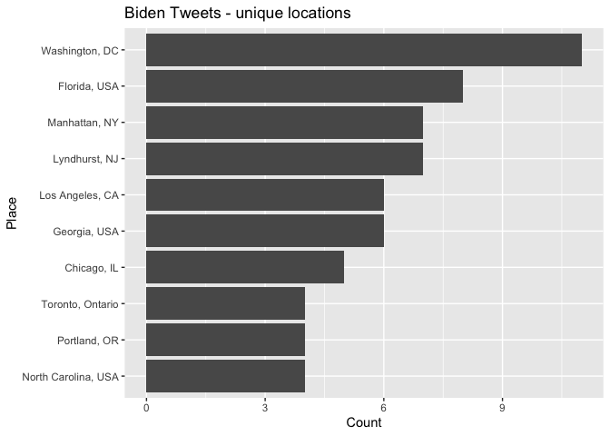
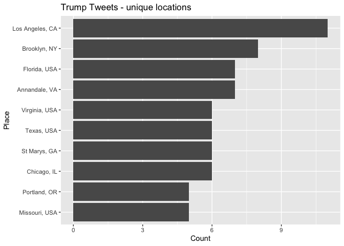
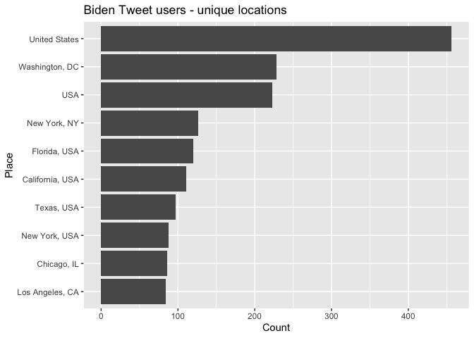
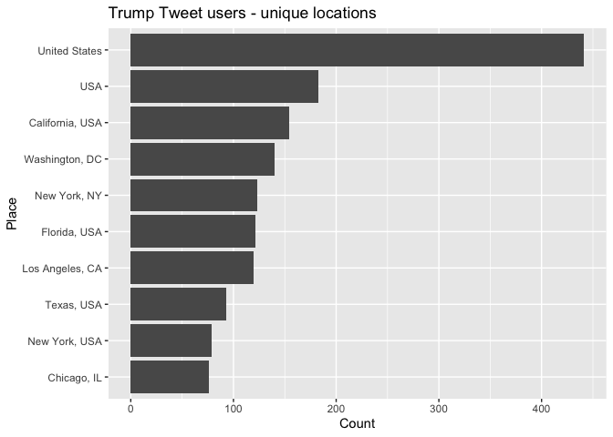
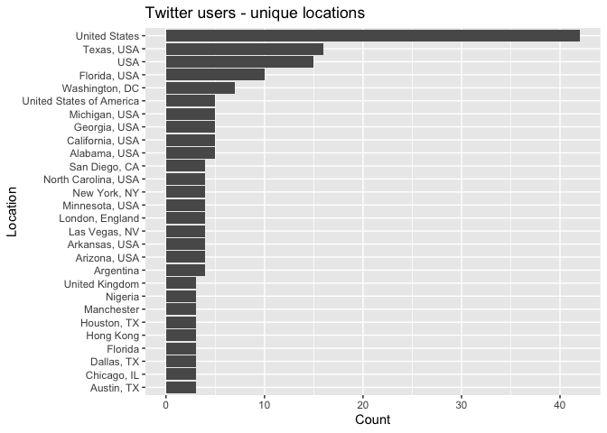

<style>
p.comment {
background-color: #bdced6;
padding: 10px;
border: 0px solid black;
margin-left: 25px;
border-radius: 5px;
font-style: normal;
}

h1.title {
  font-weight: bold;
  font-family: Arial;  
}

h2.title {
  font-family: Arial;  
}

</style>


<style type="text/css">
#TOC {
  font-size: 13px;
  font-family: Arial;
}
</style>


\


In this lab you will learn how to bring in, clean, analyze and map social media data accessed from Twitter in R. You will use the Twitter [RESTful API](https://developer.twitter.com/en/docs/api-reference-index) to access data about both twitter users and what they are tweeting about.  The objectives of this guide are

1. Learn how to sign up for a Twitter developer account
2. Learn how bring in Twitter user and tweet data using Twitter's API
3. Learn how to map Twitter user locations and geotagged tweets

To achieve these objectives, we will bring in and map tweets containing the words "biden" and "trump".


<div style="margin-bottom:25px;">
</div>
## **Installing and loading packages**
\

You'll need to install the following packages in R.  You only need to do this once, so if you've already installed these packages, skip the code.  Also, don't put these `install.packages()` in your R Markdown document.  Copy and paste the code in the R Console.


```r
install.packages("rtweet")
install.packages("tidytext")
```

You'll need to load the following packages.  Unlike installing, you will *always* need to load packages whenever you start a new R session. You'll also always need to use `library()` in your R Markdown file.


```r
library(tidyverse)
library(sf)
library(leaflet)
library(tigris)
library(rtweet)
library(tidytext)
```


<div style="margin-bottom:25px;">
</div>
## **Read in census geography**
\

We will be mapping tweet locations within the Los Angeles metropolitan area. As such, we'll need to bring its boundaries into R using the function `core_based_statistical_areas()`, which we learned about in [Lab 3](https://crd230.github.io/lab3.html#tigris_package).  


```r
cb <- core_based_statistical_areas(year = 2018, cb = TRUE)

la.metro <- filter(cb, grepl("Los Angeles", NAME))
```

<div style="margin-bottom:25px;">
</div>
## **Signing up for a Twitter API**
\

Signing up for a Census API was fairly easy and required only an email address.  Signing up for a Twitter API is a little more comprehensive.  Below are the steps.

1. Set up a twitter account if you don’t have one already.

2. Using your account, apply for a developer account [here](https://developer.twitter.com/en).

3. On the developer account splash page, click on "Apply" and then "Apply for a developer account"

4. The next screen asks you to describe yourself. I chose "Academic" and then "Academic researcher." Click on "Get Started."

5. You will then need to add a valid phone number if you did not supply one when you signed up for Twitter.  You will need to give the verification code that will be sent to your phone. Fill out the rest of the page and click Next.

6. The next page will ask you to fill out several text boxes on how you will use the Twitter API for Twitter Data.  
* For the first text box, your response will need to be a minimum of 200 characters. Make sure you provide a thorough response (e.g. mention you are using it for a graduate class you are taking.  You can also provide the link to the site).  
* The next text box asks you to describe how you will analyze Twitter data including any analysis of Tweets or Twitter users (you can say something like you will be making bar graphs and maps of tweets containing certain keywords). 
* The third text box asks you whether you will use Tweet, Retweet, Like, Follow or Direct Message functionality. I would make this option No.
* The next text box asks you to describe how and where Tweets and/or data about Twitter content will be displayed outside of Twitter. I recommend writing that you will be presenting Tweet data in lab and homework assignments.  Of course, these are just my suggestions.  If you plan on using tweet data for your final project or research outside of this class, please include that information.
* The final text box asks you to list all government entities you intend to provide Twitter content or derived information to under this use case.  I recommend selecting the No option.  Click Next to move on.

7. The next screen asks you to review all the information you provided.  Once you've done so, click Next.

8. The final screen asks you to read the developer agreement and policy.  Click on the box located at the bottom of the agreement.  Click on submit application.

9. You'll get an email approving your application.  If you were not approved, you will get an email asking you to fill out more information.  The process of getting approval should not take too long.  For example, I was approved within an hour.

10. Once you have acquired a developer account, you next need to create an app. Navigate to [http://developer.twitter.com/en/apps](http://developer.twitter.com/en/apps), click the blue button that says "Create a New App", and then complete the form. App Name is what your app will be called. Click on "Complete".

11.  Make sure you save or write down the Application API key (also known as the Consumer Key) and Application API secret key (also known as the API secret). 

12. You will also need to write down or save the Access token and Access secret. To get these, you can navigate to your newly created app under the *Project & Apps* header on the left panel.  Click on "Keys and tokens" The access token and secret are located at the bottom of the page.

<div style="margin-bottom:25px;">
</div>
## **Authenticating your Twitter API**
\

We'll be using the R package **rtweet** to access tweet data from Twitter. The first thing you need to establish is your authentication.  When you set up your app in Twitter, you were provided 5 unique identification elements:

* App name
* API key
* API secret key
* Access token
* Access secret token

You feed these items into the function `create_token()` to get authenticated.


```r
# whatever name you assigned to your created app.  Mine is crd230
appname <- "crd230"

## api key 
key <- "INSERT YOUR KEY HERE"

## api secret 
secret <- "INSERT YOUR SECRET KEY HERE"

access_token <- "INSERT YOUR ACCESS TOKEN HERE"

access_secret <- "INSERT YOUR SECRET TOKEN HERE"

twitter_token <- create_token(
  app = appname,
  consumer_key = key,
  consumer_secret = secret,
  access_token = access_token,
  access_secret = access_secret)
```


<div style="margin-bottom:25px;">
</div>
## **Loading in Tweets**
\

To send a request for tweets to Twitter's API use the function `search_tweets()`.  Let's collect the 8,000 most recent tweets that contain the word "biden".


```r
biden_tweets <- search_tweets(q="biden", n = 8000,
                               include_rts = FALSE, lang = "en",
                             geocode = lookup_coords("usa"))
```

The argument `q =` specifies the words you want to search for in quotes.  You can search for multiple words by using "AND" or "OR."  For example, to search for tweets with the words "biden" or "kamala", use `q = "biden OR kamala`.  To search for tweets that contain both "biden" and "kamala", use `q = "biden AND kamala"`. 

The argument `n =` specifies the number of tweets you want to bring in. Twitter rate limits cap the number of search results returned to 18,000 every 15 minutes. To request more than that, simply set `retryonratelimit = TRUE` and **rtweet** will wait for rate limit resets for you. However, don't go overboard.  Bringing in, say, 50,000+ tweets may requires multiple hours if not days to complete.

The argument `include_rts = FALSE` excludes retweets. The argument `lang = "en"` collects tweets in the English language.  The argument `geocode = lookup_coords("usa")` collects tweets sent from the United States.  Take a look at the data.


```r
glimpse(biden_tweets)
```

Note that the Twitter API returns data from only the past 6-9 days.  

Let's collect tweets containing the word "trump".


```r
trump_tweets <- search_tweets(q="trump", n = 8000,
                              include_rts = FALSE, lang = "en",
                              geocode = lookup_coords("usa"))
```

Check the data.


```r
glimpse(trump_tweets)
```


<div style="margin-bottom:25px;">
</div>
## **Visualizing Tweet Locations**
\

The data set contains 90 variables.  These variables include the user (handle and name) who sent the tweet, the tweet text itself, hashtags used in the tweet, how many times the tweet has been retweeted, and much much more. See [here](https://developer.twitter.com/en/docs/twitter-api/v1/data-dictionary/object-model/tweet) for the data dictionary.

We're interested in determining where these tweets are coming from. There are four sources of geographic information.  First, you have geographic information embedded within the tweet itself.  You can use `search_tweets()` to find all tweets that refer to a specific place (e.g. a city such as "los angeles" or a neighborhood such as Sacramento's "oak park").  

Second, the user sets a place with a name such as "Los Angeles" in their tweet.  In other words, the user tweets something and adds a place to where this tweet is being tweeted from.  The variable containing the tweet place is *place_full_name*.  How many unique places are captured by tweets containing the word "biden"?


```r
length(unique(biden_tweets$place_full_name))
```

```
## [1] 160
```

We can create a table of the top 10 places tweeting about biden using the following code.  The code `is.na(place_full_name) == FALSE & place_full_name != ""` within `filter()` keeps tweets without NA and blank place names.  The function `top_n()` only keeps the top 10 places by count.


```r
biden_tweets %>% 
  filter(is.na(place_full_name) == FALSE & place_full_name != "") %>% 
  count(place_full_name, sort = TRUE) %>% 
  slice(1:10)
```

```
## # A tibble: 10 x 2
##    place_full_name       n
##    <chr>             <int>
##  1 Houston, TX           5
##  2 Manhattan, NY         5
##  3 Queens, NY            4
##  4 Riviera Beach, FL     4
##  5 Texas, USA            4
##  6 Bayonne, NJ           3
##  7 Los Angeles, CA       3
##  8 New York, USA         3
##  9 Albuquerque, NM       2
## 10 Atlanta, GA           2
```

We can visualize this distribution using our best bud `ggplot()`


```r
biden_tweets %>%
  count(place_full_name, sort = TRUE) %>%
  mutate(location = reorder(place_full_name,n)) %>%
  na.omit() %>%
  top_n(10) %>%
  ggplot(aes(x = location,y = n)) +
  geom_col() +
  coord_flip() +
  labs(x = "Place",
       y = "Count",
       title = "Biden Tweets - unique locations ")
```

<!-- -->

What about "trump"?


```r
trump_tweets %>%
  count(place_full_name, sort = TRUE) %>%
  mutate(location = reorder(place_full_name,n)) %>%
  na.omit() %>%
  top_n(10) %>%
  ggplot(aes(x = location,y = n)) +
  geom_col() +
  coord_flip() +
  labs(x = "Place",
       y = "Count",
       title = "Trump Tweets - unique locations ")
```

<!-- -->


<div style="margin-bottom:25px;">
</div>
## **Extracting Tweet Geographic Coordinates**
\

The third source for geographic information is the geotagged precise location point coordinates of where the tweet was tweeted. To extract the longitudes and latitudes of the tweet locations use the function `lat_lng()`.


```r
biden_tweets <- lat_lng(biden_tweets)
```

The function creates two new columns in the data set, *lat* and *lng*, which represent the latitude and longitude coordinates, respectively.

Not all tweets are geotagged.  Let's keep the tweets with lat/long info using the `filter()` command.


```r
biden_tweets.geo <- biden_tweets %>%
                    filter(is.na(lat) == FALSE & is.na(lng) == FALSE)
```

Let's do the same for *trump_tweets*


```r
trump_tweets <- lat_lng(trump_tweets)

trump_tweets.geo <- trump_tweets %>%
  filter(is.na(lat) == FALSE & is.na(lng) == FALSE)
```

An important issue to note is that starting in 2019, Twitter requires users to decide whether they want to opt into allowing the company to collect geotagged information on their tweets.  Before 2019, the default was an automatic opt in.  The change is good for privacy, but not so good for social scientists interested in conducting spatial analysis of tweets.  As a result of the change, less than 10\% of tweets have geographic coordinate information. 


<div style="margin-bottom:25px;">
</div>
## **Mapping Tweets**
\

Now that we have the longitudes and latitudes of the tweets, we can map them.  To do so, let's follow [Lab 4a]() and convert the non-spatial data frames *biden_tweets.geo* and  *trump_tweets.geo* into **sf** objects using the `st_as_sf()` command.  


```r
biden_tweets.geo.sf <- st_as_sf(biden_tweets.geo, coords = c("lng", "lat"), crs = "+proj=longlat +datum=WGS84 +ellps=WGS84")

trump_tweets.geo.sf <- st_as_sf(trump_tweets.geo, coords = c("lng", "lat"), crs = "+proj=longlat +datum=WGS84 +ellps=WGS84")
```

Let's use `leaflet()` to map the points. You can also use `tm_shape()` from the **tmap** package, which we learned about in  [Lab 3](https://crd230.github.io/lab3.html#Mapping_in_R).  First, let's map the Biden tweets.


```r
leaflet() %>%
  addProviderTiles("OpenStreetMap.Mapnik") %>%
  addCircles(data = biden_tweets.geo.sf, 
             color = "blue")
```

<!--html_preserve--><div id="htmlwidget-5fd7551dec1161be8112" style="width:672px;height:480px;" class="leaflet html-widget"></div>
<script type="application/json" data-for="htmlwidget-5fd7551dec1161be8112">{"x":{"options":{"crs":{"crsClass":"L.CRS.EPSG3857","code":null,"proj4def":null,"projectedBounds":null,"options":{}}},"calls":[{"method":"addProviderTiles","args":["OpenStreetMap.Mapnik",null,null,{"errorTileUrl":"","noWrap":false,"detectRetina":false}]},{"method":"addCircles","args":[[41.6796555,33.7671944,33.7671944,35.3469013,42.5143515,40.67087955,30.683649,32.70185,40.655138,35.1704985,34.09324485,33.43929555,33.43929555,38.89860285,25.6994485,42.903701,33.9481237,33.9481237,29.417501,26.70097865,26.63648,33.6636085,21.048719,40.6707835,40.6707835,39.50602475,40.6707835,27.30076495,47.6148172,40.102243,39.1000485,46.7583346,34.087543,41.3824635,47.667438,34.0207895,35.1170026,40.67087955,36.090397,39.1450234,36.7632155,28.4571425,44.9054195,40.7055975,35.13352055,34.166235,26.7886775,26.7886775,26.7886775,26.7886775,28.546119,28.219121,28.219121,32.1893905,36.20000805,35.92050075,32.5246725,42.305097,35.1170026,28.325042,28.325042,38.452657,41.298394,33.0612424,39.411702,27.698682,34.0207895,40.7207559,32.6782075,30.3233457,44.00122985,30.4604442,40.780709,34.7519365,43.903509,37.8358757,34.0207895,42.746617,42.746617,42.746617,39.727936,39.284713,40.828718,29.8384948,37.2691755,35.4828435,41.79158405,41.74849615,39.2512114,40.655138,37.8583125,38.1217675,33.93804515,33.8527355,35.2264115,38.0033755,40.2785395,29.70561415,39.284713,33.64665425,33.6311395,46.25817755,35.690305,35.976786,41.83358445,39.64596,37.758225,33.5528626,33.5528626,43.629311,42.5662945,38.3045585,23.62541855,31.1688935,37.7919941,40.780709,26.062405,28.50167835,37.948843,40.780709,39.3605455,39.3605455,47.6148172,37.6233055,33.4519,33.4519,40.309249,29.8384948,41.553343,27.70976885,44.3170655,43.4821515,32.4176466,46.4418605,38.428635,38.428635,38.37887205,36.0609645,32.7799665,38.0354705,31.1688935,49.8658982,25.9851744,37.697062,35.13352055,38.931549,36.895082,36.232915,40.780709,29.9878005,45.063727,40.67087955,42.1130625,46.4418605,39.1450234,41.330439,40.1328379,41.1602503,34.1090235,39.85458505,35.3090465,26.53348575,41.0197585,31.1688935,32.91442455,26.0781704,43.333512,36.0609645,32.6782075,38.6022567749023,34.13492515,40.821237,43.000325,39.269675,29.8384948,44.2125075,41.48041765,39.7516553,39.7516553,32.9644845,33.786164,33.786164,40.00134,32.3029315,40.2421595,29.8384948,34.06482035,34.12167,40.67087955,39.713563,37.331159,33.0612424,35.4882023,35.4882023,29.8384948,33.6311395,31.1688935,32.6876965,41.500753,34.0412115,44.8244695,41.3694035,42.0845665,39.499762,39.95827055],[-86.290863,-84.433106,-84.433106,-119.025163,-90.77230835,-73.8311875,-88.1615555,-97.1356375,-73.9487755,-79.86103375,-118.0971004,-112.31521165,-112.31521165,-77.0143985,-80.271087,-85.7573235,-84.53213255,-84.53213255,-98.5406515,-80.2067176,-81.9868342,-117.9056455,-87.0316645,-74.106366,-74.106366,-89.77276425,-74.106366,-80.3452625,-122.3306024,-74.946407,-94.5592817,-92.12283995,-117.8819695,-82.0196119,-117.434547,-118.4119065,-106.6327181,-73.8311875,-79.8573635,-75.3864607,-76.2958955,-81.491811,-92.9238085,-73.977717,-89.922029,-106.026119,-80.075358,-80.075358,-80.075358,-80.075358,-81.5903435,-82.4471605,-82.4471605,-110.9155735,-86.791549,-75.61655935,-93.666378,-71.43568165,-106.6327181,-82.6880405,-82.6880405,-82.672376,-72.9291585,-96.7349005,-76.53379,-83.804475,-118.4119065,-74.0007613,-83.1738665,-97.75472415,-71.566171,-97.60701925,-73.9685415,-92.131274,-79.4283755,-94.3524515,-118.4119065,-75.770041,-75.770041,-75.770041,-84.047553,-76.62048175,-74.067066,-95.4464865,-119.3066075,-97.552161,-88.0400015,-88.16132155,-84.2718295,-73.9487755,-122.4922635,-78.4406135,-118.19402565,-118.0066568,-81.0378265,-79.420865,-75.640059,-98.1232498,-76.62048175,-112.379447,-80.926628,-119.2796615,-78.613697,-114.841591,-87.732013,-105.0171462,-121.94157935,-112.1246767,-112.1246767,-79.2725695,-70.8580915,-92.4367735,-102.55803745,-100.0768885,-122.2286855,-73.9685415,-80.16771545,-81.36777265,-122.3624139,-73.9685415,-76.5177225,-76.5177225,-122.3306024,-77.357365,-86.8060865,-86.8060865,-76.5924855,-95.4464865,-74.0037825,-82.36273255,-84.6490875,-80.546916,-110.974753,-93.3613205,-81.7725275,-81.7725275,-81.82866715,-115.1351649,-97.2859135,-97.3435725,-100.0768885,-119.617657,-80.16212825,-122.11337105,-89.922029,-94.6750935,-76.255686,-115.223125,-73.9685415,-81.689656,-93.3162525,-73.8311875,-72.5455845,-93.3613205,-75.3864607,-75.9718335,-74.3816772,-81.35043465,-81.19485,-88.93668365,-98.71699175,-80.1129035,-81.641069,-100.0768885,-80.04593915,-80.28518895,-73.6609045,-115.1351649,-83.1738665,-121.456001281738,-117.2940958,-73.432029,-107.554562,-76.8579695,-95.4464865,-100.247165,-81.8030515,-75.072719,-75.072719,-96.690937,-97.7253495,-97.7253495,-74.1880345,-110.89287785,-75.278826,-95.4464865,-118.0819432,-117.56215255,-73.8311875,-104.9220935,-121.8737305,-96.7349005,-80.61974305,-80.61974305,-95.4464865,-80.926628,-100.0768885,-96.8283655,-72.757385,-84.340338,-93.301344,-73.393711,-71.0267745,-111.547029,-74.8963554],10,null,null,{"interactive":true,"className":"","stroke":true,"color":"blue","weight":5,"opacity":0.5,"fill":true,"fillColor":"blue","fillOpacity":0.2},null,null,null,{"interactive":false,"permanent":false,"direction":"auto","opacity":1,"offset":[0,0],"textsize":"10px","textOnly":false,"className":"","sticky":true},null,null]}],"limits":{"lat":[21.048719,49.8658982],"lng":[-122.4922635,-70.8580915]}},"evals":[],"jsHooks":[]}</script><!--/html_preserve-->

Next, let's map the Trumpy tweets.


```r
leaflet() %>%
  addProviderTiles("OpenStreetMap.Mapnik") %>%
  addCircles(data = trump_tweets.geo.sf, 
             color = "red")
```

<!--html_preserve--><div id="htmlwidget-6f109a3e437578aaa620" style="width:672px;height:480px;" class="leaflet html-widget"></div>
<script type="application/json" data-for="htmlwidget-6f109a3e437578aaa620">{"x":{"options":{"crs":{"crsClass":"L.CRS.EPSG3857","code":null,"proj4def":null,"projectedBounds":null,"options":{}}},"calls":[{"method":"addProviderTiles","args":["OpenStreetMap.Mapnik",null,null,{"errorTileUrl":"","noWrap":false,"detectRetina":false}]},{"method":"addCircles","args":[[27.698682,37.2691755,37.7919941,32.6782075,29.321974,39.284713,33.617638,41.83358445,43.0091165,40.7913595,37.090301,40.3120325,32.8100122,32.8100122,32.8100122,42.1713474,41.83358445,29.8384948,45.00118,44.94151555,34.0207895,45.5578305,30.45910005,30.45910005,30.45910005,34.0207895,42.37642385,36.8025415,41.6833388,32.6782075,42.48158,44.94151555,41.1602503,39.9637611,42.499844,42.499844,42.4948957450499,42.499844,40.3651595,47.27302215,36.006256,34.0207895,33.9481237,33.9481237,42.5055345,38.76316025,30.185581,38.81738005,40.3651595,38.6537712,38.799436,44.94151555,34.004398,33.5528626,32.7992539,32.7992539,40.8244895,39.50602475,37.090301,38.502147,40.780709,35.75618835,36.7632155,36.7632155,38.60172355,34.1826615,37.948843,27.698682,39.5593541,36.830799,36.090397,41.028069,31.1688935,31.1688935,33.4519,41.9315925,39.736975,39.736975,32.6782075,34.0207895,28.9045907,34.073344,42.478737,40.7055975,34.0207895,41.1179365,40.780709,40.488195,35.935017,34.788087,33.28245035,40.3651595,30.3233457,38.916761,40.67087955,26.70097865,31.1688935,26.7886775,26.7886775,45.53640175,25.8577318,25.8577318,38.579524,41.67367775,40.3215195,27.79571925,34.0207895,38.7527151,32.5246725,41.1179365,43.8660115,35.1170026,42.39731535,31.79336815,34.0207895,34.8582795,42.28045525,42.3113055,45.00118,38.89860285,35.1704985,35.1704985,37.7706565,35.4828435,27.698682,40.780709,34.0207895,41.9382285,38.37887205,44.2045865,33.4057545,32.6782075,42.5283031,37.663817,32.85100965,40.780709,34.087543,33.6636085,33.6636085,35.3090465,38.7568175,30.5193408,38.997936,38.997936,40.3651595,34.16825365,38.997936,41.245398,41.245398,40.780709,36.244748,45.6305886,38.0472705,37.331159,39.284713,41.142333,41.142333,41.142333,33.1501395,40.650288,34.696458,39.7393005,35.8439812,40.822332,47.82798375,36.786042,44.8301985,32.6782075,39.713563,43.0091165,37.7919941,32.6782075,32.6782075,41.1179365,32.7372485,45.00118,41.79158405,32.3029315,35.690305,41.83358445,39.2512114,41.1179365,45.2487908,38.882384,42.460877,36.232915,34.181956,29.8384948,44.9706105,38.69974495,29.982601,37.2691755,34.0207895,33.28245035,37.5162205,33.8527355,43.05672225,41.4131805,30.58547135,39.7795625,27.698682,27.698682,46.4418605,38.26955,41.5372335,40.7055975,32.576227,44.2125075,35.13352055,35.13352055,41.48041765,23.62541855,43.629311,38.8808445,47.27302215,37.7919941,33.8113159,35.976786,33.69254185,41.83358445,28.976691,37.2691755,30.3233457,37.72334995,37.72334995,39.05898,38.4245325,27.698682,47.4872665,47.4872665,28.1402165,38.3045585,41.086917,31.1688935,39.9637611,39.322361,45.00118,31.1688935,40.67087955,34.1821598,41.1352835,35.88733335,33.501021,43.147902,32.9644845,35.8305215,43.629311,33.9299132,35.1704985,42.7391215,47.27302215,44.2125075,38.89860285,44.360476,30.18232075,40.3128028],[-83.804475,-119.3066075,-122.2286855,-83.1738665,-94.927073,-76.62048175,-117.87403215,-87.732013,-78.7646315,-74.26299,-76.5078085,-75.8662785,-117.10498915,-117.10498915,-117.10498915,-72.5702365,-87.732013,-95.4464865,-86.27053925,-93.1056485,-118.4119065,-73.723025,-91.0907995,-91.0907995,-91.0907995,-118.4119065,-82.9294185,-76.06994605,-88.10603015,-83.1738665,-83.494088,-93.1056485,-81.35043465,-85.9500505,-83.1811095,-83.1811095,-83.1645409779727,-83.1811095,-82.66946745,-120.882482,-115.03833685,-118.4119065,-84.53213255,-84.53213255,-71.204591,-121.3007305,-96.926148,-77.0908695,-82.66946745,-90.2478239,-90.3293255,-93.1056485,-86.0995885,-112.1246767,-116.9523525,-116.9523525,-73.978382,-89.77276425,-76.5078085,-117.0226945,-73.9685415,-78.8370206,-76.2958955,-76.2958955,-89.5273515,-79.780308,-122.3624139,-83.804475,-84.182476,-119.636189,-79.8573635,-74.237178,-100.0768885,-100.0768885,-86.8060865,-70.683829,-82.596627,-82.596627,-83.1738665,-118.4119065,-81.22000825,-84.28019445,-70.966855,-73.977717,-118.4119065,-77.604684,-73.9685415,-74.4411045,-86.8511765,-92.25714975,-111.8808735,-82.66946745,-97.75472415,-77.230881,-73.8311875,-80.2067176,-100.0768885,-80.075358,-80.075358,-122.63090815,-80.3046623,-80.3046623,-121.2804225,-72.8541685,-80.583711,-82.672903,-118.4119065,-76.99244055,-93.666378,-77.604684,-78.636469,-106.6327181,-83.3733495,-106.4174305,-118.4119065,-111.78712,-88.20823965,-83.369718,-86.27053925,-77.0143985,-79.86103375,-79.86103375,-122.4359785,-97.552161,-83.804475,-73.9685415,-118.4119065,-93.38986395,-81.82866715,-72.5000895,-111.7375657,-83.1738665,-83.5291601,-120.987468,-96.7930513,-73.9685415,-117.8819695,-117.9056455,-117.9056455,-98.71699175,-82.9763795,-97.672732,-105.5508905,-105.5508905,-82.66946745,-111.93171085,-105.5508905,-80.74247,-80.74247,-73.9685415,-115.0541324,-122.58897445,-84.90589885,-121.8737305,-76.62048175,-81.246344,-81.246344,-81.246344,-96.8352488,-79.929701,-76.8242734,-89.2665075,-78.657837,-72.9876965,-122.3001293,-119.7824645,-93.0586305,-83.1738665,-104.9220935,-78.7646315,-122.2286855,-83.1738665,-83.1738665,-77.604684,-96.439486,-86.27053925,-88.0400015,-110.89287785,-78.613697,-87.732013,-84.2718295,-77.604684,-75.8001415,-76.832809,-83.14078335,-115.223125,-119.165389,-95.4464865,-93.2620465,-90.375446,-90.011008,-119.3066075,-118.4119065,-111.8808735,-122.29522915,-118.0066568,-87.9672925,-74.156977,-96.2916485,-86.1429225,-83.804475,-83.804475,-93.3613205,-104.62277595,-72.80198,-73.977717,-86.6807375,-100.247165,-89.922029,-89.922029,-81.8030515,-102.55803745,-79.2725695,-77.101999,-120.882482,-122.2286855,-84.5634145,-114.841591,-117.9987325,-87.732013,-96.649725,-119.3066075,-97.75472415,-121.436217,-121.436217,-77.0661695,-90.3992495,-83.804475,-92.870721,-92.870721,-81.4766765,-92.4367735,-85.1700515,-100.0768885,-85.9500505,-81.53873685,-86.27053925,-100.0768885,-73.8311875,-118.32514515,-104.7870919,-90.1637879,-117.1195165,-93.194233,-96.690937,-85.9785995,-79.2725695,-117.559707,-79.86103375,-73.763825,-120.882482,-100.247165,-77.0143985,-84.4189445,-95.2783185,-75.1270275],10,null,null,{"interactive":true,"className":"","stroke":true,"color":"red","weight":5,"opacity":0.5,"fill":true,"fillColor":"red","fillOpacity":0.2},null,null,null,{"interactive":false,"permanent":false,"direction":"auto","opacity":1,"offset":[0,0],"textsize":"10px","textOnly":false,"className":"","sticky":true},null,null]}],"limits":{"lat":[23.62541855,47.82798375],"lng":[-122.63090815,-70.683829]}},"evals":[],"jsHooks":[]}</script><!--/html_preserve-->

Rather than the entire United States, let's map tweets located within the Los Angeles Metropolitan Area.  To do this, we'll need to make sure the the **sf** object *la.metro* has the same CRS as *biden_tweets.geo.sf*.


```r
st_crs(la.metro) == st_crs(biden_tweets.geo.sf)
```

```
## [1] FALSE
```

Let's reproject *la.metro* into the same CRS as *biden_tweets.geo.sf* using the function `st_transform()`, which we learned about in [Lab 4a]().


```r
la.metro <-st_transform(la.metro, crs = st_crs(biden_tweets.geo.sf)) 
```

Let's keep the Biden and Trump tweets within the metro area using the `st_within` option in the `st_join()` command, which we learned about in [Lab 3]().


```r
biden_tweets.geo.la <- st_join(biden_tweets.geo.sf, la.metro, join = st_within, left=FALSE)
trump_tweets.geo.la <- st_join(trump_tweets.geo.sf, la.metro, join = st_within, left=FALSE)
```

Finally, use `leaflet()` to map the tweets on top of the metro area boundary.


```r
leaflet() %>%
  addProviderTiles("OpenStreetMap.Mapnik") %>%
  addPolygons(data = la.metro, 
              color = "gray", 
              weight = 1,
              smoothFactor = 0.5,
              opacity = 1.0,
              fillOpacity = 0.2) %>%
  addCircles(data = biden_tweets.geo.la, 
             color = "blue") %>%
  addCircles(data = trump_tweets.geo.la, 
             color = "red")
```

<!--html_preserve--><div id="htmlwidget-2a15db64a872038a2c15" style="width:672px;height:480px;" class="leaflet html-widget"></div>
<script type="application/json" data-for="htmlwidget-2a15db64a872038a2c15">{"x":{"options":{"crs":{"crsClass":"L.CRS.EPSG3857","code":null,"proj4def":null,"projectedBounds":null,"options":{}}},"calls":[{"method":"addProviderTiles","args":["OpenStreetMap.Mapnik",null,null,{"errorTileUrl":"","noWrap":false,"detectRetina":false}]},{"method":"addPolygons","args":[[[[{"lng":[-118.604415,-118.598783,-118.585936,-118.580255,-118.570351,-118.557605,-118.54453,-118.538624,-118.534276,-118.530702,-118.528239,-118.524769,-118.522635,-118.510537,-118.50285,-118.500212,-118.499574,-118.500288,-118.497435,-118.493632,-118.489354,-118.486264,-118.482224,-118.477646,-118.473485,-118.47034,-118.454636,-118.449535,-118.445812,-118.442276,-118.436905,-118.434805,-118.430172,-118.423576,-118.409099,-118.406444,-118.39525,-118.390955,-118.382037,-118.377169,-118.370323,-118.368301,-118.36727,-118.370161,-118.368126,-118.365094,-118.3587,-118.351275,-118.332486,-118.331314021324,-118.329158,-118.32446,-118.322741,-118.321841674063,-118.318476,-118.316525695019,-118.310222,-118.310213,-118.309064992916,-118.308955,-118.307767,-118.30539,-118.30539,-118.305084,-118.306816,-118.312045,-118.316787,-118.325244,-118.343249,-118.354042,-118.360332,-118.367806,-118.374768,-118.384564,-118.393055,-118.402941,-118.408543,-118.413767,-118.424258,-118.431112,-118.436352,-118.441066,-118.456309,-118.465368,-118.474143,-118.482937,-118.487453,-118.48877,-118.489592,-118.487215,-118.482609,-118.485789,-118.481086,-118.482462,-118.478421,-118.475331,-118.47652,-118.478465,-118.481035,-118.482239,-118.485575,-118.486264,-118.487453,-118.484949,-118.48769,-118.48875,-118.495059,-118.49817,-118.503952,-118.507656,-118.511696,-118.51336,-118.514073,-118.515914,-118.516267,-118.52323,-118.533681,-118.536415,-118.53738,-118.542357,-118.545441,-118.548061,-118.552577,-118.555178,-118.558715,-118.563442,-118.565854,-118.570927,-118.575394,-118.573317,-118.575901,-118.579435,-118.58609,-118.589886,-118.592745,-118.595122,-118.593969,-118.601185,-118.603916,-118.607243,-118.604415],"lat":[33.478552,33.477939,33.473819,33.475099,33.47531,33.474722,33.474119,33.477015,33.473493,33.468071,33.466603,33.466355,33.462016,33.455313,33.453302,33.449592,33.445931,33.443352,33.441964,33.442559,33.445336,33.446724,33.44831,33.448392,33.442877,33.442956,33.433961,33.432673,33.428907,33.428645,33.428637,33.426781,33.428278,33.427258,33.421203,33.421559,33.416204,33.417963,33.409883,33.410821,33.409285,33.40711,33.401088,33.396013,33.389533,33.388374,33.381633,33.373936,33.358228,33.3558509398843,33.351478,33.348782,33.344728,33.3442993177889,33.342695,33.3408250322726,33.334781,33.335795,33.3309,33.330431,33.32348,33.320898,33.315933,33.310323,33.308385,33.306597,33.301137,33.299075,33.305234,33.313111,33.31533,33.317254,33.320065,33.321019,33.319659,33.320901,33.321494,33.320241,33.317839,33.319183,33.320104,33.318555,33.32182,33.326056,33.334204,33.344331,33.350883,33.356649,33.360412,33.365772,33.369914,33.372918,33.375946,33.380261,33.381849,33.383238,33.385818,33.38632,33.388994,33.396108,33.401176,33.40467,33.409233,33.412131,33.414392,33.419826,33.422129,33.421447,33.424234,33.426691,33.429667,33.427683,33.423517,33.422417,33.425075,33.430733,33.429183,33.430658,33.434608,33.434824,33.434159,33.435617,33.435617,33.43338,33.433419,33.434381,33.437503,33.439351,33.440179,33.443633,33.448261,33.449302,33.456243,33.461521,33.46239,33.465166,33.467198,33.469853,33.473493,33.478449,33.478552]}],[{"lng":[-118.6105,-118.598853,-118.595763,-118.593862,-118.586732,-118.57988,-118.573897,-118.56843,-118.56843,-118.565578,-118.562726,-118.558448,-118.552743,-118.550842,-118.549891,-118.542999,-118.536247,-118.534204,-118.52446,-118.519196,-118.51828,-118.499503,-118.488332,-118.483579,-118.470893,-118.463614,-118.456958,-118.423446,-118.406808,-118.397328,-118.386605,-118.373533,-118.354185,-118.360936,-118.367591,-118.377811,-118.383031,-118.391834,-118.400866,-118.406095,-118.40871,-118.41584,-118.422733,-118.427249,-118.431809,-118.434141,-118.436233,-118.439396,-118.444029,-118.450931,-118.452585,-118.454677,-118.462016,-118.467987,-118.475402,-118.477684,-118.489853,-118.495368,-118.495938,-118.499922,-118.506206,-118.505065,-118.507537,-118.513051,-118.513811,-118.51229,-118.52503,-118.530544,-118.535823,-118.542143,-118.547087,-118.545565,-118.546835,-118.55203,-118.549559,-118.55146,-118.555453,-118.556404,-118.561347,-118.56439,-118.574087,-118.580362,-118.582263,-118.581883,-118.584735,-118.590249,-118.593435,-118.597475,-118.601468,-118.606982,-118.610262,-118.6105],"lat":[33.032941,33.036329,33.034336,33.03055,33.031746,33.034459,33.03055,33.02497,33.020188,33.014807,33.006834,33.006834,33.002848,32.996668,32.989492,32.98072,32.977404,32.971946,32.964369,32.95856,32.954198,32.933654,32.923679,32.921484,32.915948,32.909712,32.900932,32.875784,32.864206,32.857447,32.848233,32.839047,32.820919,32.817078,32.820873,32.822471,32.824948,32.826266,32.823869,32.821073,32.813083,32.810886,32.809287,32.80669,32.801462,32.805372,32.811445,32.815671,32.816718,32.822112,32.820553,32.821033,32.82814,32.832217,32.835093,32.840365,32.84372,32.846116,32.84979,32.851777,32.852985,32.857138,32.863527,32.868957,32.873269,32.879178,32.886523,32.894985,32.90628,32.906799,32.911907,32.9151,32.918408,32.91925,32.924198,32.930582,32.934252,32.947018,32.951805,32.958506,32.964887,32.974299,32.982594,32.987698,32.98993,33.005559,33.012386,33.013212,33.017039,33.015126,33.015803,33.032941]}],[{"lng":[-118.944502,-118.940801,-118.892195,-118.876906,-118.868065,-118.856473,-118.833456,-118.826082,-118.820951,-118.81488,-118.806404,-118.789376,-118.788889,-118.788749,-118.775577,-118.774004,-118.758599,-118.758468,-118.755581,-118.744934,-118.740157,-118.728689,-118.723374,-118.716891,-118.711994,-118.710916,-118.703392,-118.693834,-118.67566,-118.674241,-118.668152,-118.668153,-118.668162,-118.66814,-118.66805,-118.667944,-118.6678,-118.6678,-118.667796,-118.66778,-118.667773,-118.667708,-118.667713,-118.650138,-118.648113,-118.632495,-118.632537,-118.632602,-118.632546,-118.633281,-118.633461,-118.633494,-118.633544,-118.636789,-118.650859,-118.652285,-118.670593,-118.677616,-118.691397,-118.6929,-118.722616,-118.722668,-118.722716,-118.726568,-118.738618,-118.796842,-118.821077,-118.881364,-118.893056,-118.894634,-118.884388,-118.881729,-118.88375,-118.884525,-118.884642,-118.883381,-118.88253,-118.877289,-118.870926,-118.854114,-118.854253,-118.843579,-118.836589,-118.78689,-118.785537,-118.690867,-118.626162,-118.625688,-118.625003,-118.587591,-118.571879,-118.569714,-118.563652,-118.559404,-118.326281,-118.290456,-118.23767,-118.220048,-118.170237,-118.16678,-118.140074,-118.13083,-118.125834,-118.042259,-118.023406,-117.774368,-117.667292,-117.667244,-117.667108,-117.667323,-117.667085,-117.667087,-117.666923,-117.666954,-117.667221,-117.666969,-117.667068,-117.666984,-117.667074,-117.666651,-117.667034,-117.659994,-117.660346,-117.660052,-117.659792,-117.659673,-117.655235,-117.655213,-117.652685,-117.652246,-117.652119,-117.650459,-117.650454,-117.647027,-117.646924,-117.646374,-117.652907,-117.656255,-117.66073,-117.661396,-117.663777,-117.677405,-117.677706,-117.677576,-117.681713,-117.683264,-117.685551,-117.686799,-117.689171,-117.693545,-117.699582,-117.702479,-117.704433,-117.70429,-117.704622,-117.704725,-117.705342,-117.70848,-117.709413,-117.709928,-117.711067,-117.712087,-117.712677,-117.713409,-117.715019,-117.716599,-117.718007,-117.719481,-117.719547,-117.720837,-117.722224,-117.723564,-117.724411,-117.724434,-117.724509,-117.72608,-117.728038,-117.728059,-117.728676,-117.729481,-117.730125,-117.731717,-117.735344,-117.735846,-117.744342,-117.744385,-117.745378,-117.745417,-117.76769,-117.767752,-117.767227,-117.767045,-117.767483,-117.769921,-117.779771,-117.785062,-117.79111,-117.802539,-117.802469,-117.802445,-117.793667,-117.793585,-117.793578,-117.783287,-117.781866,-117.772911,-117.768225,-117.765567,-117.748097,-117.737752,-117.735464,-117.732532,-117.710282,-117.707294,-117.687857,-117.680289,-117.677198,-117.673749,-117.673134,-117.672568,-117.672439,-117.67225,-117.671928,-117.671608,-117.675053,-117.674519,-117.674282,-117.662117,-117.63665,-117.607639,-117.580789,-117.580136,-117.574628,-117.569175,-117.548355,-117.542265,-117.536448,-117.535807,-117.535316,-117.535033,-117.534137,-117.533999,-117.497645,-117.474573,-117.459817,-117.457862,-117.455887,-117.424038,-117.413314,-117.413899,-117.415815,-117.457937,-117.460901,-117.466296,-117.496701,-117.501162,-117.506238,-117.51021,-117.509909,-117.503181,-117.503756,-117.509725,-117.509722,-117.509455,-117.509581,-117.508614,-117.515014,-117.526919,-117.527599,-117.538429,-117.542667,-117.548282,-117.554085,-117.557226,-117.557985,-117.56813,-117.573339,-117.57848,-117.583508,-117.588415,-117.590519,-117.593599,-117.596147232519,-117.602263,-117.607278225611,-117.607905,-117.609747035085,-117.612495,-117.617294,-117.620035922967,-117.62217,-117.625891,-117.631682,-117.631740265841,-117.633779719464,-117.642595,-117.645582,-117.645590475743,-117.645873824588,-117.650688133729,-117.652692,-117.658067,-117.663589,-117.668314000402,-117.673385,-117.681025,-117.684264212833,-117.684584,-117.68942,-117.689933,-117.691984,-117.691353,-117.691384,-117.694693,-117.704675,-117.707093,-117.70855,-117.709652,-117.713370543169,-117.714617,-117.715349,-117.715657,-117.715688,-117.714783,-117.715102,-117.720363,-117.721616,-117.725553332195,-117.726432511331,-117.726486,-117.731952549347,-117.7333,-117.734159829272,-117.736930297021,-117.73785,-117.739057040307,-117.73955,-117.745900121131,-117.746288,-117.753647135784,-117.754974,-117.759725,-117.761387,-117.763186562364,-117.765063,-117.769151,-117.773960352148,-117.776844,-117.779623540442,-117.782690350999,-117.784888,-117.788621431492,-117.789036604692,-117.792488,-117.792863012556,-117.792935687705,-117.801288,-117.804936775734,-117.806916,-117.806980506149,-117.807515,-117.811379,-117.813513,-117.814777345952,-117.818587379913,-117.819821,-117.82007157039,-117.820304,-117.826188,-117.828968532272,-117.833446,-117.834407884509,-117.836703491457,-117.839534307378,-117.840253246872,-117.840289,-117.846943570933,-117.853332,-117.858586243127,-117.861134113801,-117.86427,-117.866147640884,-117.870749,-117.873352,-117.87679,-117.878044124759,-117.878896649729,-117.893642260748,-117.899241801308,-117.89926,-117.926632038946,-117.928019,-117.940591,-117.957309626045,-117.95749108767,-117.957547941498,-117.95793609656,-117.965047927353,-117.970879695968,-117.987898975382,-118.000593,-118.000805725047,-118.005471002914,-118.008183541003,-118.008427656492,-118.018783843459,-118.029694,-118.032290264993,-118.040179,-118.055592054055,-118.064895,-118.065422842208,-118.078717332574,-118.079496880089,-118.086975238717,-118.088928,-118.094861865584,-118.113647,-118.115411077283,-118.132595110124,-118.132698,-118.136934513913,-118.146562657989,-118.156429,-118.156757879998,-118.159907459484,-118.166497421716,-118.166887,-118.1755,-118.176198747974,-118.176375951824,-118.18035,-118.17962,-118.179848969804,-118.184574795877,-118.187708646817,-118.188656531138,-118.189833,-118.18584,-118.185734259285,-118.183342,-118.197436491762,-118.206534,-118.231992045233,-118.232947994158,-118.244617800581,-118.247762674392,-118.262297,-118.269645,-118.271736695544,-118.277208,-118.277973646643,-118.277979661873,-118.283540991907,-118.284296,-118.2854122865,-118.28589791404,-118.287998876897,-118.288373,-118.292873356242,-118.294788,-118.295110239771,-118.296463,-118.310155,-118.311561623405,-118.314141,-118.317482,-118.320359,-118.32121556571,-118.322314556494,-118.324075414676,-118.332893576362,-118.342622,-118.352052,-118.354705,-118.360505,-118.364121,-118.367945,-118.36931,-118.369720214979,-118.373635232807,-118.375351827301,-118.376283,-118.376531,-118.381749,-118.385006,-118.38979429006,-118.392895696474,-118.398286,-118.402885,-118.404415,-118.411211,-118.411397166472,-118.414152142573,-118.414215567372,-118.41428,-118.418352,-118.420570349199,-118.422038857667,-118.422446045219,-118.422925,-118.423945374797,-118.4244667723,-118.424936,-118.421917,-118.423733089004,-118.423819,-118.427147,-118.428291710559,-118.428407,-118.427048141908,-118.424484398135,-118.423407,-118.422657764543,-118.420238443633,-118.42009325589,-118.417438,-118.406999,-118.407408568928,-118.408297,-118.405007,-118.400022285949,-118.394376070379,-118.394307,-118.391507,-118.391506490151,-118.391053742248,-118.390875011333,-118.390838873728,-118.390511,-118.391103,-118.392027,-118.392477583363,-118.395387667506,-118.399709,-118.401798,-118.401713930418,-118.40157,-118.400096484591,-118.399479,-118.399484377404,-118.399493,-118.400871783649,-118.402912055249,-118.402962040086,-118.409548310693,-118.409639542292,-118.412695385473,-118.412708,-118.414654067515,-118.415610998909,-118.416260078565,-118.417544927084,-118.419224092145,-118.419436785343,-118.421082808566,-118.421963372164,-118.422017845132,-118.423654974265,-118.423674490672,-118.430011733396,-118.435197538436,-118.44241,-118.442490840366,-118.44822599166,-118.450677,-118.455822236985,-118.460611,-118.468640820036,-118.473070126836,-118.476600463193,-118.483466847853,-118.484998,-118.487584492053,-118.493115463502,-118.502813,-118.502825537466,-118.509618879472,-118.516877737351,-118.519514,-118.519726744824,-118.536114307181,-118.543115,-118.549076,-118.554891,-118.555873129927,-118.562149,-118.56714103306,-118.567373764407,-118.567985647474,-118.569235,-118.569735264596,-118.574725494359,-118.575908,-118.579252741749,-118.579737,-118.583902,-118.584351039228,-118.592815,-118.603572,-118.609652,-118.617337997816,-118.622757,-118.623493434314,-118.626946,-118.627789009915,-118.635250350277,-118.635920764079,-118.636314,-118.636463223339,-118.643847,-118.649901,-118.657381,-118.668358,-118.67543,-118.677696,-118.678849,-118.683183,-118.690213,-118.697388,-118.706215,-118.714155488725,-118.714468,-118.719538,-118.732391,-118.732460426152,-118.744952,-118.748230929668,-118.749891892712,-118.752339,-118.756402,-118.767741,-118.77905748101,-118.783433,-118.787075190351,-118.787094,-118.787138163409,-118.791915542234,-118.793331,-118.794289,-118.800541,-118.803753,-118.805114,-118.806367,-118.808901,-118.810435973687,-118.821419492801,-118.8215584688,-118.821579,-118.821958649246,-118.836821808211,-118.84038,-118.842675913429,-118.8467,-118.854653,-118.859205,-118.862499,-118.874853,-118.882023,-118.895628330318,-118.896159,-118.905781,-118.915968,-118.921269,-118.928048,-118.931549,-118.93481,-118.938081,-118.944862413904,-118.944502],"lat":[34.046563,34.074967,34.104817,34.11421,34.11964,34.126765,34.140882,34.145408,34.148554,34.152266,34.157472,34.167911,34.168214,34.168213,34.168158,34.168146,34.168073,34.168073,34.168059,34.168005,34.167975,34.167892,34.167861,34.168288,34.168619,34.168617,34.168591,34.168557,34.168286,34.168268,34.168195,34.17675,34.184141,34.191331,34.194971,34.199166,34.206635,34.206773,34.209329,34.216517,34.223426,34.236692,34.240404,34.240403,34.240435,34.240426,34.241948,34.25493,34.263351,34.268322,34.269522,34.269812,34.270242,34.291804,34.320484,34.323392,34.360692,34.374993,34.403033,34.406088,34.466483,34.466587,34.466686,34.474507,34.498969,34.616567,34.665791,34.790629,34.814717,34.817972,34.817651,34.817802,34.815528,34.813812,34.811795,34.808637,34.807662,34.803212,34.803109,34.803279,34.817772,34.817761,34.817504,34.817715,34.817817,34.818095,34.818193,34.818225,34.818266,34.818022,34.818025,34.818255,34.818025,34.818303,34.819726,34.820103,34.820146,34.820138,34.820513,34.820568,34.82078,34.820733,34.821013,34.821952,34.822163,34.823301,34.822526,34.734334,34.715855,34.713028,34.690155,34.67552,34.631653,34.603367,34.600545,34.597518,34.587458,34.587267,34.576158,34.573464,34.558008,34.55804,34.557848,34.498629,34.462523,34.451605,34.397222,34.396953,34.366165,34.360809,34.35925,34.339025,34.338963,34.297129,34.295875,34.28917,34.262969,34.249765,34.232393,34.22976,34.220334,34.166103,34.165173,34.164368,34.155827,34.150488,34.142486,34.138122,34.132318,34.121627,34.106824,34.099533,34.095346,34.095055,34.094221,34.093957,34.09261,34.085254,34.083155,34.081984,34.079536,34.077213,34.075893,34.074257,34.070591,34.066887,34.063175,34.059731,34.059476,34.055854,34.052183,34.048469,34.045448,34.044865,34.044687,34.040935,34.033632,34.033543,34.029835,34.025139,34.021371,34.020589,34.0188,34.018554,34.019852,34.019859,34.020018,34.020024,34.023506,34.019429,34.013567,34.011192,34.004611,34.004639,34.00475,34.004809,33.994677,33.975551,33.970076,33.968308,33.968135,33.957895,33.95379,33.946411,33.945396,33.939093,33.935767,33.933834,33.921432,33.914732,33.913251,33.911352,33.896736,33.894812,33.88229,33.877412,33.873945,33.870831,33.871005,33.870397,33.870258,33.870055,33.86971,33.869368,33.868725,33.861588,33.857956,33.857499,33.829975,33.797731,33.769477,33.767988,33.766455,33.76461,33.760112,33.758801,33.757665,33.750018,33.736029,33.727542,33.712584,33.710355,33.705575,33.703811,33.691714,33.690219,33.688954,33.667017,33.659302,33.657653,33.655268,33.602189,33.598031,33.591087,33.552615,33.545814,33.539496,33.533999,33.520546,33.520405,33.508945,33.509062,33.505019,33.484027,33.471633,33.469614,33.467739,33.461776,33.461136,33.455643,33.454987,33.453669,33.452524,33.451194,33.451633,33.452907,33.453339,33.453927,33.435413,33.416832,33.407544,33.396819,33.3871676935322,33.399496,33.4055592495383,33.406317,33.4084166792082,33.411549,33.416196,33.419457516245,33.421996,33.424632,33.430528,33.4305744823985,33.4322014853532,33.439234,33.440728,33.4407344682672,33.4409507060779,33.4446247484685,33.446154,33.44955,33.451981,33.4549334017417,33.458102,33.461754,33.4619114554145,33.461927,33.461658,33.457846,33.456627,33.454355,33.454028,33.455604,33.457878,33.460285,33.46063,33.460332,33.4600189383596,33.459914,33.460556,33.461675,33.462657,33.463262,33.464463,33.472911,33.473427,33.4815118710374,33.4833171670033,33.483427,33.484659260023,33.484963,33.4858239631128,33.4885980842261,33.489519,33.493329697252,33.494886,33.500454843242,33.500795,33.5104942155721,33.512243,33.514417,33.516326,33.5189103007938,33.521605,33.525132,33.529323694547,33.531837,33.5351846116113,33.538878204435,33.541525,33.5426175199525,33.5427390127417,33.543749,33.5438587337878,33.5438799995273,33.546324,33.5477820839774,33.548573,33.5488290861813,33.550951,33.55232,33.551209,33.5519119266416,33.5540301557316,33.554716,33.5566816546776,33.558505,33.563001,33.56421618991,33.566173,33.567206150832,33.5696718400128,33.5727123919663,33.5734845979119,33.573523,33.5766199290474,33.579593,33.5826101787419,33.5840732593512,33.585874,33.5873392496233,33.59093,33.592933,33.592322,33.5927649901298,33.5930661245617,33.5982746654898,33.6002525717392,33.600259,33.6068528831608,33.607187,33.620021,33.6295776053814,33.6296813314377,33.6297138298976,33.6299357048736,33.6340009289084,33.6373344511233,33.647062914264,33.654319,33.6544805412119,33.6580233052265,33.6600831787442,33.6602685575347,33.6681329393697,33.676418,33.6786787438614,33.685548,33.7014312532279,33.711018,33.7114615693105,33.7226335215186,33.723288610006,33.7295730077451,33.731214,33.7338709045787,33.742282,33.7432945549888,33.7531579426908,33.753217,33.7545459203814,33.7575661009257,33.760661,33.7607417891292,33.761515481011,33.7631343003815,33.76323,33.763617,33.7635876093636,33.7635801558408,33.763413,33.759181,33.7589618947527,33.7544396683534,33.751440831064,33.7505337838237,33.749408,33.738254,33.7376161692958,33.723186,33.7231252269241,33.723086,33.7148399728315,33.7145303347293,33.7107504081902,33.7097317630173,33.705024,33.70403,33.7048765794077,33.707091,33.7072771186745,33.7072785808984,33.7086304674177,33.708814,33.7079110044449,33.7075181666659,33.7058186387034,33.705516,33.7052325792795,33.705112,33.7058199655875,33.708792,33.712932,33.7134962726604,33.714531,33.71363,33.717186,33.7175240016063,33.7179576643668,33.7186525006033,33.7221321552055,33.725971,33.727681,33.732317,33.736817,33.737998,33.738086,33.736315,33.7364102442351,33.7373192380487,33.7377177991397,33.737934,33.740444,33.742875,33.741417,33.7395528840656,33.7383454841286,33.736247,33.739401,33.741171,33.741985,33.7423394381553,33.747584575123,33.7477053281701,33.747828,33.759475,33.7618073470259,33.763351320066,33.7637794324106,33.764283,33.7662242998376,33.7672162773846,33.768109,33.769355,33.7723732215257,33.772516,33.772318,33.7744956755626,33.774715,33.7766989328139,33.7804419987226,33.782015,33.7827560765859,33.7851490520678,33.7852926587749,33.787919,33.79189,33.7934900955591,33.796961,33.800215,33.8021250306178,33.8042885337802,33.804315,33.815415,33.815425247667,33.8245252077666,33.828117591483,33.8288439355918,33.835434,33.838771,33.838723,33.8390036614674,33.8408163082553,33.843508,33.847951,33.8484786472454,33.849382,33.8501374320985,33.850454,33.8517234513727,33.853759,33.8569051098863,33.8615606036307,33.8616746590802,33.8767032178307,33.8769113901839,33.8838842161597,33.883913,33.8876082481903,33.8894252966614,33.890657787522,33.8930974943305,33.8962859405721,33.8966898084495,33.8998153240298,33.9014873631624,33.9015907979799,33.9046994252093,33.9047364835165,33.9167698197367,33.9266167734248,33.940312,33.9404621418875,33.9511138308875,33.955666,33.9626297317564,33.969111,33.9783541667707,33.9834527644046,33.987516552579,33.9954204829596,33.997183,33.9998436821985,34.0055333023368,34.015509,34.0155180084182,34.0203991594915,34.0256147929591,34.027509,34.0276081475071,34.0352454000966,34.038508,34.040201,34.037762,34.0381717395174,34.04079,34.0413888185296,34.0414167357812,34.0414901341169,34.04164,34.0414979347506,34.0400808082107,34.039745,34.0397991587852,34.039807,34.037475,34.0375951569123,34.03986,34.039048,34.036424,34.0375993330502,34.038428,34.0381537489782,34.036868,34.036810497509,34.0363015525377,34.0362558229882,34.036229,34.0362626955926,34.03793,34.037531,34.038551,34.038887,34.037479,34.03614,34.03311,34.030723,34.032245,34.032519,34.029383,34.0312553120148,34.031329,34.031093,34.032743,34.0327394626433,34.032103,34.0312032585032,34.030747488625,34.030076,34.025719,34.025231,34.022571352921,34.021543,34.0195552654135,34.019545,34.0194857047642,34.0130714398482,34.011171,34.007413,34.006712,34.004473,34.001239,34.000198,34.001622,34.0031156875199,34.0138037830643,34.0139390210272,34.013959,34.0142329790953,34.0249591820016,34.027527,34.0288820248563,34.031257,34.034215,34.035309,34.034554,34.037648,34.0381,34.0391654428878,34.039207,34.041488,34.041753,34.044475,34.045847,34.045536,34.043507,34.043383,34.0454177344622,34.046563]}]]],null,null,{"interactive":true,"className":"","stroke":true,"color":"gray","weight":1,"opacity":1,"fill":true,"fillColor":"gray","fillOpacity":0.2,"smoothFactor":0.5,"noClip":false},null,null,null,{"interactive":false,"permanent":false,"direction":"auto","opacity":1,"offset":[0,0],"textsize":"10px","textOnly":false,"className":"","sticky":true},null]},{"method":"addCircles","args":[[34.09324485,33.6636085,34.087543,34.0207895,34.0207895,34.0207895,33.93804515,33.8527355,34.06482035],[-118.0971004,-117.9056455,-117.8819695,-118.4119065,-118.4119065,-118.4119065,-118.19402565,-118.0066568,-118.0819432],10,null,null,{"interactive":true,"className":"","stroke":true,"color":"blue","weight":5,"opacity":0.5,"fill":true,"fillColor":"blue","fillOpacity":0.2},null,null,null,{"interactive":false,"permanent":false,"direction":"auto","opacity":1,"offset":[0,0],"textsize":"10px","textOnly":false,"className":"","sticky":true},null,null]},{"method":"addCircles","args":[[33.617638,34.0207895,34.0207895,34.0207895,34.0207895,34.0207895,34.0207895,34.0207895,34.0207895,34.087543,33.6636085,33.6636085,34.0207895,33.8527355,33.69254185,34.1821598],[-117.87403215,-118.4119065,-118.4119065,-118.4119065,-118.4119065,-118.4119065,-118.4119065,-118.4119065,-118.4119065,-117.8819695,-117.9056455,-117.9056455,-118.4119065,-118.0066568,-117.9987325,-118.32514515],10,null,null,{"interactive":true,"className":"","stroke":true,"color":"red","weight":5,"opacity":0.5,"fill":true,"fillColor":"red","fillOpacity":0.2},null,null,null,{"interactive":false,"permanent":false,"direction":"auto","opacity":1,"offset":[0,0],"textsize":"10px","textOnly":false,"className":"","sticky":true},null,null]}],"limits":{"lat":[32.801462,34.823301],"lng":[-118.944862413904,-117.413314]}},"evals":[],"jsHooks":[]}</script><!--/html_preserve-->

You might be thinking that you can directly get tweets in Los Angeles using `geocode = lookup_coords("los angeles, CA")` in `search_tweets()`.  You can but only if you have a [Google Maps API Key](https://developers.google.com/maps/documentation/geocoding/get-api-key), which requires you to provide a credit card number (to pay in case you go over their free limit).  **rtweet**  only allows you to narrow the  tweets to the United States without a Google Maps API Key.

<div style="margin-bottom:25px;">
</div>
## **Mapping Twitter User Locations**
\

The fourth source for Twitter geographic information is the location specified by the user in their account profile.  This information is stored in the variable *location*.  Let's plot the top 10 locations of users who tweeted "biden"


```r
biden_tweets %>%
  count(location, sort = TRUE) %>%
  mutate(location = reorder(location,n)) %>%
  na.omit() %>%
  top_n(10) %>%
  ggplot(aes(x = location,y = n)) +
  geom_col() +
  coord_flip() +
  labs(x = "Place",
       y = "Count",
       title = "Biden Tweet users - unique locations ")
```

<!-- -->

And Trumpy


```r
trump_tweets %>%
  count(location, sort = TRUE) %>%
  mutate(location = reorder(location,n)) %>%
  na.omit() %>%
  top_n(10) %>%
  ggplot(aes(x = location,y = n)) +
  geom_col() +
  coord_flip() +
  labs(x = "Place",
       y = "Count",
       title = "Trump Tweet users - unique locations ")
```

<!-- -->

You can also search for users (not tweets) using the function `search_users()`. Twitter will look for matches in user names, screen names, and profile bios. Let's look for users with the words "maga" somewhere in their profile bios, user names or screen names. The maximum number of users a single call returns is 1,000.


```r
# what users are tweeting with maga
users <- search_users("maga",
                      n = 1000)
```

and their locations (eliminating NA and blank values)


```r
users %>%
  count(location, sort = TRUE) %>%
  mutate(location = reorder(location,n)) %>%
  filter(is.na(location) == FALSE & location != "") %>%
  top_n(20) %>%
  ggplot(aes(x = location,y = n)) +
  geom_col() +
  coord_flip() +
  labs(x = "Location",
       y = "Count",
       title = "MAGA users - unique locations ")
```

<!-- -->

You can repeat the process of getting Longitude and Latitude coordinates of "MAGA" users and map them across the United States and within the Los Angeles Metropolitan Area.

You've completed the lab guide on how to use the package **rtweet** to bring in Twitter data. Hey, you know what? You earned a badge! Woohoo!

<center>
{ width=25% }

</center>

***

<a rel="license" href="http://creativecommons.org/licenses/by-nc/4.0/"></a><br />This work is licensed under a <a rel="license" href="http://creativecommons.org/licenses/by-nc/4.0/">Creative Commons Attribution-NonCommercial 4.0 International License</a>.


Website created and maintained by [Noli Brazil](https://nbrazil.faculty.ucdavis.edu/)
