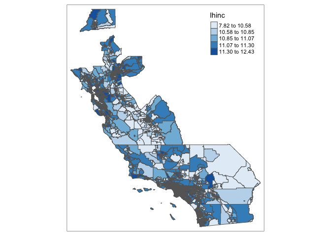
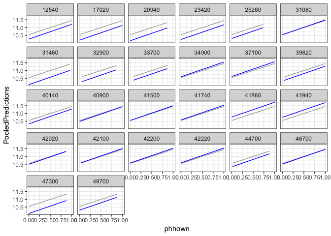
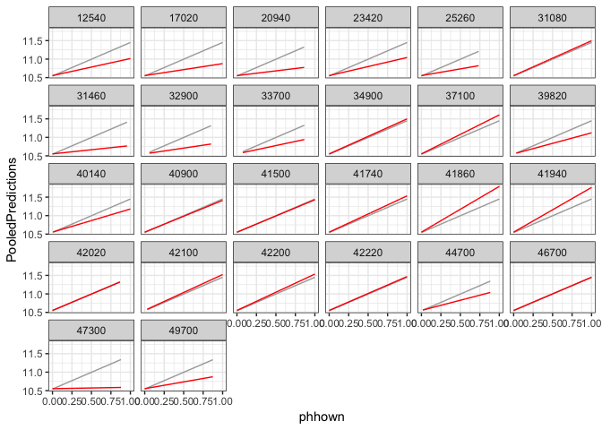
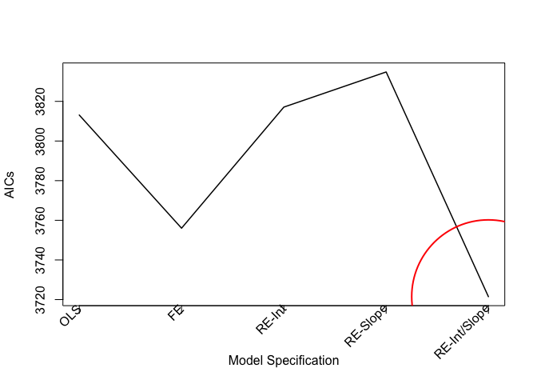

<style>
p.comment {
background-color: #DBDBDB;
padding: 10px;
border: 1px solid black;
margin-left: 25px;
border-radius: 5px;
font-style: italic;
}

h1.title {
  font-weight: bold;
}

</style>
\


The specific learning objectives in this lab are as follows:

1. Learn exploratory methods for understanding the multilevel structure of your data
2. Learn how to estimate explained variance at each level
3. Learn how to run a random intercept and slope multilevel model
4. Learn how to run spatial regime models

We will use multilevel models, which are also known as random effects (RE) and hierarchical linear models (HLM), to examine the census tract and metropolitan area demographic and socioeconomic predictors of median Hispanic household income in California neighborhoods.    According to some studies reported in the [popular press](https://www.npr.org/sections/codeswitch/2017/02/01/512522209/despite-turmoil-latinos-in-california-are-prospering), Hispanics in California are currently prospering.  Likely, this conclusion is not true across all of California - in some areas, Hispanics may be thriving, but others they are not. Let's see what the data tell us. Ready? Yes, of course.


<div style="margin-bottom:25px;">
</div>
## **Installing and loading packages**
\

We'll be using the following new packages in this lab 


```r
install.packages("lme4")
install.packages("lfe")
install.packages("sjstats")
install.packages("lmerTest")
install.packages("psych")
```

Load in the following packages, all of which we've covered in previous labs


```r
library(sf)
library(tidyverse)
library(tmap)
library(broom)
```

<div style="margin-bottom:25px;">
</div>
##**Bringing in the data**
\

We will be using the shape file ca_metro_tracts.shp. This file contains log median Hispanic household income in 2012-2016.  It also contains demographic and socioeconomic data from the 2012-2016 American Community Survey. The record layout for the shapefile's attribute table is located [here](https://raw.githubusercontent.com/crd230/data/master/ca_metro_tracts_record_layout.txt).  We will examine the association between log median Hispanic household income and tract-level concentrated disadvantage, percent of foreign-born residents, percent of Hispanic residents who own a home, percent of Hispanic residents who moved into the neighborhood within the past year and percent Hispanic.  Broader metropolitan area characteristics might also influence change in neighborhood-level Hispanic household income.  We will examine log median Hispanic household income, percent of the civilian labor force that is unemployed, and Hispanic/white and foreign-born/native-born segregation using the [Dissimilarity Index](http://enceladus.isr.umich.edu/race/seg.html).

I zipped up the files associated with the shapefile and uploaded it onto Github.  Download the file, unzip it, and bring it into R using the following code.


```r
setwd("insert your pathway here")
download.file(url = "https://raw.githubusercontent.com/crd230/data/master/ca_metro_tracts.zip", destfile = "ca_metro_tracts.zip")
unzip(zipfile = "ca_metro_tracts.zip")

ca.metro.tracts <- st_read("ca_metro_tracts.shp")
```


<div style="margin-bottom:25px;">
</div>
##**Exploratory Data Analysis**
\

Before running any explanatory model, you should descriptively examine your variables.  We can use the `describe()` function in the **psych** package to get a bunch of descriptive statistics for each of our variables.  We'll first need to load in the **psych** package and then set *ca.metro.tracts* as a non spatial data frame using the function `st_geometry()`.


```r
library(psych)

ca.metro.tracts.df <- ca.metro.tracts
st_geometry(ca.metro.tracts.df) <- NULL
```


```r
ca.metro.tracts.df %>%
  select(lhinc, phisp, concd, pfb, phhown, phmov, lhincm, punempm, hwdis, fbdis) %>%
  describe()
```

```
##         vars    n  mean   sd median trimmed  mad   min   max range  skew
## lhinc      1 7841 10.96 0.46  10.99   10.95 0.43  7.82 12.43  4.61  0.07
## phisp      2 7841  0.38 0.26   0.31    0.36 0.27  0.00  1.00  1.00  0.62
## concd      3 7841  0.00 0.72  -0.18   -0.08 0.62 -1.58  5.08  6.65  1.22
## pfb        4 7841  0.27 0.14   0.25    0.26 0.16  0.00  1.00  1.00  0.48
## phhown     5 7841  0.46 0.26   0.45    0.45 0.30  0.00  1.00  1.00  0.17
## phmov      6 7841  0.14 0.12   0.12    0.13 0.09  0.00  1.00  1.00  1.96
## lhincm     7 7841 10.83 0.13  10.80   10.83 0.03 10.48 11.07  0.59 -0.13
## punempm    8 7841  0.09 0.02   0.08    0.09 0.02  0.06  0.17  0.12  1.21
## hwdis      9 7841  0.51 0.10   0.49    0.52 0.16  0.23  0.61  0.38 -0.49
## fbdis     10 7841  0.25 0.02   0.25    0.25 0.02  0.18  0.32  0.14  0.10
##         kurtosis   se
## lhinc       1.52 0.01
## phisp      -0.76 0.00
## concd       2.05 0.01
## pfb        -0.34 0.00
## phhown     -0.81 0.00
## phmov       6.29 0.00
## lhincm      0.65 0.00
## punempm     1.88 0.00
## hwdis      -0.67 0.00
## fbdis       1.72 0.00
```

It looks like the tract-level mean log Hispanic median household income is 10.96, which is $57,526.44 when exponentiated.

You can also examine a correlation matrix to gauge associations between variables. We exclude the metro level characteristics because tracts within metros will artificially inflate the correlations.


```r
corrMat <- ca.metro.tracts.df %>% select(lhinc, concd, phisp, pfb, phhown, phmov) %>%
  cor()
corrMat
```

```
##              lhinc       concd      phisp        pfb     phhown
## lhinc   1.00000000 -0.58911416 -0.4943797 -0.2380315  0.5180591
## concd  -0.58911416  1.00000000  0.6062526  0.2008684 -0.2554716
## phisp  -0.49437974  0.60625261  1.0000000  0.4500760 -0.1830923
## pfb    -0.23803150  0.20086837  0.4500760  1.0000000 -0.2928551
## phhown  0.51805913 -0.25547155 -0.1830923 -0.2928551  1.0000000
## phmov  -0.08969272  0.01263338 -0.1748124 -0.1881319 -0.2576550
##              phmov
## lhinc  -0.08969272
## concd   0.01263338
## phisp  -0.17481243
## pfb    -0.18813186
## phhown -0.25765497
## phmov   1.00000000
```

We can also conduct the exploratory spatial data analysis techniques discussed in [Lab 5](https://crd230.github.io/lab5.html) to examine underlying spatial patterns in the data.  For now, let's just map the dependent variable *lhinc*


```r
tm_shape(ca.metro.tracts) + tm_polygons(col = "lhinc", style = "quantile", palette="Blues")
```

<!-- -->


<div style="margin-bottom:25px;">
</div>
##**Single-level regression**
\

Let's fit a basic single-level regression model using the `lm()` function. Regress tract-level log Hispanic median household income on our tract-level variables concentrated disadvantage, percent Hispanic home ownership, percent foreign born, Hispanic mobility rate, and percent Hispanic.


```r
single.model1 <- lm(lhinc ~ concd   + phhown + pfb  +phmov + phisp, data = ca.metro.tracts)
```

A tidy table of results


```r
tidy(single.model1)
```

```
## # A tibble: 6 x 5
##   term        estimate std.error statistic   p.value
##   <chr>          <dbl>     <dbl>     <dbl>     <dbl>
## 1 (Intercept)  10.8      0.0157     687.   0.       
## 2 concd        -0.229    0.00649    -35.3  3.12e-253
## 3 phhown        0.692    0.0155      44.5  0.       
## 4 pfb           0.166    0.0305       5.43 5.91e-  8
## 5 phmov        -0.0549   0.0340      -1.62 1.06e-  1
## 6 phisp        -0.400    0.0192     -20.8  7.01e- 94
```

It  appears that concentrated disadvantage, percent Hispanic, and the 1-year Hispanic mobility rates are associated with a lower median Hispanic household income whereas percent Hispanic home ownership and percent foreign-born are associated with a higher Hispanic income.  

Let's now incorporate the metro level characteristics.


```r
single.model2 <- lm(lhinc ~ concd  +pfb + phhown   +phmov + phisp + lhincm + punempm + 
                      hwdis + fbdis, data = ca.metro.tracts)
tidy(single.model2)
```

```
## # A tibble: 10 x 5
##    term        estimate std.error statistic   p.value
##    <chr>          <dbl>     <dbl>     <dbl>     <dbl>
##  1 (Intercept)   4.15     0.497       8.35  7.94e- 17
##  2 concd        -0.195    0.00653   -29.8   9.04e-185
##  3 pfb          -0.148    0.0326     -4.53  5.98e-  6
##  4 phhown        0.707    0.0152     46.4   0.       
##  5 phmov         0.0267   0.0331      0.808 4.19e-  1
##  6 phisp        -0.345    0.0193    -17.9   3.20e- 70
##  7 lhincm        0.584    0.0416     14.1   2.61e- 44
##  8 punempm       0.321    0.352       0.910 3.63e-  1
##  9 hwdis         0.642    0.0446     14.4   2.67e- 46
## 10 fbdis        -0.114    0.200      -0.569 5.70e-  1
```

We find that the percent foreign born and Hispanic mobility rate coefficients flip - the former is now associated with a lower Hispanic household income whereas the latter is associated with a higher income.  The metro level unemployment rate, log Hispanic household income and Hispanic/white segregation are associated with higher tract-level Hispanic household income whereas foreign-born/native-born segregation is associated with a lower income.

<div style="margin-bottom:25px;">
</div>
##**Fixed effects regression**
\

A metro fixed effects regression specification controls for all metro-level characteristics that may be confounding the relationship between tract-level variables and the change in Hispanic household income. It also controls for spatial autocorrelation between tracts within metropolitan areas.

We can run a fixed effects regression using the `lm()` function by including the metro indicator as a factor variable on the right hand side of the equation. A factor variable treats the values as categories, such as male and female for gender or college educated, high school only educated, and non high school educated for educational attainment.  Use the function `factor()` on the metro indicators *GEOIDm* within the `lm()` function.


```r
fe.int.model1 <- lm(lhinc ~ concd  +pfb + phhown   +phmov + phisp + factor(GEOIDm),
     data = ca.metro.tracts)
tidy(fe.int.model1)
```

```
## # A tibble: 31 x 5
##    term                 estimate std.error statistic   p.value
##    <chr>                   <dbl>     <dbl>     <dbl>     <dbl>
##  1 (Intercept)          10.7       0.0296   361.     0.       
##  2 concd                -0.199     0.00663  -30.0    9.89e-188
##  3 pfb                  -0.208     0.0340    -6.11   1.04e-  9
##  4 phhown                0.713     0.0153    46.6    0.       
##  5 phmov                 0.0349    0.0331     1.05   2.92e-  1
##  6 phisp                -0.312     0.0204   -15.3    3.09e- 52
##  7 factor(GEOIDm)17020  -0.312     0.0500    -6.24   4.73e- 10
##  8 factor(GEOIDm)20940   0.00339   0.0607     0.0559 9.55e-  1
##  9 factor(GEOIDm)23420  -0.00355   0.0331    -0.107  9.15e-  1
## 10 factor(GEOIDm)25260   0.00680   0.0641     0.106  9.16e-  1
## # … with 21 more rows
```

R automatically removes one of the levels, in this case the metropolitan area with a *GEOIDm* equal to 12540. The group removed is known as the reference group or category, and the *factor(GEOIDm)* coefficient for each metropolitan area is comparing the mean *lhinc* relative to the reference group.  For example, the *factor(GEOIDm)* coefficient for metropolitan area 17020 is -0.311616, which means that the log Hispanic median household income for metro area 17020 is 0.311616 lower than the log Hispanic median household income for metro area 12540.

You'll notice the bottom of the tibble produced by the `lm()` function above indicates that there are 21 more rows of results, which provide coefficients for the rest of the California metropolitan areas. We can use the function `felm()` to run a fixed effects model with the fixed effects on the metro areas suppressed from the summary.  We specify *GEOIDm* as  a factor, but specify it as a fixed effect using the `|`  symbol at the end of the equation.


```r
library(lfe)
fe.int.model2 <- felm(lhinc ~ concd  +pfb + phhown   +phmov + phisp | factor(GEOIDm),
     data = ca.metro.tracts)
tidy(fe.int.model2)
```

```
## # A tibble: 5 x 5
##   term   estimate std.error statistic   p.value
##   <chr>     <dbl>     <dbl>     <dbl>     <dbl>
## 1 concd   -0.199    0.00663    -30.0  9.89e-188
## 2 pfb     -0.208    0.0340      -6.11 1.04e-  9
## 3 phhown   0.713    0.0153      46.6  0.       
## 4 phmov    0.0349   0.0331       1.05 2.92e-  1
## 5 phisp   -0.312    0.0204     -15.3  3.09e- 52
```

You'll notice the table of results suppresses the fixed effect coefficients, allowing you to create publication ready tables (fixed effects are typically not reported).

We find that that the FE results do not broadly diverge from the single level regression results. 


<div style="margin-bottom:25px;">
</div>
##**Multilevel regression**
\

A disadvantage of the fixed effects specification is that we can't include any variables measured at the metropolitan area level - they are absorbed by the metro fixed effects. We see that when we try to include the metro area characteristics into the `felm()` function.


```r
felm(lhinc ~ concd  +pfb + phhown   +phmov + phisp 
              +lhincm + punempm + hwdis + fbdis | factor(GEOIDm),
     data = ca.metro.tracts)
```

```
## Warning in chol.default(mat, pivot = TRUE, tol = tol): the matrix is either
## rank-deficient or indefinite
```

```
##    concd      pfb   phhown    phmov    phisp   lhincm  punempm    hwdis 
## -0.19918 -0.20751  0.71316  0.03488 -0.31204      NaN      NaN      NaN 
##    fbdis 
##      NaN
```

The warning tells us something bad happened. And we see that with *NaN* values reported for the metro level coefficients.

A fixed effects regression is fine if you are not concerned with understanding the association between metro-level characteristics and the lower level (census tract) dependent variable.  In fact, it's a model with less assumptions compared to a multilevel model.  But, what if we are interested in examining metro level predictors, but also control for the correlation between neighborhoods within metro areas? That's where multilevel models come in.

Before estimating a multilevel model, check the sample size of level 2 units (metros)


```r
length(table(ca.metro.tracts$metro))
```

```
## [1] 26
```

Although not as important, check if there is a large number of level 1 units (tracts) within each level 2 unit (metro)


```r
nunits <-ca.metro.tracts %>%
  group_by(metro) %>%
  summarize("# tracts" = n())
st_geometry(nunits) <- NULL
as.data.frame(nunits)
```

```
##                                        metro # tracts
## 1                                Bakersfield      151
## 2                                      Chico       51
## 3                                  El Centro       31
## 4                                     Fresno      199
## 5                           Hanford-Corcoran       27
## 6             Los Angeles-Long Beach-Anaheim     2926
## 7                                     Madera       23
## 8                                     Merced       49
## 9                                    Modesto       94
## 10                                      Napa       40
## 11              Oxnard-Thousand Oaks-Ventura      174
## 12                                   Redding       48
## 13          Riverside-San Bernardino-Ontario      822
## 14       Sacramento--Roseville--Arden-Arcade      486
## 15                                   Salinas       93
## 16                        San Diego-Carlsbad      627
## 17             San Francisco-Oakland-Hayward      975
## 18            San Jose-Sunnyvale-Santa Clara      383
## 19 San Luis Obispo-Paso Robles-Arroyo Grande       53
## 20                    Santa Cruz-Watsonville       52
## 21                 Santa Maria-Santa Barbara       90
## 22                                Santa Rosa       99
## 23                             Stockton-Lodi      139
## 24                         Vallejo-Fairfield       96
## 25                       Visalia-Porterville       78
## 26                                 Yuba City       35
```

You should also check if there is variation in the dependent variable between- and within- metropolitan areas.  We can do this descriptively using a boxplot.


```r
ggplot(ca.metro.tracts) +
  geom_boxplot(mapping = aes(x = as.factor(GEOIDm), y = lhinc)) + ylab("Log median Hispanic household income") + xlab("Metropolitan area") + theme(axis.text.x=element_blank())
```

<!-- -->

Two things: (1) there appears to be within-metro variation in household income as indicated by the size of the boxes; (2) there appears to be between-metro variation as indicated by the variation in the means across metros.

We can formally check for variation across metropolitan areas using a basic ANOVA that tests differences in the means across metros. Remember, if all metros are basically the same, there's no use running a multi-level model - in other words, all the "action" is happening between tracts.


```r
fit.test<-lm(lhinc~factor(GEOIDm), data=ca.metro.tracts)
#Global F test for equality of means across the metros 
anova(fit.test)
```

```
## Analysis of Variance Table
## 
## Response: lhinc
##                  Df  Sum Sq Mean Sq F value    Pr(>F)    
## factor(GEOIDm)   25  163.35  6.5339  34.166 < 2.2e-16 ***
## Residuals      7815 1494.52  0.1912                      
## ---
## Signif. codes:  0 '***' 0.001 '**' 0.01 '*' 0.05 '.' 0.1 ' ' 1
```

Yes! The statistically significant F statistic indicates that the means are not equal (null hypothesis is means are equal).  Note that a multilevel model is a regression model, so it still needs to meet the other regression assumptions outlined in Week 6.

<div style="margin-bottom:25px;">
</div>
###**Variation explained**
\

Let's first run a null multilevel model.  Doing so will give us estimates of the amount and percent of variation explained at each level - tract and metropolitan area.  To run a multilevel model, we'll use the `lmer()` function, which is a part of the **lme4** package. You'll also need to load in the package  **lmerTest** to attach p-value results to your coefficients.


```r
library(lme4)
library(lmerTest)
```

Next, run an empty  random intercept model, which does not include any tract or metropolitan area level characteristics.


```r
re.int.model1 <- lmer(lhinc~ (1|GEOIDm), data=ca.metro.tracts)
summary(re.int.model1, correlation = FALSE)
```

```
## Linear mixed model fit by REML. t-tests use Satterthwaite's method [
## lmerModLmerTest]
## Formula: lhinc ~ (1 | GEOIDm)
##    Data: ca.metro.tracts
## 
## REML criterion at convergence: 9368
## 
## Scaled residuals: 
##     Min      1Q  Median      3Q     Max 
## -7.6789 -0.6673 -0.0270  0.5731  3.3935 
## 
## Random effects:
##  Groups   Name        Variance Std.Dev.
##  GEOIDm   (Intercept) 0.03683  0.1919  
##  Residual             0.19124  0.4373  
## Number of obs: 7841, groups:  GEOIDm, 26
## 
## Fixed effects:
##             Estimate Std. Error       df t value Pr(>|t|)    
## (Intercept) 10.85216    0.03892 24.76941   278.8   <2e-16 ***
## ---
## Signif. codes:  0 '***' 0.001 '**' 0.01 '*' 0.05 '.' 0.1 ' ' 1
```

I use `correlation = FALSE` in the `summary()` function to suppress the *Correlation of Fixed Effects* results, which frankly I have a hard time interpreting. The `lmer` function's arguments take on a similar form as `lm()` except the use of `(1|GEOIDm)`. The argument `(1|GEOIDm)` indicates the random effects of the equation, including the second level (metropolitan area) variation.  The following table shows how to specify the different multilevel models using this `( | )` format.  


<table class="table table-striped" style="width: auto !important; margin-left: auto; margin-right: auto;">
 <thead>
  <tr>
   <th style="text-align:left;"> Argument </th>
   <th style="text-align:left;"> Model </th>
  </tr>
 </thead>
<tbody>
  <tr>
   <td style="text-align:left;"> (1|group) </td>
   <td style="text-align:left;"> Random intercept </td>
  </tr>
  <tr>
   <td style="text-align:left;"> (0+x|group) </td>
   <td style="text-align:left;"> Random slope </td>
  </tr>
  <tr>
   <td style="text-align:left;"> (-1+x|group) </td>
   <td style="text-align:left;"> Random slope </td>
  </tr>
  <tr>
   <td style="text-align:left;"> (x|group) </td>
   <td style="text-align:left;"> Random int and slope </td>
  </tr>
  <tr>
   <td style="text-align:left;"> (1|group1) + (1|group1:group2) </td>
   <td style="text-align:left;"> Random int for group1 and group2 </td>
  </tr>
</tbody>
</table>

There are other specifications that deal with different types of nesting structures.  You'll explore one of these alternative nesting structures in homework 4.

Going back to our output of results, the results under the "Random effects" heading provide the variation at each level - level 1 tract (*Residual*) and level 2 metro area (*GEOIDm*).  We actually want the percent of variation explained, so we have to divide the RE of *GEOIDm* by the total variation (*Residual* + *GEOIDm*).  We can do this by using the `re_var()` function, which extracts the random effects of a saved multilevel object.  This function is in the **sjstats** package, which we'll need to load.


```r
library(sjstats)
var.est<-re_var(re.int.model1)
var.est[2]/sum(var.est)
```

```
## GEOIDm_tau.00 
##     0.1614856
```

The proportion explained at each level is known as the intra-class correlation (ICC). The `icc()` function in the **sjstats** package calculates the ICC directly for the higher level(s).


```r
icc(re.int.model1)
```

```
## 
## Intraclass Correlation Coefficient for Linear mixed model
## 
## Family : gaussian (identity)
## Formula: lhinc ~ (1 | GEOIDm)
## 
##   ICC (GEOIDm): 0.1615
```

We find that the proportion of variation in median Hispanic Household income explained by differences across metro areas is 16%. The rest is explained by census tracts and potentially other levels.

Note that our outcome *lhinc* is continuous.  If we have a non-continuous outcome such as a count or categorical variable, we use the `glmer()` function, and specify the outcome distribution using the `family` argument.  For example, if you have a binary outcome, specify `family = binomial`, which runs a multilevel logit regression model.  

<div style="margin-bottom:25px;">
</div>
###**Random intercepts with covariates**
\

An empty random intercept model gives us percent variation explained at each level.  Let's now add covariates to try to find which specific variables might explain variation in the outcome.  First, let's add the tract-level variables


```r
re.int.model2 <- lmer(lhinc~ concd  +pfb + phhown   +phmov + phisp 
              +  (1|GEOIDm), data=ca.metro.tracts)
summary(re.int.model2, correlation = FALSE)
```

```
## Linear mixed model fit by REML. t-tests use Satterthwaite's method [
## lmerModLmerTest]
## Formula: lhinc ~ concd + pfb + phhown + phmov + phisp + (1 | GEOIDm)
##    Data: ca.metro.tracts
## 
## REML criterion at convergence: 3839.9
## 
## Scaled residuals: 
##      Min       1Q   Median       3Q      Max 
## -10.9783  -0.5440   0.0242   0.5689   4.4519 
## 
## Random effects:
##  Groups   Name        Variance Std.Dev.
##  GEOIDm   (Intercept) 0.01994  0.1412  
##  Residual             0.09414  0.3068  
## Number of obs: 7841, groups:  GEOIDm, 26
## 
## Fixed effects:
##               Estimate Std. Error         df t value Pr(>|t|)    
## (Intercept)  1.070e+01  3.208e-02  3.850e+01 333.420  < 2e-16 ***
## concd       -2.001e-01  6.615e-03  7.830e+03 -30.250  < 2e-16 ***
## pfb         -1.982e-01  3.388e-02  7.828e+03  -5.851 5.08e-09 ***
## phhown       7.129e-01  1.528e-02  7.829e+03  46.657  < 2e-16 ***
## phmov        3.226e-02  3.309e-02  7.824e+03   0.975     0.33    
## phisp       -3.129e-01  2.031e-02  7.828e+03 -15.405  < 2e-16 ***
## ---
## Signif. codes:  0 '***' 0.001 '**' 0.01 '*' 0.05 '.' 0.1 ' ' 1
```

If you are annoyed by the results shown in [scientific notation](https://en.wikipedia.org/wiki/Scientific_notation), use the `scipen=alpha` argument in the `options()` command, where `alpha`  is the maximum number of digits for the result to be still expressed in fixed notation.


```r
options(scipen=1)
summary(re.int.model2, correlation = FALSE)
```

```
## Linear mixed model fit by REML. t-tests use Satterthwaite's method [
## lmerModLmerTest]
## Formula: lhinc ~ concd + pfb + phhown + phmov + phisp + (1 | GEOIDm)
##    Data: ca.metro.tracts
## 
## REML criterion at convergence: 3839.9
## 
## Scaled residuals: 
##      Min       1Q   Median       3Q      Max 
## -10.9783  -0.5440   0.0242   0.5689   4.4519 
## 
## Random effects:
##  Groups   Name        Variance Std.Dev.
##  GEOIDm   (Intercept) 0.01994  0.1412  
##  Residual             0.09414  0.3068  
## Number of obs: 7841, groups:  GEOIDm, 26
## 
## Fixed effects:
##                Estimate  Std. Error          df t value Pr(>|t|)    
## (Intercept)   10.695049    0.032077   38.504450 333.420  < 2e-16 ***
## concd         -0.200106    0.006615 7829.978831 -30.250  < 2e-16 ***
## pfb           -0.198233    0.033879 7828.016643  -5.851 5.08e-09 ***
## phhown         0.712921    0.015280 7828.541409  46.657  < 2e-16 ***
## phmov          0.032258    0.033087 7824.487588   0.975     0.33    
## phisp         -0.312943    0.020315 7827.847480 -15.405  < 2e-16 ***
## ---
## Signif. codes:  0 '***' 0.001 '**' 0.01 '*' 0.05 '.' 0.1 ' ' 1
```

Now include the metropolitan area characteristics.


```r
re.int.model3 <- lmer(lhinc~ concd  +pfb + phhown   +phmov + phisp 
              +lhincm + punempm + hwdis + fbdis + (1|GEOIDm), data=ca.metro.tracts)
summary(re.int.model3, correlation = FALSE)
```

```
## Linear mixed model fit by REML. t-tests use Satterthwaite's method [
## lmerModLmerTest]
## Formula: 
## lhinc ~ concd + pfb + phhown + phmov + phisp + lhincm + punempm +  
##     hwdis + fbdis + (1 | GEOIDm)
##    Data: ca.metro.tracts
## 
## REML criterion at convergence: 3793.1
## 
## Scaled residuals: 
##      Min       1Q   Median       3Q      Max 
## -10.9789  -0.5422   0.0271   0.5666   4.4459 
## 
## Random effects:
##  Groups   Name        Variance Std.Dev.
##  GEOIDm   (Intercept) 0.00187  0.04324 
##  Residual             0.09414  0.30683 
## Number of obs: 7841, groups:  GEOIDm, 26
## 
## Fixed effects:
##                Estimate  Std. Error          df t value Pr(>|t|)    
## (Intercept)    4.120523    1.058315   22.705820   3.893 0.000746 ***
## concd         -0.198102    0.006595 7674.989265 -30.040  < 2e-16 ***
## pfb           -0.199801    0.033701 7252.978627  -5.929 3.20e-09 ***
## phhown         0.712823    0.015254 7816.607378  46.729  < 2e-16 ***
## phmov          0.034829    0.033045 7829.777800   1.054 0.291918    
## phisp         -0.317133    0.020129 6700.120265 -15.755  < 2e-16 ***
## lhincm         0.597442    0.090403   22.393774   6.609 1.10e-06 ***
## punempm        0.951119    0.623915   27.377839   1.524 0.138869    
## hwdis          0.821212    0.131610   19.236685   6.240 5.12e-06 ***
## fbdis         -1.104715    0.479702   20.393726  -2.303 0.031931 *  
## ---
## Signif. codes:  0 '***' 0.001 '**' 0.01 '*' 0.05 '.' 0.1 ' ' 1
```

The tract-level coefficients don't change much in terms of their effect sizes and statistical significance compared to the single and fixed effects regression results.  However, we do see significant changes in the metro-level characteristics compared to the single-level results.  The direction of the effects do not change, but foreign-born segregation is now significant at the 5 percent level.  Moreover, the effect sizes are much larger in the multilevel model.  How would you explain these changes?

<div style="margin-bottom:25px;">
</div>
###**Random coefficients**
\

We might be interested in determining whether the effects of certain tract-level variables vary across metropolitan area.  Here, we run a random coefficient or slope model.  First, run a random coefficient model for *phhown* without a random intercept.


```r
re.slope.model1 <- lmer(lhinc~ concd  +pfb + phhown   +phmov  + phisp 
              +lhincm + punempm + hwdis + fbdis + (0+phhown|GEOIDm), data=ca.metro.tracts)
summary(re.slope.model1, correlation = FALSE)
```

```
## Linear mixed model fit by REML. t-tests use Satterthwaite's method [
## lmerModLmerTest]
## Formula: 
## lhinc ~ concd + pfb + phhown + phmov + phisp + lhincm + punempm +  
##     hwdis + fbdis + (0 + phhown | GEOIDm)
##    Data: ca.metro.tracts
## 
## REML criterion at convergence: 3810.8
## 
## Scaled residuals: 
##      Min       1Q   Median       3Q      Max 
## -10.9936  -0.5446   0.0240   0.5680   4.4731 
## 
## Random effects:
##  Groups   Name   Variance Std.Dev.
##  GEOIDm   phhown 0.01032  0.1016  
##  Residual        0.09424  0.3070  
## Number of obs: 7841, groups:  GEOIDm, 26
## 
## Fixed effects:
##                Estimate  Std. Error          df t value Pr(>|t|)    
## (Intercept)    2.024789    0.797788   84.080068   2.538    0.013 *  
## concd         -0.196485    0.006605 7584.872024 -29.746  < 2e-16 ***
## pfb           -0.174621    0.033512 7382.317601  -5.211 1.93e-07 ***
## phhown         0.712717    0.030367   23.472909  23.470  < 2e-16 ***
## phmov          0.030580    0.033068 7830.538848   0.925    0.355    
## phisp         -0.326575    0.019913 7309.047110 -16.400  < 2e-16 ***
## lhincm         0.775635    0.067472   88.671494  11.496  < 2e-16 ***
## punempm        0.862818    0.546285   62.400916   1.579    0.119    
## hwdis          0.597971    0.072915  263.198954   8.201 1.06e-14 ***
## fbdis         -0.003154    0.341459   90.527014  -0.009    0.993    
## ---
## Signif. codes:  0 '***' 0.001 '**' 0.01 '*' 0.05 '.' 0.1 ' ' 1
```

The results under the *Random effects* section tells us that the random slope for *phhown* has a variance of 0.01032 - that is, the amount of variability in the slope of *phhown* across metro areas is 0.01032.  How do we know whether this variability is statistically different from 0?  We can use the function `ranova()` in the **lmerTest** package, which uses a Chi-square test to test against the null of variance equal to 0.  


Plug in your saved random slope model above into `ranova()` 


```r
ranova(re.slope.model1)
```

```
## ANOVA-like table for random-effects: Single term deletions
## 
## Model:
## lhinc ~ concd + pfb + phhown + phmov + phisp + lhincm + punempm + 
##     hwdis + fbdis + (0 + phhown | GEOIDm)
##                                 npar  logLik    AIC     LRT Df Pr(>Chisq)
## <none>                            12 -1905.4 3834.8                      
## phhown in (0 + phhown | GEOIDm)   12 -1896.5 3817.1 -17.727  0
```

We can add a random intercept by replacing the `0` in `( | )` by 1.


```r
re.int.slope.model <- lmer(lhinc~ concd  +pfb + phhown   +phmov  + phisp 
              +lhincm + punempm + hwdis + fbdis + (1+phhown+pfb|GEOIDm), data=ca.metro.tracts)
summary(re.int.slope.model, correlation = FALSE)
```

```
## Linear mixed model fit by REML. t-tests use Satterthwaite's method [
## lmerModLmerTest]
## Formula: 
## lhinc ~ concd + pfb + phhown + phmov + phisp + lhincm + punempm +  
##     hwdis + fbdis + (1 + phhown + pfb | GEOIDm)
##    Data: ca.metro.tracts
## 
## REML criterion at convergence: 3687.5
## 
## Scaled residuals: 
##      Min       1Q   Median       3Q      Max 
## -11.0409  -0.5312   0.0189   0.5638   4.5105 
## 
## Random effects:
##  Groups   Name        Variance Std.Dev. Corr       
##  GEOIDm   (Intercept) 0.02643  0.1626              
##           phhown      0.01365  0.1168   -0.74      
##           pfb         0.13007  0.3606   -0.95  0.49
##  Residual             0.09244  0.3040              
## Number of obs: 7841, groups:  GEOIDm, 26
## 
## Fixed effects:
##                Estimate  Std. Error          df t value Pr(>|t|)    
## (Intercept)    4.865846    0.763619   81.047043   6.372 1.06e-08 ***
## concd         -0.199236    0.006601 7278.598287 -30.182  < 2e-16 ***
## pfb            0.164583    0.091567   23.694727   1.797    0.085 .  
## phhown         0.735616    0.033766   10.450514  21.786 4.76e-10 ***
## phmov          0.034887    0.032953 7789.129217   1.059    0.290    
## phisp         -0.340442    0.019585 6914.823948 -17.383  < 2e-16 ***
## lhincm         0.521926    0.063343   85.086665   8.240 1.85e-12 ***
## punempm        0.394900    0.548156   80.339043   0.720    0.473    
## hwdis          0.357260    0.068071   75.061420   5.248 1.38e-06 ***
## fbdis         -0.137827    0.288961   82.215359  -0.477    0.635    
## ---
## Signif. codes:  0 '***' 0.001 '**' 0.01 '*' 0.05 '.' 0.1 ' ' 1
## convergence code: 0
## singular fit
```

And test whether variation in the slopes and intercept is significant from 0.


```r
ranova(re.int.slope.model)
```

```
## ANOVA-like table for random-effects: Single term deletions
## 
## Model:
## lhinc ~ concd + pfb + phhown + phmov + phisp + lhincm + punempm + 
##     hwdis + fbdis + (1 + phhown + pfb | GEOIDm)
##                                       npar  logLik    AIC    LRT Df
## <none>                                  17 -1843.7 3721.5          
## phhown in (1 + phhown + pfb | GEOIDm)   14 -1853.1 3734.2 18.685  3
## pfb in (1 + phhown + pfb | GEOIDm)      14 -1887.8 3803.6 88.161  3
##                                       Pr(>Chisq)    
## <none>                                              
## phhown in (1 + phhown + pfb | GEOIDm)  0.0003176 ***
## pfb in (1 + phhown + pfb | GEOIDm)     < 2.2e-16 ***
## ---
## Signif. codes:  0 '***' 0.001 '**' 0.01 '*' 0.05 '.' 0.1 ' ' 1
```

We can add random slopes to other variables.  For example, we found that percent foreign born is positively associated with log Hispanic median household income.  Does that vary across metro areas?


```r
re.int.slope.model2 <- lmer(lhinc~ concd  +pfb + phhown   +phmov  + phisp 
              +lhincm + punempm + hwdis + fbdis + (1+phhown+pfb|GEOIDm), 
              data=ca.metro.tracts)
ranova(re.int.slope.model2)
```

```
## ANOVA-like table for random-effects: Single term deletions
## 
## Model:
## lhinc ~ concd + pfb + phhown + phmov + phisp + lhincm + punempm + 
##     hwdis + fbdis + (1 + phhown + pfb | GEOIDm)
##                                       npar  logLik    AIC    LRT Df
## <none>                                  17 -1843.7 3721.5          
## phhown in (1 + phhown + pfb | GEOIDm)   14 -1853.1 3734.2 18.685  3
## pfb in (1 + phhown + pfb | GEOIDm)      14 -1887.8 3803.6 88.161  3
##                                       Pr(>Chisq)    
## <none>                                              
## phhown in (1 + phhown + pfb | GEOIDm)  0.0003176 ***
## pfb in (1 + phhown + pfb | GEOIDm)     < 2.2e-16 ***
## ---
## Signif. codes:  0 '***' 0.001 '**' 0.01 '*' 0.05 '.' 0.1 ' ' 1
```


<div style="margin-bottom:25px;">
</div>
###**Visualizing differences**
\

We can visualize the differences between the single level, random intercept, random coefficient, and random intercept and coefficient models by extracting the predicted values of log Hispanic median household income from each model.  This will help fortify how exactly these different approaches are modelling the outcome.  For simplicity's sake, we'll fit models only examining the relationship between percent Hispanic home ownership and log Hispanic median income. First, fit the models


```r
ols <- lm(lhinc ~ phhown, data = ca.metro.tracts)
reint <- lmer(lhinc~ phhown  + (1|GEOIDm), data=ca.metro.tracts)
reslope <- lmer(lhinc~ (0+phhown|GEOIDm), data=ca.metro.tracts)
reintslope <- lmer(lhinc~  (1+phhown|GEOIDm), data=ca.metro.tracts)
```

Second, we extract the predicted or fitted log Hispanic median household income using the `fitted()` function.  Let's save these predictions into our data set *ca.metro.tracts* 


```r
ca.metro.tracts$PooledPredictions <- fitted(ols)
ca.metro.tracts$VaryingInterceptPredictions <- fitted(reint)
ca.metro.tracts$VaryingSlopePredictions <- fitted(reslope)
ca.metro.tracts$InteractionPredictions <- fitted(reintslope)
```

Next, we plot the random intercept predictions compared to the single level model predictions 


```r
ggplot(ca.metro.tracts) +
    geom_line(aes(x = phhown, y = PooledPredictions), color = "darkgrey") +
    geom_line(aes(x = phhown, y = VaryingInterceptPredictions), color = "blue") +
    #geom_line(aes(x = phhown, y = VaryingSlopePredictions), color = "red") +
    #geom_line(aes(x = phhown, y = InteractionPredictions), color = "black") +
    facet_wrap(~GEOIDm) +
    theme_bw()
```

<!-- -->

Do the plots jibe with what you thought these models are doing?

Next, varying slope for *phhown* vs. single level 


```r
ggplot(ca.metro.tracts) +
    geom_line(aes(x = phhown, y = PooledPredictions), color = "darkgrey") +
    #geom_line(aes(x = phhown, y = VaryingInterceptPredictions), color = "blue") +
    geom_line(aes(x = phhown, y = VaryingSlopePredictions), color = "red") +
    #geom_line(aes(x = phhown, y = InteractionPredictions), color = "black") +
    facet_wrap(~GEOIDm) +
    theme_bw()
```

<!-- -->

Finally, the varying slope and intercept vs single level


```r
ggplot(ca.metro.tracts) +
    geom_line(aes(x = phhown, y = PooledPredictions), color = "darkgrey") +
    #geom_line(aes(x = phhown, y = VaryingInterceptPredictions), color = "blue") +
    #geom_line(aes(x = phhown, y = VaryingSlopePredictions), color = "red") +
    geom_line(aes(x = phhown, y = InteractionPredictions), color = "black") +
    facet_wrap(~GEOIDm) +
    theme_bw()
```

<!-- -->

Based on the random slope + intercept model, which metro areas exhibit a *phhown* slope that considerably deviates from the mean? Which metro areas do not?

<div style="margin-bottom:25px;">
</div>
##**Model selection**
\

Which model do we choose - Single level, Multilevel with a random intercept, Multilevel with a random slope, Multilevel with a random slope and intercept? The specific hypothesis you are interested in testing and the theory backing up that hypothesis should guide you towards which model to ultimately choose.  But, you can run some likelihood ratio tests, which are based on model fit using the log likelihood to make comparisons, to make some comparisons.

<div style="margin-bottom:25px;">
</div>
###**Single level vs. Multilevel**
\

The `ranova()` function allows us to compare multilevel models with single level regressions.  We already used `ranova()` above to test whether the variance of the random slope is statistically different from a null of 0.  This test is the same thing as comparing model fit for a random slope model compared to a regular single level regression. We test the random intercept model against the single level as follows.


```r
ranova(re.int.model3)
```

```
## ANOVA-like table for random-effects: Single term deletions
## 
## Model:
## lhinc ~ concd + pfb + phhown + phmov + phisp + lhincm + punempm + 
##     hwdis + fbdis + (1 | GEOIDm)
##              npar  logLik    AIC    LRT Df Pr(>Chisq)    
## <none>         12 -1896.5 3817.1                         
## (1 | GEOIDm)   11 -1922.2 3866.5 51.377  1  7.623e-13 ***
## ---
## Signif. codes:  0 '***' 0.001 '**' 0.01 '*' 0.05 '.' 0.1 ' ' 1
```

What about the random slope + intercept model?


```r
ranova(re.int.slope.model)
```

```
## ANOVA-like table for random-effects: Single term deletions
## 
## Model:
## lhinc ~ concd + pfb + phhown + phmov + phisp + lhincm + punempm + 
##     hwdis + fbdis + (1 + phhown + pfb | GEOIDm)
##                                       npar  logLik    AIC    LRT Df
## <none>                                  17 -1843.7 3721.5          
## phhown in (1 + phhown + pfb | GEOIDm)   14 -1853.1 3734.2 18.685  3
## pfb in (1 + phhown + pfb | GEOIDm)      14 -1887.8 3803.6 88.161  3
##                                       Pr(>Chisq)    
## <none>                                              
## phhown in (1 + phhown + pfb | GEOIDm)  0.0003176 ***
## pfb in (1 + phhown + pfb | GEOIDm)     < 2.2e-16 ***
## ---
## Signif. codes:  0 '***' 0.001 '**' 0.01 '*' 0.05 '.' 0.1 ' ' 1
```

The results actually compare models with random slopes for *phhown* and *pfb* separately.  To test the combined model against a single level model, use the `reduce.terms = FALSE` argument


```r
ranova(re.int.slope.model, reduce.terms = FALSE)
```

```
## ANOVA-like table for random-effects: Single term deletions
## 
## Model:
## lhinc ~ concd + pfb + phhown + phmov + phisp + lhincm + punempm + 
##     hwdis + fbdis + (1 + phhown + pfb | GEOIDm)
##                             npar  logLik    AIC    LRT Df Pr(>Chisq)    
## <none>                        17 -1843.7 3721.5                         
## (1 + phhown + pfb | GEOIDm)   11 -1922.2 3866.5 157.01  6  < 2.2e-16 ***
## ---
## Signif. codes:  0 '***' 0.001 '**' 0.01 '*' 0.05 '.' 0.1 ' ' 1
```

<div style="margin-bottom:25px;">
</div>
###**Random intercept vs. Random slope**
\

Random intercept and slope models are nested, which means we can use a basic ANOVA to make comparisons between the two. We do this by using the `anova()` function, which we also used when we made model comparisons between spatial regression models in [Week 7 Lab](https://crd230.github.io/lab7.html#spatial_durbin_model).  

The null will always be the simpler model, with a random intercept only model being the simplest among the multilevel flavors.  For example, testing model fit between a random intercept only model and a random slope on *phhown* yields :


```r
anova(re.int.model3, re.slope.model1)
```

```
## Data: ca.metro.tracts
## Models:
## re.int.model3: lhinc ~ concd + pfb + phhown + phmov + phisp + lhincm + punempm + 
## re.int.model3:     hwdis + fbdis + (1 | GEOIDm)
## re.slope.model1: lhinc ~ concd + pfb + phhown + phmov + phisp + lhincm + punempm + 
## re.slope.model1:     hwdis + fbdis + (0 + phhown | GEOIDm)
##                 Df    AIC    BIC  logLik deviance Chisq Chi Df Pr(>Chisq)
## re.int.model3   12 3772.3 3855.9 -1874.2   3748.3                        
## re.slope.model1 12 3788.1 3871.7 -1882.1   3764.1     0      0          1
```

Random intercept only vs Random intercept and random slopes for *phhown* and *pfb*?


```r
anova(re.int.model3, re.int.slope.model)
```

```
## Data: ca.metro.tracts
## Models:
## re.int.model3: lhinc ~ concd + pfb + phhown + phmov + phisp + lhincm + punempm + 
## re.int.model3:     hwdis + fbdis + (1 | GEOIDm)
## re.int.slope.model: lhinc ~ concd + pfb + phhown + phmov + phisp + lhincm + punempm + 
## re.int.slope.model:     hwdis + fbdis + (1 + phhown + pfb | GEOIDm)
##                    Df    AIC    BIC  logLik deviance  Chisq Chi Df
## re.int.model3      12 3772.3 3855.9 -1874.2   3748.3              
## re.int.slope.model 17 3675.0 3793.4 -1820.5   3641.0 107.34      5
##                    Pr(>Chisq)    
## re.int.model3                    
## re.int.slope.model  < 2.2e-16 ***
## ---
## Signif. codes:  0 '***' 0.001 '**' 0.01 '*' 0.05 '.' 0.1 ' ' 1
```

The difference between `ranova()` and `anova()` is that the latter generalizes what the former is doing. `ranova()` tests against the null of a single level model.  `anova()` allows you test across all nested models.

We can also rely on our new best friend the Akaike Information Criterion (AIC).  Remember, AIC is related to deviance. Deviance is bad. So, the lower the deviance, the better, which means the lower the AIC, the better the fit.  We can use the AIC to even compare across fixed and random effects models.


```r
#Save AIC values
AICs<-c(AIC(single.model2),AIC(fe.int.model1), AIC(re.int.model3), AIC(re.slope.model1), AIC(re.int.slope.model))

#plot the AICs
plot(AICs, type="l", lwd=1.5, xaxt="n", xlab="")
axis(1, at=1:5,labels=F) #6= number of models
labels<-c("OLS", "FE","RE-Int", "RE-Slope","RE-Int/Slope" )
text(1:5, par("usr")[3]-.25, srt=45, adj=1, labels=labels, xpd=T)
mtext(side=1, text="Model Specification", line=3)
#circle the model with the lowest AIC
symbols(x= which.min(AICs), y=AICs[which.min(AICs)], circles=1, fg=2,lwd=2,add=T)
```

<!-- -->

The random intercept and slope model seems to be the best fitting.  But, once again, what were trying to do with an FE model is very different with what we are trying to accomplish with a multilevel model. What is your hypothesis, what is your theoretical framework, what pathways are you interested in...

<div style="margin-bottom:25px;">
</div>
##**Spatial Regime Model**
\

In a spatial regime model, we stratify the data by either a known fixed quality, such as the metropolitan area in which a tract is located, or perhaps some other socio-demographic or socio-economic variable. We then fit separate regression models for each regime.  You can do this through a split-sample approach whereby  you subset your data set into different regimes and run models for each regime.  You can also run a fully-interacted model.  To do the latter in R, you'll have to specify  *GEOIDm* as a factor and use the following format in the `lm()` function


```r
fit.metro.regime<-lm(lhinc~ factor(GEOIDm)/(concd  +pfb + phhown   +phmov + phisp), data = ca.metro.tracts)
```

The `factor(GEOIDm)/( ... )` argument tells R to interact the variable *factor(GEOIDm)* with all the variables contained within the parentheses after `/`.  Let's examine the results


```r
summary(fit.metro.regime)
```

oooff. The results show a coefficient for each variable and metro area combination. 

In the models above, we specified the regimes based on metro area affiliation. We can also establish regimes based on a demographic characteristic, say poverty:


```r
ca.metro.tracts <- mutate(ca.metro.tracts, pov_group = cut(ppov, breaks = quantile(ppov,
p=c(0, .3, .6, 1)), include.lowest = T))
```

Here, we separated counties into three poverty regimes: Low poverty (bottom 30%), medium
poverty (Between the 30th and 60th percentiles), and high poverty (above the 60th percentile).
Let's map these groups


```r
tmap_mode("view")
tm_shape(ca.metro.tracts) + tm_polygons(col = "pov_group", style = "cat", palette="Blues")
```

We then run a fully interacted regression model with *pov_group* as our factor


```r
fit.pov.regime<-lm(lhinc~ pov_group/(concd  +pfb + phhown   +phmov + phisp), data = ca.metro.tracts)

summary(fit.pov.regime)
```

```
## 
## Call:
## lm(formula = lhinc ~ pov_group/(concd + pfb + phhown + phmov + 
##     phisp), data = ca.metro.tracts)
## 
## Residuals:
##     Min      1Q  Median      3Q     Max 
## -3.5166 -0.1697  0.0025  0.1678  1.2759 
## 
## Coefficients:
##                                Estimate Std. Error t value Pr(>|t|)    
## (Intercept)                   11.029367   0.031882 345.941  < 2e-16 ***
## pov_group(0.082,0.161]        -0.210731   0.041474  -5.081 3.84e-07 ***
## pov_group(0.161,1]            -0.503867   0.041922 -12.019  < 2e-16 ***
## pov_group[0,0.082]:concd      -0.110665   0.023982  -4.615 4.00e-06 ***
## pov_group(0.082,0.161]:concd  -0.095359   0.018097  -5.269 1.40e-07 ***
## pov_group(0.161,1]:concd      -0.142404   0.008478 -16.797  < 2e-16 ***
## pov_group[0,0.082]:pfb         0.073823   0.052426   1.408    0.159    
## pov_group(0.082,0.161]:pfb     0.267362   0.052171   5.125 3.05e-07 ***
## pov_group(0.161,1]:pfb         0.325519   0.050670   6.424 1.40e-10 ***
## pov_group[0,0.082]:phhown      0.508428   0.025662  19.812  < 2e-16 ***
## pov_group(0.082,0.161]:phhown  0.454125   0.027761  16.358  < 2e-16 ***
## pov_group(0.161,1]:phhown      0.671762   0.030404  22.094  < 2e-16 ***
## pov_group[0,0.082]:phmov      -0.025589   0.056936  -0.449    0.653    
## pov_group(0.082,0.161]:phmov   0.033382   0.057500   0.581    0.562    
## pov_group(0.161,1]:phmov       0.054831   0.055289   0.992    0.321    
## pov_group[0,0.082]:phisp      -0.342056   0.044114  -7.754 1.00e-14 ***
## pov_group(0.082,0.161]:phisp  -0.292827   0.035549  -8.237  < 2e-16 ***
## pov_group(0.161,1]:phisp      -0.297086   0.027703 -10.724  < 2e-16 ***
## ---
## Signif. codes:  0 '***' 0.001 '**' 0.01 '*' 0.05 '.' 0.1 ' ' 1
## 
## Residual standard error: 0.3039 on 7823 degrees of freedom
## Multiple R-squared:  0.5641,	Adjusted R-squared:  0.5631 
## F-statistic: 595.5 on 17 and 7823 DF,  p-value: < 2.2e-16
```

We find some differences in the effects of various tract characteristics across poverty regimes.  For example, percent foreign born is positively associated with log Hispanic median household income for mid and high poverty regimes, but not in low poverty areas.

<div style="margin-bottom:25px;">
</div>
##**Geographically Weighted Regression**
\

Another approach to modelling spatial heterogeneity is to run a Geographically Weighted Regression (GWR).  Here, you are running a regression for every location (level 1 using multilevel model parlance) in your study  area.  If you have 8,000 census tracts, you will be running 8,000 regressions.  I am not a huge fan of GWR, largely because of problems related to [multicollinearity](https://link.springer.com/article/10.1007/s10109-005-0155-6) and [multiple testing](https://onlinelibrary.wiley.com/doi/abs/10.1111/gean.12084).  There has been work addressing these issues, specifically [here](https://link.springer.com/article/10.1007/s10109-016-0239-5) and [here](https://journals.sagepub.com/doi/abs/10.1068/a40256?casa_token=P9JzrNS3WW8AAAAA:Ds4yaPVa2e32OnH0Hwr7DjRLrIA0twj14mCSc9zGhQlBeVCtjMQlLxa765YqjzPlgk0K0NtyTofGm4k).  My judgement of the method is that it is useful for exploratory analysis to visualize differences in coefficient sizes across your study area.  Therefore, I would categorize GWR as an Exploratory Spatial Data Analysis technique such as the local Getis-Ord.  Combined with statistical methods like the Lasso (see article above) or ridge regression, GWR can also be a useful [predictive or interpolation tool](https://www.sciencedirect.com/science/article/abs/pii/S0143622813000878).

I provide a [mini-lab](https://crd230.github.io/gwr.html) if you want to learn more about GWR and how to do it in R.  You can find one of the seminal pieces on GWR [here](https://onlinelibrary.wiley.com/doi/abs/10.1111/j.1538-4632.1996.tb00936.x). 


***


Website created and maintained by [Noli Brazil](https://nbrazil.faculty.ucdavis.edu/)


