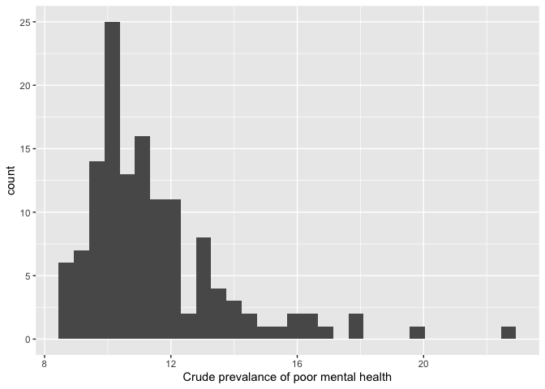
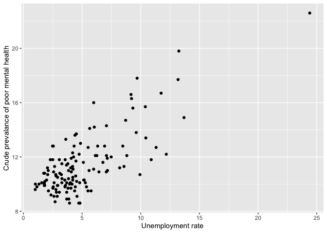
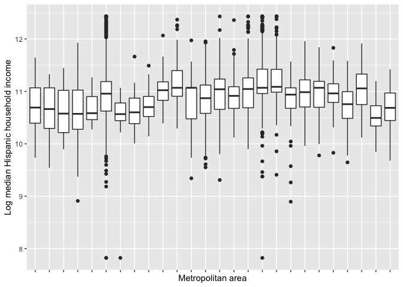
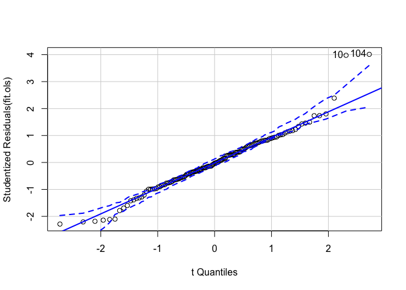
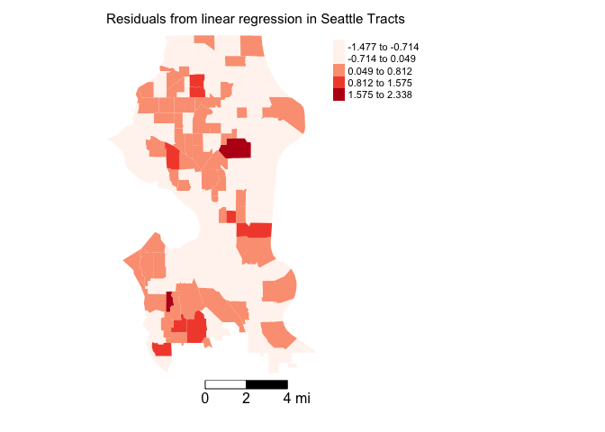
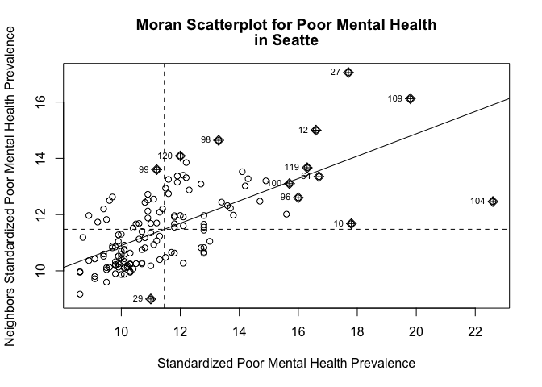

<style>
p.comment {
background-color: #DBDBDB;
padding: 10px;
border: 1px solid black;
margin-left: 25px;
border-radius: 5px;
font-style: italic;
}

h1.title {
  font-weight: bold;
  font-family: Arial;  
}

h2.title {
  font-family: Arial;  
}

</style>


<style type="text/css">
#TOC {
  font-size: 13px;
  font-family: Arial;
}
</style>


\


In this lab, you will be learning how to run spatial regression models in R.  We focus on how to model spatial dependence both as a nuisance to control for and as a process of theoretical interest.  The objectives of the guide are as follows

1. Learn how to run a linear regression model
2. Learn the process for detecting spatial autocorrelation
3. Learn how to run a spatial lag model
4. Learn how to run a spatial error model
5. Learn how to select the appropriate model

To help us accomplish these learning objectives, we will examine the association between neighborhood characteristics and poor mental health in the City of Seattle, WA.  The methods covered in this lab follow those discussed in Handout 7. 

<div style="margin-bottom:25px;">
</div>
## **Load necessary packages**
\

We'll be introducing the following packages in this lab. Install them using `install.packages()`.


```r
install.packages("broom")
install.packages("car")
install.packages("stargazer")
install.packages("spatialreg")
```

Load in the above packages and additional packages we've already installed and will need in this lab using `library()`.


```r
library(sf)
library(tidyverse)
library(tidycensus)
library(tmap)
library(spdep)
library(tigris)
library(rmapshaper)
library(broom)
library(car)
library(spatialreg)
library(knitr)
library(stargazer)
```

<div style="margin-bottom:25px;">
</div>
## **Read in the data**
\

The following code uses the Census API to bring in 2013-2017 American Community Survey (ACS) demographic and socioeconomic tract-level data for the City of Seattle.  We won't go through each line of code in detail because we've covered all of these operations and functions in prior labs.  I've embedded comments within the code that briefly explains what each chunk is doing. Go back to prior guides (or RDS/GWR) if you need further help. 


```r
# Bring in census tract data. 
wa.tracts <- get_acs(geography = "tract", 
              year = 2017,
              variables = c(tpop = "B01003_001", tpopr = "B03002_001", 
                            nhwhite = "B03002_003", nhblk = "B03002_004",
                             nhasn = "B03002_006", hisp = "B03002_012",
                            unemptt = "B23025_003", unemp = "B23025_005",
                            povt = "B17001_001", pov = "B17001_002", 
                            colt = "B15003_001", col1 = "B15003_022", 
                            col2 = "B15003_023", col3 = "B15003_024", 
                            col4 = "B15003_025", mobt = "B07003_001", 
                            mob1 = "B07003_004"),
              state = "WA",
              survey = "acs5",
              geometry = TRUE)

# Make the data tidy, calculate percent race/ethnicity, and keep essential vars.
wa.tracts <- wa.tracts %>% 
  dplyr::select(-(moe)) %>%
  spread(key = variable, value = estimate) %>%
  mutate(pnhwhite = 100*(nhwhite/tpopr), pnhasn = 100*(nhasn/tpopr), 
              pnhblk = 100*(nhblk/tpopr), phisp = 100*(hisp/tpopr),
              unempr = 100*(unemp/unemptt),
              ppov = 100*(pov/povt), 
              pcol = 100*((col1+col2+col3+col4)/colt), 
              pmob = 100-100*(mob1/mobt)) %>%
  dplyr::select(c(GEOID,tpop, pnhwhite, pnhasn, pnhblk, phisp, ppov,
                  unempr, pcol, pmob))  

# Bring in city boundary data
pl <- places(state = "WA", year = 2017, cb = TRUE)

# Keep Seattle city
sea.city <- filter(pl, NAME == "Seattle")

#Clip tracts using Seattle boundary
sea.tracts <- ms_clip(target = wa.tracts, clip = sea.city, remove_slivers = TRUE)

#reproject to UTM NAD 83
sea.tracts <-st_transform(sea.tracts, 
                                 crs = "+proj=utm +zone=10 +datum=NAD83 +ellps=GRS80")
#make GEOID into numeric
sea.tracts <- sea.tracts %>%
              mutate(GEOID = as.numeric(GEOID))
```

Next, bring in a neighborhood-level measure of resident mental health. This measure is the 2017 crude prevalence of residents aged 18 years and older reporting that their mental health is not good.  Data come from the Centers for Disease Control and Prevention (CDC) 500 cities project, which uses the [Behavioral Risk Factor Surveillance System (BRFSS)](https://www.cdc.gov/brfss/index.html) to estimate tract-level prevalence of health characteristics. The data were downloaded from the [CDC website](https://chronicdata.cdc.gov/500-Cities/500-Cities-Census-Tract-level-Data-GIS-Friendly-Fo/k86t-wghb), which also includes the data's metadata.

I cleaned the file and uploaded it onto GitHub.  Read it in using `read_csv()`.


```r
cdcfile <- read_csv("https://raw.githubusercontent.com/crd230/data/master/500_Cities__Census_Tract-level_Data__GIS_Friendly_Format___2019_release.csv")
```

Take a look at what we brought in.


```r
glimpse(cdcfile)
```

Keep the tract ID *TractFIPS* and the mental health measure *MHLTH_CrudePrev*. 


```r
cdcfile <- cdcfile %>%
            select(TractFIPS, MHLTH_CrudePrev)
```

Then join to *sea.tracts*.


```r
sea.tracts <- left_join(sea.tracts, cdcfile, by = c("GEOID" = "TractFIPS"))
```

Look at your dataset to make sure the data wrangling went as expected.  


<div style="margin-bottom:25px;">
</div>
## **Exploratory Data Analysis**
\

We're interested in examining the demographic and socioeconomic neighborhood characteristics associated with neighborhood-level poor mental health in Seattle. Specifically, we are interested in the relationship between poor mental health and the unemployment rate *unempr*, the percent of residents who moved in the past year *pmob*, percent of 25 year olds with a college degree *pcol*, percent poverty *ppov*, percent non-Hispanic black *pnhblk*, percent Hispanic *phisp*, and the log population size. Before running any model, we should conduct an Exploratory Data Analysis (EDA), an approach focused on descriptively understanding the data without employing any formal statistical modelling.  EDA graphical and visual methods are used to identify data properties for purposes of pattern detection in data, hypothesis formulation from the data, and aspects of models assessment (e.g., goodness-of-fit). With EDA the emphasis is on descriptive methods rather than formal hypothesis testing.

The central purpose of EDA is to numerically and visually summarize the data to get a broad understanding of the distribution and scale of each variable in the analysis. This includes examining basic summary statistics like the mean, median and standard deviation. For example, we can use our friend `summary()` to get standard summary statistics of our variables of interest.


```r
sea.tracts %>%
  select(MHLTH_CrudePrev, unempr, pmob, pcol, ppov, pnhblk, phisp, tpop) %>%
  st_drop_geometry() %>%
  summary()
```

```
##  MHLTH_CrudePrev     unempr            pmob             pcol      
##  Min.   : 8.60   Min.   : 1.004   Min.   : 5.256   Min.   :12.48  
##  1st Qu.:10.00   1st Qu.: 2.806   1st Qu.:14.156   1st Qu.:49.91  
##  Median :10.90   Median : 4.146   Median :19.833   Median :65.86  
##  Mean   :11.46   Mean   : 4.999   Mean   :22.384   Mean   :60.58  
##  3rd Qu.:12.10   3rd Qu.: 6.036   3rd Qu.:28.095   3rd Qu.:74.01  
##  Max.   :22.60   Max.   :24.397   Max.   :64.935   Max.   :87.44  
##       ppov            pnhblk           phisp               tpop     
##  Min.   : 1.298   Min.   : 0.000   Min.   : 0.03873   Min.   :1045  
##  1st Qu.: 6.400   1st Qu.: 1.105   1st Qu.: 3.69254   1st Qu.:4051  
##  Median : 9.595   Median : 3.098   Median : 5.24777   Median :4938  
##  Mean   :13.161   Mean   : 6.934   Mean   : 6.48659   Mean   :5206  
##  3rd Qu.:15.897   3rd Qu.: 9.669   3rd Qu.: 7.91549   3rd Qu.:6613  
##  Max.   :58.707   Max.   :37.130   Max.   :34.55230   Max.   :8862
```

Summary statistics can provide a lot of information, but sometimes a picture is worth a thousand words (or numbers).  As such, visualizations like charts and plots are also important tools in EDA.  We learned about **ggplot** in [Lab 2](https://crd230.github.io/lab2.html#Summarizing_variables_using_graphs), which is the main **tidyverse** package for running visualizations.  For example, we can visualize the distribution of our dependent variable *MHLTH_CrudePrev* using a histogram.  This will help us to detect errors and outliers, and determine if we need to transform the variable to meet normality assumptions.


```r
sea.tracts %>%
  ggplot() +
    geom_histogram(aes(x=MHLTH_CrudePrev)) +
    xlab("Crude prevalance of poor mental health")
```

<!-- -->

We can also create visuals descriptively showing the relationship between our independent variables and the dependent variable. For example, let's examine a scatterplot of poor mental health and the unemployment rate.


```r
sea.tracts %>%
  ggplot() +
    geom_point(aes(x = unempr, y = MHLTH_CrudePrev)) +
    xlab("Unemployment rate") +
    ylab("Crude prevalance of poor mental health")
```

<!-- -->

We can pair the scatterplot with the correlation coefficient.


```r
cor(sea.tracts$MHLTH_CrudePrev, sea.tracts$unempr)
```

```
## [1] 0.7523409
```

That's a pretty high value.

EDA is typically taught in standard introductory statistics courses (and can be and often is taught as its own course). You just got a taste of EDA above. If you would like to see more, check out [Chapter 7](https://r4ds.had.co.nz/exploratory-data-analysis.html) in RDS or Roger Peng's online book [Exploratory Data Analysis in R](https://bookdown.org/rdpeng/exdata/).

<div style="margin-bottom:25px;">
</div>
## **Standard linear regression**
\

Our task is to examine the relationship between neighborhood socioeconomic and demographic characteristics and the prevalence of poor health at the neighborhood level. Let's first run a simple linear regression.  The outcome is poor mental health and the independent variable is unemployment rate *unempr* (I start with the unemployment rate for no special reason). We estimate regression models in R using the function `lm()`.  We save the results of the model into the object *fit.ols.simple*.


```r
fit.ols.simple <- lm(MHLTH_CrudePrev ~ unempr, data = sea.tracts)
```

The first argument in `lm()` takes on a formula object. A formula is indicated by a tilde `~`. The dependent variable *MHLTH_CrudePrev* comes first, followed by the tilde `~`, and then the independent variables.  You can run generalized linear models, which allows you to run different types of regression models (e.g. logit) using the function `glm()`. 

We can look at a summary of results using the `summary()` function


```r
summary(fit.ols.simple)
```

```
## 
## Call:
## lm(formula = MHLTH_CrudePrev ~ unempr, data = sea.tracts)
## 
## Residuals:
##     Min      1Q  Median      3Q     Max 
## -3.3314 -1.0164 -0.0149  0.9413  4.0382 
## 
## Coefficients:
##             Estimate Std. Error t value Pr(>|t|)    
## (Intercept)  8.84902    0.23835   37.13   <2e-16 ***
## unempr       0.52198    0.03993   13.07   <2e-16 ***
## ---
## Signif. codes:  0 '***' 0.001 '**' 0.01 '*' 0.05 '.' 0.1 ' ' 1
## 
## Residual standard error: 1.502 on 131 degrees of freedom
## Multiple R-squared:  0.566,	Adjusted R-squared:  0.5627 
## F-statistic: 170.9 on 1 and 131 DF,  p-value: < 2.2e-16
```

What does the value of the coefficient for *unempr* mean? Is the value statistically significant from 0?  The summary also provides model fit statistics (e.g. R-squared, F stat).

Let's next run a multiple linear regression. In addition to the unemployment rate *unempr*, we will include the percent of residents who moved in the past year *pmob*, percent of 25 year olds with a college degree *pcol*, percent poverty *ppov*, percent non-Hispanic black *pnhblk*, percent Hispanic *phisp*, and the log population size.   We save the results of the model into the object *fit.ols*.


```r
fit.ols <- lm(MHLTH_CrudePrev ~ unempr + pmob + pcol + ppov + pnhblk + phisp + log(tpop), data = sea.tracts)
```

The independent variables are separated by the `+` sign. Note that I logged population size using the function `log()`.  We can look at a summary of results using the `summary()` function


```r
summary(fit.ols)
```

```
## 
## Call:
## lm(formula = MHLTH_CrudePrev ~ unempr + pmob + pcol + ppov + 
##     pnhblk + phisp + log(tpop), data = sea.tracts)
## 
## Residuals:
##      Min       1Q   Median       3Q      Max 
## -1.47690 -0.40419 -0.01758  0.42427  2.33766 
## 
## Coefficients:
##              Estimate Std. Error t value Pr(>|t|)    
## (Intercept)  9.088319   1.393019   6.524 1.53e-09 ***
## unempr       0.090346   0.025929   3.484 0.000681 ***
## pmob         0.004222   0.007091   0.595 0.552608    
## pcol        -0.034845   0.006390  -5.453 2.54e-07 ***
## ppov         0.149402   0.009736  15.346  < 2e-16 ***
## pnhblk      -0.015599   0.009847  -1.584 0.115693    
## phisp        0.028165   0.015996   1.761 0.080719 .  
## log(tpop)    0.222953   0.164192   1.358 0.176949    
## ---
## Signif. codes:  0 '***' 0.001 '**' 0.01 '*' 0.05 '.' 0.1 ' ' 1
## 
## Residual standard error: 0.6642 on 125 degrees of freedom
## Multiple R-squared:  0.919,	Adjusted R-squared:  0.9144 
## F-statistic: 202.5 on 7 and 125 DF,  p-value: < 2.2e-16
```

We can make the results look "tidy" by using the function `tidy()`, which is a part of the **broom** package.


```r
tidy(fit.ols)
```

```
## # A tibble: 8 x 5
##   term        estimate std.error statistic  p.value
##   <chr>          <dbl>     <dbl>     <dbl>    <dbl>
## 1 (Intercept)  9.09      1.39        6.52  1.53e- 9
## 2 unempr       0.0903    0.0259      3.48  6.81e- 4
## 3 pmob         0.00422   0.00709     0.595 5.53e- 1
## 4 pcol        -0.0348    0.00639    -5.45  2.54e- 7
## 5 ppov         0.149     0.00974    15.3   1.56e-30
## 6 pnhblk      -0.0156    0.00985    -1.58  1.16e- 1
## 7 phisp        0.0282    0.0160      1.76  8.07e- 2
## 8 log(tpop)    0.223     0.164       1.36  1.77e- 1
```

A positive coefficient represents a positive association with poor mental health.  We use a p-value threshold of 0.05 to indicate a significant result (e.g. a p-value less than 0.05 indicates that the coefficient is significantly different from 0 or no association). It appears that higher unemployment and poverty rates are associated with higher levels of poor mental health whereas higher percent college educated is associated with lower levels.

<div style="margin-bottom:25px;">
</div>
### **Diagnostics**
\

R has some useful commands for running diagnostics to see if a regression model has some problems, specifically if it’s breaking any of the OLS assumptions outlined in Handout 7.  One assumption is that the errors are normally distributed. We can visually inspect for violations of this assumption using a number of different charts and plots.  First, we can create a basic histogram of the residuals.  To extract the residuals from the saved regression model, use the function `resid()`.


```r
ggplot() + 
  geom_histogram(mapping = aes(x=resid(fit.ols))) +
  xlab("OLS residuals")
```

<!-- -->

Normally distributed residuals should show a bell curve pattern. One problem with the histogram is its sensitivity to the choice of breakpoints for the bars - small changes can alter the visual impression quite drastically in some cases. 

Another visual tool for checking normality is the quantile-quantile (Q-Q) plot, which plots the quantile of the residuals against the expected quantile of the standard normal distribution. We use the function `qqPlot()`, which is a part of the **car** package.


```r
#QQ plot
qqPlot(fit.ols)
```

<!-- -->

```
## [1]  10 104
```

The above figure is a quantile-comparison plot, graphing for each observation its `fit.ols` model residual on the y axis and the corresponding quantile in the t-distribution on the x axis. In contrast to the histogram, the q-q plot is more straightforward and effective and it is generally easier to assess whether the points are close to the diagonal line. The dashed lines indicate 95% confidence intervals calculated under the assumption that the errors are normally distributed. If a significant number of observations fall outside this range, this is an indication that the normality assumption has been violated.  It looks like the vast majority of our points are within the band.  

Another assumption is that errors are not heteroskedastic - that is the variance of residuals are constant.  You can plot the residuals to explore the presence of heteroskedasticity.  If we see the spread of the points narrow or widen from left to right, heteroskedasticity is present.  


```r
plot(resid(fit.ols))
```

<!-- -->

There appears to be no pattern, just a cloud of points, suggesting no presence of heteroskedasticity.  Hooray!

We won't go through all the tools and approaches to testing the OLS assumptions (and other OLS issues) because it is beyond the scope of this course.  In this lab, we're interested in determining whether our models need to incorporate spatial dependency, an issue if not corrected will break assumptions 3 and 5 in Handout 7.  We focus on this task in the following sections.

<div style="margin-bottom:25px;">
</div>
## **Exploratory Spatial Data Analysis**
\

The above sections go through the steps conducted in non spatial regression analysis. The focus of this lab, however, is to account for spatial dependence in the error term and the dependent variable. Before doing any kind of spatial modelling, you should conduct an Exploratory Spatial Data Analysis (ESDA) to gain an understanding of how your data are spatially structured. ESDA is a subset of EDA methods that focus on the distinguishing characteristics of geographical data and, specifically, on spatial autocorrelation and spatial heterogeneity. ESDA techniques can help detect spatial patterns in data, lead to the formulation of hypotheses based on the geography of the data, and in assessing spatial models. 

<div style="margin-bottom:25px;">
</div>
### **Map your data**
\

The first step in ESDA is to map your dependent variable.  Let's map neighborhood prevalence of poor mental health using our trusty friend `tm_shape()`.  You want to visually detect for spatial dependency or autocorrelation in your outcome.


```r
tm_shape(sea.tracts, unit = "mi") +
  tm_polygons(col = "MHLTH_CrudePrev", style = "quantile",palette = "Reds", 
              border.alpha = 0, title = "") +
  tm_scale_bar(breaks = c(0, 2, 4), text.size = 1, position = c("right", "bottom")) +
  tm_layout(main.title = "Poor Mental Health Prevalence, Seattle 2017 ",  main.title.size = 0.95, frame = FALSE, legend.outside = TRUE, 
            attr.outside = TRUE)
```

<!-- -->


Next, you'll want to map the residuals from your regression model to see if there is visual evidence of spatial autocorrelation in the error. To extract the residuals from *fit.ols*, use the `resid()` function.  Save it back into *sea.tracts*.


```r
sea.tracts <- sea.tracts %>%
              mutate(olsresid = resid(fit.ols))
```

Plot the residuals.  


```r
tm_shape(sea.tracts, unit = "mi") +
  tm_polygons(col = "olsresid", style = "equal",palette = "Reds", 
              border.alpha = 0, title = "") +
  tm_scale_bar(breaks = c(0, 2, 4), text.size = 1, position = c("right", "bottom")) +
  tm_layout(main.title = "Residuals from linear regression in Seattle Tracts",  main.title.size = 0.95, frame = FALSE, legend.outside = TRUE,
            attr.outside = TRUE)
```

<!-- -->

Both the outcome and the residuals appear to cluster.  Let's move forward then.

<div style="margin-bottom:25px;">
</div>
### **Spatial Autocorrelation**
\

There appears to be evidence of clustering based on the exploratory maps. Rather than eyeballing it, let’s formally test it by using a measure of spatial autocorrelation, which we covered in [Lab 7](https://crd230.github.io/lab7.html).  Before we do so, we need to create a spatial weights matrix, which we also covered in [Lab 7](https://crd230.github.io/lab7.html#Spatial_weights_matrix).  Let's use Queen contiguity with row-standardized weights.   First, create the neighbor *nb* object.


```r
seab<-poly2nb(sea.tracts, queen=T)
```

Then the *listw*  weights object.


```r
seaw<-nb2listw(seab, style="W", zero.policy = TRUE)
```


Next, examine the Moran scatterplot, which we covered in [Lab 7](https://crd230.github.io/lab7.html#Moran_Scatterplot).


```r
moran.plot(sea.tracts$MHLTH_CrudePrev, listw=seaw, xlab="Standardized Poor Mental Health Prevalence", ylab="Neighbors Standardized Poor Mental Health Prevalence",
main=c("Moran Scatterplot for Poor Mental Health", "in Seatte") )
```

<!-- -->

Does it look like there is an association? Yes.

Finally, the Global Moran's I.  We use monte carlo simulation to get the p-value.


```r
moran.mc(sea.tracts$MHLTH_CrudePrev, seaw, nsim=999)
```

```
## 
## 	Monte-Carlo simulation of Moran I
## 
## data:  sea.tracts$MHLTH_CrudePrev 
## weights: seaw  
## number of simulations + 1: 1000 
## 
## statistic = 0.39728, observed rank = 1000, p-value = 0.001
## alternative hypothesis: greater
```

Repeat for the OLS residuals using the `lm.morantest()` function.


```r
lm.morantest(fit.ols, seaw)
```

```
## 
## 	Global Moran I for regression residuals
## 
## data:  
## model: lm(formula = MHLTH_CrudePrev ~ unempr + pmob + pcol + ppov +
## pnhblk + phisp + log(tpop), data = sea.tracts)
## weights: seaw
## 
## Moran I statistic standard deviate = 3.9687, p-value = 3.614e-05
## alternative hypothesis: greater
## sample estimates:
## Observed Moran I      Expectation         Variance 
##      0.175864778     -0.025326838      0.002570005
```

Both the dependent variable and the residuals indicate spatial autocorrelation, although the Moran's I for the residuals is not strong (but significant).

You should use other spatial weight matrices to test the robustness of your ESDA results. For example, do you get similar results using a 3-nearest neighbor definition?  What about a 2000 meter definition?

<div style="margin-bottom:25px;">
</div>
## **Spatial lag model**
\

Based on the exploratory mapping, Moran scatterplot, and the global Moran's I, there appears to be spatial autocorrelation in the dependent variable.  This means that if there is a spatial lag process going on and we fit an OLS model our coefficients will be biased and inefficient.  That is, the coefficient sizes and signs are not close to their true value and its standard errors are underestimated. This means [trouble](https://www.youtube.com/watch?v=FPzI4dpEcF8). [Big trouble](https://www.youtube.com/watch?v=cGIIhcMCquc). [Real big trouble](https://www.youtube.com/watch?v=AXsBBqPb5YE).


As outlined in Handout 7, there are two standard types of spatial regression models: a spatial lag model, which models dependency in the outcome, and a spatial error model, which models dependency in the residuals. A spatial lag model (SLM) can be estimated in R using the command `lagsarlm()`, which is a part of the **spatialreg** package.  


```r
fit.lag<-lagsarlm(MHLTH_CrudePrev ~ unempr + pmob+ pcol + ppov + pnhblk  + phisp + log(tpop),  data = sea.tracts, listw = seaw) 
```

The only real difference between the code for `lm()` and `lagsarlm()` is the argument `listw`, which you use to specify the spatial weights matrix.  Get a summary of the  results.


```r
summary(fit.lag)
```

```
## 
## Call:lagsarlm(formula = MHLTH_CrudePrev ~ unempr + pmob + pcol + ppov + 
##     pnhblk + phisp + log(tpop), data = sea.tracts, listw = seaw)
## 
## Residuals:
##       Min        1Q    Median        3Q       Max 
## -1.494101 -0.412011 -0.012753  0.446070  2.279226 
## 
## Type: lag 
## Coefficients: (asymptotic standard errors) 
##               Estimate Std. Error z value  Pr(>|z|)
## (Intercept)  9.5003409  1.5662067  6.0658 1.313e-09
## unempr       0.0904386  0.0251047  3.6025 0.0003152
## pmob         0.0039999  0.0068667  0.5825 0.5602229
## pcol        -0.0360700  0.0065844 -5.4781 4.299e-08
## ppov         0.1516731  0.0100004 15.1666 < 2.2e-16
## pnhblk      -0.0161411  0.0095358 -1.6927 0.0905151
## phisp        0.0277670  0.0155579  1.7848 0.0743011
## log(tpop)    0.2280948  0.1590558  1.4341 0.1515565
## 
## Rho: -0.034898, LR test value: 0.38247, p-value: 0.53628
## Asymptotic standard error: 0.055763
##     z-value: -0.62583, p-value: 0.53142
## Wald statistic: 0.39167, p-value: 0.53142
## 
## Log likelihood: -129.9789 for lag model
## ML residual variance (sigma squared): 0.41332, (sigma: 0.6429)
## Number of observations: 133 
## Number of parameters estimated: 10 
## AIC: 279.96, (AIC for lm: 278.34)
## LM test for residual autocorrelation
## test value: 14.719, p-value: 0.00012481
```


The unemployment rate, percent college educated and percent poverty continue to be statistically significant.  The lag parameter is Rho, whose value is quite small at -0.035 and not statistically significant across all tests.  This indicates that the spatial lag in the dependent variable is accounted for through the demographic and socioeconomic variables already included in the model.  This likely shows that a spatial lag on the dependent variable is not needed.  But, we'll test this further later in the lab.

<div style="margin-bottom:25px;">
</div>
## **Spatial error model**
\

The spatial error model (SEM) incorporates spatial dependence in the errors. If there is a spatial error process going on and we fit an OLS model our coefficients will be unbiased but inefficient.  That is, the coefficient size and sign are asymptotically correct but its standard errors are underestimated. 

We can estimate a  spatial error model in R using the command `errorsarlm()` also in the **spatialreg** package.


```r
fit.err<-errorsarlm(MHLTH_CrudePrev ~ unempr + pmob+ pcol + ppov + pnhblk  + phisp + log(tpop),  data = sea.tracts, listw = seaw) 
```

A summary of the modelling results


```r
summary(fit.err)
```

```
## 
## Call:errorsarlm(formula = MHLTH_CrudePrev ~ unempr + pmob + pcol + 
##     ppov + pnhblk + phisp + log(tpop), data = sea.tracts, listw = seaw)
## 
## Residuals:
##       Min        1Q    Median        3Q       Max 
## -1.365103 -0.419244 -0.015275  0.413074  1.964454 
## 
## Type: error 
## Coefficients: (asymptotic standard errors) 
##               Estimate Std. Error z value  Pr(>|z|)
## (Intercept) 11.6061151  1.3058441  8.8878 < 2.2e-16
## unempr       0.0780587  0.0229153  3.4064 0.0006583
## pmob         0.0147918  0.0077040  1.9200 0.0548564
## pcol        -0.0429317  0.0068995 -6.2224 4.896e-10
## ppov         0.1442649  0.0096688 14.9206 < 2.2e-16
## pnhblk      -0.0041949  0.0103829 -0.4040 0.6861972
## phisp        0.0175817  0.0146865  1.1971 0.2312555
## log(tpop)   -0.0286693  0.1502948 -0.1908 0.8487186
## 
## Lambda: 0.51295, LR test value: 14.233, p-value: 0.00016152
## Asymptotic standard error: 0.098797
##     z-value: 5.1919, p-value: 2.0814e-07
## Wald statistic: 26.956, p-value: 2.0814e-07
## 
## Log likelihood: -123.0536 for error model
## ML residual variance (sigma squared): 0.35148, (sigma: 0.59286)
## Number of observations: 133 
## Number of parameters estimated: 10 
## AIC: 266.11, (AIC for lm: 278.34)
```

The unemployment rate, percent college educated and percent poverty continue to be statistically significant.  The lag error parameter Lambda is positive and significant, indicating the need to control for spatial autocorrelation in the error.

<div style="margin-bottom:25px;">
</div>
## **Presenting your results**
\

An organized table of results is an essential component not just in academic papers, but in any professional report or presentation.  Up till this point, we've been reporting results by simply summarizing objects, like the following


```r
summary(fit.ols)
```

We also used the function `tidy()` above to create a tibble of modelling results. We can make these results prettier by using a couple of functions for making nice tables in R. First, there is the `kable()` function from the **knitr** package.   


```r
fit.ols %>% 
  tidy() %>%
  kable(digits = 3)
```


|term        | estimate| std.error| statistic| p.value|
|:-----------|--------:|---------:|---------:|-------:|
|(Intercept) |    9.088|     1.393|     6.524|   0.000|
|unempr      |    0.090|     0.026|     3.484|   0.001|
|pmob        |    0.004|     0.007|     0.595|   0.553|
|pcol        |   -0.035|     0.006|    -5.453|   0.000|
|ppov        |    0.149|     0.010|    15.346|   0.000|
|pnhblk      |   -0.016|     0.010|    -1.584|   0.116|
|phisp       |    0.028|     0.016|     1.761|   0.081|
|log(tpop)   |    0.223|     0.164|     1.358|   0.177|

There are options within `kable()` to control whether row names are included or not, column alignment, and other options that depend on the output type.

The table produced by `kable()`looks good. But what if we want to present results for more than one model, such as presenting *fit.ols*, *fit.lag*, and *fit.err* side by side? We can use the `stargazer()` function from the **stargazer** package to do this.


```r
stargazer(fit.ols, fit.lag, fit.err, type = "html",
                    title="Title: Regression Results")
```


<table style="text-align:center"><caption><strong>Title: Regression Results</strong></caption>
<tr><td colspan="4" style="border-bottom: 1px solid black"></td></tr><tr><td style="text-align:left"></td><td colspan="3"><em>Dependent variable:</em></td></tr>
<tr><td></td><td colspan="3" style="border-bottom: 1px solid black"></td></tr>
<tr><td style="text-align:left"></td><td colspan="3">MHLTH_CrudePrev</td></tr>
<tr><td style="text-align:left"></td><td><em>OLS</em></td><td><em>spatial</em></td><td><em>spatial</em></td></tr>
<tr><td style="text-align:left"></td><td><em></em></td><td><em>autoregressive</em></td><td><em>error</em></td></tr>
<tr><td style="text-align:left"></td><td>(1)</td><td>(2)</td><td>(3)</td></tr>
<tr><td colspan="4" style="border-bottom: 1px solid black"></td></tr><tr><td style="text-align:left">unempr</td><td>0.090<sup>***</sup></td><td>0.090<sup>***</sup></td><td>0.078<sup>***</sup></td></tr>
<tr><td style="text-align:left"></td><td>(0.026)</td><td>(0.025)</td><td>(0.023)</td></tr>
<tr><td style="text-align:left"></td><td></td><td></td><td></td></tr>
<tr><td style="text-align:left">pmob</td><td>0.004</td><td>0.004</td><td>0.015<sup>*</sup></td></tr>
<tr><td style="text-align:left"></td><td>(0.007)</td><td>(0.007)</td><td>(0.008)</td></tr>
<tr><td style="text-align:left"></td><td></td><td></td><td></td></tr>
<tr><td style="text-align:left">pcol</td><td>-0.035<sup>***</sup></td><td>-0.036<sup>***</sup></td><td>-0.043<sup>***</sup></td></tr>
<tr><td style="text-align:left"></td><td>(0.006)</td><td>(0.007)</td><td>(0.007)</td></tr>
<tr><td style="text-align:left"></td><td></td><td></td><td></td></tr>
<tr><td style="text-align:left">ppov</td><td>0.149<sup>***</sup></td><td>0.152<sup>***</sup></td><td>0.144<sup>***</sup></td></tr>
<tr><td style="text-align:left"></td><td>(0.010)</td><td>(0.010)</td><td>(0.010)</td></tr>
<tr><td style="text-align:left"></td><td></td><td></td><td></td></tr>
<tr><td style="text-align:left">pnhblk</td><td>-0.016</td><td>-0.016<sup>*</sup></td><td>-0.004</td></tr>
<tr><td style="text-align:left"></td><td>(0.010)</td><td>(0.010)</td><td>(0.010)</td></tr>
<tr><td style="text-align:left"></td><td></td><td></td><td></td></tr>
<tr><td style="text-align:left">phisp</td><td>0.028<sup>*</sup></td><td>0.028<sup>*</sup></td><td>0.018</td></tr>
<tr><td style="text-align:left"></td><td>(0.016)</td><td>(0.016)</td><td>(0.015)</td></tr>
<tr><td style="text-align:left"></td><td></td><td></td><td></td></tr>
<tr><td style="text-align:left">log(tpop)</td><td>0.223</td><td>0.228</td><td>-0.029</td></tr>
<tr><td style="text-align:left"></td><td>(0.164)</td><td>(0.159)</td><td>(0.150)</td></tr>
<tr><td style="text-align:left"></td><td></td><td></td><td></td></tr>
<tr><td style="text-align:left">Constant</td><td>9.088<sup>***</sup></td><td>9.500<sup>***</sup></td><td>11.606<sup>***</sup></td></tr>
<tr><td style="text-align:left"></td><td>(1.393)</td><td>(1.566)</td><td>(1.306)</td></tr>
<tr><td style="text-align:left"></td><td></td><td></td><td></td></tr>
<tr><td colspan="4" style="border-bottom: 1px solid black"></td></tr><tr><td style="text-align:left">Observations</td><td>133</td><td>133</td><td>133</td></tr>
<tr><td style="text-align:left">R<sup>2</sup></td><td>0.919</td><td></td><td></td></tr>
<tr><td style="text-align:left">Adjusted R<sup>2</sup></td><td>0.914</td><td></td><td></td></tr>
<tr><td style="text-align:left">Log Likelihood</td><td></td><td>-129.979</td><td>-123.054</td></tr>
<tr><td style="text-align:left">sigma<sup>2</sup></td><td></td><td>0.413</td><td>0.351</td></tr>
<tr><td style="text-align:left">Akaike Inf. Crit.</td><td></td><td>279.958</td><td>266.107</td></tr>
<tr><td style="text-align:left">Residual Std. Error</td><td>0.664 (df = 125)</td><td></td><td></td></tr>
<tr><td style="text-align:left">F Statistic</td><td>202.528<sup>***</sup> (df = 7; 125)</td><td></td><td></td></tr>
<tr><td style="text-align:left">Wald Test (df = 1)</td><td></td><td>0.392</td><td>26.956<sup>***</sup></td></tr>
<tr><td style="text-align:left">LR Test (df = 1)</td><td></td><td>0.382</td><td>14.233<sup>***</sup></td></tr>
<tr><td colspan="4" style="border-bottom: 1px solid black"></td></tr><tr><td style="text-align:left"><em>Note:</em></td><td colspan="3" style="text-align:right"><sup>*</sup>p<0.1; <sup>**</sup>p<0.05; <sup>***</sup>p<0.01</td></tr>
</table>


\

There are a number of options you can tweak to make the table more presentation ready, such as adding footnotes and changing column and row labels.

Note three things: First, if you ran the `stargazer()` function above directly in your R console, you'll get output that won't make sense.  Knit the document and you'll see your pretty table. Second, you will need to add `results = 'asis'` as an R Markdown chunk option (````{r results = 'asis'}`).


<div style="margin-bottom:25px;">
</div>
## **Picking a model**
\

<div style="margin-bottom:25px;">
</div>
### **Akaike Information Criterion**
\


As we discussed in this week's handout, there are many fit statistics and tests to determine which model - OLS, SLM or SEM - is most appropriate.  One way of deciding which model is appropriate is to examine the fit statistic Akaike Information Criterion (AIC), which is a index of sorts to indicate how close the model is to reality.  A lower value indicates a better fitting model.  

You can extract the AIC from a model by using the function `AIC()`, which is  a part of the pre-installed **stats** package.  What is the AIC for the regular OLS model? 


```r
AIC(fit.ols)
```

```
## [1] 278.3402
```

What about the spatial lag and error models?


```r
AIC(fit.lag)
```

```
## [1] 279.9578
```

```r
AIC(fit.err)
```

```
## [1] 266.1073
```

Let's extract the AICs, save them in a vector and then present them in a table using `kable()`.


```r
#Save AIC values
AICs<-c(AIC(fit.ols),AIC(fit.lag), AIC(fit.err))
labels<-c("OLS", "SLM","SEM" )

kable(data.frame(Models=labels, AIC=round(AICs, 2)))
```


|Models |    AIC|
|:------|------:|
|OLS    | 278.34|
|SLM    | 279.96|
|SEM    | 266.11|


<div style="margin-bottom:25px;">
</div>
### **Lagrange Multiplier test**
\

Another popular set of tests proposed by Anselin (1988) (also see Anselin et al. 1996) are the Lagrange Multiplier (LM) tests. The test compares the a model's fit relative to the OLS model.  A test showing statistical significance rejects the OLS. 


To run the LM tests in R, plug in the saved OLS model *fit.ols* into the function `lm.LMtests()`, which is a part of the **spatialreg** package.


```r
lm.LMtests(fit.ols, listw = seaw, test = "all",  zero.policy=TRUE)
```

```
## 
## 	Lagrange multiplier diagnostics for spatial dependence
## 
## data:  
## model: lm(formula = MHLTH_CrudePrev ~ unempr + pmob + pcol + ppov +
## pnhblk + phisp + log(tpop), data = sea.tracts)
## weights: seaw
## 
## LMerr = 10.681, df = 1, p-value = 0.001083
## 
## 
## 	Lagrange multiplier diagnostics for spatial dependence
## 
## data:  
## model: lm(formula = MHLTH_CrudePrev ~ unempr + pmob + pcol + ppov +
## pnhblk + phisp + log(tpop), data = sea.tracts)
## weights: seaw
## 
## LMlag = 0.37027, df = 1, p-value = 0.5429
## 
## 
## 	Lagrange multiplier diagnostics for spatial dependence
## 
## data:  
## model: lm(formula = MHLTH_CrudePrev ~ unempr + pmob + pcol + ppov +
## pnhblk + phisp + log(tpop), data = sea.tracts)
## weights: seaw
## 
## RLMerr = 14.638, df = 1, p-value = 0.0001302
## 
## 
## 	Lagrange multiplier diagnostics for spatial dependence
## 
## data:  
## model: lm(formula = MHLTH_CrudePrev ~ unempr + pmob + pcol + ppov +
## pnhblk + phisp + log(tpop), data = sea.tracts)
## weights: seaw
## 
## RLMlag = 4.3278, df = 1, p-value = 0.03749
## 
## 
## 	Lagrange multiplier diagnostics for spatial dependence
## 
## data:  
## model: lm(formula = MHLTH_CrudePrev ~ unempr + pmob + pcol + ppov +
## pnhblk + phisp + log(tpop), data = sea.tracts)
## weights: seaw
## 
## SARMA = 15.009, df = 2, p-value = 0.0005507
```

<br>

<p class="comment">**Practice Question**: Which model is "best"? Why?</p>

***
<a rel="license" href="http://creativecommons.org/licenses/by-nc/4.0/"></a><br />This work is licensed under a <a rel="license" href="http://creativecommons.org/licenses/by-nc/4.0/">Creative Commons Attribution-NonCommercial 4.0 International License</a>.


Website created and maintained by [Noli Brazil](https://nbrazil.faculty.ucdavis.edu/)
